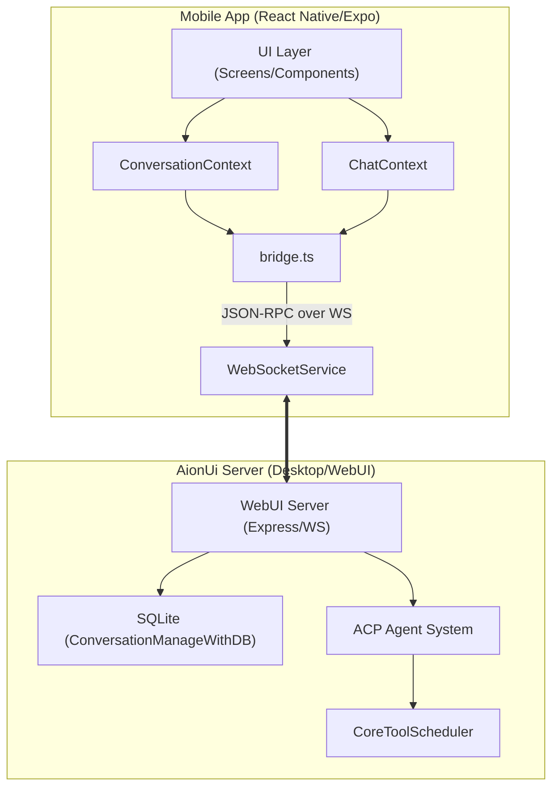

# Mobile App

Relevant source files

The following files were used as context for generating this wiki page:

- [mobile/app/(tabs)/settings/_layout.tsx](mobile/app/(tabs)/settings/_layout.tsx)
- [mobile/app/(tabs)/settings/index.tsx](mobile/app/(tabs)/settings/index.tsx)
- [mobile/src/components/chat/ChatInputBar.tsx](mobile/src/components/chat/ChatInputBar.tsx)
- [mobile/src/components/chat/ChatScreen.tsx](mobile/src/components/chat/ChatScreen.tsx)
- [mobile/src/components/chat/ConfirmationCard.tsx](mobile/src/components/chat/ConfirmationCard.tsx)
- [mobile/src/components/chat/MessageBubble.tsx](mobile/src/components/chat/MessageBubble.tsx)
- [mobile/src/components/chat/ToolCallBlock.tsx](mobile/src/components/chat/ToolCallBlock.tsx)
- [mobile/src/components/chat/ToolCallSummary.tsx](mobile/src/components/chat/ToolCallSummary.tsx)
- [mobile/src/components/conversation/ConversationItem.tsx](mobile/src/components/conversation/ConversationItem.tsx)
- [mobile/src/components/conversation/ConversationList.tsx](mobile/src/components/conversation/ConversationList.tsx)
- [mobile/src/constants/theme.ts](mobile/src/constants/theme.ts)
- [mobile/src/context/ChatContext.tsx](mobile/src/context/ChatContext.tsx)
- [mobile/src/context/ConnectionContext.tsx](mobile/src/context/ConnectionContext.tsx)
- [mobile/src/context/ConversationContext.tsx](mobile/src/context/ConversationContext.tsx)
- [mobile/src/context/WebSocketContext.tsx](mobile/src/context/WebSocketContext.tsx)
- [mobile/src/hooks/useProcessedMessages.ts](mobile/src/hooks/useProcessedMessages.ts)
- [mobile/src/i18n/locales/en-US.json](mobile/src/i18n/locales/en-US.json)
- [mobile/src/i18n/locales/zh-CN.json](mobile/src/i18n/locales/zh-CN.json)
- [mobile/src/services/api.ts](mobile/src/services/api.ts)
- [mobile/src/services/websocket.ts](mobile/src/services/websocket.ts)
- [mobile/src/utils/jwt.ts](mobile/src/utils/jwt.ts)
- [mobile/src/utils/messageAdapter.ts](mobile/src/utils/messageAdapter.ts)
- [mobile/versions/version.json](mobile/versions/version.json)

The **AionUi Mobile** app is a cross-platform companion application built with **React Native** and **Expo** [mobile/versions/version.json:2-3](). It allows users to connect to a running AionUi desktop instance or WebUI server to manage conversations, interact with AI agents, and monitor tool executions from a mobile device.

The mobile app acts as a remote client, mirroring the state and capabilities of the desktop application by communicating over a secure WebSocket connection and utilizing a bridge service to invoke server-side logic.

## High-Level Architecture

The mobile application is structured around a central set of React Context providers that manage the connection lifecycle, conversation state, and real-time messaging.

### System Overview Diagram

This diagram illustrates the relationship between mobile components and the backend server entities.

**Sources:** [mobile/src/services/websocket.ts:1-13](), [mobile/src/context/ConversationContext.tsx:106-122](), [mobile/src/context/WebSocketContext.tsx:1-15]()

## Core Subsystems

### Connection & Authentication
The app connects to the server via `WebSocketService` [mobile/src/services/websocket.ts:19](). It uses a **JWT-based authentication** flow where the token is passed via the `Sec-WebSocket-Protocol` header [mobile/src/services/websocket.ts:7-8]().
*   **QR Login:** Users can scan a QR code from the desktop app to quickly configure the host, port, and token [mobile/src/i18n/locales/en-US.json:18-23]().
*   **Token Recovery:** The `ConnectionContext` handles proactive token refreshing and automatic reconnection using exponential backoff [mobile/src/context/ConnectionContext.tsx:48-96]().
*   **Secure Storage:** Connection configurations and tokens are persisted using `expo-secure-store` [mobile/src/context/ConnectionContext.tsx:2, 168]().

For details, see [Mobile Architecture & Connection](#14.1).

### Conversation Management
The `ConversationContext` [mobile/src/context/ConversationContext.tsx:73]() serves as the primary data store for the conversation list. It synchronizes with the server's SQLite database using the `database.get-user-conversations` IPC call [mobile/src/context/ConversationContext.tsx:110]().
*   **Agent Selection:** Supports creating new chats with specific agents (Gemini, ACP, Codex, etc.) [mobile/src/context/ConversationContext.tsx:196-203]().
*   **State Sync:** Polls the conversation list every 30 seconds and refreshes immediately upon `chat.response.stream` "finish" events [mobile/src/context/ConversationContext.tsx:160-174]().

### Real-time Chat & Tool Execution
The `ChatContext` [mobile/src/context/ChatContext.tsx:23]() manages the message stream for the active conversation. 
*   **Streaming:** It listens for `chat.response.stream` events to update the UI in real-time [mobile/src/context/ChatContext.tsx:77-90]().
*   **Message Adaptation:** The `transformMessage` utility converts raw server events into `TMessage` objects for the UI [mobile/src/utils/messageAdapter.ts:44]().
*   **Tool Calls:** Specialized components like `ToolCallBlock` render the progress of agentic tools (e.g., Web Search, File Changes) [mobile/src/components/chat/ToolCallBlock.tsx:52]().
*   **Permissions:** Interactive `ConfirmationCard` components allow users to approve or deny tool executions requested by the agent [mobile/src/components/chat/MessageBubble.tsx:73-81]().

For details, see [Mobile UI & Features](#14.2).

## Mobile-Code Entity Mapping

This table maps mobile UI concepts to their underlying code implementations and server-side counterparts.

| Feature | Mobile Entity | Server IPC / Event |
| :--- | :--- | :--- |
| **Connection** | `WebSocketService` [mobile/src/services/websocket.ts:19]() | `WebUI Server` (Express) |
| **Auth** | `ConnectionProvider` [mobile/src/context/ConnectionContext.tsx:35]() | `JWT Validation` |
| **Chat History** | `ChatProvider` [mobile/src/context/ChatContext.tsx:36]() | `database.get-conversation-messages` |
| **Tool Progress** | `ToolCallBlock` [mobile/src/components/chat/ToolCallBlock.tsx:52]() | `chat.response.stream` (type: tool_call) |
| **Action Approval**| `confirmAction` [mobile/src/context/ChatContext.tsx:216]() | `confirmation.confirm` |
| **Settings** | `SettingsScreen` [mobile/app/(tabs)/settings/index.tsx:9]() | N/A (Local State) |

## Internationalization
The app supports multiple languages (currently `en-US` and `zh-CN`) through `react-i18next`. Localization strings cover all aspects of the mobile experience, including connection hints, tool status labels, and workspace management [mobile/src/i18n/locales/en-US.json](), [mobile/src/i18n/locales/zh-CN.json]().

**Sources:** [mobile/src/i18n/locales/en-US.json:1-142](), [mobile/src/i18n/locales/zh-CN.json:1-142]()

---

## Child Pages
*   [Mobile Architecture & Connection](#14.1) — Deep dive into the Expo stack, WebSocket protocol, and secure storage.
*   [Mobile UI & Features](#14.2) — Detailed breakdown of chat components, tool rendering, and the file explorer.