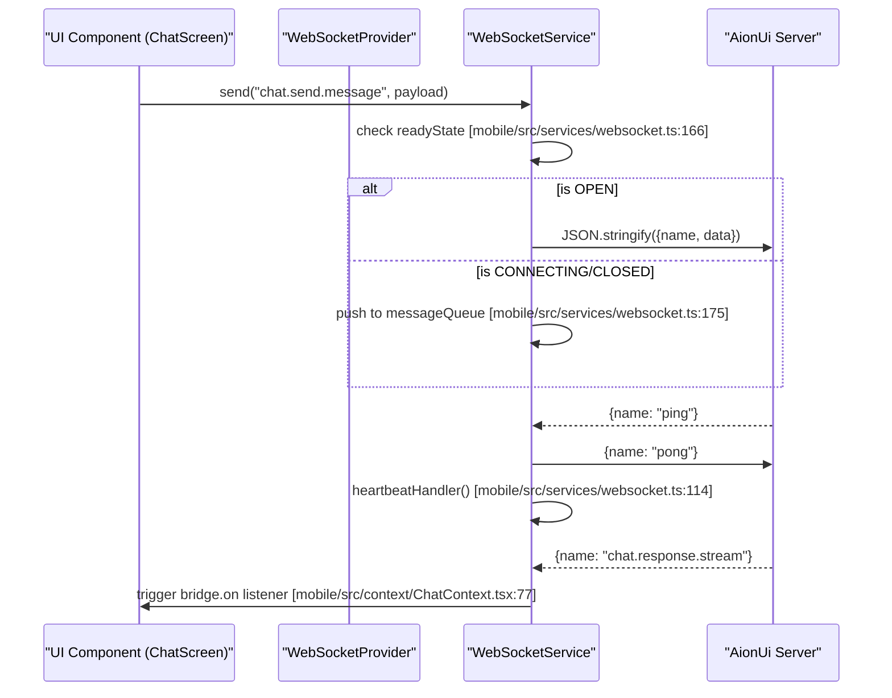
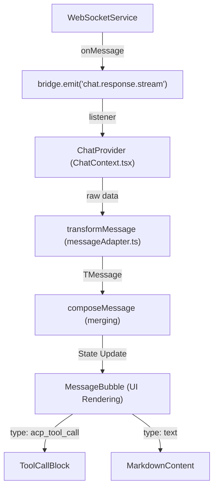

# Mobile Architecture & Connection

Relevant source files

The following files were used as context for generating this wiki page:

- [mobile/app/(tabs)/settings/_layout.tsx](mobile/app/(tabs)/settings/_layout.tsx)
- [mobile/app/(tabs)/settings/index.tsx](mobile/app/(tabs)/settings/index.tsx)
- [mobile/src/components/chat/ChatInputBar.tsx](mobile/src/components/chat/ChatInputBar.tsx)
- [mobile/src/components/chat/ChatScreen.tsx](mobile/src/components/chat/ChatScreen.tsx)
- [mobile/src/components/chat/ConfirmationCard.tsx](mobile/src/components/chat/ConfirmationCard.tsx)
- [mobile/src/components/chat/MessageBubble.tsx](mobile/src/components/chat/MessageBubble.tsx)
- [mobile/src/components/chat/ToolCallBlock.tsx](mobile/src/components/chat/ToolCallBlock.tsx)
- [mobile/src/components/chat/ToolCallSummary.tsx](mobile/src/components/chat/ToolCallSummary.tsx)
- [mobile/src/components/conversation/ConversationItem.tsx](mobile/src/components/conversation/ConversationItem.tsx)
- [mobile/src/components/conversation/ConversationList.tsx](mobile/src/components/conversation/ConversationList.tsx)
- [mobile/src/constants/theme.ts](mobile/src/constants/theme.ts)
- [mobile/src/context/ChatContext.tsx](mobile/src/context/ChatContext.tsx)
- [mobile/src/context/ConnectionContext.tsx](mobile/src/context/ConnectionContext.tsx)
- [mobile/src/context/ConversationContext.tsx](mobile/src/context/ConversationContext.tsx)
- [mobile/src/context/WebSocketContext.tsx](mobile/src/context/WebSocketContext.tsx)
- [mobile/src/hooks/useProcessedMessages.ts](mobile/src/hooks/useProcessedMessages.ts)
- [mobile/src/i18n/locales/en-US.json](mobile/src/i18n/locales/en-US.json)
- [mobile/src/i18n/locales/zh-CN.json](mobile/src/i18n/locales/zh-CN.json)
- [mobile/src/services/api.ts](mobile/src/services/api.ts)
- [mobile/src/services/websocket.ts](mobile/src/services/websocket.ts)
- [mobile/src/utils/jwt.ts](mobile/src/utils/jwt.ts)
- [mobile/src/utils/messageAdapter.ts](mobile/src/utils/messageAdapter.ts)
- [mobile/versions/version.json](mobile/versions/version.json)

The AionUi Mobile application is a companion app built using the **Expo/React Native** stack. It is designed to connect remotely to an AionUi desktop instance running in WebUI mode. The architecture centers around a persistent WebSocket connection that mirrors the desktop IPC (Inter-Process Communication) bridge, allowing the mobile client to perform complex operations like conversation management, tool execution, and file browsing via a remote server.

### Technical Stack
*   **Framework**: Expo (SDK 51+) with React Native.
*   **Navigation**: `expo-router` for file-based routing.
*   **Storage**: `expo-secure-store` for sensitive connection tokens [mobile/src/context/ConnectionContext.tsx:2-2]().
*   **Communication**: WebSocket for real-time events [mobile/src/services/websocket.ts:1-8]() and Axios for RESTful API calls [mobile/src/services/api.ts:1-5]().

---

## Connection Lifecycle & Authentication

AionUi Mobile uses a QR-code-based login flow to establish a secure link with the desktop server. This process exchanges a short-lived QR token for a long-lived JSON Web Token (JWT).

### QR Login Flow
1.  **Scanning**: The user scans a QR code generated by the AionUi Desktop (Settings -> WebUI). The URL contains the server's host, port, and a `qrToken`.
2.  **Verification**: The mobile app sends the `qrToken` to the server's auth endpoint.
3.  **Token Persistence**: Upon success, the server returns a JWT, which the app stores securely using `SecureStore` under the key `aionui_connection` [mobile/src/context/ConnectionContext.tsx:7-13]().
4.  **Handshake**: The JWT is passed to the WebSocket server via the `Sec-WebSocket-Protocol` header [mobile/src/services/websocket.ts:91-92]().

### Connection State Machine
The system tracks the connection status through the `ConnectionState` type: `disconnected`, `connecting`, `connected`, and `auth_failed` [mobile/src/services/websocket.ts:15-15]().

**Entity Association: Connection Flow**
| Code Entity | Role |
| :--- | :--- |
| `ConnectionProvider` | React Context that manages the global `config` and persistence [mobile/src/context/ConnectionContext.tsx:35-201](). |
| `wsService` | Singleton `WebSocketService` instance handling the raw socket [mobile/src/services/websocket.ts:19-35](). |
| `STORAGE_KEY` | The key used to persist `ConnectionConfig` in `SecureStore` [mobile/src/context/ConnectionContext.tsx:7-7](). |
| `attemptTokenRecovery` | Function that refreshes the JWT and reconfigures services [mobile/src/context/ConnectionContext.tsx:48-64](). |

**Sources:** [mobile/src/context/ConnectionContext.tsx:1-206](), [mobile/src/services/websocket.ts:1-150]()

---

## WebSocket & Bridge Architecture

The `WebSocketService` acts as a bridge that mirrors the desktop's IPC functionality. It wraps standard WebSocket messages into a `{ name: string, data: unknown }` format to maintain protocol compatibility with the server's browser adapter [mobile/src/services/websocket.ts:1-13]().

### Key Mechanisms
*   **Heartbeat**: The server sends `ping` messages. The client responds with `pong` and triggers the `heartbeatHandler` [mobile/src/services/websocket.ts:110-116]().
*   **Dead Connection Check**: An interval checks if the last ping was more than 50 seconds ago; if so, it terminates the socket to trigger a reconnect [mobile/src/services/websocket.ts:241-243]().
*   **Message Queuing**: If the socket is not yet open, outgoing messages are pushed to `messageQueue` and flushed once the `onopen` event fires [mobile/src/services/websocket.ts:163-180](), [mobile/src/services/websocket.ts:211-220]().
*   **Exponential Backoff**: Reconnection attempts start at 500ms and double up to a maximum of 8 seconds [mobile/src/services/websocket.ts:222-230]().

### Implementation Diagram: WebSocket Bridge

Title: WebSocket Communication Flow

**Sources:** [mobile/src/services/websocket.ts:98-220](), [mobile/src/context/ConnectionContext.tsx:98-114](), [mobile/src/context/ChatContext.tsx:73-114]()

---

## JWT Authentication Flow

The application implements proactive and reactive token management to ensure sessions remain valid without user intervention.

### Token Refresh Logic
The `ConnectionContext` monitors the JWT's expiration (`exp` claim) during every heartbeat [mobile/src/context/ConnectionContext.tsx:67-72]().
*   **Proactive Refresh**: If the token expires in less than 1 hour, `refreshToken()` is called to fetch a new JWT from the server, which is then updated in `SecureStore` and the `wsService` [mobile/src/context/ConnectionContext.tsx:74-92]().
*   **Reactive Recovery**: If the server sends an `auth-expired` message or rejects the connection with code `1008`, the `wsService` triggers the `authChallengeHandler` [mobile/src/services/websocket.ts:119-123](), [mobile/src/services/websocket.ts:135-140]().
*   **Foreground Reconnection**: The `WebSocketProvider` listens for `AppState` changes. When the app returns to the foreground, it triggers `tryReconnect` if the state is `auth_failed` or `disconnected` [mobile/src/context/WebSocketContext.tsx:25-36]().

**Entity Association: Auth Entities**
| Code Entity | Description |
| :--- | :--- |
| `decodeJwtPayload` | Utility to extract claims like `exp` from the JWT [mobile/src/utils/jwt.ts:1-5](). |
| `SecureStore` | Expo module for encrypted key-value storage [mobile/src/context/ConnectionContext.tsx:2-2](). |
| `refreshToken` | API service function that calls the server's refresh endpoint [mobile/src/services/api.ts:1-5](). |
| `authChallengeHandler` | Callback in `ConnectionContext` that attempts recovery via `attemptTokenRecovery` [mobile/src/context/ConnectionContext.tsx:100-108](). |

**Sources:** [mobile/src/context/ConnectionContext.tsx:48-96](), [mobile/src/services/websocket.ts:189-209](), [mobile/src/context/WebSocketContext.tsx:21-39]()

---

## Message Transformation & Tool Display

The mobile app replicates the desktop's message processing logic to handle streaming content and complex tool call structures.

### Message Adapter
The `transformMessage` function converts raw `IResponseMessage` from the WebSocket into a `TMessage` suitable for mobile UI rendering [mobile/src/utils/messageAdapter.ts:44-164](). 
*   **Streaming Content**: `composeMessage` handles the concatenation of text fragments and the merging of tool call updates based on `callId` or `toolCallId` [mobile/src/utils/messageAdapter.ts:170-243]().
*   **Tool Call Blocks**: The `ToolCallBlock` component renders different tool types (ACP, Codex, Gemini) and maps their statuses to mobile-friendly icons [mobile/src/components/chat/ToolCallBlock.tsx:52-155]().

### Implementation Diagram: Message Data Flow

Title: Message Processing Pipeline

**Sources:** [mobile/src/context/ChatContext.tsx:77-114](), [mobile/src/utils/messageAdapter.ts:44-243](), [mobile/src/components/chat/MessageBubble.tsx:13-105]()

---

## Context & Provider Hierarchy

The mobile app uses a deeply nested provider structure to manage global state and service availability.

### Provider Roles
*   **ConnectionProvider**: Manages host, port, token, and the lifecycle of the connection [mobile/src/context/ConnectionContext.tsx:187-201]().
*   **WebSocketProvider**: Exposes the `bridge` and `wsService` singletons to the component tree [mobile/src/context/WebSocketContext.tsx:38-38]().
*   **ConversationProvider**: Handles the list of user conversations, fetching available agents, and conversation lifecycle (create, delete, rename) [mobile/src/context/ConversationContext.tsx:90-146]().
*   **ChatProvider**: Manages the message history, streaming state, and tool confirmations for the active conversation [mobile/src/context/ChatContext.tsx:36-150]().

**Sources:** [mobile/src/context/ConnectionContext.tsx:187-201](), [mobile/src/context/WebSocketContext.tsx:21-48](), [mobile/src/context/ConversationContext.tsx:90-146](), [mobile/src/context/ChatContext.tsx:36-150]()