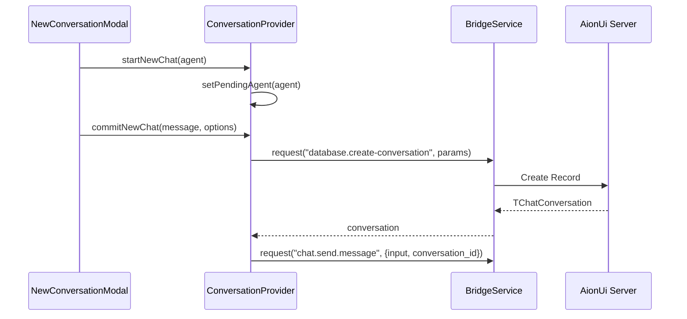
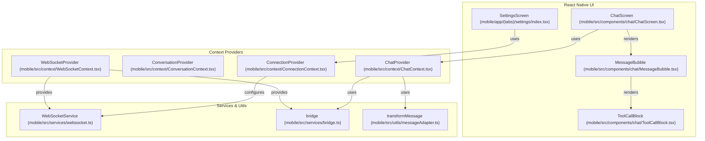

# Mobile UI & Features

Relevant source files

The following files were used as context for generating this wiki page:

- [mobile/app/(tabs)/settings/_layout.tsx](mobile/app/(tabs)/settings/_layout.tsx)
- [mobile/app/(tabs)/settings/index.tsx](mobile/app/(tabs)/settings/index.tsx)
- [mobile/src/components/chat/ChatInputBar.tsx](mobile/src/components/chat/ChatInputBar.tsx)
- [mobile/src/components/chat/ChatScreen.tsx](mobile/src/components/chat/ChatScreen.tsx)
- [mobile/src/components/chat/ConfirmationCard.tsx](mobile/src/components/chat/ConfirmationCard.tsx)
- [mobile/src/components/chat/MessageBubble.tsx](mobile/src/components/chat/MessageBubble.tsx)
- [mobile/src/components/chat/ToolCallBlock.tsx](mobile/src/components/chat/ToolCallBlock.tsx)
- [mobile/src/components/chat/ToolCallSummary.tsx](mobile/src/components/chat/ToolCallSummary.tsx)
- [mobile/src/components/conversation/ConversationItem.tsx](mobile/src/components/conversation/ConversationItem.tsx)
- [mobile/src/components/conversation/ConversationList.tsx](mobile/src/components/conversation/ConversationList.tsx)
- [mobile/src/constants/theme.ts](mobile/src/constants/theme.ts)
- [mobile/src/context/ChatContext.tsx](mobile/src/context/ChatContext.tsx)
- [mobile/src/context/ConnectionContext.tsx](mobile/src/context/ConnectionContext.tsx)
- [mobile/src/context/ConversationContext.tsx](mobile/src/context/ConversationContext.tsx)
- [mobile/src/context/WebSocketContext.tsx](mobile/src/context/WebSocketContext.tsx)
- [mobile/src/hooks/useProcessedMessages.ts](mobile/src/hooks/useProcessedMessages.ts)
- [mobile/src/i18n/locales/en-US.json](mobile/src/i18n/locales/en-US.json)
- [mobile/src/i18n/locales/zh-CN.json](mobile/src/i18n/locales/zh-CN.json)
- [mobile/src/services/api.ts](mobile/src/services/api.ts)
- [mobile/src/services/websocket.ts](mobile/src/services/websocket.ts)
- [mobile/src/utils/jwt.ts](mobile/src/utils/jwt.ts)
- [mobile/src/utils/messageAdapter.ts](mobile/src/utils/messageAdapter.ts)
- [mobile/versions/version.json](mobile/versions/version.json)

The AionUi Mobile application is a cross-platform companion built with **React Native (Expo)**. It provides a specialized interface for interacting with AI agents, managing workspace files, and monitoring complex tool-calling workflows on mobile devices. It connects to the AionUi Desktop/Server instance via a WebSocket-based bridge, mirroring the desktop IPC protocol to maintain feature parity.

## Connection & Authentication

The mobile app connects to the AionUi server using a WebSocket-based architecture managed by `ConnectionProvider` [mobile/src/context/ConnectionContext.tsx:35]().

- **QR Code Login**: Users scan a QR code from the desktop app to obtain a connection URL and JWT token [mobile/src/i18n/locales/en-US.json:18-19]().
- **Secure Storage**: Connection configurations (host, port, token) are persisted using `expo-secure-store` [mobile/src/context/ConnectionContext.tsx:168]().
- **Token Lifecycle**: The app automatically refreshes JWT tokens when they are within one hour of expiration [mobile/src/context/ConnectionContext.tsx:75-77](). It also handles auth challenges if the server returns an `auth-expired` event [mobile/src/services/websocket.ts:119-123]().
- **WebSocket Service**: A singleton `WebSocketService` manages the socket lifecycle, implementing exponential backoff for reconnections and a message queue for offline buffering [mobile/src/services/websocket.ts:19-25]().

## Conversation Management

The mobile UI revolves around a centralized conversation state managed by the `ConversationProvider` [mobile/src/context/ConversationContext.tsx:90]().

### Conversation List
The conversation list is the primary entry point for users:
- **Data Fetching**: Conversations are retrieved via the `database.get-user-conversations` bridge request [mobile/src/context/ConversationContext.tsx:110-113]().
- **Auto-Refresh**: The list polls every 30 seconds while connected [mobile/src/context/ConversationContext.tsx:160]() and refreshes when the app returns to the foreground [mobile/src/context/ConversationContext.tsx:151]().
- **Status Tracking**: Each conversation displays its current state (`pending`, `running`, or `finished`) [mobile/src/context/ConversationContext.tsx:15]().

### New Conversation & Agent Selection
Creating a new chat involves selecting an agent and optionally a workspace:
- **Agent Discovery**: Available agents are fetched via `acp.get-available-agents` [mobile/src/context/ConversationContext.tsx:185-187]().
- **Creation Logic**: The `createConversation` function maps the selected agent to a specific type (e.g., `gemini`, `codex`, or generic `acp`) [mobile/src/context/ConversationContext.tsx:201-203]().
- **Initial Message**: If a message is provided during creation, it is stored as a "pending initial message" and sent immediately after the conversation object is initialized [mobile/src/context/ChatContext.tsx:172-194]().

**Conversation Initialization Flow**

*Sources: [mobile/src/context/ConversationContext.tsx:196-230](), [mobile/src/context/ChatContext.tsx:170-194]()*

---

## Chat Interface & Tool Call Rendering

The chat screen handles complex message types beyond simple text, including multi-step tool executions and permission requests.

### Message Transformation
Raw WebSocket messages (`IResponseMessage`) are converted into renderable `TMessage` objects by `transformMessage` [mobile/src/utils/messageAdapter.ts:44](). This adapter handles:
- **Text & Markdown**: Standard AI responses [mobile/src/utils/messageAdapter.ts:56-68]().
- **Tool Calls**: Individual tool execution events [mobile/src/utils/messageAdapter.ts:70-78]().
- **Agent Status**: High-level status updates (e.g., "Thinking...") [mobile/src/utils/messageAdapter.ts:89-97]().

### Tool Call Blocks
The `ToolCallBlock` component provides specialized UI for agent actions [mobile/src/components/chat/ToolCallBlock.tsx:52]():
- **Status Icons**: Maps states like `executing`, `success`, and `error` to themed icons [mobile/src/components/chat/ToolCallBlock.tsx:22-34]().
- **ACP Mapping**: Maps internal ACP statuses (`in_progress`, `completed`, `failed`) to UI-friendly labels [mobile/src/components/chat/ToolCallBlock.tsx:38-50]().
- **Codex Features**: Specific support for `web_search_begin/end` and file diffs (`turn_diff`) [mobile/src/components/chat/ToolCallBlock.tsx:92-98]().

### Permission & Confirmation
When an agent requires authorization (e.g., to write a file), the `ChatProvider` manages the lifecycle:
- **Event Handling**: Listens for `confirmation.add`, `update`, and `remove` events from the bridge [mobile/src/context/ChatContext.tsx:117-143]().
- **Inline Rendering**: Injects `acp_permission` messages into the list [mobile/src/context/ChatContext.tsx:123-131]().
- **Action Execution**: Users approve or deny via `confirmAction`, which sends the decision back to the server [mobile/src/context/ChatContext.tsx:238-245]().

---

## Workspace & File Sidebar

The mobile app provides a dedicated view for navigating the files associated with a conversation's workspace.

- **Workspace Association**: The `Conversation` object carries workspace metadata in its `extra` field [mobile/src/context/ConversationContext.tsx:19-20]().
- **File List**: Files are typically fetched from the server based on the active conversation's workspace path [mobile/src/i18n/locales/en-US.json:101]().
- **Navigation**: Supports directory browsing, including "Parent Directory" navigation [mobile/src/i18n/locales/en-US.json:109]().
- **File Operations**: Users can copy file paths or view file information directly from the mobile UI [mobile/src/i18n/locales/en-US.json:111-112]().

---

## Internationalization (i18n)

AionUi Mobile uses `react-i18next` for localization, supporting multiple languages.

- **Supported Locales**: English (`en-US`) [mobile/src/i18n/locales/en-US.json:1]() and Simplified Chinese (`zh-CN`) [mobile/src/i18n/locales/zh-CN.json:1]().
- **Structure**: Translations are segmented into namespaces like `common`, `connect`, `chat`, and `settings` [mobile/src/i18n/locales/en-US.json:2-141]().
- **Dynamic Content**: Uses interpolation for counts and dynamic values (e.g., `{{count}} file(s) selected`) [mobile/src/i18n/locales/en-US.json:86]().

---

## Technical Architecture Mapping

**Mobile Code Entity Map**

*Sources: [mobile/src/context/ChatContext.tsx:4](), [mobile/src/context/ConnectionContext.tsx:3](), [mobile/src/components/chat/MessageBubble.tsx:7](), [mobile/src/components/chat/ToolCallBlock.tsx:1]()*

### Key State Objects
| Type | Purpose | Source |
| :--- | :--- | :--- |
| `Conversation` | Metadata for a single chat session (ID, Model, Workspace) | [mobile/src/context/ConversationContext.tsx:11-27]() |
| `TMessage` | Unified UI representation of text, tools, or status updates | [mobile/src/utils/messageAdapter.ts:23-32]() |
| `ConnectionConfig` | Server endpoint and authentication token | [mobile/src/context/ConnectionContext.tsx:9-13]() |
| `ConnectionState` | Enum: `disconnected`, `connecting`, `connected`, `auth_failed` | [mobile/src/services/websocket.ts:15]() |

*Sources: [mobile/src/context/ConnectionContext.tsx](), [mobile/src/context/ChatContext.tsx](), [mobile/src/context/ConversationContext.tsx](), [mobile/src/services/websocket.ts](), [mobile/src/utils/messageAdapter.ts]()*