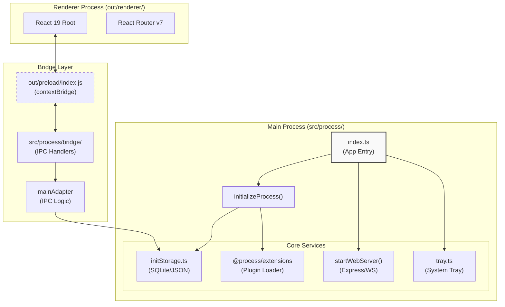
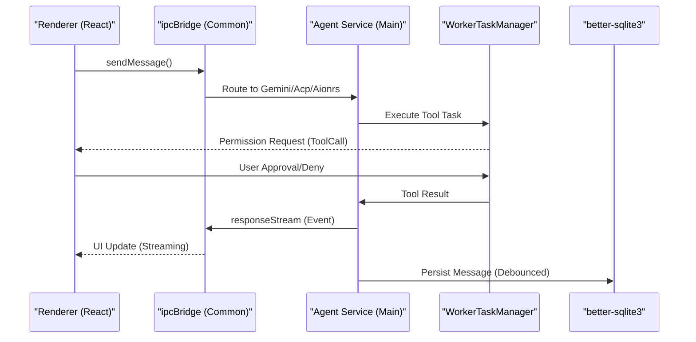

# Overview

Relevant source files

The following files were used as context for generating this wiki page:

- [.github/workflows/build-and-release.yml](.github/workflows/build-and-release.yml)
- [bun.lock](bun.lock)
- [electron-builder.yml](electron-builder.yml)
- [package.json](package.json)
- [readme.md](readme.md)
- [readme_ch.md](readme_ch.md)
- [resources/Image_Generation.gif](resources/Image_Generation.gif)
- [scripts/README.md](scripts/README.md)
- [scripts/afterPack.js](scripts/afterPack.js)
- [scripts/afterSign.js](scripts/afterSign.js)
- [scripts/build-with-builder.js](scripts/build-with-builder.js)
- [scripts/rebuildNativeModules.js](scripts/rebuildNativeModules.js)
- [src/index.ts](src/index.ts)

## Purpose and Scope

AionUi is a free, open-source AI cowork platform designed to transform AI interaction from simple chat into a collaborative environment where agents work alongside users. It provides a unified interface for multiple AI agent protocols, allowing them to read files, write code, browse the web, and automate tasks under user supervision. [readme.md:55-58]()

The application is built as a multi-process Electron system, separating high-privilege system operations (Main process) from the user interface (Renderer process) and heavy AI orchestration tasks. It supports cross-platform deployment on macOS, Windows, and Linux. [package.json:1-11](), [readme.md:10-11]()

---

## Core Capabilities

AionUi differentiates itself from traditional chat clients through deep system integration and a multi-agent architecture.

| Feature | Technical Implementation |
| :--- | :--- |
| **Built-in Agent** | Native `GeminiAgent` and `aionrs` (Rust-based) implementations with full file access and tool scheduling. [readme.md:74-81](), [scripts/build-with-builder.js:112-114]() |
| **Multi-Agent Orchestration** | Support for ACP (Agent Control Protocol), Codex, and OpenClaw protocols. [src/index.ts:28-28](), [readme.md:142-144]() |
| **Zero Configuration** | Bundled engines for file R/W, web search, and MCP tools without external CLI dependencies. [readme.md:78-81]() |
| **Remote Access** | Express-based WebUI server with WebSocket bridging for mobile and browser clients. [src/index.ts:34-34](), [package.json:16-19]() |
| **Scheduled Tasks** | Cron-based execution for 24/7 automated agent workflows. [package.json:97-97]() |

**Sources:** [readme.md:59-67](), [package.json:66-150]()

---

## Architecture & Code Entity Mapping

AionUi follows a strict process separation model. The following diagram bridges the functional concepts to specific code entities and file structures.

### System Entry and Process Layout

**Figure 1: High-level process architecture and directory mapping.**

**Sources:** [src/index.ts:9-61](), [package.json:11-11](), [package.json:124-128](), [electron-builder.yml:18-22]()

---

## Operational Modes

AionUi can be launched in different modes via command-line switches, handled in `src/index.ts`.

| Mode | Trigger | Description |
| :--- | :--- | :--- |
| **Desktop Mode** | Default | Launches the Electron `BrowserWindow` with full system tray integration. [src/index.ts:43-61]() |
| **WebUI Mode** | `--webui` | Starts an Express server for remote browser/mobile access, bypassing the Electron UI. [src/index.ts:34-34](), [package.json:16-16]() |
| **CLI Mode** | `--resetpass` | Administrative utility for password resets. [src/index.ts:86-86](), [package.json:20-20]() |
| **Multi-Instance** | `AIONUI_MULTI_INSTANCE=1` | Bypasses the single-instance lock for parallel testing or development. [src/index.ts:69-72]() |

**Sources:** [src/index.ts:65-103](), [src/index.ts:166-185](), [package.json:13-20]()

---

## AI Agent & Data Flow

The "Cowork" experience is powered by an event-driven architecture that abstracts different AI providers into a unified stream.

**Figure 2: Data flow from user input to tool execution and persistence.**

### Key Code Entities in the Flow:
- **`ipcBridge`**: Defined in `src/common/index.ts`, it provides the unified communication interface between processes. [src/index.ts:23-23]()
- **`initializeProcess`**: Entry point for all main-process services including database and extension loading. [src/index.ts:25-25]()
- **`workerTaskManager`**: Manages heavy computational tasks and tool executions in background workers. [src/index.ts:32-32]()
- **`better-sqlite3`**: Used for high-performance local storage of conversations and messages. [package.json:91-91](), [electron-builder.yml:194-194]()

**Sources:** [src/index.ts:17-47](), [package.json:66-150]()

---

## Development & Build Stack

AionUi uses a modern toolchain for development and cross-platform packaging.

- **Framework**: Electron 37+ with `electron-vite` for optimized bundling. [package.json:116-118]()
- **Runtime**: Node.js 22 and Bun for scripts and server-side tasks. [package.json:151-180](), [scripts/build-with-builder.js:52-52]()
- **Persistence**: SQLite via `better-sqlite3`. [package.json:91-91]()
- **Build System**: `electron-builder` with custom hooks for native module rebuilding (MSVC on Windows, cross-compilation on macOS). [scripts/build-with-builder.js:4-11](), [scripts/afterPack.js:17-40]()
- **Environment Management**: Automatic detection and fixing of shell PATH variables (nvm, zsh) to ensure CLI agents are discoverable. [src/index.ts:106-128]()

**Sources:** [package.json:1-150](), [scripts/build-with-builder.js:1-30](), [electron-builder.yml:1-104]()