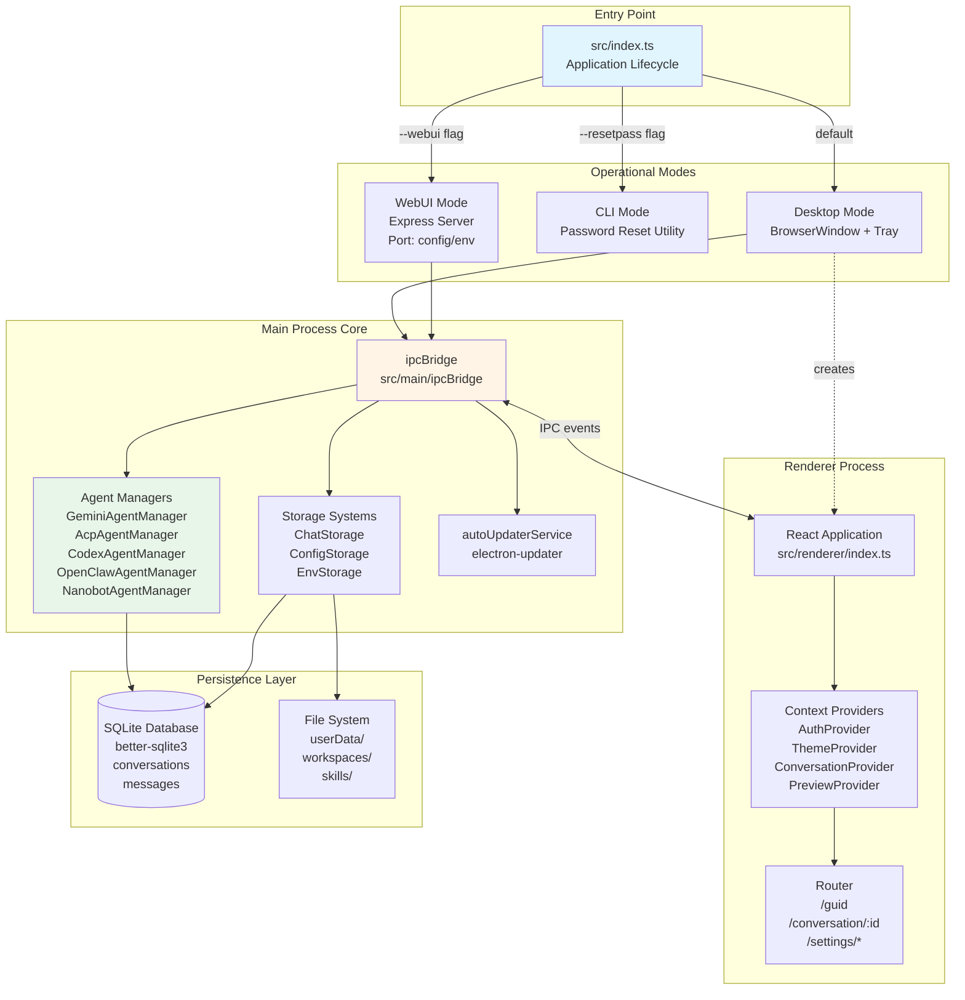
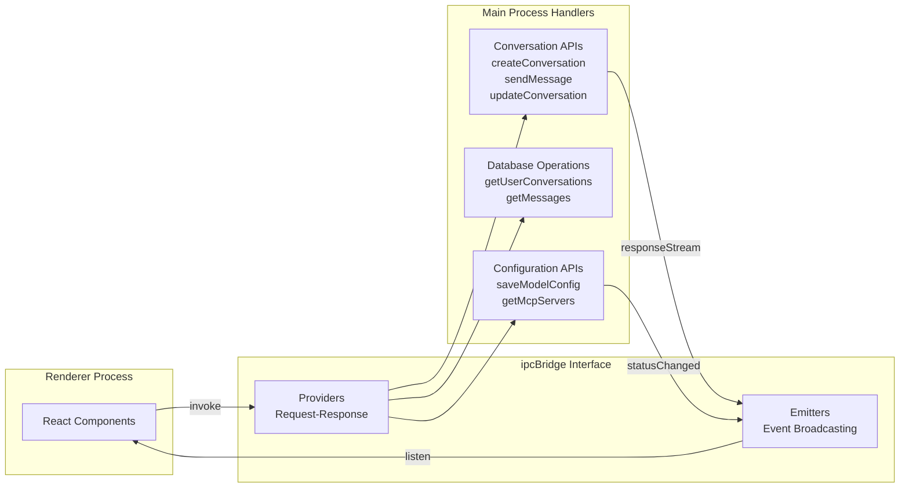
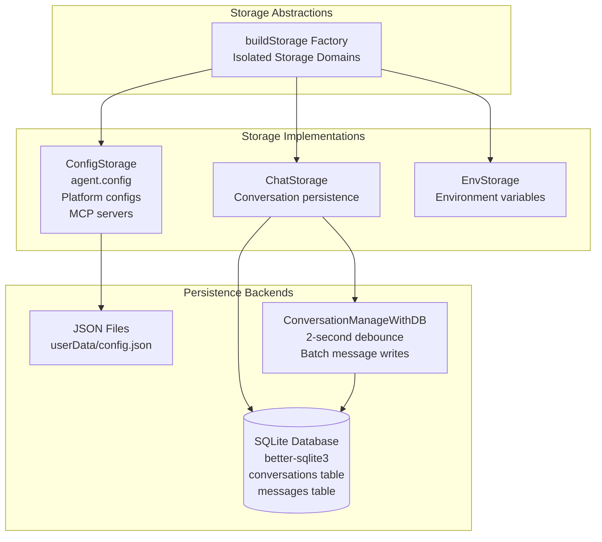
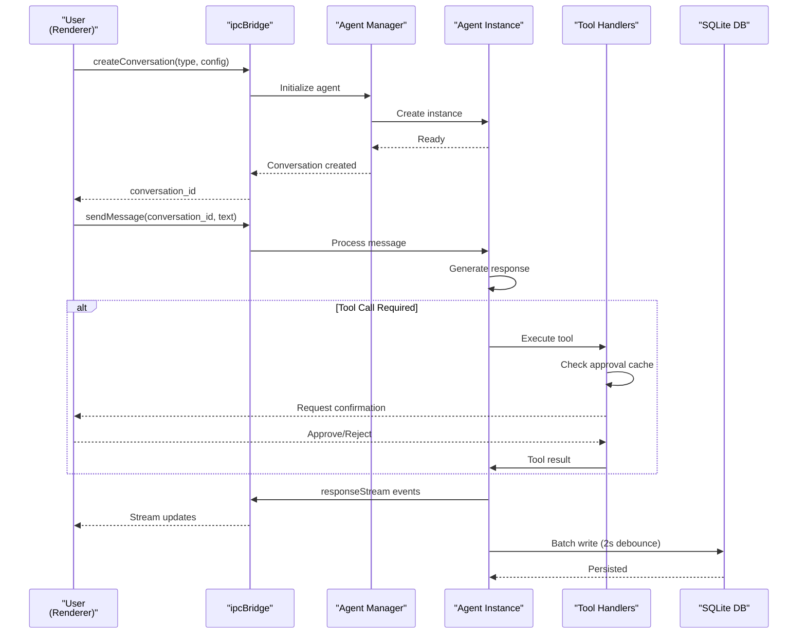

# Overview

<details>
<summary>Relevant source files</summary>

The following files were used as context for generating this wiki page:

- [readme.md](readme.md)
- [readme_ch.md](readme_ch.md)
- [readme_es.md](readme_es.md)
- [readme_jp.md](readme_jp.md)
- [readme_ko.md](readme_ko.md)
- [readme_pt.md](readme_pt.md)
- [readme_tr.md](readme_tr.md)
- [readme_tw.md](readme_tw.md)
- [resources/wechat_group4.png](resources/wechat_group4.png)

</details>

## Purpose and Scope

This document provides a high-level introduction to AionUi, a free and open-source desktop application that enables collaborative work with AI agents. This overview covers the application's core purpose, architectural principles, operational modes, and key subsystems.

For detailed information about specific subsystems, see:

- Application entry point and lifecycle: [Application Modes](#3.1)
- Agent implementations and orchestration: [AI Agent Systems](#4)
- User interface architecture: [User Interface](#5)
- Build pipeline and deployment: [Build & Deployment](#11)

**Sources:** [readme.md:1-80](), [readme_ch.md:1-80]()

---

## What is AionUi?

AionUi is an Electron-based desktop application that transforms AI interactions from simple chat into collaborative "Cowork" sessions. Unlike traditional AI chat clients, AionUi provides agents with full file system access, tool execution capabilities, and autonomous multi-step task completion—all within a transparent, user-controlled environment.

### Core Capabilities

| Capability              | Implementation                                                                                       |
| ----------------------- | ---------------------------------------------------------------------------------------------------- |
| **Built-in Agent**      | Zero-configuration AI agent with file operations, web search, image generation, and MCP tool support |
| **Multi-Agent Support** | Unified interface for Claude Code, Codex, Qwen Code, OpenClaw, and 12+ other CLI-based agents        |
| **Remote Access**       | WebUI mode with browser/mobile access plus Telegram, Lark, and DingTalk integrations                 |
| **Cross-Platform**      | Native builds for macOS (10.15+), Windows (10+), and Linux (Ubuntu 18.04+/Debian 10+/Fedora 32+)     |
| **Model Flexibility**   | Support for 20+ AI platforms including Gemini, OpenAI, Anthropic, Ollama, and Chinese providers      |
| **24/7 Automation**     | Cron-based scheduled tasks with persistent conversation context                                      |

**Sources:** [readme.md:55-142](), [readme_ch.md:55-142]()

---

## Architecture Overview

AionUi follows a classic Electron architecture with a main process (Node.js) and renderer process (React), connected via a custom IPC bridge layer. The application supports three distinct operational modes determined at startup.



**Figure 1: AionUi Application Architecture with Code Entities**

**Sources:** [readme.md:599-620](), Diagram 1 from provided architecture diagrams

---

## Core Subsystems

### 1. Application Lifecycle

The application entry point at `src/index.ts` handles:

- **Mode Detection**: Parsing command-line arguments (`--webui`, `--resetpass`)
- **Window Management**: Creating `BrowserWindow` instances with devtools configuration
- **Protocol Registration**: Registering the `aionui://` deep linking protocol
- **Auto-Update**: Initializing `autoUpdaterService` for release channel management
- **System Tray**: Managing tray icons and minimize-to-tray behavior

**Sources:** [readme.md:556-620]()

### 2. IPC Bridge Layer

The `ipcBridge` system provides bidirectional communication between main and renderer processes:



**Figure 2: IPC Bridge Communication Pattern**

**Sources:** Diagram 2 from provided architecture diagrams, [readme.md:599-620]()

### 3. Agent System

AionUi supports five agent types, each with its own manager and connection handler:

| Agent Type | Manager Class          | Connection Handler                 | Communication Protocol  |
| ---------- | ---------------------- | ---------------------------------- | ----------------------- |
| Gemini     | `GeminiAgentManager`   | `GeminiClient` (from aioncli-core) | REST API with streaming |
| ACP        | `AcpAgentManager`      | `AcpConnection`                    | JSON-RPC over stdio     |
| Codex      | `CodexAgentManager`    | `CodexConnection`                  | WebSocket               |
| OpenClaw   | `OpenClawAgentManager` | `OpenClawConnection`               | HTTP/WebSocket          |
| Nanobot    | `NanobotAgentManager`  | Built-in handler                   | Direct implementation   |

**Sources:** Diagram 1 and Diagram 2 from provided architecture diagrams, [readme.md:89-103]()

### 4. Storage Architecture

AionUi uses a multi-layered storage approach:



**Figure 3: Storage System Architecture**

**Sources:** Diagram 3 and Diagram 5 from provided architecture diagrams

### 5. Configuration System

The configuration system supports 20+ AI platforms with automatic protocol detection:

- **IProvider Interface**: Defines platform configuration schema (baseUrl, apiKey, models, capabilities)
- **Model Capabilities**: Tags including `text`, `vision`, `function_calling`, `image_generation`, `web_search`, `reasoning`, `embedding`
- **Protocol Detector**: Analyzes URL patterns, API key formats, and probes endpoints (`/v1/models`, `/v1/messages`)
- **Platform Categories**:
  - **Official**: Gemini, Vertex AI, Anthropic, OpenAI
  - **Aggregators**: NewAPI, AWS Bedrock
  - **Local**: Ollama, LM Studio
  - **Chinese**: Dashscope (Qwen), Zhipu, Moonshot (Kimi), Qianfan (Baidu), Hunyuan (Tencent), and 7+ more

**Sources:** Diagram 3 from provided architecture diagrams, [readme.md:124-139]()

### 6. User Interface

The React-based UI uses context providers for state management:

| Context Provider           | Purpose                     | Key State                          |
| -------------------------- | --------------------------- | ---------------------------------- |
| `AuthProvider`             | Authentication state        | Google OAuth, API keys             |
| `ThemeProvider`            | Theme management            | Light/dark mode, custom CSS        |
| `ConversationProvider`     | Active conversation context | Current conversation, message list |
| `PreviewProvider`          | File preview state          | Preview panel tabs, file updates   |
| `ConversationTabsProvider` | Multi-tab management        | Open conversations, active tab     |

**Sources:** [readme.md:612-620]()

---

## Technology Stack

### Core Frameworks

| Technology     | Version                    | Purpose                                              |
| -------------- | -------------------------- | ---------------------------------------------------- |
| **Electron**   | Latest                     | Cross-platform desktop framework                     |
| **React**      | 19                         | UI framework with concurrent features                |
| **TypeScript** | Latest                     | Type safety across codebase                          |
| **Vite**       | Latest (via electron-vite) | Fast bundler for main, renderer, and preload scripts |

### Key Dependencies

| Library              | Purpose                                                                       |
| -------------------- | ----------------------------------------------------------------------------- |
| **better-sqlite3**   | Local SQLite database with synchronous API                                    |
| **UnoCSS**           | Atomic CSS engine for styling                                                 |
| **vitest**           | Testing framework                                                             |
| **electron-builder** | Application packaging for macOS DMG/ZIP, Windows NSIS/ZIP, Linux DEB/AppImage |
| **electron-updater** | Auto-update with release channel support (dev/production)                     |

**Sources:** [readme.md:612-620]()

---

## Build Output Structure

The build process produces a structured output directory:

```
out/
├── main/           # Main process code (ESM)
├── renderer/       # Renderer process code (React + TypeScript)
└── preload/        # Preload scripts
```

Final distributables are generated via `electron-builder` with platform-specific configurations defined in `electron-builder.yml`.

**Sources:** [readme.md:606-610]()

---

## Operational Modes

AionUi operates in one of three modes, determined at application startup:

### Desktop Mode (Default)

- Standard Electron window with system tray integration
- Full access to all features including file system operations
- Supports deep linking via `aionui://` protocol
- Auto-update enabled for both dev and production release channels

### WebUI Mode (`--webui`)

- Express server for remote browser/mobile access
- Configuration resolved in order: CLI arguments → environment variables → config file
- QR code or password authentication
- Supports LAN, cross-network, and server deployment

### CLI Mode (`--resetpass`)

- Command-line utility for password reset
- No GUI components loaded
- Direct database access for user credential management

**Sources:** [readme.md:180-202](), Diagram 1 from provided architecture diagrams

---

## Agent Workflow

The typical agent interaction follows this flow:



**Figure 4: Agent Interaction Sequence**

**Sources:** Diagram 2 from provided architecture diagrams

---

## Key Features Mapping

This table maps user-facing features to their code implementations:

| Feature               | Primary Components                                          | File Locations                         |
| --------------------- | ----------------------------------------------------------- | -------------------------------------- |
| **Agent Selection**   | `Guid` page, capability filtering                           | `src/renderer` (Guid route)            |
| **Message Streaming** | `ipcBridge` emitters, `responseStream` events               | `src/main/ipcBridge`                   |
| **File Preview**      | `PreviewProvider`, `usePreviewLauncher` hook                | `src/renderer` (Preview components)    |
| **Scheduled Tasks**   | Cron system, conversation-bound tasks                       | Agent managers with cron support       |
| **MCP Integration**   | `McpOAuthService`, transport handlers (stdio/SSE/HTTP)      | MCP configuration in `ConfigStorage`   |
| **Tool Execution**    | `CoreToolScheduler`, `globalToolCallGuard`, approval system | Tool handlers in agent implementations |
| **Multi-Tab UI**      | `ConversationTabsProvider`, parallel execution              | Renderer context providers             |
| **Auto-Update**       | `autoUpdaterService`, `electron-updater`, release channels  | `src/main` (update service)            |

**Sources:** [readme.md:55-80](), [readme.md:204-376]()

---

## Development Setup

### Prerequisites

- Node.js 22+
- Bun (package manager)
- Just (command runner)
- Python 3.11+ (for native module compilation)
- prek (pre-commit hooks via Rust implementation)

### Quick Start

```bash
just install    # Install dependencies
just dev       # Start development server with HMR
just build     # Build for current platform
```

### Quality Gates

The project uses `prek` for code quality checks configured in `.pre-commit-config.yaml`:

- ESLint for code linting
- Prettier for formatting
- TypeScript type checking
- Vitest for unit tests

**Sources:** [readme.md:556-605]()

---

## License and Community

AionUi is licensed under Apache-2.0 and actively maintained on GitHub at `iOfficeAI/AionUi`. The project has an active community on Discord (English) and WeChat (Chinese).

**Sources:** [readme.md:632-660]()
