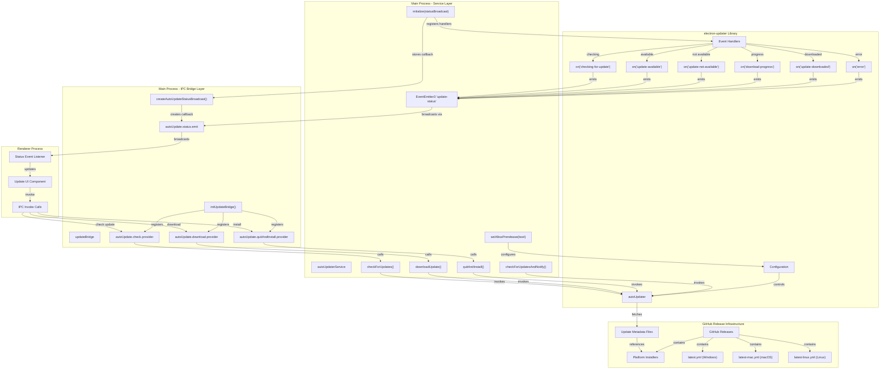
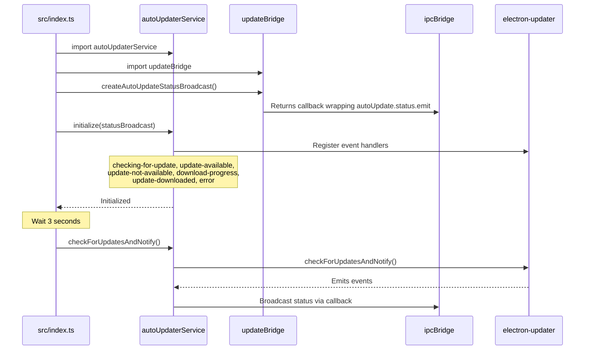
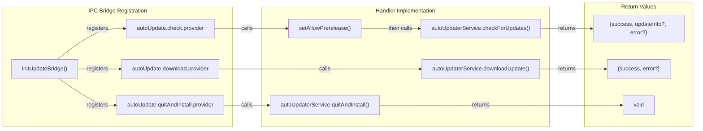
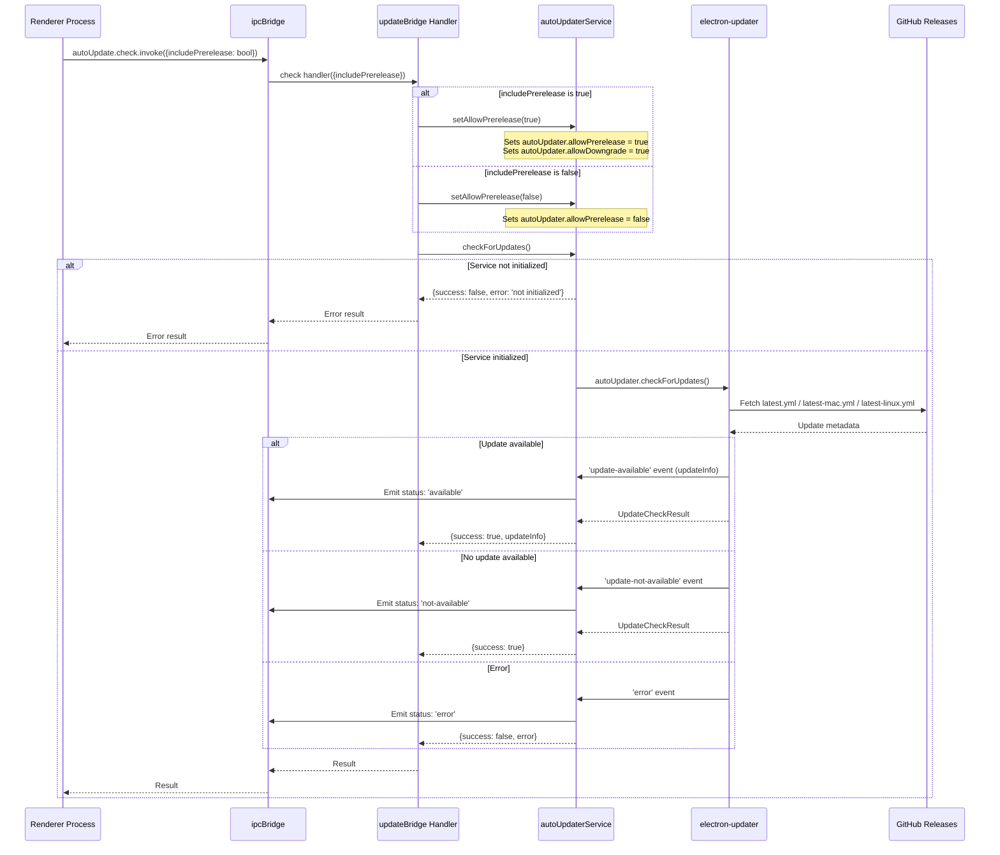
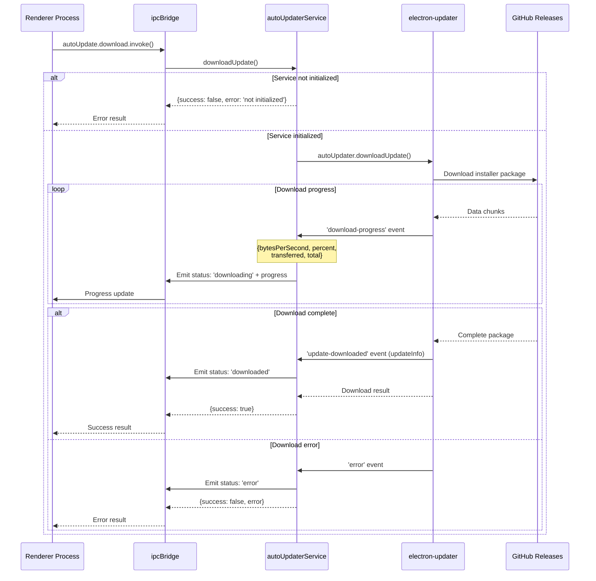
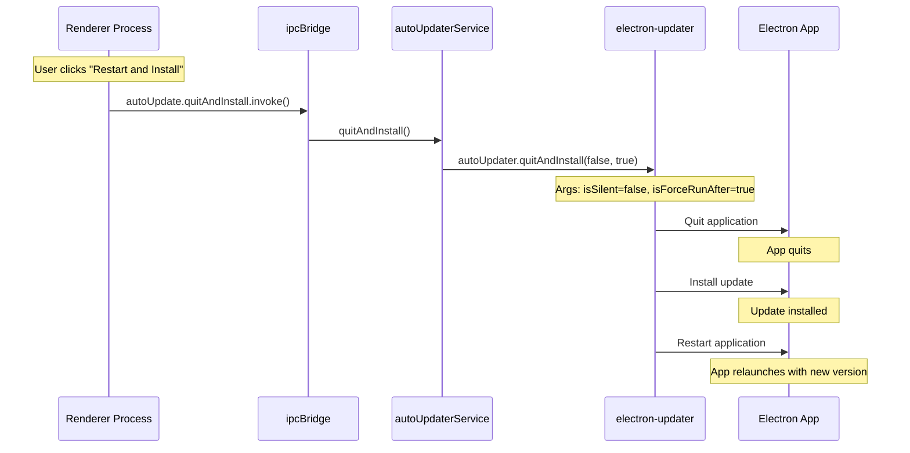
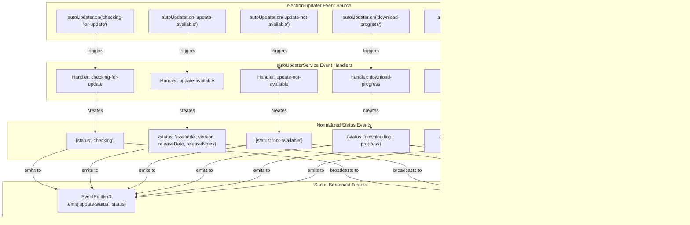
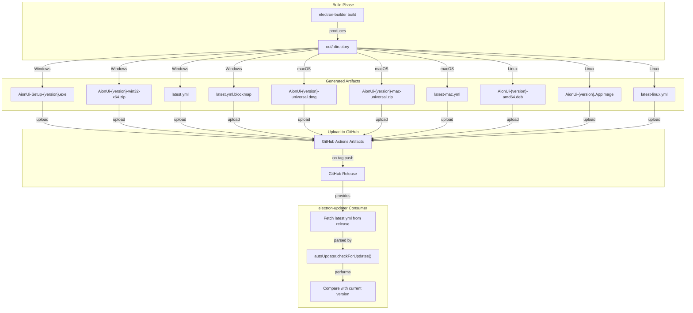

# Update System

<details>
<summary>Relevant source files</summary>

The following files were used as context for generating this wiki page:

- [.github/workflows/\_build-reusable.yml](.github/workflows/_build-reusable.yml)
- [.github/workflows/build-manual.yml](.github/workflows/build-manual.yml)
- [bun.lock](bun.lock)
- [src/index.ts](src/index.ts)
- [src/utils/configureChromium.ts](src/utils/configureChromium.ts)
- [tests/integration/autoUpdate.integration.test.ts](tests/integration/autoUpdate.integration.test.ts)
- [tests/unit/autoUpdaterService.test.ts](tests/unit/autoUpdaterService.test.ts)
- [tests/unit/test_acp_connection_disconnect.ts](tests/unit/test_acp_connection_disconnect.ts)
- [vitest.config.ts](vitest.config.ts)

</details>

This document explains how AionUi implements automatic application updates using `electron-updater`. It covers the `autoUpdaterService`, IPC bridge for renderer communication, event-driven status broadcasts, and the distinction between production and prerelease update channels.

For information about the build pipeline that generates update artifacts, see [Build Pipeline](#11.1). For release management and metadata generation, see [Release Management](#11.5).

---

## Overview

The update system enables seamless in-app updates for AionUi across all platforms (macOS, Windows, Linux). It uses `electron-updater` to check for updates from GitHub releases, download update packages, and install them automatically on application restart.

**Key Features:**

- Automatic update checks on application launch (after 3-second delay)
- Background download with progress tracking
- Manual update checks triggered by user
- Support for prerelease/dev channels
- Status event broadcasting to renderer for UI feedback
- Platform-specific update formats (DMG/ZIP for macOS, NSIS/ZIP for Windows, DEB/AppImage for Linux)

---

## Architecture

### Component Diagram



**Sources:** [src/index.ts:418-433](), [tests/integration/autoUpdate.integration.test.ts](), [tests/unit/autoUpdaterService.test.ts]()

---

## Core Components

### autoUpdaterService

The `autoUpdaterService` singleton manages all interactions with `electron-updater`'s `autoUpdater` instance. It provides a clean API for the IPC bridge layer and internal event emitter for status broadcasting.

**Key Methods:**

| Method                         | Description                                              | Returns                                            |
| ------------------------------ | -------------------------------------------------------- | -------------------------------------------------- |
| `initialize(statusBroadcast?)` | Register event handlers, store status broadcast callback | `void`                                             |
| `checkForUpdates()`            | Check for available updates                              | `Promise<{success: boolean, updateInfo?, error?}>` |
| `downloadUpdate()`             | Download available update                                | `Promise<{success: boolean, error?}>`              |
| `quitAndInstall()`             | Quit app and install downloaded update                   | `void`                                             |
| `checkForUpdatesAndNotify()`   | Check and show native notification if update available   | `Promise<void>`                                    |
| `setAllowPrerelease(enabled)`  | Enable/disable prerelease updates                        | `void`                                             |

**Properties:**

| Property          | Type      | Description                            |
| ----------------- | --------- | -------------------------------------- |
| `isInitialized`   | `boolean` | Whether service has been initialized   |
| `allowPrerelease` | `boolean` | Whether prerelease updates are enabled |

**Sources:** [tests/unit/autoUpdaterService.test.ts:51-67](), [tests/unit/autoUpdaterService.test.ts:127-164]()

---

### Initialization Flow

The update system is initialized during application startup, after the main window is created:



**Code Reference:**

[src/index.ts:418-433]() shows the initialization sequence:

```typescript
Promise.all([
  import('./process/services/autoUpdaterService'),
  import('./process/bridge/updateBridge'),
]).then(([{ autoUpdaterService }, { createAutoUpdateStatusBroadcast }]) => {
  // Create status broadcast callback that emits via ipcBridge (pure emitter, no window binding)
  const statusBroadcast = createAutoUpdateStatusBroadcast()
  autoUpdaterService.initialize(statusBroadcast)
  // Check for updates after 3 seconds delay
  setTimeout(() => {
    void autoUpdaterService.checkForUpdatesAndNotify()
  }, 3000)
})
```

**Sources:** [src/index.ts:418-433](), [tests/integration/autoUpdate.integration.test.ts:188-206]()

---

## IPC Bridge Layer

The IPC bridge exposes update functionality to the renderer process through three provider endpoints and one emitter for status broadcasting.

### IPC Endpoints

| Endpoint                              | Type     | Purpose                                             |
| ------------------------------------- | -------- | --------------------------------------------------- |
| `ipcBridge.autoUpdate.check`          | Provider | Check for updates (optionally including prerelease) |
| `ipcBridge.autoUpdate.download`       | Provider | Download available update                           |
| `ipcBridge.autoUpdate.quitAndInstall` | Provider | Quit and install downloaded update                  |
| `ipcBridge.autoUpdate.status`         | Emitter  | Broadcast update status events to renderer          |

### Bridge Registration

The `initUpdateBridge()` function registers all IPC providers by connecting them to corresponding `autoUpdaterService` methods:



**Sources:** [tests/integration/autoUpdate.integration.test.ts:79-97](), [tests/integration/autoUpdate.integration.test.ts:130-169]()

### Status Broadcast Mechanism

The `createAutoUpdateStatusBroadcast()` function creates a pure emitter callback that forwards status updates to the renderer without requiring a `BrowserWindow` reference:

```typescript
// Pure emitter pattern - no window binding required
const statusBroadcast = createAutoUpdateStatusBroadcast()

// statusBroadcast forwards to ipcBridge.autoUpdate.status.emit
statusBroadcast({ status: 'checking' })
```

This callback is passed to `autoUpdaterService.initialize()` and called whenever an update event occurs.

**Sources:** [tests/integration/autoUpdate.integration.test.ts:99-128](), [tests/unit/autoUpdaterService.test.ts:383-398]()

---

## Update Flow

### Check for Updates



**Sources:** [tests/integration/autoUpdate.integration.test.ts:147-169](), [tests/unit/autoUpdaterService.test.ts:128-175]()

---

### Download Update



**Sources:** [tests/unit/autoUpdaterService.test.ts:178-217](), [tests/unit/autoUpdaterService.test.ts:304-327]()

---

### Install Update



**Notes:**

- `quitAndInstall(false, true)` means: not silent (show installer UI), force run after installation
- On Windows, the NSIS installer runs and replaces application files
- On macOS, the DMG is mounted and the app bundle is replaced
- On Linux, the DEB/AppImage is installed

**Sources:** [tests/unit/autoUpdaterService.test.ts:219-225]()

---

## Event System

### Event Handling Architecture

The update system uses a dual event system:

1. **electron-updater events** - raw events from the library
2. **Internal EventEmitter3** - normalized status events for internal/external consumption



**Sources:** [tests/unit/autoUpdaterService.test.ts:261-381](), [tests/integration/autoUpdate.integration.test.ts:207-237]()

---

### Status Event Schema

All status events follow this TypeScript interface pattern:

```typescript
type UpdateStatus =
  | { status: 'checking' }
  | {
      status: 'available'
      version: string
      releaseDate?: string
      releaseNotes?: string
    }
  | { status: 'not-available' }
  | {
      status: 'downloading'
      progress: {
        bytesPerSecond: number
        percent: number
        transferred: number
        total: number
      }
    }
  | { status: 'downloaded'; version: string }
  | { status: 'error'; error: string }
```

**Event Details:**

| Status          | Fields                                                   | Triggered By           | Description                         |
| --------------- | -------------------------------------------------------- | ---------------------- | ----------------------------------- |
| `checking`      | -                                                        | `checking-for-update`  | Update check in progress            |
| `available`     | `version`, `releaseDate?`, `releaseNotes?`               | `update-available`     | New version available for download  |
| `not-available` | -                                                        | `update-not-available` | Already on latest version           |
| `downloading`   | `progress.{bytesPerSecond, percent, transferred, total}` | `download-progress`    | Download in progress                |
| `downloaded`    | `version`                                                | `update-downloaded`    | Download complete, ready to install |
| `error`         | `error`                                                  | `error`                | Update operation failed             |

**Sources:** [tests/unit/autoUpdaterService.test.ts:262-355]()

---

## Update Channels

AionUi supports two update channels: **production** releases and **prerelease/dev** releases.

### Channel Configuration

```mermaid
graph TB
    subgraph "Update Channel Selection"
        USER_PREF["User Preference"]
        SERVICE["autoUpdaterService"]
        UPDATER["electron-updater config"]
    end

    subgraph "Channel Flags"
        ALLOW_PRE["allowPrerelease"]
        ALLOW_DOWN["allowDowngrade"]
    end

    subgraph "GitHub Release Types"
        PROD["Production Releases"]
        PREREL["Prerelease Releases"]
        DRAFT["Draft Releases"]
    end

    USER_PREF -->|includePrerelease: true| SERVICE
    USER_PREF -->|includePrerelease: false| SERVICE

    SERVICE -->|setAllowPrerelease(true)| ALLOW_PRE
    SERVICE -->|setAllowPrerelease(true)| ALLOW_DOWN

    ALLOW_PRE -->|"true"| UPDATER
    ALLOW_DOWN -->|"true (enables downgrades)"| UPDATER

    UPDATER -->|"allowPrerelease=false"| PROD
    UPDATER -->|"allowPrerelease=true"| PREREL

    Note_Draft["Draft releases are never<br/>included in update checks"]
    DRAFT -.->|excluded| Note_Draft
```

**Channel Behavior:**

| Channel        | `allowPrerelease` | `allowDowngrade` | Includes             | Typical Use Case                 |
| -------------- | ----------------- | ---------------- | -------------------- | -------------------------------- |
| **Production** | `false`           | `false`          | Stable releases only | Default for end users            |
| **Prerelease** | `true`            | `true`           | Prereleases + stable | Early access, testing dev builds |

**Notes:**

- `allowDowngrade` is set to `true` when prerelease is enabled to allow switching between dev builds
- Draft releases are excluded from both channels (only visible to maintainers)
- Users can switch channels by toggling `includePrerelease` in settings

**Sources:** [tests/unit/autoUpdaterService.test.ts:244-259](), [tests/integration/autoUpdate.integration.test.ts:147-169]()

---

### Release Tag Conventions

The build pipeline uses specific tag formats to distinguish channels:

| Tag Format                | Channel    | Description                     |
| ------------------------- | ---------- | ------------------------------- |
| `v{VERSION}`              | Production | Stable release (e.g., `v1.2.3`) |
| `v{VERSION}-dev-{COMMIT}` | Prerelease | Dev build tagged on dev branch  |

Example:

- `v1.0.0` → Production release
- `v1.0.1-dev-a1b2c3d` → Dev build from commit `a1b2c3d`

**Sources:** [.github/workflows/\_build-reusable.yml:556-566]()

---

## Build Integration

### Update Metadata Generation

The CI/CD pipeline generates platform-specific metadata files that `electron-updater` uses to check for updates:

| File               | Platform | Format | Purpose                                                     |
| ------------------ | -------- | ------ | ----------------------------------------------------------- |
| `latest.yml`       | Windows  | YAML   | Contains version, release date, file URLs, SHA512 checksums |
| `latest-mac.yml`   | macOS    | YAML   | Contains version, release date, file URLs, SHA512 checksums |
| `latest-linux.yml` | Linux    | YAML   | Contains version, release date, file URLs, SHA512 checksums |

**Generated by:** `electron-builder` automatically during the build process

**Uploaded to:** GitHub Releases alongside installer packages

**Contents Example (latest.yml):**

```yaml
version: 1.2.3
releaseDate: '2025-01-15T10:30:00.000Z'
files:
  - url: AionUi-Setup-1.2.3.exe
    sha512: abc123...
    size: 125829120
  - url: AionUi-1.2.3-win32-x64.zip
    sha512: def456...
    size: 98304000
path: AionUi-Setup-1.2.3.exe
sha512: abc123...
```

**Sources:** [.github/workflows/\_build-reusable.yml:532-543]()

---

### Artifact Upload Flow



**Sources:** [.github/workflows/\_build-reusable.yml:525-543]()

---

## Configuration

### electron-updater Settings

The `autoUpdaterService` configures `electron-updater` with these settings:

| Property               | Value          | Purpose                                        |
| ---------------------- | -------------- | ---------------------------------------------- |
| `autoDownload`         | `true`         | Automatically download updates after detection |
| `autoInstallOnAppQuit` | `true`         | Install updates when app quits                 |
| `allowPrerelease`      | Dynamic        | Controlled by `setAllowPrerelease()`           |
| `allowDowngrade`       | Dynamic        | Set to `true` when `allowPrerelease` is `true` |
| `logger`               | `electron-log` | Log update operations to file                  |

**Logger Configuration:**

```typescript
autoUpdater.logger = electronLog
autoUpdater.logger.transports.file.level = 'info'
```

Logs are written to:

- **macOS:** `~/Library/Logs/AionUi/main.log`
- **Windows:** `%USERPROFILE%\AppData\Roaming\AionUi\logs\main.log`
- **Linux:** `~/.config/AionUi/logs/main.log`

**Sources:** [tests/unit/autoUpdaterService.test.ts:18-34]()

---

## Testing

### Unit Tests

The `autoUpdaterService` has comprehensive unit tests covering:

- Initialization with/without status broadcast callback
- Check/download/install operations
- Event handling and status emission
- Prerelease channel configuration
- Error handling for non-Error exceptions
- Reset mechanisms for test isolation

**Test File:** [tests/unit/autoUpdaterService.test.ts]()

**Key Test Patterns:**

```typescript
// Testing event emission
autoUpdaterService.triggerEventForTest('update-available', { version: '2.0.0' })
expect(statusListener).toHaveBeenCalledWith({
  status: 'available',
  version: '2.0.0',
})

// Testing initialization idempotency
autoUpdaterService.initialize(mockBroadcast)
const firstCallCount = vi.mocked(autoUpdater.on).mock.calls.length
autoUpdaterService.initialize(mockBroadcast)
expect(vi.mocked(autoUpdater.on).mock.calls.length).toBe(firstCallCount)
```

**Sources:** [tests/unit/autoUpdaterService.test.ts]()

---

### Integration Tests

The integration test suite verifies the full IPC bridge wiring between renderer and service:

- IPC endpoint registration
- Status broadcast callback creation
- Handler invocation with correct parameters
- End-to-end event flow from `autoUpdater` → service → IPC → renderer

**Test File:** [tests/integration/autoUpdate.integration.test.ts]()

**Key Integration Test:**

```typescript
// Full chain test: autoUpdater event → service → ipcBridge → renderer
autoUpdaterService.initialize(createAutoUpdateStatusBroadcast())
autoUpdaterService.triggerEventForTest('update-available', { version: '2.0.0' })
expect(ipcBridge.autoUpdate.status.emit).toHaveBeenCalledWith({
  status: 'available',
  version: '2.0.0',
})
```

**Sources:** [tests/integration/autoUpdate.integration.test.ts:207-237]()

---

## Summary

The update system provides a robust, event-driven mechanism for keeping AionUi up-to-date:

1. **Service Layer:** `autoUpdaterService` wraps `electron-updater` with clean API and event handling
2. **IPC Bridge:** Three providers (check, download, quitAndInstall) + one emitter (status) for renderer communication
3. **Dual Event System:** Internal EventEmitter3 + status broadcast callback for flexible consumption
4. **Update Channels:** Production and prerelease channels controlled by `allowPrerelease` flag
5. **Build Integration:** CI/CD pipeline generates update metadata consumed by `electron-updater`
6. **Testing:** Comprehensive unit and integration tests ensure reliability

**Key Files:**

- Service: `src/process/services/autoUpdaterService.ts`
- Bridge: `src/process/bridge/updateBridge.ts`
- Initialization: [src/index.ts:418-433]()
- Tests: [tests/unit/autoUpdaterService.test.ts](), [tests/integration/autoUpdate.integration.test.ts]()
