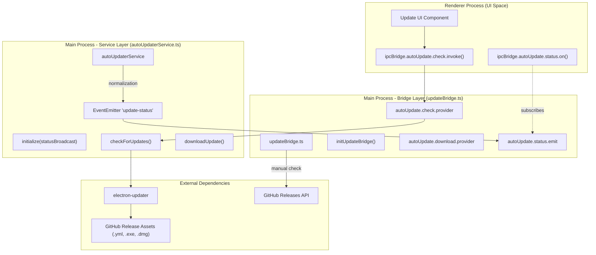
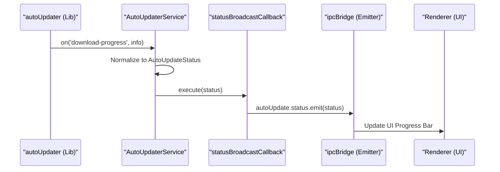

# Update System

<details>
<summary>Relevant source files</summary>

The following files were used as context for generating this wiki page:

- [.github/workflows/_build-reusable.yml](.github/workflows/_build-reusable.yml)
- [.github/workflows/build-manual.yml](.github/workflows/build-manual.yml)
- [scripts/create-mock-release-artifacts.sh](scripts/create-mock-release-artifacts.sh)
- [scripts/prepare-release-assets.sh](scripts/prepare-release-assets.sh)
- [scripts/verify-release-assets.sh](scripts/verify-release-assets.sh)
- [src/process/bridge/updateBridge.ts](src/process/bridge/updateBridge.ts)
- [src/process/services/autoUpdaterService.ts](src/process/services/autoUpdaterService.ts)
- [tests/integration/autoUpdate.integration.test.ts](tests/integration/autoUpdate.integration.test.ts)
- [tests/unit/autoUpdaterService.test.ts](tests/unit/autoUpdaterService.test.ts)

</details>


This document explains how AionUi implements automatic application updates using `electron-updater`. It covers the `autoUpdaterService`, the IPC bridge for renderer communication, architecture-specific update channels, and the integration with GitHub Releases.

---

## Overview

The update system enables seamless in-app updates for AionUi across macOS, Windows, and Linux. It utilizes `electron-updater` to poll for metadata from GitHub, download packages in the background, and perform installations upon application restart.

**Key Features:**
- **Architecture-Aware Channels**: Automatic selection of update metadata based on platform and CPU architecture (e.g., `latest-arm64-mac.yml` for Apple Silicon). [src/process/services/autoUpdaterService.ts:17-41]()
- **Manual Control**: Updates are checked automatically on launch but downloads are manually triggered to save user bandwidth. [src/process/services/autoUpdaterService.ts:79-81]()
- **Prerelease Support**: Users can opt-in to dev/beta builds via a dedicated manual check mechanism. [src/process/services/autoUpdaterService.ts:167-179]()
- **Progress Tracking**: Real-time download progress (bytes/sec, percentage) is broadcast to the UI via a standardized status object. [src/process/services/autoUpdaterService.ts:43-55]()

---

## Architecture

### System Component Diagram
The following diagram illustrates the flow from the UI layer through the IPC bridge to the service layer and finally to the GitHub infrastructure.

Title: Update System Data Flow

**Sources:** [src/process/services/autoUpdaterService.ts:65-90](), [src/process/bridge/updateBridge.ts:223-233](), [tests/integration/autoUpdate.integration.test.ts:80-89]()

---

## Core Components

### autoUpdaterService
The `AutoUpdaterService` class (extending `EventEmitter`) acts as a singleton wrapper around the `electron-updater` library. It handles the mapping of raw library events to a standardized `AutoUpdateStatus` object. [src/process/services/autoUpdaterService.ts:65-72]()

**Platform Channel Resolution:**
The service uses `getUpdateChannel()` to determine which `.yml` metadata file to fetch based on the runtime environment. This is critical for supporting ARM64 builds on Windows and macOS. [src/process/services/autoUpdaterService.ts:17-41]()

| Platform | Arch | Channel Name | Metadata File |
|----------|------|--------------|---------------|
| Windows | x64 | `undefined` (default) | `latest.yml` |
| Windows | arm64 | `latest-win-arm64` | `latest-win-arm64.yml` |
| macOS | x64 | `undefined` (default) | `latest-mac.yml` |
| macOS | arm64 | `latest-arm64` | `latest-arm64-mac.yml` |
| Linux | arm64 | `undefined` (handled by lib) | `latest-linux-arm64.yml` |

**Sources:** [src/process/services/autoUpdaterService.ts:17-41](), [src/process/services/autoUpdaterService.ts:85-90]()

### updateBridge
The bridge layer handles the communication between the renderer and main processes. It exposes methods for checking updates, downloading them, and quitting the app to install. [src/process/bridge/updateBridge.ts:7-21]()

**Asset Selection Logic:**
The `pickRecommendedAsset` function scores available GitHub assets to find the best match for the user's platform. It uses architecture and platform hints to filter and prioritize installers. [src/process/bridge/updateBridge.ts:158-170]()

| Criteria | Score Bonus |
|----------|-------------|
| Platform hint match (e.g., "win", "mac") | +20 |
| Architecture hint match (e.g., "arm64") | +10 |
| Detected Arch match | +15 |
| **Preferred Formats** | |
| Windows: `.exe` | +100 |
| macOS: `.dmg` | +100 |
| Linux: `.deb` | +100 |

**Sources:** [src/process/bridge/updateBridge.ts:122-156](), [src/process/bridge/updateBridge.ts:103-120]()

---

## Update Data Flow

### Status Broadcasting
When an update event occurs (checking, available, progress, downloaded), the service transforms the data and broadcasts it through an IPC emitter.

Title: Update Status Sequence

**Sources:** [src/process/services/autoUpdaterService.ts:96-105](), [src/process/services/autoUpdaterService.ts:222-233](), [tests/integration/autoUpdate.integration.test.ts:100-110]()

---

## Release & Metadata Management

### CI/CD Integration
The build pipeline generates architecture-specific metadata files to ensure users receive the correct binary. This is managed by `.github/workflows/_build-reusable.yml` which handles multi-platform builds. [.github/workflows/_build-reusable.yml:73-85]()

1.  **Build Phase**: `electron-builder` runs for specific targets (e.g., `windows-arm64`). [.github/workflows/build-manual.yml:50-54]()
2.  **Normalization Phase**: The `prepare-release-assets.sh` script collects disparate `latest.yml` files and renames them to the canonical names expected by the `autoUpdaterService`. [scripts/prepare-release-assets.sh:48-78]()

**Metadata Mapping in Scripts:**
```bash
# From prepare-release-assets.sh
[ -n "$WIN_ARM64_LATEST" ]  && cp -f "$WIN_ARM64_LATEST"  "$OUTPUT_DIR/latest-win-arm64.yml"
[ -n "$MAC_ARM64_LATEST" ]  && cp -f "$MAC_ARM64_LATEST"  "$OUTPUT_DIR/latest-arm64-mac.yml"
```
**Sources:** [scripts/prepare-release-assets.sh:71-77](), [scripts/create-mock-release-artifacts.sh:15-78]()

---

## Update Channels: Prerelease vs Production

AionUi distinguishes between channels to protect production users while allowing testers to access dev builds.

-   **Production**: Only stable releases are considered. `autoUpdater.allowPrerelease` is kept `false` to avoid library conflicts with custom channel names. [src/process/services/autoUpdaterService.ts:172-177]()
-   **Prerelease**: Handled via manual GitHub API checks in `updateBridge.ts`. The bridge fetches all releases and filters based on the `prerelease` flag and version semver validity. [src/process/bridge/updateBridge.ts:247-260]()

**Sources:** [src/process/services/autoUpdaterService.ts:170-179](), [src/process/bridge/updateBridge.ts:223-233]()

---

## Testing the Update System

### Unit Testing
The `autoUpdaterService.test.ts` uses Vitest to mock the Electron environment and verify service logic. [tests/unit/autoUpdaterService.test.ts:7-37]()

**Test Scenarios:**
- **Initialization**: Ensures handlers are registered exactly once and handles multiple initialization calls. [tests/unit/autoUpdaterService.test.ts:93-102]()
- **Status Mapping**: Verifies that library events like `checking-for-update` trigger the correct internal status broadcast. [tests/unit/autoUpdaterService.test.ts:125-129]()
- **Error Handling**: Checks that both `Error` objects and string-based rejections in `checkForUpdates` are gracefully handled. [tests/unit/autoUpdaterService.test.ts:173-194]()

**Sources:** [tests/unit/autoUpdaterService.test.ts:78-115](), [tests/unit/autoUpdaterService.test.ts:131-171]()