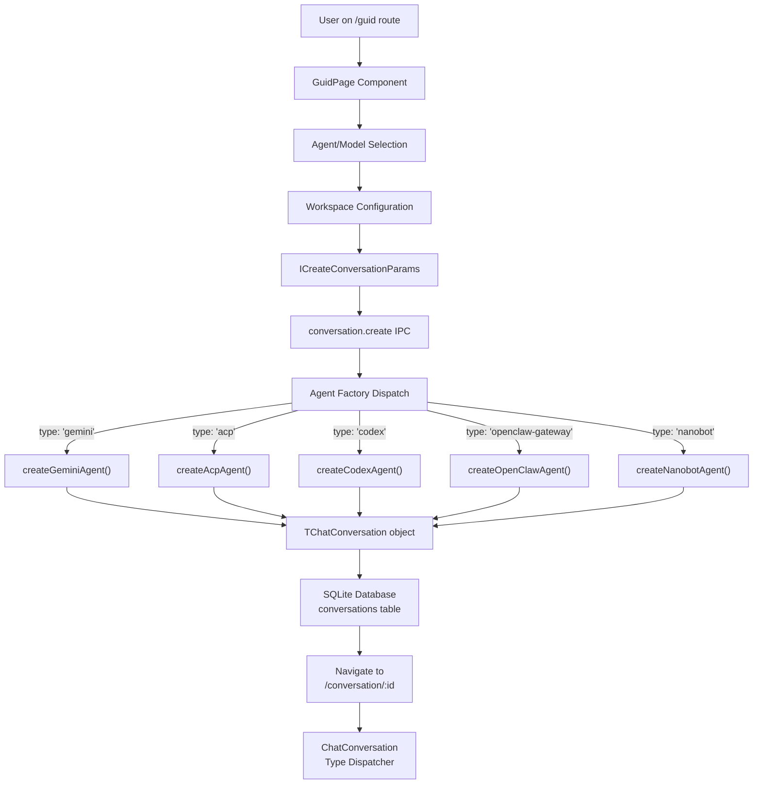
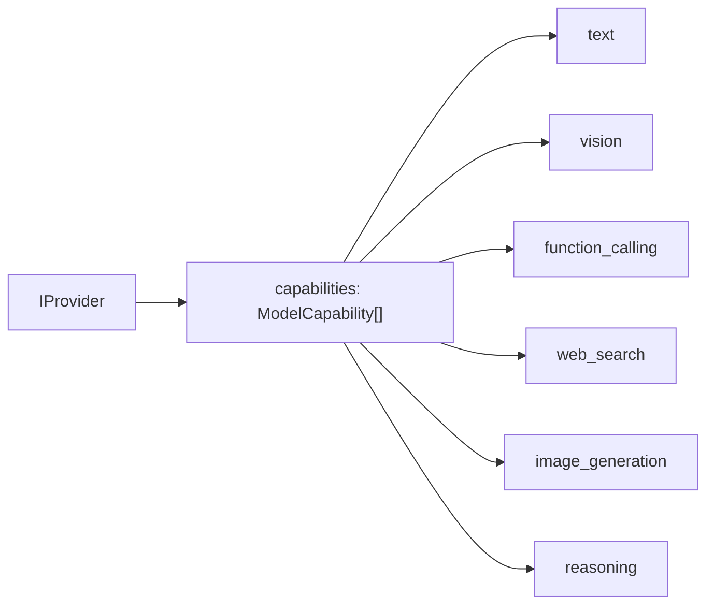
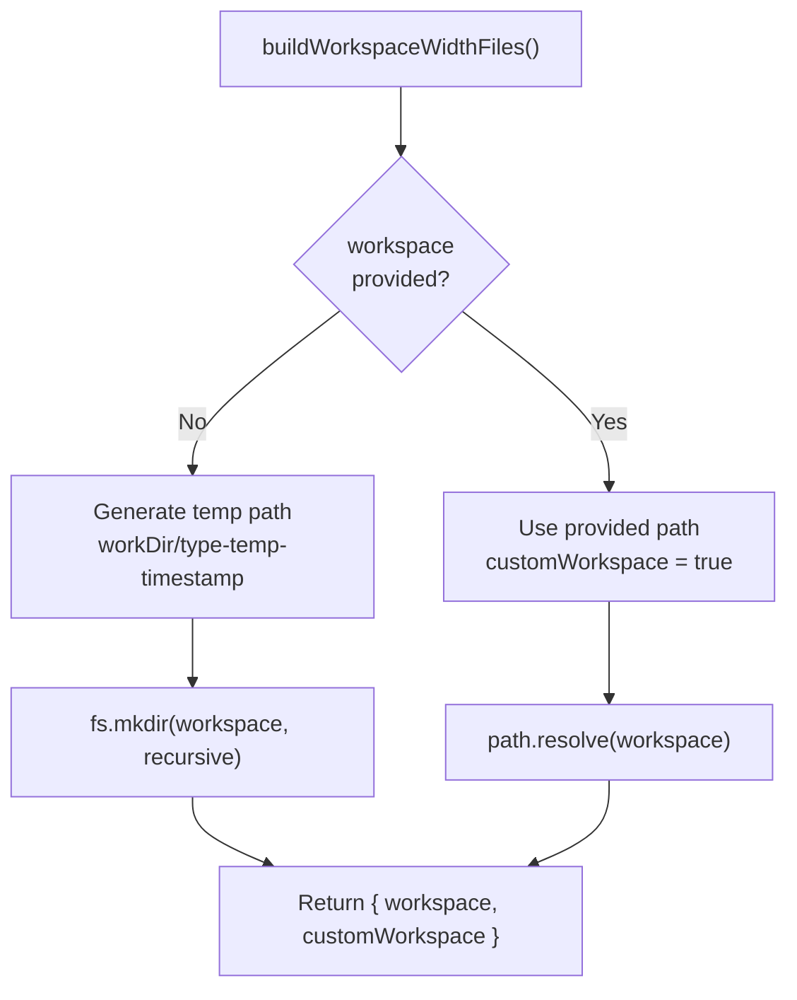
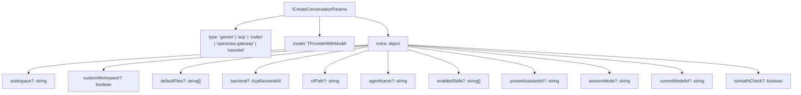
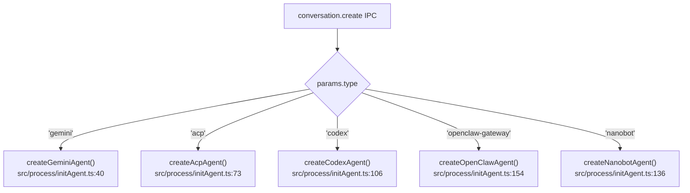
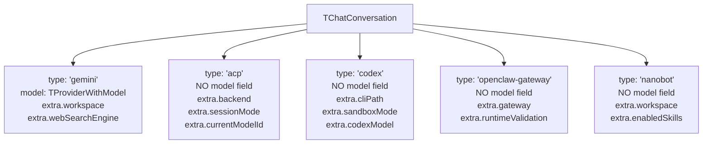

# Conversation Initialization

<details>
<summary>Relevant source files</summary>

The following files were used as context for generating this wiki page:

- [src/common/ipcBridge.ts](src/common/ipcBridge.ts)
- [src/common/storage.ts](src/common/storage.ts)
- [src/process/initAgent.ts](src/process/initAgent.ts)
- [src/renderer/layout.tsx](src/renderer/layout.tsx)
- [src/renderer/pages/conversation/ChatConversation.tsx](src/renderer/pages/conversation/ChatConversation.tsx)
- [src/renderer/pages/conversation/ChatHistory.tsx](src/renderer/pages/conversation/ChatHistory.tsx)
- [src/renderer/pages/conversation/ChatLayout.tsx](src/renderer/pages/conversation/ChatLayout.tsx)
- [src/renderer/pages/conversation/ChatSider.tsx](src/renderer/pages/conversation/ChatSider.tsx)
- [src/renderer/pages/guid/index.tsx](src/renderer/pages/guid/index.tsx)
- [src/renderer/pages/settings/SettingsSider.tsx](src/renderer/pages/settings/SettingsSider.tsx)
- [src/renderer/router.tsx](src/renderer/router.tsx)
- [src/renderer/sider.tsx](src/renderer/sider.tsx)
- [src/renderer/styles/themes/base.css](src/renderer/styles/themes/base.css)

</details>

## Purpose and Scope

This page documents the conversation initialization flow in AionUi, from agent selection on the Guid page through IPC-based creation to conversation rendering. It covers:

- The Guid page's agent selection interface and model filtering logic
- Workspace configuration (default vs. custom directories)
- The `ICreateConversationParams` structure and `conversation.create` IPC flow
- Agent-specific factory functions that create `TChatConversation` objects
- Type-based routing in `ChatConversation` component

For details on how conversations render messages after initialization, see [Message Rendering System](#5.4). For workspace file operations during the conversation, see [File & Workspace Management](#5.6).

---

## Conversation Initialization Flow

The conversation initialization process follows a multi-step flow from user interaction on the Guid page through IPC communication to the main process, agent creation, database persistence, and finally navigation to the conversation view.

### Overall Flow Diagram



**Sources:** [src/renderer/pages/guid/index.tsx:1-8](), [src/common/ipcBridge.ts:25-26](), [src/process/initAgent.ts:40-188](), [src/renderer/pages/conversation/ChatConversation.tsx:141-218]()

---

## Guid Page Agent Selection

The Guid page (`/guid`) serves as the entry point for creating new conversations. Users select an agent type, configure a model, and optionally specify workspace settings.

### Agent Type Selection

AionUi supports five agent types, each with distinct capabilities:

| Agent Type       | Key                | Description                                     | Workspace Support |
| ---------------- | ------------------ | ----------------------------------------------- | ----------------- |
| Gemini           | `gemini`           | Google Gemini/Vertex AI with built-in tools     | ✓                 |
| ACP              | `acp`              | Multi-backend CLI protocol (Claude, Qwen, etc.) | ✓                 |
| Codex            | `codex`            | Legacy Codex agent (deprecated, use ACP)        | ✓                 |
| OpenClaw Gateway | `openclaw-gateway` | Gateway-based agent with runtime validation     | ✓                 |
| Nanobot          | `nanobot`          | Simplified agent with minimal configuration     | ✓                 |

The agent type selection determines which factory function is invoked during initialization and which conversation UI component will render the session.

**Sources:** [src/common/ipcBridge.ts:483-531](), [src/renderer/router.tsx:41-42]()

---

## Model Selection and Capability Filtering

### IProvider Interface and Capabilities

Models are configured via the `IProvider` interface, which includes capability tags that enable UI filtering:



**Capability Types:**

| Type                   | Description                       | Usage                                 |
| ---------------------- | --------------------------------- | ------------------------------------- |
| `text`                 | Basic text conversation           | Primary chat capability               |
| `vision`               | Image input support               | Required for file uploads with images |
| `function_calling`     | Tool execution support            | Required for workspace operations     |
| `web_search`           | Web search integration            | Optional search enhancement           |
| `image_generation`     | Image creation capability         | Used by image generation tool         |
| `reasoning`            | Advanced reasoning models (O1)    | Extended thinking capability          |
| `embedding` / `rerank` | Embedding/reranking models        | Not used for primary chat             |
| `excludeFromPrimary`   | Exclude from main model selection | Utility models only                   |

The Guid page filters models based on required capabilities. For example, agents that need tool execution filter for models with `function_calling` capability.

**Sources:** [src/common/storage.ts:308-326](), [src/common/storage.ts:327-386]()

---

## Workspace Configuration

### Default vs. Custom Workspace

Conversations can use either a default auto-generated workspace or a user-specified custom directory:

| Configuration | `workspace`                               | `customWorkspace` | Description                        |
| ------------- | ----------------------------------------- | ----------------- | ---------------------------------- |
| Default       | `${workDir}/${backend}-temp-${timestamp}` | `false`           | Auto-generated temporary directory |
| Custom        | User-provided path                        | `true`            | User-selected existing directory   |

The workspace directory is created during initialization but **files are not copied** at this stage. File copying is deferred to the first `sendMessage` call to avoid duplicating files.

**Sources:** [src/process/initAgent.ts:24-38]()

### Workspace Creation Logic



**Sources:** [src/process/initAgent.ts:24-38]()

---

## IPC Conversation Creation

### ICreateConversationParams Structure

The `ICreateConversationParams` interface defines the parameters sent via IPC to create a conversation:



**Key Fields:**

| Field                     | Type                 | Purpose                                                                |
| ------------------------- | -------------------- | ---------------------------------------------------------------------- |
| `type`                    | Union string literal | Determines which agent factory function to invoke                      |
| `model`                   | `TProviderWithModel` | Selected model configuration (Gemini only; ACP uses dynamic selection) |
| `extra.workspace`         | `string`             | Workspace directory path                                               |
| `extra.backend`           | `AcpBackendAll`      | ACP backend identifier (claude, qwen, etc.)                            |
| `extra.enabledSkills`     | `string[]`           | Skills to load from `skills/` directory                                |
| `extra.presetAssistantId` | `string`             | Preset assistant ID for UI display                                     |
| `extra.sessionMode`       | `string`             | Initial session mode (e.g., 'code', 'chat')                            |
| `extra.currentModelId`    | `string`             | Pre-selected ACP model ID from cached model list                       |
| `extra.isHealthCheck`     | `boolean`            | Marks temporary health-check conversations                             |

**Sources:** [src/common/ipcBridge.ts:483-531]()

### conversation.create IPC Flow

The `conversation.create` provider is defined in the IPC bridge:

```typescript
conversation.create: bridge.buildProvider<TChatConversation, ICreateConversationParams>('create-conversation')
```

**Flow:**

1. Renderer invokes `ipcBridge.conversation.create.invoke(params)`
2. Main process receives parameters and validates type
3. Main process dispatches to appropriate factory function based on `params.type`
4. Factory function creates `TChatConversation` object
5. Main process persists conversation to SQLite database
6. Main process returns `TChatConversation` to renderer
7. Renderer navigates to `/conversation/${conversation.id}`

**Sources:** [src/common/ipcBridge.ts:26](), [src/renderer/pages/conversation/ChatConversation.tsx:76-92]()

---

## Agent Factory Functions

Each agent type has a dedicated factory function that creates a `TChatConversation` object with type-specific configuration.

### Factory Dispatch Logic



**Sources:** [src/process/initAgent.ts:40-188]()

### Gemini Agent Initialization

**Function Signature:**

```typescript
createGeminiAgent(
  model: TProviderWithModel,
  workspace?: string,
  defaultFiles?: string[],
  webSearchEngine?: 'google' | 'default',
  customWorkspace?: boolean,
  contextFileName?: string,
  presetRules?: string,
  enabledSkills?: string[],
  presetAssistantId?: string,
  sessionMode?: string,
  isHealthCheck?: boolean
): Promise<TChatConversation>
```

**Gemini-Specific Fields:**

| Field                   | Purpose                                             |
| ----------------------- | --------------------------------------------------- |
| `extra.webSearchEngine` | Search engine configuration ('google' or 'default') |
| `extra.contextFileName` | Name of context file for preset agents              |
| `extra.presetRules`     | System rules injected at initialization             |
| `extra.contextContent`  | Backward-compatible alias for presetRules           |
| `extra.sessionMode`     | Initial session mode from Guid page mode selector   |

**Sources:** [src/process/initAgent.ts:40-71]()

### ACP Agent Initialization

**Function Signature:**

```typescript
createAcpAgent(
  options: ICreateConversationParams
): Promise<TChatConversation>
```

**ACP-Specific Fields:**

| Field                  | Purpose                                               |
| ---------------------- | ----------------------------------------------------- |
| `extra.backend`        | ACP backend identifier (claude, qwen, deepseek, etc.) |
| `extra.cliPath`        | Path to CLI executable (optional)                     |
| `extra.agentName`      | Custom agent name for display                         |
| `extra.customAgentId`  | UUID for identifying specific custom agent            |
| `extra.presetContext`  | Preset rules/prompts from smart assistant             |
| `extra.sessionMode`    | Initial session mode selected on Guid page            |
| `extra.currentModelId` | Pre-selected model ID from cached model list          |

**Note:** ACP conversations do **not** store a `model` field. Model selection is dynamic and managed via `AcpModelSelector` component during runtime.

**Sources:** [src/process/initAgent.ts:73-103]()

### OpenClaw Agent Initialization

**Function Signature:**

```typescript
createOpenClawAgent(
  options: ICreateConversationParams
): Promise<TChatConversation>
```

**OpenClaw-Specific Fields:**

| Field                                          | Purpose                                |
| ---------------------------------------------- | -------------------------------------- |
| `extra.backend`                                | Backend identifier                     |
| `extra.agentName`                              | Agent name                             |
| `extra.gateway.cliPath`                        | Path to OpenClaw CLI                   |
| `extra.runtimeValidation`                      | Snapshot for post-switch strong checks |
| `extra.runtimeValidation.expectedIdentityHash` | Computed workspace identity hash       |

OpenClaw uses runtime validation to detect workspace or agent switches during a session.

**Sources:** [src/process/initAgent.ts:154-188]()

---

## TChatConversation Type Discrimination

The `TChatConversation` type is a discriminated union that branches on the `type` field:



**Type-Specific Rendering:**

The `ChatConversation` component uses the `type` field to route to the appropriate chat component:

```typescript
switch (conversation.type) {
  case 'gemini':
    return <GeminiConversationPanel ... />
  case 'acp':
    return <AcpChat ... />
  case 'codex':
    return <CodexChat ... />
  case 'openclaw-gateway':
    return <OpenClawChat ... />
  case 'nanobot':
    return <NanobotChat ... />
}
```

**Sources:** [src/common/storage.ts:154-302](), [src/renderer/pages/conversation/ChatConversation.tsx:149-163]()

---

## Database Persistence

After the factory function creates the `TChatConversation` object, it is persisted to the SQLite database in the `conversations` table.

**Schema (simplified):**

| Column       | Type    | Description                                            |
| ------------ | ------- | ------------------------------------------------------ |
| `id`         | TEXT    | UUID generated by `uuid()` function                    |
| `type`       | TEXT    | Agent type discriminator                               |
| `name`       | TEXT    | Conversation display name (defaults to workspace path) |
| `extra`      | TEXT    | JSON-serialized extra configuration                    |
| `model`      | TEXT    | JSON-serialized model config (Gemini only)             |
| `created_at` | INTEGER | Creation timestamp                                     |
| `updated_at` | INTEGER | Last modification timestamp                            |

The conversation is inserted with initial `created_at` and `updated_at` timestamps set to `Date.now()`.

**Sources:** [src/process/initAgent.ts:67-70](), [src/process/initAgent.ts:98-102]()

---

## Navigation to Conversation View

After successful creation and database persistence, the renderer navigates to `/conversation/:id`:

```typescript
ipcBridge.conversation.create.invoke({ ... })
  .then(() => {
    navigate(`/conversation/${id}`);
    emitter.emit('chat.history.refresh');
  })
```

The router matches this route and renders the `Conversation` component, which loads the conversation from the database and dispatches to the appropriate chat UI.

**Sources:** [src/renderer/pages/conversation/ChatConversation.tsx:76-92](), [src/renderer/router.tsx:42]()

---

## Agent-Specific Initialization Parameters

### Gemini Initialization

| Parameter         | Default     | Purpose                                 |
| ----------------- | ----------- | --------------------------------------- |
| `webSearchEngine` | `undefined` | 'google' or 'default' search provider   |
| `contextFileName` | `undefined` | Context file name for preset assistants |
| `presetRules`     | `undefined` | System rules for initialization         |
| `sessionMode`     | `undefined` | Initial mode (e.g., 'code', 'chat')     |
| `enabledSkills`   | `[]`        | Skills to load from skills directory    |

**Sources:** [src/process/initAgent.ts:40-71]()

### ACP Initialization

| Parameter        | Default     | Purpose                                    |
| ---------------- | ----------- | ------------------------------------------ |
| `backend`        | (required)  | CLI backend (claude, qwen, deepseek, etc.) |
| `cliPath`        | `undefined` | Custom CLI executable path                 |
| `agentName`      | `undefined` | Display name for custom agents             |
| `customAgentId`  | `undefined` | UUID for preset assistant identification   |
| `presetContext`  | `undefined` | System instructions from smart assistant   |
| `sessionMode`    | `undefined` | Initial mode from Guid page selector       |
| `currentModelId` | `undefined` | Pre-selected model from cached model list  |

**Sources:** [src/process/initAgent.ts:73-103]()

### Codex Initialization (Legacy)

**Note:** New Codex conversations use the ACP protocol via `createAcpAgent`. This function is kept for existing sessions.

| Parameter     | Default             | Purpose                                                          |
| ------------- | ------------------- | ---------------------------------------------------------------- |
| `cliPath`     | `undefined`         | Path to Codex CLI                                                |
| `sandboxMode` | `'workspace-write'` | Permission mode (read-only, workspace-write, danger-full-access) |
| `codexModel`  | `undefined`         | User-selected Codex model from Guid page                         |

**Sources:** [src/process/initAgent.ts:106-134]()

### OpenClaw Initialization

| Parameter                                | Default      | Purpose                                  |
| ---------------------------------------- | ------------ | ---------------------------------------- |
| `backend`                                | `undefined`  | Backend identifier                       |
| `agentName`                              | `undefined`  | Agent name                               |
| `gateway.cliPath`                        | `undefined`  | Path to OpenClaw CLI                     |
| `runtimeValidation.expectedIdentityHash` | (computed)   | SHA-256 hash of workspace for validation |
| `runtimeValidation.switchedAt`           | `Date.now()` | Timestamp for tracking switches          |

**Sources:** [src/process/initAgent.ts:154-188]()

### Nanobot Initialization

Nanobot has minimal configuration:

| Parameter           | Default     | Purpose             |
| ------------------- | ----------- | ------------------- |
| `workspace`         | (generated) | Workspace directory |
| `enabledSkills`     | `[]`        | Skills to load      |
| `presetAssistantId` | `undefined` | Preset assistant ID |

**Sources:** [src/process/initAgent.ts:136-152]()

---

## Summary

Conversation initialization in AionUi follows a well-defined flow:

1. **Guid Page Selection:** User selects agent type, model (with capability filtering), and workspace configuration
2. **IPC Invocation:** `conversation.create.invoke(ICreateConversationParams)` sends parameters to main process
3. **Agent Factory Dispatch:** Main process routes to appropriate factory function based on `type` field
4. **TChatConversation Creation:** Factory function builds type-specific conversation object with `extra` configuration
5. **Database Persistence:** Conversation is inserted into SQLite `conversations` table
6. **Navigation:** Renderer navigates to `/conversation/:id` route
7. **Type-Based Rendering:** `ChatConversation` component dispatches to agent-specific UI (GeminiChat, AcpChat, etc.)

Each agent type has distinct initialization parameters stored in the `extra` field, enabling flexible configuration while maintaining a unified creation API.
