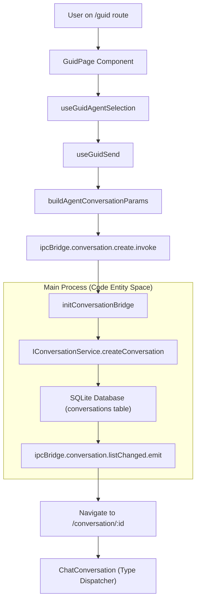
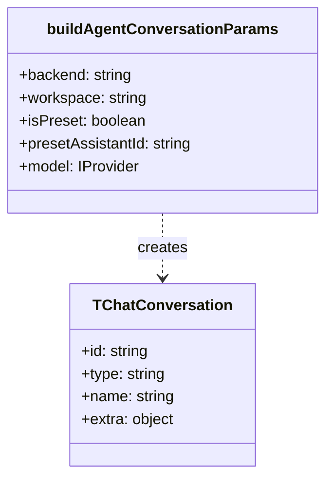

# Conversation Initialization

Relevant source files

The following files were used as context for generating this wiki page:

- [src/common/utils/buildAgentConversationParams.ts](src/common/utils/buildAgentConversationParams.ts)
- [src/common/utils/presetAssistantResources.ts](src/common/utils/presetAssistantResources.ts)
- [src/process/services/cron/cronSkillFile.ts](src/process/services/cron/cronSkillFile.ts)
- [src/renderer/components/settings/SettingsModal/contents/SystemModalContent/DirInputItem.tsx](src/renderer/components/settings/SettingsModal/contents/SystemModalContent/DirInputItem.tsx)
- [src/renderer/components/settings/SettingsModal/contents/SystemModalContent/PreferenceRow.tsx](src/renderer/components/settings/SettingsModal/contents/SystemModalContent/PreferenceRow.tsx)
- [src/renderer/hooks/agent/usePresetAssistantInfo.ts](src/renderer/hooks/agent/usePresetAssistantInfo.ts)
- [src/renderer/pages/conversation/components/ChatConversation.tsx](src/renderer/pages/conversation/components/ChatConversation.tsx)
- [src/renderer/pages/conversation/platforms/acp/AcpChat.tsx](src/renderer/pages/conversation/platforms/acp/AcpChat.tsx)
- [src/renderer/pages/conversation/platforms/acp/useAcpMessage.ts](src/renderer/pages/conversation/platforms/acp/useAcpMessage.ts)
- [src/renderer/pages/conversation/platforms/gemini/GeminiChat.tsx](src/renderer/pages/conversation/platforms/gemini/GeminiChat.tsx)
- [src/renderer/pages/conversation/utils/createConversationParams.ts](src/renderer/pages/conversation/utils/createConversationParams.ts)
- [src/renderer/pages/guid/GuidPage.tsx](src/renderer/pages/guid/GuidPage.tsx)
- [src/renderer/pages/guid/components/AgentPillBar.tsx](src/renderer/pages/guid/components/AgentPillBar.tsx)
- [src/renderer/pages/guid/components/AssistantSelectionArea.tsx](src/renderer/pages/guid/components/AssistantSelectionArea.tsx)
- [src/renderer/pages/guid/components/GuidActionRow.tsx](src/renderer/pages/guid/components/GuidActionRow.tsx)
- [src/renderer/pages/guid/components/QuickActionButtons.tsx](src/renderer/pages/guid/components/QuickActionButtons.tsx)
- [src/renderer/pages/guid/hooks/useGuidAgentSelection.ts](src/renderer/pages/guid/hooks/useGuidAgentSelection.ts)
- [src/renderer/pages/guid/hooks/useGuidSend.ts](src/renderer/pages/guid/hooks/useGuidSend.ts)
- [src/renderer/pages/guid/index.module.css](src/renderer/pages/guid/index.module.css)
- [src/renderer/pages/guid/index.tsx](src/renderer/pages/guid/index.tsx)
- [src/renderer/pages/team/components/TeamChatView.tsx](src/renderer/pages/team/components/TeamChatView.tsx)
- [src/renderer/utils/model/presetAssistantResources.ts](src/renderer/utils/model/presetAssistantResources.ts)
- [tests/unit/AgentPillBar.dom.test.tsx](tests/unit/AgentPillBar.dom.test.tsx)
- [tests/unit/acpSlashCommandsUpdatedEvent.test.ts](tests/unit/acpSlashCommandsUpdatedEvent.test.ts)
- [tests/unit/applicationBridge.test.ts](tests/unit/applicationBridge.test.ts)
- [tests/unit/buildAgentConversationParams.test.ts](tests/unit/buildAgentConversationParams.test.ts)
- [tests/unit/configureChromium.test.ts](tests/unit/configureChromium.test.ts)
- [tests/unit/createConversationParams.test.ts](tests/unit/createConversationParams.test.ts)
- [tests/unit/useGuidSend.dom.test.ts](tests/unit/useGuidSend.dom.test.ts)
- [uno.config.ts](uno.config.ts)

## Purpose and Scope

This page documents the conversation initialization flow in AionUi, from agent selection on the `GuidPage` through IPC-based creation to conversation rendering. It covers:

- The `GuidPage` agent selection interface and model filtering logic.
- Model selection with capability filtering (text, vision, function calling).
- Workspace configuration (default vs. custom directories).
- The `createConversation` IPC flow that initializes agents and persists them to the database.
- The use of `buildAgentConversationParams` to standardize conversation objects across different agent types (Gemini, ACP, Aionrs, etc.).

---

## Conversation Initialization Flow

The conversation initialization process follows a multi-step flow from user interaction on the `GuidPage` through IPC communication to the main process, agent creation, database persistence, and finally navigation to the conversation view.

### Overall Flow Diagram

**Sources:** [src/renderer/pages/guid/GuidPage.tsx:1-20](), [src/renderer/pages/guid/hooks/useGuidSend.ts:117-184](), [src/common/utils/buildAgentConversationParams.ts:14-25](), [src/renderer/pages/conversation/components/ChatConversation.tsx:117-118]()

---

## Guid Page Agent Selection

The `GuidPage` (`/guid`) serves as the entry point for creating new conversations. Users select an agent type, configure a model, and optionally specify workspace settings.

### Agent Selection Interface

The selection logic is managed by the `useGuidAgentSelection` hook, which coordinates available agents from multiple sources.

| Component / Hook | Role |
|-----------|------|
| `AgentPillBar` | Renders a horizontal bar of "pills" for each detected agent backend. [src/renderer/pages/guid/components/AgentPillBar.tsx:25-30]() |
| `useGuidAgentSelection` | Manages state for `selectedAgentKey`, `selectedMode`, and `selectedAcpModel`. [src/renderer/pages/guid/hooks/useGuidAgentSelection.ts:72-83]() |
| `AssistantSelectionArea` | Displays preset assistants (e.g., "Cowork") and handles custom agent/skill management. [src/renderer/pages/guid/components/AssistantSelectionArea.tsx:48-59]() |
| `QuickActionButtons` | Provides links to external resources and monitors WebUI status via `webui.getStatus`. [src/renderer/pages/guid/components/QuickActionButtons.tsx:44-48]() |

### Available Agent Detection

The UI retrieves available agents through a combination of sub-hooks within `useGuidAgentSelection`:
1.  **Custom Agents:** Loaded via `useCustomAgentsLoader`. [src/renderer/pages/guid/hooks/useGuidAgentSelection.ts:134-136]()
2.  **Preset Assistants:** Resolved via `usePresetAssistantResolver` which maps localized rules and skills. [src/renderer/pages/guid/hooks/useGuidAgentSelection.ts:138-139]()
3.  **Availability Check:** `useAgentAvailability` determines if a specific backend (e.g., Gemini with Google Auth) is functional. [src/renderer/pages/guid/hooks/useGuidAgentSelection.ts:141-146]()

**Sources:** [src/renderer/pages/guid/hooks/useGuidAgentSelection.ts:134-151](), [src/renderer/pages/guid/components/AgentPillBar.tsx:56-73]()

---

## Model Selection and Capability Filtering

Models are configured via the `IProvider` interface. During initialization, the system selects models based on the agent's requirements.

### Gemini Model Selection
For Gemini-based agents, `useGeminiModelSelection` is used to track and update the selected model. If a user changes the model in an existing conversation, `ipcBridge.conversation.update` is invoked to persist the change. [src/renderer/pages/conversation/components/ChatConversation.tsx:140-147]()

### ACP Model Filtering
For ACP agents (like Claude or Codex), the `GuidPage` provides an `AcpModelSelector` (rendered within `GuidActionRow`). The `selectedAcpModel` state is saved to the agent's preferred configuration via `savePreferredModelId`. [src/renderer/pages/guid/hooks/useGuidAgentSelection.ts:110-119]()

---

## Workspace Configuration

Conversations can use either a default auto-generated workspace or a user-specified custom directory.

### Initialization via GuidActionRow
In the `GuidActionRow`, users can:
- **Upload Files:** Triggered via `ipcBridge.dialog.showOpen`. [src/renderer/pages/guid/components/GuidActionRow.tsx:140-145]()
- **Specify Workspace:** Opens a directory picker to set the `dir` state. [src/renderer/pages/guid/components/GuidActionRow.tsx:153-158]()

When the conversation is created, these paths are passed into `buildAgentConversationParams` as `workspace` and `extra.defaultFiles`. [src/renderer/pages/guid/hooks/useGuidSend.ts:161-175]()

---

## IPC Conversation Creation Flow

### Parameter Standardization
The `buildAgentConversationParams` function acts as a factory that transforms UI state into a `TChatConversation` object suitable for the database.

**Sources:** [src/common/utils/buildAgentConversationParams.ts:14-25](), [src/renderer/pages/guid/hooks/useGuidSend.ts:156-182]()

### The Send Logic (`useGuidSend`)
The `handleSend` function in `useGuidSend` orchestrates the creation:
1.  **Fallback Check:** If a preset agent's main backend is unavailable, it attempts to switch to a fallback agent. [src/renderer/pages/guid/hooks/useGuidSend.ts:131-143]()
2.  **IPC Invoke:** Calls `ipcBridge.conversation.create.invoke(params)`. [src/renderer/pages/guid/hooks/useGuidSend.ts:184-184]()
3.  **Initial Message:** For Gemini agents, the initial user prompt is stored in `sessionStorage` (e.g., `gemini_init_input_...`) to be picked up by the chat component after navigation. [src/renderer/pages/guid/hooks/useGuidSend.ts:204-204]()
4.  **Navigation:** Redirects the user to `/conversation/:id`. [src/renderer/pages/guid/hooks/useGuidSend.ts:211-211]()

**Sources:** [src/renderer/pages/guid/hooks/useGuidSend.ts:117-215]()

---

## Conversation Rendering (Type Dispatcher)

Once navigated to `/conversation/:id`, the `ChatConversation` component acts as a router/dispatcher.

| Conversation Type | Component Rendered | Model Selection Hook |
|-------------------|--------------------|----------------------|
| `gemini` | `GeminiChat` | `useGeminiModelSelection` [src/renderer/pages/conversation/components/ChatConversation.tsx:150-150]() |
| `acp` | `AcpChat` | `AcpModelSelector` [src/renderer/pages/conversation/components/ChatConversation.tsx:28-28]() |
| `aionrs` | `AionrsChat` | `useAionrsModelSelection` [src/renderer/pages/conversation/components/ChatConversation.tsx:33-33]() |
| `nanobot` | `NanobotChat` | N/A [src/renderer/pages/conversation/components/ChatConversation.tsx:24-24]() |

### Team Mode Initialization
In **Team Mode**, the `TeamChatView` component performs similar dispatching but omits the `ChatLayout` wrapper, allowing multiple agents to be rendered within the team pane. [src/renderer/pages/team/components/TeamChatView.tsx:84-147]()

**Sources:** [src/renderer/pages/conversation/components/ChatConversation.tsx:134-220](), [src/renderer/pages/team/components/TeamChatView.tsx:84-152]()

---

## Summary Table: Initialization Parameters

| Parameter | Type | Source | Description |
|-----------|------|--------|-------------|
| `id` | `string` | `uuid()` | Unique session identifier. [src/renderer/pages/conversation/components/ChatConversation.tsx:100-100]() |
| `workspace` | `string` | `GuidPage` | Directory path for agent file operations. [src/renderer/pages/guid/hooks/useGuidSend.ts:119-119]() |
| `sessionMode` | `string` | `AgentModeSelector` | Agent permission level (e.g., `yolo`, `autoEdit`). [src/renderer/pages/guid/hooks/useGuidSend.ts:173-173]() |
| `presetAssistantId`| `string` | `AssistantSelectionArea` | ID of the built-in or custom assistant preset. [src/renderer/pages/guid/hooks/useGuidSend.ts:123-123]() |
| `model` | `TProviderWithModel` | `AcpModelSelector` | The specific LLM provider and model name. [src/renderer/pages/guid/hooks/useGuidSend.ts:162-162]() |

**Sources:** [src/renderer/pages/guid/hooks/useGuidSend.ts:156-182](), [src/renderer/pages/conversation/components/ChatConversation.tsx:86-128]()