# Conversation Interface

<details>
<summary>Relevant source files</summary>

The following files were used as context for generating this wiki page:

- [src/process/initAgent.ts](src/process/initAgent.ts)
- [src/process/task/OpenClawAgentManager.ts](src/process/task/OpenClawAgentManager.ts)
- [src/renderer/components/sendbox.tsx](src/renderer/components/sendbox.tsx)
- [src/renderer/layout.tsx](src/renderer/layout.tsx)
- [src/renderer/pages/conversation/ChatConversation.tsx](src/renderer/pages/conversation/ChatConversation.tsx)
- [src/renderer/pages/conversation/ChatHistory.tsx](src/renderer/pages/conversation/ChatHistory.tsx)
- [src/renderer/pages/conversation/ChatLayout.tsx](src/renderer/pages/conversation/ChatLayout.tsx)
- [src/renderer/pages/conversation/ChatSider.tsx](src/renderer/pages/conversation/ChatSider.tsx)
- [src/renderer/pages/conversation/acp/AcpSendBox.tsx](src/renderer/pages/conversation/acp/AcpSendBox.tsx)
- [src/renderer/pages/conversation/codex/CodexSendBox.tsx](src/renderer/pages/conversation/codex/CodexSendBox.tsx)
- [src/renderer/pages/conversation/gemini/GeminiSendBox.tsx](src/renderer/pages/conversation/gemini/GeminiSendBox.tsx)
- [src/renderer/pages/conversation/nanobot/NanobotSendBox.tsx](src/renderer/pages/conversation/nanobot/NanobotSendBox.tsx)
- [src/renderer/pages/conversation/openclaw/OpenClawSendBox.tsx](src/renderer/pages/conversation/openclaw/OpenClawSendBox.tsx)
- [src/renderer/pages/settings/SettingsSider.tsx](src/renderer/pages/settings/SettingsSider.tsx)
- [src/renderer/router.tsx](src/renderer/router.tsx)
- [src/renderer/sider.tsx](src/renderer/sider.tsx)
- [src/renderer/styles/themes/base.css](src/renderer/styles/themes/base.css)

</details>

## Overview

The Conversation Interface centers around the `ChatConversation` router component, which discriminates conversation types and renders agent-specific UIs. Each conversation type (`gemini`, `acp`, `codex`, `openclaw-gateway`, `nanobot`) receives a specialized panel that integrates `MessageList`, agent-specific `SendBox`, and workspace panels through the shared `ChatLayout` wrapper.

**Key Components:**

- **ChatConversation**: Type-based router that selects agent UI
- **ChatLayout**: Three-panel layout wrapper (chat/preview/workspace)
- **Agent-specific panels**: GeminiChat, AcpChat, CodexChat, etc.
- **SendBox variants**: Agent-specific input components with state management
- **ChatSider**: Workspace panel integration

For message rendering details, see [Message Rendering System](#5.4). For input-specific logic like file paste handling, see [Message Input System](#5.5). For workspace panel implementation, see [File & Workspace Management](#5.6).

---

## ChatConversation Router

The `ChatConversation` component serves as the central routing point, using TypeScript discriminated unions to safely handle different conversation types.

### Type Discrimination Flow

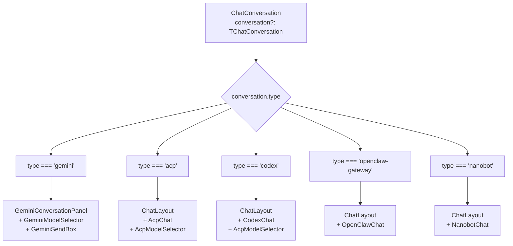

**Type-specific rendering logic:**

```typescript
// Early return for Gemini with dedicated layout
if (conversation && conversation.type === 'gemini') {
  return <GeminiConversationPanel key={conversation.id}
                                  conversation={conversation}
                                  sliderTitle={sliderTitle} />;
}

// Other agents use shared ChatLayout with type-specific content
const conversationNode = useMemo(() => {
  if (!conversation || isGeminiConversation) return null;
  switch (conversation.type) {
    case 'acp':
      return <AcpChat key={conversation.id} conversation_id={conversation.id}
                      workspace={conversation.extra?.workspace}
                      backend={conversation.extra?.backend} />;
    case 'codex':
      return <CodexChat key={conversation.id} conversation_id={conversation.id}
                        workspace={conversation.extra?.workspace} />;
    // ... other cases
  }
}, [conversation]);
```

**Sources:** [src/renderer/pages/conversation/ChatConversation.tsx:141-163](), [src/renderer/pages/conversation/ChatConversation.tsx:192-216]()

### Agent Logo and Name Resolution

The router resolves agent branding using a fallback chain:

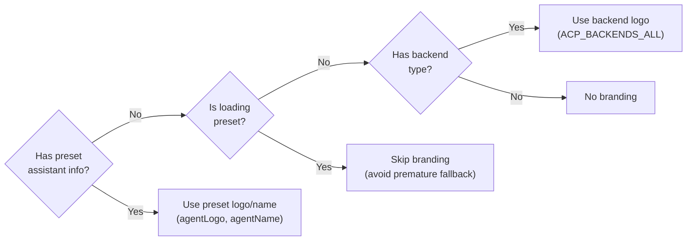

**Sources:** [src/renderer/pages/conversation/ChatConversation.tsx:166-211]()

---

## Three-Panel Layout Architecture

The `ChatLayout` component implements a responsive three-panel system: **chat content** (left), **preview panel** (center when open), and **workspace panel** (right). Panels use flexbox with dynamic `flexBasis` to enable drag-based resizing while maintaining minimum widths.

### Layout Structure

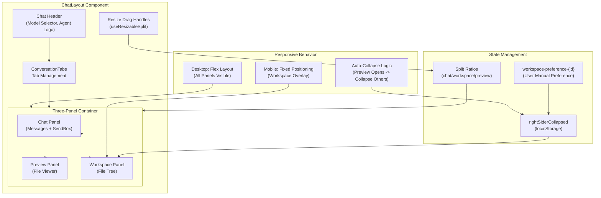

**Sources:** [src/renderer/pages/conversation/ChatLayout.tsx:1-513]()

### Panel Width Management

The layout uses two `useResizableSplit` hooks for independent width control:

| Split          | Storage Key                  | Default | Min | Max | Controls                              |
| -------------- | ---------------------------- | ------- | --- | --- | ------------------------------------- |
| Chat/Preview   | `chat-preview-split-ratio`   | 60%     | 25% | 80% | Chat panel width when preview is open |
| Chat/Workspace | `chat-workspace-split-ratio` | 20%     | 12% | 40% | Workspace panel width                 |

Width constraints are enforced dynamically:

- When preview opens, workspace max width shrinks to prevent overflow: `maxWorkspace = 100 - chatRatio - MIN_PREVIEW_RATIO`
- When workspace expands, chat max width adjusts: `maxChat = 100 - workspaceRatio - MIN_PREVIEW_RATIO`

**Sources:** [src/renderer/pages/conversation/ChatLayout.tsx:272-320]()

### Workspace Auto-Collapse Logic

The workspace panel implements intelligent auto-collapse based on file availability and user preference:

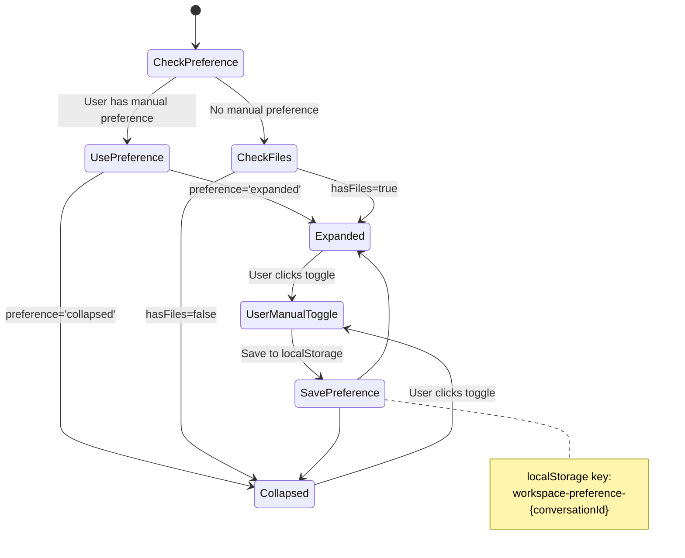

**Sources:** [src/renderer/pages/conversation/ChatLayout.tsx:168-215]()

### Preview Panel Auto-Collapse

When the preview panel opens, the layout automatically collapses the sidebar and workspace, storing their previous states for restoration:

```typescript
// Auto-collapse logic when preview opens
if (isPreviewOpen && !previousPreviewOpenRef.current) {
  previousWorkspaceCollapsedRef.current = rightSiderCollapsed
  previousSiderCollapsedRef.current = layout?.siderCollapsed
  setRightSiderCollapsed(true)
  layout?.setSiderCollapsed?.(true)
}
// Restore previous states when preview closes
else if (!isPreviewOpen && previousPreviewOpenRef.current) {
  setRightSiderCollapsed(previousWorkspaceCollapsedRef.current)
  layout?.setSiderCollapsed(previousSiderCollapsedRef.current)
}
```

**Sources:** [src/renderer/pages/conversation/ChatLayout.tsx:323-350]()

---

## Agent-Specific Conversation Views

The `ChatConversation` component routes to agent-specific panels based on the conversation's `type` field. Each agent type has distinct UI requirements.

### Component Integration Strategy

Each agent panel integrates three core UI sections through `ChatLayout`:

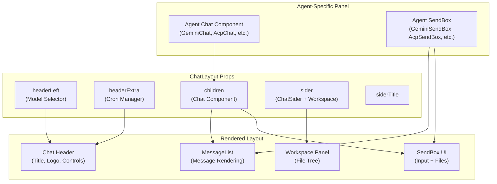

**Sources:** [src/renderer/pages/conversation/ChatConversation.tsx:102-138](), [src/renderer/pages/conversation/ChatLayout.tsx:74-90]()

### Gemini Conversation Panel

Gemini is unique in providing dynamic model selection, implemented through shared state between header and SendBox:

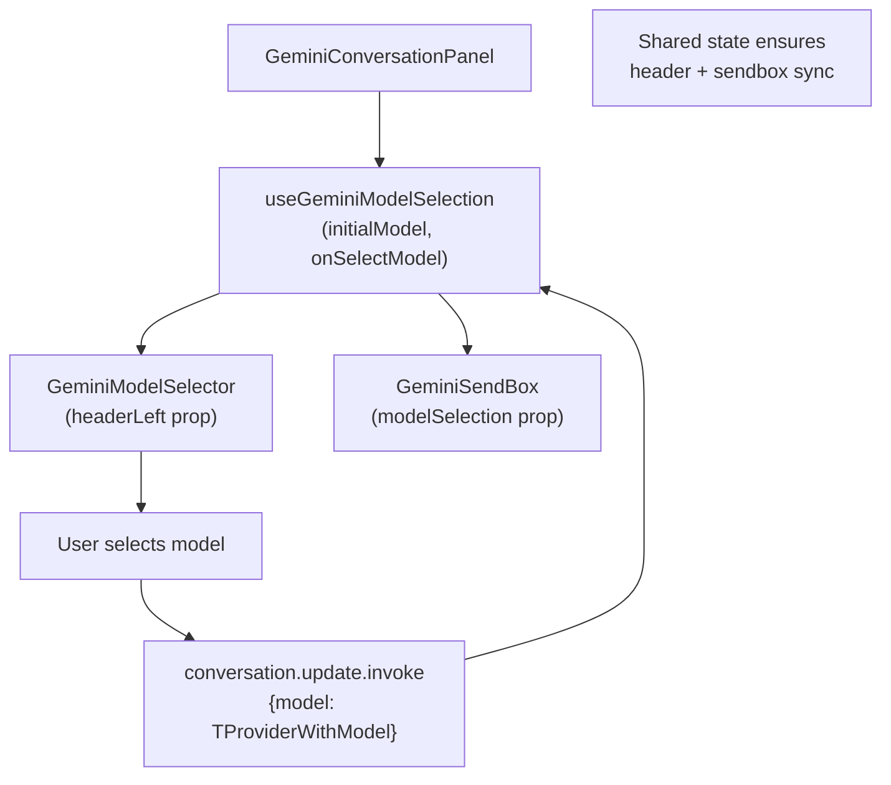

**Model selection callback:**

```typescript
const onSelectModel = async (_provider: IProvider, modelName: string) => {
  const selected = { ..._provider, useModel: modelName } as TProviderWithModel
  const ok = await ipcBridge.conversation.update.invoke({
    id: conversation.id,
    updates: { model: selected },
  })
  return Boolean(ok)
}

const modelSelection = useGeminiModelSelection({ initialModel, onSelectModel })
```

**ChatLayout integration:**

```typescript
<ChatLayout
  title={conversation.name}
  headerLeft={<GeminiModelSelector selection={modelSelection} />}
  headerExtra={<CronJobManager conversationId={conversation.id} />}
  sider={<ChatSider conversation={conversation} />}
  backend="gemini"
  agentName={presetAssistantInfo?.name}
  agentLogo={presetAssistantInfo?.logo}
>
  <GeminiChat conversation_id={conversation.id}
              modelSelection={modelSelection} />
</ChatLayout>
```

**Sources:** [src/renderer/pages/conversation/ChatConversation.tsx:102-138](), [src/renderer/pages/conversation/gemini/useGeminiModelSelection.ts:1-200]()

### ACP and Codex Panels

Non-Gemini agents use a simpler integration with `AcpModelSelector` for runtime model display:

```typescript
// ACP: Show model selector with backend context
const modelSelector = conversation.type === 'acp' ? (
  <AcpModelSelector
    conversationId={conversation.id}
    backend={conversation.extra?.backend}
    initialModelId={conversation.extra?.currentModelId}
  />
) : <GeminiModelSelector disabled={true} />;

// Pass to ChatLayout headerLeft
<ChatLayout
  headerLeft={modelSelector}
  headerExtra={<CronJobManager conversationId={conversation.id} />}
  backend={conversation.extra?.backend}
  agentName={presetAssistantInfo?.name || conversation.extra?.agentName}
>
  {conversationNode}
</ChatLayout>
```

**Sources:** [src/renderer/pages/conversation/ChatConversation.tsx:180-216]()

---

## Agent-Specific Chat Components

Each conversation type renders a dedicated chat component that integrates `MessageList` and its specialized `SendBox`.

### Component Hierarchy

```mermaid
graph TB
    subgraph GeminiChat["GeminiChat"]
        GMsgList["MessageList<br/>(messages from DB)"]
        GThought["ThoughtDisplay"]
        GSendBox["GeminiSendBox<br/>(model selection)"]
    end

    subgraph AcpChat["AcpChat"]
        AMsgList["MessageList"]
        AThought["ThoughtDisplay"]
        ASendBox["AcpSendBox<br/>(backend-specific)"]
    end

    subgraph CodexChat["CodexChat"]
        CMsgList["MessageList"]
        CThought["ThoughtDisplay"]
        CSendBox["CodexSendBox<br/>(session status)"]
    end

    GMsgList --> GThought
    GThought --> GSendBox

    AMsgList --> AThought
    AThought --> ASendBox

    CMsgList --> CThought
    CThought --> CSendBox
```

**Typical structure (GeminiChat):**

```typescript
const GeminiChat: React.FC<{ conversation_id: string; modelSelection }> = () => {
  return (
    <FlexFullContainer className="flex flex-col">
      <MessageList conversation_id={conversation_id} />
      <GeminiSendBox conversation_id={conversation_id}
                     modelSelection={modelSelection} />
    </FlexFullContainer>
  );
};
```

**Sources:** [src/renderer/pages/conversation/gemini/GeminiChat.tsx:1-50](), [src/renderer/pages/conversation/acp/AcpChat.tsx:1-50](), [src/renderer/pages/conversation/codex/CodexChat.tsx:1-50]()

---

## SendBox System

Each agent type has a specialized `SendBox` component that manages input state, file attachments, and message sending. All SendBox components share the base `SendBox` component but implement agent-specific state management.

### SendBox Component Architecture

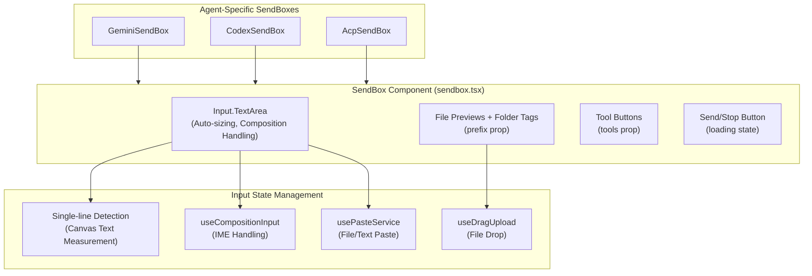

**Sources:** [src/renderer/components/sendbox.tsx:1-351]()

### Single-Line Mode Detection

The `SendBox` uses canvas text measurement to determine when to switch between single-line and multi-line modes:

```typescript
// Detect content width using offscreen canvas
const canvas = measurementCanvasRef.current ?? document.createElement('canvas')
const context = canvas.getContext('2d')
context.font = textareaStyle.font
const textWidth = context.measureText(input || '').width

// Switch to multi-line if text exceeds baseline width
if (textWidth >= baseWidth) {
  setIsSingleLine(false)
} else if (textWidth < baseWidth - 30 && !lockMultiLine) {
  setIsSingleLine(true)
}
```

This prevents expensive DOM layout calculations for long text by switching to multi-line mode when `input.length >= MAX_SINGLE_LINE_CHARACTERS` (800).

**Sources:** [src/renderer/components/sendbox.tsx:86-155]()

### Agent-Specific Draft Management

Each agent SendBox uses `getSendBoxDraftHook` to create a type-specific draft hook:

| Agent  | Hook Name               | Draft Type                                                                               | Fields                                |
| ------ | ----------------------- | ---------------------------------------------------------------------------------------- | ------------------------------------- |
| Gemini | `useGeminiSendBoxDraft` | `{ _type: 'gemini', content: string, atPath: FileOrFolderItem[], uploadFile: string[] }` | Text, workspace files, uploaded files |
| Codex  | `useCodexSendBoxDraft`  | `{ _type: 'codex', content: string, atPath: FileOrFolderItem[], uploadFile: string[] }`  | Text, workspace files, uploaded files |
| ACP    | `useAcpSendBoxDraft`    | `{ _type: 'acp', content: string, atPath: FileOrFolderItem[], uploadFile: string[] }`    | Text, workspace files, uploaded files |

The `getSendBoxDraftHook` factory function returns a hook that persists drafts to `sessionStorage` with the key pattern `sendbox-draft-{agentType}-{conversationId}`.

**Sources:** [src/renderer/pages/conversation/gemini/GeminiSendBox.tsx:29-34](), [src/renderer/pages/conversation/codex/CodexSendBox.tsx:24-36](), [src/renderer/pages/conversation/acp/AcpSendBox.tsx:25-30]()

---

## Message State Management

Each agent SendBox manages streaming state differently based on the agent's characteristics.

### Gemini Message State

Gemini uses the most complex state tracking due to tool execution and streaming:

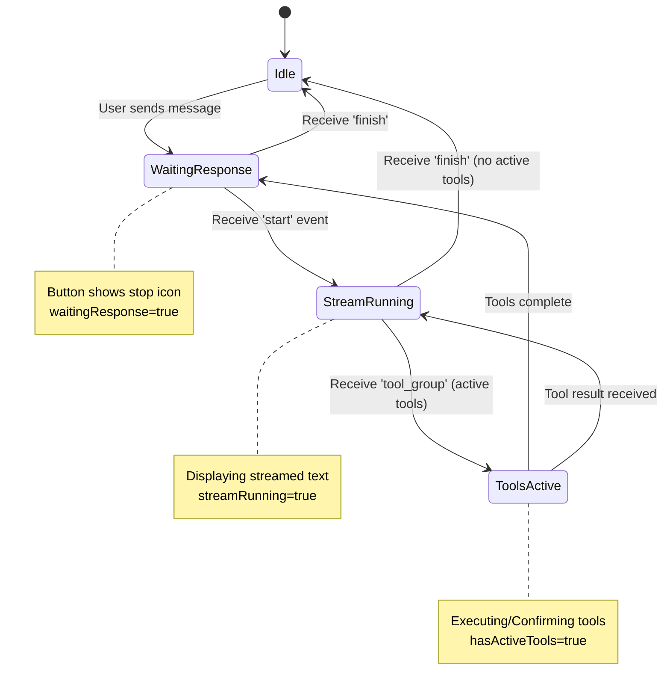

The `running` state is computed as: `waitingResponse || streamRunning || hasActiveTools`. This ensures the stop button remains active during all phases.

**Sources:** [src/renderer/pages/conversation/gemini/GeminiSendBox.tsx:36-292]()

### State Event Filtering

Gemini implements event filtering using `activeMsgIdRef` to prevent aborted requests from interfering with new ones:

```typescript
// Set active message ID when sending
setActiveMsgId(msg_id)

// Filter out events from old requests
if (
  activeMsgIdRef.current &&
  message.msg_id &&
  message.msg_id !== activeMsgIdRef.current
) {
  if (message.type === 'thought') {
    return // Only filter thought/start, other messages must render
  }
}
```

**Sources:** [src/renderer/pages/conversation/gemini/GeminiSendBox.tsx:118-138]()

### Codex and ACP Message State

Codex and ACP use simpler state management:

**Codex:**

- `running`: General execution state (legacy, rarely used)
- `aiProcessing`: AI response in progress (loading state)
- `codexStatus`: Connection state (`'connecting'`, `'session_active'`, etc.)

**ACP:**

- `running`: Stream running state (from `'start'`/`'finish'` events)
- `aiProcessing`: Loading state while waiting for AI response
- `acpStatus`: Agent authentication state

Both reset all state when `conversation_id` changes to prevent state pollution when switching conversations.

**Sources:** [src/renderer/pages/conversation/codex/CodexSendBox.tsx:45-130](), [src/renderer/pages/conversation/acp/AcpSendBox.tsx:32-168]()

### Thought Display Throttling

All three SendBoxes implement thought message throttling to reduce render frequency:

```typescript
const THROTTLE_MS = 50
const throttledSetThought = useMemo(() => {
  return (data: ThoughtData) => {
    const now = Date.now()
    const ref = thoughtThrottleRef.current

    if (now - ref.lastUpdate >= THROTTLE_MS) {
      setThought(data) // Update immediately
      ref.lastUpdate = now
    } else {
      ref.pending = data // Queue for later
      if (!ref.timer) {
        ref.timer = setTimeout(
          () => {
            setThought(ref.pending)
          },
          THROTTLE_MS - (now - ref.lastUpdate)
        )
      }
    }
  }
}, [])
```

This prevents excessive re-renders during rapid thought updates from the backend.

**Sources:** [src/renderer/pages/conversation/gemini/GeminiSendBox.tsx:69-102](), [src/renderer/pages/conversation/codex/CodexSendBox.tsx:61-91](), [src/renderer/pages/conversation/acp/AcpSendBox.tsx:50-80]()

---

## Initial Message Handling

All agent SendBoxes implement a deferred send pattern for messages from the guid page. The message is stored in `sessionStorage` and sent after the conversation view loads.

### Gemini Initial Message Flow

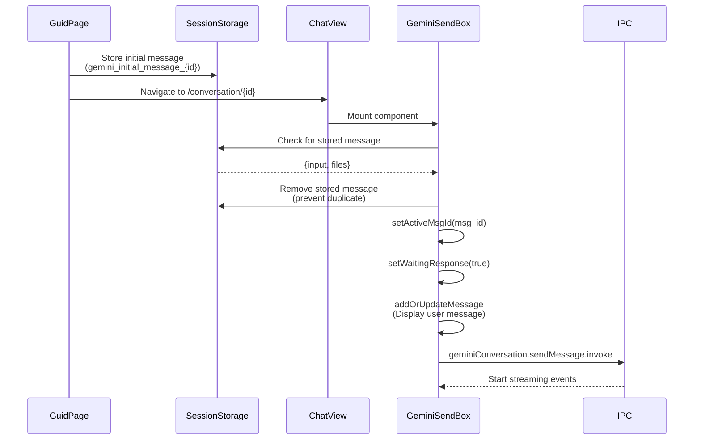

**Sources:** [src/renderer/pages/conversation/gemini/GeminiSendBox.tsx:420-470]()

### Codex Initial Message Flow

Codex waits for `codexStatus === 'session_active'` before sending the initial message. This ensures the Codex agent has established a connection:

```typescript
useEffect(() => {
  if (!conversation_id || !codexStatus) return
  if (codexStatus !== 'session_active') return

  const processInitialMessage = async () => {
    const stored = sessionStorage.getItem(storageKey)
    if (!stored) return

    // Double-check locking to prevent race conditions
    if (sessionStorage.getItem(processedKey)) return
    sessionStorage.setItem(processedKey, 'true')

    // Send message...
  }

  setTimeout(() => processInitialMessage(), 200) // Small delay for state stabilization
}, [conversation_id, codexStatus])
```

**Sources:** [src/renderer/pages/conversation/codex/CodexSendBox.tsx:267-338]()

### ACP Initial Message Flow

ACP also waits for authentication (`acpStatus === 'session_active'`) and uses a `sendingInitialMessageRef` flag to prevent duplicate sends:

```typescript
useEffect(() => {
  if (!acpStatus || acpStatus !== 'session_active') return

  const sendInitialMessage = async () => {
    if (sendingInitialMessageRef.current) return // Prevent duplicate
    sendingInitialMessageRef.current = true

    const storedMessage = sessionStorage.getItem(storageKey)
    if (!storedMessage) return

    // Send message and handle errors...
  }
}, [conversation_id, backend, acpStatus])
```

**Sources:** [src/renderer/pages/conversation/acp/AcpSendBox.tsx:252-330]()

---

## File Handling Integration

All SendBoxes display files in two sections:

1. **File previews** (top): Individual files with thumbnails
2. **Folder tags** (bottom): Folders selected from workspace

### File Display Structure

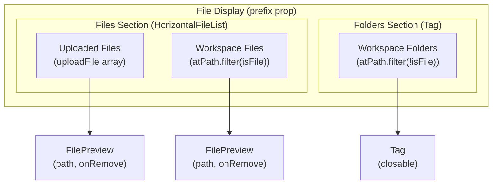

**Sources:** [src/renderer/pages/conversation/gemini/GeminiSendBox.tsx:597-650](), [src/renderer/pages/conversation/codex/CodexSendBox.tsx:392-445](), [src/renderer/pages/conversation/acp/AcpSendBox.tsx:446-499]()

### Workspace File Selection Events

SendBoxes listen to workspace file selection events using `useAddEventListener`:

| Event Name                     | Purpose                       | Payload                             |
| ------------------------------ | ----------------------------- | ----------------------------------- |
| `{agent}.selected.file`        | Replace entire file selection | `Array<string \| FileOrFolderItem>` |
| `{agent}.selected.file.append` | Merge with existing selection | `Array<string \| FileOrFolderItem>` |
| `{agent}.selected.file.clear`  | Clear all selections          | `void`                              |

The `append` event uses `mergeFileSelectionItems` to deduplicate files:

```typescript
useAddEventListener('gemini.selected.file.append', (items) => {
  const merged = mergeFileSelectionItems(atPathRef.current, items)
  if (merged !== atPathRef.current) {
    setAtPath(merged)
  }
})
```

**Sources:** [src/renderer/pages/conversation/gemini/GeminiSendBox.tsx:546-552](), [src/renderer/pages/conversation/codex/CodexSendBox.tsx:215-222](), [src/renderer/pages/conversation/acp/AcpSendBox.tsx:400-406]()

---

## Responsive Behavior

The layout implements different strategies for desktop and mobile devices.

### Desktop Layout

Desktop uses a flex-based layout where all three panels are visible simultaneously. Drag handles allow users to adjust panel widths, which are persisted to `localStorage`.

**Key behaviors:**

- Workspace panel: Toggleable via button in header (Windows) or floating button (Linux)
- Preview panel: Opens in center, auto-collapses sidebar and workspace
- Minimum widths enforced: Chat 240px, Workspace 220px, Preview 260px

**Sources:** [src/renderer/pages/conversation/ChatLayout.tsx:292-320]()

### Mobile Layout

Mobile uses fixed positioning for the workspace panel, creating an overlay effect:

```css
/* Mobile workspace overlay */
position: fixed;
right: 0;
top: 0;
height: 100vh;
width: {workspaceWidthPx}px;
z-index: 100;
transform: rightSiderCollapsed ? 'translateX(100%)' : 'translateX(0)';
```

A backdrop is rendered when workspace is open:

```tsx
{
  layout?.isMobile && !rightSiderCollapsed && (
    <div
      className="fixed inset-0 bg-black/30 z-90"
      onClick={() => setRightSiderCollapsed(true)}
    />
  )
}
```

**Sources:** [src/renderer/pages/conversation/ChatLayout.tsx:474-500]()

### Mobile Detection

Mobile detection is handled by `useLayoutContext` in the parent `Layout` component, checking `window.innerWidth < 768`:

```typescript
useEffect(() => {
  const checkMobile = () => {
    const mobile = window.innerWidth < 768
    setIsMobile(mobile)
  }
  checkMobile()
  window.addEventListener('resize', checkMobile)
  return () => window.removeEventListener('resize', checkMobile)
}, [])
```

**Sources:** [src/renderer/layout.tsx:148-160]()

---

## Workspace Panel Integration

The workspace panel is integrated through `ChatSider`, which wraps the `ChatWorkspace` component with agent-specific event prefixes.

### ChatSider Integration

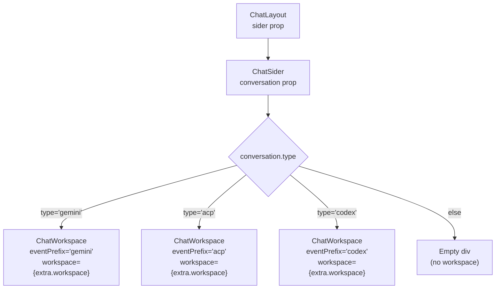

**ChatSider implementation:**

```typescript
const ChatSider: React.FC<{ conversation?: TChatConversation }> = ({ conversation }) => {
  const [messageApi, messageContext] = Message.useMessage({ maxCount: 1 });

  let workspaceNode: React.ReactNode = null;
  if (conversation?.type === 'gemini') {
    workspaceNode = <ChatWorkspace
      conversation_id={conversation.id}
      workspace={conversation.extra.workspace}
      messageApi={messageApi}
    />;
  } else if (conversation?.type === 'acp' && conversation.extra?.workspace) {
    workspaceNode = <ChatWorkspace
      conversation_id={conversation.id}
      workspace={conversation.extra.workspace}
      eventPrefix='acp'
      messageApi={messageApi}
    />;
  }
  // ... codex case similar

  return <>{messageContext}{workspaceNode}</>;
};
```

**Sources:** [src/renderer/pages/conversation/ChatSider.tsx:1-39]()

### Event Prefix System

The `eventPrefix` enables agent-specific workspace events:

| Event Pattern     | Gemini                        | ACP                        | Codex                        |
| ----------------- | ----------------------------- | -------------------------- | ---------------------------- |
| File selection    | `gemini.selected.file`        | `acp.selected.file`        | `codex.selected.file`        |
| File append       | `gemini.selected.file.append` | `acp.selected.file.append` | `codex.selected.file.append` |
| Clear selection   | `gemini.selected.file.clear`  | `acp.selected.file.clear`  | `codex.selected.file.clear`  |
| Refresh workspace | `gemini.workspace.refresh`    | `acp.workspace.refresh`    | `codex.workspace.refresh`    |

SendBox components listen to their specific events:

```typescript
// In GeminiSendBox
useAddEventListener('gemini.selected.file', setAtPath)
useAddEventListener('gemini.selected.file.append', (items) => {
  const merged = mergeFileSelectionItems(atPathRef.current, items)
  setAtPath(merged)
})
```

**Sources:** [src/renderer/pages/conversation/gemini/GeminiSendBox.tsx:814-820](), [src/renderer/pages/conversation/acp/AcpSendBox.tsx:542-548](), [src/renderer/pages/conversation/workspace/index.tsx:1-600]()

---

## Conversation Tabs

The `ConversationTabs` component provides multi-conversation tab management, displayed above the chat header.

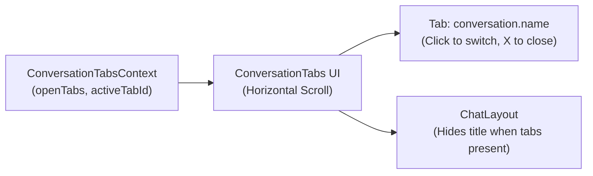

When `openTabs.length > 0`, the conversation title in the header is hidden to avoid redundancy:

```typescript
const hasTabs = openTabs.length > 0;

<ArcoLayout.Header className="chat-layout-header">
  {!layout?.isMobile && !hasTabs && (
    <span className="font-bold text-16px">{props.title}</span>
  )}
</ArcoLayout.Header>
```

**Sources:** [src/renderer/pages/conversation/ChatLayout.tsx:133-386](), [src/renderer/pages/conversation/ConversationTabs.tsx:1-200]()

---

## Summary

The Conversation Interface implements a sophisticated three-panel layout with agent-specific views, adaptive SendBox components, and intelligent state management. Key architectural patterns include:

1. **Dynamic Panel Management**: Flexbox-based resizing with drag handles and localStorage persistence
2. **Agent Polymorphism**: Type-based routing to specialized conversation panels
3. **State Coordination**: Complex streaming state machines with event filtering and throttling
4. **Deferred Messaging**: SessionStorage handoff for instant navigation with async message sending
5. **Responsive Design**: Flex layout for desktop, fixed overlay for mobile
6. **File Integration**: Dual display system for files (previews) and folders (tags)
