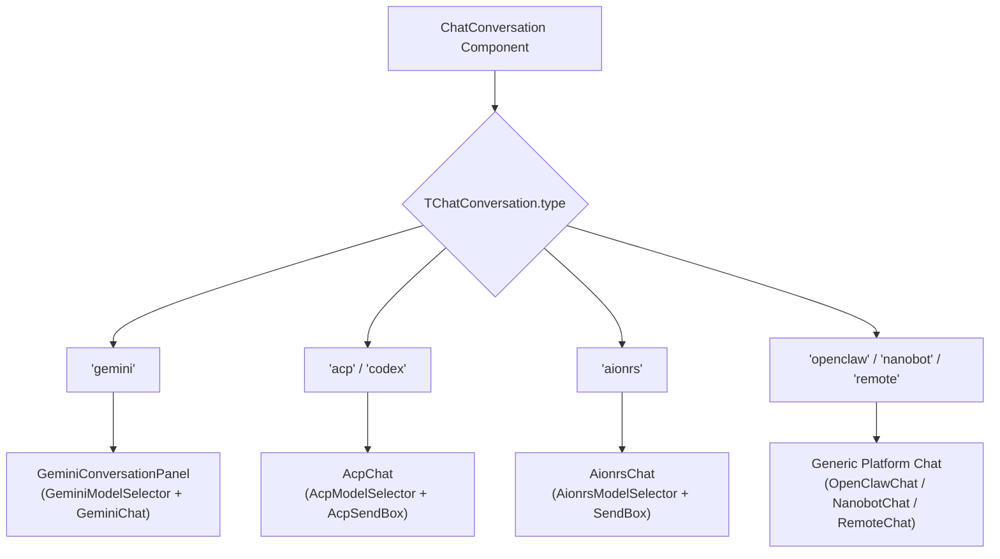
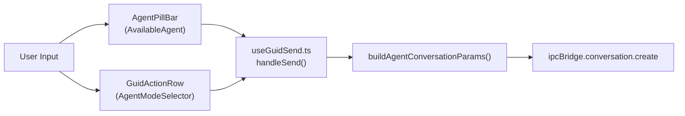

# Conversation Interface

Relevant source files

The following files were used as context for generating this wiki page:

- [src/common/utils/buildAgentConversationParams.ts](src/common/utils/buildAgentConversationParams.ts)
- [src/process/bridge/starOfficeBridge.ts](src/process/bridge/starOfficeBridge.ts)
- [src/process/services/cron/cronSkillFile.ts](src/process/services/cron/cronSkillFile.ts)
- [src/renderer/hooks/agent/usePresetAssistantInfo.ts](src/renderer/hooks/agent/usePresetAssistantInfo.ts)
- [src/renderer/pages/conversation/components/ChatConversation.tsx](src/renderer/pages/conversation/components/ChatConversation.tsx)
- [src/renderer/pages/conversation/platforms/acp/AcpChat.tsx](src/renderer/pages/conversation/platforms/acp/AcpChat.tsx)
- [src/renderer/pages/conversation/platforms/acp/useAcpMessage.ts](src/renderer/pages/conversation/platforms/acp/useAcpMessage.ts)
- [src/renderer/pages/conversation/platforms/gemini/GeminiChat.tsx](src/renderer/pages/conversation/platforms/gemini/GeminiChat.tsx)
- [src/renderer/pages/guid/GuidPage.tsx](src/renderer/pages/guid/GuidPage.tsx)
- [src/renderer/pages/guid/components/AgentPillBar.tsx](src/renderer/pages/guid/components/AgentPillBar.tsx)
- [src/renderer/pages/guid/components/AssistantSelectionArea.tsx](src/renderer/pages/guid/components/AssistantSelectionArea.tsx)
- [src/renderer/pages/guid/components/GuidActionRow.tsx](src/renderer/pages/guid/components/GuidActionRow.tsx)
- [src/renderer/pages/guid/components/QuickActionButtons.tsx](src/renderer/pages/guid/components/QuickActionButtons.tsx)
- [src/renderer/pages/guid/hooks/useGuidAgentSelection.ts](src/renderer/pages/guid/hooks/useGuidAgentSelection.ts)
- [src/renderer/pages/guid/hooks/useGuidSend.ts](src/renderer/pages/guid/hooks/useGuidSend.ts)
- [src/renderer/pages/guid/index.module.css](src/renderer/pages/guid/index.module.css)
- [src/renderer/pages/team/components/TeamChatView.tsx](src/renderer/pages/team/components/TeamChatView.tsx)
- [tests/unit/AgentPillBar.dom.test.tsx](tests/unit/AgentPillBar.dom.test.tsx)
- [tests/unit/acpSlashCommandsUpdatedEvent.test.ts](tests/unit/acpSlashCommandsUpdatedEvent.test.ts)
- [tests/unit/useGuidSend.dom.test.ts](tests/unit/useGuidSend.dom.test.ts)
- [tests/unit/workspaceUtils.test.ts](tests/unit/workspaceUtils.test.ts)
- [uno.config.ts](uno.config.ts)

The Conversation Interface centers around the `ChatConversation` router component, which discriminates conversation types and renders agent-specific UIs. Each conversation type (`gemini`, `acp`, `codex`, `openclaw-gateway`, `nanobot`, `aionrs`, `remote`) receives a specialized panel that integrates `MessageList`, agent-specific `SendBox`, and workspace panels through the shared `ChatLayout` wrapper.

## ChatConversation Router

The `ChatConversation` component [src/renderer/pages/conversation/components/ChatConversation.tsx:1-250]() serves as the primary router for active chat sessions. It identifies the conversation type from the `TChatConversation` union and injects the appropriate platform-specific chat logic.

### Type-Based Rendering Flow

The router uses TypeScript discriminated unions to safely handle different conversation types and their specific configuration requirements.

Title: Conversation Type Routing Logic

**Implementation Details:**
- **Gemini**: Uses a dedicated `GeminiConversationPanel` with integrated model selection state managed by `useGeminiModelSelection` [src/renderer/pages/conversation/components/ChatConversation.tsx:134-173]().
- **ACP/Codex**: `AcpChat` handles both standard ACP agents and legacy Codex types (which now use the ACP protocol) [src/renderer/pages/conversation/components/ChatConversation.tsx:189-216]().
- **Associated Conversations**: The UI includes an `_AssociatedConversation` component [src/renderer/pages/conversation/components/ChatConversation.tsx:38-84]() that allows users to jump between related chat threads via `ipcBridge.conversation.getAssociateConversation`.
- **Session Management**: When creating a new conversation from an existing one, the system clears session-specific fields like `acpSessionId` to ensure a clean state [src/renderer/pages/conversation/components/ChatConversation.tsx:111-114]().

**Sources:** [src/renderer/pages/conversation/components/ChatConversation.tsx:38-216](), [src/renderer/pages/team/components/TeamChatView.tsx:84-147]()

---

## ChatLayout and Panel Integration

The `ChatLayout` component implements the responsive app shell for conversations, coordinating the message area, sidebar, and optional workspace panels.

### Layout Structure
- **Sider**: Managed by `ChatSider` [src/renderer/pages/conversation/components/ChatConversation.tsx:159](), providing access to conversation-specific tools or settings.
- **Header**: Dynamically renders model selectors (e.g., `GeminiModelSelector`, `AcpModelSelector`) and agent branding [src/renderer/pages/conversation/components/ChatConversation.tsx:160-173]().
- **Workspace**: If `workspaceEnabled` is true, the layout mounts the file tree and workspace management panels [src/renderer/pages/conversation/components/ChatConversation.tsx:167]().

### Team Mode Variation
In Team Mode, `TeamChatView` [src/renderer/pages/team/components/TeamChatView.tsx:84-152]() routes to the same platform components (like `AcpChat` or `GeminiChat`) but omits the `ChatLayout` wrapper, allowing the `TeamPage` to manage multi-pane layouts.

**Sources:** [src/renderer/pages/conversation/components/ChatConversation.tsx:156-173](), [src/renderer/pages/team/components/TeamChatView.tsx:84-152]()

---

## Conversation Initialization (Guid Page)

The `GuidPage` [src/renderer/pages/guid/GuidPage.tsx:49-337]() acts as the entry point for creating new conversations. It integrates agent selection, model configuration, and initial message dispatch.

### Initialization Flow
1. **Agent Selection**: `AgentPillBar` [src/renderer/pages/guid/components/AgentPillBar.tsx:25-136]() allows users to choose between built-in agents (Gemini, Aionrs) and custom/extension agents.
2. **Model/Mode Config**: `GuidActionRow` [src/renderer/pages/guid/components/GuidActionRow.tsx:62-200]() provides selectors for models and agent modes (Plan, YOLO, etc.).
3. **Dispatch**: `useGuidSend` [src/renderer/pages/guid/hooks/useGuidSend.ts:79-204]() constructs the `TChatConversation` parameters and invokes `ipcBridge.conversation.create`.

Title: Guid Page Initialization to Code Entities

**Sources:** [src/renderer/pages/guid/GuidPage.tsx:70-135](), [src/renderer/pages/guid/components/AgentPillBar.tsx:56-123](), [src/renderer/pages/guid/hooks/useGuidSend.ts:117-204]()

---

## Message and Input System

The interface bridges user input with agent execution through a provider-based architecture.

### Message List Virtualization
The `MessageList` [src/renderer/pages/conversation/platforms/acp/AcpChat.tsx:46]() is wrapped in a `MessageListProvider` to manage scrolling and virtualization. It uses `useMessageLstCache` [src/renderer/pages/conversation/platforms/acp/AcpChat.tsx:40]() to ensure message history is retrieved and cached efficiently.

### SendBox Specialization
Each platform uses a tailored `SendBox`:
- **AcpSendBox**: Supports session modes and specific ACP configuration options [src/renderer/pages/conversation/platforms/acp/AcpChat.tsx:50-58]().
- **GeminiSendBox**: Integrated with Google/Vertex AI specific features like web search toggles [src/renderer/pages/guid/hooks/useGuidSend.ts:176-181]().

### File & Workspace Interaction
The `GuidActionRow` manages file attachments and workspace selection [src/renderer/pages/guid/components/GuidActionRow.tsx:135-196]():
- **Host Files**: Electron-based local file selection.
- **Device Uploads**: Browser-based file processing via `FileService.processDroppedFiles` [src/renderer/pages/guid/components/GuidActionRow.tsx:108-111]().
- **Workspace**: Directory selection for agent file-system operations.

**Sources:** [src/renderer/pages/conversation/platforms/acp/AcpChat.tsx:40-66](), [src/renderer/pages/guid/components/GuidActionRow.tsx:135-196](), [src/renderer/pages/guid/hooks/useGuidSend.ts:190-204]()

---

## Styling and Theming

The interface utilizes **UnoCSS** with a semantic color system defined in `uno.config.ts`.

### Semantic Color Mapping
- **Backgrounds**: `--bg-1` to `--bg-10` provide layered depth [uno.config.ts:34-47]().
- **Text**: `--text-primary`, `--text-secondary`, and `--text-disabled` [uno.config.ts:8-14]().
- **Brand**: Custom AOU brand colors (`--aou-1` to `--aou-10`) are used for primary UI elements like the `AgentPillBar` [uno.config.ts:66-79](), [src/renderer/pages/guid/components/AgentPillBar.tsx:44]().

### Responsive Design
Styles in `index.module.css` use CSS variables and media queries to adapt to mobile layouts, such as adjusting the `AgentPillBar` width and margins for small screens [src/renderer/pages/guid/components/AgentPillBar.tsx:46-52]().

**Sources:** [uno.config.ts:1-181](), [src/renderer/pages/guid/index.module.css:1-337](), [src/renderer/pages/guid/components/AgentPillBar.tsx:37-55]()