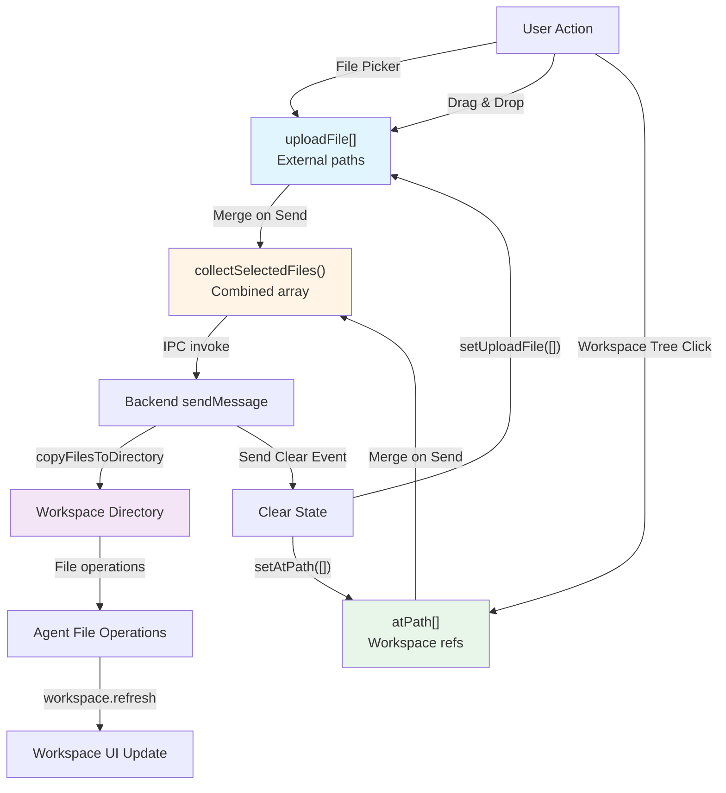
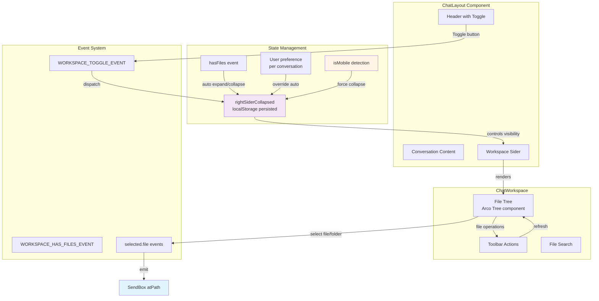
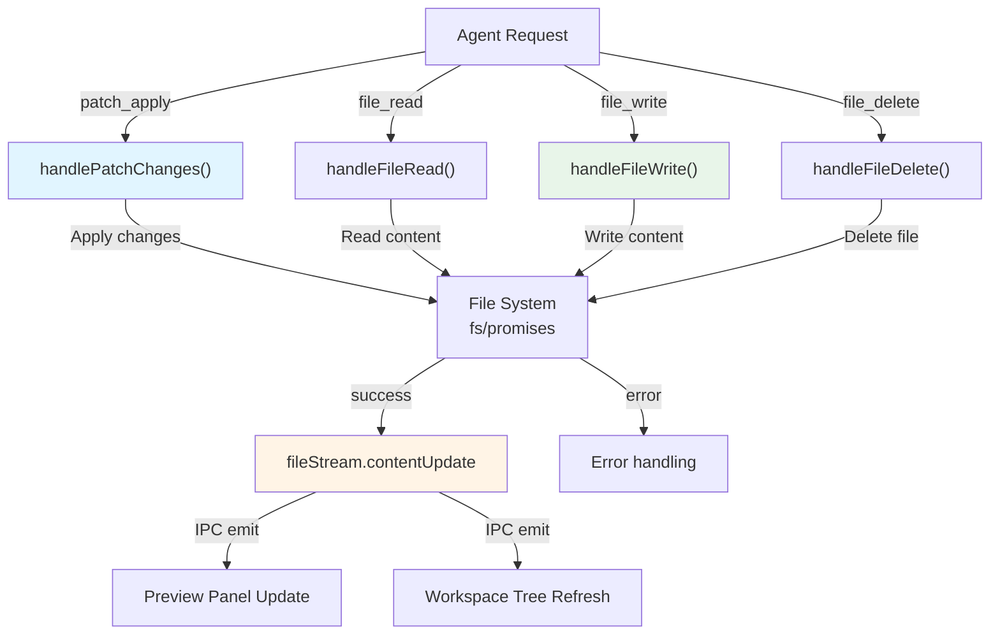
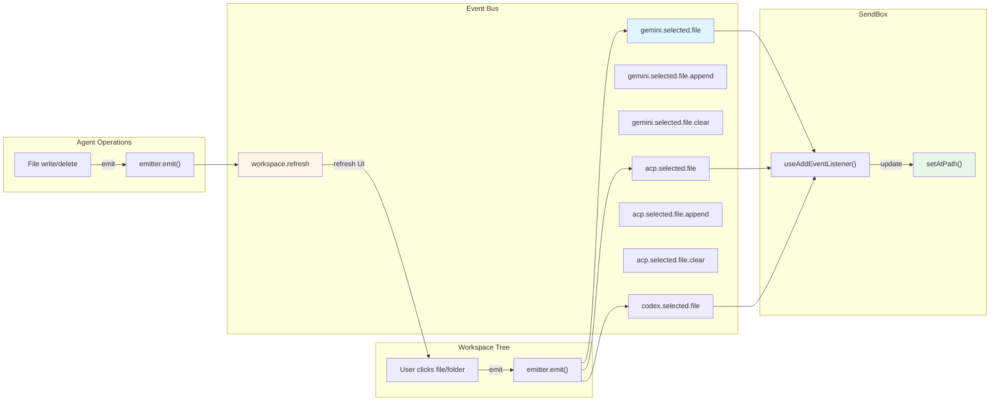

# File & Workspace Management

<details>
<summary>Relevant source files</summary>

The following files were used as context for generating this wiki page:

- [src/agent/codex/core/ErrorService.ts](src/agent/codex/core/ErrorService.ts)
- [src/agent/codex/handlers/CodexEventHandler.ts](src/agent/codex/handlers/CodexEventHandler.ts)
- [src/agent/codex/handlers/CodexFileOperationHandler.ts](src/agent/codex/handlers/CodexFileOperationHandler.ts)
- [src/agent/codex/handlers/CodexSessionManager.ts](src/agent/codex/handlers/CodexSessionManager.ts)
- [src/agent/codex/handlers/CodexToolHandlers.ts](src/agent/codex/handlers/CodexToolHandlers.ts)
- [src/agent/codex/messaging/CodexMessageProcessor.ts](src/agent/codex/messaging/CodexMessageProcessor.ts)
- [src/common/codex/types/eventData.ts](src/common/codex/types/eventData.ts)
- [src/common/codex/types/eventTypes.ts](src/common/codex/types/eventTypes.ts)
- [src/process/initAgent.ts](src/process/initAgent.ts)
- [src/process/task/OpenClawAgentManager.ts](src/process/task/OpenClawAgentManager.ts)
- [src/renderer/components/sendbox.tsx](src/renderer/components/sendbox.tsx)
- [src/renderer/layout.tsx](src/renderer/layout.tsx)
- [src/renderer/pages/conversation/ChatConversation.tsx](src/renderer/pages/conversation/ChatConversation.tsx)
- [src/renderer/pages/conversation/ChatHistory.tsx](src/renderer/pages/conversation/ChatHistory.tsx)
- [src/renderer/pages/conversation/ChatLayout.tsx](src/renderer/pages/conversation/ChatLayout.tsx)
- [src/renderer/pages/conversation/ChatSider.tsx](src/renderer/pages/conversation/ChatSider.tsx)
- [src/renderer/pages/conversation/acp/AcpSendBox.tsx](src/renderer/pages/conversation/acp/AcpSendBox.tsx)
- [src/renderer/pages/conversation/codex/CodexSendBox.tsx](src/renderer/pages/conversation/codex/CodexSendBox.tsx)
- [src/renderer/pages/conversation/gemini/GeminiSendBox.tsx](src/renderer/pages/conversation/gemini/GeminiSendBox.tsx)
- [src/renderer/pages/conversation/nanobot/NanobotSendBox.tsx](src/renderer/pages/conversation/nanobot/NanobotSendBox.tsx)
- [src/renderer/pages/conversation/openclaw/OpenClawSendBox.tsx](src/renderer/pages/conversation/openclaw/OpenClawSendBox.tsx)
- [src/renderer/pages/settings/SettingsSider.tsx](src/renderer/pages/settings/SettingsSider.tsx)
- [src/renderer/router.tsx](src/renderer/router.tsx)
- [src/renderer/sider.tsx](src/renderer/sider.tsx)
- [src/renderer/styles/themes/base.css](src/renderer/styles/themes/base.css)

</details>

This page documents AionUi's file and workspace management system, which enables users to attach files to messages and manage workspace directories. The system implements a dual file state model (`uploadFile` vs `atPath`), drag-and-drop support, workspace panel integration, and agent file operations. For message rendering of file attachments, see [Message Rendering System](#5.4). For the SendBox component itself, see [Message Input System](#5.5).

## Overview

The file management system consists of three primary layers:

| Layer               | Purpose                                        | Key Components                                         |
| ------------------- | ---------------------------------------------- | ------------------------------------------------------ |
| **Input Layer**     | File selection and display in SendBox          | `useSendBoxFiles`, `FilePreview`, `HorizontalFileList` |
| **State Layer**     | File state persistence and synchronization     | `useSendBoxDraft`, event emitters                      |
| **Operation Layer** | Backend file operations during agent execution | `FileOperationHandler`, `copyFilesToDirectory`         |

Files flow through the system in this sequence:

```
User Selection → SendBox State → Message Payload → Agent Workspace → File Operations → Preview/Workspace Updates
```

**Sources:** [src/renderer/pages/conversation/gemini/GeminiSendBox.tsx:1-925](), [src/renderer/pages/conversation/acp/AcpSendBox.tsx:1-629](), [src/renderer/components/sendbox.tsx:1-456]()

## Dual File State System

### State Model

The SendBox maintains two distinct file arrays to represent different file sources:

**`uploadFile: string[]`**

- Array of absolute file paths from external sources
- Files selected via file picker dialog or drag-and-drop
- Not yet copied into workspace
- Cleared after message is sent

**`atPath: Array<string | FileOrFolderItem>`**

- Files/folders selected from the workspace tree
- Can be strings (file paths) or objects with metadata
- Represents workspace-relative references
- Cleared after message is sent

```typescript
interface FileOrFolderItem {
  path: string
  name: string
  isFile: boolean
}
```

**Sources:** [src/renderer/pages/conversation/gemini/GeminiSendBox.tsx:398-432](), [src/renderer/hooks/useSendBoxDraft.ts:1-50]()

### File State Lifecycle



**Diagram: File state lifecycle from selection to workspace operations**

**Sources:** [src/renderer/pages/conversation/gemini/GeminiSendBox.tsx:755-802](), [src/renderer/utils/messageFiles.ts:1-100]()

### State Persistence

Draft state is persisted to `localStorage` using conversation-specific keys:

```typescript
const useGeminiSendBoxDraft = getSendBoxDraftHook('gemini', {
  _type: 'gemini',
  atPath: [],
  content: '',
  uploadFile: [],
})
```

The `getSendBoxDraftHook` factory creates a SWR hook with automatic localStorage persistence:

```typescript
// Key format: sendbox_draft_{conversationType}_{conversation_id}
const storageKey = `sendbox_draft_gemini_${conversation_id}`
```

**Sources:** [src/renderer/pages/conversation/gemini/GeminiSendBox.tsx:34-39](), [src/renderer/hooks/useSendBoxDraft.ts:1-50]()

## Drag and Drop Support

### useDragUpload Hook

The `useDragUpload` hook provides drag-and-drop functionality with file type validation:

```typescript
const { isFileDragging, dragHandlers } = useDragUpload({
  supportedExts,
  onFilesAdded,
})
```

The hook returns:

- `isFileDragging`: Boolean state for visual feedback
- `dragHandlers`: Event handlers for drag events

**Sources:** [src/renderer/components/sendbox.tsx:176-180](), [src/renderer/hooks/useDragUpload.ts:1-100]()

### Drag Event Handlers

The SendBox container applies drag handlers that manage the drop zone:

```typescript
<div
  {...dragHandlers}
  className={isFileDragging ? 'b-dashed' : ''}
  style={{
    backgroundColor: isFileDragging
      ? 'var(--color-primary-light-1)'
      : undefined,
    borderColor: isFileDragging
      ? 'rgb(var(--primary-3))'
      : activeBorderColor,
  }}
>
```

Visual feedback:

- Border changes to dashed
- Background color changes to primary light
- Border color changes to primary accent

**Sources:** [src/renderer/components/sendbox.tsx:346-363]()

### Paste Service Integration

The `usePasteService` hook handles file paste operations from clipboard:

```typescript
const { onPaste, onFocus: handlePasteFocus } = usePasteService({
  supportedExts,
  onFilesAdded,
  onTextPaste: (text: string) => {
    // Handle cleaned text paste at cursor position
  },
})
```

Paste handling:

1. Intercepts paste events
2. Extracts files from clipboard DataTransfer
3. Validates file types against `supportedExts`
4. Calls `onFilesAdded` callback with file metadata

**Sources:** [src/renderer/components/sendbox.tsx:237-260](), [src/renderer/hooks/usePasteService.ts:1-150]()

## Workspace Panel Integration

### Panel Architecture



**Diagram: Workspace panel architecture and state flow**

**Sources:** [src/renderer/pages/conversation/ChatLayout.tsx:1-546](), [src/renderer/pages/conversation/workspace/index.tsx:1-500]()

### Collapse State Management

The workspace panel maintains collapse state with multiple priority levels:

| Priority    | Source             | Storage                                                    | Scope            |
| ----------- | ------------------ | ---------------------------------------------------------- | ---------------- |
| 1 (Highest) | User manual toggle | `localStorage` key `workspace-preference-{conversationId}` | Per-conversation |
| 2           | File presence      | Event-driven                                               | Global           |
| 3 (Lowest)  | Mobile detection   | Runtime                                                    | Global           |

**User preference** (highest priority):

```typescript
// Stored when user clicks toggle button
localStorage.setItem(
  `workspace-preference-${conversationId}`,
  newState ? 'collapsed' : 'expanded'
)
```

**File presence** (auto-expand when files exist):

```typescript
// Dispatched when workspace content changes
dispatchWorkspaceStateEvent(hasFiles)

// Auto-expand logic (if no user preference)
if (detail.hasFiles && rightSiderCollapsed) {
  setRightSiderCollapsed(false)
}
```

**Mobile** (always collapsed):

```typescript
if (layout?.isMobile && !rightSiderCollapsed) {
  setRightSiderCollapsed(true)
}
```

**Sources:** [src/renderer/pages/conversation/ChatLayout.tsx:94-227](), [src/renderer/utils/workspaceEvents.ts:1-50]()

### Resizable Split Panels

The workspace panel uses `useResizableSplit` for drag-based width adjustment:

```typescript
const {
  splitRatio: workspaceSplitRatio,
  setSplitRatio: setWorkspaceSplitRatio,
  createDragHandle: createWorkspaceDragHandle,
} = useResizableSplit({
  defaultWidth: 20, // 20% of container
  minWidth: 12, // MIN_WORKSPACE_RATIO
  maxWidth: 40, // 40% max
  storageKey: 'chat-workspace-split-ratio',
})
```

Constraints enforced when preview panel is open:

```typescript
// Ensure workspace doesn't squeeze chat too much
const maxWorkspace = Math.max(
  MIN_WORKSPACE_RATIO,
  100 - chatSplitRatio - MIN_PREVIEW_RATIO
)
```

**Sources:** [src/renderer/pages/conversation/ChatLayout.tsx:294-346](), [src/renderer/hooks/useResizableSplit.ts:1-150]()

### Mobile Workspace Behavior

On mobile viewports, the workspace becomes a fixed-position overlay:

```typescript
<div
  className='!bg-1 relative chat-layout-right-sider'
  style={{
    position: 'fixed',
    right: 0,
    top: 0,
    height: '100vh',
    width: `${Math.round(workspaceWidthPx)}px`,
    transform: rightSiderCollapsed
      ? 'translateX(100%)'
      : 'translateX(0)',
    zIndex: 100,
    pointerEvents: rightSiderCollapsed ? 'none' : 'auto',
  }}
>
```

Mobile-specific features:

- **Backdrop overlay**: Dark backdrop behind workspace when open
- **Swipe gesture**: Floating toggle button on right edge
- **Auto-collapse**: Workspace collapses when switching conversations
- **Width calculation**: 84% of viewport, min 300px, max 420px

**Sources:** [src/renderer/pages/conversation/ChatLayout.tsx:478-534]()

## File Preview System

### FilePreview Component

The `FilePreview` component displays individual file chips with remove buttons:

```typescript
<FilePreview
  key={path}
  path={path}
  onRemove={() => setUploadFile(uploadFile.filter(v => v !== path))}
/>
```

Features:

- File icon based on extension
- Truncated filename display
- Remove button with hover state
- Supports both absolute paths and workspace-relative paths

**Sources:** [src/renderer/components/FilePreview.tsx:1-150](), [src/renderer/pages/conversation/gemini/GeminiSendBox.tsx:864-887]()

### HorizontalFileList Layout

The `HorizontalFileList` component provides a scrollable horizontal container:

```typescript
<HorizontalFileList>
  {uploadFile.map((path) => (
    <FilePreview key={path} path={path} onRemove={...} />
  ))}
  {atPath.map((item) => {
    const isFile = typeof item === 'string' ? true : item.isFile;
    if (isFile) {
      return <FilePreview key={path} path={path} onRemove={...} />;
    }
    return null;
  })}
</HorizontalFileList>
```

Rendering order:

1. **Files first**: `uploadFile` array files
2. **Workspace files**: `atPath` files (filtered by `isFile`)
3. **Folder tags**: `atPath` folders rendered as Arco `Tag` components below

**Sources:** [src/renderer/components/HorizontalFileList.tsx:1-100](), [src/renderer/pages/conversation/gemini/GeminiSendBox.tsx:864-913]()

### Preview Panel Integration

The `usePreviewLauncher` hook connects file operations to the preview panel:

```typescript
const { launchPreview } = usePreviewLauncher()

// Open file in preview panel
launchPreview({
  type: 'file',
  path: filePath,
  workspace: workspacePath,
})
```

Preview panel features:

- Syntax highlighting for code files
- Markdown rendering for `.md` files
- Image display for image files
- Diff view for file changes
- "Add to chat" button to insert content into SendBox

**Sources:** [src/renderer/hooks/usePreviewLauncher.ts:1-150](), [src/renderer/pages/conversation/preview/index.tsx:1-500]()

## Agent File Operations

### File Operation Handler

The `CodexFileOperationHandler` class manages backend file operations:



**Diagram: Agent file operation flow**

**Sources:** [src/agent/codex/handlers/CodexFileOperationHandler.ts:1-300]()

### File Copy on Send

When a message with files is sent, files are copied to the workspace:

```typescript
async function copyFilesToDirectory(
  files: string[],
  targetDir: string
): Promise<string[]> {
  const copiedPaths: string[] = []

  for (const file of files) {
    const basename = path.basename(file)
    const targetPath = path.join(targetDir, basename)

    await fs.copyFile(file, targetPath)
    copiedPaths.push(targetPath)
  }

  return copiedPaths
}
```

Process:

1. Merge `uploadFile` and `atPath` arrays
2. Filter out duplicates
3. Copy external files to workspace
4. Return workspace-relative paths
5. Agent uses workspace paths in tool calls

**Sources:** [src/process/utils/fileUtils.ts:1-200](), [src/renderer/utils/messageFiles.ts:1-100]()

### Permission System

File write operations require user approval through the permission system:

| Permission Type     | Triggers                    | Options                                       |
| ------------------- | --------------------------- | --------------------------------------------- |
| `COMMAND_EXECUTION` | Shell commands in workspace | `allow_once`, `allow_always`, `reject_always` |
| `FILE_WRITE`        | File create/modify/delete   | `allow_once`, `allow_always`, `reject_always` |

Permission flow:

```typescript
// Check ApprovalStore cache
if (checkPatchApproval?.(files)) {
  autoConfirm(requestId, 'allow_always')
  return
}

// Show permission UI
addConfirmation({
  title: 'File Write Permission',
  id: requestId,
  action: 'edit',
  description: `Codex wants to modify ${files.length} files`,
  options: [
    { label: 'Allow Once', value: 'allow_once' },
    { label: 'Allow Always', value: 'allow_always' },
    { label: 'Reject Always', value: 'reject_always' },
  ],
})
```

**Sources:** [src/agent/codex/handlers/CodexEventHandler.ts:161-321](), [src/common/codex/utils/permissionUtils.ts:1-200]()

### File Stream Updates

File operations emit real-time updates via `fileStream.contentUpdate`:

```typescript
// Backend emits update
ipcBridge.fileStream.contentUpdate.emit({
  conversation_id,
  path: relativePath,
  content: newContent,
  operation: 'write',
})

// Frontend receives update
useEffect(() => {
  return ipcBridge.fileStream.contentUpdate.on((update) => {
    if (update.conversation_id !== conversation_id) return

    // Update preview panel if file is open
    if (previewState.path === update.path) {
      setPreviewContent(update.content)
    }

    // Trigger workspace tree refresh
    emitter.emit('workspace.refresh')
  })
}, [conversation_id])
```

**Sources:** [src/common/ipcBridge.ts:200-250](), [src/renderer/pages/conversation/preview/index.tsx:1-500]()

## Event-Driven Communication

### Event System Architecture



**Diagram: File selection event flow between workspace and SendBox**

**Sources:** [src/renderer/utils/emitter.ts:1-100](), [src/renderer/pages/conversation/gemini/GeminiSendBox.tsx:814-820]()

### File Selection Events

Each agent type has dedicated file selection events:

**Gemini events:**

```typescript
// Replace selection
emitter.emit('gemini.selected.file', newAtPath)

// Append to selection
emitter.emit('gemini.selected.file.append', additionalItems)

// Clear selection
emitter.emit('gemini.selected.file.clear')
```

**ACP events:**

```typescript
emitter.emit('acp.selected.file', newAtPath)
emitter.emit('acp.selected.file.append', additionalItems)
emitter.emit('acp.selected.file.clear')
```

**Codex events:**

```typescript
emitter.emit('codex.selected.file', newAtPath)
emitter.emit('codex.selected.file.append', additionalItems)
emitter.emit('codex.selected.file.clear')
```

**Sources:** [src/renderer/pages/conversation/gemini/GeminiSendBox.tsx:814-820](), [src/renderer/pages/conversation/acp/AcpSendBox.tsx:542-548](), [src/renderer/pages/conversation/codex/CodexSendBox.tsx:256-271]()

### Workspace Refresh Events

File operations trigger workspace UI updates:

```typescript
// After successful file write
emitter.emit('gemini.workspace.refresh')
emitter.emit('acp.workspace.refresh')
emitter.emit('codex.workspace.refresh')

// Generic workspace refresh
emitter.emit('workspace.refresh')
```

The workspace tree component listens for these events and re-scans the directory:

```typescript
useAddEventListener('gemini.workspace.refresh', () => {
  void refreshWorkspaceTree()
})
```

**Sources:** [src/renderer/pages/conversation/workspace/index.tsx:1-500](), [src/renderer/pages/conversation/gemini/GeminiSendBox.tsx:798-801]()

### File Merge Utility

The `mergeFileSelectionItems` utility handles append operations without duplicates:

```typescript
export function mergeFileSelectionItems(
  existing: Array<string | FileOrFolderItem>,
  newItems: Array<string | FileOrFolderItem>
): Array<string | FileOrFolderItem> {
  const merged = [...existing]

  for (const item of newItems) {
    const itemPath = typeof item === 'string' ? item : item.path
    const exists = merged.some((m) => {
      const mPath = typeof m === 'string' ? m : m.path
      return mPath === itemPath
    })

    if (!exists) {
      merged.push(item)
    }
  }

  return merged
}
```

Used for "append" events to avoid duplicate file selections.

**Sources:** [src/renderer/utils/fileSelection.ts:1-100](), [src/renderer/pages/conversation/gemini/GeminiSendBox.tsx:815-819]()

## useSendBoxFiles Hook

The `useSendBoxFiles` hook provides unified file handling logic:

```typescript
const { handleFilesAdded, clearFiles } = useSendBoxFiles({
  atPath,
  uploadFile,
  setAtPath,
  setUploadFile,
})
```

**`handleFilesAdded(files: FileMetadata[])`**

- Accepts files from drag-drop or paste
- Extracts file paths from `FileMetadata` objects
- Appends to `uploadFile` array
- Deduplicates based on path

**`clearFiles()`**

- Clears both `uploadFile` and `atPath` arrays
- Called after successful message send
- Resets SendBox to clean state

**Sources:** [src/renderer/hooks/useSendBoxFiles.ts:1-150](), [src/renderer/pages/conversation/gemini/GeminiSendBox.tsx:748-753]()

## File Service

The `FileService` provides metadata and validation:

```typescript
export const allSupportedExts = [
  // Code files
  '.js',
  '.ts',
  '.tsx',
  '.jsx',
  '.py',
  '.java',
  '.cpp',
  '.c',
  '.go',
  '.rs',
  '.rb',
  '.php',
  '.swift',
  '.kt',
  '.cs',

  // Config files
  '.json',
  '.yaml',
  '.yml',
  '.toml',
  '.xml',
  '.ini',

  // Documents
  '.md',
  '.txt',
  '.csv',
  '.log',

  // Images
  '.png',
  '.jpg',
  '.jpeg',
  '.gif',
  '.webp',
  '.svg',
]

interface FileMetadata {
  path: string
  name: string
  size: number
  ext: string
  mimeType?: string
}
```

The service validates file extensions before allowing selection:

```typescript
const isSupported = (file: File): boolean => {
  const ext = path.extname(file.name).toLowerCase()
  return allSupportedExts.includes(ext)
}
```

**Sources:** [src/renderer/services/FileService.ts:1-200](), [src/renderer/components/sendbox.tsx:23]()
