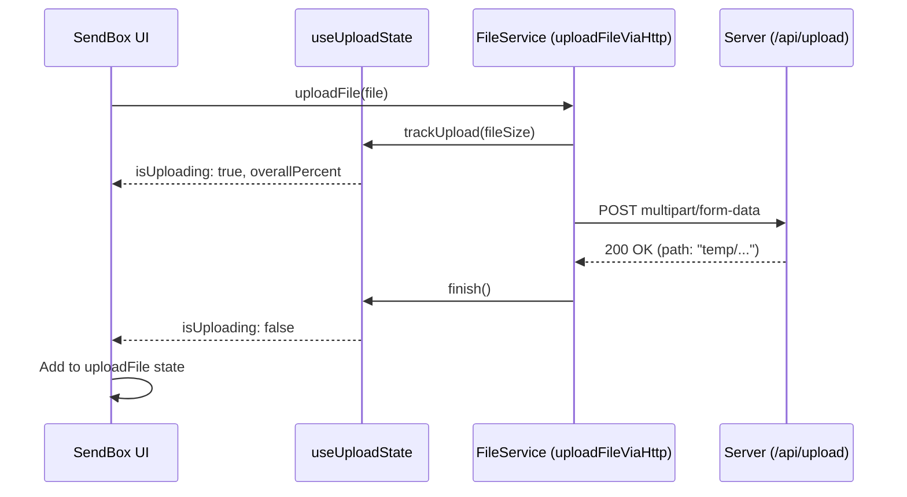
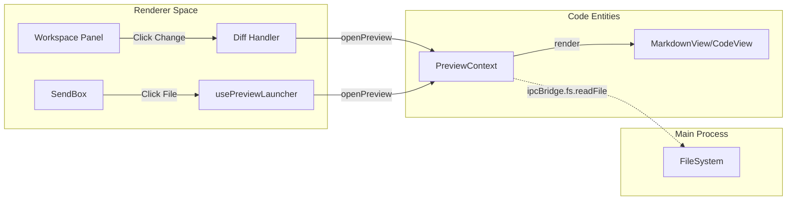

# File & Workspace Management

Relevant source files

The following files were used as context for generating this wiki page:

- [src/common/types/fileSnapshot.ts](src/common/types/fileSnapshot.ts)
- [src/process/bridge/workspaceSnapshotBridge.ts](src/process/bridge/workspaceSnapshotBridge.ts)
- [src/process/services/WorkspaceSnapshotService.ts](src/process/services/WorkspaceSnapshotService.ts)
- [src/renderer/components/media/UploadProgressBar.tsx](src/renderer/components/media/UploadProgressBar.tsx)
- [src/renderer/hooks/file/useDirectorySelection.tsx](src/renderer/hooks/file/useDirectorySelection.tsx)
- [src/renderer/hooks/file/useDragUpload.ts](src/renderer/hooks/file/useDragUpload.ts)
- [src/renderer/hooks/file/useOpenFileSelector.ts](src/renderer/hooks/file/useOpenFileSelector.ts)
- [src/renderer/hooks/file/usePasteService.ts](src/renderer/hooks/file/usePasteService.ts)
- [src/renderer/hooks/file/usePreviewLauncher.ts](src/renderer/hooks/file/usePreviewLauncher.ts)
- [src/renderer/hooks/file/useUploadState.ts](src/renderer/hooks/file/useUploadState.ts)
- [src/renderer/pages/conversation/Workspace/components/FileChangeList.tsx](src/renderer/pages/conversation/Workspace/components/FileChangeList.tsx)
- [src/renderer/pages/conversation/Workspace/components/WorkspaceTabBar.tsx](src/renderer/pages/conversation/Workspace/components/WorkspaceTabBar.tsx)
- [src/renderer/pages/conversation/Workspace/components/WorkspaceToolbar.tsx](src/renderer/pages/conversation/Workspace/components/WorkspaceToolbar.tsx)
- [src/renderer/pages/conversation/Workspace/hooks/useFileChanges.ts](src/renderer/pages/conversation/Workspace/hooks/useFileChanges.ts)
- [src/renderer/pages/conversation/Workspace/hooks/useWorkspaceDragImport.ts](src/renderer/pages/conversation/Workspace/hooks/useWorkspaceDragImport.ts)
- [src/renderer/pages/conversation/Workspace/hooks/useWorkspacePaste.ts](src/renderer/pages/conversation/Workspace/hooks/useWorkspacePaste.ts)
- [src/renderer/pages/conversation/Workspace/index.tsx](src/renderer/pages/conversation/Workspace/index.tsx)
- [src/renderer/services/FileService.ts](src/renderer/services/FileService.ts)
- [src/renderer/services/PasteService.ts](src/renderer/services/PasteService.ts)
- [tests/unit/FileChangeList.dom.test.tsx](tests/unit/FileChangeList.dom.test.tsx)
- [tests/unit/PasteService.dom.test.ts](tests/unit/PasteService.dom.test.ts)
- [tests/unit/WorkspaceSnapshotService.test.ts](tests/unit/WorkspaceSnapshotService.test.ts)
- [tests/unit/uploadProgressState.test.ts](tests/unit/uploadProgressState.test.ts)
- [tests/unit/useFileChanges.dom.test.ts](tests/unit/useFileChanges.dom.test.ts)
- [tests/unit/workspaceUtils.test.ts](tests/unit/workspaceUtils.test.ts)

This page documents AionUi's file and workspace management system, which enables users to attach files to messages and manage workspace directories. The system implements a dual file state model (`uploadFile` vs `atPath`), drag-and-drop support, workspace panel integration, a git-powered snapshot system, and agent file operations.

## Overview

The file management system provides a bridge between the local file system and AI agents. It supports both standard Electron file access and a multipart HTTP upload system for WebUI mode.

| Component | Purpose | Key Files |
|-----------|---------|-----------|
| **`fsBridge`** | Main process IPC handlers for file system operations (read, write, zip, stats) | [src/process/bridge/fsBridge.ts:1-206]() |
| **`FileService`** | Renderer service for file uploads, metadata extraction, and type validation | [src/renderer/services/FileService.ts:1-256]() |
| **`WorkspaceSnapshotService`** | Manages file change tracking using Git or temporary snapshots | [src/process/services/WorkspaceSnapshotService.ts:44-220]() |
| **`useUploadState`** | Global reactive state for tracking active upload progress | [src/renderer/hooks/file/useUploadState.ts:1-133]() |
| **`WorkspaceToolbar`** | UI controls for workspace management (search, upload, refresh) | [src/renderer/pages/conversation/Workspace/components/WorkspaceToolbar.tsx:68-186]() |

**Sources:** [src/process/bridge/fsBridge.ts:1-206](), [src/renderer/services/FileService.ts:1-256](), [src/renderer/hooks/file/useUploadState.ts:1-133](), [src/process/services/WorkspaceSnapshotService.ts:44-69]()

## Dual File State System

AionUi distinguishes between external files being introduced to the system and existing files within an agent's workspace.

### State Model
- **`uploadFile`**: Array of absolute file paths or `File` objects from the local machine (not yet in workspace).
- **`atPath`**: References to files already residing within the current conversation's workspace directory.

### File Upload Flow (WebUI Mode)
In WebUI mode, files are uploaded via `uploadFileViaHttp` using multipart/form-data. The `trackUpload` utility provides real-time progress updates to the UI via `useSyncExternalStore`.

**Diagram: File upload sequence with progress tracking**

**Sources:** [src/renderer/services/FileService.ts:21-79](), [src/renderer/hooks/file/useUploadState.ts:84-113](), [src/renderer/hooks/file/useUploadState.ts:129-132]()

## Workspace Panel Integration

The Workspace Panel provides a file tree view of the agent's current working directory and tracks modifications.

### File Change Tracking
The `WorkspaceSnapshotService` handles the detection of modified, created, or deleted files within a workspace [src/process/services/WorkspaceSnapshotService.ts:71-81]().
- **Git Mode**: If the workspace is already a git repository, it uses native git commands to compare states [src/process/services/WorkspaceSnapshotService.ts:65-67]().
- **Snapshot Mode**: For non-git directories, it initializes a temporary hidden git index in the system's temp directory to provide diffing capabilities [src/process/services/WorkspaceSnapshotService.ts:187-192]().

### Workspace Toolbar
The `WorkspaceToolbar` facilitates file ingestion into the workspace through two paths:
1. **Host Files**: Direct selection via Electron's native file picker (Desktop mode) [src/renderer/pages/conversation/Workspace/components/WorkspaceToolbar.tsx:90-96]().
2. **Device Files**: Upload via browser file picker (WebUI mode) [src/renderer/pages/conversation/Workspace/components/WorkspaceToolbar.tsx:97-99]().

**Sources:** [src/process/services/WorkspaceSnapshotService.ts:44-69](), [src/renderer/pages/conversation/Workspace/components/WorkspaceToolbar.tsx:68-105]()

## Paste & Drag-and-Drop Support

AionUi provides a robust system for pasting images and files directly into the conversation or workspace.

### PasteService Logic
The `PasteService` handles clipboard events. It includes a sophisticated filename deduplication logic for system-generated screenshots (e.g., `pasted_image_143025.png`) to prevent collisions when multiple images are pasted simultaneously [src/renderer/services/PasteService.ts:173-191]().

### Integration Hooks
- **`usePasteService`**: Global listener that routes paste events to the currently focused component [src/renderer/services/PasteService.ts:70-75]().
- **`useWorkspacePaste`**: Specifically handles pasting files into the workspace tree, including a `PasteConfirmModal` if the user hasn't disabled the confirmation setting [src/renderer/pages/conversation/Workspace/hooks/useWorkspacePaste.ts:161-200]().
- **`useWorkspaceDragImport`**: Extends the workspace to support dragging files directly from the OS into the file tree [src/renderer/pages/conversation/Workspace/index.tsx:86-91]().

**Sources:** [src/renderer/services/PasteService.ts:138-154](), [src/renderer/pages/conversation/Workspace/hooks/useWorkspacePaste.ts:40-53](), [src/renderer/services/FileService.ts:193-215]()

## File Preview System

The `usePreviewLauncher` hook provides a unified interface for opening various file types in the Preview Panel.

### Preview Workflow
1. **Detection**: The system identifies file types (Images, Documents, Text, Diffs) [src/renderer/services/FileService.ts:94-131]().
2. **Launch**: `openPreview` is called with the content or file path.
3. **Diff Viewing**: For workspace changes, the system generates a diff and opens it using the `diff` renderer [src/renderer/pages/conversation/Workspace/index.tsx:182-191]().

**Diagram: File preview data flow**

**Sources:** [src/renderer/pages/conversation/Workspace/index.tsx:116-117](), [src/renderer/services/FileService.ts:134-140](), [src/renderer/pages/conversation/Workspace/index.tsx:182-191]()

## File Operation Handler for Agents

Agents perform file operations through the `fsBridge`, which is exposed to the renderer via `ipcBridge`.

| IPC Method | Implementation | Description |
|------------|----------------|-------------|
| `createTempFile` | `fs.mkdtemp` | Creates a temporary file for uploads or transient agent data [src/renderer/services/PasteService.ts:29-35](). |
| `copyFilesToWorkspace` | `fs.copyFile` | Moves external files into the conversation's working directory [src/renderer/pages/conversation/Workspace/hooks/useWorkspacePaste.ts:61-83](). |
| `getBaselineContent` | `git show` | Retrieves the original version of a file from the snapshot to show diffs [src/process/services/WorkspaceSnapshotService.ts:83-100](). |
| `discardFile` | `git checkout` | Reverts changes to a file in the workspace [src/process/services/WorkspaceSnapshotService.ts:146-157](). |

**Sources:** [src/process/bridge/workspaceSnapshotBridge.ts:12-63](), [src/renderer/services/PasteService.ts:19-46](), [src/process/services/WorkspaceSnapshotService.ts:126-144]()