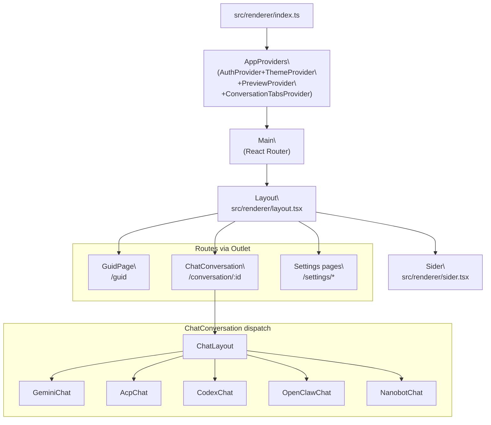
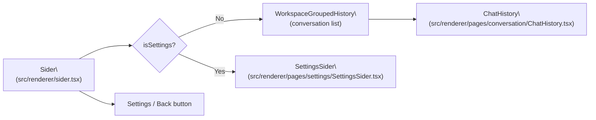
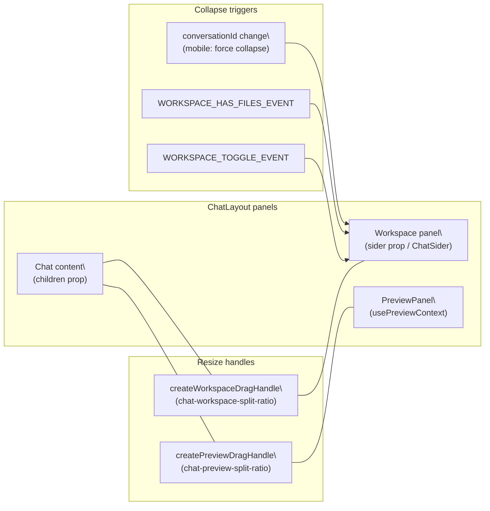

# User Interface

<details>
<summary>Relevant source files</summary>

The following files were used as context for generating this wiki page:

- [src/process/initAgent.ts](src/process/initAgent.ts)
- [src/renderer/index.ts](src/renderer/index.ts)
- [src/renderer/layout.tsx](src/renderer/layout.tsx)
- [src/renderer/pages/conversation/ChatConversation.tsx](src/renderer/pages/conversation/ChatConversation.tsx)
- [src/renderer/pages/conversation/ChatHistory.tsx](src/renderer/pages/conversation/ChatHistory.tsx)
- [src/renderer/pages/conversation/ChatLayout.tsx](src/renderer/pages/conversation/ChatLayout.tsx)
- [src/renderer/pages/conversation/ChatSider.tsx](src/renderer/pages/conversation/ChatSider.tsx)
- [src/renderer/pages/settings/About.tsx](src/renderer/pages/settings/About.tsx)
- [src/renderer/pages/settings/GeminiSettings.tsx](src/renderer/pages/settings/GeminiSettings.tsx)
- [src/renderer/pages/settings/ModeSettings.tsx](src/renderer/pages/settings/ModeSettings.tsx)
- [src/renderer/pages/settings/SettingsSider.tsx](src/renderer/pages/settings/SettingsSider.tsx)
- [src/renderer/pages/settings/SystemSettings.tsx](src/renderer/pages/settings/SystemSettings.tsx)
- [src/renderer/router.tsx](src/renderer/router.tsx)
- [src/renderer/sider.tsx](src/renderer/sider.tsx)
- [src/renderer/styles/themes/base.css](src/renderer/styles/themes/base.css)

</details>

The User Interface subsystem provides the visual layer of AionUi, implemented as a React-based renderer process in Electron. This page covers the overall UI architecture, application bootstrap, component hierarchy, styling system, and internationalization framework. For specific subsystems, see the child pages: Layout System (5.1), Conversation Interface (5.2), Message Rendering System (5.4), Message Input System (5.5), and Styling & Theming (5.8).

## Application Bootstrap

The renderer entry point is `src/renderer/index.ts`. It mounts the React tree into the `#root` DOM node using React 18's `createRoot`, wraps the app with global context providers, and initializes Arco Design's `ConfigProvider` with locale-aware settings.

**Provider tree (outermost → innermost):**

| Provider                   | Source                                                            | Purpose                                 |
| -------------------------- | ----------------------------------------------------------------- | --------------------------------------- |
| `AuthProvider`             | `src/renderer/context/AuthContext`                                | JWT authentication state for WebUI mode |
| `ThemeProvider`            | `src/renderer/context/ThemeContext`                               | Dark/light theme switching              |
| `PreviewProvider`          | `src/renderer/pages/conversation/preview`                         | Preview panel open/close state          |
| `ConversationTabsProvider` | `src/renderer/pages/conversation/context/ConversationTabsContext` | Multi-tab conversation management       |
| `ConfigProvider`           | `@arco-design/web-react`                                          | Arco Design locale and primary color    |

The `Config` component reads the current `i18n.language` to select the matching Arco Design locale object, so the component library's date pickers, modals, and other elements are localized in sync with the app locale [src/renderer/index.ts:66-73]().

Sources: [src/renderer/index.ts:1-77]()

## Architecture Overview

AionUi's UI is a React + TypeScript single-page application. The renderer process is separated from the main process via IPC bridges, with all backend communication going through `ipcBridge`.

### State Management Patterns

| Pattern       | Implementation                                                                 | Usage                                                          |
| ------------- | ------------------------------------------------------------------------------ | -------------------------------------------------------------- |
| React Context | `LayoutContext`, `ThemeContext`, `PreviewProvider`, `ConversationTabsProvider` | Global panel visibility, theme, preview state                  |
| SWR           | `useSWR`                                                                       | Caching IPC calls for model config, agent lists, conversations |
| Local state   | `useState`, `useReducer`                                                       | Component-level UI state (collapse, editing, draft)            |
| Custom hooks  | `useResizableSplit`, `usePreviewContext`, `useConversationTabs`                | Reusable stateful logic for panels and tabs                    |
| Event emitter | `emitter` in `src/renderer/utils/emitter`                                      | Cross-component renderer-side events (see page 7.3)            |

### Component Hierarchy

**Application shell and routing structure:**



Sources: [src/renderer/index.ts:64-77](), [src/renderer/layout.tsx:67-286](), [src/renderer/pages/conversation/ChatConversation.tsx:141-220]()

## Key UI Components

### Application Shell: `Layout`

`Layout` (defined in `src/renderer/layout.tsx`) is the top-level shell component rendered by the router. It:

- Provides `LayoutContext` to all children with `isMobile`, `siderCollapsed`, and `setSiderCollapsed`
- Detects mobile viewport via `detectMobileViewportOrTouch()`, which checks width < 768px and pointer/touch media queries
- Renders `ArcoLayout.Sider` (left navigation) and `ArcoLayout.Content` (main area via `<Outlet />`)
- On mobile, the sider uses `position: fixed` and slides in/out via CSS `transform`; a backdrop overlay closes it on tap
- Injects user-defined custom CSS via `processCustomCss`, observing the document head for style ordering
- Hosts `UpdateModal` and global context holders for multi-agent detection and directory selection

`LayoutContext` shape:

```
{ isMobile: boolean, siderCollapsed: boolean, setSiderCollapsed: (v: boolean) => void }
```

Sources: [src/renderer/layout.tsx:67-286](), [src/renderer/layout.tsx:56-65]()

### Left Navigation: `Sider`

`Sider` (in `src/renderer/sider.tsx`) renders the left navigation panel. Its content switches depending on the current route:

- **Non-settings routes:** Shows a "New Conversation" button, batch-select toggle, and `WorkspaceGroupedHistory` (the conversation list grouped by workspace)
- **Settings routes (`/settings/*`):** Shows `SettingsSider` with section links

`SettingsSider` (in `src/renderer/pages/settings/SettingsSider.tsx`) renders navigation items for: Gemini, Model, Assistants, Tools, Display, WebUI/Channels, System, and About. Active item is highlighted by matching `pathname`.

A settings/back button is pinned to the sider footer. Clicking it navigates to `/settings/gemini` or back to the last non-settings path. On mobile, clicking any conversation item collapses the sider.



`ChatHistory` (in `src/renderer/pages/conversation/ChatHistory.tsx`) loads conversations from the database via `ipcBridge.database.getUserConversations`, groups them by timeline (today, yesterday, etc.), supports inline rename via `ipcBridge.conversation.update`, and delete via `ipcBridge.conversation.remove`. It listens for the `chat.history.refresh` event to reload after mutations.

Sources: [src/renderer/sider.tsx:1-128](), [src/renderer/pages/settings/SettingsSider.tsx:1-103](), [src/renderer/pages/conversation/ChatHistory.tsx:1-279]()

### Conversation Dispatcher: `ChatConversation`

`ChatConversation` (in `src/renderer/pages/conversation/ChatConversation.tsx`) receives a `TChatConversation` object and routes to the appropriate agent-specific chat component. All variants are wrapped inside `ChatLayout`.

**Dispatch logic by `conversation.type`:**

| `type` value       | Rendered component                         | Notes                                     |
| ------------------ | ------------------------------------------ | ----------------------------------------- |
| `gemini`           | `GeminiChat` via `GeminiConversationPanel` | Includes `GeminiModelSelector` in header  |
| `acp`              | `AcpChat`                                  | Uses `AcpModelSelector`                   |
| `codex`            | `CodexChat`                                | Legacy; new Codex sessions use `acp` type |
| `openclaw-gateway` | `OpenClawChat`                             |                                           |
| `nanobot`          | `NanobotChat`                              |                                           |

`GeminiConversationPanel` is an inner component that manages a shared `useGeminiModelSelection` hook so the header selector and send box share model state without re-mounting [src/renderer/pages/conversation/ChatConversation.tsx:102-139]().

For non-Gemini conversations, agent logo/name is resolved via `usePresetAssistantInfo`, then falls back to the backend name from `ACP_BACKENDS_ALL` [src/renderer/pages/conversation/ChatConversation.tsx:165-211]().

Sources: [src/renderer/pages/conversation/ChatConversation.tsx:1-220]()

### Conversation Wrapper: `ChatLayout`

`ChatLayout` (in `src/renderer/pages/conversation/ChatLayout.tsx`) is the three-panel layout shell for any active conversation:

- **Left/center:** Chat content (children) + `ConversationTabs` header + header bar with title, model selector, agent logo
- **Right (workspace panel):** Collapsible file tree (`ChatSider`), controlled by `rightSiderCollapsed` state
- **Far right (preview panel):** `PreviewPanel`, shown when `isPreviewOpen` from `usePreviewContext`

**Panel sizing** uses `useResizableSplit` for drag handles between chat/preview and chat/workspace. Ratios are stored in `localStorage` with keys `chat-preview-split-ratio` and `chat-workspace-split-ratio`.

**Workspace panel collapse** behavior:

- Persisted in `localStorage` under `STORAGE_KEYS.WORKSPACE_PANEL_COLLAPSE`
- Per-conversation user preference stored as `workspace-preference-{conversationId}`
- Auto-expands when agent writes files (`WORKSPACE_HAS_FILES_EVENT`), auto-collapses if no files
- On mobile, workspace uses `position: fixed` full-height overlay with a backdrop
- When preview panel opens, both workspace and left sider collapse to maximize space; they restore when preview closes



Sources: [src/renderer/pages/conversation/ChatLayout.tsx:20-519](), [src/renderer/pages/conversation/ChatLayout.tsx:292-341]()

### Guid Page (Welcome Screen)

The `GuidPage` is the entry point for creating new conversations. It handles agent selection, model configuration, and workspace setup. See page 5.3 for full details.

Key responsibilities:

- `@`-mention dropdown for agent/assistant selection
- Model and provider selection (grouped by `IProvider`, filtered for function calling)
- Workspace folder input
- File attachment via drag, paste, or `@filepath`
- On send: calls `ipcBridge.conversation.create` then navigates to `/conversation/:id`

### Message List

`MessageList` renders conversation history using `react-virtuoso` for virtualized scrolling. Each `TMessage` is dispatched to a specialized renderer by `type`. See page 5.4 for full details.

Key message renderers:

| `TMessage.type`     | Renderer component                          |
| ------------------- | ------------------------------------------- |
| `text` / `markdown` | `MessageText` → `MarkdownView` (Shadow DOM) |
| Tool call (Gemini)  | `MessageToolGroup`                          |
| Tool call (ACP)     | `MessageAcpToolCall`                        |
| Tool call (Codex)   | `MessageCodexToolCall`                      |
| `tips`              | `MessageTips`                               |
| `plan`              | `MessagePlan`                               |

`MarkdownView` isolates rendered content in a Shadow DOM to prevent CSS conflicts, and supports LaTeX via `remark-math` + `rehype-katex`.

### SendBox (Message Input)

`SendBox` is a base input component with agent-specific subclasses: `GeminiSendBox`, `AcpSendBox`, `CodexSendBox`, and `OpenClawSendBox`. See page 5.5 for full details.

Key features:

- Dynamic height adjustment (single-line → multi-line)
- File attachment via drag/drop (`useDragUpload`), paste (`usePasteService`), or `@filepath` mention
- Draft persistence per conversation via `useSendBoxDraft`
- `AgentModeSelector` for Gemini (default/yolo/auto-edit modes)

## Internationalization

AionUi supports 6 locales through `react-i18next`. See page 10 for the full i18n system documentation.

**Supported locales:**

| Locale code | Language            |
| ----------- | ------------------- |
| `en-US`     | English (fallback)  |
| `zh-CN`     | Simplified Chinese  |
| `zh-TW`     | Traditional Chinese |
| `ja-JP`     | Japanese            |
| `ko-KR`     | Korean              |
| `tr-TR`     | Turkish             |

**Initialization** (`src/renderer/i18n/index.ts`):

- Uses `i18next-browser-languagedetector` with detection order `['localStorage', 'navigator']`
- After init, reads `ConfigStorage.get('language')` and calls `i18n.changeLanguage` if a stored preference exists, so the user's chosen language overrides browser detection [src/renderer/i18n/index.ts:53-63]()
- `fallbackLng` is `en-US`

**Arco Design locale sync** (`src/renderer/index.ts`):

The `Config` component reads `i18n.language` and maps it to the corresponding Arco Design locale object (`zhCN`, `enUS`, `jaJP`, etc.), so component library strings (date formats, button labels) stay in sync with the app language [src/renderer/index.ts:56-63]().

**Language switching** is exposed via the `LanguageSwitcher` component (`src/renderer/components/LanguageSwitcher.tsx`), which calls `ConfigStorage.set('language', value)` to persist the choice and `i18n.changeLanguage(value)` to apply it. The switch is deferred two animation frames to let any open dropdowns close first [src/renderer/components/LanguageSwitcher.tsx:20-35]().

**Translation key naming convention:**

| Namespace prefix         | Usage                       |
| ------------------------ | --------------------------- |
| `conversation.welcome`   | Guid page (new chat screen) |
| `conversation.chat`      | Active chat interface       |
| `conversation.history`   | Sidebar history list        |
| `conversation.workspace` | Workspace panel             |
| `settings.*`             | Settings section labels     |
| `preview.*`              | Preview panel actions       |
| `agentMode.*`            | Agent mode selector labels  |

Sources: [src/renderer/i18n/index.ts:1-65](), [src/renderer/components/LanguageSwitcher.tsx:1-51](), [src/renderer/index.ts:56-73]()

## Markdown Rendering with Shadow DOM

`MarkdownView` renders message content using `react-markdown` inside a Shadow DOM, isolating it from the main document's CSS. Theme CSS variables are explicitly passed into the Shadow Root so Arco Design and app theme tokens remain accessible. `KaTeX` stylesheets are adopted into the Shadow Root for math rendering. Code blocks use `react-syntax-highlighter` and switch themes based on the `data-theme` attribute.

See page 5.4 for full details on `MarkdownView`, `CodeBlock`, and specialized message renderers.

## Styling Architecture

AionUi uses a layered styling system:

| Layer             | Technology                                                 | Purpose                                                             |
| ----------------- | ---------------------------------------------------------- | ------------------------------------------------------------------- |
| Base styles       | `src/renderer/styles/themes/base.css`                      | Layout skeleton, scrollbars, mobile safe areas, animation keyframes |
| Theme tokens      | CSS variables (`--bg-1`, `--bg-2`, `--text-primary`, etc.) | Light/dark color scheme                                             |
| Component library | Arco Design (`arco.css`)                                   | Form controls, dropdowns, modals                                    |
| Utility classes   | UnoCSS (`uno.css`)                                         | Inline spacing, sizing, flex utilities                              |
| Arco overrides    | `src/renderer/arco-override.css`                           | Fixes and visual adjustments to Arco defaults                       |
| Custom user CSS   | `ConfigStorage.get('customCss')`                           | User-defined overrides, injected last                               |
| Shadow DOM styles | Per-instance inside `MarkdownView`                         | Isolated markdown and KaTeX styles                                  |

**Base styles** define the `app-shell`, `app-titlebar`, `layout-sider`, `workspace-header__toggle`, and `preview-panel` class rules [src/renderer/styles/themes/base.css:1-301](). Mobile media queries override `.layout-sider` to use `position: fixed`, `100dvh` height, and safe-area padding.

**Custom CSS injection** is managed inside `Layout` in `src/renderer/layout.tsx`. The CSS string from `ConfigStorage.get('customCss')` is processed by `processCustomCss` then appended as a `<style id="user-defined-custom-css">` tag at the end of `<head>`. A `MutationObserver` keeps it last in the head so it always wins specificity [src/renderer/layout.tsx:82-158]().

See page 5.8 for the full theming and CSS variable documentation.

## Component Communication Patterns

### IPC Bridge Usage

UI components communicate with the main process via typed IPC bridges:

```typescript
// Example: Creating a conversation
const result = await ipcBridge.conversation.create.invoke({
  type: 'gemini',
  name: 'New Chat',
  workspace: '/path/to/workspace',
  // ...
})

// Example: Listening for response stream
useEffect(() => {
  return ipcBridge.conversation.responseStream.on((message) => {
    if (message.conversation_id === currentId) {
      // Handle message
    }
  })
}, [currentId])
```

**Sources:** [src/common/ipcBridge.ts:24-35]()

### Event Emitter for Cross-Component Communication

The `emitter` utility provides a type-safe event bus for renderer-side events:

```typescript
// Emit event to fill sendbox from preview panel
emitter.emit('sendbox.fill', textContent)

// Listen for file selection events
useAddEventListener('file.selected', (files) => {
  setUploadFile(files)
})
```

**Sources:** [src/renderer/pages/conversation/gemini/GeminiSendBox.tsx:21-23]()

## Accessibility Features

While not explicitly detailed in the provided files, the UI implements several accessibility patterns:

- **Keyboard Navigation:** Tab order, Enter to send, Escape to cancel
- **Focus Management:** `useInputFocusRing` for visual focus indicators
- **ARIA Labels:** Arco Design components include ARIA attributes
- **Color Contrast:** CSS variables ensure readable contrast ratios

**Sources:** [src/renderer/pages/guid/index.tsx:205-238]()
