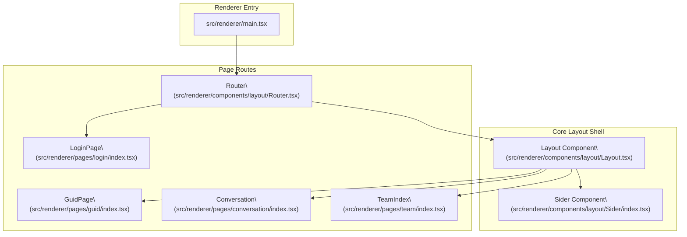
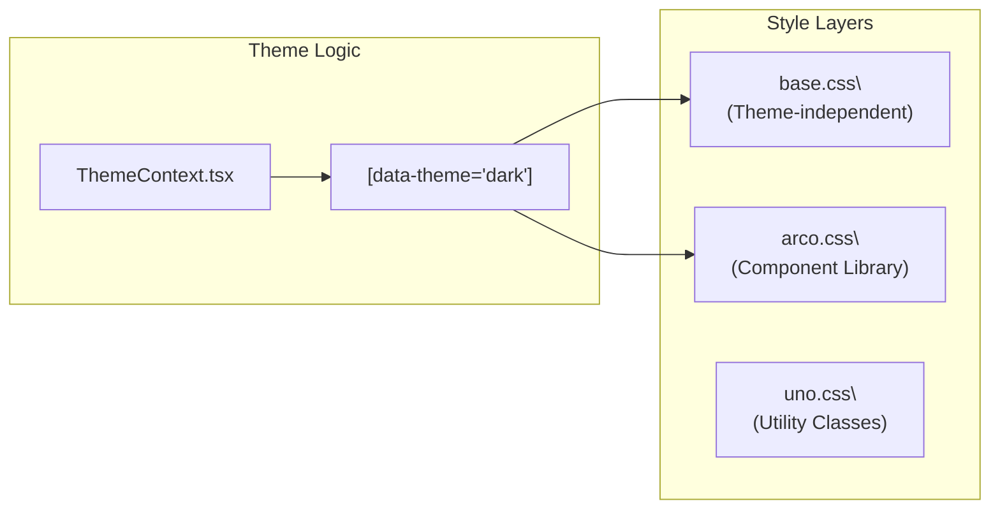

# User Interface

Relevant source files

The following files were used as context for generating this wiki page:

- [Dockerfile](Dockerfile)
- [codecov.yml](codecov.yml)
- [electron.vite.config.ts](electron.vite.config.ts)
- [scripts/build-mcp-servers.js](scripts/build-mcp-servers.js)
- [src/common/config/constants.ts](src/common/config/constants.ts)
- [src/process/resources/teamMcp/teamMcpStdio.ts](src/process/resources/teamMcp/teamMcpStdio.ts)
- [src/renderer/components/layout/Layout.tsx](src/renderer/components/layout/Layout.tsx)
- [src/renderer/components/layout/Router.tsx](src/renderer/components/layout/Router.tsx)
- [src/renderer/components/layout/Sider/SiderItem.tsx](src/renderer/components/layout/Sider/SiderItem.tsx)
- [src/renderer/components/layout/Sider/SiderScheduledEntry.tsx](src/renderer/components/layout/Sider/SiderScheduledEntry.tsx)
- [src/renderer/components/layout/Sider/index.tsx](src/renderer/components/layout/Sider/index.tsx)
- [src/renderer/components/layout/Titlebar/index.tsx](src/renderer/components/layout/Titlebar/index.tsx)
- [src/renderer/index.html](src/renderer/index.html)
- [src/renderer/main.tsx](src/renderer/main.tsx)
- [src/renderer/pages/conversation/GroupedHistory/ConversationRow.tsx](src/renderer/pages/conversation/GroupedHistory/ConversationRow.tsx)
- [src/renderer/pages/conversation/GroupedHistory/ConversationSearchPopover.tsx](src/renderer/pages/conversation/GroupedHistory/ConversationSearchPopover.tsx)
- [src/renderer/pages/conversation/Preview/components/renderers/SelectionToolbar.tsx](src/renderer/pages/conversation/Preview/components/renderers/SelectionToolbar.tsx)
- [src/renderer/pages/conversation/components/WorkspaceCollapse.tsx](src/renderer/pages/conversation/components/WorkspaceCollapse.tsx)
- [src/renderer/pages/settings/AgentSettings/LocalAgents.tsx](src/renderer/pages/settings/AgentSettings/LocalAgents.tsx)
- [src/renderer/styles/themes/base.css](src/renderer/styles/themes/base.css)
- [src/renderer/utils/emitter.ts](src/renderer/utils/emitter.ts)
- [tests/unit/LocalAgents.dom.test.tsx](tests/unit/LocalAgents.dom.test.tsx)
- [tests/unit/acpSessionCapabilities.test.ts](tests/unit/acpSessionCapabilities.test.ts)
- [tests/unit/acpSessionOwnership.test.ts](tests/unit/acpSessionOwnership.test.ts)
- [tests/unit/renderer/components/layout/Router.team-route.dom.test.tsx](tests/unit/renderer/components/layout/Router.team-route.dom.test.tsx)
- [tests/unit/renderer/components/layout/Sider.team-hidden.dom.test.tsx](tests/unit/renderer/components/layout/Sider.team-hidden.dom.test.tsx)
- [tests/unit/webui-favicon.test.ts](tests/unit/webui-favicon.test.ts)
- [vite.renderer.config.ts](vite.renderer.config.ts)

The User Interface subsystem provides the visual layer of AionUi, implemented as a React 18 single-page application within an Electron renderer process. This page covers the overall UI architecture, application bootstrap, component hierarchy, and the internationalization framework.

## Application Bootstrap

The renderer entry point is `src/renderer/main.tsx` [src/renderer/main.tsx:1-132](). It initializes Sentry for error tracking, applies runtime patches, and mounts the React tree into the `#root` DOM node using `createRoot` [src/renderer/main.tsx:131-132]().

The application is wrapped in a multi-layered provider tree to manage global state:

| Provider | Source | Purpose |
|---|---|---|
| `AuthProvider` | `src/renderer/hooks/context/AuthContext.tsx` | Manages JWT authentication state and login/logout flows [src/renderer/main.tsx:27]() |
| `ThemeProvider` | `src/renderer/hooks/context/ThemeContext.tsx` | Handles light/dark theme switching and persistence [src/renderer/main.tsx:28]() |
| `PreviewProvider` | `src/renderer/pages/conversation/Preview/context/PreviewContext.tsx` | Controls the state of the code/file preview panel [src/renderer/main.tsx:29]() |
| `ConversationTabsProvider` | `src/renderer/pages/conversation/hooks/ConversationTabsContext.tsx` | Manages multi-tab navigation within conversations [src/renderer/main.tsx:30]() |
| `ConfigProvider` | `@arco-design/web-react` | Configures the Arco Design system's locale and primary colors [src/renderer/main.tsx:33]() |

Sources: [src/renderer/main.tsx:89-107](), [src/renderer/main.tsx:131-132]()

## Architecture Overview

AionUi uses a modular React architecture where the UI (Renderer) is decoupled from the logic (Main/Worker processes) via a typed IPC bridge (`ipcBridge`).

### Component Hierarchy

The application shell follows a structured routing pattern where the `Layout` component acts as the persistent frame.

**System Mapping: UI Components to Code Entities**

Sources: [src/renderer/main.tsx:117-124](), [src/renderer/components/layout/Router.tsx:50-85](), [src/renderer/components/layout/Sider/index.tsx:37-200]()

## Core UI Subsystems

The interface is divided into several specialized functional areas, each covered in detail in their respective child pages.

### 1. Layout & Shell System
The app shell provides the responsive framework. It includes the `Layout` component and the `Sider` (sidebar) [src/renderer/components/layout/Sider/index.tsx:37](). The `Sider` manages navigation between the "Guid" (new chat) view, active conversations, scheduled tasks, and settings [src/renderer/components/layout/Sider/index.tsx:107-168]().
*   For details, see [Layout System](#5.1).

### 2. Conversation Interface
The primary workspace where users interact with AI agents. The `Router` dispatches to the `Conversation` component based on ID [src/renderer/components/layout/Router.tsx:59](). It integrates the message list, input box, and side panels.
*   For details, see [Conversation Interface](#5.2).

### 3. Message & Input Systems
Handles complex rendering (Markdown, Tool Calls) and input composition. The `SendBox` supports agent-specific logic and file attachments.
*   For details, see [Message Rendering System](#5.4) and [Message Input System](#5.5).

### 4. Settings & Configuration
AionUi provides a comprehensive settings interface for managing agents, models, and system preferences [src/renderer/components/layout/Router.tsx:60-77](). The `LocalAgents` view allows users to manage detected and custom ACP agents [src/renderer/pages/settings/AgentSettings/LocalAgents.tsx:21-168]().
*   For details, see [Settings Interface](#5.7).

## Styling & Theming

AionUi uses a combination of **Arco Design**, **UnoCSS**, and custom CSS variables for a flexible theming system.

**Theme Implementation Mapping**

| CSS File | Source | Purpose |
|---|---|---|
| `base.css` | `src/renderer/styles/themes/base.css` | Defines core animations, scrollbars, and safe areas [src/renderer/styles/themes/base.css:1-131]() |
| `index.css` | `src/renderer/styles/themes/index.css` | Entry point for theme variable definitions |
| `arco-override.css` | `src/renderer/styles/arco-override.css` | Custom tweaks to the Arco Design system |

Sources: [src/renderer/styles/themes/base.css:1-131](), [src/renderer/main.tsx:44-47](), [electron.vite.config.ts:5-6]()

## Internationalization (i18n)

The UI supports multiple languages (English, Chinese, Japanese, Korean, Traditional Chinese) using `react-i18next` [src/renderer/main.tsx:50]().

*   **Arco Sync:** The `Config` component maps the current i18n language to the corresponding Arco Design locale object (e.g., `zhCN`, `jaJP`, `koKRComplete`) to ensure component library internal strings are localized [src/renderer/main.tsx:81-87](), [src/renderer/main.tsx:100-107]().
*   **Sider Integration:** Labels in the sidebar, such as "Scheduled Tasks", are localized via the `useTranslation` hook [src/renderer/components/layout/Sider/SiderScheduledEntry.tsx:29-74]().

Sources: [src/renderer/main.tsx:61-87](), [src/renderer/components/layout/Sider/SiderScheduledEntry.tsx:29-74]()

## Event Management

The UI uses a central `emitter` for cross-component communication that doesn't fit into standard React prop-drilling or Context patterns [src/renderer/utils/emitter.ts:63]().

| Event | Purpose |
|---|---|
| `*.workspace.refresh` | Triggers a refresh of the file workspace for a specific agent type [src/renderer/utils/emitter.ts:23-47]() |
| `preview.open` | Requests the Preview Panel to open a specific file or content [src/renderer/utils/emitter.ts:52-54]() |
| `sendbox.fill` | Programmatically fills the message input box with text [src/renderer/utils/emitter.ts:56]() |

Sources: [src/renderer/utils/emitter.ts:19-61]()