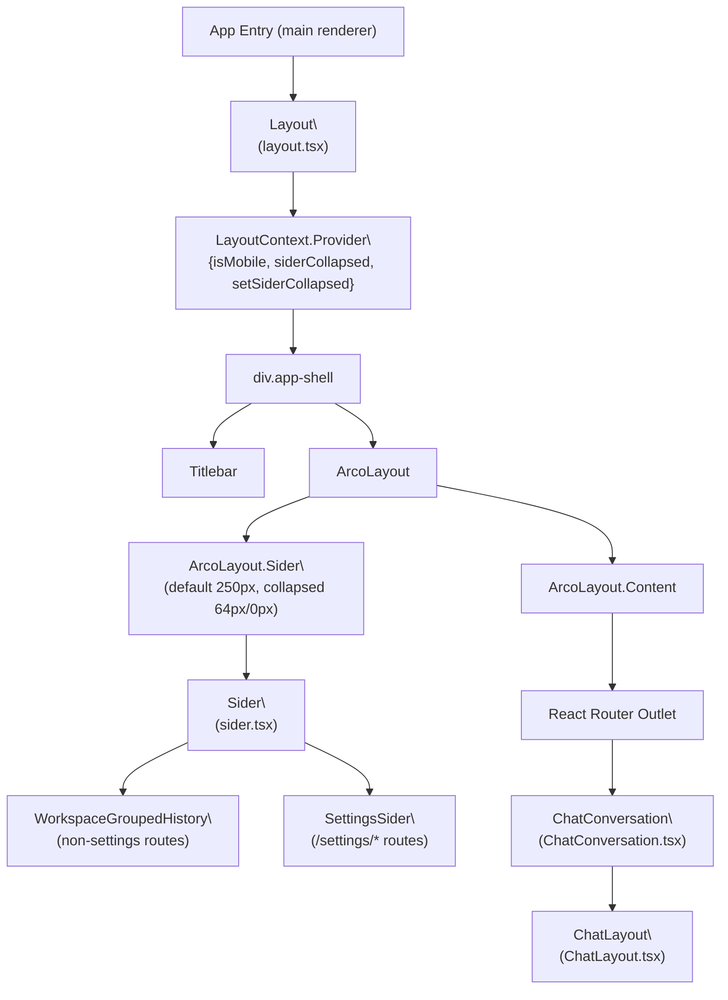
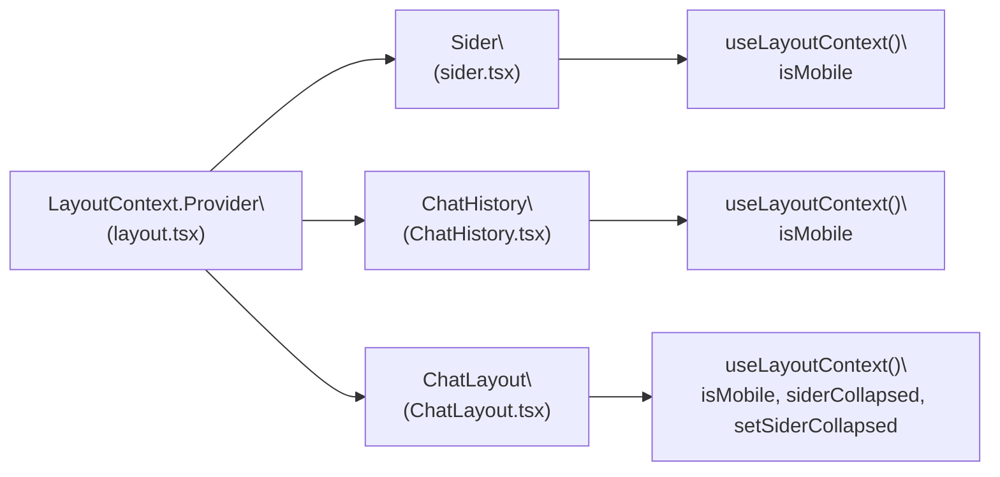
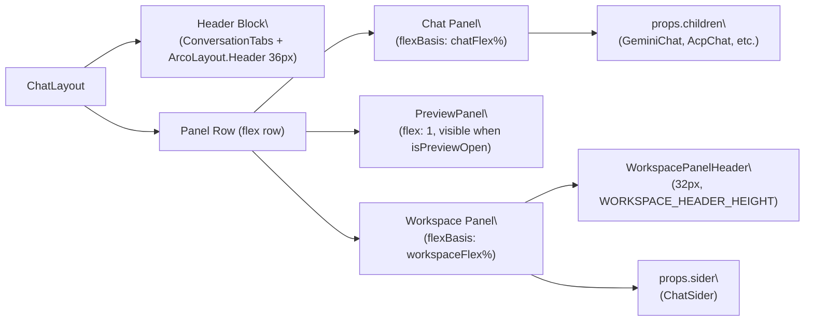
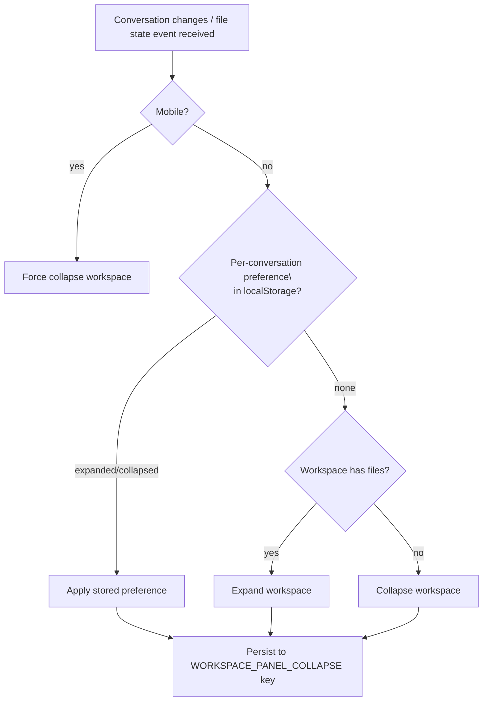
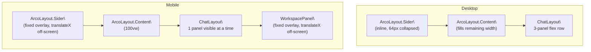

# Layout System

<details>
<summary>Relevant source files</summary>

The following files were used as context for generating this wiki page:

- [src/process/initAgent.ts](src/process/initAgent.ts)
- [src/renderer/layout.tsx](src/renderer/layout.tsx)
- [src/renderer/pages/conversation/ChatConversation.tsx](src/renderer/pages/conversation/ChatConversation.tsx)
- [src/renderer/pages/conversation/ChatHistory.tsx](src/renderer/pages/conversation/ChatHistory.tsx)
- [src/renderer/pages/conversation/ChatLayout.tsx](src/renderer/pages/conversation/ChatLayout.tsx)
- [src/renderer/pages/conversation/ChatSider.tsx](src/renderer/pages/conversation/ChatSider.tsx)
- [src/renderer/pages/settings/SettingsSider.tsx](src/renderer/pages/settings/SettingsSider.tsx)
- [src/renderer/router.tsx](src/renderer/router.tsx)
- [src/renderer/sider.tsx](src/renderer/sider.tsx)
- [src/renderer/styles/themes/base.css](src/renderer/styles/themes/base.css)

</details>

This page documents the application shell structure, the collapsible left `Sider`, the `LayoutContext` context, and the per-conversation `ChatLayout` multi-panel system. It covers how the application adapts between mobile and desktop viewports.

For the conversation content rendered inside the layout, see [Conversation Interface (5.2)](#5.2). For theming and CSS variables, see [Styling & Theming (5.8)](#5.8).

---

## Overview

AionUi's UI is structured as two nested layout layers:

1. **Application shell** (`Layout` in `src/renderer/layout.tsx`) — wraps the entire renderer, provides the collapsible left navigation sider, and exposes `LayoutContext`.
2. **Conversation shell** (`ChatLayout` in `src/renderer/pages/conversation/ChatLayout.tsx`) — wraps each individual conversation, providing a three-panel (chat / preview / workspace) resizable layout.

**Application Shell Component Tree**



Sources: [src/renderer/layout.tsx:67-288](), [src/renderer/sider.tsx:1-128](), [src/renderer/pages/conversation/ChatConversation.tsx:141-220]()

---

## Application Shell (`Layout`)

The `Layout` component in [src/renderer/layout.tsx:67-288]() is the outermost React component that wraps the entire renderer. It manages:

- **Left sider collapse state** (`collapsed`, `setCollapsed`)
- **Mobile viewport detection** (`isMobile`)
- **Custom CSS injection** (via `processCustomCss`)
- **`LayoutContext`** provision

### Sider Dimensions

| Mode    | Default Width                 | Collapsed Width       |
| ------- | ----------------------------- | --------------------- |
| Desktop | `DEFAULT_SIDER_WIDTH` = 250px | 64px (icon-only mode) |
| Mobile  | 250px (fixed overlay)         | 0px (fully hidden)    |

The sider width constant is defined at [src/renderer/layout.tsx:54]().

### Mobile Detection

Both `Layout` and `ChatLayout` use a `detectMobileViewportOrTouch()` function with the following criteria:

| Criterion           | Condition                      |
| ------------------- | ------------------------------ |
| Viewport width      | `window.innerWidth < 768`      |
| Hover media query   | `(hover: none)` matches        |
| Pointer media query | `(pointer: coarse)` matches    |
| Touch points        | `navigator.maxTouchPoints > 0` |

In Electron desktop mode (`isElectronDesktop()`), only the viewport width check applies. Defined in [src/renderer/layout.tsx:56-65]() and duplicated in [src/renderer/pages/conversation/ChatLayout.tsx:25-34]().

### Mobile Sider Behavior

On mobile, the `ArcoLayout.Sider` is placed with `position: fixed` and uses `translateX(-100%)` when collapsed. A backdrop overlay (`bg-black/30`) is rendered behind it when expanded, closing the sider on tap.

[src/renderer/layout.tsx:199-218]()

### Debug Feature

Clicking the AionUi logo 3 times within 1 second opens Electron DevTools via `ipcBridge.application.openDevTools`. [src/renderer/layout.tsx:24-52]()

---

## LayoutContext

`LayoutContext` is defined in `src/renderer/context/LayoutContext` and provided by `Layout`. It carries three values:

| Field               | Type                   | Description                            |
| ------------------- | ---------------------- | -------------------------------------- |
| `isMobile`          | `boolean`              | Whether the viewport is in mobile mode |
| `siderCollapsed`    | `boolean`              | Whether the left sider is collapsed    |
| `setSiderCollapsed` | `(v: boolean) => void` | Imperatively collapse/expand the sider |

**LayoutContext Consumer Map**



Sources: [src/renderer/layout.tsx:192](), [src/renderer/sider.tsx:21](), [src/renderer/pages/conversation/ChatHistory.tsx:21-22](), [src/renderer/pages/conversation/ChatLayout.tsx:112]()

---

## Left Sider (`Sider`)

The `Sider` component in [src/renderer/sider.tsx:20-128]() is passed as the `sider` prop to `Layout`. Its content switches depending on the current route:

- **Non-settings routes**: shows a "New Conversation" button, a batch-mode toggle, and `WorkspaceGroupedHistory`
- **`/settings/*` routes**: shows `SettingsSider` with navigation items (Gemini, Model, Assistants, Tools, Display, WebUI, System, About)

The `Sider` receives `collapsed` and `onSessionClick` props from `Layout`, which clones the element and injects them ([src/renderer/layout.tsx:251-259]()).

### Collapsed Icon Mode

When the desktop sider is collapsed to 64px, text labels are hidden using the `.collapsed-hidden` CSS class. Tooltips appear on hover using `getSiderTooltipProps(collapsed && !isMobile)`. On mobile, tooltips are disabled to avoid floating artifacts ([src/renderer/styles/themes/base.css:207-211]()).

### Settings Sider Items

`SettingsSider` ([src/renderer/pages/settings/SettingsSider.tsx:11-103]()) renders the following nav items:

| Label key             | Path                |
| --------------------- | ------------------- |
| `settings.gemini`     | `/settings/gemini`  |
| `settings.model`      | `/settings/model`   |
| `settings.assistants` | `/settings/agent`   |
| `settings.tools`      | `/settings/tools`   |
| `settings.display`    | `/settings/display` |
| `settings.webui`      | `/settings/webui`   |
| `settings.system`     | `/settings/system`  |
| `settings.about`      | `/settings/about`   |

---

## Per-Conversation Layout (`ChatLayout`)

`ChatLayout` in [src/renderer/pages/conversation/ChatLayout.tsx:72-519]() is used by `ChatConversation` to wrap each individual conversation. It provides a resizable three-panel layout.

**ChatLayout Panel Structure**



Sources: [src/renderer/pages/conversation/ChatLayout.tsx:382-516]()

### Props

| Prop               | Type        | Purpose                                               |
| ------------------ | ----------- | ----------------------------------------------------- |
| `children`         | `ReactNode` | The chat UI content                                   |
| `sider`            | `ReactNode` | Workspace panel content (file tree, etc.)             |
| `siderTitle`       | `ReactNode` | Header inside workspace panel                         |
| `title`            | `ReactNode` | Conversation title shown in header                    |
| `headerExtra`      | `ReactNode` | Right-side header additions (e.g., `CronJobManager`)  |
| `headerLeft`       | `ReactNode` | Left-side header additions (e.g., model selector)     |
| `backend`          | `string`    | Agent backend identifier for `AgentModeSelector`      |
| `agentName`        | `string`    | Display name override for agent                       |
| `agentLogo`        | `string`    | SVG path or emoji for agent avatar                    |
| `workspaceEnabled` | `boolean`   | Whether workspace panel is shown                      |
| `conversationId`   | `string`    | Used to look up per-conversation workspace preference |

### Resizable Panel Splits

Panel widths are managed by `useResizableSplit`, with ratios stored in `localStorage`:

| Panel split              | Default | Min | Max | Storage key                  |
| ------------------------ | ------- | --- | --- | ---------------------------- |
| Chat ↔ Preview           | 60%     | 25% | 80% | `chat-preview-split-ratio`   |
| Chat/Preview ↔ Workspace | 20%     | 12% | 40% | `chat-workspace-split-ratio` |

Sources: [src/renderer/pages/conversation/ChatLayout.tsx:20-23](), [src/renderer/pages/conversation/ChatLayout.tsx:292-311]()

### Effective Panel Width Formula

```
chatFlex    = isPreviewOpen ? chatSplitRatio : (100 - effectiveWorkspaceRatio)
workspaceFlex = workspaceSplitRatio   (when enabled, desktop, not collapsed)
previewFlex = flex: 1 (auto-fills remainder)
```

[src/renderer/pages/conversation/ChatLayout.tsx:313-319]()

### Toggle Button Placement

The workspace toggle button placement varies by platform:

| Platform      | Toggle Location                                                   |
| ------------- | ----------------------------------------------------------------- |
| macOS         | Hidden from header (controlled via Titlebar)                      |
| Windows       | Injected into `ArcoLayout.Header` right side                      |
| Linux / other | Floating button on right edge; also inside `WorkspacePanelHeader` |

[src/renderer/pages/conversation/ChatLayout.tsx:393-397](), [src/renderer/pages/conversation/ChatLayout.tsx:429]()

---

## Workspace Panel Collapse Logic

The workspace panel (right sider in `ChatLayout`) has a layered collapse decision:



- **Global persistence**: `localStorage.setItem(STORAGE_KEYS.WORKSPACE_PANEL_COLLAPSE, ...)`
- **Per-conversation preference**: `localStorage.setItem('workspace-preference-{conversationId}', 'expanded' | 'collapsed')`
- **Auto-collapse when preview opens**: saves previous collapsed states and restores them when preview closes

Sources: [src/renderer/pages/conversation/ChatLayout.tsx:92-212](), [src/renderer/pages/conversation/ChatLayout.tsx:344-371]()

### Workspace Events

Communication between components and `ChatLayout` for workspace state uses custom DOM events:

| Event name                  | Constant             | Purpose                                    |
| --------------------------- | -------------------- | ------------------------------------------ |
| `WORKSPACE_TOGGLE_EVENT`    | `workspaceEvents.ts` | Toggle workspace open/closed               |
| `WORKSPACE_HAS_FILES_EVENT` | `workspaceEvents.ts` | Notify that a conversation has/lacks files |

`dispatchWorkspaceToggleEvent()` and `dispatchWorkspaceStateEvent()` are the dispatchers. [src/renderer/pages/conversation/ChatLayout.tsx:15]()

---

## Mobile Layout Adaptations

**Comparison: Desktop vs Mobile Layout**



Key mobile-specific behaviors:

| Behavior        | Detail                                                                         |
| --------------- | ------------------------------------------------------------------------------ |
| Left sider      | `position: fixed`, slides in from left, backdrop overlay on tap-outside        |
| Workspace panel | `position: fixed`, slides in from right with `translateX(100%)` when collapsed |
| Chat panel      | `width: 100%`, hides when preview is open                                      |
| Preview panel   | Full width when visible (`width: calc(100% - 16px)`)                           |
| Workspace width | Capped at `Math.min(500, Math.max(200, ratio * viewportWidth))` px             |
| Input focus     | `blurActiveElement()` called on conversation switch to prevent soft keyboard   |

Sources: [src/renderer/layout.tsx:199-218](), [src/renderer/pages/conversation/ChatLayout.tsx:484-507](), [src/renderer/pages/conversation/ChatLayout.tsx:282-290]()

---

## Base CSS

Relevant CSS classes and variables defined in [src/renderer/styles/themes/base.css]():

| Class / Variable             | Purpose                                                          |
| ---------------------------- | ---------------------------------------------------------------- |
| `--titlebar-height: 36px`    | Titlebar height used by `app-titlebar`                           |
| `--app-min-width: 360px`     | Minimum layout width                                             |
| `.app-shell`                 | Root flex column container                                       |
| `.layout-sider`              | Base sider style; `border-right: 1px solid var(--border-base)`   |
| `.layout-sider.collapsed`    | Triggers `.collapsed-hidden` to hide labels                      |
| `.workspace-header__toggle`  | 28×28px toggle button                                            |
| `.workspace-toggle-floating` | Floating expand button when workspace collapsed on desktop       |
| `.preview-panel`             | Entry animation: `translateX(20px)` → `translateX(0)` over 250ms |
| `.chat-history--collapsed`   | Fades and slides out item labels and sections                    |

Mobile overrides (`@media (max-width: 767px)`) apply `height: 100dvh`, `position: fixed`, and flex column layout to `.layout-sider` to handle dynamic browser chrome on iOS/Android. [src/renderer/styles/themes/base.css:207-260]()

Sources: [src/renderer/styles/themes/base.css:1-310]()
