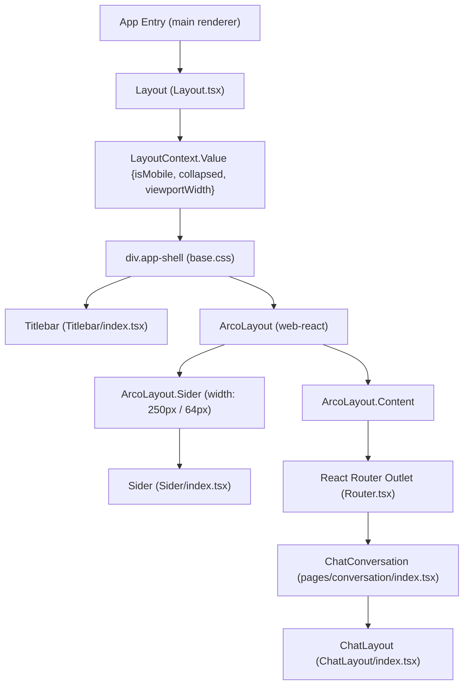
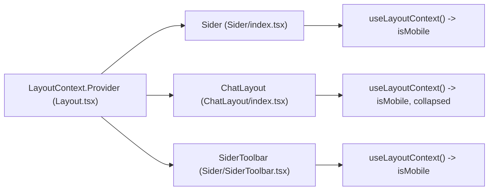
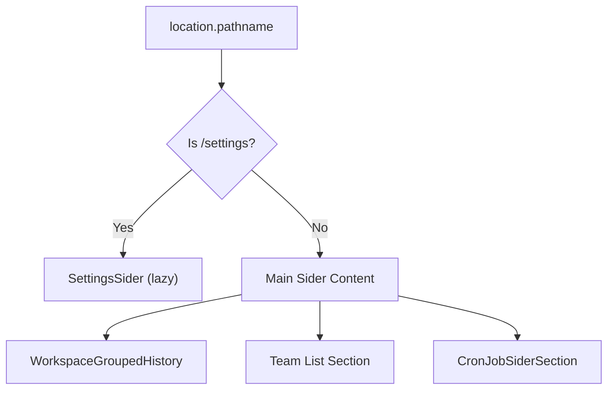

# Layout System

Relevant source files

The following files were used as context for generating this wiki page:

- [Dockerfile](Dockerfile)
- [electron.vite.config.ts](electron.vite.config.ts)
- [scripts/build-mcp-servers.js](scripts/build-mcp-servers.js)
- [src/common/config/constants.ts](src/common/config/constants.ts)
- [src/process/resources/teamMcp/teamMcpStdio.ts](src/process/resources/teamMcp/teamMcpStdio.ts)
- [src/process/utils/zoom.ts](src/process/utils/zoom.ts)
- [src/renderer/components/base/AionCollapse.tsx](src/renderer/components/base/AionCollapse.tsx)
- [src/renderer/components/base/AionModal.tsx](src/renderer/components/base/AionModal.tsx)
- [src/renderer/components/base/AionScrollArea.tsx](src/renderer/components/base/AionScrollArea.tsx)
- [src/renderer/components/base/AionSelect.tsx](src/renderer/components/base/AionSelect.tsx)
- [src/renderer/components/base/AionSteps.tsx](src/renderer/components/base/AionSteps.tsx)
- [src/renderer/components/base/index.ts](src/renderer/components/base/index.ts)
- [src/renderer/components/layout/Layout.tsx](src/renderer/components/layout/Layout.tsx)
- [src/renderer/components/layout/Router.tsx](src/renderer/components/layout/Router.tsx)
- [src/renderer/components/layout/Sider/SiderItem.tsx](src/renderer/components/layout/Sider/SiderItem.tsx)
- [src/renderer/components/layout/Sider/SiderScheduledEntry.tsx](src/renderer/components/layout/Sider/SiderScheduledEntry.tsx)
- [src/renderer/components/layout/Sider/index.tsx](src/renderer/components/layout/Sider/index.tsx)
- [src/renderer/components/layout/Titlebar/index.tsx](src/renderer/components/layout/Titlebar/index.tsx)
- [src/renderer/pages/conversation/GroupedHistory/ConversationRow.tsx](src/renderer/pages/conversation/GroupedHistory/ConversationRow.tsx)
- [src/renderer/pages/conversation/GroupedHistory/ConversationSearchPopover.tsx](src/renderer/pages/conversation/GroupedHistory/ConversationSearchPopover.tsx)
- [src/renderer/pages/conversation/Preview/components/renderers/SelectionToolbar.tsx](src/renderer/pages/conversation/Preview/components/renderers/SelectionToolbar.tsx)
- [src/renderer/pages/conversation/components/WorkspaceCollapse.tsx](src/renderer/pages/conversation/components/WorkspaceCollapse.tsx)
- [src/renderer/pages/settings/AgentSettings/LocalAgents.tsx](src/renderer/pages/settings/AgentSettings/LocalAgents.tsx)
- [src/renderer/styles/themes/base.css](src/renderer/styles/themes/base.css)
- [tests/unit/LocalAgents.dom.test.tsx](tests/unit/LocalAgents.dom.test.tsx)
- [tests/unit/acpSessionCapabilities.test.ts](tests/unit/acpSessionCapabilities.test.ts)
- [tests/unit/acpSessionOwnership.test.ts](tests/unit/acpSessionOwnership.test.ts)
- [tests/unit/process/utils/zoom.test.ts](tests/unit/process/utils/zoom.test.ts)
- [tests/unit/renderer/components/layout/Router.team-route.dom.test.tsx](tests/unit/renderer/components/layout/Router.team-route.dom.test.tsx)
- [tests/unit/renderer/components/layout/Sider.team-hidden.dom.test.tsx](tests/unit/renderer/components/layout/Sider.team-hidden.dom.test.tsx)
- [vite.renderer.config.ts](vite.renderer.config.ts)

This page documents the application shell structure, the collapsible left `Sider`, the `LayoutContext` context, and the per-conversation `ChatLayout` multi-panel system. It covers how the application adapts between mobile and desktop viewports, including specialized components like the workspace collapse and preview panel state management.

---

## Overview

AionUi's UI is structured as two nested layout layers:

1.  **Application shell** (`Layout` in [src/renderer/components/layout/Layout.tsx]()) — wraps the entire renderer, provides the collapsible left navigation sider, manages global CSS injection, and exposes `LayoutContext`.
2.  **Conversation shell** (`ChatLayout` in [src/renderer/pages/conversation/components/ChatLayout/index.tsx]()) — wraps each individual conversation, providing a three-panel (chat / preview / workspace) resizable layout.

**Application Shell Component Tree**

Sources: [src/renderer/components/layout/Layout.tsx:84-181](), [src/renderer/pages/conversation/components/ChatLayout/index.tsx:34-168](), [src/renderer/styles/themes/base.css:8-18]()

---

## Application Shell (`Layout`)

The `Layout` component is the outermost React component that wraps the entire renderer. It manages:

*   **Left sider collapse state** (`collapsed`, `setCollapsed`) [src/renderer/components/layout/Layout.tsx:88]()
*   **Mobile viewport detection** (`isMobile`) [src/renderer/components/layout/Layout.tsx:89]()
*   **Custom CSS injection** (via `loadAndHealCustomCss` and `processCustomCss`) [src/renderer/components/layout/Layout.tsx:114-162]()
*   **`LayoutContext`** provision [src/renderer/components/layout/Layout.tsx:192]()

### Sider Dimensions

| Mode | Default Width | Collapsed Width |
| :--- | :--- | :--- |
| **Desktop** | `DEFAULT_SIDER_WIDTH` = 250px | 64px (icon-only mode) |
| **Mobile** | 250px (fixed overlay) | 0px (fully hidden) |

The sider width constants and drag thresholds are defined at [src/renderer/components/layout/Layout.tsx:61-67]().

### Mobile Detection

The `detectMobileViewportOrTouch()` function determines if the environment is a mobile device using viewport width and media queries. In Electron desktop mode, only the viewport width check applies to prevent touch-enabled laptops from being misidentified as mobile. [src/renderer/components/layout/Layout.tsx:69-82]()

| Criterion | Condition |
| :--- | :--- |
| Viewport width | `window.innerWidth < 768` |
| Hover media query | `window.matchMedia('(hover: none)').matches` |
| Pointer media query | `window.matchMedia('(pointer: coarse)').matches` |
| Touch points | `navigator.maxTouchPoints > 0` |

Sources: [src/renderer/components/layout/Layout.tsx:61-82](), [src/renderer/styles/themes/base.css:29-33]()

---

## LayoutContext

`LayoutContext` is provided by `Layout` and consumed by various components to adapt their behavior to the viewport and sider state.

**LayoutContext Data Flow**

Sources: [src/renderer/components/layout/Layout.tsx:192](), [src/renderer/components/layout/Sider/index.tsx:38-39](), [src/renderer/pages/conversation/components/ChatLayout/index.tsx:53-57]()

---

## Per-Conversation Layout (`ChatLayout`)

`ChatLayout` provides a resizable three-panel layout for conversation views. It manages the chat history, the preview panel (for files/code), and the workspace sidebar.

### Resizable Panel Splits

Panel widths are managed by the `useResizableSplit` hook, which persists ratios to `localStorage`. The layout calculates flex basis for panels based on these ratios.

| Panel split | Default | Min Ratio | Max Ratio | Storage key |
| :--- | :--- | :--- | :--- | :--- |
| **Chat ↔ Preview** | 60% | Dynamic | Dynamic | `chat-preview-split-ratio` |
| **Chat/Preview ↔ Workspace** | 20% | `MIN_WORKSPACE_RATIO` | 40% | `chat-workspace-split-ratio` |

Sources: [src/renderer/pages/conversation/components/ChatLayout/index.tsx:96-127](), [src/renderer/pages/conversation/components/ChatLayout/index.tsx:169-210]()

### Panel State Management

The workspace panel (right sider) state is managed by the `useWorkspaceCollapse` hook.

*   **Auto-Collapse**: On mobile, the workspace is always collapsed by default. [src/renderer/pages/conversation/components/ChatLayout/index.tsx:63-67]()
*   **Preview Interaction**: `usePreviewAutoCollapse` ensures that if the preview panel is opened and screen space is limited, the workspace panel or left sider may be automatically collapsed to make room. [src/renderer/pages/conversation/components/ChatLayout/index.tsx:143-151]()
*   **Persistence**: Preferences are stored per-conversation to remember whether a user preferred the workspace open or closed for a specific context. [src/renderer/pages/conversation/components/ChatLayout/index.tsx:63-67]()

---

## Sider Navigation System

The `Sider` component ([src/renderer/components/layout/Sider/index.tsx]()) acts as the primary navigation hub. It dynamically switches content based on whether the user is in the "Settings" area or the main "Conversation" area.

### Sider Components

*   **SiderToolbar**: Contains the "New Chat" button and batch operation controls. [src/renderer/components/layout/Sider/index.tsx:191-197]()
*   **SiderSearchEntry**: Integrated search for conversation history. [src/renderer/components/layout/Sider/index.tsx:198-202]()
*   **WorkspaceGroupedHistory**: Renders the list of previous conversations, grouped by date. [src/renderer/components/layout/Sider/index.tsx:210-212]()
*   **SiderFooter**: Contains the user profile, settings entry, and theme toggle. [src/renderer/components/layout/Sider/index.tsx:223-229]()

**Sider Routing Logic**

Sources: [src/renderer/components/layout/Sider/index.tsx:185-215](), [src/renderer/components/layout/Sider/index.tsx:98-105]()

---

## Styling and Responsive Design

### Base Styles
The system uses `base.css` for theme-independent layout rules:
*   `--app-min-width: 360px` to prevent layout collapse. [src/renderer/styles/themes/base.css:4]()
*   `--titlebar-height: 36px` for the Electron custom titlebar. [src/renderer/styles/themes/base.css:5]()
*   Safe area utilities (`safe-area-bottom`, `safe-area-top`) using `env(safe-area-inset-*)` for iOS/mobile compatibility. [src/renderer/styles/themes/base.css:80-88]()

### Scrollbar Management
Custom scrollbars are implemented for webkit browsers, with transparency and hover effects to maintain a clean look. The `.scrollbar-hide` utility is provided for clean interfaces. [src/renderer/styles/themes/base.css:91-130]()

### Animation Constants
The system defines several keyframes for UI feedback:
*   `bg-animate`: Used for loading states or background transitions. [src/renderer/styles/themes/base.css:35-42]()
*   `team-tab-breathe`: A breathing animation for active team sessions. [src/renderer/styles/themes/base.css:44-58]()

Sources: [src/renderer/styles/themes/base.css:1-131](), [electron.vite.config.ts:5-6]()