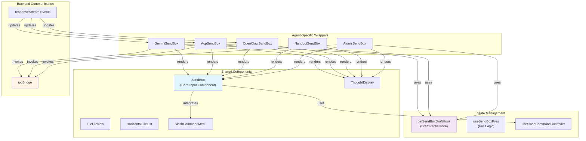
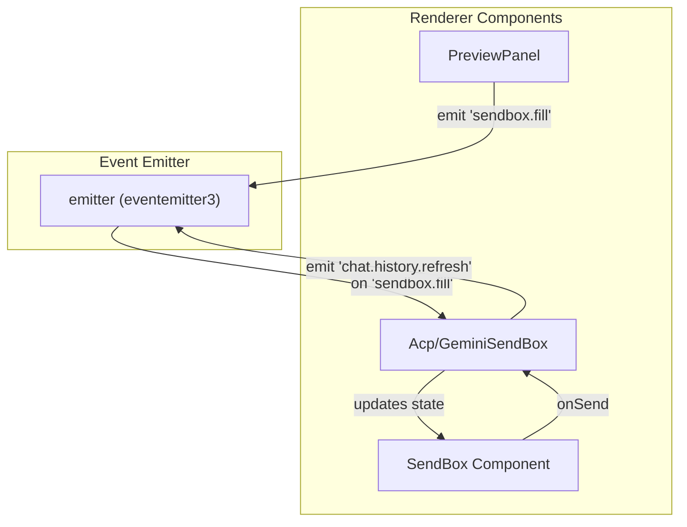

# Message Input System

Relevant source files

The following files were used as context for generating this wiki page:

- [src/process/bridge/notificationBridge.ts](src/process/bridge/notificationBridge.ts)
- [src/renderer/components/chat/CommandQueuePanel.tsx](src/renderer/components/chat/CommandQueuePanel.tsx)
- [src/renderer/components/chat/sendbox.tsx](src/renderer/components/chat/sendbox.tsx)
- [src/renderer/hooks/system/useCommandQueueEnabled.ts](src/renderer/hooks/system/useCommandQueueEnabled.ts)
- [src/renderer/pages/conversation/Messages/components/MessageCronTrigger.tsx](src/renderer/pages/conversation/Messages/components/MessageCronTrigger.tsx)
- [src/renderer/pages/conversation/Messages/components/MessagetText.tsx](src/renderer/pages/conversation/Messages/components/MessagetText.tsx)
- [src/renderer/pages/conversation/Messages/components/SelectionReplyButton.tsx](src/renderer/pages/conversation/Messages/components/SelectionReplyButton.tsx)
- [src/renderer/pages/conversation/Messages/components/SkillSuggestCard.tsx](src/renderer/pages/conversation/Messages/components/SkillSuggestCard.tsx)
- [src/renderer/pages/conversation/platforms/acp/AcpSendBox.tsx](src/renderer/pages/conversation/platforms/acp/AcpSendBox.tsx)
- [src/renderer/pages/conversation/platforms/aionrs/AionrsSendBox.tsx](src/renderer/pages/conversation/platforms/aionrs/AionrsSendBox.tsx)
- [src/renderer/pages/conversation/platforms/gemini/GeminiSendBox.tsx](src/renderer/pages/conversation/platforms/gemini/GeminiSendBox.tsx)
- [src/renderer/pages/conversation/platforms/gemini/useGeminiMessage.ts](src/renderer/pages/conversation/platforms/gemini/useGeminiMessage.ts)
- [src/renderer/pages/conversation/platforms/nanobot/NanobotSendBox.tsx](src/renderer/pages/conversation/platforms/nanobot/NanobotSendBox.tsx)
- [src/renderer/pages/conversation/platforms/openclaw/OpenClawSendBox.tsx](src/renderer/pages/conversation/platforms/openclaw/OpenClawSendBox.tsx)
- [src/renderer/pages/conversation/platforms/remote/RemoteSendBox.tsx](src/renderer/pages/conversation/platforms/remote/RemoteSendBox.tsx)
- [src/renderer/pages/conversation/platforms/useConversationCommandQueue.ts](src/renderer/pages/conversation/platforms/useConversationCommandQueue.ts)
- [src/renderer/pages/cron/ScheduledTasksPage/CronStatusTag.tsx](src/renderer/pages/cron/ScheduledTasksPage/CronStatusTag.tsx)
- [src/renderer/pages/cron/ScheduledTasksPage/index.tsx](src/renderer/pages/cron/ScheduledTasksPage/index.tsx)
- [src/renderer/pages/cron/cronUtils.ts](src/renderer/pages/cron/cronUtils.ts)
- [tests/unit/RemoteSendBox.dom.test.tsx](tests/unit/RemoteSendBox.dom.test.tsx)
- [tests/unit/geminiAgentManagerThinking.test.ts](tests/unit/geminiAgentManagerThinking.test.ts)
- [tests/unit/renderer/conversation/CreateTaskDialog.dom.test.tsx](tests/unit/renderer/conversation/CreateTaskDialog.dom.test.tsx)
- [tests/unit/renderer/conversation/ScheduledTasksPage.dom.test.tsx](tests/unit/renderer/conversation/ScheduledTasksPage.dom.test.tsx)
- [tests/unit/renderer/conversation/TaskDetailPage.dom.test.tsx](tests/unit/renderer/conversation/TaskDetailPage.dom.test.tsx)
- [tests/unit/renderer/conversationCommandQueue.dom.test.tsx](tests/unit/renderer/conversationCommandQueue.dom.test.tsx)
- [tests/unit/renderer/conversationCommandQueue.test.ts](tests/unit/renderer/conversationCommandQueue.test.ts)
- [tests/unit/renderer/platformSendBoxes.dom.test.tsx](tests/unit/renderer/platformSendBoxes.dom.test.tsx)

## Purpose and Scope

The Message Input System provides the user interface for composing and sending messages to AI agents in AionUi. It implements a composition pattern where a shared `SendBox` component provides core input functionality, while agent-specific wrappers (`GeminiSendBox`, `AcpSendBox`, `OpenClawSendBox`, `NanobotSendBox`, `AionrsSendBox`) handle agent-specific state management, message streaming, and draft persistence.

This page covers the input component architecture, streaming state management via refs, slash command integration, file attachment handling, and the message lifecycle from user input to backend invocation.

---

## Architecture Overview

The Message Input System uses a two-layer architecture: a reusable `SendBox` component handles UI interactions, while agent-specific wrapper components manage conversation state and backend communication.

**Diagram: Message Input Component Architecture**

**Sources:** [src/renderer/components/chat/sendbox.tsx:150-198](), [src/renderer/pages/conversation/platforms/acp/AcpSendBox.tsx:83-110](), [src/renderer/pages/conversation/platforms/gemini/GeminiSendBox.tsx:87-143](), [src/renderer/pages/conversation/platforms/aionrs/AionrsSendBox.tsx:88-102]()

---

## Core SendBox Component

The `SendBox` component at `src/renderer/components/chat/sendbox.tsx` provides the foundational input interface. It manages UI state, text input, file attachments, and slash command integration.

### Component Interface

| Prop | Type | Purpose |
|------|------|---------|
| `value` | `string` | Controlled input value [src/renderer/components/chat/sendbox.tsx:151]() |
| `onChange` | `(value: string) => void` | Input change handler [src/renderer/components/chat/sendbox.tsx:152]() |
| `onSend` | `(message: string) => Promise<void>` | Message send callback [src/renderer/components/chat/sendbox.tsx:153]() |
| `onStop` | `() => Promise<void>` | Stop streaming callback [src/renderer/components/chat/sendbox.tsx:154]() |
| `loading` | `boolean` | Display loading state [src/renderer/components/chat/sendbox.tsx:156]() |
| `tools` | `React.ReactNode` | Custom tool buttons (e.g., file picker) [src/renderer/components/chat/sendbox.tsx:158]() |
| `slashCommands` | `SlashCommandItem[]` | Available slash commands [src/renderer/components/chat/sendbox.tsx:166]() |
| `onFilesAdded` | `(files: FileMetadata[]) => void` | File paste/drag handler [src/renderer/components/chat/sendbox.tsx:161]() |

**Sources:** [src/renderer/components/chat/sendbox.tsx:150-174]()

### Single-Line vs Multi-Line Detection

The `SendBox` dynamically switches between single-line and multi-line modes based on content length and width.

- **Character threshold**: Content exceeding 800 characters immediately switches to multi-line to avoid heavy layout calculations [src/renderer/components/chat/sendbox.tsx:47]().
- **Btw Command Detection**: Specifically detects `/btw` commands using regex `BTW_COMMAND_RE` [src/renderer/components/chat/sendbox.tsx:48]().

**Sources:** [src/renderer/components/chat/sendbox.tsx:45-48]()

---

## File Attachment & Workspace Integration

AionUi handles files through agent-specific draft hooks and a shared file management hook.

### File Handling Hooks

| Hook | File | Purpose |
|------|------|---------|
| `getSendBoxDraftHook` | `src/renderer/hooks/chat/useSendBoxDraft.ts` | Creates persistent draft storage for input and files [src/renderer/pages/conversation/platforms/acp/AcpSendBox.tsx:41]() |
| `useSendBoxFiles` | `src/renderer/hooks/chat/useSendBoxFiles.ts` | Orchestrates file addition and clearing logic [src/renderer/pages/conversation/platforms/acp/AcpSendBox.tsx:121]() |

### Implementation in Agent SendBoxes

Agent implementations like `AcpSendBox` and `GeminiSendBox` use `useSendBoxDraft` to maintain state for:
- `atPath`: Files mentioned or attached from the workspace [src/renderer/pages/conversation/platforms/acp/AcpSendBox.tsx:53]().
- `uploadFile`: Files to be uploaded from the local machine [src/renderer/pages/conversation/platforms/acp/AcpSendBox.tsx:54]().
- `content`: The text content of the draft [src/renderer/pages/conversation/platforms/acp/AcpSendBox.tsx:55]().

**Sources:** [src/renderer/pages/conversation/platforms/acp/AcpSendBox.tsx:51-81](), [src/renderer/pages/conversation/platforms/gemini/GeminiSendBox.tsx:54-85]()

---

## Message Lifecycle & State Management

The streaming message lifecycle is managed using a combination of React state for UI rendering and `refs` for event-driven logic to avoid closure staleness during long-running AI operations.

### State Management via Refs

Agent sendboxes use `useLatestRef` to ensure that callbacks (like `setContent`) always access the current state within `useEffect` or event listeners [src/renderer/pages/conversation/platforms/acp/AcpSendBox.tsx:114-115]().

### Notification System

The system can trigger native notifications via the `notificationBridge` when messages complete or tasks execute.

- **Main Process**: `showNotification` checks `system.notificationEnabled` before invoking platform-specific services [src/process/bridge/notificationBridge.ts:43-64]().
- **IPC**: The bridge registers an IPC provider so the renderer can trigger notifications [src/process/bridge/notificationBridge.ts:69-73]().

**Sources:** [src/process/bridge/notificationBridge.ts:43-73](), [src/renderer/pages/conversation/platforms/acp/AcpSendBox.tsx:114-118]()

---

## Event Communication

The `emitter` (based on `eventemitter3`) acts as the central nervous system for message-related events that bypass standard React prop drilling.

**Table: Message System Events**
| Event Name | Payload | Description |
|------------|---------|-------------|
| `sendbox.fill` | `string` | Fills the SendBox input with specific text (e.g., from Preview panel) [src/renderer/pages/conversation/platforms/acp/AcpSendBox.tsx:141-146]() |
| `chat.history.refresh` | `void` | Signals the message list to reload history [src/renderer/pages/conversation/platforms/aionrs/AionrsSendBox.tsx:182]() |
| `aionrs.workspace.refresh`| `void` | Refreshes the workspace view after file operations [src/renderer/pages/conversation/platforms/aionrs/AionrsSendBox.tsx:184]() |

**Sources:** [src/renderer/pages/conversation/platforms/acp/AcpSendBox.tsx:140-147](), [src/renderer/pages/conversation/platforms/aionrs/AionrsSendBox.tsx:182-185]()

**Diagram: Cross-Component Event Flow**

**Sources:** [src/renderer/pages/conversation/platforms/acp/AcpSendBox.tsx:140-147](), [src/renderer/pages/conversation/platforms/aionrs/AionrsSendBox.tsx:182]()

---

## Specialized Input Features

### Slash Commands
The `useSlashCommands` hook provides agent-aware command suggestions (e.g., `/clear`, `/model`) based on the current agent's status [src/renderer/pages/conversation/platforms/acp/AcpSendBox.tsx:109]().

### Command Queuing
For agents that support it, `useConversationCommandQueue` allows users to queue multiple prompts. The `executeCommand` function checks `shouldEnqueueConversationCommand` before sending [src/renderer/pages/conversation/platforms/acp/AcpSendBox.tsx:157-185]().

### Thought Display
During AI generation, the `ThoughtDisplay` component renders internal reasoning or "thoughts" received via `responseStream` [src/renderer/pages/conversation/platforms/nanobot/NanobotSendBox.tsx:69-111](). To maintain performance, thought updates are throttled (e.g., 50ms) [src/renderer/pages/conversation/platforms/nanobot/NanobotSendBox.tsx:82]().

**Sources:** [src/renderer/pages/conversation/platforms/acp/AcpSendBox.tsx:105-109](), [src/renderer/pages/conversation/platforms/nanobot/NanobotSendBox.tsx:69-111]()