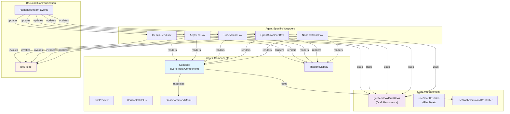
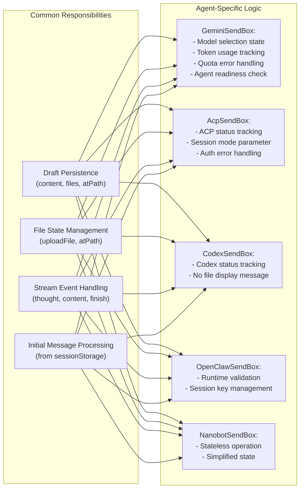
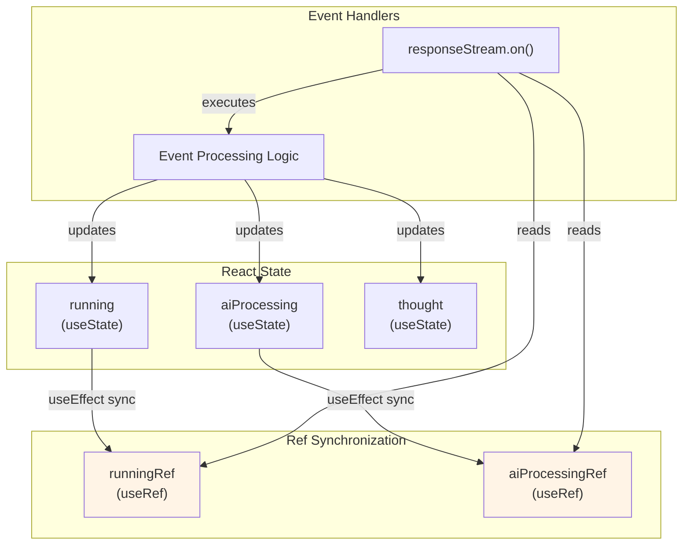
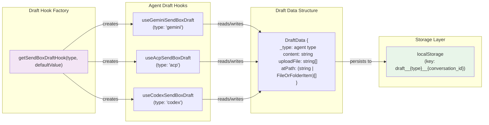
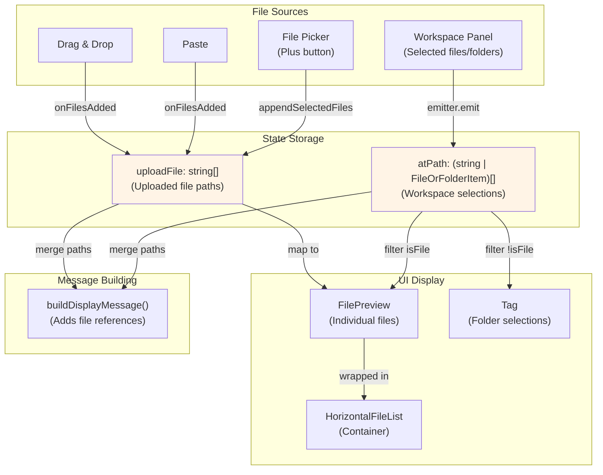
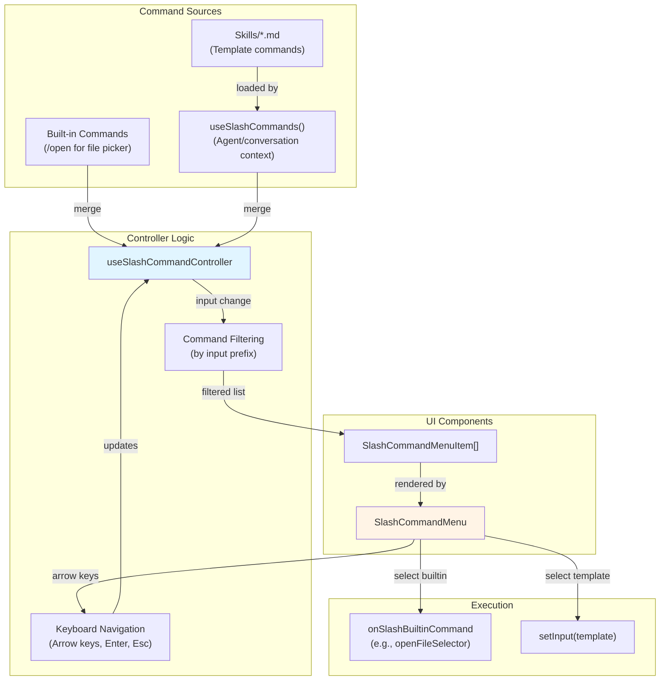
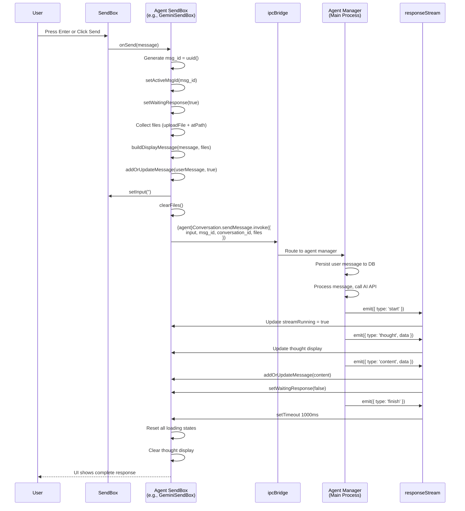
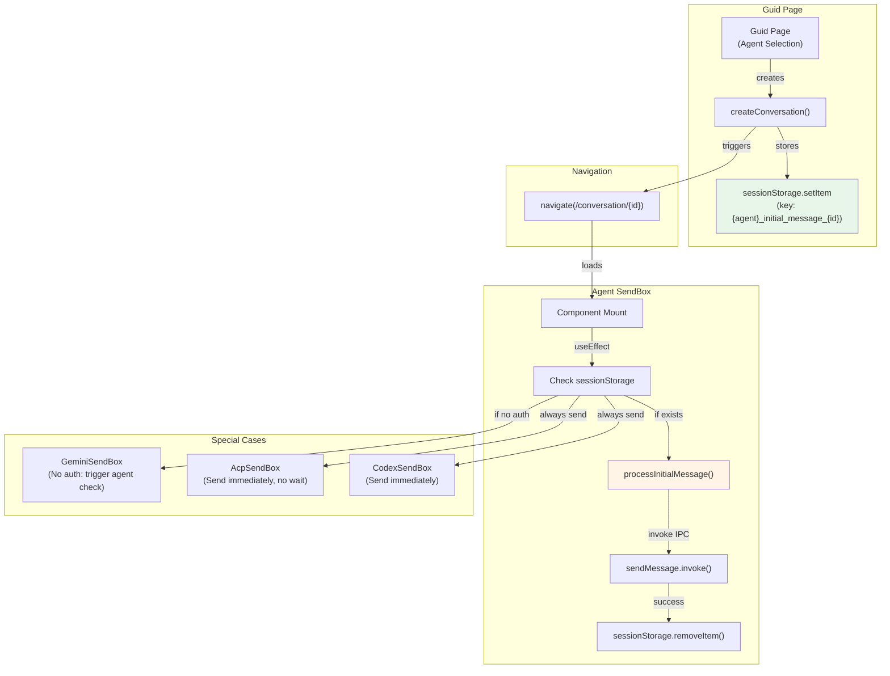

# Message Input System

<details>
<summary>Relevant source files</summary>

The following files were used as context for generating this wiki page:

- [src/process/task/OpenClawAgentManager.ts](src/process/task/OpenClawAgentManager.ts)
- [src/renderer/components/sendbox.tsx](src/renderer/components/sendbox.tsx)
- [src/renderer/pages/conversation/acp/AcpSendBox.tsx](src/renderer/pages/conversation/acp/AcpSendBox.tsx)
- [src/renderer/pages/conversation/codex/CodexSendBox.tsx](src/renderer/pages/conversation/codex/CodexSendBox.tsx)
- [src/renderer/pages/conversation/gemini/GeminiSendBox.tsx](src/renderer/pages/conversation/gemini/GeminiSendBox.tsx)
- [src/renderer/pages/conversation/nanobot/NanobotSendBox.tsx](src/renderer/pages/conversation/nanobot/NanobotSendBox.tsx)
- [src/renderer/pages/conversation/openclaw/OpenClawSendBox.tsx](src/renderer/pages/conversation/openclaw/OpenClawSendBox.tsx)

</details>

## Purpose and Scope

The Message Input System provides the user interface for composing and sending messages to AI agents in AionUi. It implements a composition pattern where a shared `SendBox` component provides core input functionality, while agent-specific wrappers (`GeminiSendBox`, `AcpSendBox`, `CodexSendBox`, `OpenClawSendBox`, `NanobotSendBox`) handle agent-specific state management, message streaming, and draft persistence.

This page covers the input component architecture, streaming state management via refs, slash command integration, file attachment handling, and the message lifecycle from user input to backend invocation. For message rendering and display, see [Message Rendering System](#5.4). For workspace file selection integration, see [File & Workspace Management](#5.6).

---

## Architecture Overview

The Message Input System uses a two-layer architecture: a reusable `SendBox` component handles UI interactions, while agent-specific wrapper components manage conversation state and backend communication.

**Diagram: Message Input Component Architecture**



**Sources:** [src/renderer/components/sendbox.tsx:30-48](), [src/renderer/pages/conversation/gemini/GeminiSendBox.tsx:434-437](), [src/renderer/pages/conversation/acp/AcpSendBox.tsx:347-351]()

---

## Core SendBox Component

The `SendBox` component at [src/renderer/components/sendbox.tsx]() provides the foundational input interface used by all agent types. It manages UI state, text input, file attachments, and slash command integration.

### Component Interface

| Prop                    | Type                                 | Purpose                                   |
| ----------------------- | ------------------------------------ | ----------------------------------------- |
| `value`                 | `string`                             | Controlled input value                    |
| `onChange`              | `(value: string) => void`            | Input change handler                      |
| `onSend`                | `(message: string) => Promise<void>` | Message send callback                     |
| `onStop`                | `() => Promise<void>`                | Stop streaming callback                   |
| `loading`               | `boolean`                            | Display loading state                     |
| `disabled`              | `boolean`                            | Disable input                             |
| `tools`                 | `React.ReactNode`                    | Custom tool buttons (e.g., file picker)   |
| `prefix`                | `React.ReactNode`                    | Content above input (file previews, tags) |
| `sendButtonPrefix`      | `React.ReactNode`                    | Content before send button                |
| `slashCommands`         | `SlashCommandItem[]`                 | Available slash commands                  |
| `onSlashBuiltinCommand` | `(name: string) => void`             | Builtin command handler                   |
| `onFilesAdded`          | `(files: FileMetadata[]) => void`    | File paste/drag handler                   |
| `defaultMultiLine`      | `boolean`                            | Start in multi-line mode                  |
| `lockMultiLine`         | `boolean`                            | Prevent switching to single-line          |

**Sources:** [src/renderer/components/sendbox.tsx:30-48]()

### Single-Line vs Multi-Line Detection

The `SendBox` dynamically switches between single-line and multi-line modes based on content. It uses an offscreen canvas to measure text width and compares against the input's available width.

**Key thresholds:**

- **Character threshold**: Content exceeding 800 characters immediately switches to multi-line [src/renderer/components/sendbox.tsx:28]()
- **Width measurement**: Uses `canvas.measureText()` with the textarea's computed font [src/renderer/components/sendbox.tsx:130-152]()
- **Hysteresis**: 30px buffer prevents flickering at threshold boundaries [src/renderer/components/sendbox.tsx:162]()

**Layout logic:**

```
if (input.includes('\
')) → multi-line
else if (input.length >= 800) → multi-line
else if (textWidth >= baselineWidth) → multi-line
else if (textWidth < baselineWidth - 30 && !lockMultiLine) → single-line
else → maintain current state
```

**Sources:** [src/renderer/components/sendbox.tsx:106-174]()

### Drag-and-Drop File Upload

The `useDragUpload` hook at [src/renderer/hooks/useDragUpload.ts]() provides drag-and-drop file attachment. The `SendBox` displays visual feedback during drag operations:

- Border changes to dashed when files are being dragged over [src/renderer/components/sendbox.tsx:347]()
- Background color changes to primary light variant [src/renderer/components/sendbox.tsx:352-353]()
- Supported file extensions are validated via the `supportedExts` prop [src/renderer/components/sendbox.tsx:178-180]()

**Sources:** [src/renderer/components/sendbox.tsx:176-180](), [src/renderer/components/sendbox.tsx:347-362]()

### Send Button State Management

The send button's appearance and behavior changes based on input state:

| State                         | Behavior                                                                         |
| ----------------------------- | -------------------------------------------------------------------------------- |
| Empty input + no DOM snippets | Disabled, default styling                                                        |
| Has content or DOM snippets   | Enabled, black background/border [src/renderer/components/sendbox.tsx:323-326]() |
| Loading state                 | Shows stop button with animated icon [src/renderer/components/sendbox.tsx:437]() |

**Sources:** [src/renderer/components/sendbox.tsx:322-341]()

---

## Agent-Specific SendBox Implementations

Each agent type has a dedicated wrapper component that manages agent-specific state, streaming events, and draft persistence.

**Diagram: Agent SendBox Responsibilities**



**Sources:** [src/renderer/pages/conversation/gemini/GeminiSendBox.tsx:1-925](), [src/renderer/pages/conversation/acp/AcpSendBox.tsx:1-646](), [src/renderer/pages/conversation/codex/CodexSendBox.tsx:1-506]()

### GeminiSendBox

`GeminiSendBox` at [src/renderer/pages/conversation/gemini/GeminiSendBox.tsx]() manages Gemini-specific features including model selection, token usage tracking, and quota error handling with automatic model fallback.

**Key features:**

- **Active message ID tracking**: Filters out events from aborted requests using `activeMsgIdRef` [src/renderer/pages/conversation/gemini/GeminiSendBox.tsx:53-137]()
- **Triple loading state**: `streamRunning`, `hasActiveTools`, `waitingResponse` provide granular status tracking [src/renderer/pages/conversation/gemini/GeminiSendBox.tsx:43-59]()
- **Quota error detection**: Automatically switches to fallback model on quota exhaustion [src/renderer/pages/conversation/gemini/GeminiSendBox.tsx:506-512]()
- **Agent readiness check**: For new conversations without authentication, triggers agent detection and auto-switching [src/renderer/pages/conversation/gemini/GeminiSendBox.tsx:458-470]()

**Streaming state recovery:**
The component auto-recovers `streamRunning` state if messages arrive after a `finish` event, preventing premature UI state resets [src/renderer/pages/conversation/gemini/GeminiSendBox.tsx:166-170]().

**Sources:** [src/renderer/pages/conversation/gemini/GeminiSendBox.tsx:41-396](), [src/renderer/pages/conversation/gemini/GeminiSendBox.tsx:573-604]()

### AcpSendBox

`AcpSendBox` at [src/renderer/pages/conversation/acp/AcpSendBox.tsx]() handles ACP (Claude, OpenAI) agent communication with session management and authentication error handling.

**Key features:**

- **Dual loading states**: `running` (stream active) and `aiProcessing` (waiting for AI response) [src/renderer/pages/conversation/acp/AcpSendBox.tsx:37-43]()
- **ACP status tracking**: Monitors connection state (`connecting`, `connected`, `authenticated`, `session_active`) [src/renderer/pages/conversation/acp/AcpSendBox.tsx:42]()
- **Request trace logging**: Logs request lifecycle with timestamps for debugging [src/renderer/pages/conversation/acp/AcpSendBox.tsx:218-228]()
- **Auth error handling**: Creates in-conversation error messages instead of alerts [src/renderer/pages/conversation/acp/AcpSendBox.tsx:497-519]()

**Delayed finish detection:**
Uses a 1-second timeout after `finish` events to detect the true end of multi-turn interactions [src/renderer/pages/conversation/acp/AcpSendBox.tsx:143-154]().

**Sources:** [src/renderer/pages/conversation/acp/AcpSendBox.tsx:35-310](), [src/renderer/pages/conversation/acp/AcpSendBox.tsx:465-530]()

### CodexSendBox

`CodexSendBox` at [src/renderer/pages/conversation/codex/CodexSendBox.tsx]() manages Codex agent interactions with simplified state management.

**Key features:**

- **Content-based state reset**: Only resets `aiProcessing` when `finish` arrives after actual content output, not tool-only turns [src/renderer/pages/conversation/codex/CodexSendBox.tsx:64-66]()
- **Codex status tracking**: Monitors connection status for session management [src/renderer/pages/conversation/codex/CodexSendBox.tsx:54]()
- **No display message modification**: Unlike other agents, doesn't use `buildDisplayMessage` to avoid confusion [src/renderer/pages/conversation/codex/CodexSendBox.tsx:284-286]()

**Sources:** [src/renderer/pages/conversation/codex/CodexSendBox.tsx:45-158](), [src/renderer/pages/conversation/codex/CodexSendBox.tsx:273-315]()

### OpenClawSendBox

`OpenClawSendBox` at [src/renderer/pages/conversation/openclaw/OpenClawSendBox.tsx]() handles OpenClaw gateway connections with runtime validation.

**Key features:**

- **Runtime mismatch validation**: Validates workspace, backend, model, and identity hash before sending messages [src/renderer/pages/conversation/openclaw/OpenClawSendBox.tsx:51-89]()
- **Session recovery**: Eagerly initializes agent and recovers connection status on mount [src/renderer/pages/conversation/openclaw/OpenClawSendBox.tsx:217-230]()
- **Delayed finish timeout**: Uses ref-based timeout management to detect true task completion [src/renderer/pages/conversation/openclaw/OpenClawSendBox.tsx:118]()

**Sources:** [src/renderer/pages/conversation/openclaw/OpenClawSendBox.tsx:94-331](), [src/renderer/pages/conversation/openclaw/OpenClawSendBox.tsx:362-406]()

### NanobotSendBox

`NanobotSendBox` at [src/renderer/pages/conversation/nanobot/NanobotSendBox.tsx]() provides a simplified interface for the built-in Nanobot agent.

**Key features:**

- **Stateless operation**: No session management or complex state tracking [src/renderer/pages/conversation/nanobot/NanobotSendBox.tsx:135-138]()
- **Simplified event handling**: Basic `thought`, `finish`, `content`, `error` handling [src/renderer/pages/conversation/nanobot/NanobotSendBox.tsx:156-185]()
- **Immediate message sending**: No status checks, sends immediately like normal conversation [src/renderer/pages/conversation/nanobot/NanobotSendBox.tsx:262-303]()

**Sources:** [src/renderer/pages/conversation/nanobot/NanobotSendBox.tsx:50-313]()

---

## State Management via Refs

Agent-specific SendBoxes use React refs extensively to manage streaming state without causing event handler re-subscription. This pattern prevents message loss during state updates.

**Diagram: Ref-Based State Management Pattern**



**Sources:** [src/renderer/pages/conversation/gemini/GeminiSendBox.tsx:55-76](), [src/renderer/pages/conversation/acp/AcpSendBox.tsx:46-49]()

### Why Use Refs?

Without refs, updating state values would trigger `useEffect` re-execution, causing the event listener to be removed and re-registered. This creates a race condition where events can be lost during the brief window between unsubscribe and resubscribe.

**Pattern implementation:**

1. Create state with `useState` for rendering [src/renderer/pages/conversation/gemini/GeminiSendBox.tsx:43-44]()
2. Create ref with `useRef` for immediate access [src/renderer/pages/conversation/gemini/GeminiSendBox.tsx:57-59]()
3. Sync ref in `useEffect` whenever state changes [src/renderer/pages/conversation/gemini/GeminiSendBox.tsx:71-76]()
4. Read ref in event handlers, update both ref and state [src/renderer/pages/conversation/gemini/GeminiSendBox.tsx:168-170]()

**Example from GeminiSendBox:**

```typescript
const [streamRunning, setStreamRunning] = useState(false)
const streamRunningRef = useRef(streamRunning)

useEffect(() => {
  streamRunningRef.current = streamRunning
}, [streamRunning])

// In event handler:
if (!streamRunningRef.current) {
  setStreamRunning(true)
  streamRunningRef.current = true // Sync immediately
}
```

**Sources:** [src/renderer/pages/conversation/gemini/GeminiSendBox.tsx:55-76](), [src/renderer/pages/conversation/acp/AcpSendBox.tsx:46-52]()

### Content Turn Tracking

The `hasContentInTurnRef` pattern prevents premature state resets during tool-only interactions. Agents only reset `aiProcessing` when a `finish` event arrives after actual content output.

**Logic:**

- Reset `hasContentInTurnRef` to `false` at start of each turn [src/renderer/pages/conversation/gemini/GeminiSendBox.tsx:195]()
- Set to `true` when content, tool_group, or other visible messages arrive [src/renderer/pages/conversation/gemini/GeminiSendBox.tsx:207]()
- Only reset loading state in `finish` handler if flag is `true` [src/renderer/pages/conversation/codex/CodexSendBox.tsx:196-203]()

**Sources:** [src/renderer/pages/conversation/gemini/GeminiSendBox.tsx:61-208](), [src/renderer/pages/conversation/codex/CodexSendBox.tsx:64-204]()

### Thought Throttling

To reduce render frequency, all agent SendBoxes throttle thought updates using a 50ms throttle interval:

**Implementation:**

- Store `lastUpdate` timestamp, `pending` thought data, and active `timer` in ref [src/renderer/pages/conversation/gemini/GeminiSendBox.tsx:80-84]()
- If 50ms has elapsed since last update, update immediately [src/renderer/pages/conversation/gemini/GeminiSendBox.tsx:91-100]()
- Otherwise, store in `pending` and schedule update for remaining time [src/renderer/pages/conversation/gemini/GeminiSendBox.tsx:102-117]()

**Sources:** [src/renderer/pages/conversation/gemini/GeminiSendBox.tsx:78-119](), [src/renderer/pages/conversation/acp/AcpSendBox.tsx:64-100]()

---

## Draft Persistence System

The draft persistence system saves user input, selected files, and workspace selections to localStorage, allowing seamless recovery when switching between conversations.

**Diagram: Draft Persistence Architecture**



**Sources:** [src/renderer/hooks/useSendBoxDraft.ts](), [src/renderer/pages/conversation/gemini/GeminiSendBox.tsx:34-39]()

### Draft Data Schema

Each agent type defines its draft structure with a type discriminator:

| Field        | Type                                                              | Purpose                          |
| ------------ | ----------------------------------------------------------------- | -------------------------------- |
| `_type`      | `'gemini' \| 'acp' \| 'codex' \| 'openclaw-gateway' \| 'nanobot'` | Agent type discriminator         |
| `content`    | `string`                                                          | User input text                  |
| `uploadFile` | `string[]`                                                        | Paths to uploaded files          |
| `atPath`     | `Array<string \| FileOrFolderItem>`                               | Workspace-selected files/folders |

**Example draft creation:**

```typescript
const useGeminiSendBoxDraft = getSendBoxDraftHook('gemini', {
  _type: 'gemini',
  atPath: [],
  content: '',
  uploadFile: [],
})
```

**Sources:** [src/renderer/pages/conversation/gemini/GeminiSendBox.tsx:34-39](), [src/renderer/pages/conversation/acp/AcpSendBox.tsx:28-33]()

### Draft Hook Usage Pattern

Agent SendBoxes use a wrapper hook to provide typed access to draft state:

```typescript
const useSendBoxDraft = (conversation_id: string) => {
  const { data, mutate } = useGeminiSendBoxDraft(conversation_id);

  const atPath = data?.atPath ?? EMPTY_AT_PATH;
  const uploadFile = data?.uploadFile ?? EMPTY_UPLOAD_FILES;
  const content = data?.content ?? '';

  const setContent = useCallback(
    (content: string) => {
      mutate((prev) => ({ ...prev, content }));
    },
    [mutate]
  );

  return { atPath, uploadFile, content, setContent, ... };
};
```

**Sources:** [src/renderer/pages/conversation/gemini/GeminiSendBox.tsx:401-432](), [src/renderer/pages/conversation/acp/AcpSendBox.tsx:315-345]()

---

## File Attachment System

The file attachment system supports two file sources: direct uploads (`uploadFile`) and workspace selections (`atPath`). Files and folders are displayed differently in the UI.

**Diagram: File Attachment State Flow**



**Sources:** [src/renderer/pages/conversation/gemini/GeminiSendBox.tsx:747-753](), [src/renderer/pages/conversation/gemini/GeminiSendBox.tsx:864-913]()

### File vs Folder Display

Files are displayed as `FilePreview` components in a horizontal list, while folders are shown as closable `Tag` components:

**File display logic:**

```typescript
{atPath.map((item) => {
  const isFile = typeof item === 'string' ? true : item.isFile;
  const path = typeof item === 'string' ? item : item.path;
  if (isFile) {
    return <FilePreview key={path} path={path} onRemove={...} />;
  }
  return null;
})}
```

**Folder display logic:**

```typescript
{atPath.map((item) => {
  if (typeof item === 'string') return null;
  if (!item.isFile) {
    return <Tag key={item.path} color='blue' closable>{item.name}</Tag>;
  }
  return null;
})}
```

**Sources:** [src/renderer/pages/conversation/gemini/GeminiSendBox.tsx:869-886](), [src/renderer/pages/conversation/gemini/GeminiSendBox.tsx:890-911]()

### File Selection Events

Workspace file selections are communicated via the event emitter system:

| Event                          | Payload                             | Purpose                       |
| ------------------------------ | ----------------------------------- | ----------------------------- |
| `{agent}.selected.file`        | `Array<string \| FileOrFolderItem>` | Replace entire selection      |
| `{agent}.selected.file.append` | `Array<string \| FileOrFolderItem>` | Merge with existing selection |
| `{agent}.selected.file.clear`  | -                                   | Clear all selections          |
| `{agent}.workspace.refresh`    | -                                   | Refresh workspace panel       |

**Sources:** [src/renderer/pages/conversation/gemini/GeminiSendBox.tsx:814-820](), [src/renderer/pages/conversation/acp/AcpSendBox.tsx:542-548]()

### Message Display Building

The `buildDisplayMessage` utility formats the user's message with file references for display:

**Function signature:**

```typescript
buildDisplayMessage(
  message: string,
  filePaths: string[],
  workspacePath: string
): string
```

**Behavior:**

- If no files: returns message unchanged
- If files exist: appends file list with relative paths (when possible)
- Format: `{message}\
  \
  Attached files:\
- {file1}\
- {file2}`

**Sources:** [src/renderer/utils/messageFiles.ts](), [src/renderer/pages/conversation/gemini/GeminiSendBox.tsx:774]()

---

## Slash Command Integration

The slash command system provides quick access to templates and built-in actions. Commands are triggered by typing `/` at the start of input.

**Diagram: Slash Command Flow**



**Sources:** [src/renderer/hooks/useSlashCommandController.ts](), [src/renderer/components/sendbox.tsx:184-221]()

### Command Types

Slash commands have three kinds:

| Kind      | Source                                                               | Behavior                            |
| --------- | -------------------------------------------------------------------- | ----------------------------------- |
| `builtin` | Hardcoded in SendBox [src/renderer/components/sendbox.tsx:184-196]() | Triggers action (e.g., file picker) |
| `skill`   | Loaded from `skills/*.md`                                            | Inserts template text               |
| `agent`   | Agent-specific context                                               | Inserts template or triggers action |

**Sources:** [src/renderer/components/sendbox.tsx:184-196](), [src/renderer/hooks/useSlashCommands.ts]()

### Built-in `/open` Command

The `/open` command is a special built-in that opens the file picker:

```typescript
const builtinSlashCommands = useMemo<SlashCommandItem[]>(() => {
  if (!onSlashBuiltinCommand) return []
  return [
    {
      name: 'open',
      description: t('conversation.workspace.addFile'),
      kind: 'builtin',
      source: 'builtin',
    },
  ]
}, [onSlashBuiltinCommand, t])
```

When executed, it calls `onSlashBuiltinCommand('open')` which triggers `openFileSelector()`.

**Sources:** [src/renderer/components/sendbox.tsx:184-196](), [src/renderer/hooks/useOpenFileSelector.ts]()

### Slash Menu Keyboard Navigation

The `SlashCommandMenu` supports keyboard navigation:

| Key         | Action                   |
| ----------- | ------------------------ |
| `ArrowDown` | Move to next command     |
| `ArrowUp`   | Move to previous command |
| `Enter`     | Execute selected command |
| `Escape`    | Close menu               |

**Sources:** [src/renderer/hooks/useSlashCommandController.ts](), [src/renderer/components/SlashCommandMenu.tsx]()

---

## Message Lifecycle

The message lifecycle begins when the user submits input and ends when the backend finishes processing and the UI updates.

**Diagram: Complete Message Send Flow**



**Sources:** [src/renderer/pages/conversation/gemini/GeminiSendBox.tsx:755-802](), [src/renderer/pages/conversation/acp/AcpSendBox.tsx:465-530]()

### Message Send Steps

1. **Pre-send state setup** [src/renderer/pages/conversation/gemini/GeminiSendBox.tsx:758-762]():
   - Generate unique `msg_id` using `uuid()`
   - Set active message ID for event filtering
   - Set `waitingResponse` to `true` for immediate loading state

2. **File collection** [src/renderer/pages/conversation/gemini/GeminiSendBox.tsx:765-766]():
   - Merge `uploadFile` and `atPath` into single array
   - Extract paths from `FileOrFolderItem` objects

3. **Message display** [src/renderer/pages/conversation/gemini/GeminiSendBox.tsx:773-787]():
   - Build display message with file references
   - Add user message to UI immediately (optimistic update)
   - Set `createdAt` to `Date.now()`

4. **Input clearing** [src/renderer/components/sendbox.tsx:302-303]():
   - SendBox clears input with `setInput('')` before calling `onSend`
   - Agent SendBox calls `clearFiles()` to reset file state

5. **IPC invocation** [src/renderer/pages/conversation/gemini/GeminiSendBox.tsx:790-795]():
   - Call agent-specific IPC method (e.g., `geminiConversation.sendMessage.invoke`)
   - Pass `input`, `msg_id`, `conversation_id`, `files`

6. **Title update** [src/renderer/pages/conversation/gemini/GeminiSendBox.tsx:796]():
   - Trigger auto-title generation if conversation title is empty
   - Emit `chat.history.refresh` event

**Sources:** [src/renderer/pages/conversation/gemini/GeminiSendBox.tsx:755-802](), [src/renderer/components/sendbox.tsx:283-310]()

### Stop Message Handling

All agent SendBoxes implement a stop handler to abort streaming responses:

```typescript
const handleStop = async (): Promise<void> => {
  try {
    await ipcBridge.conversation.stop.invoke({ conversation_id })
  } finally {
    resetState() // Always reset UI state
  }
}
```

The `finally` block ensures UI state is reset even if the backend stop operation fails, preventing stuck loading states.

**Sources:** [src/renderer/pages/conversation/gemini/GeminiSendBox.tsx:823-830](), [src/renderer/pages/conversation/acp/AcpSendBox.tsx:551-558]()

---

## Initial Message Handling

Initial messages from the Guid page (conversation creation) are stored in `sessionStorage` and processed when the conversation component mounts.

**Diagram: Initial Message Processing**



**Sources:** [src/renderer/pages/conversation/gemini/GeminiSendBox.tsx:645-719](), [src/renderer/pages/conversation/acp/AcpSendBox.tsx:401-463]()

### Storage Key Format

Each agent type uses a unique sessionStorage key:

- Gemini: `gemini_initial_message_{conversation_id}`
- ACP: `acp_initial_message_{conversation_id}`
- Codex: `codex_initial_message_{conversation_id}`
- OpenClaw: `openclaw_initial_message_{conversation_id}`
- Nanobot: `nanobot_initial_message_{conversation_id}`

**Sources:** [src/renderer/pages/conversation/gemini/GeminiSendBox.tsx:647](), [src/renderer/pages/conversation/acp/AcpSendBox.tsx:402]()

### GeminiSendBox Special Logic

For Gemini, if the user has no authentication (no Google login and no API keys), the initial message is stored in the input box and triggers agent auto-detection:

```typescript
if (hasNoAuth) {
  try {
    const { input } = JSON.parse(storedMessage)
    setContent(input) // Put message in input box
    sessionStorage.removeItem(storageKey)
  } catch {
    // Ignore parse errors
  }
  // Trigger agent detection only when there's an initial message
  if (!autoSwitchTriggeredRef.current) {
    autoSwitchTriggeredRef.current = true
    setShowSetupCard(true)
    void performFullCheckRef.current()
  }
  return
}
```

**Sources:** [src/renderer/pages/conversation/gemini/GeminiSendBox.tsx:654-669]()

### Deduplication Strategy

To prevent duplicate message sends (e.g., if component remounts during send), some agents use a processed flag:

```typescript
const storageKey = `codex_initial_message_${conversation_id}`
const processedKey = `codex_initial_processed_${conversation_id}`

const stored = sessionStorage.getItem(storageKey)
if (!stored) return

// Double-check locking pattern
if (sessionStorage.getItem(processedKey)) {
  return
}

// Immediately mark as processed
sessionStorage.setItem(processedKey, 'true')
```

**Sources:** [src/renderer/pages/conversation/codex/CodexSendBox.tsx:335-349](), [src/renderer/pages/conversation/openclaw/OpenClawSendBox.tsx:423-434]()

---

## Integration Points

### ThoughtDisplay Component

All agent SendBoxes render the `ThoughtDisplay` component above the input to show AI thinking status:

```typescript
<ThoughtDisplay
  thought={thought}
  running={running}
  onStop={handleStop}
/>
```

The component displays:

- Current thinking subject (e.g., "Searching the web")
- Thinking description (e.g., query being executed)
- Stop button when `running` is `true`

**Sources:** [src/renderer/pages/conversation/gemini/GeminiSendBox.tsx:838](), [src/renderer/components/ThoughtDisplay.tsx]()

### AgentModeSelector Integration

The `AgentModeSelector` component is rendered in the SendBox tools section to allow mode switching (e.g., YOLO, autoEdit):

```typescript
tools={
  <div className='flex items-center gap-4px'>
    <Button ... onClick={openFileSelector} />
    <AgentModeSelector
      backend='gemini'
      conversationId={conversation_id}
      compact
    />
  </div>
}
```

**Sources:** [src/renderer/pages/conversation/gemini/GeminiSendBox.tsx:854-858](), [src/renderer/components/AgentModeSelector.tsx]()

### Preview Panel Integration

All agent SendBoxes register a handler with the preview context to receive text from the preview panel's "Add to chat" feature:

```typescript
useEffect(() => {
  const handler = (text: string) => {
    const newContent = content
      ? `${content}\
${text}`
      : text
    setContentRef.current(newContent)
  }
  setSendBoxHandler(handler)
}, [setSendBoxHandler, content])
```

**Sources:** [src/renderer/pages/conversation/gemini/GeminiSendBox.tsx:728-736](), [src/renderer/pages/conversation/preview/PreviewContext.tsx]()

### Event Emitter Integration

SendBoxes listen to and emit various events:

| Event                          | Direction | Purpose                              |
| ------------------------------ | --------- | ------------------------------------ |
| `sendbox.fill`                 | Listen    | Fill input from external source      |
| `{agent}.selected.file`        | Listen    | Update file selection from workspace |
| `{agent}.selected.file.append` | Listen    | Append to file selection             |
| `{agent}.selected.file.clear`  | Emit      | Clear workspace selection after send |
| `{agent}.workspace.refresh`    | Emit      | Trigger workspace panel refresh      |
| `chat.history.refresh`         | Emit      | Refresh conversation list            |

**Sources:** [src/renderer/pages/conversation/gemini/GeminiSendBox.tsx:739-820](), [src/renderer/utils/emitter.ts]()
