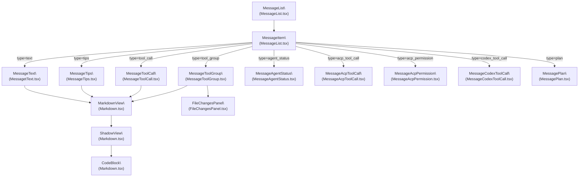
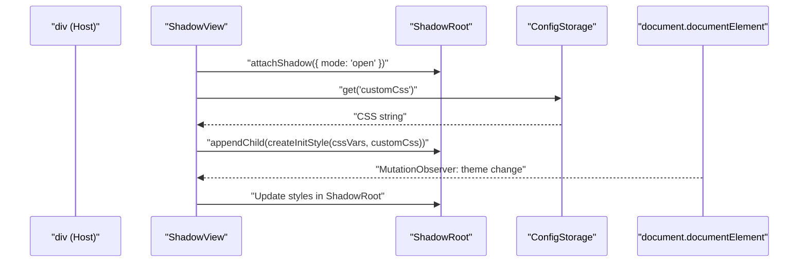
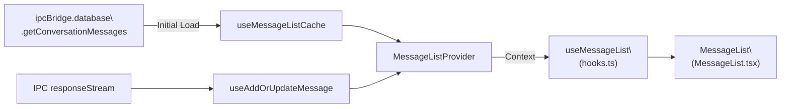

# Message Rendering System

Relevant source files

The following files were used as context for generating this wiki page:

- [src/renderer/pages/conversation/Messages/MessageList.tsx](src/renderer/pages/conversation/Messages/MessageList.tsx)
- [src/renderer/pages/conversation/Messages/useAutoScroll.ts](src/renderer/pages/conversation/Messages/useAutoScroll.ts)
- [src/renderer/services/i18n/locales/en-US/common.json](src/renderer/services/i18n/locales/en-US/common.json)
- [src/renderer/services/i18n/locales/ja-JP/common.json](src/renderer/services/i18n/locales/ja-JP/common.json)
- [src/renderer/services/i18n/locales/ko-KR/common.json](src/renderer/services/i18n/locales/ko-KR/common.json)
- [src/renderer/services/i18n/locales/tr-TR/common.json](src/renderer/services/i18n/locales/tr-TR/common.json)
- [src/renderer/services/i18n/locales/zh-CN/common.json](src/renderer/services/i18n/locales/zh-CN/common.json)
- [src/renderer/services/i18n/locales/zh-TW/common.json](src/renderer/services/i18n/locales/zh-TW/common.json)
- [tests/unit/latexDelimiters.test.ts](tests/unit/latexDelimiters.test.ts)
- [tests/unit/renderer/useAutoScroll.dom.test.tsx](tests/unit/renderer/useAutoScroll.dom.test.tsx)

This page documents how AionUi renders conversation messages in the UI: the virtualized `MessageList`, the `MessageItem` type dispatcher, the `MarkdownView` component with Shadow DOM isolation, `CodeBlock` syntax highlighting, and specialized renderers for tool calls, diffs, and agent statuses.

---

## Architecture Overview

The message rendering pipeline has three distinct layers:

1.  **List layer** – `MessageList` virtualizes the entire conversation using `react-virtuoso`.
2.  **Dispatch layer** – `MessageItem` reads the `type` field on each `TMessage` and renders the correct specialized component.
3.  **Content layer** – Specialized renderers (`MessageText`, `MessageTips`, `MessageToolCall`, `MessageToolGroup`, etc.) use shared primitives like `MarkdownView` and `FileChangesPanel` to display content.

**Diagram: Component Hierarchy**

Sources: [src/renderer/pages/conversation/Messages/MessageList.tsx:92-154](), [src/renderer/pages/conversation/Messages/components/MessagetText.tsx:1-50](), [src/renderer/pages/conversation/Messages/components/MessageToolCall.tsx:1-40](), [src/renderer/pages/conversation/Messages/components/MessageToolGroup.tsx:1-100]()

---

## MessageList and Virtualization

`MessageList` ([src/renderer/pages/conversation/Messages/MessageList.tsx:156-250]()) wraps the conversation in a `Virtuoso` component for performance with long histories.

-   **Virtualization**: Only visible messages are rendered in the DOM. The `data` prop receives `processedList`, and `itemContent` renders each item via `renderItem`.
-   **Initial scroll**: `initialTopMostItemIndex` is set to the last item index to start the view at the bottom.
-   **Auto-scroll**: Managed by the `useAutoScroll` hook ([src/renderer/pages/conversation/Messages/useAutoScroll.ts:51-220]()). It handles `followOutput` behavior and shows a "scroll to bottom" button when the user scrolls up during streaming. It includes a `ResizeObserver` to handle layout shifts (e.g., when a "Thought" panel expands) without misdetecting them as user scrolls.
-   **Image Preview**: Messages are wrapped in `<Image.PreviewGroup>` from Arco Design, allowing cross-message image navigation.

### Message Pre-processing

Before rendering, `MessageList` performs a pre-processing pass to collapse specific sequences into summary views or virtual items:

| Input message sequence | Output rendered element |
| :--- | :--- |
| `codex_tool_call` with `subtype='turn_diff'` | `MessageFileChanges` (virtual item) |
| `tool_group` with a `WriteFile` diff | `MessageFileChanges` |
| Consecutive `tool_group` or `acp_tool_call` | `MessageToolGroupSummary` (virtual item) |
| Standard types | `MessageItem` |

This logic resides in a `useMemo` block inside `MessageList` ([src/renderer/pages/conversation/Messages/MessageList.tsx:168-230]()).

Sources: [src/renderer/pages/conversation/Messages/MessageList.tsx:156-250](), [src/renderer/pages/conversation/Messages/useAutoScroll.ts:51-220]()

---

## MessageItem: Type Dispatch

`MessageItem` is a memoized component defined within `MessageList.tsx` ([src/renderer/pages/conversation/Messages/MessageList.tsx:92-154]()). It acts as a router, selecting a renderer based on the `message.type`.

| `message.type` | Component |
| :--- | :--- |
| `text` | `MessageText` |
| `tips` | `MessageTips` |
| `tool_call` | `MessageToolCall` |
| `tool_group` | `MessageToolGroup` |
| `agent_status` | `MessageAgentStatus` |
| `acp_permission` | `MessageAcpPermission` |
| `acp_tool_call` | `MessageAcpToolCall` |
| `codex_tool_call` | `MessageCodexToolCall` |
| `plan` | `MessagePlan` |
| `thinking` | `MessageThinking` |

The component uses `message.position` (`left`, `right`, `center`) to apply alignment styles and `message.type` for specific CSS targeting ([src/renderer/pages/conversation/Messages/MessageList.tsx:98-106]()).

Sources: [src/renderer/pages/conversation/Messages/MessageList.tsx:92-154]()

---

## MarkdownView and Shadow DOM Isolation

`MarkdownView` provides the primary text rendering capability. It utilizes `ShadowView` to isolate AI-generated content styles.

### ShadowView Implementation

`ShadowView` attaches an open Shadow Root to a host `div`. It uses `ReactDOM.createPortal` to render its children into this isolated root.

-   **Style Injection**: On mount, it injects a `<style>` tag containing base typography, CSS variable forwarding from the main document, and custom user CSS from `ConfigStorage`.
-   **Theme Reactivity**: A `MutationObserver` watches `document.documentElement` for `data-theme` changes, triggering a style regeneration to switch between light and dark modes.
-   **KaTeX Integration**: KaTeX styles are shared across all instances. Before rendering, LaTeX delimiters like `\[...\]` and `\(...\)` are converted to standard `$$...$$` and `$...$` using `convertLatexDelimiters` ([src/renderer/utils/chat/latexDelimiters.ts:8-89]()) while preserving code blocks.

**Diagram: Style Isolation Flow**

Sources: [src/renderer/utils/chat/latexDelimiters.ts:8-89](), [tests/unit/latexDelimiters.test.ts:10-89]()

### ReactMarkdown Plugins

The renderer uses several plugins to support advanced formatting:
- `remarkGfm`: Tables, task lists, strikethrough.
- `remarkMath` & `rehypeKatex`: Math formula rendering.
- `remarkBreaks`: Single newline support.

---

## CodeBlock: Syntax Highlighting

`CodeBlock` handles code snippets within markdown.

-   **Folding**: Blocks can be collapsed. A header displays the language and a toggle button.
-   **Copying**: The copy button provides quick clipboard access.
-   **Syntax Highlighting**: Uses `react-syntax-highlighter`. It dynamically switches themes based on the system theme.
-   **Diff Support**: When `language === 'diff'`, it applies background colors based on line prefixes (`+`, `-`).

---

## File Changes and Diff Rendering

For visualizing file modifications (e.g., from `WriteFile` or `replace` tools), the system uses specialized panels.

### MessageFileChanges

`MessageFileChanges` ([src/renderer/pages/conversation/Messages/codex/MessageFileChanges.tsx:1-100]()) parses diff strings using `parseDiff` and displays them in a structured list. It is used primarily by the Codex agent to show cumulative changes across a turn.

### Diff Rendering

The system renders standard unified diffs using the `diff2html` library, supporting side-by-side views and syntax highlighting within the diff itself.

Sources: [src/renderer/pages/conversation/Messages/codex/MessageFileChanges.tsx:25-80]()

---

## Message State and Data Flow

Message state is managed via a provider pattern and synchronized with the database.

**Diagram: Message Data Pipeline**

### `useAutoScroll` Implementation

The `useAutoScroll` hook ([src/renderer/pages/conversation/Messages/useAutoScroll.ts:51-220]()) is critical for streaming performance. It differentiates between programmatic scrolls (AI output) and user scrolls.

- **Programmatic Guard**: Uses `lastProgrammaticScrollTimeRef` to ignore scroll events for 150ms after the system moves the scroll position ([src/renderer/pages/conversation/Messages/useAutoScroll.ts:23]()).
- **Streaming Detection**: During streaming, content grows but the item count might stay the same. The hook detects these updates and maintains the bottom position if the user hasn't manually scrolled up ([tests/unit/renderer/useAutoScroll.dom.test.tsx:94-110]()).

Sources: [src/renderer/pages/conversation/Messages/useAutoScroll.ts:1-220](), [tests/unit/renderer/useAutoScroll.dom.test.tsx:1-181]()