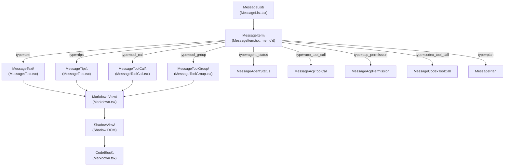
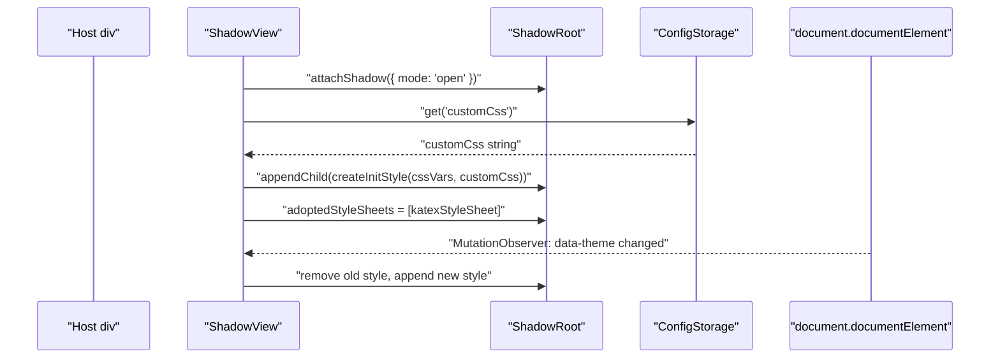
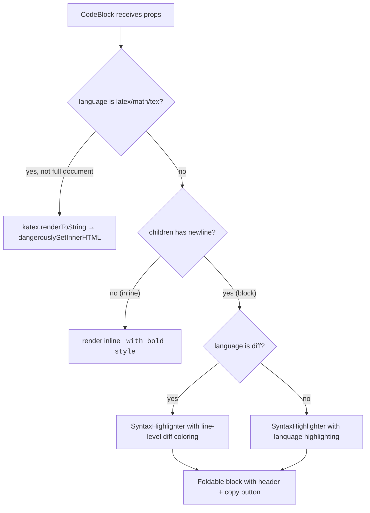
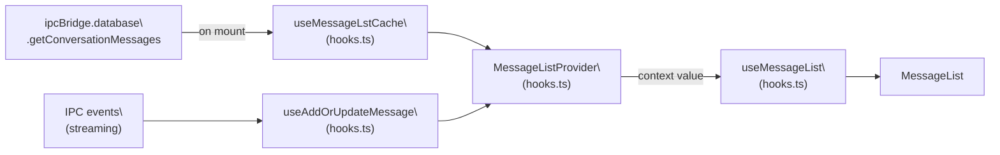

# Message Rendering System

<details>
<summary>Relevant source files</summary>

The following files were used as context for generating this wiki page:

- [src/renderer/components/Diff2Html.tsx](src/renderer/components/Diff2Html.tsx)
- [src/renderer/components/Markdown.tsx](src/renderer/components/Markdown.tsx)
- [src/renderer/hooks/usePreviewLauncher.ts](src/renderer/hooks/usePreviewLauncher.ts)
- [src/renderer/messages/MessageList.tsx](src/renderer/messages/MessageList.tsx)
- [src/renderer/messages/MessageTips.tsx](src/renderer/messages/MessageTips.tsx)
- [src/renderer/messages/MessageToolCall.tsx](src/renderer/messages/MessageToolCall.tsx)
- [src/renderer/messages/MessageToolGroup.tsx](src/renderer/messages/MessageToolGroup.tsx)
- [src/renderer/messages/MessagetText.tsx](src/renderer/messages/MessagetText.tsx)
- [src/renderer/pages/conversation/gemini/GeminiChat.tsx](src/renderer/pages/conversation/gemini/GeminiChat.tsx)

</details>

This page documents how AionUi renders conversation messages in the UI: the virtualized `MessageList`, the `MessageItem` type dispatcher, the `MarkdownView` component with Shadow DOM isolation, `CodeBlock` syntax highlighting, and the specialized renderers for tool calls, tips, and agent statuses. For information about how raw AI stream events are transformed into `TMessage` objects before reaching the UI, see page [7.2](). For the input box that sends new messages, see page [5.5]().

---

## Architecture Overview

The message rendering pipeline has three distinct layers:

1. **List layer** – `MessageList` virtualizes the entire conversation using `react-virtuoso`.
2. **Dispatch layer** – `MessageItem` reads the `type` field on each `TMessage` and renders the correct specialized component.
3. **Content layer** – Each specialized renderer (`MessageText`, `MessageTips`, `MessageToolCall`, `MessageToolGroup`, etc.) uses shared primitives like `MarkdownView` and `CollapsibleContent` to display content.

**Diagram: Component Hierarchy**



Sources: [src/renderer/messages/MessageList.tsx:47-92](), [src/renderer/messages/MessagetText.tsx:53-149](), [src/renderer/messages/MessageTips.tsx:35-67](), [src/renderer/messages/MessageToolCall.tsx:32-51](), [src/renderer/messages/MessageToolGroup.tsx:395-498](), [src/renderer/components/Markdown.tsx:533-631]()

---

## MessageList and Virtualization

`MessageList` ([src/renderer/messages/MessageList.tsx:94-213]()) wraps the entire conversation in a `Virtuoso` from `react-virtuoso`. Key behaviors:

- **Virtualization**: Only DOM nodes for visible messages are rendered. The `data` prop receives `processedList`, and `itemContent` renders each item via `renderItem`.
- **Initial scroll position**: `initialTopMostItemIndex` is set to the last item index so the list starts at the bottom.
- **Auto-scroll**: The `useAutoScroll` hook manages whether the list follows new output or shows a "scroll to bottom" button. `followOutput` and `atBottomStateChange` props wire into this hook.
- **Image preview group**: All messages are wrapped in `<Image.PreviewGroup>` from Arco Design so images across multiple messages can be previewed together. An `ImagePreviewContext` propagates the group state so nested components know not to create their own group.

### Message Pre-processing

Before rendering, `MessageList` collapses certain message sequences into summary views:

| Input message sequence                                      | Output rendered element                                     |
| ----------------------------------------------------------- | ----------------------------------------------------------- |
| `codex_tool_call` with `subtype='turn_diff'`                | `MessageFileChanges` (via `file_summary` virtual item)      |
| `tool_group` whose single item is a `WriteFile` with a diff | `MessageFileChanges`                                        |
| Consecutive `tool_group` or `acp_tool_call` messages        | `MessageToolGroupSummary` (via `tool_summary` virtual item) |
| Any other type                                              | Rendered directly as `MessageItem`                          |

This pre-processing runs inside a `useMemo` over `list` ([src/renderer/messages/MessageList.tsx:99-147]()).

Sources: [src/renderer/messages/MessageList.tsx:94-213]()

---

## MessageItem: Type Dispatch

`MessageItem` is a memoized component defined inside `MessageList.tsx` ([src/renderer/messages/MessageList.tsx:47-92]()). It uses `React.memo` via the `HOC` utility. The memo comparison function only re-renders when `message.id`, `message.content`, `message.position`, or `message.type` change.

The inner render function uses a `switch` statement on `message.type`:

| `message.type`       | Rendered component                            |
| -------------------- | --------------------------------------------- |
| `text`               | `MessageText`                                 |
| `tips`               | `MessageTips`                                 |
| `tool_call`          | `MessageToolCall`                             |
| `tool_group`         | `MessageToolGroup`                            |
| `agent_status`       | `MessageAgentStatus`                          |
| `acp_permission`     | `MessageAcpPermission`                        |
| `acp_tool_call`      | `MessageAcpToolCall`                          |
| `codex_permission`   | `null` (handled by `ConversationChatConfirm`) |
| `codex_tool_call`    | `MessageCodexToolCall`                        |
| `plan`               | `MessagePlan`                                 |
| `available_commands` | `null`                                        |

The outer `MessageItem` div uses `message.position` (`left`, `right`, `center`) to set flex alignment, and `message.type` as a class name for targeted CSS.

Sources: [src/renderer/messages/MessageList.tsx:47-92]()

---

## MarkdownView and Shadow DOM Isolation

`MarkdownView` ([src/renderer/components/Markdown.tsx:533-631]()) renders markdown string content. It wraps the output in a `ShadowView` to isolate styles from the main document.

### ShadowView

`ShadowView` ([src/renderer/components/Markdown.tsx:409-521]()) attaches a Shadow Root to a host `div` and uses `ReactDOM.createPortal` to render children into it. On first mount, it calls `createInitStyle` to inject a `<style>` element with:

- CSS variable forwarding (e.g. `--bg-1`, `--text-primary`) from the main document into `:host`
- Base markdown typography rules
- Table, code, link, KaTeX, and diff styles
- User-defined custom CSS (loaded from `ConfigStorage.get('customCss')` and processed by `addImportantToAll`)

A `MutationObserver` on `document.documentElement` watches the `data-theme` attribute and regenerates the style element when the theme changes, ensuring dark mode is applied inside the Shadow DOM.

KaTeX styles are injected via `adoptedStyleSheets` using a shared `CSSStyleSheet` instance cached in the module-level `katexStyleSheet` variable ([src/renderer/components/Markdown.tsx:364-407]()).

**Diagram: ShadowView style injection flow**



Sources: [src/renderer/components/Markdown.tsx:409-521](), [src/renderer/components/Markdown.tsx:243-361]()

### ReactMarkdown Configuration

`MarkdownView` passes the following plugins to `ReactMarkdown`:

| Plugin         | Purpose                                                      |
| -------------- | ------------------------------------------------------------ |
| `remarkGfm`    | GitHub Flavored Markdown (tables, strikethrough, task lists) |
| `remarkMath`   | Parse `$...$` and `$$...$$` math syntax                      |
| `remarkBreaks` | Treat single newlines as `<br>`                              |
| `rehypeKatex`  | Render math as KaTeX HTML                                    |
| `rehypeRaw`    | Allow raw HTML (only when `allowHtml` prop is `true`)        |

Custom component overrides:

- `code` → `CodeBlock` (with `codeStyle` and `hiddenCodeCopyButton` props forwarded)
- `a` → opens external links via `ipcBridge.shell.openExternal.invoke` instead of browser navigation
- `table` / `td` → adds horizontal scroll wrapper and uniform border styles
- `img` → delegates to `LocalImageView` for local file paths, native `` for URLs

The `normalizedChildren` memo strips `file://` prefixes and runs `convertLatexDelimiters` to normalize LaTeX delimiter variants before passing content to `ReactMarkdown` ([src/renderer/components/Markdown.tsx:536-543]()).

Sources: [src/renderer/components/Markdown.tsx:533-631]()

---

## CodeBlock: Syntax Highlighting

`CodeBlock` ([src/renderer/components/Markdown.tsx:71-241]()) is the custom `code` renderer used inside `MarkdownView`.

### Rendering logic



Key behaviors:

- **Collapsible**: Code blocks are **collapsed by default**. The header bar shows the language label and a fold/unfold button. An `Up` icon at the bottom of the expanded block collapses it again.
- **Copy button**: Clicking the `Copy` icon writes `formatCode(children)` to the clipboard (tries JSON pretty-print first, falls back to raw string).
- **Theme-aware**: A `MutationObserver` on `data-theme` switches between the `vs` (light) and `vs2015` (dark) highlight.js styles from `react-syntax-highlighter`.
- **Diff highlighting**: When `language === 'diff'`, `wrapLines` is enabled and each line gets a background color via `getDiffLineStyle` based on whether it starts with `+`, `-`, or `@@` ([src/renderer/components/Markdown.tsx:58-69]()).
- **JSON auto-format**: `formatCode` attempts `JSON.parse` / `JSON.stringify` with 2-space indent before handing off to the highlighter.

Sources: [src/renderer/components/Markdown.tsx:71-241]()

---

## MessageText

`MessageText` ([src/renderer/messages/MessagetText.tsx:53-149]()) renders `IMessageText` messages (plain text / AI responses).

**Preprocessing pipeline:**

1. **Think-tag filtering**: `hasThinkTags` / `stripThinkTags` remove `` blocks before rendering.
2. **File marker extraction**: `parseFileMarker` splits content at `AIONUI_FILES_MARKER` into a text body and a list of file paths. File paths are rendered as `FilePreview` chips above the text bubble.
3. **JSON detection**: `useFormatContent` tries to `JSON.parse` the text. If it succeeds, the content is rendered as a collapsible ` ```json ` code block via `MarkdownView` inside `CollapsibleContent`.

**Layout rules:**

- User messages (`position === 'right'`): bubble with `bg-aou-2` background, right-aligned, `borderRadius: '8px 0 8px 8px'`.
- Agent messages (`position === 'left'`): full-width, no background.
- A copy button (hidden until hover) appears below the message.
- `cronMeta` presence triggers a `MessageCronBadge` above the bubble.

Sources: [src/renderer/messages/MessagetText.tsx:1-149]()

---

## MessageTips

`MessageTips` ([src/renderer/messages/MessageTips.tsx:35-67]()) renders `IMessageTips` messages, which carry a `type` (`success`, `warning`, or `error`) and a `content` string.

- JSON content is rendered as a ` ```json ` block inside `MarkdownView`.
- Plain text uses `dangerouslySetInnerHTML` inside a `CollapsibleContent` with `maxHeight={48}` and a gradient mask — long tip messages collapse by default.
- Icon variants: `CheckOne` for success, `Attention` for warning/error, themed with `FunctionalColor` values.

Sources: [src/renderer/messages/MessageTips.tsx:1-67]()

---

## MessageToolCall

`MessageToolCall` ([src/renderer/messages/MessageToolCall.tsx:32-51]()) renders `IMessageToolCall` messages (individual tool calls, primarily from the Gemini agent).

| Tool name                                   | Display                                                                                                       |
| ------------------------------------------- | ------------------------------------------------------------------------------------------------------------- |
| `list_directory`, `read_file`, `write_file` | Arco `Alert` with operation name + path                                                                       |
| `google_web_search`                         | Arco `Alert` with search icon and query                                                                       |
| `run_shell_command`                         | `MarkdownView` rendering a ` ```shell ` block                                                                 |
| `replace`                                   | `ReplacePreview` – computes a unified diff using `createTwoFilesPatch` and renders it as a `FileChangesPanel` |
| (any other)                                 | Plain `<div>` with the tool name                                                                              |

Sources: [src/renderer/messages/MessageToolCall.tsx:1-51]()

---

## MessageToolGroup

`MessageToolGroup` ([src/renderer/messages/MessageToolGroup.tsx:395-498]()) renders `IMessageToolGroup` messages (Gemini agent's batched tool calls). Each item in `message.content` is rendered as a separate entry.

### Item rendering rules

| Condition                                   | Display                                                                                        |
| ------------------------------------------- | ---------------------------------------------------------------------------------------------- |
| `confirmationDetails` present               | `ConfirmationDetails` component (radio buttons to approve/deny)                                |
| `name === 'WriteFile'` with `fileDiff`      | `MessageFileChanges` (deduplicated: only the first WriteFile renders the summary)              |
| `name === 'ImageGeneration'` with `img_url` | `ImageDisplay` component                                                                       |
| Status `Confirming`                         | Radio group with `ProceedOnce`, `ProceedAlways`, `Cancel` options                              |
| All other cases                             | Arco `Alert` with status type, tool name tag, description, and collapsible `ToolResultDisplay` |

### ConfirmationDetails

For tool calls in `Confirming` state, `ConfirmationDetails` renders confirmation UI depending on the `confirmationDetails.type`:

| `type` | Displayed content                                        |
| ------ | -------------------------------------------------------- |
| `edit` | `EditConfirmationDiff` (diff panel with file changes)    |
| `exec` | ` ```bash ` code block via `MarkdownView`                |
| `info` | Plain text prompt                                        |
| `mcp`  | Tool display name + server-scoped "always allow" options |

On confirmation, `ipcBridge.geminiConversation.confirmMessage.invoke` is called with the chosen `ToolConfirmationOutcome`.

### ImageDisplay

`ImageDisplay` ([src/renderer/messages/MessageToolGroup.tsx:194-364]()) handles image results from `ImageGeneration`:

- Local paths are loaded as base64 via `ipcBridge.fs.getImageBase64.invoke`.
- Renders an Arco `Image` inside the `ImagePreviewContext` group.
- Provides copy (via Clipboard API with canvas fallback) and download buttons.

Sources: [src/renderer/messages/MessageToolGroup.tsx:1-500]()

---

## Message State Hooks

**Diagram: Data flow through message hooks**



Sources: [src/renderer/messages/hooks.ts:1-309]()

### `MessageListProvider` and `useMessageList`

`MessageListProvider` and `useMessageList` are created by `createContext` ([src/renderer/messages/hooks.ts:13]()). The provider holds the `TMessage[]` array as its state. Each conversation page wraps its content in this provider (e.g., `GeminiChat` uses `HOC.Wrapper(MessageListProvider, ...)`).

### `useMessageLstCache`

Called on mount with a `conversation_id`. Invokes `ipcBridge.database.getConversationMessages` to load persisted messages from SQLite. It then merges with any in-flight streaming messages already in the list using a deduplication strategy based on both `id` and `msg_id` ([src/renderer/messages/hooks.ts:264-301]()).

### `useAddOrUpdateMessage`

Batches incoming `TMessage` updates with a `setTimeout`-based flush loop ([src/renderer/messages/hooks.ts:195-262]()):

- Updates are queued in `pendingRef.current`.
- The flush processes the entire batch in one `update` call, using an O(1) indexed lookup strategy (`getOrBuildIndex`) keyed on `msg_id`, `callId`, and `toolCallId`.
- `tool_group` messages fall back to `composeMessage` from `chatLib` because they need inner-array merging logic.

| Message type      | Merge key                   | Strategy                         |
| ----------------- | --------------------------- | -------------------------------- |
| `text`            | `msg_id`                    | Append `.content.content` string |
| `tool_call`       | `content.callId`            | Shallow object merge             |
| `codex_tool_call` | `content.toolCallId`        | Shallow object merge             |
| `acp_tool_call`   | `content.update.toolCallId` | Shallow object merge             |
| `tool_group`      | (inner callIds)             | `composeMessage` from chatLib    |
| Others            | `msg_id` (last item)        | Replace last item                |

Sources: [src/renderer/messages/hooks.ts:195-262](), [src/renderer/messages/hooks.ts:33-64]()

---

## Auto-Scroll Behavior

The `useAutoScroll` hook (imported in `MessageList`) is wired to `Virtuoso` via:

- `followOutput` – callback that returns `'smooth'` when following, `false` otherwise.
- `onScroll` / `atBottomStateChange` – track whether the user has scrolled away from the bottom.
- `showScrollButton` – when `true`, a floating round button with a `Down` arrow appears above the message list, centered horizontally. Clicking it calls `scrollToBottom('smooth')`.

Sources: [src/renderer/messages/MessageList.tsx:150-210]()

---

## Diff Rendering

For file change visualization, two components are available:

| Component                                                     | Used by                                          | Approach                                                                             |
| ------------------------------------------------------------- | ------------------------------------------------ | ------------------------------------------------------------------------------------ |
| `MessageFileChanges`                                          | `MessageList` pre-processing, `MessageToolGroup` | Parses unified diffs via `parseDiff`, renders `FileChangesPanel`                     |
| `Diff2Html` ([src/renderer/components/Diff2Html.tsx:1-175]()) | Preview panel, `FileChangesPanel`                | Converts diff to HTML via `diff2html` library, with side-by-side toggle and collapse |

`Diff2Html` uses `ReactDOM.createPortal` to inject a React-managed button bar (`side-by-side` checkbox, preview button, collapse toggle) into the `div.d2h-file-header` element generated by the `diff2html` library's HTML output.

Sources: [src/renderer/components/Diff2Html.tsx:1-175]()
