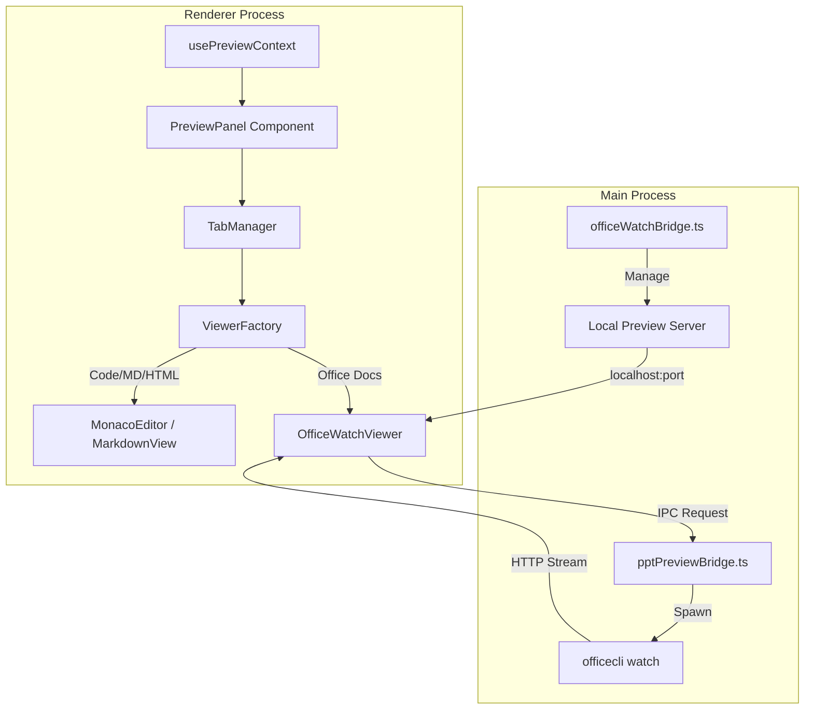

# Preview Panel

<details>
<summary>Relevant source files</summary>

The following files were used as context for generating this wiki page:

- [scripts/postinstall.js](scripts/postinstall.js)
- [src/common/types/conversion.ts](src/common/types/conversion.ts)
- [src/common/types/preview.ts](src/common/types/preview.ts)
- [src/process/bridge/pptPreviewBridge.ts](src/process/bridge/pptPreviewBridge.ts)
- [src/process/webserver/routes/apiRoutes.ts](src/process/webserver/routes/apiRoutes.ts)
- [src/renderer/components/base/FileChangesPanel.tsx](src/renderer/components/base/FileChangesPanel.tsx)
- [src/renderer/hooks/chat/useAutoTitle.ts](src/renderer/hooks/chat/useAutoTitle.ts)
- [src/renderer/pages/conversation/Preview/components/viewers/PptViewer.tsx](src/renderer/pages/conversation/Preview/components/viewers/PptViewer.tsx)
- [src/renderer/pages/conversation/index.tsx](src/renderer/pages/conversation/index.tsx)
- [src/renderer/pages/conversation/platforms/acp/useAcpInitialMessage.ts](src/renderer/pages/conversation/platforms/acp/useAcpInitialMessage.ts)
- [src/renderer/pages/conversation/platforms/gemini/useGeminiInitialMessage.ts](src/renderer/pages/conversation/platforms/gemini/useGeminiInitialMessage.ts)
- [src/renderer/services/i18n/locales/en-US/preview.json](src/renderer/services/i18n/locales/en-US/preview.json)
- [src/renderer/services/i18n/locales/ja-JP/preview.json](src/renderer/services/i18n/locales/ja-JP/preview.json)
- [src/renderer/services/i18n/locales/ko-KR/preview.json](src/renderer/services/i18n/locales/ko-KR/preview.json)
- [src/renderer/services/i18n/locales/tr-TR/preview.json](src/renderer/services/i18n/locales/tr-TR/preview.json)
- [src/renderer/services/i18n/locales/zh-CN/preview.json](src/renderer/services/i18n/locales/zh-CN/preview.json)
- [src/renderer/services/i18n/locales/zh-TW/preview.json](src/renderer/services/i18n/locales/zh-TW/preview.json)
- [src/renderer/utils/chat/autoTitle.ts](src/renderer/utils/chat/autoTitle.ts)
- [tests/unit/PptViewer.dom.test.tsx](tests/unit/PptViewer.dom.test.tsx)
- [tests/unit/pptPreviewBridge.test.ts](tests/unit/pptPreviewBridge.test.ts)
- [tests/unit/pptPreviewInstallGuard.test.ts](tests/unit/pptPreviewInstallGuard.test.ts)

</details>


The Preview Panel is a sophisticated multi-format document and code visualization system integrated into the AionUi conversation interface. It supports real-time tracking, live editing, and Git-based version history for over 10 file formats, providing a seamless transition between AI-generated content and actionable workspace files.

## System Architecture

The Preview Panel operates across the Main and Renderer processes, utilizing a specialized bridge for heavy document processing and a React-based tab management system in the UI.

### Data Flow & Component Interaction

When a user or an agent initiates a preview (e.g., clicking a file in the workspace or an agent generating a code artifact), the `usePreviewLauncher` hook coordinates the state. If the file is a complex format like PPTX or XLSX, the system triggers a background process via the `pptPreviewBridge`.

Title: Preview Panel Data Flow

Sources: [src/process/bridge/pptPreviewBridge.ts:10-13](), [src/renderer/pages/conversation/index.tsx:21-32](), [src/renderer/pages/conversation/Preview/components/viewers/PptViewer.tsx:15-17]()

## Core Features

### 1. Multi-Format Support
The system employs a `ViewerFactory` pattern to render content based on file extensions or MIME types.

| Format Group | Supported Extensions | Rendering Technology |
| :--- | :--- | :--- |
| **Office** | `.docx`, `.xlsx`, `.pptx` | `officecli` + Webview / `OfficeWatchViewer` |
| **Documents** | `.pdf` | `PdfViewer` |
| **Code** | 50+ languages | Monaco Editor |
| **Web/UI** | `.html`, `.svg` | Shadow DOM Sandbox + Element Inspector |
| **Data/Math** | `.md`, `.tex`, Mermaid | `MarkdownView` + KaTeX + Mermaid.js |
| **Version Control** | `.diff` | Specialized Diff Renderer |

Sources: [src/renderer/services/i18n/locales/en-US/preview.json:1-124](), [src/renderer/pages/conversation/Preview/components/viewers/PptViewer.tsx:1-18]()

### 2. Office Document Live Preview (`officecli`)
For Office files, AionUi utilizes an external utility called `officecli`. The `pptPreviewBridge` manages the lifecycle of these preview processes.

- **Auto-Installation**: If `officecli` is missing, the bridge automatically attempts to install it via platform-specific scripts (PowerShell for Windows, cURL/Bash for Unix) [src/process/bridge/pptPreviewBridge.ts:132-155]().
- **Process Management**: Each file preview spawns a `watch` process on a unique free TCP port [src/process/bridge/pptPreviewBridge.ts:187-194]().
- **Port Tracking**: The system verifies the port is active before resolving the URL to the renderer [src/process/bridge/pptPreviewBridge.ts:58-79]().

### 3. Git-Based Version History
The panel tracks file changes within the workspace. When an agent modifies a file multiple times, the `FileChangesPanel` allows users to:
- View historical snapshots of the file [src/renderer/services/i18n/locales/en-US/preview.json:2-10]().
- Compare versions using a diff view.
- Restore previous versions or save current state as a new snapshot [src/renderer/services/i18n/locales/en-US/preview.json:12-13]().

## Implementation Details

### Bridge Logic: `pptPreviewBridge.ts`
This module is responsible for the heavy lifting of Office document conversion and live watching.

- **`startWatch(filePath)`**: Resolves the real path of the file, finds a free port, and spawns `officecli watch`. It implements a 15-second timeout for process settling [src/process/bridge/pptPreviewBridge.ts:162-208]().
- **`killSession(filePath)`**: Safely terminates the child process associated with a specific file [src/process/bridge/pptPreviewBridge.ts:84-91]().
- **`checkForUpdate()`**: A background task that checks for `officecli` updates once every 24 hours to ensure compatibility with the latest Office formats [src/process/bridge/pptPreviewBridge.ts:96-127]().

### UI Integration: `ChatConversationIndex`
The preview panel is context-aware and tied to the conversation lifecycle.

- **Automatic Cleanup**: When switching between conversations, the `closePreview()` function is called to prevent content leakage from previous sessions [src/renderer/pages/conversation/index.tsx:21-32]().
- **Tab Persistence**: Multi-tab viewing is managed via `ConversationTabsContext`, allowing users to keep multiple files open while chatting [src/renderer/pages/conversation/index.tsx:60-64]().

Title: Code Entity Relationship - Preview System
```mermaid
classDiagram
    class pptPreviewBridge {
        +startWatch(filePath)
        +killSession(filePath)
        +installOfficecli()
        -findFreePort()
    }
    class OfficeWatchViewer {
        +docType: string
        +filePath: string
        +render()
    }
    class PptViewer {
        +props: PptViewerProps
    }
    class usePreviewContext {
        +activeTabId
        +closePreview()
        +openPreview(file)
    }

    PptViewer --|> OfficeWatchViewer : "Inherits/Wraps"
    OfficeWatchViewer ..> pptPreviewBridge : "IPC: pptPreview.start"
    ChatConversationIndex ..> usePreviewContext : "Consumes"
```
Sources: [src/process/bridge/pptPreviewBridge.ts:162](), [src/renderer/pages/conversation/Preview/components/viewers/PptViewer.tsx:15](), [src/renderer/pages/conversation/index.tsx:15]()

## Error Handling & Reliability

The system includes several guards to ensure a smooth user experience:
- **Large File Truncation**: To maintain UI responsiveness, large text files are truncated, and a hint is shown to the user [src/renderer/services/i18n/locales/en-US/preview.json:59]().
- **Installation Guard**: If `officecli` installation fails once, the system flags `installFailed = true` to prevent repeated intrusive installation attempts in the same session [src/process/bridge/pptPreviewBridge.ts:34-35]().
- **Strict Mode Support**: Uses `pendingKills` timers to allow React's Strict Mode (which remounts components) to reuse existing watch sessions instead of killing and restarting them instantly [src/process/bridge/pptPreviewBridge.ts:31-32]().

Sources: [src/process/bridge/pptPreviewBridge.ts:31-35](), [src/renderer/services/i18n/locales/en-US/preview.json:59-65]()