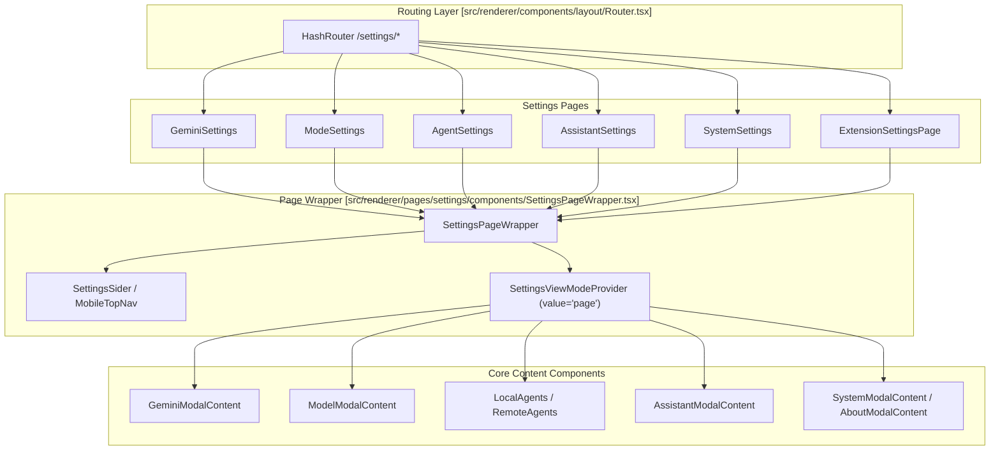
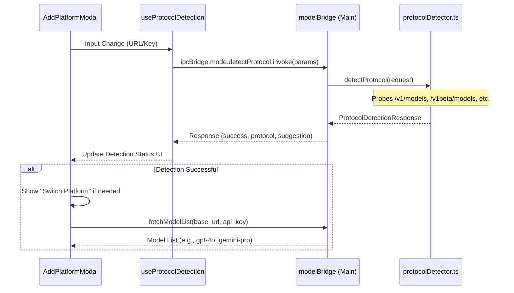

# Settings Interface

Relevant source files

The following files were used as context for generating this wiki page:

- [src/common/utils/protocolDetector.ts](src/common/utils/protocolDetector.ts)
- [src/process/bridge/modelBridge.ts](src/process/bridge/modelBridge.ts)
- [src/renderer/pages/settings/GeminiSettings.tsx](src/renderer/pages/settings/GeminiSettings.tsx)
- [src/renderer/pages/settings/ModeSettings.tsx](src/renderer/pages/settings/ModeSettings.tsx)
- [src/renderer/pages/settings/SystemSettings.tsx](src/renderer/pages/settings/SystemSettings.tsx)
- [src/renderer/pages/settings/components/AddModelModal.tsx](src/renderer/pages/settings/components/AddModelModal.tsx)
- [src/renderer/pages/settings/components/AddPlatformModal.tsx](src/renderer/pages/settings/components/AddPlatformModal.tsx)
- [src/renderer/pages/settings/components/EditModeModal.tsx](src/renderer/pages/settings/components/EditModeModal.tsx)
- [tests/unit/bridge/modelBridge.test.ts](tests/unit/bridge/modelBridge.test.ts)

The Settings Interface provides a comprehensive UI for configuring AionUi's AI model providers, agents, assistants, and system preferences. It uses a modular architecture where specialized settings components are hosted within a unified wrapper that handles layout, navigation, and extension integration.

---

## Architecture Overview

The Settings Interface follows a consistent architectural pattern where each settings domain is encapsulated in a dedicated page component wrapped by `SettingsPageWrapper`. This pattern provides uniform layout, styling, and responsive behavior across all settings categories.

### Component Hierarchy

**Sources:** [src/renderer/pages/settings/components/SettingsPageWrapper.tsx:77-187](), [src/renderer/pages/settings/GeminiSettings.tsx:11-17](), [src/renderer/pages/settings/ModeSettings.tsx:11-17](), [src/renderer/pages/settings/SystemSettings.tsx:13-24]()

### SettingsPageWrapper Pattern

The `SettingsPageWrapper` [src/renderer/pages/settings/components/SettingsPageWrapper.tsx:77-187]() acts as the primary layout engine for settings. It performs three critical functions:
1.  **Context Injection**: Provides `SettingsViewModeProvider` with a value of `'page'` [src/renderer/pages/settings/components/SettingsPageWrapper.tsx:159](), allowing shared components to adjust their scrolling behavior based on whether they are in a standalone page or a modal.
2.  **Responsive Navigation**: On desktop, navigation is handled by the sidebar; on mobile, it switches to a horizontal `settings-mobile-top-nav` [src/renderer/pages/settings/components/SettingsPageWrapper.tsx:161-181]().
3.  **Extension Integration**: Dynamically fetches and injects settings tabs provided by installed extensions using `ipcBridge.extensions.getSettingsTabs.invoke()` [src/renderer/pages/settings/components/SettingsPageWrapper.tsx:87-92]().

**Sources:** [src/renderer/pages/settings/components/SettingsPageWrapper.tsx:77-187]()

---

## Provider & Platform Management

AionUi supports a wide range of AI platforms through a unified provider management system. This is primarily handled in `ModeSettings` and its associated modals.

### AddPlatformModal & Protocol Auto-Detection

The `AddPlatformModal` [src/renderer/pages/settings/components/AddPlatformModal.tsx:74-176]() provides a guided flow for adding new AI providers. A key feature is the **Protocol Detection** system which automatically identifies the API type (OpenAI, Gemini, or Anthropic) based on the URL or API Key provided.

| Component/Function | Role |
| :--- | :--- |
| `ProtocolDetectionStatus` | Displays real-time detection progress and results [src/renderer/pages/settings/components/AddPlatformModal.tsx:74-176](). |
| `useProtocolDetection` | Hook used to trigger background probes of API endpoints [src/renderer/pages/settings/components/AddPlatformModal.tsx:12](). |
| `PROTOCOL_SIGNATURES` | Definitions of protocol characteristics, including `keyPattern` and `urlPatterns` [src/common/utils/protocolDetector.ts:159-250](). |
| `detectNewApiProtocol` | Utility to suggest a protocol based on model names (e.g., suggesting `gemini` for models starting with "gemini-") [src/renderer/utils/model/modelPlatforms.ts:18](). |

**Sources:** [src/renderer/pages/settings/components/AddPlatformModal.tsx:1-176](), [src/common/utils/protocolDetector.ts:159-250]()

### Model List Fetching

When configuring a provider, the system can fetch available models via `ipcBridge.mode.fetchModelList.provider` [src/process/bridge/modelBridge.ts:77-87]().

1.  **Standard OpenAI**: Calls `/v1/models` with the provided API Key [src/process/bridge/modelBridge.ts:240-250]().
2.  **Hardcoded Fallbacks**: Some platforms like **MiniMax** [src/process/bridge/modelBridge.ts:106-118]() or **DashScope Coding Plan** [src/process/bridge/modelBridge.ts:123-133]() do not provide a standard `/models` endpoint and use hardcoded lists.
3.  **AWS Bedrock**: Uses the `@aws-sdk/client-bedrock` to list inference profiles and maps them to friendly names via `BEDROCK_MODEL_NAMES` [src/process/bridge/modelBridge.ts:52-74]().

**Sources:** [src/process/bridge/modelBridge.ts:52-250](), [tests/unit/bridge/modelBridge.test.ts:105-120]()

---

## Specialized Configuration Pages

### GeminiSettings
Manages the built-in Gemini agent configuration. It uses `GeminiModalContent` [src/renderer/pages/settings/GeminiSettings.tsx:14]() to handle:
- **API Key Authentication**: Direct entry of Google AI Studio keys.
- **OAuth / Vertex AI**: Integration with Google Cloud Platform credentials.

### ModeSettings
Hosts `ModelModalContent` [src/renderer/pages/settings/ModeSettings.tsx:14]() for managing general LLM providers. It allows users to edit existing providers via `EditModeModal` [src/renderer/pages/settings/components/EditModeModal.tsx:106-140]() and add individual models via `AddModelModal` [src/renderer/pages/settings/components/AddModelModal.tsx:14-45]().

### SystemSettings
Toggles content based on the sub-route [src/renderer/pages/settings/SystemSettings.tsx:13-21]():
- `/settings/system`: Renders `SystemModalContent` for general preferences (language, theme, startup behavior).
- `/settings/about`: Renders `AboutModalContent` for version info and update checks.

**Sources:** [src/renderer/pages/settings/GeminiSettings.tsx:11-17](), [src/renderer/pages/settings/ModeSettings.tsx:11-17](), [src/renderer/pages/settings/SystemSettings.tsx:13-24](), [src/renderer/pages/settings/components/EditModeModal.tsx:106-140]()

---

## Data Flow: Protocol Detection to UI

The following diagram illustrates how the system transitions from a user-entered URL to a detected and configured platform.

**Sources:** [src/renderer/pages/settings/components/AddPlatformModal.tsx:74-176](), [src/process/bridge/modelBridge.ts:76-250](), [src/common/utils/protocolDetector.ts:98-126]()

### Code Entity Mapping

| Code Entity | Purpose |
| :--- | :--- |
| `IProvider` | The core interface for a model provider configuration [src/common/config/storage.ts](). |
| `PROTOCOL_ICONS` | UI configuration for protocol-specific colors and icons [src/renderer/pages/settings/components/AddPlatformModal.tsx:30-35](). |
| `API_PATH_PATTERNS` | List of common suffixes (like `/v1`, `/api/v1`) used to auto-fix base URLs [src/process/bridge/modelBridge.ts:37-46](). |
| `PROVIDER_CONFIGS` | Static list of known providers used for logo matching in `EditModeModal` [src/renderer/pages/settings/components/EditModeModal.tsx:38-63](). |

**Sources:** [src/renderer/pages/settings/components/AddPlatformModal.tsx:30-35](), [src/process/bridge/modelBridge.ts:37-46](), [src/renderer/pages/settings/components/EditModeModal.tsx:38-63]()