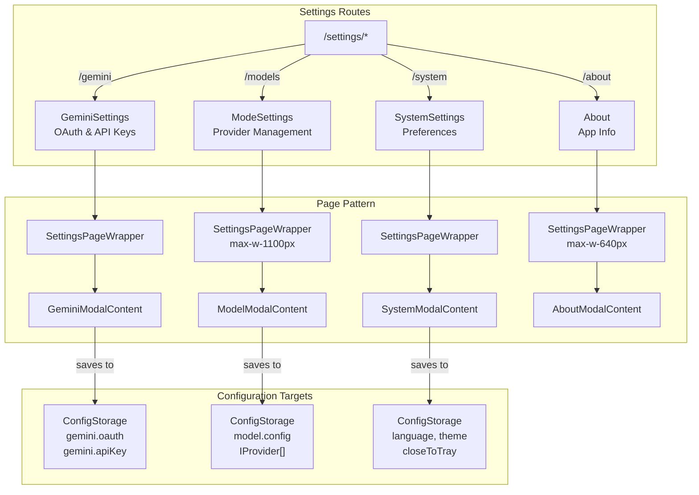
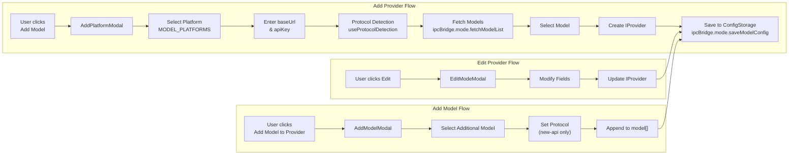
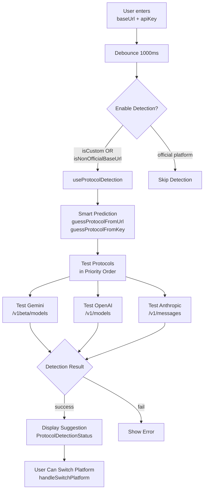
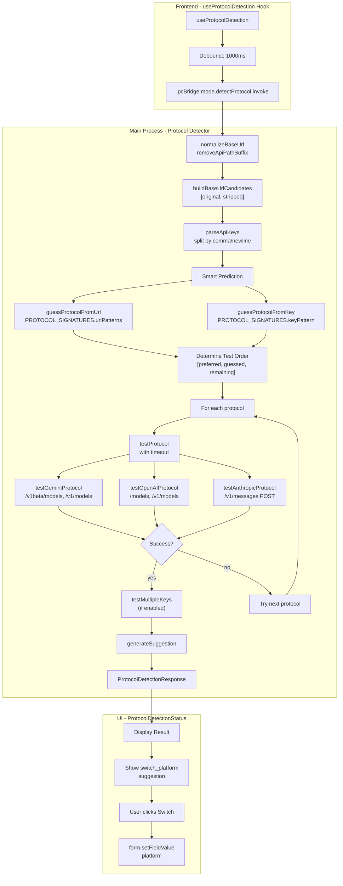
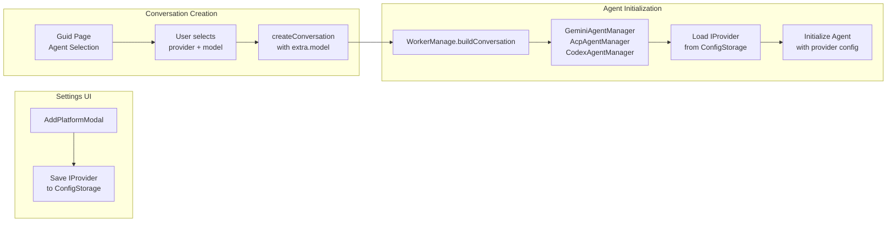

# Settings Interface

<details>
<summary>Relevant source files</summary>

The following files were used as context for generating this wiki page:

- [src/common/utils/protocolDetector.ts](src/common/utils/protocolDetector.ts)
- [src/process/WorkerManage.ts](src/process/WorkerManage.ts)
- [src/process/bridge/modelBridge.ts](src/process/bridge/modelBridge.ts)
- [src/process/initBridge.ts](src/process/initBridge.ts)
- [src/renderer/assets/logos/minimax.png](src/renderer/assets/logos/minimax.png)
- [src/renderer/config/modelPlatforms.ts](src/renderer/config/modelPlatforms.ts)
- [src/renderer/index.ts](src/renderer/index.ts)
- [src/renderer/pages/settings/About.tsx](src/renderer/pages/settings/About.tsx)
- [src/renderer/pages/settings/GeminiSettings.tsx](src/renderer/pages/settings/GeminiSettings.tsx)
- [src/renderer/pages/settings/ModeSettings.tsx](src/renderer/pages/settings/ModeSettings.tsx)
- [src/renderer/pages/settings/SystemSettings.tsx](src/renderer/pages/settings/SystemSettings.tsx)
- [src/renderer/pages/settings/components/AddModelModal.tsx](src/renderer/pages/settings/components/AddModelModal.tsx)
- [src/renderer/pages/settings/components/AddPlatformModal.tsx](src/renderer/pages/settings/components/AddPlatformModal.tsx)
- [src/renderer/pages/settings/components/EditModeModal.tsx](src/renderer/pages/settings/components/EditModeModal.tsx)

</details>

The Settings Interface provides a comprehensive UI for configuring AionUi's AI model providers, authentication methods, and system preferences. It consists of multiple specialized settings pages organized around configuration domains, with sophisticated features like automatic protocol detection, multi-platform model management, and OAuth integration.

For information about how settings data is persisted, see [Configuration System](#8.1). For details on the model provider architecture used by agents, see [Model Configuration & API Management](#4.7).

---

## Architecture Overview

The Settings Interface follows a consistent architectural pattern where each settings domain is encapsulated in a dedicated page component wrapped by `SettingsPageWrapper`. This pattern provides uniform layout, styling, and behavior across all settings pages.



**Sources:** [src/renderer/pages/settings/GeminiSettings.tsx:1-20](), [src/renderer/pages/settings/ModeSettings.tsx:1-20](), [src/renderer/pages/settings/SystemSettings.tsx:1-20](), [src/renderer/pages/settings/About.tsx:1-20]()

### SettingsPageWrapper Pattern

Each settings page follows this consistent structure:

```tsx
const SettingsPage: React.FC = () => {
  return (
    <SettingsPageWrapper contentClassName="optional-max-width">
      <SettingsModalContent />
    </SettingsPageWrapper>
  )
}
```

The wrapper provides:

- Consistent page layout and spacing
- Optional content width constraints via `contentClassName`
- Theme-aware styling
- Responsive design adjustments

**Sources:** [src/renderer/pages/settings/GeminiSettings.tsx:11-19](), [src/renderer/pages/settings/ModeSettings.tsx:11-19]()

---

## Model Provider Management

The Model Settings page (`ModeSettings`) is the primary interface for managing AI model providers. It enables users to add, edit, and configure multiple model platforms through a modal-based workflow.

### Provider Configuration Workflow



**Sources:** [src/renderer/pages/settings/components/AddPlatformModal.tsx:48-440](), [src/renderer/pages/settings/components/EditModeModal.tsx:106-314](), [src/renderer/pages/settings/components/AddModelModal.tsx:10-93]()

### AddPlatformModal

The `AddPlatformModal` is the primary interface for adding new model providers. It features automatic protocol detection and platform-specific configuration.

#### Platform Selection

The modal presents a dropdown populated from `MODEL_PLATFORMS`, which includes 20+ platforms organized by category:

| Category              | Platforms                                                                         |
| --------------------- | --------------------------------------------------------------------------------- |
| **Official**          | Gemini, Gemini Vertex AI, OpenAI, Anthropic, AWS Bedrock                          |
| **Aggregators**       | New API (multi-model gateway)                                                     |
| **Chinese Platforms** | Dashscope, Qwen, Moonshot, Zhipu, xAI, Baidu Qianfan, Tencent Hunyuan, and 7 more |
| **Local**             | Custom (user-provided baseUrl)                                                    |

Each platform configuration includes:

```typescript
interface PlatformConfig {
  name: string // Display name
  value: string // Form value identifier
  logo: string | null // Provider logo
  platform: PlatformType // 'gemini' | 'anthropic' | 'custom' | 'new-api' | 'bedrock'
  baseUrl?: string // Preset base URL (if applicable)
  i18nKey?: string // Translation key
}
```

**Sources:** [src/renderer/config/modelPlatforms.ts:49-109]()

#### Platform-Specific Configuration

The modal dynamically adjusts its form fields based on the selected platform:

**Standard Platforms (OpenAI-compatible):**

- Base URL (editable for custom proxies)
- API Key (supports multi-key via `ApiKeyEditorModal`)
- Model selection

**Gemini:**

- Optional custom base URL (defaults to `https://generativelanguage.googleapis.com`)
- API Key (AIza... format)
- Model selection

**AWS Bedrock:**

- Authentication method: Access Key or AWS Profile
- Region selection (8 regions available)
- Access Key ID and Secret Access Key (if using access key auth)
- Profile name (if using profile auth)
- Model selection fetches dynamically using AWS SDK

**New API Gateway:**

- Base URL (required)
- API Key
- Model selection
- Per-model protocol selection (OpenAI, Gemini, or Anthropic)

**Sources:** [src/renderer/pages/settings/components/AddPlatformModal.tsx:253-321]()

#### Protocol Detection

When a user enters a base URL and API key for a custom or non-official platform, the modal triggers automatic protocol detection:



The detection system uses multiple strategies:

1. **URL Pattern Matching:** Checks URL against known patterns (e.g., `generativelanguage.googleapis.com` → Gemini)
2. **API Key Format Analysis:** Examines key prefix (e.g., `AIza...` → Gemini, `sk-ant-...` → Anthropic)
3. **Endpoint Probing:** Sends test requests to candidate endpoints with timeout protection

**Sources:** [src/renderer/pages/settings/components/AddPlatformModal.tsx:99-133](), [src/common/utils/protocolDetector.ts:386-427](), [src/process/bridge/modelBridge.ts:472-589]()

The detection result is displayed inline with the API Key field:

```tsx
<ProtocolDetectionStatus
  isDetecting={protocolDetection.isDetecting}
  result={protocolDetection.result}
  currentPlatform={platformValue}
  onSwitchPlatform={handleSwitchPlatform}
/>
```

If the detected protocol differs from the selected platform, the user is prompted to switch.

**Sources:** [src/renderer/pages/settings/components/AddPlatformModal.tsx:274]()

#### Model List Fetching

The modal fetches available models through the `useModeModeList` hook, which invokes `ipcBridge.mode.fetchModelList`:

```typescript
const modelListState = useModeModeList(
  platform, // 'gemini' | 'anthropic' | 'custom' | etc.
  actualBaseUrl, // normalized base URL
  apiKey, // API key (first key if multiple)
  true, // enable auto-retry
  bedrockConfig // Bedrock-specific config (if applicable)
)
```

The bridge implementation handles platform-specific model fetching:

| Platform              | Endpoint                                | Special Handling                         |
| --------------------- | --------------------------------------- | ---------------------------------------- |
| **Gemini**            | `/v1beta/models?key={apiKey}`           | Falls back to default list on error      |
| **Vertex AI**         | N/A                                     | Returns hardcoded model list             |
| **Anthropic**         | `/v1/models` with `x-api-key` header    | Falls back to default list               |
| **Bedrock**           | AWS SDK `ListInferenceProfilesCommand`  | Filters Claude models only               |
| **OpenAI-compatible** | `/v1/models` with Bearer auth           | Auto-fixes missing `/v1` path            |
| **MiniMax**           | N/A                                     | Returns hardcoded list (no API endpoint) |
| **Dashscope Coding**  | Validates via `/chat/completions` probe | Returns hardcoded list                   |
| **New API**           | `/v1/models` (standard OpenAI endpoint) | Ensures `/v1` suffix                     |

**Sources:** [src/process/bridge/modelBridge.ts:64-426]()

#### Multi-Key API Key Management

The modal supports entering multiple API keys separated by commas or newlines. This enables automatic key rotation (see [API Key Rotation](#12.1)):

```typescript
// Parse multi-key input
const keys = apiKey.split(/[,\
]/).map(k => k.trim()).filter(k => k.length > 0);
```

The `ApiKeyEditorModal` provides a dedicated interface for managing multiple keys with:

- Multi-line text area for key entry
- Per-key validation via `onTestKey` callback
- Visual feedback on key validity

**Sources:** [src/renderer/pages/settings/components/AddPlatformModal.tsx:415-437]()

### EditModeModal

The `EditModeModal` allows users to modify existing provider configurations. It pre-fills form fields from the provider data and supports:

- Name editing with logo display
- Base URL modification (disabled for immutability)
- API Key updates (multi-line text area with hint)
- Bedrock configuration editing
- Model addition/removal (single or multiple mode)

The modal determines whether to show single or multiple select mode based on the existing `model` array length:

```tsx
<Select
  mode={data?.model && data.model.length > 1 ? 'multiple' : undefined}
  // ...
/>
```

**Sources:** [src/renderer/pages/settings/components/EditModeModal.tsx:106-314]()

### AddModelModal

When a provider already exists, users can add additional models through `AddModelModal`. This is a simplified modal that:

1. Fetches the provider's available models
2. Disables already-added models in the dropdown
3. Allows selecting a new model
4. For New API platforms, prompts for protocol selection
5. Appends the model to the provider's `model[]` array

The modal uses `detectNewApiProtocol` to auto-suggest the protocol based on model name:

```typescript
if (name.startsWith('claude')) return 'anthropic'
if (name.startsWith('gemini')) return 'gemini'
return 'openai' // default
```

**Sources:** [src/renderer/pages/settings/components/AddModelModal.tsx:10-93](), [src/renderer/config/modelPlatforms.ts:125-131]()

---

## Protocol Detection System

The protocol detection system enables AionUi to automatically identify which API protocol (OpenAI, Gemini, or Anthropic) a custom endpoint uses. This reduces configuration errors and improves the user experience when adding non-standard providers.

### Detection Architecture



**Sources:** [src/process/bridge/modelBridge.ts:472-589](), [src/common/utils/protocolDetector.ts:1-468]()

### Detection Request Flow

The detection process follows these steps:

1. **Input Normalization:** Remove trailing slashes and parse multi-key input
2. **Candidate URL Generation:** Create list of URLs to test (original + stripped variants)
3. **Smart Prediction:** Analyze URL and key patterns to prioritize likely protocols
4. **Sequential Testing:** Test each protocol in priority order until success
5. **Multi-Key Validation:** Optionally test all keys (not just the first)
6. **Suggestion Generation:** Provide actionable recommendation

**Sources:** [src/process/bridge/modelBridge.ts:472-589]()

### Protocol Signatures

Each supported protocol has a signature definition that guides detection:

#### Gemini Protocol

```typescript
{
  protocol: 'gemini',
  keyPattern: /^AIza[A-Za-z0-9_-]{35}$/,
  urlPatterns: [
    /generativelanguage\.googleapis\.com/,
    /aiplatform\.googleapis\.com/,        // Vertex AI
    /gemini\.google\.com/,
    /aistudio\.google\.com/
  ],
  endpoints: [
    { path: '/v1beta/models', method: 'GET' },
    { path: '/v1/models', method: 'GET' }
  ]
}
```

**Sources:** [src/common/utils/protocolDetector.ts:159-192]()

#### OpenAI Protocol

```typescript
{
  protocol: 'openai',
  keyPattern: /^sk-[A-Za-z0-9-_]{20,}$/,
  urlPatterns: [
    /api\.openai\.com/,
    /api\.deepseek\.com/,
    /api\.moonshot\.cn/,
    // ... 15+ more patterns
  ],
  endpoints: [
    { path: '/models', method: 'GET' },
    { path: '/v1/models', method: 'GET' }
  ]
}
```

**Sources:** [src/common/utils/protocolDetector.ts:193-251]()

#### Anthropic Protocol

```typescript
{
  protocol: 'anthropic',
  keyPattern: /^sk-ant-[A-Za-z0-9-]{80,}$/,
  urlPatterns: [
    /api\.anthropic\.com/,
    /claude\.ai/
  ],
  endpoints: [
    {
      path: '/v1/messages',
      method: 'POST',
      headers: { 'x-api-key': apiKey, 'anthropic-version': '2023-06-01' },
      body: { model: 'claude-3-haiku-20240307', max_tokens: 1, messages: [...] }
    }
  ]
}
```

Note: Anthropic doesn't provide a `/models` endpoint, so detection uses a minimal `/messages` request.

**Sources:** [src/common/utils/protocolDetector.ts:252-285]()

### Detection Confidence Levels

The system assigns confidence scores based on the detection method:

| Confidence | Meaning                                       | Example                                                   |
| ---------- | --------------------------------------------- | --------------------------------------------------------- |
| **95**     | Successful API call with model list           | GET `/v1/models` returns valid data                       |
| **90**     | Successful API call without model list        | Anthropic `/messages` returns 400 with valid error format |
| **80**     | API confirms protocol but key is invalid      | Gemini returns API key error in expected format           |
| **75**     | Endpoint confirms protocol via error response | OpenAI-style error response from probe                    |
| **70**     | Auth error confirms protocol                  | 401 Unauthorized with protocol-specific format            |
| **0**      | Detection failed                              | No endpoint responded successfully                        |

**Sources:** [src/process/bridge/modelBridge.ts:672-815]()

### Multi-Key Testing

When `testAllKeys: true` is enabled, the detector validates all keys in the input:

```typescript
interface MultiKeyTestResult {
  total: number // Total key count
  valid: number // Number of valid keys
  invalid: number // Number of invalid keys
  details: Array<{
    index: number
    maskedKey: string // "AIza...xyz9" format
    valid: boolean
    error?: string
    latency?: number
  }>
}
```

This feature helps users identify which keys in a batch are functional before saving.

**Sources:** [src/common/utils/protocolDetector.ts:53-76]()

---

## IPC Bridge for Model Management

All settings operations communicate with the main process through `ipcBridge` providers:

### fetchModelList

Fetches available models for a platform:

```typescript
ipcBridge.mode.fetchModelList.invoke({
  base_url: string;
  api_key: string;
  try_fix?: boolean;        // Auto-fix URL if initial request fails
  platform?: string;        // 'gemini' | 'anthropic' | 'custom' | etc.
  bedrockConfig?: {         // Bedrock-specific config
    authMethod: 'accessKey' | 'profile';
    region: string;
    accessKeyId?: string;
    secretAccessKey?: string;
    profile?: string;
  };
})
```

The implementation includes sophisticated error handling:

1. **Initial Request:** Try user's exact URL first
2. **URL Auto-Fix:** If request fails (not auth error), try variations:
   - User path + `/v1`
   - All known API path patterns (`/v1`, `/api/v1`, `/openai/v1`, etc.)
3. **Parallel Attempts:** Use `promiseAny` pattern to resolve on first success
4. **Result:** Return `{ success, data: { mode: string[], fix_base_url?: string } }`

**Sources:** [src/process/bridge/modelBridge.ts:64-426]()

### saveModelConfig

Persists the provider array to `ConfigStorage`:

```typescript
ipcBridge.mode.saveModelConfig.provider((models: IProvider[]) => {
  return ProcessConfig.set('model.config', models)
})
```

**Sources:** [src/process/bridge/modelBridge.ts:428-436]()

### getModelConfig

Retrieves the provider array with automatic migration from old `IModel` format:

```typescript
ipcBridge.mode.getModelConfig.provider(() => {
  return ProcessConfig.get('model.config').then((data) => {
    // Migrate: selectedModel → useModel
    return data.map((v) => ({
      ...v,
      useModel: v.useModel || v.selectedModel,
      id: v.id || uuid(),
    }))
  })
})
```

**Sources:** [src/process/bridge/modelBridge.ts:438-469]()

### detectProtocol

Executes protocol detection with full configuration:

```typescript
ipcBridge.mode.detectProtocol.provider((request: ProtocolDetectionRequest) => {
  // Returns: { success, data: ProtocolDetectionResponse }
})
```

**Sources:** [src/process/bridge/modelBridge.ts:472-589]()

---

## Provider Data Model

The `IProvider` interface represents a configured model provider:

```typescript
interface IProvider {
  id: string // UUID
  platform: PlatformType // 'gemini' | 'anthropic' | 'custom' | etc.
  name: string // Display name
  baseUrl: string // API endpoint (empty for Bedrock)
  apiKey: string // API key or multi-key string (empty for Bedrock)
  model: string[] // Available/selected models
  bedrockConfig?: {
    // AWS Bedrock configuration
    authMethod: 'accessKey' | 'profile'
    region: string
    accessKeyId?: string
    secretAccessKey?: string
    profile?: string
  }
  modelProtocols?: {
    // New API per-model protocols
    [modelName: string]: 'openai' | 'gemini' | 'anthropic'
  }
  capabilities?: string[] // Model capabilities (future use)
  contextLimit?: number // Token limit (future use)
}
```

**Sources:** [src/common/storage/interface/IProvider.ts]() (referenced but not in provided files)

---

## Gemini Settings

The `GeminiSettings` page provides configuration for Gemini-specific features:

- **OAuth Authentication:** Google account login for Vertex AI access
- **API Key Management:** Direct API key input for standard Gemini API
- **Web Search Toggle:** Enable/disable built-in web search capability

The page wraps `GeminiModalContent`, which handles the actual form and IPC communication.

**Sources:** [src/renderer/pages/settings/GeminiSettings.tsx:1-20]()

---

## System Settings

The `SystemSettings` page manages application-wide preferences:

- **Language Selection:** Choose UI language (en-US, zh-CN, ja-JP, zh-TW, ko-KR, tr-TR)
- **Theme Selection:** Light/dark mode toggle
- **Close to Tray:** Minimize to system tray instead of quit
- **Custom CSS:** User-defined stylesheet for UI customization

Settings are persisted to `ConfigStorage` and trigger immediate UI updates through context providers.

**Sources:** [src/renderer/pages/settings/SystemSettings.tsx:1-20]()

---

## Integration with Agent System

The configured providers are consumed by agent managers when creating conversations:



The `model` field in `TChatConversation` references the provider configuration:

```typescript
type TChatConversation = {
  type: 'gemini' | 'acp' | 'codex' | ...;
  model: string;  // Provider ID from IProvider.id
  extra: {
    // Agent-specific configuration
    workspace?: string;
    // ...
  };
};
```

**Sources:** [src/process/WorkerManage.ts:38-126]()

---

## Summary

The Settings Interface provides a sophisticated, user-friendly system for managing AI model providers across 20+ platforms. Key features include:

- **Automatic Protocol Detection:** Reduces configuration errors by identifying API protocols
- **Multi-Platform Support:** Unified interface for official APIs, aggregators, and custom endpoints
- **Multi-Key Management:** Supports API key rotation with batch validation
- **Platform-Specific Configuration:** Tailored UI for Bedrock, New API, Gemini, etc.
- **Persistent Configuration:** All settings stored in `ConfigStorage` and synced via IPC
- **Runtime Integration:** Provider configs seamlessly flow to agent initialization

The modular modal-based architecture enables easy extension for new platforms while maintaining consistency across the interface.

**Sources:** [src/renderer/pages/settings/components/AddPlatformModal.tsx:1-443](), [src/process/bridge/modelBridge.ts:1-1112](), [src/renderer/config/modelPlatforms.ts:1-187](), [src/common/utils/protocolDetector.ts:1-468]()
