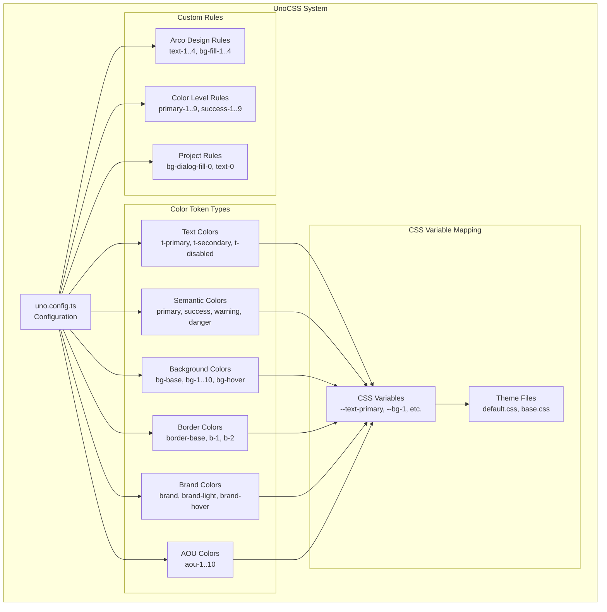
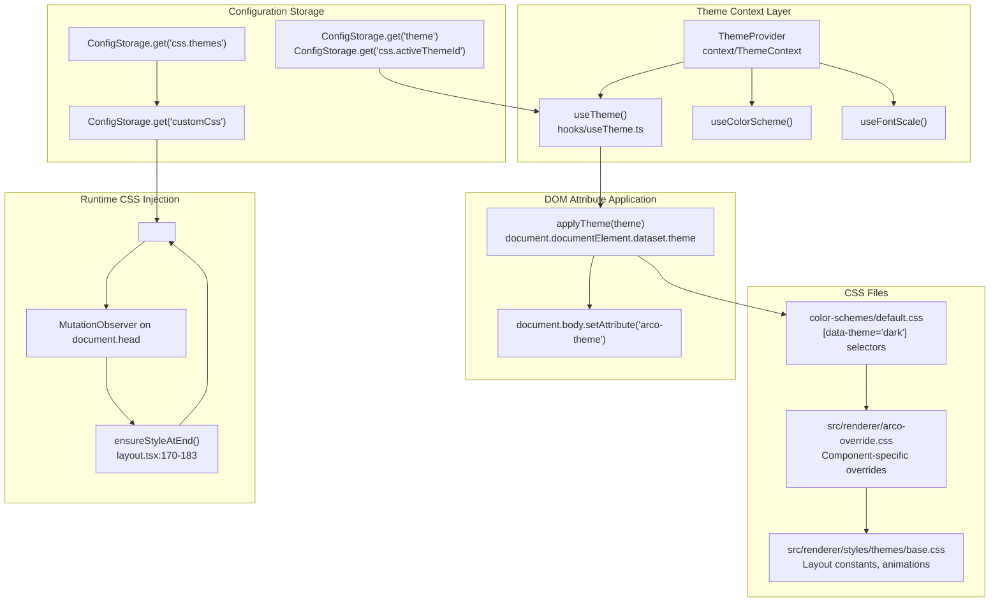
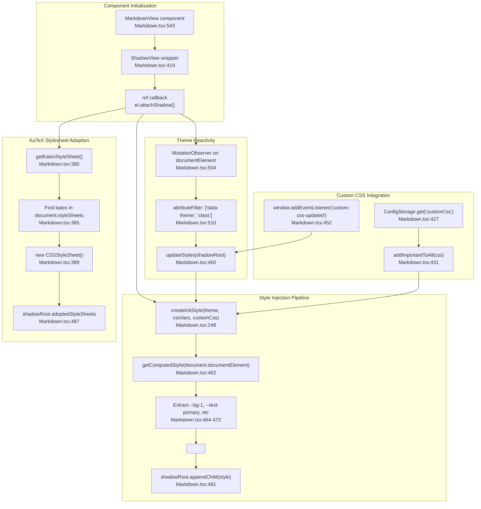
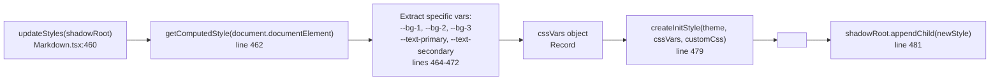
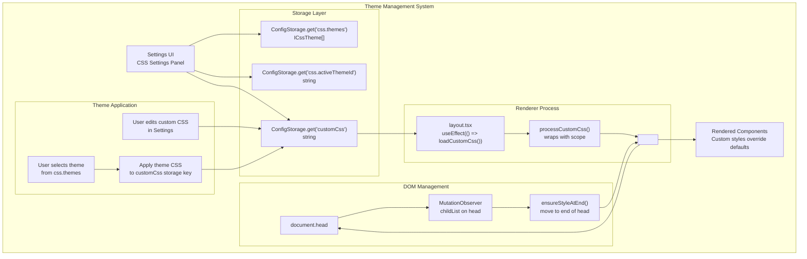
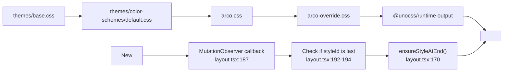

# Styling & Theming

<details>
<summary>Relevant source files</summary>

The following files were used as context for generating this wiki page:

- [src/process/initAgent.ts](src/process/initAgent.ts)
- [src/renderer/components/Diff2Html.tsx](src/renderer/components/Diff2Html.tsx)
- [src/renderer/components/Markdown.tsx](src/renderer/components/Markdown.tsx)
- [src/renderer/hooks/usePreviewLauncher.ts](src/renderer/hooks/usePreviewLauncher.ts)
- [src/renderer/layout.tsx](src/renderer/layout.tsx)
- [src/renderer/messages/MessageList.tsx](src/renderer/messages/MessageList.tsx)
- [src/renderer/messages/MessageTips.tsx](src/renderer/messages/MessageTips.tsx)
- [src/renderer/messages/MessageToolCall.tsx](src/renderer/messages/MessageToolCall.tsx)
- [src/renderer/messages/MessageToolGroup.tsx](src/renderer/messages/MessageToolGroup.tsx)
- [src/renderer/messages/MessagetText.tsx](src/renderer/messages/MessagetText.tsx)
- [src/renderer/pages/conversation/ChatConversation.tsx](src/renderer/pages/conversation/ChatConversation.tsx)
- [src/renderer/pages/conversation/ChatHistory.tsx](src/renderer/pages/conversation/ChatHistory.tsx)
- [src/renderer/pages/conversation/ChatLayout.tsx](src/renderer/pages/conversation/ChatLayout.tsx)
- [src/renderer/pages/conversation/ChatSider.tsx](src/renderer/pages/conversation/ChatSider.tsx)
- [src/renderer/pages/conversation/gemini/GeminiChat.tsx](src/renderer/pages/conversation/gemini/GeminiChat.tsx)
- [src/renderer/pages/settings/SettingsSider.tsx](src/renderer/pages/settings/SettingsSider.tsx)
- [src/renderer/router.tsx](src/renderer/router.tsx)
- [src/renderer/sider.tsx](src/renderer/sider.tsx)
- [src/renderer/styles/themes/base.css](src/renderer/styles/themes/base.css)

</details>

This page documents AionUi's styling and theming architecture, including the UnoCSS atomic CSS framework, CSS variable-based theme system, custom CSS injection, and component styling patterns. For layout-specific information, see [Layout System](#5.1). For component-specific UI patterns, see [User Interface](#5).

---

## Overview

AionUi implements a multi-layered styling system that combines:

- **UnoCSS** for atomic utility classes and rapid development
- **CSS Variables** for theme-aware color tokens
- **CSS Modules** for component-scoped styles
- **Arco Design** component library with custom theme overrides
- **Custom CSS** injection for user personalization
- **Theme Preset System** for built-in and user-defined visual themes
- **Font Scaling** via Electron's zoom factor API

This architecture enables consistent theming across light/dark modes, supports multiple color schemes, allows users to apply built-in theme presets, and permits arbitrary CSS customization without modifying source code.

The theme state is centralized in `ThemeContext` which composes three independent hooks: `useTheme` (light/dark mode), `useColorScheme` (color palette), and `useFontScale` (UI zoom level).

---

## UnoCSS Configuration

### Utility-First CSS Framework

AionUi uses UnoCSS as its primary styling engine, configured in [uno.config.ts:1-178](). The configuration defines semantic color tokens, shortcuts, and custom rules that map to CSS variables.



**Sources:** [uno.config.ts:1-178]()

### Color Token System

The UnoCSS configuration defines six categories of color tokens:

| Category              | Tokens                                              | CSS Variable Pattern           | Usage                              |
| --------------------- | --------------------------------------------------- | ------------------------------ | ---------------------------------- |
| **Text Colors**       | `t-primary`, `t-secondary`, `t-disabled`            | `--text-*`                     | Body text, headings, labels        |
| **Semantic Colors**   | `primary`, `success`, `warning`, `danger`, `info`   | `--primary`, `--success`, etc. | Buttons, status indicators, alerts |
| **Background Colors** | `bg-base`, `bg-1`..`bg-10`, `bg-hover`, `bg-active` | `--bg-*`                       | Backgrounds, containers, cards     |
| **Border Colors**     | `border-base`, `b-1`, `b-2`, `b-3`                  | `--border-*`, `--bg-*`         | Borders, dividers, separators      |
| **Brand Colors**      | `brand`, `brand-light`, `brand-hover`               | `--brand`, `--brand-*`         | Brand identity elements            |
| **AOU Colors**        | `aou-1`..`aou-10`                                   | `--aou-*`                      | AOU-specific brand gradients       |

**Sources:** [uno.config.ts:8-78]()

### Custom UnoCSS Rules

UnoCSS rules extend the framework with Arco Design compatibility and project-specific utilities:

```typescript
// Arco Design text colors: text-1, text-2, text-3, text-4
[/^text-([1-4])$/, ([, d]) => ({ color: `var(--color-text-${d})` })],

// Arco Design fill colors: bg-fill-1, bg-fill-2, bg-fill-3, bg-fill-4
[/^bg-fill-([1-4])$/, ([, d]) => ({ 'background-color': `var(--color-fill-${d})` })],

// Color level rules: bg-primary-1..9, text-success-1..9, border-danger-1..9
[/^(bg|text|border)-(primary|success|warning|danger)-([1-9])$/,
  ([, prefix, color, d]) => {
    const prop = prefix === 'bg' ? 'background-color'
               : prefix === 'text' ? 'color'
               : 'border-color';
    return { [prop]: `rgb(var(--${color}-${d}))` };
  }
],
```

These rules enable seamless integration between UnoCSS utilities and Arco Design's component library.

**Sources:** [uno.config.ts:103-136]()

---

## CSS Variable-Based Theme System

### Theme Architecture with Code Entities



**Sources:** [src/renderer/context/ThemeContext.tsx:1-58](), [src/renderer/hooks/useTheme.ts:1-73](), [src/renderer/layout.tsx:94-204](), [src/renderer/styles/themes/base.css:1-819](), [src/renderer/styles/themes/color-schemes/default.css:1-141]()

### Base Theme Variables

The base theme file [src/renderer/styles/themes/base.css:1-496]() defines theme-independent styles and global CSS variables:

```css
:root {
  --app-min-width: 360px;
  --titlebar-height: 36px;
}

.app-titlebar {
  display: flex;
  align-items: center;
  height: var(--titlebar-height);
  user-select: none;
  -webkit-app-region: drag;
}
```

Key base theme elements:

- **Layout Constants**: `--app-min-width`, `--titlebar-height`
- **Component Classes**: `.app-titlebar`, `.workspace-header__toggle`, `.layout-sider`
- **Animation Definitions**: `@keyframes loading`, `@keyframes preview-panel-enter`
- **Scrollbar Styles**: `::-webkit-scrollbar` customization
- **Diff2Html Dark Theme**: `.d2h-dark-color-scheme` integration

**Sources:** [src/renderer/styles/themes/base.css:1-496]()

### Color Scheme Variables

The default color scheme [src/renderer/styles/themes/color-schemes/default.css:1-141]() defines light and dark mode color palettes:

#### Light Mode Colors (`:root`)

```css
:root,
[data-color-scheme='default'] {
  /* Background Colors */
  --bg-base: #ffffff;
  --bg-1: #f7f8fa;
  --bg-2: #f2f3f5;
  --bg-3: #e5e6eb;

  /* Text Colors */
  --text-primary: #1d2129;
  --text-secondary: #86909c;
  --text-disabled: #c9cdd4;

  /* Interactive States */
  --bg-hover: #f3f4f6;
  --bg-active: #e5e6eb;

  /* AOU Brand Colors */
  --aou-1: #eff0f6;
  --aou-7: #596590;
  --aou-10: #0d101c;
}
```

#### Dark Mode Colors (`[data-theme='dark']`)

```css
[data-color-scheme='default'][data-theme='dark'] {
  /* Background Colors */
  --bg-base: #0e0e0e;
  --bg-1: #1a1a1a;
  --bg-2: #262626;
  --bg-3: #333333;

  /* Text Colors */
  --text-primary: #e5e5e5;
  --text-secondary: #a6a6a6;
  --text-disabled: #737373;

  /* Interactive States */
  --bg-hover: #1f1f1f;
  --bg-active: #2d2d2d;

  /* AOU Brand Colors */
  --aou-1: #2a2a2a;
  --aou-7: #b5bcd6;
  --aou-10: #eff0f6;
}
```

The color scheme uses CSS attribute selectors to switch between light and dark modes without JavaScript intervention, ensuring instant theme updates.

**Sources:** [src/renderer/styles/themes/color-schemes/default.css:1-141]()

---

## Component Styling Patterns

### Shadow DOM for Markdown Isolation

A critical architectural feature is the use of Shadow DOM for Markdown content rendering. This isolates rich content styles from application CSS, preventing conflicts while enabling per-user CSS customization.

#### Shadow DOM Architecture with Implementation Details

The `MarkdownView` component at [src/renderer/components/Markdown.tsx:543-637]() uses Shadow DOM to isolate markdown content styles while bridging CSS variables from the main document:



**Sources:** [src/renderer/components/Markdown.tsx:248-370](), [src/renderer/components/Markdown.tsx:380-417](), [src/renderer/components/Markdown.tsx:419-531](), [src/renderer/components/Markdown.tsx:543-637]()

#### Style Injection into Shadow DOM

The `createInitStyle` function at [src/renderer/components/Markdown.tsx:248-370]() generates a `<style>` element that bridges external CSS variables into the Shadow DOM:

```typescript
const createInitStyle = (
  currentTheme = 'light',
  cssVars?: Record<string, string>,
  customCss?: string
) => {
  const style = document.createElement('style')
  const cssVarsDeclaration = cssVars
    ? Object.entries(cssVars)
        .map(([key, value]) => `${key}: ${value};`)
        .join(
          '\
    '
        )
    : ''

  style.innerHTML = `
  :host {
    ${cssVarsDeclaration}
  }

  .markdown-shadow-body {
    word-break: break-word;
    overflow-wrap: anywhere;
    color: var(--text-primary);
    max-width: 100%;
  }
  
  /* User custom CSS injected here */
  ${customCss || ''}
  `
  return style
}
```

**Variable Extraction Process:**



**Implementation Details:**

| Feature                    | Implementation                                                                   | Location                                         |
| -------------------------- | -------------------------------------------------------------------------------- | ------------------------------------------------ |
| **CSS Variable Bridge**    | `getComputedStyle(document.documentElement)` extracts 8 specific variables       | [src/renderer/components/Markdown.tsx:462-472]() |
| **Theme Monitoring**       | `MutationObserver` with `attributeFilter: ['data-theme', 'class']`               | [src/renderer/components/Markdown.tsx:504-513]() |
| **Custom CSS Integration** | Loaded from `ConfigStorage.get('customCss')`, processed by `addImportantToAll()` | [src/renderer/components/Markdown.tsx:425-456]() |
| **KaTeX Styles**           | Adopted via `shadowRoot.adoptedStyleSheets` using `getKatexStyleSheet()`         | [src/renderer/components/Markdown.tsx:380-488]() |
| **Style Replacement**      | Old style removed before appending new one via `styleRef.current.remove()`       | [src/renderer/components/Markdown.tsx:476-481]() |

The `updateStyles` callback at [src/renderer/components/Markdown.tsx:460-491]() is triggered both on mount and whenever the `MutationObserver` detects theme attribute changes, ensuring Shadow DOM styles stay synchronized with the main document theme.

**Sources:** [src/renderer/components/Markdown.tsx:248-370](), [src/renderer/components/Markdown.tsx:380-417](), [src/renderer/components/Markdown.tsx:425-456](), [src/renderer/components/Markdown.tsx:460-491](), [src/renderer/components/Markdown.tsx:504-513]()

#### Custom CSS Processing for Shadow DOM

Custom CSS is processed before injection to ensure it takes precedence:

```typescript
// Load and process custom CSS from ConfigStorage
useEffect(() => {
  ConfigStorage.get('customCss').then((css) => {
    if (css) {
      const processed = addImportantToAll(css)
      setCustomCss(processed)
    }
  })
}, [])
```

**Processing Pipeline:**

| Step       | Function                                  | Purpose                                    |
| ---------- | ----------------------------------------- | ------------------------------------------ |
| 1. Load    | `ConfigStorage.get('customCss')`          | Retrieve user CSS from storage             |
| 2. Process | `addImportantToAll(css)`                  | Parse and add `!important` to declarations |
| 3. Inject  | `createInitStyle(theme, vars, processed)` | Include in Shadow DOM `<style>`            |
| 4. Apply   | `shadowRoot.appendChild(style)`           | Render in isolated context                 |

The `addImportantToAll()` utility ensures user styles override both application defaults and third-party library styles (like `react-markdown`, `diff2html`) within the Shadow DOM.

**Sources:** [src/renderer/components/Markdown.tsx:299-317](), [src/renderer/utils/customCssProcessor.ts:1]() (referenced)

### CSS Modules for Component Styles

Components use CSS Modules for scoped styles that don't pollute the global namespace. The chat layout demonstrates this pattern extensively:

```typescript
// Workspace panel header styling
<div className='workspace-panel-header flex items-center justify-start px-12px py-4px gap-12px border-b border-[var(--bg-3)]'
     style={{ height: WORKSPACE_HEADER_HEIGHT, minHeight: WORKSPACE_HEADER_HEIGHT }}>
```

**Pattern**: CSS Modules define structural styles, while UnoCSS utilities handle spacing, colors, and responsive behavior.

**Sources:** [src/renderer/pages/conversation/ChatLayout.tsx:66-80]()

### Combining UnoCSS with Dynamic Styles

The chat layout demonstrates advanced styling with computed CSS variables, conditional classes, and inline styles:

```typescript
<div
  className={classNames('!bg-1 relative chat-layout-right-sider layout-sider')}
  style={{
    flexGrow: isPreviewOpen ? 0 : workspaceFlex,
    flexShrink: 0,
    flexBasis: rightSiderCollapsed ? '0px' : isPreviewOpen ? `${workspaceFlex}%` : 0,
    minWidth: rightSiderCollapsed ? '0px' : '220px',
    overflow: 'hidden',
    borderLeft: rightSiderCollapsed ? 'none' : '1px solid var(--bg-3)',
  }}
>
```

This pattern provides:

- **CSS Modules**: Component-specific layout and structure
- **UnoCSS**: Utility classes (`!bg-1`, `relative`, positioning)
- **classNames Library**: Conditional class application
- **Inline Styles**: Complex computed values based on responsive state

**Sources:** [src/renderer/pages/conversation/ChatLayout.tsx:446-470]()

### Theme-Aware Icon Colors

The `iconColors` utility provides consistent icon theming:

```typescript
import { iconColors } from '@/renderer/theme/colors';

<LoadingOne theme='outline' size='14' fill={iconColors.primary} className='loading' />
<Copy theme='outline' size='16' fill={iconColors.secondary} />
```

Icons automatically adapt to the current theme without manual color management.

**Sources:** [src/renderer/messages/MessageToolGroup.tsx:9](), [src/renderer/messages/MessageToolGroup.tsx:310](), [src/renderer/messages/MessagetText.tsx:9](), [src/renderer/messages/MessagetText.tsx:81]()

### Agent Logo Mapping

The chat layout includes a logo mapping system for different AI agents:

```typescript
const AGENT_LOGO_MAP: Partial<Record<AcpBackend, string>> = {
  claude: ClaudeLogo,
  gemini: GeminiLogo,
  qwen: QwenLogo,
  codex: CodexLogo,
  iflow: IflowLogo,
  goose: GooseLogo,
  auggie: AuggieLogo,
  kimi: KimiLogo,
  opencode: OpenCodeLogo,
};

// Usage in header
{agentLogo
  ? agentLogoIsEmoji
    ? <span className='text-sm'>{agentLogo}</span>
    : 
  : AGENT_LOGO_MAP[backend]
    ? 
    : <Robot theme='outline' size={16} fill={iconColors.primary} />
}
```

**Pattern**: Supports both SVG imports and emoji strings for flexible branding.

**Sources:** [src/renderer/pages/conversation/ChatLayout.tsx:14-36](), [src/renderer/pages/conversation/ChatLayout.tsx:403-408]()

---

## Custom CSS Injection System

### Theme Management Architecture

AionUi provides a dual-layer custom CSS system: user-defined custom CSS and saved theme presets.



**Key Storage Keys:**

| Storage Key         | Type          | Purpose                                          |
| ------------------- | ------------- | ------------------------------------------------ |
| `customCss`         | `string`      | Currently active CSS (from theme or direct edit) |
| `css.themes`        | `ICssTheme[]` | Saved theme presets with name and CSS            |
| `css.activeThemeId` | `string`      | ID of currently selected theme preset            |

**Sources:** [src/common/storage.ts:56-57](), [src/renderer/layout.tsx:68-144]()

### Custom CSS Loading and Injection with Theme Healing

The custom CSS system at [src/renderer/layout.tsx:94-204]() loads from `ConfigStorage` and includes a theme healing mechanism to keep CSS synchronized with active theme presets:

```typescript
// Load and heal custom CSS from theme presets
const loadAndHealCustomCss = useCallback(async () => {
  try {
    const [savedCssRaw, activeThemeId, savedThemes] = await Promise.all([
      ConfigStorage.get('customCss'),
      ConfigStorage.get('css.activeThemeId'),
      ConfigStorage.get('css.themes'),
    ])

    const decision = computeCssSyncDecision({
      savedCss: savedCssRaw || '',
      activeThemeId: activeThemeId || '',
      savedThemes: (savedThemes || []) as ICssTheme[],
      currentUiCss: customCss,
      lastUiCssUpdateAt: lastUiCssUpdateAtRef.current,
    })

    if (decision.shouldSkipApply) {
      return
    }

    const effectiveCss = decision.effectiveCss
    if (decision.shouldHealStorage) {
      await ConfigStorage.set('customCss', effectiveCss)
    }

    setCustomCss(effectiveCss)
    window.dispatchEvent(
      new CustomEvent('custom-css-updated', {
        detail: { customCss: effectiveCss },
      })
    )
  } catch (error) {
    console.error('Failed to load or heal custom CSS:', error)
  }
}, [customCss])
```

**Event Propagation Channels:**

| Event Channel            | Trigger                        | Scope             | Implementation         | Use Case                          |
| ------------------------ | ------------------------------ | ----------------- | ---------------------- | --------------------------------- |
| `custom-css-updated`     | `window.dispatchEvent()`       | Same window       | [layout.tsx:120]()     | Settings UI → Layout → Shadow DOM |
| `storage`                | Browser `StorageEvent`         | Cross-window      | [layout.tsx:139]()     | Multi-window sync                 |
| `loadAndHealCustomCss()` | Component mount / route change | Current component | [layout.tsx:129,155]() | Initial load & route sync         |

**Theme Healing Decision Logic:**

The `computeCssSyncDecision()` function at [src/renderer/utils/themeCssSync.ts]() (referenced in [layout.tsx:98]()) determines whether to:

- **Skip application** if UI CSS is already current
- **Heal storage** if active theme CSS differs from stored `customCss`
- **Use effective CSS** from active theme or fallback to stored CSS

This ensures that when a user selects a theme preset from `css.themes`, the CSS is automatically applied without manual save action.

**Sources:** [src/renderer/layout.tsx:94-157](), [src/renderer/utils/themeCssSync.ts]() (via [layout.tsx:98]())

### CSS Processing and Injection with Priority Management

Custom CSS is processed and injected with cascade priority management using `MutationObserver` at [src/renderer/layout.tsx:159-204]():

```typescript
useEffect(() => {
  const styleId = 'user-defined-custom-css'

  if (!customCss) {
    document.getElementById(styleId)?.remove()
    return
  }

  const wrappedCss = processCustomCss(customCss)

  const ensureStyleAtEnd = () => {
    let styleEl = document.getElementById(styleId) as HTMLStyleElement | null

    // Skip if already at end and unchanged
    if (
      styleEl &&
      styleEl.textContent === wrappedCss &&
      styleEl === document.head.lastElementChild
    ) {
      return
    }

    styleEl?.remove()
    styleEl = document.createElement('style')
    styleEl.id = styleId
    styleEl.type = 'text/css'
    styleEl.textContent = wrappedCss
    document.head.appendChild(styleEl)
  }

  ensureStyleAtEnd()

  const observer = new MutationObserver((mutations) => {
    const hasNewStyle = mutations.some((mutation) =>
      Array.from(mutation.addedNodes).some(
        (node) => node.nodeName === 'STYLE' || node.nodeName === 'LINK'
      )
    )

    if (hasNewStyle) {
      const element = document.getElementById(styleId)
      if (element && element !== document.head.lastElementChild) {
        ensureStyleAtEnd()
      }
    }
  })

  observer.observe(document.head, { childList: true })

  return () => {
    observer.disconnect()
    document.getElementById(styleId)?.remove()
  }
}, [customCss])
```

**Cascade Priority Strategy:**



**Key Implementation Details:**

| Aspect             | Implementation                                            | Location               |
| ------------------ | --------------------------------------------------------- | ---------------------- |
| **Style ID**       | `'user-defined-custom-css'` constant                      | [layout.tsx:161]()     |
| **Processing**     | `processCustomCss(customCss)` wraps CSS in scope selector | [layout.tsx:168]()     |
| **Optimization**   | Skip re-render if content unchanged and already at end    | [layout.tsx:173-176]() |
| **Observer Setup** | `observer.observe(document.head, { childList: true })`    | [layout.tsx:198]()     |
| **Cleanup**        | `observer.disconnect()` and remove style element          | [layout.tsx:201-203]() |

The `MutationObserver` ensures that even when dynamic stylesheets are injected (e.g., by Arco Design modals or UnoCSS runtime), user CSS maintains cascade priority by being the last element in `<head>`.

**Sources:** [src/renderer/layout.tsx:159-204](), [src/renderer/utils/customCssProcessor.ts:1]()

### Importance Modifier Processing

Custom CSS is processed through `addImportantToAll()` to ensure override priority:

```typescript
// From renderer/utils/customCssProcessor.ts (referenced in Markdown.tsx)
const processedCss = addImportantToAll(css)
```

This utility parses CSS and appends `!important` to all declarations, guaranteeing user styles override defaults even when specificity would normally prevent it. This is particularly important for Shadow DOM content where external styles have limited reach.

**Sources:** [src/renderer/components/Markdown.tsx:299-317]()

---

## Arco Design Integration

### Component Library Theming

AionUi uses Arco Design as its component library with custom theme configuration:

```typescript
import { ConfigProvider } from '@arco-design/web-react';
import '@arco-design/web-react/dist/css/arco.css';
import enUS from '@arco-design/web-react/es/locale/en-US';
import zhCN from '@arco-design/web-react/es/locale/zh-CN';
import './arco-override.css'; // Custom overrides

const Config: React.FC<PropsWithChildren> = ({ children }) => {
  const { i18n: { language } } = useTranslation();
  const arcoLocale = arcoLocales[language] ?? enUS;

  return (
    <ConfigProvider
      theme={{ primaryColor: '#4E5969' }}
      locale={arcoLocale}
    >
      {children}
    </ConfigProvider>
  );
};
```

**Sources:** [src/renderer/index.ts:18-51]()

### Theme Overrides

The `arco-override.css` file provides project-specific overrides for Arco Design components:

#### Input and Select Component Backgrounds

```css
/* Default background for select and input components */
.arco-select-view,
.arco-input,
.arco-input-inner-wrapper {
  background-color: var(--fill-0) !important;
}
```

**Sources:** [src/renderer/arco-override.css:1-25](), [src/renderer/styles/themes/base.css:554-560]()

#### Button States

```css
.arco-btn {
  &.arco-btn-outline {
    border-color: #86909c;
    color: #86909c;
  }
}

.arco-btn-primary.arco-btn-disabled {
  background-color: var(--aou-2) !important;
  border-color: var(--aou-2) !important;
}
```

**Sources:** [src/renderer/arco-override.css:27-37]()

#### Message Component Gradients

```css
/* Light mode */
.arco-message-success {
  background: linear-gradient(270deg, #f9fff2 0%, #d2ffd9 100%) !important;
}

.arco-message-warning {
  background: linear-gradient(90deg, #fff3dc 0%, #fff8de 100%) !important;
}

/* Dark mode */
body[arco-theme='dark'] .arco-message-success {
  background: linear-gradient(
    270deg,
    rgba(249, 255, 242, 0.3) 0%,
    rgba(210, 255, 217, 0.3) 100%
  ) !important;
}
```

**Sources:** [src/renderer/arco-override.css:128-166]()

#### Tag Dark Mode Enhancements

```css
body[arco-theme='dark'] .arco-tag-checked.arco-tag-blue {
  background-color: rgba(59, 130, 246, 0.2) !important;
  color: rgb(96, 165, 250) !important;
}

body[arco-theme='dark'] .arco-tag-checked.arco-tag-green {
  background-color: rgba(34, 197, 94, 0.2) !important;
  color: rgb(74, 222, 128) !important;
}
```

**Pattern**: Semi-transparent backgrounds with brighter text for better contrast in dark mode.

**Sources:** [src/renderer/arco-override.css:48-72]()

#### Workspace Tree Selection

```css
/* Workspace tree selection styles - use text color instead of background */
.workspace-tree .arco-tree-node-selected .arco-tree-node-title {
  background-color: transparent !important;
}

/* Workspace tree hover styles - more visible hover effect */
.workspace-tree .arco-tree-node:hover .arco-tree-node-title {
  background-color: var(--color-fill-3) !important;
}
```

**Sources:** [src/renderer/arco-override.css:168-176]()

#### Modal and Steps Components

```css
/* AionUi Steps wrapper styles */
.aionui-steps .arco-steps-item-process .arco-steps-item-icon {
  background-color: var(--aou-6-brand) !important;
  border-color: var(--aou-6-brand) !important;
}

/* AionUi Modal wrapper styles */
.aionui-modal .arco-modal-content {
  background: var(--bg-1) !important;
  border-radius: 12px !important;
}
```

**Pattern**: Component wrappers with `.aionui-*` classes enable scoped theme overrides.

**Sources:** [src/renderer/arco-override.css:74-127]()

---

## Theme Provider Context

### ThemeContext

The `ThemeContext` at [src/renderer/context/ThemeContext.tsx]() is a unified context that composes three independent concerns, each managed by its own hook:

| Concern         | Hook             | Interface Key                   | Purpose                                         |
| --------------- | ---------------- | ------------------------------- | ----------------------------------------------- |
| Light/Dark mode | `useTheme`       | `theme`, `setTheme`             | Controls `data-theme` / `arco-theme` attributes |
| Color palette   | `useColorScheme` | `colorScheme`, `setColorScheme` | Selects color scheme variant                    |
| UI zoom level   | `useFontScale`   | `fontScale`, `setFontScale`     | Controls Electron window zoom factor            |

The `ThemeProvider` component renders these three hooks and exposes them through `ThemeContextValue`:

```
ThemeProvider
  ├── useTheme()        → [theme, setTheme]
  ├── useColorScheme()  → [colorScheme, setColorScheme]
  └── useFontScale()    → [fontScale, setFontScale]
```

Components consume theme state via the `useThemeContext()` hook, which throws if called outside `ThemeProvider`.

**Sources:** [src/renderer/context/ThemeContext.tsx:1-58]()

**Context value structure (`ThemeContextValue`):**

```
ThemeContextValue {
  theme: Theme             // 'light' | 'dark'
  setTheme: async (theme) → void
  colorScheme: ColorScheme
  setColorScheme: async (scheme) → void
  fontScale: number        // 0.8 – 1.3
  setFontScale: async (scale) → void
}
```

### Light/Dark Mode (`useTheme`)

`useTheme` at [src/renderer/hooks/useTheme.ts:1-73]() manages the `light`/`dark` toggle:

- On module load, it reads `ConfigStorage.get('theme')` and immediately applies `data-theme` and `arco-theme` attributes to `document.documentElement` and `document.body`, before React renders. This prevents flash of unstyled content.
- `setTheme` persists the selection to `ConfigStorage` via `ConfigStorage.set('theme', newTheme)`.
- Reverts to `DEFAULT_THEME` (`'light'`) on read failure.

**Attribute targets written by `applyTheme`:**

| Attribute    | Target element             | Consumer                              |
| ------------ | -------------------------- | ------------------------------------- |
| `data-theme` | `document.documentElement` | CSS selectors (`[data-theme='dark']`) |
| `arco-theme` | `document.body`            | Arco Design dark mode                 |

**Sources:** [src/renderer/hooks/useTheme.ts:1-73]()

### ThemeSwitcher Component

`ThemeSwitcher` at [src/renderer/components/ThemeSwitcher.tsx:1-31]() renders a dropdown backed by `useThemeContext()`. It calls `setTheme` with `'light'` or `'dark'` on selection change.

**Sources:** [src/renderer/components/ThemeSwitcher.tsx:1-31]()

---

## Responsive Design Patterns

### Mobile Safe Area Handling

The layout system at [src/renderer/styles/themes/base.css:436-530]() uses CSS environment variables for iOS/Android safe area insets:

```css
/* Safe area utilities for mobile devices */
@supports (padding-bottom: env(safe-area-inset-bottom)) {
  .safe-area-bottom {
    padding-bottom: env(safe-area-inset-bottom, 0px);
  }

  .safe-area-top {
    padding-top: env(safe-area-inset-top, 0px);
  }
}

/* Mobile sidebar with safe area insets */
@media (max-width: 767px) {
  .layout-sider {
    top: 0 !important;
    height: 100vh !important;
    height: 100dvh !important; /* Dynamic viewport height for mobile browsers */
    display: flex !important;
    flex-direction: column !important;
    padding-top: env(safe-area-inset-top, 0px);
    padding-bottom: env(safe-area-inset-bottom, 0px);
    box-sizing: border-box !important;
  }
}
```

**Key features:**

- **Dynamic Viewport Height (`dvh`)**: Accounts for browser chrome on mobile (iOS Safari address bar)
- **Safe Area Insets**: Prevents content from being obscured by notches, home indicators
- **Flex Layout**: Ensures proper space distribution within safe area bounds

**Sources:** [src/renderer/styles/themes/base.css:436-530]()

### Mobile Sidebar Layout

The sidebar at [src/renderer/layout.tsx:262-325]() uses fixed positioning with transform-based animations on mobile:

```typescript
<ArcoLayout.Sider
  collapsedWidth={isMobile ? 0 : 64}
  collapsed={collapsed}
  width={siderWidth}
  className={classNames('!bg-2 layout-sider', {
    collapsed: collapsed,
  })}
  style={
    isMobile
      ? {
          position: 'fixed',
          left: 0,
          zIndex: 100,
          transform: collapsed ? 'translateX(-100%)' : 'translateX(0)',
          transition: 'none',
          pointerEvents: collapsed ? 'none' : 'auto',
        }
      : undefined
  }
>
```

**Width Calculation:**

```typescript
const DEFAULT_SIDER_WIDTH = 250
const MOBILE_SIDER_WIDTH_RATIO = 0.67
const MOBILE_SIDER_MIN_WIDTH = 260
const MOBILE_SIDER_MAX_WIDTH = 420

const siderWidth = isMobile
  ? Math.max(
      MOBILE_SIDER_MIN_WIDTH,
      Math.min(
        MOBILE_SIDER_MAX_WIDTH,
        Math.round(viewportWidth * MOBILE_SIDER_WIDTH_RATIO)
      )
    )
  : DEFAULT_SIDER_WIDTH
```

**Mobile Behavior:**

- **Desktop**: Collapses to 64px width, animates smoothly
- **Mobile**: Slides off-screen (`translateX(-100%)`), uses backdrop overlay at [layout.tsx:260]()
- **No transition**: `transition: 'none'` prevents janky animations on mobile
- **Pointer events**: Disabled when collapsed to allow click-through

**Sources:** [src/renderer/layout.tsx:56-59](), [src/renderer/layout.tsx:251](), [src/renderer/layout.tsx:260](), [src/renderer/layout.tsx:262-325]()

### Workspace Panel Mobile Positioning

The workspace panel at [src/renderer/pages/conversation/ChatLayout.tsx:482-533]() uses fixed positioning with floating drag handles:

```typescript
{/* Mobile workspace (keep original fixed positioning) */}
{workspaceEnabled && layout?.isMobile && (
  <div
    className='!bg-1 relative chat-layout-right-sider'
    style={{
      position: 'fixed',
      right: 0,
      top: 0,
      height: '100vh',
      width: `${Math.round(workspaceWidthPx)}px`,
      zIndex: 100,
      transform: rightSiderCollapsed ? 'translateX(100%)' : 'translateX(0)',
      transition: 'none',
      pointerEvents: rightSiderCollapsed ? 'none' : 'auto',
    }}
  >
    <WorkspacePanelHeader showToggle collapsed={rightSiderCollapsed}
      onToggle={() => dispatchWorkspaceToggleEvent()} togglePlacement='left'>
      {props.siderTitle}
    </WorkspacePanelHeader>
    <ArcoLayout.Content className='bg-1'
      style={{ height: `calc(100% - ${WORKSPACE_HEADER_HEIGHT}px)` }}>
      {props.sider}
    </ArcoLayout.Content>
  </div>
)}
```

**Floating Toggle Button:**

```typescript
{/* Floating collapse handle */}
{workspaceEnabled && layout?.isMobile && !rightSiderCollapsed && (
  <button
    type='button'
    className='fixed z-101 flex items-center justify-center transition-colors workspace-toggle-floating'
    style={{
      top: '50%',
      right: `${mobileWorkspaceHandleRight}px`,
      transform: 'translateY(-50%)',
      width: '20px',
      height: '64px',
      borderTopLeftRadius: '10px',
      borderBottomLeftRadius: '10px',
      backgroundColor: 'var(--bg-2)',
      boxShadow: '0 8px 20px rgba(0, 0, 0, 0.12)',
    }}
    onClick={() => dispatchWorkspaceToggleEvent()}
  >
```

**Width Calculation:**

```typescript
const mobileViewportWidth = viewportWidth || window.innerWidth
const mobileWorkspaceWidthPx = Math.min(
  Math.max(300, Math.round(mobileViewportWidth * 0.84)),
  Math.max(300, Math.min(420, mobileViewportWidth - 20))
)
```

This ensures the workspace panel takes 84% of viewport width, clamped between 300px and 420px, with a 20px minimum margin.

**Sources:** [src/renderer/pages/conversation/ChatLayout.tsx:320-323](), [src/renderer/pages/conversation/ChatLayout.tsx:378](), [src/renderer/pages/conversation/ChatLayout.tsx:482-533]()

### Message List Responsive Centering

The Arco Message component is offset to account for the sidebar on desktop, but centers on mobile:

```css
/* Message component positioning - center in conversation area (exclude left sider) */
.arco-message-wrapper {
  left: 0 !important;
  width: 100% !important;
  padding-left: 266px;
  box-sizing: border-box;
}

/* Mobile: remove left padding */
@media (max-width: 767px) {
  .arco-message-wrapper {
    padding-left: 0;
  }
}
```

**Sources:** [src/renderer/styles/themes/base.css:537-552]()

### Reduced Motion Support

The theme system respects user motion preferences:

```css
@media (prefers-reduced-motion: reduce) {
  .preview-panel {
    transition: none !important;
    animation: none !important;
  }

  .chat-history,
  .chat-history__item,
  .chat-history__item-name,
  .chat-history__item-editor,
  .settings-sider,
  .settings-sider__item,
  .settings-sider__item-label,
  .chat-history__placeholder,
  .chat-history__section {
    transition: none;
  }
}
```

This ensures accessibility for users who prefer reduced animations.

**Sources:** [src/renderer/styles/themes/base.css:355-367]()

---

## Layout-Specific Theming

### Workspace Panel State Management

The workspace panel uses localStorage-based preference tracking with automatic collapse/expand based on file presence:

```typescript
// Global collapse state
const [rightSiderCollapsed, setRightSiderCollapsed] = useState(() => {
  try {
    const stored = localStorage.getItem(STORAGE_KEYS.WORKSPACE_PANEL_COLLAPSE)
    if (stored !== null) {
      return stored === 'true'
    }
  } catch {}
  return true // Default collapsed
})

// Per-conversation preference
const handleHasFiles = (event: Event) => {
  const detail = (event as CustomEvent<WorkspaceHasFilesDetail>).detail
  const conversationId = detail.conversationId

  // Check user preference
  let userPreference: 'expanded' | 'collapsed' | null = null
  if (conversationId) {
    const stored = localStorage.getItem(
      `workspace-preference-${conversationId}`
    )
    if (stored === 'expanded' || stored === 'collapsed') {
      userPreference = stored
    }
  }

  // Apply preference or file-based logic
  if (userPreference) {
    setRightSiderCollapsed(userPreference === 'collapsed')
  } else {
    // No preference: expand if has files, collapse if not
    setRightSiderCollapsed(!detail.hasFiles)
  }
}
```

**Pattern**: User manual toggles override automatic file-based behavior, stored per-conversation.

**Sources:** [src/renderer/pages/conversation/ChatLayout.tsx:100-215]()

### Panel and Sidebar Transitions

Layout components use theme-aware transitions with performance optimizations:

```css
.layout-sider {
  overflow-x: hidden;
}

.layout-sider.collapsed .arco-layout-sider-children,
.layout-sider.arco-layout-sider-collapsed .arco-layout-sider-children {
  overflow-x: hidden;
}

.layout-sider--dragging {
  transition: none !important; /* Disable during drag for smooth UX */
}

.chat-history__item,
.settings-sider__item {
  transition:
    padding 0.2s ease,
    margin 0.2s ease,
    background-color 0.2s ease;
}

.chat-history__item-name,
.chat-history__item-editor,
.settings-sider__item-label {
  transition:
    opacity 0.25s ease,
    transform 0.25s ease;
  transform-origin: left center;
}

.chat-history--collapsed .chat-history__item-name,
.chat-history--collapsed .chat-history__item-editor {
  opacity: 0;
  transform: translateX(-8px);
}

.settings-sider--collapsed .settings-sider__item-label {
  opacity: 0;
  transform: translateX(-8px);
}
```

**Sources:** [src/renderer/styles/themes/base.css:258-353]()

### Preview Panel Animation

The preview panel uses CSS animations for smooth entry with motion reduction support:

```css
@media (prefers-reduced-motion: reduce) {
  .preview-panel {
    transition: none !important;
    animation: none !important;
  }
}

.preview-panel {
  animation: preview-panel-enter 0.25s cubic-bezier(0.4, 0, 0.2, 1) forwards;
  will-change: opacity, transform;
}

@keyframes preview-panel-enter {
  from {
    opacity: 0;
    transform: translateX(20px);
  }
  to {
    opacity: 1;
    transform: translateX(0);
  }
}
```

**Sources:** [src/renderer/styles/themes/base.css:272-294]()

### Collapsed State CSS Classes

Components use `.collapsed` and `.collapsed-hidden` classes for responsive sidebar behavior:

```css
.collapsed {
  .collapsed-hidden {
    display: none;
  }
  .\!collapsed-hidden {
    display: none !important;
  }
}
```

**Usage in components:**

```typescript
<div className='collapsed-hidden font-bold text-t-primary'>AionUi</div>
<span className='collapsed-hidden text-t-primary'>New Conversation</span>
```

**Sources:** [src/renderer/styles/themes/base.css:183-191](), [src/renderer/sider.tsx:70-71]()

---

## Custom Scrollbar Styling

### Theme-Aware Scrollbars

Scrollbars adapt to the current theme:

```css
::-webkit-scrollbar {
  width: 6px;
  height: 6px;
}

::-webkit-scrollbar-track {
  background: transparent;
}

::-webkit-scrollbar-thumb {
  background: transparent;
  border-radius: 3px;
  transition: background 0.3s;
}

::-webkit-scrollbar-thumb:hover {
  background: rgba(0, 0, 0, 0.2);
}

[data-theme='dark'] ::-webkit-scrollbar-thumb:hover {
  background: rgba(255, 255, 255, 0.2);
}

*:hover::-webkit-scrollbar-thumb {
  background: rgba(0, 0, 0, 0.1);
}

[data-theme='dark'] *:hover::-webkit-scrollbar-thumb {
  background: rgba(255, 255, 255, 0.1);
}
```

Scrollbars remain invisible until hover, reducing visual clutter while maintaining usability.

**Sources:** [src/renderer/styles/themes/base.css:304-344]()

---

## Styling Best Practices

### 1. Use Semantic Color Tokens

**Preferred:**

```tsx
<div className="bg-1 text-t-primary border-b-base">Content</div>
```

**Avoid:**

```tsx
<div style={{ backgroundColor: '#f7f8fa', color: '#1d2129' }}>Content</div>
```

Using semantic tokens ensures theme compatibility and easier maintenance.

### 2. Combine UnoCSS with CSS Modules

**Preferred:**

```tsx
<div className={`${styles.container} flex items-center gap-16px bg-2`}>
```

- CSS Modules: Component-specific layout structure
- UnoCSS: Spacing, colors, flexbox, responsive utilities

### 3. Dynamic Theme Colors via Hooks

**Preferred:**

```tsx
const { activeBorderColor, inactiveBorderColor, activeShadow } = useInputFocusRing();

<div
  style={{
    borderColor: isActive ? activeBorderColor : inactiveBorderColor,
    boxShadow: isActive ? activeShadow : 'none',
  }}
>
```

Hooks encapsulate theme logic and provide computed colors based on current theme state.

**Sources:** [src/renderer/pages/guid/index.tsx:142](), [src/renderer/pages/guid/index.tsx:649-652]()

### 4. Respect User Preferences

Always include responsive and accessibility considerations:

```css
@media (max-width: 768px) {
  /* Mobile styles */
}
@media (prefers-reduced-motion: reduce) {
  /* Disable animations */
}
@supports (-webkit-touch-callout: none) {
  /* iOS-specific fixes */
}
```

### 5. Custom CSS Scoping

When users add custom CSS, it should be scoped appropriately to avoid breaking core functionality. The `processCustomCss()` function (referenced in [src/renderer/layout.tsx:108]()) handles this processing.

---

## Summary

| Component         | Purpose                      | Key Files                                 |
| ----------------- | ---------------------------- | ----------------------------------------- |
| **UnoCSS**        | Atomic utility classes       | [uno.config.ts:1-178]()                   |
| **CSS Variables** | Theme tokens and values      | [base.css:1-496](), [default.css:1-141]() |
| **CSS Modules**   | Component-scoped styles      | [index.module.css:1-106]()                |
| **Arco Design**   | Component library theming    | [index.ts:18-51](), [base.css:489-496]()  |
| **Custom CSS**    | User personalization         | [layout.tsx:68-144]()                     |
| **ThemeProvider** | Context and state management | [index.ts:42]()                           |

The styling system provides a robust, scalable foundation for UI development while maintaining theme consistency, accessibility, and user customization capabilities.
