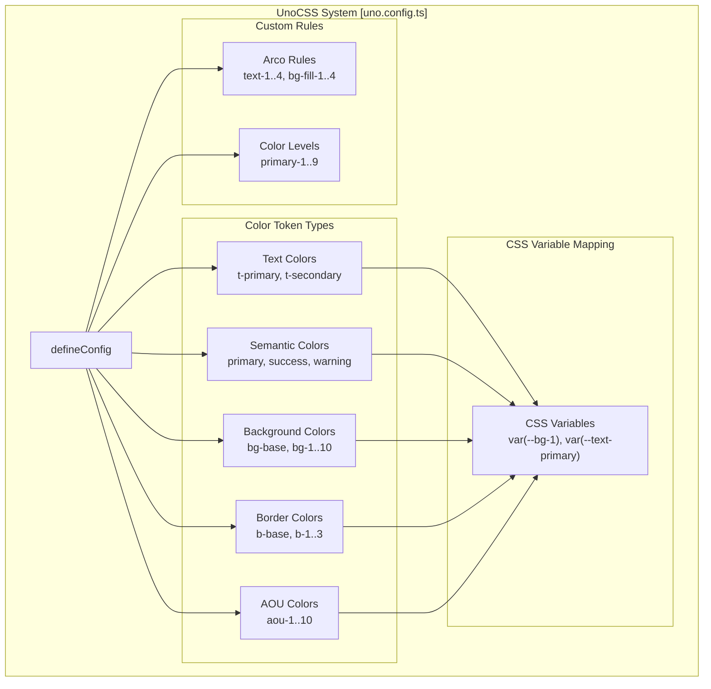
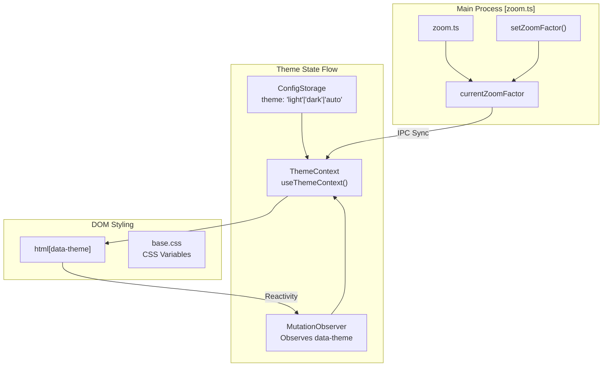

# Styling & Theming

<details>
<summary>Relevant source files</summary>

The following files were used as context for generating this wiki page:

- [src/process/utils/zoom.ts](src/process/utils/zoom.ts)
- [src/renderer/components/base/AionCollapse.tsx](src/renderer/components/base/AionCollapse.tsx)
- [src/renderer/components/base/AionModal.tsx](src/renderer/components/base/AionModal.tsx)
- [src/renderer/components/base/AionScrollArea.tsx](src/renderer/components/base/AionScrollArea.tsx)
- [src/renderer/components/base/AionSelect.tsx](src/renderer/components/base/AionSelect.tsx)
- [src/renderer/components/base/AionSteps.tsx](src/renderer/components/base/AionSteps.tsx)
- [src/renderer/components/base/index.ts](src/renderer/components/base/index.ts)
- [src/renderer/pages/settings/components/ApiKeyEditorModal.tsx](src/renderer/pages/settings/components/ApiKeyEditorModal.tsx)
- [src/renderer/styles/themes/base.css](src/renderer/styles/themes/base.css)
- [tests/unit/process/utils/zoom.test.ts](tests/unit/process/utils/zoom.test.ts)

</details>


This page documents AionUi's styling and theming architecture, including the UnoCSS atomic CSS framework, CSS variable-based theme system, custom CSS support, and component styling patterns for both desktop and mobile.

---

## Overview

AionUi implements a multi-layered styling system that combines:

- **UnoCSS** for atomic utility classes and rapid development [uno.config.ts:1-181]()
- **CSS Variables** for theme-aware color tokens [src/renderer/styles/themes/base.css:3-6]()
- **Arco Design** component library with custom theme overrides [src/renderer/components/base/AionSelect.tsx:32-44]()
- **Shadow DOM Isolation** for Markdown content to prevent style leakage [src/renderer/components/base/AionModal.tsx:178-222]()
- **Theme Reactivity** via `ThemeContext` and `MutationObserver` for system-level theme changes.
- **Font Scaling** via Electron's zoom factor API [src/process/utils/zoom.ts:9-50]()

The theme state is centralized in `ThemeContext` which manages light/dark modes and font scaling [src/renderer/components/base/AionModal.tsx:13-178]().

---

## UnoCSS Configuration

### Utility-First CSS Framework

AionUi uses UnoCSS as its primary styling engine, configured in `uno.config.ts`. The configuration defines semantic color tokens, shortcuts, and custom rules that map to CSS variables [uno.config.ts:1-181]().



**Sources:** [uno.config.ts:1-181]()

### Color Token System

The UnoCSS configuration defines categories of color tokens mapped to CSS variables:

| Category | Tokens | CSS Variable Pattern | Usage |
|----------|--------|---------------------|-------|
| **Text Colors** | `t-primary`, `t-secondary` | `--text-primary`, `--text-secondary` | Body text, headings [uno.config.ts:8-14]() |
| **Semantic Colors** | `primary`, `success`, `warning`, `danger` | `--primary`, `--success`, etc. | Status indicators [uno.config.ts:19-25]() |
| **Background Colors** | `bg-base`, `bg-1`..`bg-10` | `--bg-base`, `--bg-1`..`10` | Containers, cards [uno.config.ts:34-47]() |
| **Border Colors** | `b-base`, `b-light`, `b-1`..`3` | `--border-base`, `--bg-3`..`5` | Dividers, borders [uno.config.ts:50-56]() |
| **AOU Colors** | `aou-1`..`10` | `--aou-1`..`10` | Brand identity [uno.config.ts:66-79]() |

**Sources:** [uno.config.ts:8-92]()

---

## Theme System & Reactivity

### Theme Architecture

The system uses `ThemeContext` to provide theme-related state to the component tree. It tracks `fontScale` and the active theme (light/dark) [src/renderer/components/base/AionModal.tsx:178-180]().



**Sources:** [src/renderer/components/base/AionModal.tsx:178-180](), [src/process/utils/zoom.ts:9-50](), [src/renderer/styles/themes/base.css:3-6]()

### Base Styles and Scrollbars

Global styles independent of themes are defined in `base.css` [src/renderer/styles/themes/base.css:1-131]().

- **Layout Constants**: `--app-min-width` (360px), `--titlebar-height` (36px) [src/renderer/styles/themes/base.css:3-6]().
- **Scrollbars**: Customized via `::-webkit-scrollbar` to be subtle and theme-aware. Scrollbars are hidden in specific views using `.scrollbar-hide` [src/renderer/styles/themes/base.css:91-131]().
- **Animations**: Includes `loading` (rotation), `bg-animate` (background pulsing), and `team-tab-breathe` (for multi-agent coordination UI) [src/renderer/styles/themes/base.css:20-67]().

**Sources:** [src/renderer/styles/themes/base.css:1-131]()

---

## Component Styling Patterns

### Base Component Library

AionUi provides a set of "Aion" prefixed base components that wrap Arco Design components with unified styling and theme reactivity.

| Component | Purpose | Key Feature |
|-----------|---------|-------------|
| `AionModal` | Custom dialogs | Responsive font scaling and preset sizes (`small` to `full`) [src/renderer/components/base/AionModal.tsx:18-27, 164-233]() |
| `AionSelect` | Dropdown menus | Auto-mounting to `document.body` to avoid layout clipping and ResizeObserver loop errors [src/renderer/components/base/AionSelect.tsx:52-61, 113-126]() |
| `AionCollapse` | Accordion panels | Smooth grid-based animations for expansion [src/renderer/components/base/AionCollapse.tsx:115-205]() |
| `AionScrollArea` | Custom scrolling | Unified scrollbar styling across directions (`x`, `y`, `both`) [src/renderer/components/base/AionScrollArea.tsx:34-66]() |
| `AionSteps` | Progress indicators | Custom brand color themes for process states [src/renderer/components/base/AionSteps.tsx:63-65]() |

**Sources:** [src/renderer/components/base/index.ts:16-20](), [src/renderer/components/base/AionModal.tsx:18-233](), [src/renderer/components/base/AionSelect.tsx:113-126]()

### Dynamic UI Scaling (Zoom)

The system supports dynamic UI scaling through a `fontScale` context [src/renderer/components/base/AionModal.tsx:179](). The Main Process manages this via `zoom.ts`, which clamps values between 0.8 and 1.3 [src/process/utils/zoom.ts:9-11]().

Components like `AionModal` use this scale to recalculate pixel-based dimensions dynamically:

```typescript
const scaleDimension = (value: CSSProperties['width']): CSSProperties['width'] => {
  if (typeof value === 'number') {
    return Number((value / safeScale).toFixed(2));
  }
  const match = /^([0-9]+(?:\.[0-9]+)?)px$/i.exec(value.trim());
  if (match) {
    return `${parseFloat(match[1]) / safeScale}px`;
  }
  return value;
};
```
[src/renderer/components/base/AionModal.tsx:192-202]()

**Sources:** [src/renderer/components/base/AionModal.tsx:190-202](), [src/process/utils/zoom.ts:9-55]()

---

## Mobile Optimization

AionUi uses specific CSS strategies for mobile responsiveness and touch interactions.

### Safe Area and Typography

- **Safe Areas**: Uses `@supports (padding-bottom: env(safe-area-inset-bottom))` to handle iOS notches and home indicators [src/renderer/styles/themes/base.css:80-88]().
- **Text Adjustment**: Prevents automatic text size adjustment on mobile browsers using `-webkit-text-size-adjust: 100%` [src/renderer/styles/themes/base.css:29-33]().
- **Touch Targets**: Buttons and interactive elements in base components are optimized with appropriate padding and transition effects [src/renderer/components/base/AionModal.tsx:101-103]().

**Sources:** [src/renderer/styles/themes/base.css:29-88](), [src/renderer/components/base/AionModal.tsx:101-103]()

---

## Specialized UI Components

### API Key Status Styling
The `ApiKeyEditorModal` uses a specific status system to provide visual feedback for key validation [src/renderer/pages/settings/components/ApiKeyEditorModal.tsx:10-21](). It maps status to specific colors and icons:
- `valid`: `text-green-500` with `CheckOne` icon [src/renderer/pages/settings/components/ApiKeyEditorModal.tsx:151-152]().
- `invalid`: `text-red-500` with `CloseOne` icon [src/renderer/pages/settings/components/ApiKeyEditorModal.tsx:153-154]().
- `testing`: `Spin` component [src/renderer/pages/settings/components/ApiKeyEditorModal.tsx:148-149]().

### Modal Preset Sizes
The system provides standardized modal dimensions to maintain UI consistency across the application [src/renderer/components/base/AionModal.tsx:22-28]():

| Size | Width | Height |
|------|-------|--------|
| `small` | 400px | 300px |
| `medium` | 600px | 400px |
| `large` | 800px | 600px |
| `xlarge` | 1000px | 700px |
| `full` | 90vw | 90vh |

**Sources:** [src/renderer/pages/settings/components/ApiKeyEditorModal.tsx:10-157](), [src/renderer/components/base/AionModal.tsx:22-28]()