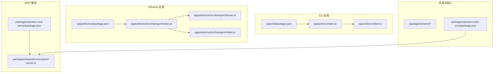
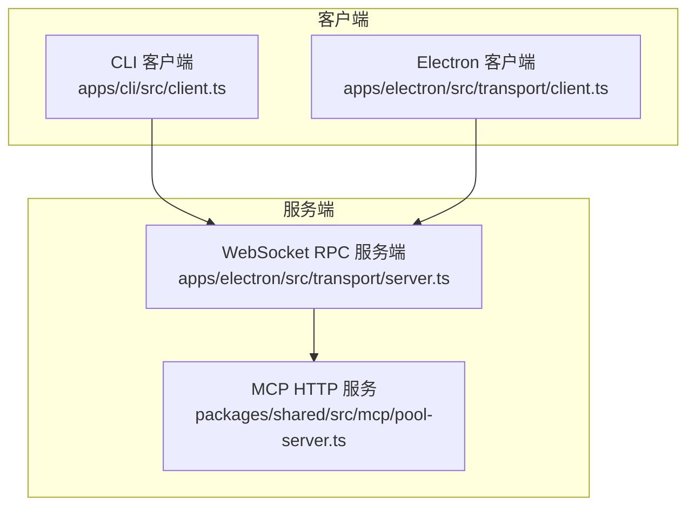
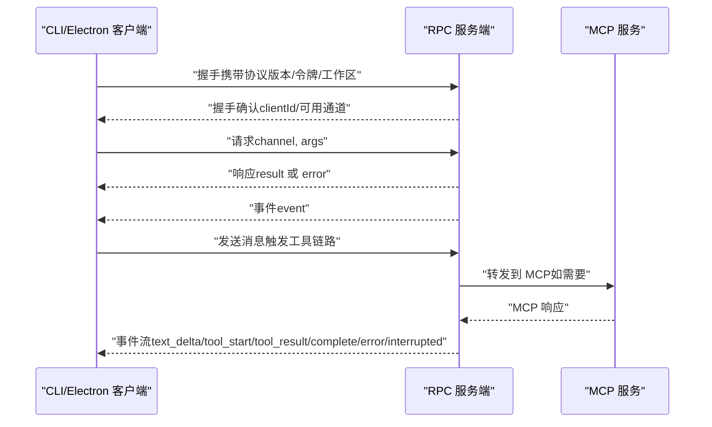
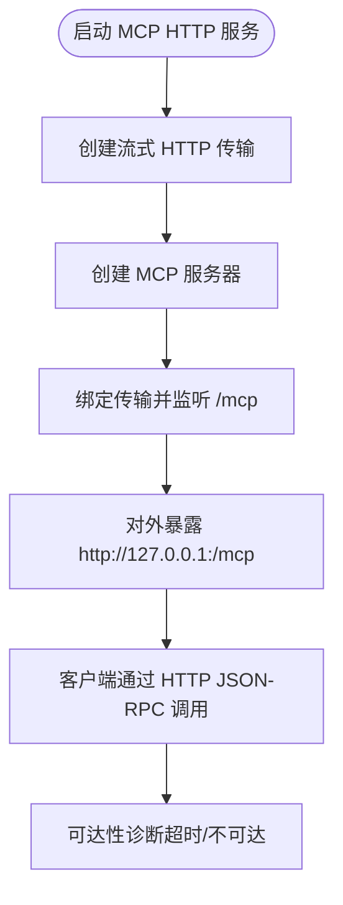
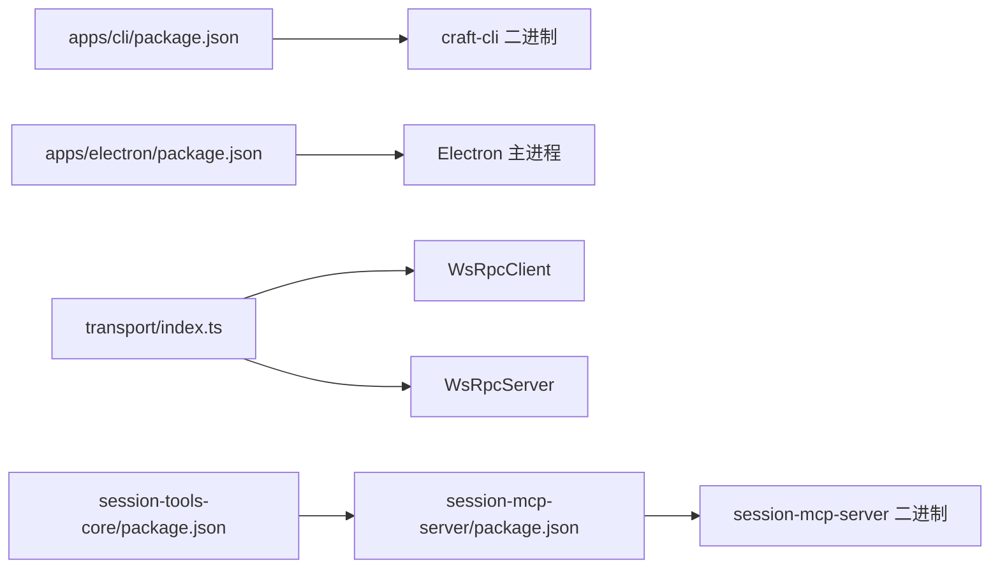

# API 参考

<cite>
**本文引用的文件**
- [apps/cli/src/index.ts](file://apps/cli/src/index.ts)
- [apps/cli/src/client.ts](file://apps/cli/src/client.ts)
- [apps/electron/src/transport/index.ts](file://apps/electron/src/transport/index.ts)
- [apps/electron/src/transport/server.ts](file://apps/electron/src/transport/server.ts)
- [apps/electron/src/transport/client.ts](file://apps/electron/src/transport/client.ts)
- [apps/cli/package.json](file://apps/cli/package.json)
- [apps/electron/package.json](file://apps/electron/package.json)
- [packages/session-mcp-server/package.json](file://packages/session-mcp-server/package.json)
- [packages/session-tools-core/package.json](file://packages/session-tools-core/package.json)
- [packages/shared/src/mcp/pool-server.ts](file://packages/shared/src/mcp/pool-server.ts)
- [packages/shared/src/agent/diagnostics.ts](file://packages/shared/src/agent/diagnostics.ts)
</cite>

## 目录

1. [简介](#简介)
2. [项目结构](#项目结构)
3. [核心组件](#核心组件)
4. [架构总览](#架构总览)
5. [详细组件分析](#详细组件分析)
6. [依赖关系分析](#依赖关系分析)
7. [性能考量](#性能考量)
8. [故障排查指南](#故障排查指南)
9. [结论](#结论)
10. [附录](#附录)

## 简介

本文件为 Craft Agents 的 API 参考文档，覆盖以下方面：

- WebSocket RPC API：连接握手、消息编解码、事件推送与实时交互模式
- MCP（Model Context Protocol）协议 API：会话级工具接口、请求/响应格式与流式传输
- CLI 命令行接口：命令语法、参数说明、返回值与使用示例
- 安全、速率限制、版本信息与常见用例
- 客户端实现指南、性能优化技巧、调试与监控方法
- 已弃用功能与迁移建议（如适用）

## 项目结构

本仓库采用多包工作区结构，核心与传输层位于 packages，应用层包括桌面端 Electron 应用与 CLI 工具，以及 MCP 服务相关包。

图表来源

- [apps/cli/package.json](file://apps/cli/package.json#L1-L25)
- [apps/cli/src/index.ts](file://apps/cli/src/index.ts#L1-L150)
- [apps/cli/src/client.ts](file://apps/cli/src/client.ts#L1-L120)
- [apps/electron/src/transport/index.ts](file://apps/electron/src/transport/index.ts#L1-L6)
- [apps/electron/src/transport/server.ts](file://apps/electron/src/transport/server.ts#L1-L2)
- [apps/electron/src/transport/client.ts](file://apps/electron/src/transport/client.ts#L1-L120)
- [packages/session-mcp-server/package.json](file://packages/session-mcp-server/package.json#L1-L25)
- [packages/shared/src/mcp/pool-server.ts](file://packages/shared/src/mcp/pool-server.ts#L40-L83)

章节来源

- [apps/cli/package.json](file://apps/cli/package.json#L1-L25)
- [apps/electron/package.json](file://apps/electron/package.json#L1-L80)
- [packages/session-mcp-server/package.json](file://packages/session-mcp-server/package.json#L1-L25)
- [packages/session-tools-core/package.json](file://packages/session-tools-core/package.json#L1-L24)

## 核心组件

- WebSocket RPC 客户端与服务端
  - CLI 使用轻量 RPC 客户端，仅支持握手、请求/响应与事件订阅
  - Electron 提供完整 RPC 客户端，具备自动重连、能力协商、连接状态管理等
- MCP 协议服务
  - 通过 HTTP 流式传输提供 MCP 接口，支持无状态会话
  - 与会话级工具集成，提供 SubmitPlan、config_validate 等能力
- CLI 命令行工具
  - 支持连接、健康检查、列出资源、发送消息、监听事件、运行一次性任务等

章节来源

- [apps/cli/src/client.ts](file://apps/cli/src/client.ts#L38-L129)
- [apps/electron/src/transport/client.ts](file://apps/electron/src/transport/client.ts#L101-L151)
- [packages/shared/src/mcp/pool-server.ts](file://packages/shared/src/mcp/pool-server.ts#L40-L83)
- [apps/cli/src/index.ts](file://apps/cli/src/index.ts#L240-L744)

## 架构总览

下图展示 WebSocket RPC 与 MCP 的整体交互关系，以及 CLI/Electron 客户端如何与服务端通信。

图表来源

- [apps/cli/src/client.ts](file://apps/cli/src/client.ts#L60-L129)
- [apps/electron/src/transport/client.ts](file://apps/electron/src/transport/client.ts#L263-L334)
- [apps/electron/src/transport/server.ts](file://apps/electron/src/transport/server.ts#L1-L2)
- [packages/shared/src/mcp/pool-server.ts](file://packages/shared/src/mcp/pool-server.ts#L61-L83)

## 详细组件分析

### WebSocket RPC API（CLI 与 Electron）

- 连接与握手
  - 客户端在连接建立后发送握手包，包含协议版本、可选令牌与工作区标识
  - 服务端返回握手确认或错误，随后进入消息路由阶段
- 消息编解码
  - 使用统一的消息信封进行序列化/反序列化
  - 请求/响应、事件与错误均以信封形式承载
- 事件与实时交互
  - 客户端订阅频道事件，按事件类型进行增量输出（如文本增量、工具调用开始/结果、完成/中断/错误）
- 错误与超时
  - 握手超时、请求超时、网络异常、鉴权失败、协议不兼容等均有明确错误分类
  - CLI 客户端提供连接与请求超时配置；Electron 客户端支持自动重连与连接状态回调

图表来源

- [apps/cli/src/client.ts](file://apps/cli/src/client.ts#L60-L129)
- [apps/electron/src/transport/client.ts](file://apps/electron/src/transport/client.ts#L387-L471)
- [packages/shared/src/mcp/pool-server.ts](file://packages/shared/src/mcp/pool-server.ts#L61-L83)

章节来源

- [apps/cli/src/client.ts](file://apps/cli/src/client.ts#L38-L239)
- [apps/electron/src/transport/client.ts](file://apps/electron/src/transport/client.ts#L101-L727)
- [apps/electron/src/transport/server.ts](file://apps/electron/src/transport/server.ts#L1-L2)

### MCP 协议 API（会话级工具）

- 服务启动
  - 通过 HTTP 流式传输启动 MCP 服务，无状态模式下不维护会话状态
  - 返回本地地址供客户端连接
- 请求/响应格式
  - 基于 JSON-RPC 2.0，支持请求超时与取消通知
  - 结果解析包含严格校验，失败时抛出带错误码的异常
- 典型工具
  - SubmitPlan、config_validate 等会话级工具通过 MCP 暴露
- 诊断与可达性
  - 提供 MCP 服务器可达性检测，区分超时与不可达场景

图表来源

- [packages/session-mcp-server/package.json](file://packages/session-mcp-server/package.json#L1-L25)
- [packages/shared/src/mcp/pool-server.ts](file://packages/shared/src/mcp/pool-server.ts#L61-L83)
- [packages/shared/src/agent/diagnostics.ts](file://packages/shared/src/agent/diagnostics.ts#L358-L388)

章节来源

- [packages/session-mcp-server/package.json](file://packages/session-mcp-server/package.json#L1-L25)
- [packages/session-tools-core/package.json](file://packages/session-tools-core/package.json#L1-L24)
- [packages/shared/src/mcp/pool-server.ts](file://packages/shared/src/mcp/pool-server.ts#L40-L83)
- [packages/shared/src/agent/diagnostics.ts](file://packages/shared/src/agent/diagnostics.ts#L358-L388)

### CLI 命令参考

- 命令概览
  - ping、health、versions、workspaces、sessions、connections、sources、session messages、session create/delete、send、run、cancel、invoke、listen、validate
- 参数与行为要点
  - 支持从环境变量回退配置（如服务器 URL、令牌、TLS CA、LLM 提供商与密钥）
  - send/run 支持流式输出与超时控制；run 可自动拉起本地服务并清理
  - listen 可持续监听指定频道事件并以 JSON 输出
  - validate 执行端到端验证流程，支持禁用旋转器与 JSON 输出
- 示例（语法）
  - 连接并列出工作区：craft-cli --url ws://127.0.0.1:8080 --token <token> workspaces
  - 发送消息并流式输出：craft-cli --url ws://127.0.0.1:8080 send <session-id> "<prompt>"
  - 一次性运行并清理：craft-cli --url ws://127.0.0.1:8080 --provider anthropic --model <model> --api-key <key> run "<prompt>"

章节来源

- [apps/cli/src/index.ts](file://apps/cli/src/index.ts#L42-L152)
- [apps/cli/src/index.ts](file://apps/cli/src/index.ts#L241-L744)
- [apps/cli/src/client.ts](file://apps/cli/src/client.ts#L38-L129)

## 依赖关系分析

- 包导出与入口
  - Electron 传输层导出 RPC 服务端与客户端，并提供构建 API 的工具
  - CLI 与 Electron 均依赖共享协议与传输编解码模块
- MCP 服务依赖
  - session-mcp-server 依赖 session-tools-core 与 MCP SDK
- 版本与脚本
  - 各包版本统一，CLI 与 Electron 提供构建与测试脚本

图表来源

- [apps/cli/package.json](file://apps/cli/package.json#L1-L25)
- [apps/electron/package.json](file://apps/electron/package.json#L1-L80)
- [apps/electron/src/transport/index.ts](file://apps/electron/src/transport/index.ts#L1-L6)
- [packages/session-mcp-server/package.json](file://packages/session-mcp-server/package.json#L1-L25)
- [packages/session-tools-core/package.json](file://packages/session-tools-core/package.json#L1-L24)

章节来源

- [apps/cli/package.json](file://apps/cli/package.json#L1-L25)
- [apps/electron/package.json](file://apps/electron/package.json#L1-L80)
- [apps/electron/src/transport/index.ts](file://apps/electron/src/transport/index.ts#L1-L6)

## 性能考量

- 连接与重连
  - Electron 客户端支持指数回退自动重连，避免频繁抖动
  - CLI 客户端无自动重连，适合短任务与批处理
- 超时设置
  - 握手超时、请求超时、发送超时均可配置，避免长时间阻塞
- 流式输出
  - send/run 命令支持增量事件输出，降低首字延迟感知
- 资源清理
  - run 命令默认清理临时会话，可通过开关关闭

章节来源

- [apps/electron/src/transport/client.ts](file://apps/electron/src/transport/client.ts#L571-L589)
- [apps/cli/src/index.ts](file://apps/cli/src/index.ts#L490-L504)
- [apps/cli/src/index.ts](file://apps/cli/src/index.ts#L653-L662)

## 故障排查指南

- 连接问题
  - 鉴权失败、协议版本不兼容、握手超时、网络异常、远端主动关闭
  - Electron 客户端提供连接状态回调与错误分类；CLI 客户端提供连接/请求超时错误
- MCP 问题
  - 通过可达性诊断判断超时或不可达；检查本地端口与防火墙
- 日志与诊断
  - 使用 listen 命令监听事件，结合 JSON 输出定位问题
  - validate 命令执行端到端自检，输出详细失败原因

章节来源

- [apps/electron/src/transport/client.ts](file://apps/electron/src/transport/client.ts#L697-L726)
- [packages/shared/src/agent/diagnostics.ts](file://packages/shared/src/agent/diagnostics.ts#L358-L388)
- [apps/cli/src/index.ts](file://apps/cli/src/index.ts#L664-L691)

## 结论

本参考文档梳理了 Craft Agents 的 WebSocket RPC 与 MCP 协议接口、CLI 命令行工具及其实现细节。通过统一的协议版本与消息编解码，CLI 与 Electron 客户端能够稳定地与服务端交互；MCP 服务通过 HTTP 流式传输提供会话级工具能力。建议在生产环境中合理配置超时与重连策略，并利用内置诊断与监听工具进行问题定位与性能优化。

## 附录

- 版本信息
  - CLI 与 Electron 应用版本：0.7.1
  - MCP 服务与工具包版本：0.7.1
- 安全与 TLS
  - CLI 支持通过 --tls-ca 指定 CA 文件；建议在生产中使用 wss:// 并正确配置证书
- 速率限制
  - 未发现显式的速率限制实现；建议在客户端侧实现请求节流与并发控制
- 已弃用与兼容性
  - 未发现明确的弃用功能说明；建议关注协议版本字段与错误码以确保兼容性

章节来源

- [apps/cli/package.json](file://apps/cli/package.json#L1-L25)
- [apps/electron/package.json](file://apps/electron/package.json#L1-L80)
- [packages/session-mcp-server/package.json](file://packages/session-mcp-server/package.json#L1-L25)
- [packages/session-tools-core/package.json](file://packages/session-tools-core/package.json#L1-L24)
