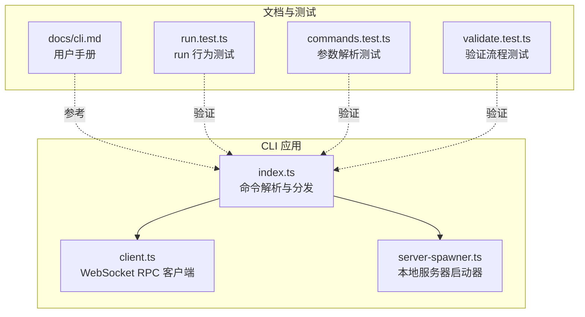
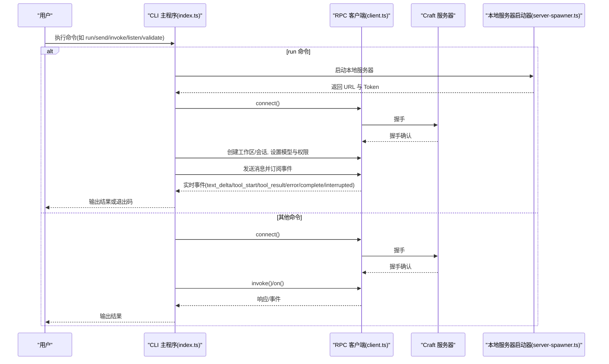
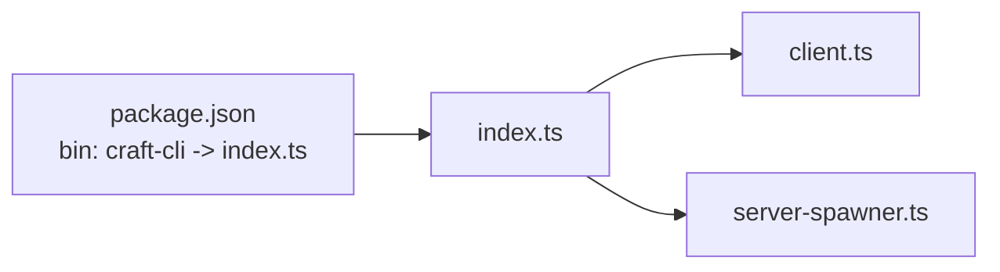

# CLI 命令参考

<cite>
**本文引用的文件**
- [apps/cli/src/index.ts](file://apps/cli/src/index.ts)
- [apps/cli/src/client.ts](file://apps/cli/src/client.ts)
- [apps/cli/src/server-spawner.ts](file://apps/cli/src/server-spawner.ts)
- [apps/cli/src/run.test.ts](file://apps/cli/src/run.test.ts)
- [apps/cli/src/commands.test.ts](file://apps/cli/src/commands.test.ts)
- [apps/cli/src/validate.test.ts](file://apps/cli/src/validate.test.ts)
- [apps/cli/package.json](file://apps/cli/package.json)
- [docs/cli.md](file://docs/cli.md)
</cite>

## 目录

1. [简介](#简介)
2. [项目结构](#项目结构)
3. [核心组件](#核心组件)
4. [架构总览](#架构总览)
5. [详细组件分析](#详细组件分析)
6. [依赖关系分析](#依赖关系分析)
7. [性能与并发特性](#性能与并发特性)
8. [使用与示例](#使用与示例)
9. [参数与环境变量优先级](#参数与环境变量优先级)
10. [服务器模式与客户端模式](#服务器模式与客户端模式)
11. [输出格式、日志与调试](#输出格式日志与调试)
12. [常见使用模式与自动化](#常见使用模式与自动化)
13. [故障排除与诊断](#故障排除与诊断)
14. [版本兼容性与迁移](#版本兼容性与迁移)
15. [结论](#结论)

## 简介

craft-cli 是 Craft Agents 的终端客户端，通过 WebSocket 连接到运行中的 Craft Agent 服务器，提供资源查询、会话管理、消息发送（实时流式）、服务器健康检查以及自包含的“run”命令等能力。它支持在本地自动启动一个无头服务器进行一次性任务执行，并提供验证服务器连通性和功能的多步骤测试流程。

## 项目结构

- CLI 核心入口与命令分发：apps/cli/src/index.ts
- WebSocket RPC 客户端：apps/cli/src/client.ts
- 本地服务器启动器：apps/cli/src/server-spawner.ts
- 文档与示例：docs/cli.md
- 测试用例覆盖参数解析、run 行为、验证流程等：apps/cli/src/run.test.ts、apps/cli/src/commands.test.ts、apps/cli/src/validate.test.ts
- 包元数据与可执行入口：apps/cli/package.json

图表来源

- [apps/cli/src/index.ts](file://apps/cli/src/index.ts#L1291-L1400)
- [apps/cli/src/client.ts](file://apps/cli/src/client.ts#L38-L240)
- [apps/cli/src/server-spawner.ts](file://apps/cli/src/server-spawner.ts#L55-L145)
- [docs/cli.md](file://docs/cli.md#L1-L241)
- [apps/cli/src/run.test.ts](file://apps/cli/src/run.test.ts#L176-L254)
- [apps/cli/src/commands.test.ts](file://apps/cli/src/commands.test.ts#L8-L228)
- [apps/cli/src/validate.test.ts](file://apps/cli/src/validate.test.ts#L238-L324)

章节来源

- [apps/cli/src/index.ts](file://apps/cli/src/index.ts#L1-L1406)
- [apps/cli/src/client.ts](file://apps/cli/src/client.ts#L1-L240)
- [apps/cli/src/server-spawner.ts](file://apps/cli/src/server-spawner.ts#L1-L145)
- [apps/cli/package.json](file://apps/cli/package.json#L1-L25)
- [docs/cli.md](file://docs/cli.md#L1-L241)

## 核心组件

- 命令解析与主流程：负责解析命令行参数、设置 TLS CA、根据命令选择执行分支（run/validate/其他）。
- WebSocket RPC 客户端：封装握手、请求/响应、事件订阅、超时与销毁逻辑。
- 本地服务器启动器：以子进程方式启动无头服务器，解析其标准输出中的地址与令牌，提供停止能力。
- 参数解析测试与验证流程测试：确保命令行为与文档一致。

章节来源

- [apps/cli/src/index.ts](file://apps/cli/src/index.ts#L42-L152)
- [apps/cli/src/client.ts](file://apps/cli/src/client.ts#L38-L240)
- [apps/cli/src/server-spawner.ts](file://apps/cli/src/server-spawner.ts#L55-L145)
- [apps/cli/src/commands.test.ts](file://apps/cli/src/commands.test.ts#L8-L228)
- [apps/cli/src/validate.test.ts](file://apps/cli/src/validate.test.ts#L238-L324)

## 架构总览

CLI 通过 WebSocket 与服务器通信，采用 RPC 消息封装协议。run 命令会自动启动本地服务器，完成工作区与会话初始化后发送消息并流式输出结果；validate 命令执行 21 步集成测试，覆盖会话生命周期、工具使用、源与技能的创建/引用/删除等。

图表来源

- [apps/cli/src/index.ts](file://apps/cli/src/index.ts#L1291-L1400)
- [apps/cli/src/client.ts](file://apps/cli/src/client.ts#L61-L129)
- [apps/cli/src/server-spawner.ts](file://apps/cli/src/server-spawner.ts#L55-L145)

## 详细组件分析

### 命令解析与主流程

- 支持的全局参数与默认值：
  - --url/--token/--workspace/--timeout/--json/--tls-ca/--send-timeout
  - --source(可重复)/--mode/--output-format/--no-cleanup/--disable-spinner/--no-spinner
  - --server-entry/--workspace-dir
  - --provider/--model/--api-key/--base-url
- 命令类型：
  - run、validate、help/version、以及资源查询/会话操作/消息发送/取消/原始 RPC 调用/事件监听等。
- 服务器 URL 必填于除 run/validate 外的大多数命令；run/validate 可自启动服务器。
- TLS CA 通过 NODE_EXTRA_CA_CERTS 注入，影响后续 WebSocket 连接。

章节来源

- [apps/cli/src/index.ts](file://apps/cli/src/index.ts#L42-L152)
- [apps/cli/src/index.ts](file://apps/cli/src/index.ts#L1291-L1400)
- [apps/cli/src/commands.test.ts](file://apps/cli/src/commands.test.ts#L8-L228)

### WebSocket RPC 客户端

- 功能要点：
  - 握手阶段校验协议版本，建立连接后切换到普通消息处理。
  - 请求超时与断开清理，pending 请求统一拒绝。
  - 事件订阅与回调集合管理，事件去重与异常吞吐。
  - 提供 invoke/on/destroy/isConnected/clientId 等访问器。
- 错误处理：
  - 连接超时、握手拒绝、网络错误、关闭前未握手等均抛出明确错误。

章节来源

- [apps/cli/src/client.ts](file://apps/cli/src/client.ts#L38-L240)

### 本地服务器启动器

- 自动检测服务器入口文件，启动子进程，读取标准输出中的 CRAFT_SERVER_URL/CRAFT_SERVER_TOKEN。
- 支持启动超时、静默模式、自定义环境变量传递。
- 提供 stop 方法用于优雅终止子进程。

章节来源

- [apps/cli/src/server-spawner.ts](file://apps/cli/src/server-spawner.ts#L55-L145)

### run 命令（自包含）

- 行为概览：
  - 解析提示词（位置参数 + 可选 stdin），自动启动本地服务器，解析 URL/Token 并建立连接。
  - 可选注册工作区目录（--workspace-dir），自动切换工作区。
  - 若无 LLM 连接则按 provider/base-url/api-key 等自动创建并设为默认。
  - 创建会话（支持 --mode 与 --source 列表），可选设置模型，发送消息并流式输出。
  - 信号处理：SIGINT/SIGTERM 时尝试取消会话并清理；默认退出码映射：成功/错误/中断。
  - 清理策略：默认删除会话；可通过 --no-cleanup 关闭。
- 输出格式：
  - 默认文本流式输出；--output-format stream-json 时逐条输出事件 JSON。

章节来源

- [apps/cli/src/index.ts](file://apps/cli/src/index.ts#L578-L662)
- [apps/cli/src/index.ts](file://apps/cli/src/index.ts#L396-L464)
- [apps/cli/src/run.test.ts](file://apps/cli/src/run.test.ts#L176-L254)

### validate 命令（多步集成测试）

- 步骤清单（21 步）：
  - 连接握手、健康检查、系统版本、主目录、工作区列表、会话列表、LLM 连接列表、源列表、创建临时会话、读取消息历史、发送消息（纯文本流）、发送消息（工具使用）、创建临时源、发送消息引用源、发送消息创建技能、验证技能存在、发送消息引用技能、删除技能、删除源、删除会话、断开连接。
- 行为特征：
  - 在无工作区时自动创建临时工作区；在无 LLM 连接时从环境变量自动创建。
  - 对每个步骤记录状态、耗时与细节；失败不中断后续步骤；最终汇总通过/失败计数。
  - JSON 模式输出结构化结果；支持禁用旋转指示器。

章节来源

- [apps/cli/src/index.ts](file://apps/cli/src/index.ts#L824-L1061)
- [apps/cli/src/index.ts](file://apps/cli/src/index.ts#L1063-L1219)
- [apps/cli/src/validate.test.ts](file://apps/cli/src/validate.test.ts#L238-L324)

### 其他命令

- ping/health/versions：基础健康与版本信息查询。
- workspaces/sessions/connections/sources：资源列表。
- session create/messages/delete/cancel：会话生命周期与取消。
- send：发送消息并实时流式输出；支持从 stdin 读取。
- invoke/listen：原始 RPC 调用与事件订阅。

章节来源

- [apps/cli/src/index.ts](file://apps/cli/src/index.ts#L241-L744)
- [apps/cli/src/index.ts](file://apps/cli/src/index.ts#L1291-L1400)

## 依赖关系分析

- CLI 依赖共享协议与传输模块进行消息编解码。
- 运行时要求 Bun 环境；run/validate 依赖本地服务器入口文件自动发现。
- 包元数据定义了可执行入口 craft-cli。

图表来源

- [apps/cli/package.json](file://apps/cli/package.json#L7-L9)
- [apps/cli/src/index.ts](file://apps/cli/src/index.ts#L1-L10)
- [apps/cli/src/client.ts](file://apps/cli/src/client.ts#L8-L16)
- [apps/cli/src/server-spawner.ts](file://apps/cli/src/server-spawner.ts#L8-L9)

章节来源

- [apps/cli/package.json](file://apps/cli/package.json#L1-L25)

## 性能与并发特性

- 连接与请求超时：connectTimeout/requestTimeout 可配置，默认分别为 10 秒与 5 分钟（send 命令）。
- 事件流式输出：send 命令订阅 session:event，按事件类型增量输出，避免阻塞。
- 本地服务器启动：异步读取标准输出，超时则终止子进程。
- 信号处理：run 命令捕获 SIGINT/SIGTERM，尝试取消会话并清理，保证资源回收。

章节来源

- [apps/cli/src/client.ts](file://apps/cli/src/client.ts#L52-L58)
- [apps/cli/src/index.ts](file://apps/cli/src/index.ts#L48-L50)
- [apps/cli/src/index.ts](file://apps/cli/src/index.ts#L599-L608)
- [apps/cli/src/server-spawner.ts](file://apps/cli/src/server-spawner.ts#L88-L142)

## 使用与示例

- 快速试用（无需外部服务器）：
  - 设置提供商 API 密钥后直接运行 run 命令，自动启动本地服务器并返回结果。
- 常见命令组合：
  - run + 指定工作区目录与启用特定源。
  - run + 指定 provider/model/base-url。
  - send + 从 stdin 管道输入。
  - invoke/listen 用于调试与自动化。
- 文档示例与脚本模式：
  - 获取工作区 ID、统计会话数量、创建会话并发送消息、清理会话等。

章节来源

- [docs/cli.md](file://docs/cli.md#L29-L170)
- [apps/cli/src/index.ts](file://apps/cli/src/index.ts#L1225-L1284)

## 参数与环境变量优先级

- 命令行参数优先于环境变量：
  - --url/--token/--tls-ca 优先于 CRAFT_SERVER_URL/CRAFT_SERVER_TOKEN/CRAFT_TLS_CA
  - --provider/--model/--api-key/--base-url 优先于 LLM_PROVIDER/LLM_MODEL/LLM_API_KEY/LLM_BASE_URL
- 未显式提供时的回退：
  - run 命令在无 LLM 连接时会从对应提供商环境变量自动创建连接。
- TLS 自定义 CA：
  - --tls-ca 或 CRAFT_TLS_CA 将设置 NODE_EXTRA_CA_CERTS，影响后续 WebSocket 连接。

章节来源

- [apps/cli/src/index.ts](file://apps/cli/src/index.ts#L142-L151)
- [apps/cli/src/index.ts](file://apps/cli/src/index.ts#L1294-L1297)
- [apps/cli/src/commands.test.ts](file://apps/cli/src/commands.test.ts#L55-L90)
- [apps/cli/src/validate.test.ts](file://apps/cli/src/validate.test.ts#L893-L907)

## 服务器模式与客户端模式

- 服务器模式（服务端已运行）：
  - 通过 --url/--token 连接现有服务器，执行资源查询、会话管理、消息发送、原始 RPC 调用与事件监听。
- 客户端模式（自包含 run/validate）：
  - run/validate 命令自动启动本地无头服务器，完成工作区与会话初始化后执行任务，适合一次性任务与 CI 场景。
- 混合使用：
  - 在服务器模式下使用 run/validate 作为快速验证与自包含任务执行手段。

章节来源

- [apps/cli/src/index.ts](file://apps/cli/src/index.ts#L1310-L1320)
- [apps/cli/src/index.ts](file://apps/cli/src/index.ts#L1322-L1392)
- [apps/cli/src/server-spawner.ts](file://apps/cli/src/server-spawner.ts#L36-L49)

## 输出格式、日志与调试

- 输出格式：
  - --json：机器可读 JSON 输出，便于脚本处理。
  - run 的 --output-format stream-json：逐条输出事件 JSON，便于实时解析。
- 日志与调试：
  - 服务器启动过程的标准错误输出可被继承（除非 quiet），便于查看调试日志。
  - validate 支持禁用旋转指示器（--no-spinner），并输出结构化结果。
- 事件流式输出：
  - send 命令订阅 session:event，输出 text_delta、tool_start/tool_result、error/complete/interrupted 等事件。

章节来源

- [apps/cli/src/index.ts](file://apps/cli/src/index.ts#L184-L192)
- [apps/cli/src/index.ts](file://apps/cli/src/index.ts#L404-L464)
- [apps/cli/src/index.ts](file://apps/cli/src/index.ts#L1082-L1152)
- [apps/cli/src/server-spawner.ts](file://apps/cli/src/server-spawner.ts#L72-L86)

## 常见使用模式与自动化

- CI/CD 集成：
  - 使用 run 命令在无服务器环境下执行一次性任务；通过 --workspace-dir 指定项目根目录；通过 --source 指定知识源；通过 --no-cleanup 控制会话清理。
- 脚本化：
  - 结合 jq 等工具对 --json 输出进行解析；批量列出工作区与会话；创建会话并发送消息；清理资源。
- 调试与监控：
  - 使用 invoke/listen 观察底层通道与事件；使用 validate 运行多步集成测试并输出结构化结果。

章节来源

- [docs/cli.md](file://docs/cli.md#L196-L216)
- [apps/cli/src/index.ts](file://apps/cli/src/index.ts#L1225-L1284)

## 故障排除与诊断

- 常见问题与修复建议：
  - 连接超时：检查服务器是否启动、URL 是否正确。
  - 认证失败：核对 CRAFT_SERVER_TOKEN 与服务器一致。
  - 协议版本不支持：更新 CLI 与服务器至相同版本。
  - TLS 证书问题：使用 --tls-ca 或 CRAFT_TLS_CA 指向自签 CA。
  - 无工作区：先通过桌面应用或 API 创建工作区。
- 诊断工具：
  - --validate-server：运行 21 步集成测试，定位问题步骤；支持 --json 输出结构化报告。
  - listen：订阅指定通道事件，观察实时推送。
  - invoke：直接调用任意通道，验证服务器能力。

章节来源

- [docs/cli.md](file://docs/cli.md#L232-L241)
- [apps/cli/src/index.ts](file://apps/cli/src/index.ts#L1291-L1400)

## 版本兼容性与迁移

- 包版本：参见包元数据中的版本号，CLI 通过 main/bin 指向入口文件。
- 协议版本：客户端握手时携带协议版本，若不匹配将报错。
- 迁移建议：
  - 更新 CLI 与服务器版本保持一致；
  - 如需自定义服务器入口，使用 --server-entry 指定；
  - 如需代理或自托管模型，使用 --base-url 与 --api-key。

章节来源

- [apps/cli/package.json](file://apps/cli/package.json#L2-L4)
- [apps/cli/src/client.ts](file://apps/cli/src/client.ts#L73-L79)

## 结论

craft-cli 提供了从基础健康检查到自包含任务执行的完整命令集，既可作为独立客户端连接现有服务器，也可在 run/validate 命令中自启动服务器完成一次性任务与集成测试。通过清晰的参数体系、事件流式输出与结构化 JSON，CLI 适用于脚本化、CI/CD 与日常运维场景。配合 validate 命令与 invoke/listen，可高效完成诊断与调试。
