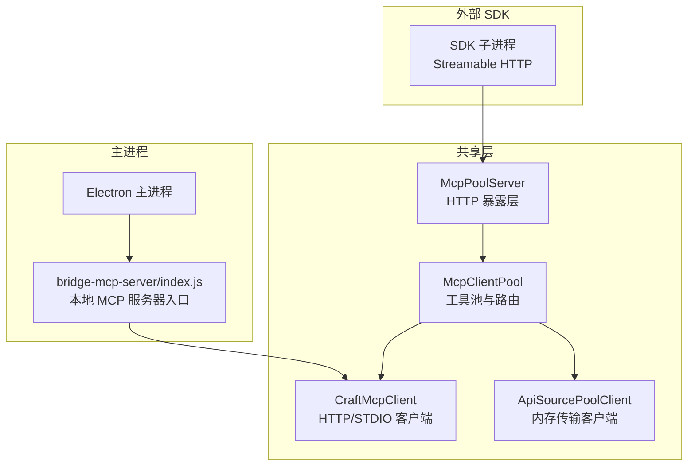
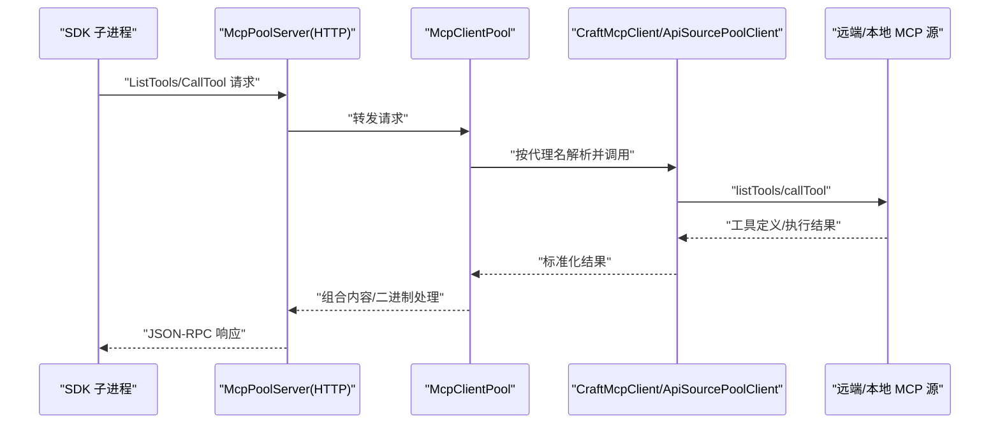
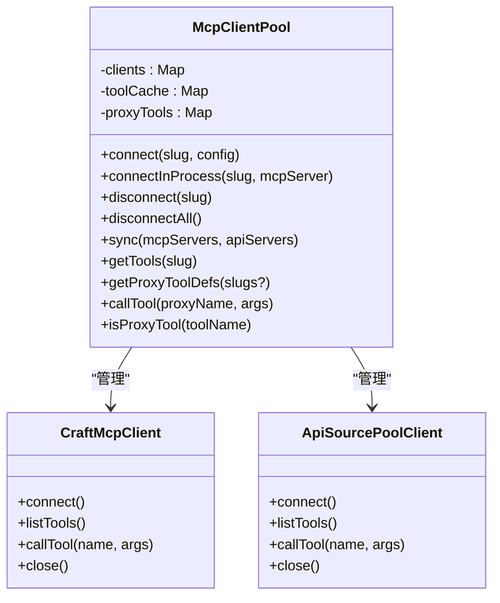
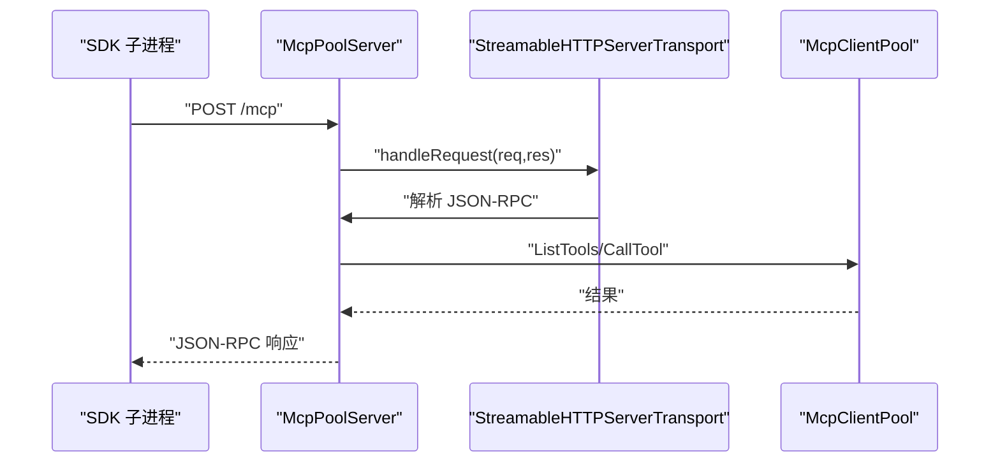
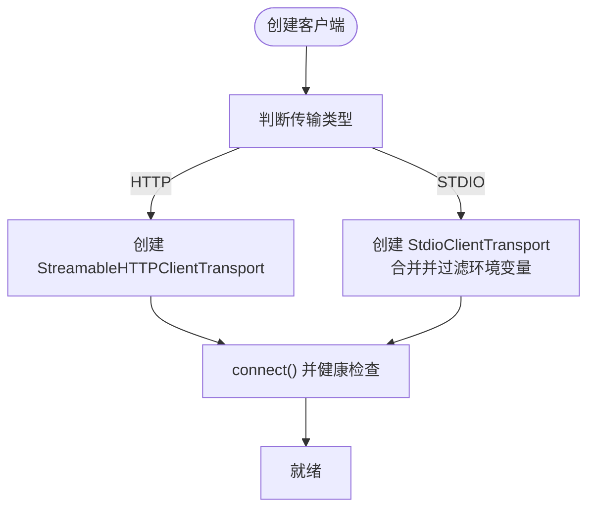
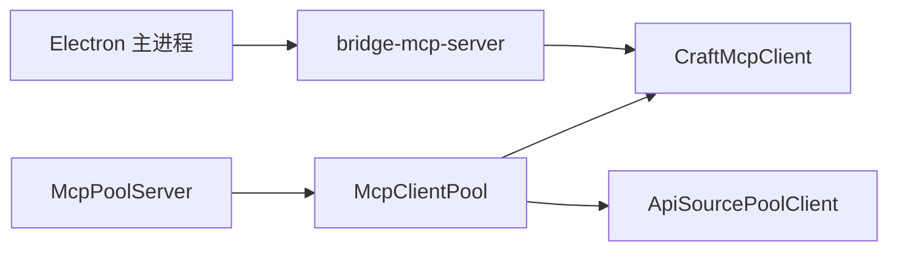

# MCP 协议 API

<cite>
**本文引用的文件**
- [packages/shared/src/mcp/mcp-pool.ts](file://packages/shared/src/mcp/mcp-pool.ts)
- [packages/shared/src/mcp/pool-server.ts](file://packages/shared/src/mcp/pool-server.ts)
- [packages/shared/src/mcp/client.ts](file://packages/shared/src/mcp/client.ts)
- [packages/shared/src/mcp/api-source-pool-client.ts](file://packages/shared/src/mcp/api-source-pool-client.ts)
- [apps/electron/resources/bridge-mcp-server/index.js](file://apps/electron/resources/bridge-mcp-server/index.js)
- [apps/electron/resources/scripts/docx_tool.py](file://apps/electron/resources/scripts/docx_tool.py)
- [apps/electron/resources/scripts/pdf_tool.py](file://apps/electron/resources/scripts/pdf_tool.py)
- [packages/shared/src/sources/server-builder.ts](file://packages/shared/src/sources/server-builder.ts)
- [packages/shared/src/agent/core/prompt-builder.ts](file://packages/shared/src/agent/core/prompt-builder.ts)
- [packages/shared/src/workspaces/storage.ts](file://packages/shared/src/workspaces/storage.ts)
- [packages/server-core/src/handlers/rpc/settings.ts](file://packages/server-core/src/handlers/rpc/settings.ts)
- [packages/shared/src/agent/pi-agent.ts](file://packages/shared/src/agent/pi-agent.ts)
</cite>

## 目录

1. [简介](#简介)
2. [项目结构](#项目结构)
3. [核心组件](#核心组件)
4. [架构总览](#架构总览)
5. [详细组件分析](#详细组件分析)
6. [依赖关系分析](#依赖关系分析)
7. [性能考量](#性能考量)
8. [故障排查指南](#故障排查指南)
9. [结论](#结论)
10. [附录](#附录)

## 简介

本文件为 Craft Agents 的 MCP（Model Context Protocol）协议 API 的权威文档，覆盖 MCP 服务器架构、工具注册机制与请求处理流程；记录可用的 MCP 方法、工具接口规范、请求与响应格式；包含工具发现、资源获取、提示生成等核心能力；提供本地 MCP 服务器配置、远程 MCP 服务器连接与工具执行示例；文档化工具脚本的调用方式、环境变量传递与输出格式；记录错误处理策略、超时与重试逻辑；涵盖安全考虑、权限控制与资源隔离；并提供工具开发指南、调试方法与性能优化建议。

## 项目结构

Craft Agents 将 MCP 能力集中在共享包中，并通过 Electron 主进程桥接本地 MCP 服务器与外部 SDK 子进程。核心模块包括：

- 共享层 MCP 客户端池：统一管理远端与本地 MCP 源，集中缓存工具清单与代理工具名映射，负责工具执行与结果归集。
- MCP 池服务器：在主进程中以 HTTP 形式暴露 MCP 服务，供外部 SDK 子进程通过 Streamable HTTP 协议访问池内工具。
- 客户端适配器：支持 HTTP 与 STDIO 两种传输，分别用于远程与本地 MCP 服务器。
- API 源客户端：将内部 McpServer 通过内存传输接入池，实现“API 源”与“MCP 源”的统一抽象。
- 工具脚本：Electron 资源目录下的 Python 工具脚本，作为本地 MCP 服务器使用。

图表来源

- [packages/shared/src/mcp/mcp-pool.ts](file://packages/shared/src/mcp/mcp-pool.ts#L78-L413)
- [packages/shared/src/mcp/pool-server.ts](file://packages/shared/src/mcp/pool-server.ts#L32-L178)
- [packages/shared/src/mcp/client.ts](file://packages/shared/src/mcp/client.ts#L72-L154)
- [packages/shared/src/mcp/api-source-pool-client.ts](file://packages/shared/src/mcp/api-source-pool-client.ts#L15-L53)
- [apps/electron/resources/bridge-mcp-server/index.js](file://apps/electron/resources/bridge-mcp-server/index.js#L1-L200)

章节来源

- [packages/shared/src/mcp/mcp-pool.ts](file://packages/shared/src/mcp/mcp-pool.ts#L1-L414)
- [packages/shared/src/mcp/pool-server.ts](file://packages/shared/src/mcp/pool-server.ts#L1-L179)
- [packages/shared/src/mcp/client.ts](file://packages/shared/src/mcp/client.ts#L1-L154)
- [packages/shared/src/mcp/api-source-pool-client.ts](file://packages/shared/src/mcp/api-source-pool-client.ts#L1-L53)
- [apps/electron/resources/bridge-mcp-server/index.js](file://apps/electron/resources/bridge-mcp-server/index.js#L1-L200)

## 核心组件

- MCP 客户端池（McpClientPool）
  - 统一管理远端与本地 MCP 源，缓存工具清单，构建代理工具命名空间（mcp**{slug}**{toolName}），集中执行工具并处理二进制与大响应。
- MCP 池服务器（McpPoolServer）
  - 在主进程中启动 HTTP 服务器，使用 Streamable HTTP 传输，将池内工具以无前缀名称暴露给外部 SDK 子进程。
- MCP 客户端（CraftMcpClient）
  - 支持 HTTP 与 STDIO 两种传输；连接后进行健康检查；封装 listTools 与 callTool。
- API 源客户端（ApiSourcePoolClient）
  - 通过内存传输连接内部 McpServer，实现“API 源”与“MCP 源”的统一接口。
- 本地 MCP 服务器入口（bridge-mcp-server/index.js）
  - Electron 资源中的本地 MCP 服务器入口，配合 STDIO 传输运行本地工具脚本。
- 工具脚本（Python）
  - docx_tool.py、pdf_tool.py 等，作为本地 MCP 服务器的工具实现，遵循 MCP 协议规范。

章节来源

- [packages/shared/src/mcp/mcp-pool.ts](file://packages/shared/src/mcp/mcp-pool.ts#L78-L413)
- [packages/shared/src/mcp/pool-server.ts](file://packages/shared/src/mcp/pool-server.ts#L32-L178)
- [packages/shared/src/mcp/client.ts](file://packages/shared/src/mcp/client.ts#L72-L154)
- [packages/shared/src/mcp/api-source-pool-client.ts](file://packages/shared/src/mcp/api-source-pool-client.ts#L15-L53)
- [apps/electron/resources/bridge-mcp-server/index.js](file://apps/electron/resources/bridge-mcp-server/index.js#L1-L200)
- [apps/electron/resources/scripts/docx_tool.py](file://apps/electron/resources/scripts/docx_tool.py#L1-L391)
- [apps/electron/resources/scripts/pdf_tool.py](file://apps/electron/resources/scripts/pdf_tool.py#L1-L800)

## 架构总览

MCP 架构采用“主进程池 + 外部子进程”的模式：

- 外部 SDK 子进程通过 Streamable HTTP 协议连接到主进程的 McpPoolServer。
- McpPoolServer 将请求转发至 McpClientPool，后者根据代理工具名映射到具体源（远端或本地）。
- 远端源使用 HTTP 传输，本地源使用 STDIO 传输（由 Electron 主进程启动本地 MCP 服务器）。
- 工具执行结果统一处理：文本内容提取、二进制保存、大响应保护与摘要回调。

图表来源

- [packages/shared/src/mcp/pool-server.ts](file://packages/shared/src/mcp/pool-server.ts#L107-L143)
- [packages/shared/src/mcp/mcp-pool.ts](file://packages/shared/src/mcp/mcp-pool.ts#L324-L405)
- [packages/shared/src/mcp/client.ts](file://packages/shared/src/mcp/client.ts#L129-L145)
- [packages/shared/src/mcp/api-source-pool-client.ts](file://packages/shared/src/mcp/api-source-pool-client.ts#L35-L44)

## 详细组件分析

### 组件 A：McpClientPool（工具池与路由）

- 功能要点
  - 注册与同步：支持连接远端 HTTP/SSE/stdio 与本地 API 源；过滤禁用的本地 MCP；断开旧源、连接新源。
  - 工具发现：缓存每个源的工具清单；生成代理工具定义（mcp**{slug}**{toolName}）。
  - 工具执行：按代理名路由到对应源；处理文本/二进制内容块；保存二进制到会话目录；大响应保护与摘要回调。
  - 生命周期：连接/断开/全部断开；工具变更通知。
- 关键数据结构
  - clients：源标识到 PoolClient 的映射。
  - toolCache：源标识到工具数组的映射。
  - proxyTools：代理工具名到 {slug, originalName} 的映射。
- 性能与安全
  - 通过会话路径与二进制检测避免大响应直接回传；支持摘要回调减少上下文膨胀。
  - 过滤敏感环境变量，防止泄露到本地 MCP 子进程。

图表来源

- [packages/shared/src/mcp/mcp-pool.ts](file://packages/shared/src/mcp/mcp-pool.ts#L78-L413)
- [packages/shared/src/mcp/client.ts](file://packages/shared/src/mcp/client.ts#L72-L154)
- [packages/shared/src/mcp/api-source-pool-client.ts](file://packages/shared/src/mcp/api-source-pool-client.ts#L15-L53)

章节来源

- [packages/shared/src/mcp/mcp-pool.ts](file://packages/shared/src/mcp/mcp-pool.ts#L78-L413)

### 组件 B：McpPoolServer（HTTP 暴露层）

- 功能要点
  - 启动 HTTP 服务器（随机端口），仅接受 /mcp 路径请求。
  - 使用 Streamable HTTP 传输，无状态模式（无会话跟踪）。
  - 注册 ListTools 与 CallTool 请求处理器：前者返回去前缀的工具名；后者将工具名补回前缀后交由池执行。
- 交互流程
  - 外部 SDK 子进程发起 HTTP 请求，经由传输层进入 McpPoolServer，再由池执行并返回结果。

图表来源

- [packages/shared/src/mcp/pool-server.ts](file://packages/shared/src/mcp/pool-server.ts#L61-L96)
- [packages/shared/src/mcp/pool-server.ts](file://packages/shared/src/mcp/pool-server.ts#L107-L143)

章节来源

- [packages/shared/src/mcp/pool-server.ts](file://packages/shared/src/mcp/pool-server.ts#L32-L178)

### 组件 C：CraftMcpClient（HTTP/STDIO 客户端）

- 功能要点
  - 根据配置选择 HTTP 或 STDIO 传输。
  - 连接后进行健康检查（listTools）。
  - 提供 listTools 与 callTool 的封装。
- 安全与环境
  - STDIO 传输合并进程环境变量，但过滤敏感变量（如 AWS、GitHub、OpenAI 等密钥）。

图表来源

- [packages/shared/src/mcp/client.ts](file://packages/shared/src/mcp/client.ts#L77-L127)

章节来源

- [packages/shared/src/mcp/client.ts](file://packages/shared/src/mcp/client.ts#L72-L154)

### 组件 D：ApiSourcePoolClient（API 源客户端）

- 功能要点
  - 通过内存传输连接内部 McpServer，实现与远端 MCP 源一致的接口。
  - 用于将“API 源”无缝接入池管理。

章节来源

- [packages/shared/src/mcp/api-source-pool-client.ts](file://packages/shared/src/mcp/api-source-pool-client.ts#L15-L53)

### 组件 E：本地 MCP 服务器入口与工具脚本

- 本地 MCP 服务器入口（bridge-mcp-server/index.js）
  - Electron 资源中的本地 MCP 服务器入口，用于启动本地工具脚本。
- 工具脚本（Python）
  - docx_tool.py：创建/模板填充/信息提取/查找替换等。
  - pdf_tool.py：组织、编辑、安全、转换等 PDF 操作。
  - 两者均通过 STDIO 与主进程通信，遵循 MCP 协议。

章节来源

- [apps/electron/resources/bridge-mcp-server/index.js](file://apps/electron/resources/bridge-mcp-server/index.js#L1-L200)
- [apps/electron/resources/scripts/docx_tool.py](file://apps/electron/resources/scripts/docx_tool.py#L1-L391)
- [apps/electron/resources/scripts/pdf_tool.py](file://apps/electron/resources/scripts/pdf_tool.py#L1-L800)

## 依赖关系分析

- 组件耦合
  - McpPoolServer 依赖 McpClientPool；McpClientPool 依赖 CraftMcpClient 与 ApiSourcePoolClient。
  - 本地 MCP 通过 STDIO 与 Electron 主进程交互，主进程再通过 CraftMcpClient 访问本地 MCP 服务器。
- 外部依赖
  - 使用 @modelcontextprotocol/sdk 的 Client/Server 与 Streamable HTTP/STDIO 传输。
- 可能的循环依赖
  - 当前结构清晰，未见循环依赖迹象。

图表来源

- [packages/shared/src/mcp/pool-server.ts](file://packages/shared/src/mcp/pool-server.ts#L32-L178)
- [packages/shared/src/mcp/mcp-pool.ts](file://packages/shared/src/mcp/mcp-pool.ts#L78-L413)
- [packages/shared/src/mcp/client.ts](file://packages/shared/src/mcp/client.ts#L72-L154)
- [packages/shared/src/mcp/api-source-pool-client.ts](file://packages/shared/src/mcp/api-source-pool-client.ts#L15-L53)
- [apps/electron/resources/bridge-mcp-server/index.js](file://apps/electron/resources/bridge-mcp-server/index.js#L1-L200)

章节来源

- [packages/shared/src/mcp/mcp-pool.ts](file://packages/shared/src/mcp/mcp-pool.ts#L78-L413)
- [packages/shared/src/mcp/pool-server.ts](file://packages/shared/src/mcp/pool-server.ts#L32-L178)
- [packages/shared/src/mcp/client.ts](file://packages/shared/src/mcp/client.ts#L72-L154)
- [packages/shared/src/mcp/api-source-pool-client.ts](file://packages/shared/src/mcp/api-source-pool-client.ts#L15-L53)
- [apps/electron/resources/bridge-mcp-server/index.js](file://apps/electron/resources/bridge-mcp-server/index.js#L1-L200)

## 性能考量

- 工具发现与缓存
  - 通过 toolCache 减少重复 listTools 调用；代理工具名映射避免每次解析。
- 结果处理
  - 文本内容优先提取；二进制内容落地到会话目录并返回描述；大响应通过 guardLargeResult 保护，必要时触发摘要回调。
- 传输与连接
  - HTTP 与 STDIO 传输均具备健康检查；池内连接复用，避免频繁重建。
- 本地 MCP
  - 仅在启用本地 MCP 时连接 stdio 源；可通过工作区配置与环境变量控制。

章节来源

- [packages/shared/src/mcp/mcp-pool.ts](file://packages/shared/src/mcp/mcp-pool.ts#L324-L405)
- [packages/shared/src/mcp/client.ts](file://packages/shared/src/mcp/client.ts#L111-L127)
- [packages/shared/src/workspaces/storage.ts](file://packages/shared/src/workspaces/storage.ts#L454-L469)

## 故障排查指南

- 连接失败
  - 健康检查失败：确认远端 MCP 服务可达、认证头正确；或本地 MCP 命令可执行且无权限问题。
- 工具不可见
  - 确认已通过 sync 正确注册源；检查代理工具命名是否符合 mcp**{slug}**{toolName}。
- 执行异常
  - 查看池执行返回的错误信息；关注二进制保存失败（磁盘空间/权限）与大响应保护触发。
- 本地 MCP 不生效
  - 检查工作区配置与环境变量 CRAFT_LOCAL_MCP_ENABLED；确保命令与参数正确。

章节来源

- [packages/shared/src/mcp/client.ts](file://packages/shared/src/mcp/client.ts#L111-L127)
- [packages/shared/src/mcp/mcp-pool.ts](file://packages/shared/src/mcp/mcp-pool.ts#L324-L405)
- [packages/shared/src/workspaces/storage.ts](file://packages/shared/src/workspaces/storage.ts#L454-L469)

## 结论

Craft Agents 的 MCP 架构通过统一的客户端池与主进程 HTTP 暴露层，实现了远端与本地 MCP 源的无缝集成；结合严格的环境变量过滤、二进制与大响应处理策略，既保证了安全性也兼顾了性能。工具脚本作为本地 MCP 服务器，提供了丰富的文档与 PDF 处理能力，满足多样化的自动化需求。

## 附录

### MCP 方法与请求/响应规范

- 方法
  - listTools：返回工具列表（去前缀后的名称、描述与输入模式）。
  - call_tool：按工具名执行，返回文本内容与错误标记。
- 请求格式
  - JSON-RPC 通过 Streamable HTTP 传输；请求体包含方法名与参数对象。
- 响应格式
  - 成功：包含 content（文本块数组）；错误：包含 isError 标记与错误消息。

章节来源

- [packages/shared/src/mcp/pool-server.ts](file://packages/shared/src/mcp/pool-server.ts#L114-L140)

### 工具注册与代理命名

- 代理命名规则：mcp**{slug}**{toolName}
- 注册流程：connect/connectInProcess → listTools → 缓存工具 → 构建 proxyTools 映射 → 通过 getProxyToolDefs 输出给后端。

章节来源

- [packages/shared/src/mcp/mcp-pool.ts](file://packages/shared/src/mcp/mcp-pool.ts#L129-L141)
- [packages/shared/src/mcp/mcp-pool.ts](file://packages/shared/src/mcp/mcp-pool.ts#L298-L314)

### 本地 MCP 服务器配置与连接

- 配置项
  - 本地 MCP 启用开关：工作区配置与环境变量 CRAFT_LOCAL_MCP_ENABLED。
  - stdio 源：命令、参数、环境变量（敏感变量会被过滤）。
- 连接示例
  - 通过 McpClientPool.connect(slug, { type: 'stdio', command, args, env }) 注册本地源。
  - 通过 McpPoolServer.start 获取 HTTP 地址供外部 SDK 子进程连接。

章节来源

- [packages/shared/src/workspaces/storage.ts](file://packages/shared/src/workspaces/storage.ts#L454-L469)
- [packages/shared/src/mcp/client.ts](file://packages/shared/src/mcp/client.ts#L84-L97)
- [packages/shared/src/mcp/pool-server.ts](file://packages/shared/src/mcp/pool-server.ts#L61-L96)

### 远程 MCP 服务器连接

- 配置项
  - HTTP/SSE 源：URL、认证头。
- 连接示例
  - 通过 McpClientPool.connect(slug, { type: 'http'/'sse', url, headers }) 注册远端源。

章节来源

- [packages/shared/src/mcp/client.ts](file://packages/shared/src/mcp/client.ts#L98-L108)
- [packages/shared/src/sources/server-builder.ts](file://packages/shared/src/sources/server-builder.ts#L298-L312)

### 工具执行与结果处理

- 执行流程
  - 外部 SDK 子进程 → McpPoolServer → McpClientPool → 源客户端 → MCP 源 → 结果回传。
- 结果处理
  - 文本块拼接；二进制块落地并返回描述；大响应保护与摘要回调。

章节来源

- [packages/shared/src/mcp/pool-server.ts](file://packages/shared/src/mcp/pool-server.ts#L129-L140)
- [packages/shared/src/mcp/mcp-pool.ts](file://packages/shared/src/mcp/mcp-pool.ts#L343-L398)

### 工具脚本调用方式与输出

- 调用方式
  - 通过 STDIO 与主进程通信；主进程以 MCP 协议解析请求并执行。
- 输出格式
  - 文本内容；二进制内容以 base64 数据块形式返回，必要时保存到会话目录。
- 示例
  - docx_tool.py：create/template/info/replace/extract 等命令。
  - pdf_tool.py：extract/info/merge/split/rotate/reorder/duplicate/watermark/fill-form/compress/crop/resize/flatten/header-footer 等命令。

章节来源

- [apps/electron/resources/scripts/docx_tool.py](file://apps/electron/resources/scripts/docx_tool.py#L117-L391)
- [apps/electron/resources/scripts/pdf_tool.py](file://apps/electron/resources/scripts/pdf_tool.py#L429-L800)

### 错误处理策略、超时与重试

- 错误处理
  - 健康检查失败、未知代理工具、源未连接、执行异常等均有明确错误返回。
- 超时与重试
  - 未见显式超时与重试逻辑；建议在上层调用侧按需实现。

章节来源

- [packages/shared/src/mcp/client.ts](file://packages/shared/src/mcp/client.ts#L111-L127)
- [packages/shared/src/mcp/mcp-pool.ts](file://packages/shared/src/mcp/mcp-pool.ts#L324-L405)

### 安全考虑、权限控制与资源隔离

- 环境变量过滤
  - STDIO 传输中过滤敏感变量（AWS、GitHub、OpenAI 等）。
- 权限控制
  - 工具执行前可在主进程进行权限审批（Pi Agent 中的代理工具执行流程）。
- 资源隔离
  - 本地 MCP 通过子进程运行；二进制与大响应落地到会话目录，避免污染主进程上下文。

章节来源

- [packages/shared/src/mcp/client.ts](file://packages/shared/src/mcp/client.ts#L43-L60)
- [packages/shared/src/agent/pi-agent.ts](file://packages/shared/src/agent/pi-agent.ts#L623-L655)

### 工具开发指南、调试方法与性能优化建议

- 开发指南
  - 遵循 MCP 协议规范；使用 STDIO 传输时注意环境变量注入与过滤。
- 调试方法
  - 使用工作区配置与环境变量控制本地 MCP；通过日志与错误信息定位问题。
- 性能优化
  - 复用连接、缓存工具清单、避免大响应直传、合理使用摘要回调。

章节来源

- [packages/shared/src/mcp/mcp-pool.ts](file://packages/shared/src/mcp/mcp-pool.ts#L324-L405)
- [packages/shared/src/workspaces/storage.ts](file://packages/shared/src/workspaces/storage.ts#L454-L469)
- [packages/server-core/src/handlers/rpc/settings.ts](file://packages/server-core/src/handlers/rpc/settings.ts#L112-L128)
