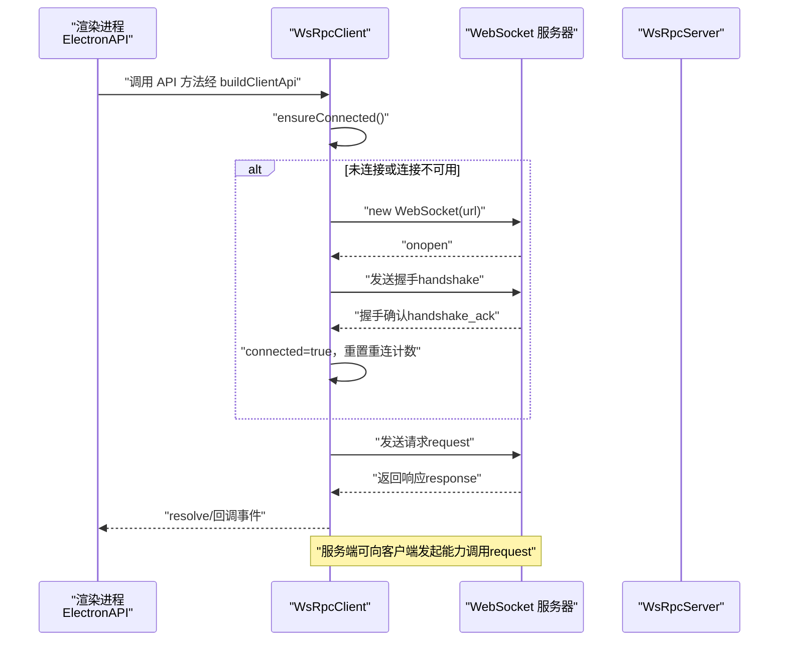
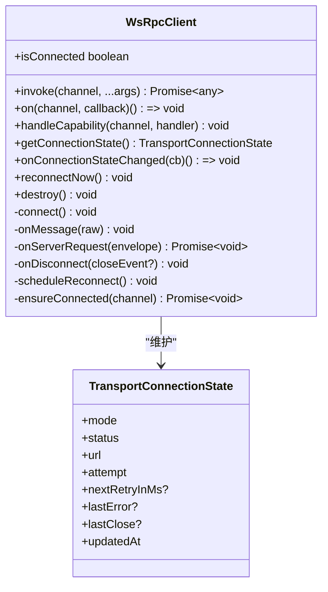
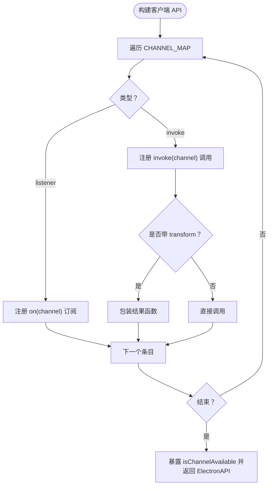
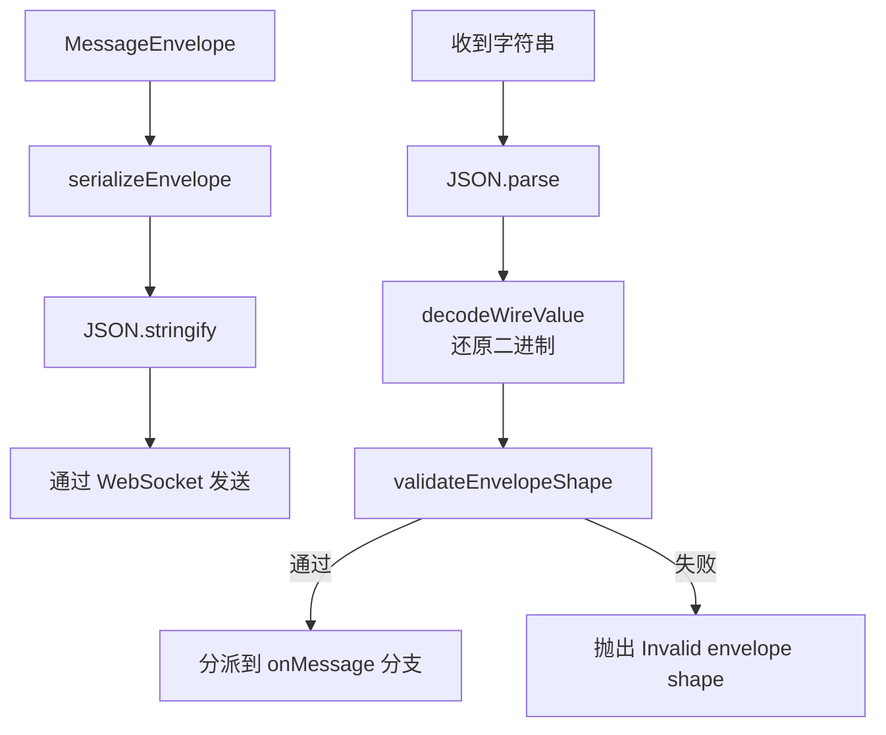
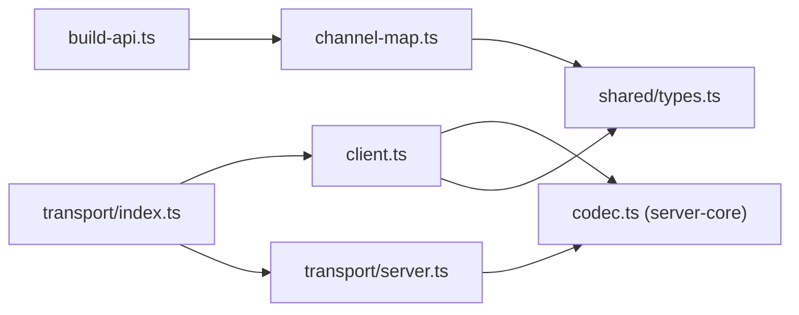

# WebSocket RPC API

<cite>
**本文引用的文件**
- [apps/electron/src/transport/index.ts](file://apps/electron/src/transport/index.ts)
- [apps/electron/src/transport/client.ts](file://apps/electron/src/transport/client.ts)
- [apps/electron/src/transport/server.ts](file://apps/electron/src/transport/server.ts)
- [apps/electron/src/transport/channel-map.ts](file://apps/electron/src/transport/channel-map.ts)
- [apps/electron/src/transport/build-api.ts](file://apps/electron/src/transport/build-api.ts)
- [apps/electron/src/transport/codec.ts](file://apps/electron/src/transport/codec.ts)
- [apps/electron/src/shared/types.ts](file://apps/electron/src/shared/types.ts)
- [packages/server-core/src/transport/codec.ts](file://packages/server-core/src/transport/codec.ts)
- [apps/electron/src/transport/__tests__/codec.test.ts](file://apps/electron/src/transport/__tests__/codec.test.ts)
</cite>

## 目录

1. [简介](#简介)
2. [项目结构](#项目结构)
3. [核心组件](#核心组件)
4. [架构总览](#架构总览)
5. [详细组件分析](#详细组件分析)
6. [依赖关系分析](#依赖关系分析)
7. [性能考量](#性能考量)
8. [故障排除指南](#故障排除指南)
9. [结论](#结论)
10. [附录](#附录)

## 简介

本文件为 Craft Agents 的 WebSocket RPC API 详细技术文档，覆盖连接建立流程、通道映射机制、消息编解码格式与事件类型，并系统阐述客户端与服务器之间的通信协议：握手过程、心跳机制、错误处理与重连策略；同时文档化所有可用的 RPC 方法、参数格式、返回值结构与错误码，提供连接示例、消息收发示例与常见使用场景，最后给出性能优化建议、连接池管理与并发处理策略、安全与认证、以及调试与故障排除方法。

## 项目结构

该 WebSocket RPC 能力位于 Electron 应用的 transport 层，核心由以下模块组成：

- 客户端实现：WsRpcClient（连接、握手、请求/响应、事件订阅、自动重连）
- 服务端导出：WsRpcServer（通过 server-core 导出）
- 通道映射：将高层 API 方法名映射到底层 RPC 通道
- 客户端 API 构建器：根据通道映射生成类型安全的客户端代理
- 编解码器：统一的消息封包与二进制编码/解码
- 类型与协议：共享协议与传输状态类型

```mermaid
graph TB
subgraph "Electron 渲染进程"
API["ElectronAPI 客户端代理<br/>buildClientApi()"]
Client["WsRpcClient<br/>连接/握手/重连/编解码"]
end
subgraph "主进程"
Server["WsRpcServer<br/>来自 server-core"]
end
subgraph "通道与协议"
Map["通道映射 CHANNEL_MAP<br/>channel-map.ts"]
Codec["消息编解码 codec.ts<br/>server-core/transport/codec.ts"]
Types["传输状态/错误类型<br/>shared/types.ts"]
end
API --> Client
Client <- --> Codec
Client --> Map
Client --> Types
Client --> Server
```

图表来源

- [apps/electron/src/transport/client.ts](file://apps/electron/src/transport/client.ts#L101-L728)
- [apps/electron/src/transport/channel-map.ts](file://apps/electron/src/transport/channel-map.ts#L1-L335)
- [apps/electron/src/transport/build-api.ts](file://apps/electron/src/transport/build-api.ts#L25-L66)
- [apps/electron/src/transport/codec.ts](file://apps/electron/src/transport/codec.ts#L1-L6)
- [apps/electron/src/shared/types.ts](file://apps/electron/src/shared/types.ts#L122-L161)
- [packages/server-core/src/transport/codec.ts](file://packages/server-core/src/transport/codec.ts#L1-L156)

章节来源

- [apps/electron/src/transport/index.ts](file://apps/electron/src/transport/index.ts#L1-L6)
- [apps/electron/src/transport/server.ts](file://apps/electron/src/transport/server.ts#L1-L2)

## 核心组件

- WsRpcClient：负责 WebSocket 连接、握手、请求/响应关联、事件订阅、能力调用、自动重连与连接状态管理
- 通道映射 CHANNEL_MAP：将高层 API 方法名映射到具体 RPC 通道，支持嵌套命名空间
- 客户端 API 构建器 buildClientApi：基于通道映射生成类型安全的 ElectronAPI 代理
- 消息编解码 codec：统一序列化/反序列化与二进制数据编码（Uint8Array 基于 Base64）
- 传输状态与错误类型：定义连接状态、错误分类与关闭信息

章节来源

- [apps/electron/src/transport/client.ts](file://apps/electron/src/transport/client.ts#L101-L728)
- [apps/electron/src/transport/channel-map.ts](file://apps/electron/src/transport/channel-map.ts#L1-L335)
- [apps/electron/src/transport/build-api.ts](file://apps/electron/src/transport/build-api.ts#L25-L66)
- [apps/electron/src/transport/codec.ts](file://apps/electron/src/transport/codec.ts#L1-L6)
- [apps/electron/src/shared/types.ts](file://apps/electron/src/shared/types.ts#L122-L161)

## 架构总览

下图展示了从渲染进程到主进程的 RPC 流程：客户端发起握手，建立连接后进行请求/响应与事件订阅，服务端可向客户端发起能力调用请求。



图表来源

- [apps/electron/src/transport/client.ts](file://apps/electron/src/transport/client.ts#L263-L471)
- [apps/electron/src/transport/server.ts](file://apps/electron/src/transport/server.ts#L1-L2)

## 详细组件分析

### WsRpcClient 组件

- 连接生命周期：构造、connect、握手、断开、自动重连
- 请求/响应：每个请求分配唯一 id，等待对应 response 或 error
- 事件订阅：注册 channel 对应的事件监听器
- 能力调用：服务端可向客户端发起能力调用（capability），客户端需注册处理器
- 错误分类：认证、协议、超时、网络、服务端、未知
- 重连策略：指数退避，上限配置



图表来源

- [apps/electron/src/transport/client.ts](file://apps/electron/src/transport/client.ts#L101-L728)
- [apps/electron/src/shared/types.ts](file://apps/electron/src/shared/types.ts#L152-L161)

章节来源

- [apps/electron/src/transport/client.ts](file://apps/electron/src/transport/client.ts#L101-L728)
- [apps/electron/src/shared/types.ts](file://apps/electron/src/shared/types.ts#L122-L161)

### 通道映射与客户端 API 构建

- 通道映射 CHANNEL_MAP：将高层方法名映射到 RPC 通道，支持 transform 包装结果，支持嵌套命名空间（如 browserPane.create）
- buildClientApi：根据映射生成 ElectronAPI 代理对象，暴露 isChannelAvailable 用于运行时检查



图表来源

- [apps/electron/src/transport/build-api.ts](file://apps/electron/src/transport/build-api.ts#L25-L66)
- [apps/electron/src/transport/channel-map.ts](file://apps/electron/src/transport/channel-map.ts#L1-L335)

章节来源

- [apps/electron/src/transport/build-api.ts](file://apps/electron/src/transport/build-api.ts#L25-L66)
- [apps/electron/src/transport/channel-map.ts](file://apps/electron/src/transport/channel-map.ts#L1-L335)

### 消息编解码与协议

- 消息类型：handshake、handshake_ack、request、response、event、error
- 封包结构：包含 id、type、channel（可选）、args/result/error（可选）、clientId（握手确认）
- 二进制编码：Uint8Array 在线路上以 { \_\_craftRpcType: 'u8', base64 } 形式传输
- 形状校验：validateEnvelopeShape 确保字段完整性与类型正确性



图表来源

- [packages/server-core/src/transport/codec.ts](file://packages/server-core/src/transport/codec.ts#L121-L155)
- [apps/electron/src/transport/**tests**/codec.test.ts](file://apps/electron/src/transport/__tests__/codec.test.ts#L1-L115)

章节来源

- [packages/server-core/src/transport/codec.ts](file://packages/server-core/src/transport/codec.ts#L1-L156)
- [apps/electron/src/transport/**tests**/codec.test.ts](file://apps/electron/src/transport/__tests__/codec.test.ts#L1-L115)

### 事件类型与通道

- 事件通道：如 sessions.EVENT、sessions.UNREAD_SUMMARY_CHANGED、window.CLOSE_REQUESTED 等
- 事件监听：通过 on(channel, callback) 注册，客户端内部维护 channel -> Set<回调> 映射
- 事件分发：收到 event 类型封包后按 channel 调用所有已注册回调

章节来源

- [apps/electron/src/transport/channel-map.ts](file://apps/electron/src/transport/channel-map.ts#L37-L103)
- [apps/electron/src/transport/client.ts](file://apps/electron/src/transport/client.ts#L455-L469)

### 错误处理与重连策略

- 连接错误分类：auth、protocol、timeout、network、server、unknown
- 关闭代码映射：如 4005(auth)、4004(protocol)、4001(timeout)、1006/1001(network)
- 超时：握手超时、请求超时（可配置）
- 自动重连：指数退避，最大延迟可配置，支持手动触发 reconnectNow

章节来源

- [apps/electron/src/transport/client.ts](file://apps/electron/src/transport/client.ts#L41-L726)

## 依赖关系分析

- 客户端依赖 server-core 的编解码器与传输接口
- 通道映射来源于共享常量 RPC_CHANNELS，确保客户端与服务端一致
- ElectronAPI 类型在 shared/types 中集中声明，保证编译期类型安全



图表来源

- [apps/electron/src/transport/client.ts](file://apps/electron/src/transport/client.ts#L9-L15)
- [apps/electron/src/transport/build-api.ts](file://apps/electron/src/transport/build-api.ts#L8-L9)
- [apps/electron/src/transport/channel-map.ts](file://apps/electron/src/transport/channel-map.ts#L8-L9)
- [apps/electron/src/transport/index.ts](file://apps/electron/src/transport/index.ts#L1-L6)
- [apps/electron/src/transport/server.ts](file://apps/electron/src/transport/server.ts#L1-L2)
- [apps/electron/src/shared/types.ts](file://apps/electron/src/shared/types.ts#L4-L4)

章节来源

- [apps/electron/src/transport/index.ts](file://apps/electron/src/transport/index.ts#L1-L6)
- [apps/electron/src/transport/client.ts](file://apps/electron/src/transport/client.ts#L9-L15)
- [apps/electron/src/transport/build-api.ts](file://apps/electron/src/transport/build-api.ts#L8-L9)
- [apps/electron/src/transport/channel-map.ts](file://apps/electron/src/transport/channel-map.ts#L8-L9)
- [apps/electron/src/shared/types.ts](file://apps/electron/src/shared/types.ts#L4-L4)

## 性能考量

- 请求超时与重试：合理设置 requestTimeout 与 maxReconnectDelay，避免长时间阻塞
- 二进制数据传输：利用内置的 Uint8Array 编解码，减少不必要的拷贝
- 事件风暴防护：事件监听器内部捕获异常，避免单个监听器崩溃影响整体
- 批量操作：对频繁事件（如文件变更）建议合并或节流
- 连接复用：同一会话尽量复用已有连接，避免重复握手
- 内存管理：销毁客户端时清理 pending 请求与定时器，防止内存泄漏

## 故障排除指南

- 握手失败
  - 检查协议版本与认证令牌
  - 查看连接状态 lastError 与错误分类
- 连接中断
  - 观察关闭代码（如 1006/1001 网络中断）
  - 确认自动重连是否生效
- 请求超时
  - 提高 requestTimeout 或优化服务端处理
  - 检查 pending 请求是否被正确清理
- 事件未到达
  - 确认监听器已注册且 channel 正确
  - 检查监听器内部异常被捕获
- 二进制数据异常
  - 确认封包形状校验通过
  - 检查 Base64 编码/解码逻辑

章节来源

- [apps/electron/src/transport/client.ts](file://apps/electron/src/transport/client.ts#L283-L295)
- [apps/electron/src/transport/client.ts](file://apps/electron/src/transport/client.ts#L511-L569)
- [apps/electron/src/transport/client.ts](file://apps/electron/src/transport/client.ts#L413-L428)
- [apps/electron/src/transport/**tests**/codec.test.ts](file://apps/electron/src/transport/__tests__/codec.test.ts#L1-L115)

## 结论

Craft Agents 的 WebSocket RPC API 通过清晰的通道映射、统一的编解码与完善的错误/重连机制，提供了稳定可靠的跨进程通信能力。结合类型安全的客户端代理与事件驱动模型，开发者可以高效地构建复杂交互功能。建议在生产环境中合理配置超时与重连参数，并关注二进制数据传输与事件风暴的性能影响。

## 附录

### 协议与消息格式

- 消息类型
  - handshake：客户端发起握手
  - handshake_ack：服务端确认握手并返回 clientId
  - request：客户端请求
  - response：服务端响应（含 result 或 error）
  - event：服务端推送事件
  - error：协议级错误（无对应请求）
- 字段规范
  - id：字符串，唯一标识一次请求
  - type：枚举值之一
  - channel：字符串，RPC 通道名（request/event 必填）
  - args：数组，请求参数
  - result：任意成功结果
  - error：{ code: string|number, message: string, data?: any }
  - clientId：握手确认返回的客户端标识
- 二进制数据
  - 通过 { \_\_craftRpcType: 'u8', base64 } 传输

章节来源

- [packages/server-core/src/transport/codec.ts](file://packages/server-core/src/transport/codec.ts#L7-L14)
- [packages/server-core/src/transport/codec.ts](file://packages/server-core/src/transport/codec.ts#L121-L155)

### 通道映射与可用 RPC 方法

- 会话管理：获取会话列表、未读摘要、创建/删除会话、发送消息、取消处理、权限/凭据响应等
- 工作区管理：获取工作区、创建、检查 slug
- 窗口管理：获取窗口工作区/模式、打开/切换/关闭窗口、交通灯按钮可见性
- 文件操作：读取文件/二进制/数据 URL、打开文件对话框、存储附件、生成缩略图
- 主题与系统：系统主题、版本信息、调试日志、自动更新、发布说明、外壳命令
- OAuth 与认证：登出、凭据健康检查、各类 OAuth 启动与状态查询
- 设置与偏好：LLM 连接设置、用户偏好、会话草稿、标签/状态/视图/工具图标/徽章等
- 浏览器面板：创建/销毁/导航/前进后退/重载/停止/聚焦/交互事件
- LLM 连接：列出/保存/测试/删除/设默认连接
- 技能与源：技能 CRUD、源 CRUD/OAuth、MCP 工具
- 通知与焦点：显示通知、启用状态、导航事件
- Git 与菜单：分支/路径/快捷键、菜单动作

章节来源

- [apps/electron/src/transport/channel-map.ts](file://apps/electron/src/transport/channel-map.ts#L19-L334)
- [apps/electron/src/shared/types.ts](file://apps/electron/src/shared/types.ts#L205-L559)

### 客户端 API 使用示例（步骤说明）

- 初始化
  - 创建 WsRpcClient 实例，传入服务端地址与可选选项（如 token、workspaceId）
  - 使用 buildClientApi(client, CHANNEL_MAP) 生成 ElectronAPI 代理
- 连接与握手
  - 调用任意 API 方法时，客户端会自动 ensureConnected 并发起握手
  - 监听连接状态变化以跟踪连接进度
- 发送请求
  - 调用如 getSessionMessages(sessionId) 等方法，等待 Promise 解析
  - 处理可能的错误（包含 code、data）
- 订阅事件
  - 使用 onSessionEvent(callback) 等方法注册事件监听
  - 回调中处理事件数据，注意异常捕获
- 重连与销毁
  - 连接断开时自动重连（可配置）
  - 需要时调用 reconnectNow 或 destroy 清理资源

章节来源

- [apps/electron/src/transport/client.ts](file://apps/electron/src/transport/client.ts#L157-L183)
- [apps/electron/src/transport/client.ts](file://apps/electron/src/transport/client.ts#L185-L229)
- [apps/electron/src/transport/build-api.ts](file://apps/electron/src/transport/build-api.ts#L25-L66)

### 安全与认证

- 认证方式
  - 本地模式：通过 webContentsId 标识渲染上下文
  - 远程模式：通过 token 进行 Bearer 认证
- 通道可用性检查
  - isChannelAvailable(channel) 可用于运行时判断服务端是否已注册对应处理程序
- 权限与能力
  - 客户端可通过 clientCapabilities 声明自身能力，服务端据此决定是否允许某些能力调用

章节来源

- [apps/electron/src/transport/client.ts](file://apps/electron/src/transport/client.ts#L76-L95)
- [apps/electron/src/transport/client.ts](file://apps/electron/src/transport/client.ts#L210-L213)
