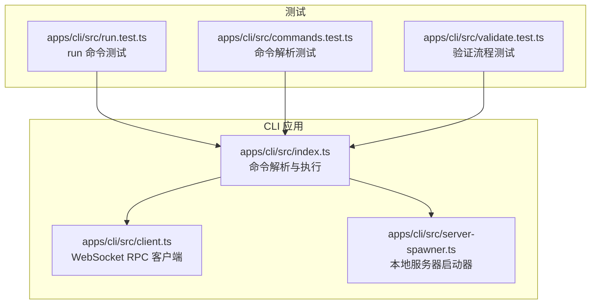
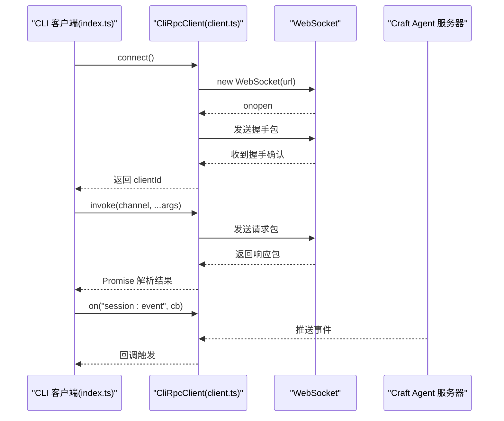
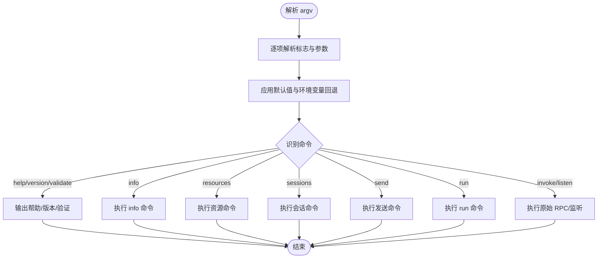
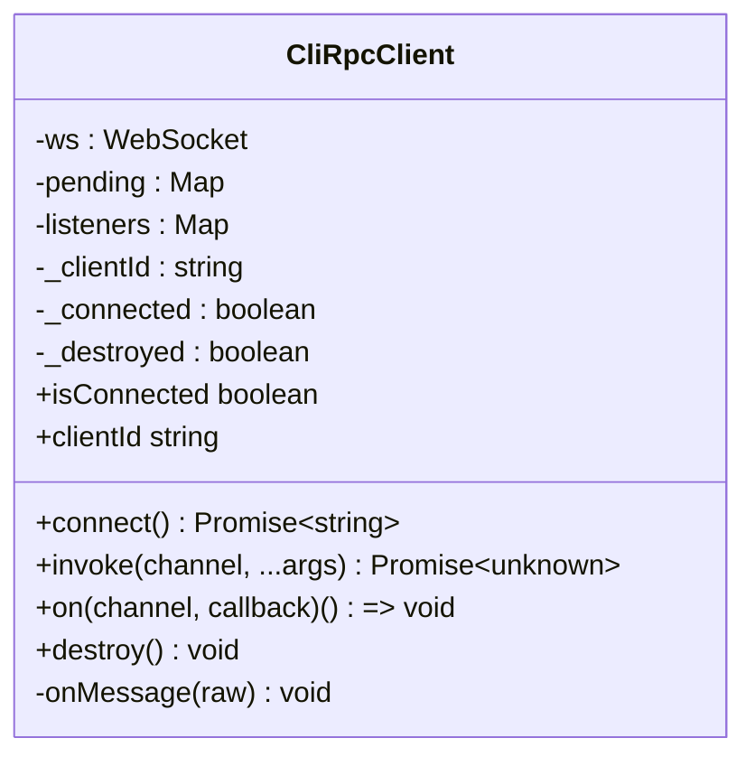
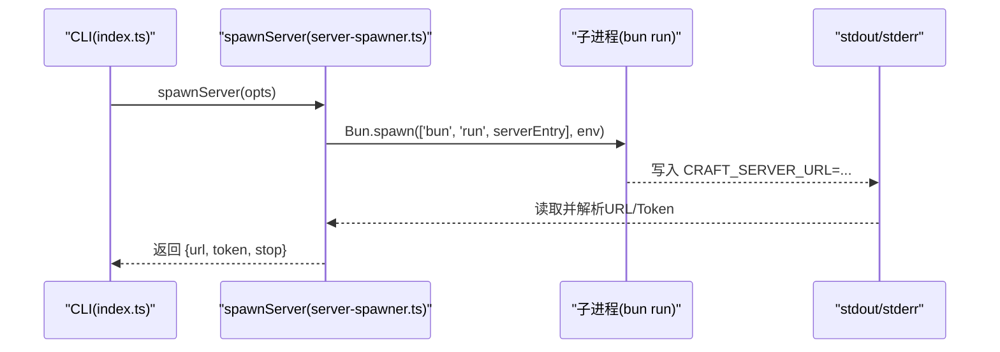
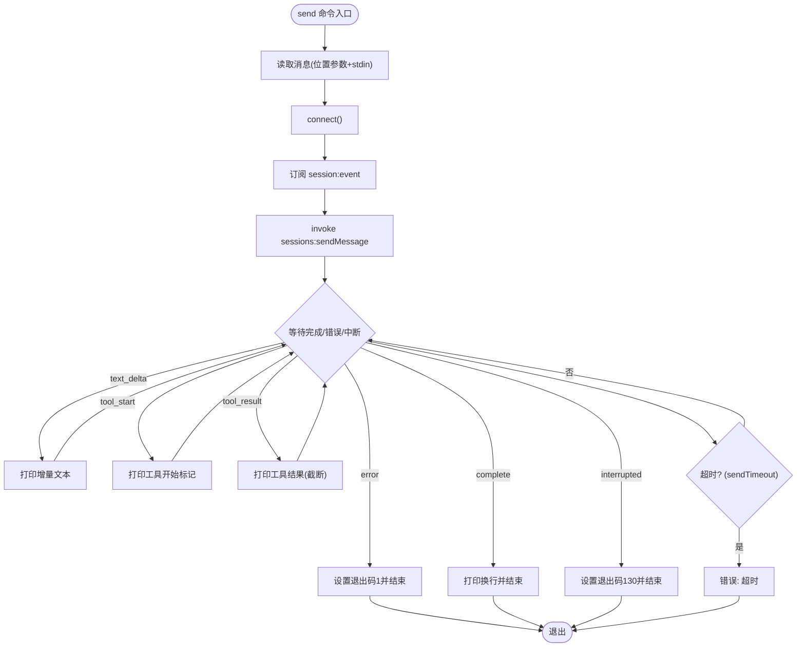
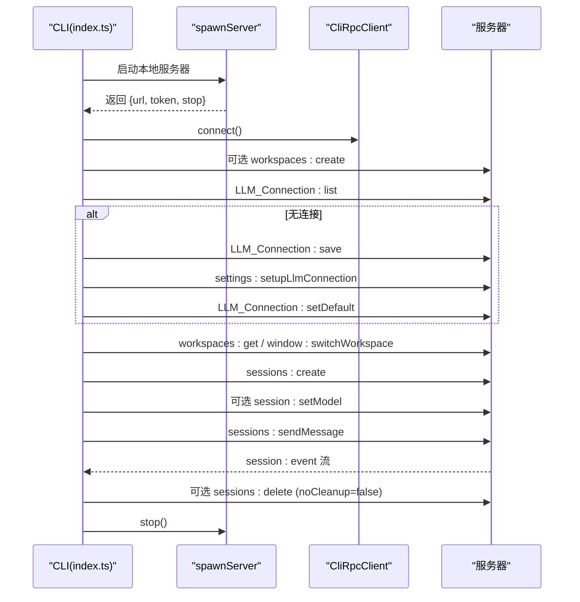
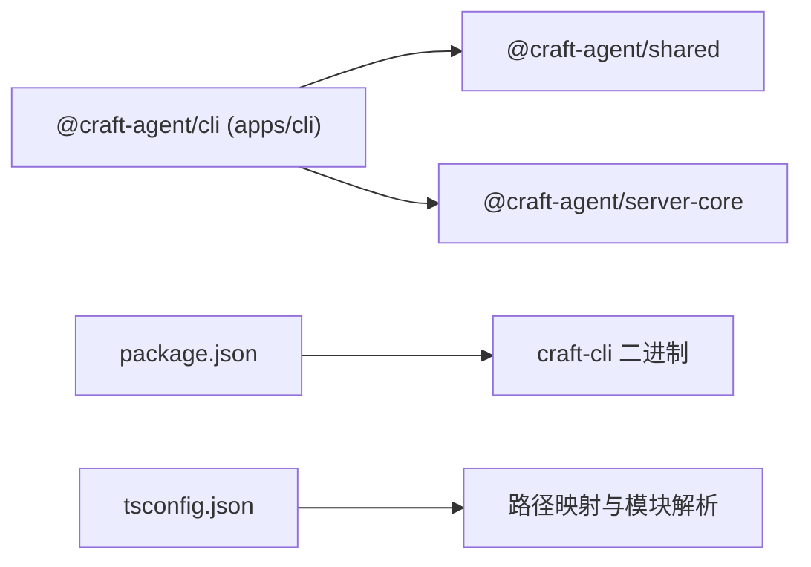

# CLI 客户端

<cite>
**本文引用的文件**
- [apps/cli/src/index.ts](file://apps/cli/src/index.ts)
- [apps/cli/src/client.ts](file://apps/cli/src/client.ts)
- [apps/cli/src/server-spawner.ts](file://apps/cli/src/server-spawner.ts)
- [apps/cli/src/run.test.ts](file://apps/cli/src/run.test.ts)
- [apps/cli/src/commands.test.ts](file://apps/cli/src/commands.test.ts)
- [apps/cli/src/validate.test.ts](file://apps/cli/src/validate.test.ts)
- [apps/cli/package.json](file://apps/cli/package.json)
- [apps/cli/tsconfig.json](file://apps/cli/tsconfig.json)
- [docs/cli.md](file://docs/cli.md)
- [README.md](file://README.md)
</cite>

## 目录

1. [简介](#简介)
2. [项目结构](#项目结构)
3. [核心组件](#核心组件)
4. [架构总览](#架构总览)
5. [详细组件分析](#详细组件分析)
6. [依赖关系分析](#依赖关系分析)
7. [性能考量](#性能考量)
8. [故障排查指南](#故障排查指南)
9. [结论](#结论)
10. [附录](#附录)

## 简介

本文件为 Craft Agents CLI 客户端的技术文档，面向初学者与有经验的开发者，系统性阐述 CLI 的实现细节、调用关系、接口与使用模式。内容基于仓库中的实际代码与测试用例，覆盖服务器模式、连接管理、命令参考、验证流程与常见问题处理，并提供可视化图示帮助理解。

CLI 通过 WebSocket 连接到 Craft Agent 服务器（支持 ws/wss），提供健康检查、资源列举、会话管理、消息发送（实时流式输出）、原始 RPC 调用与事件订阅、自包含运行模式（自动启动本地服务器）以及 21 步集成验证等能力。

## 项目结构

- CLI 源码位于 apps/cli/src，主要入口为 index.ts，核心客户端为 client.ts，本地服务器启动器为 server-spawner.ts。
- 测试覆盖了命令解析、运行流程、验证步骤与事件流等关键路径。
- 文档位于 docs/cli.md，README.md 提供安装与快速开始指引。

图表来源

- [apps/cli/src/index.ts](file://apps/cli/src/index.ts#L1-L1406)
- [apps/cli/src/client.ts](file://apps/cli/src/client.ts#L1-L240)
- [apps/cli/src/server-spawner.ts](file://apps/cli/src/server-spawner.ts#L1-L145)
- [apps/cli/src/run.test.ts](file://apps/cli/src/run.test.ts#L1-L429)
- [apps/cli/src/commands.test.ts](file://apps/cli/src/commands.test.ts#L1-L306)
- [apps/cli/src/validate.test.ts](file://apps/cli/src/validate.test.ts#L1-L412)

章节来源

- [apps/cli/src/index.ts](file://apps/cli/src/index.ts#L1-L1406)
- [apps/cli/src/client.ts](file://apps/cli/src/client.ts#L1-L240)
- [apps/cli/src/server-spawner.ts](file://apps/cli/src/server-spawner.ts#L1-L145)
- [apps/cli/src/run.test.ts](file://apps/cli/src/run.test.ts#L1-L429)
- [apps/cli/src/commands.test.ts](file://apps/cli/src/commands.test.ts#L1-L306)
- [apps/cli/src/validate.test.ts](file://apps/cli/src/validate.test.ts#L1-L412)

## 核心组件

- 命令行参数解析：负责解析全局与子命令参数、环境变量回退、默认值设置。
- WebSocket RPC 客户端：封装握手、请求/响应、事件订阅与销毁逻辑。
- 本地服务器启动器：以子进程方式启动 headless 服务器，解析其输出的连接信息。
- 命令实现：包括 ping/health/versions、资源列表、会话操作、消息发送（流式）、原始 RPC 调用、事件监听、run 自包含运行、validate 集成验证等。
- 输出与交互：支持人类可读输出与 JSON 输出；支持 spinner 与颜色控制；支持从 stdin 读取输入。

章节来源

- [apps/cli/src/index.ts](file://apps/cli/src/index.ts#L42-L152)
- [apps/cli/src/client.ts](file://apps/cli/src/client.ts#L38-L240)
- [apps/cli/src/server-spawner.ts](file://apps/cli/src/server-spawner.ts#L55-L145)

## 架构总览

CLI 通过 WebSocket 与服务器通信，采用“RPC over WebSocket”协议。客户端在握手成功后进入正常消息路由，支持：

- 请求/响应：invoke(channel, ...args) -> Promise<result>
- 推送事件：on(channel, callback) 订阅 session:event 等通道
- 销毁：destroy() 关闭连接并拒绝未完成请求

图表来源

- [apps/cli/src/index.ts](file://apps/cli/src/index.ts#L241-L744)
- [apps/cli/src/client.ts](file://apps/cli/src/client.ts#L61-L238)

章节来源

- [apps/cli/src/index.ts](file://apps/cli/src/index.ts#L241-L744)
- [apps/cli/src/client.ts](file://apps/cli/src/client.ts#L38-L240)

## 详细组件分析

### 命令行参数解析与全局选项

- 全局选项包括：服务器地址、令牌、工作区、超时、TLS CA、发送超时、JSON 输出、禁用清理、禁用 spinner、服务器入口、工作区目录、LLM 提供商/模型/API Key/Base URL 等。
- 环境变量回退：CRAFT_SERVER_URL、CRAFT_SERVER_TOKEN、CRAFT_TLS_CA、LLM_PROVIDER、LLM_MODEL、LLM_API_KEY、LLM_BASE_URL。
- 子命令：help/version/validate/ping/health/versions/workspaces/sessions/connections/sources/session/send/cancel/invoke/listen/run 等。

图表来源

- [apps/cli/src/index.ts](file://apps/cli/src/index.ts#L42-L152)
- [apps/cli/src/index.ts](file://apps/cli/src/index.ts#L241-L744)

章节来源

- [apps/cli/src/index.ts](file://apps/cli/src/index.ts#L42-L152)
- [apps/cli/src/commands.test.ts](file://apps/cli/src/commands.test.ts#L8-L228)

### WebSocket RPC 客户端（CliRpcClient）

- 握手：connect() 在超时内完成握手，返回 clientId 并切换到消息路由。
- 请求/响应：invoke(channel, ...args) 返回 Promise，内部维护 pending 映射与超时。
- 事件订阅：on(channel, callback) 返回取消函数；推送事件按通道分发给回调集合。
- 销毁：destroy() 关闭连接并拒绝所有未完成请求。
- 只读属性：isConnected、clientId。

图表来源

- [apps/cli/src/client.ts](file://apps/cli/src/client.ts#L38-L240)

章节来源

- [apps/cli/src/client.ts](file://apps/cli/src/client.ts#L38-L240)

### 本地服务器启动器（server-spawner）

- 自动检测服务器入口文件（apps/electron/src/server/index.ts）。
- 通过 Bun.spawn 启动服务器，注入必要环境变量（CRAFT_SERVER_TOKEN、CRAFT_RPC_HOST/PORT）。
- 从 stdout 读取 CRAFT_SERVER_URL/CRAFT_SERVER_TOKEN 行，确认服务器就绪。
- 提供 stop() 终止子进程。

图表来源

- [apps/cli/src/server-spawner.ts](file://apps/cli/src/server-spawner.ts#L55-L145)

章节来源

- [apps/cli/src/server-spawner.ts](file://apps/cli/src/server-spawner.ts#L55-L145)

### 命令实现概览

- 健康与信息类：ping（连接+延迟）、health（凭据健康）、versions（版本）、workspaces/sessions/connections/sources 列表。
- 会话操作：session create/messages/delete/cancel。
- 消息发送：send 命令订阅 session:event，实时打印 text_delta/tool_start/tool_result/error/complete/interrupted，支持 --stdin 与 JSON 输出格式。
- 原始 RPC：invoke/listen。
- 自包含运行：run 命令自动启动服务器、创建会话、发送消息、流式输出、清理（可选）。
- 服务器验证：validate 命令执行 21 步集成验证，覆盖会话生命周期、工具使用、源与技能创建/使用/删除等。

章节来源

- [apps/cli/src/index.ts](file://apps/cli/src/index.ts#L241-L744)
- [apps/cli/src/run.test.ts](file://apps/cli/src/run.test.ts#L176-L428)
- [apps/cli/src/validate.test.ts](file://apps/cli/src/validate.test.ts#L238-L412)

### send 命令的事件流与超时控制

send 命令订阅 session:event，根据事件类型输出文本、工具开始/结果、错误或完成状态；若超过 sendTimeout 仍未完成，返回错误并退出码 1；中断信号返回 130。

图表来源

- [apps/cli/src/index.ts](file://apps/cli/src/index.ts#L396-L464)

章节来源

- [apps/cli/src/index.ts](file://apps/cli/src/index.ts#L396-L464)

### run 命令的完整生命周期

- 解析参数与 prompt。
- 启动本地服务器（spawnServer）。
- 连接服务器并可选注册工作区目录。
- 自动配置 LLM 连接（若无现有连接）。
- 解析工作区（优先使用 --workspace-dir 注册的工作区）。
- 创建会话（支持权限模式与启用的源）。
- 设置模型（可选）。
- 发送消息并流式输出。
- 清理（可选关闭 noCleanup）。

图表来源

- [apps/cli/src/index.ts](file://apps/cli/src/index.ts#L578-L662)
- [apps/cli/src/server-spawner.ts](file://apps/cli/src/server-spawner.ts#L55-L145)

章节来源

- [apps/cli/src/index.ts](file://apps/cli/src/index.ts#L578-L662)
- [apps/cli/src/run.test.ts](file://apps/cli/src/run.test.ts#L176-L428)

### validate 命令的 21 步验证流程

- 从 --url 或本地启动服务器。
- 执行 21 步集成验证：握手、健康检查、版本、工作区、会话列表、LLM 连接、源列表、创建临时会话、消息历史、发送流式消息、发送工具消息、创建源、源提及、创建技能、技能验证、技能提及、删除技能、删除源、删除会话、断开连接。
- 支持 JSON 输出与失败继续执行并汇总结果。

章节来源

- [apps/cli/src/index.ts](file://apps/cli/src/index.ts#L664-L744)
- [apps/cli/src/validate.test.ts](file://apps/cli/src/validate.test.ts#L238-L412)

## 依赖关系分析

- CLI 作为独立应用，依赖共享协议与传输层：
  - 协议版本常量与消息封包序列化/反序列化来自 @craft-agent/server-core/transport。
  - 协议版本常量来自 @craft-agent/shared/protocol。
- 包管理与脚本：
  - package.json 定义二进制入口 craft-cli 指向 src/index.ts。
  - tsconfig.json 使用 bundler 分辨策略与路径映射，便于在 monorepo 中引用共享包。

图表来源

- [apps/cli/package.json](file://apps/cli/package.json#L1-L25)
- [apps/cli/tsconfig.json](file://apps/cli/tsconfig.json#L1-L31)
- [apps/cli/src/client.ts](file://apps/cli/src/client.ts#L8-L16)

章节来源

- [apps/cli/package.json](file://apps/cli/package.json#L1-L25)
- [apps/cli/tsconfig.json](file://apps/cli/tsconfig.json#L1-L31)
- [apps/cli/src/client.ts](file://apps/cli/src/client.ts#L8-L16)

## 性能考量

- 连接与请求超时：connectTimeout/requestTimeout 可配置，默认分别为 10 秒；sendTimeout 默认 5 分钟，避免长时间阻塞。
- 事件流节流：工具结果截断至 200 字符，减少输出体积。
- Spinner 与颜色：仅在 TTY 且未禁用时启用，避免管道输出污染。
- 本地服务器启动：通过 stdout 快速解析 URL，超时则终止进程并报错。

章节来源

- [apps/cli/src/index.ts](file://apps/cli/src/index.ts#L47-L88)
- [apps/cli/src/index.ts](file://apps/cli/src/index.ts#L219-L235)
- [apps/cli/src/server-spawner.ts](file://apps/cli/src/server-spawner.ts#L89-L142)

## 故障排查指南

- 连接超时：检查服务器是否启动、URL 是否正确、网络连通性。
- AUTH_FAILED：核对 CRAFT_SERVER_TOKEN 与服务器一致。
- PROTOCOL_VERSION_UNSUPPORTED：升级 CLI 与服务器至相同版本。
- WebSocket 连接错误：对于自签名证书，使用 --tls-ca 或设置 CRAFT_TLS_CA。
- 无可用工作区：先通过桌面应用或 API 创建工作区。
- send 超时：增大 --send-timeout 或检查服务器负载与网络状况。
- run 失败：查看本地服务器日志（stderr），确认 API Key 与提供商配置。

章节来源

- [docs/cli.md](file://docs/cli.md#L232-L241)
- [apps/cli/src/index.ts](file://apps/cli/src/index.ts#L664-L744)

## 结论

Craft Agents CLI 提供了简洁而强大的终端交互能力，覆盖从健康检查、资源浏览到会话管理与消息流式的完整工作流。其自包含运行模式与 21 步验证流程使得集成与自动化场景更加可靠。通过清晰的命令结构、稳健的连接与事件处理机制，CLI 既适合新手快速上手，也能满足高级用户的定制化需求。

## 附录

### 命令参考与使用模式

- 连接与健康
  - craft-cli ping：连接并显示 clientId 与延迟
  - craft-cli health：检查凭据存储健康
  - craft-cli versions：显示服务器运行时版本
- 资源列表
  - craft-cli workspaces：列出工作区
  - craft-cli sessions：列出当前工作区会话
  - craft-cli connections：列出 LLM 连接
  - craft-cli sources：列出已配置数据源
- 会话操作
  - craft-cli session create [--name <n>] [--mode <m>]：创建会话
  - craft-cli session messages <id>：打印会话消息历史
  - craft-cli session delete <id>：删除会话
  - craft-cli cancel <id>：取消进行中的处理
- 发送消息（流式）
  - craft-cli send <session-id> <message>：发送消息并实时流式输出
  - 支持 --stdin 从标准输入读取
- 原始 RPC 与事件监听
  - craft-cli invoke <channel> [json-args...]：调用任意通道
  - craft-cli listen <channel>：订阅推送事件（Ctrl+C 停止）
- 自包含运行
  - craft-cli run <prompt>：自动启动服务器、创建会话、发送消息、流式输出并退出
  - 支持 --workspace-dir、--source、--output-format、--mode、--no-cleanup、--server-entry、--provider/--model/--api-key/--base-url
- 服务器验证
  - craft-cli --validate-server [--url <ws[s]://...> --token <secret>]：执行 21 步集成验证
  - 无 --url 时自动启动本地服务器进行验证

章节来源

- [docs/cli.md](file://docs/cli.md#L52-L194)
- [apps/cli/src/index.ts](file://apps/cli/src/index.ts#L241-L744)
