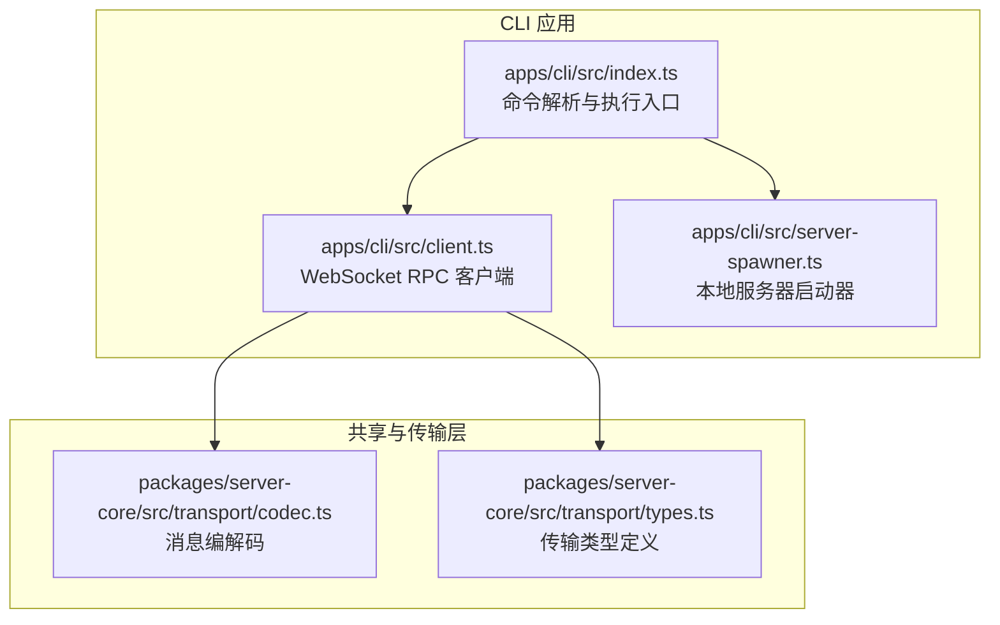
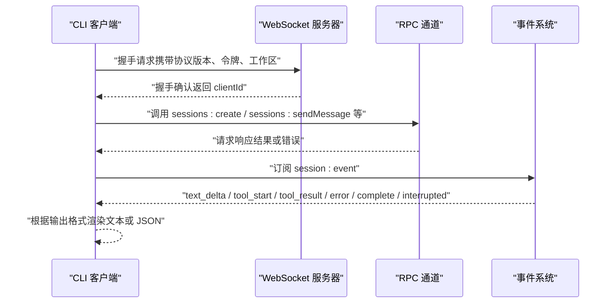
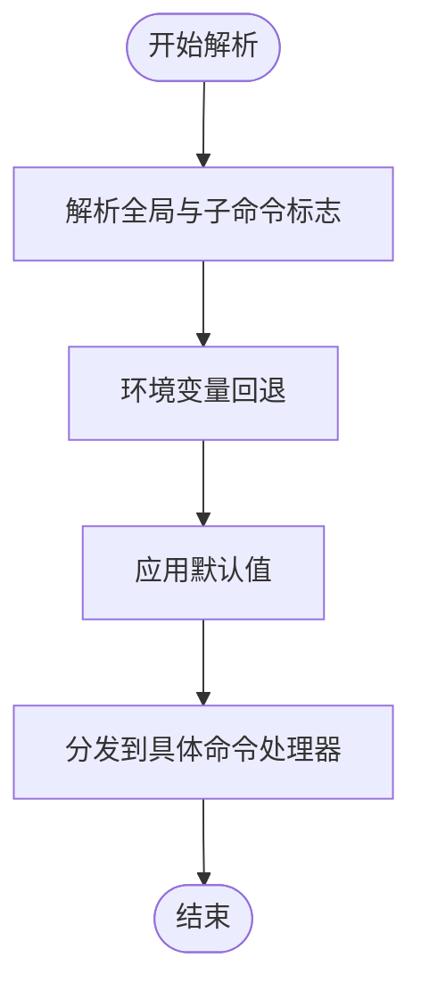
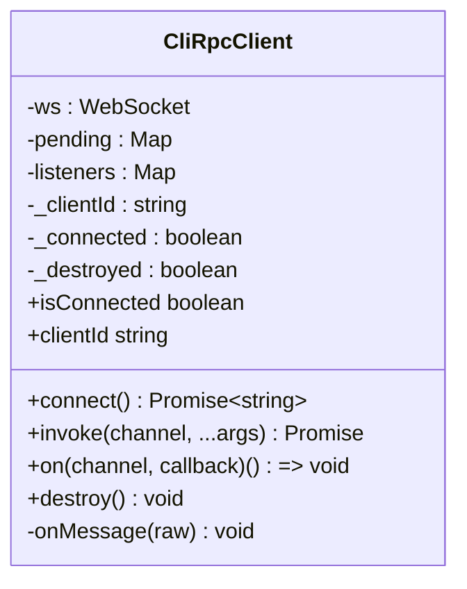
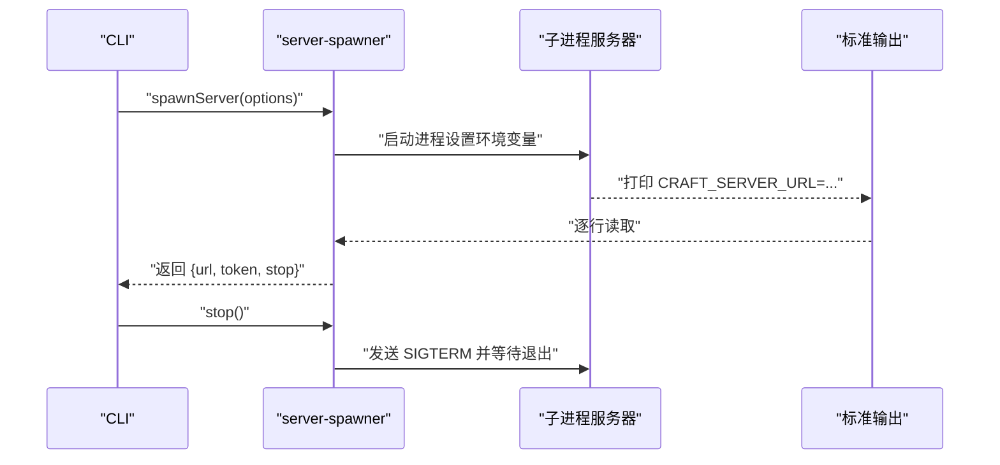
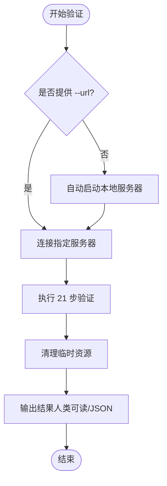
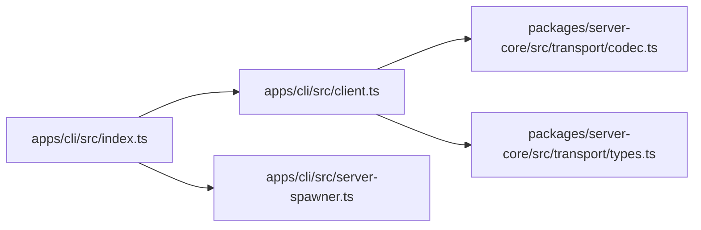

# CLI 工具概述

<cite>
**本文档引用的文件**
- [apps/cli/src/index.ts](file://apps/cli/src/index.ts)
- [apps/cli/src/client.ts](file://apps/cli/src/client.ts)
- [apps/cli/src/server-spawner.ts](file://apps/cli/src/server-spawner.ts)
- [apps/cli/src/run.test.ts](file://apps/cli/src/run.test.ts)
- [apps/cli/src/commands.test.ts](file://apps/cli/src/commands.test.ts)
- [apps/cli/src/validate.test.ts](file://apps/cli/src/validate.test.ts)
- [apps/cli/package.json](file://apps/cli/package.json)
- [docs/cli.md](file://docs/cli.md)
- [README.md](file://README.md)
- [packages/server-core/src/transport/codec.ts](file://packages/server-core/src/transport/codec.ts)
- [packages/server-core/src/transport/types.ts](file://packages/server-core/src/transport/types.ts)
</cite>

## 目录

1. [简介](#简介)
2. [项目结构](#项目结构)
3. [核心组件](#核心组件)
4. [架构总览](#架构总览)
5. [详细组件分析](#详细组件分析)
6. [依赖关系分析](#依赖关系分析)
7. [性能考虑](#性能考虑)
8. [故障排除指南](#故障排除指南)
9. [结论](#结论)
10. [附录](#附录)

## 简介

Craft Agents CLI 是一个基于终端的客户端工具，通过 WebSocket（ws:// 或 wss://）连接到运行中的 Craft Agent 服务器，提供资源列表、会话管理、实时消息流式响应以及服务器健康验证等功能。CLI 支持脚本化与 CI/CD 集成，并可自托管或远程部署服务器。

CLI 的主要特性包括：

- 命令行接口设计：支持多种子命令与参数，覆盖信息查询、会话操作、消息发送、事件监听、服务器自检等。
- 连接管理：基于 WebSocket 的 RPC 协议，握手认证、超时控制、错误处理与销毁清理。
- 输出格式：支持人类可读文本与 JSON 格式，便于脚本解析。
- 自托管能力：run 子命令可自动启动本地 headless 服务器，完成端到端演示与自动化任务。
- 服务器验证：内置 21 步集成测试，覆盖会话生命周期、工具调用、源与技能的创建与清理。

## 项目结构

CLI 位于 monorepo 的 apps/cli 目录中，核心入口为 src/index.ts，核心客户端为 src/client.ts，本地服务器启动器为 src/server-spawner.ts。配套测试覆盖参数解析、run 命令流程、验证步骤等关键路径。

图表来源

- [apps/cli/src/index.ts](file://apps/cli/src/index.ts#L1-L152)
- [apps/cli/src/client.ts](file://apps/cli/src/client.ts#L1-L240)
- [apps/cli/src/server-spawner.ts](file://apps/cli/src/server-spawner.ts#L1-L145)
- [packages/server-core/src/transport/codec.ts](file://packages/server-core/src/transport/codec.ts#L1-L156)
- [packages/server-core/src/transport/types.ts](file://packages/server-core/src/transport/types.ts#L1-L29)

章节来源

- [apps/cli/src/index.ts](file://apps/cli/src/index.ts#L1-L152)
- [apps/cli/src/client.ts](file://apps/cli/src/client.ts#L1-L240)
- [apps/cli/src/server-spawner.ts](file://apps/cli/src/server-spawner.ts#L1-L145)
- [apps/cli/package.json](file://apps/cli/package.json#L1-L25)

## 核心组件

- 命令解析与执行入口：负责解析命令行参数、环境变量、默认值与子命令分发，统一输出格式与错误处理。
- WebSocket RPC 客户端：封装握手、请求/响应、事件订阅、超时与销毁逻辑，屏蔽底层传输细节。
- 本地服务器启动器：在本地以子进程方式启动 headless 服务器，解析启动输出中的连接信息，提供停止能力。
- 传输编解码：定义消息信封结构、序列化/反序列化与形状校验，确保跨进程通信一致性。

章节来源

- [apps/cli/src/index.ts](file://apps/cli/src/index.ts#L42-L152)
- [apps/cli/src/client.ts](file://apps/cli/src/client.ts#L38-L240)
- [apps/cli/src/server-spawner.ts](file://apps/cli/src/server-spawner.ts#L55-L145)
- [packages/server-core/src/transport/codec.ts](file://packages/server-core/src/transport/codec.ts#L145-L155)

## 架构总览

CLI 通过 WebSocket 与服务器建立长连接，采用 RPC 消息信封进行双向通信。握手阶段完成协议版本协商与身份认证；随后通过 channel 调用服务器方法，订阅 session:event 实时事件流，实现消息发送与工具调用的流式输出。

图表来源

- [apps/cli/src/client.ts](file://apps/cli/src/client.ts#L61-L129)
- [apps/cli/src/client.ts](file://apps/cli/src/client.ts#L132-L154)
- [apps/cli/src/client.ts](file://apps/cli/src/client.ts#L196-L238)
- [apps/cli/src/index.ts](file://apps/cli/src/index.ts#L406-L464)

章节来源

- [apps/cli/src/client.ts](file://apps/cli/src/client.ts#L61-L129)
- [apps/cli/src/client.ts](file://apps/cli/src/client.ts#L132-L154)
- [apps/cli/src/client.ts](file://apps/cli/src/client.ts#L196-L238)
- [apps/cli/src/index.ts](file://apps/cli/src/index.ts#L406-L464)

## 详细组件分析

### 命令行接口设计与参数解析

- 参数解析：支持全局标志（如 --url、--token、--workspace、--timeout、--json、--tls-ca、--send-timeout）、run 特定标志（--workspace-dir、--source、--output-format、--mode、--no-cleanup、--server-entry、--provider、--model、--api-key、--base-url），以及子命令与剩余参数。
- 环境变量回退：若未显式传入，优先从环境变量读取（如 CRAFT_SERVER_URL、CRAFT_SERVER_TOKEN、CRAFT_TLS_CA、LLM_PROVIDER、LLM_MODEL、LLM_API_KEY、LLM_BASE_URL）。
- 默认行为：超时、JSON 输出、输出格式、清理策略、服务器入口等均有合理默认值，兼顾易用性与可配置性。

图表来源

- [apps/cli/src/index.ts](file://apps/cli/src/index.ts#L42-L152)

章节来源

- [apps/cli/src/index.ts](file://apps/cli/src/index.ts#L42-L152)
- [apps/cli/src/commands.test.ts](file://apps/cli/src/commands.test.ts#L8-L228)

### 连接管理机制（CliRpcClient）

- 握手与认证：连接后发送包含协议版本、令牌与工作区的握手请求，等待握手确认；失败则抛出带错误码的异常。
- 请求/响应：为每个请求分配唯一 id，设置请求超时，收到响应后清理 pending 并 resolve/reject。
- 事件订阅：支持按 channel 订阅推送事件，内部维护回调集合，提供取消订阅函数。
- 销毁与清理：关闭连接、拒绝所有待处理请求、清理状态，防止内存泄漏。
- 只读模式：不包含自动重连、能力协商、连接状态监听等复杂逻辑，专注于一次性任务。

图表来源

- [apps/cli/src/client.ts](file://apps/cli/src/client.ts#L38-L240)

章节来源

- [apps/cli/src/client.ts](file://apps/cli/src/client.ts#L38-L240)

### 输出格式处理与用户界面

- 文本输出：人类可读的表格与行格式，包含工作区、会话、源等列表的简化展示。
- JSON 输出：严格 JSON 序列化，便于脚本解析与管道处理。
- 彩色与旋转指示器：在 TTY 环境下启用彩色输出与旋转加载动画，非 TTY 或禁用颜色时自动降级。
- 流式事件：send 命令订阅 session:event，按事件类型输出文本增量、工具开始/结果、错误与完成状态，支持 stream-json 输出格式。

章节来源

- [apps/cli/src/index.ts](file://apps/cli/src/index.ts#L184-L235)
- [apps/cli/src/index.ts](file://apps/cli/src/index.ts#L406-L464)

### 本地服务器启动器（server-spawner）

- 自动检测：在 monorepo 根目录自动定位服务器入口文件（apps/electron/src/server/index.ts）。
- 子进程启动：设置必要的环境变量（如 CRAFT_SERVER_TOKEN、CRAFT_RPC_HOST、CRAFT_RPC_PORT），捕获标准输出与错误输出。
- 启动完成判定：解析标准输出中的 CRAFT_SERVER_URL 与 CRAFT_SERVER_TOKEN 行，确认服务器就绪。
- 停止机制：向子进程发送终止信号并等待退出。

图表来源

- [apps/cli/src/server-spawner.ts](file://apps/cli/src/server-spawner.ts#L55-L145)

章节来源

- [apps/cli/src/server-spawner.ts](file://apps/cli/src/server-spawner.ts#L55-L145)

### 服务器验证（--validate-server）

- 自动启动：若未提供 --url，则自动启动本地服务器并进行验证。
- 21 步集成测试：覆盖握手、健康检查、版本信息、工作区与会话列表、LLM 连接、源与技能生命周期、消息发送与工具调用、清理与断开。
- 结果汇总：支持人类可读与 JSON 两种输出格式，统计通过/失败数量与每步详情。
- 清理保障：即使中间步骤失败，仍尽力清理临时资源。

图表来源

- [apps/cli/src/index.ts](file://apps/cli/src/index.ts#L664-L691)
- [apps/cli/src/validate.test.ts](file://apps/cli/src/validate.test.ts#L238-L412)

章节来源

- [apps/cli/src/index.ts](file://apps/cli/src/index.ts#L664-L691)
- [apps/cli/src/validate.test.ts](file://apps/cli/src/validate.test.ts#L238-L412)

### 命令与使用场景概览

- ping：验证连接与延迟，返回 clientId 与往返时间。
- health：检查凭据存储健康状态。
- versions：显示服务器运行时版本信息。
- workspaces：列出工作区（支持 JSON 输出）。
- sessions：列出当前工作区下的会话（支持 JSON 输出与处理中状态标记）。
- connections：列出 LLM 连接。
- sources：列出已配置的数据源。
- session create：创建会话（支持名称与权限模式）。
- session messages：获取会话消息历史。
- session delete：删除会话。
- send：发送消息并实时流式输出（支持 stdin 管道输入）。
- cancel：取消进行中的处理。
- invoke：原始 RPC 调用（支持 JSON 参数）。
- listen：订阅推送事件（Ctrl+C 停止）。
- run：自包含命令（自动启动服务器、创建会话、发送提示、流式输出、退出；支持多提供商与自定义模型/端点）。
- --validate-server：21 步集成测试（可自动启动服务器）。

章节来源

- [docs/cli.md](file://docs/cli.md#L52-L194)
- [README.md](file://README.md#L273-L341)

## 依赖关系分析

- CLI 入口依赖 WebSocket RPC 客户端与本地服务器启动器。
- RPC 客户端依赖传输编解码模块，确保消息信封的序列化与反序列化一致。
- 传输层定义了消息类型集合、错误结构与编码/解码逻辑，保证跨语言/跨进程兼容。

图表来源

- [apps/cli/src/index.ts](file://apps/cli/src/index.ts#L10-L11)
- [apps/cli/src/client.ts](file://apps/cli/src/client.ts#L8-L15)
- [packages/server-core/src/transport/codec.ts](file://packages/server-core/src/transport/codec.ts#L1-L156)
- [packages/server-core/src/transport/types.ts](file://packages/server-core/src/transport/types.ts#L1-L29)

章节来源

- [apps/cli/src/index.ts](file://apps/cli/src/index.ts#L10-L11)
- [apps/cli/src/client.ts](file://apps/cli/src/client.ts#L8-L15)
- [packages/server-core/src/transport/codec.ts](file://packages/server-core/src/transport/codec.ts#L145-L155)
- [packages/server-core/src/transport/types.ts](file://packages/server-core/src/transport/types.ts#L1-L29)

## 性能考虑

- 连接与请求超时：握手与请求均设置超时，避免长时间阻塞；send 命令额外提供发送超时，等待完成事件。
- 事件流式输出：实时输出文本增量与工具结果，减少缓冲与延迟。
- 本地服务器启动：通过解析标准输出快速判定就绪，避免轮询等待。
- JSON 输出：在脚本化场景中减少解析成本，提高吞吐量。

章节来源

- [apps/cli/src/client.ts](file://apps/cli/src/client.ts#L61-L129)
- [apps/cli/src/client.ts](file://apps/cli/src/client.ts#L132-L154)
- [apps/cli/src/index.ts](file://apps/cli/src/index.ts#L451-L464)
- [apps/cli/src/server-spawner.ts](file://apps/cli/src/server-spawner.ts#L88-L143)

## 故障排除指南

常见问题与解决建议：

- 连接超时：检查服务器是否启动、URL 是否正确、网络连通性。
- 认证失败：核对令牌与服务器配置是否匹配。
- 协议版本不支持：更新 CLI 与服务器至相同版本。
- WebSocket 连接错误：对于自签名证书，使用 --tls-ca 或设置 CRAFT_TLS_CA。
- 无可用工作区：先通过桌面应用或 API 创建工作区。

章节来源

- [docs/cli.md](file://docs/cli.md#L232-L241)

## 结论

Craft Agents CLI 提供了简洁而强大的命令行接口，既能满足日常运维与脚本化需求，也能通过 run 与验证命令实现端到端的自动化与集成测试。其基于 WebSocket 的 RPC 设计清晰、扩展性强，配合严格的参数解析与输出格式控制，既适合初学者快速上手，也为高级用户提供充分的灵活性与可靠性保障。

## 附录

### 命令与参数速查

- 连接选项：--url、--token、--workspace、--timeout、--json、--tls-ca、--send-timeout
- run 特定：--workspace-dir、--source、--output-format、--mode、--no-cleanup、--server-entry、--provider、--model、--api-key、--base-url
- 示例参考：README 与 docs/cli.md 中的示例与表格

章节来源

- [docs/cli.md](file://docs/cli.md#L38-L150)
- [README.md](file://README.md#L258-L341)
