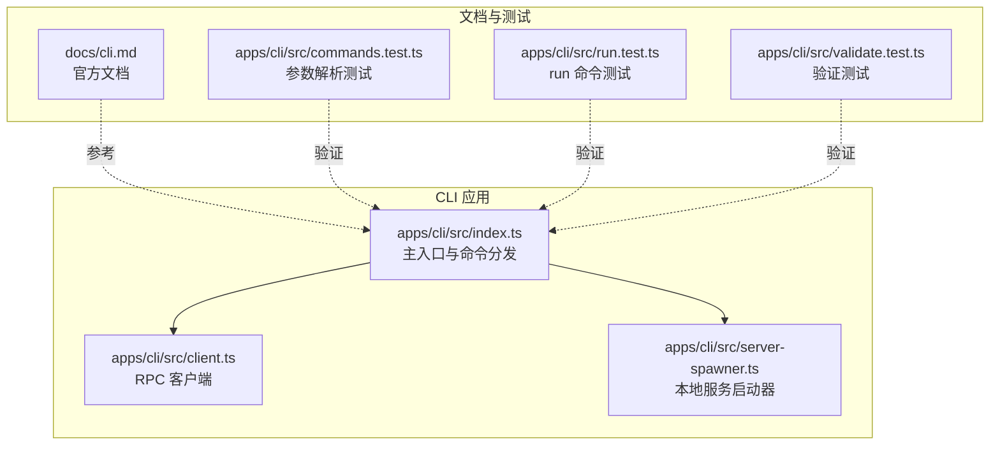
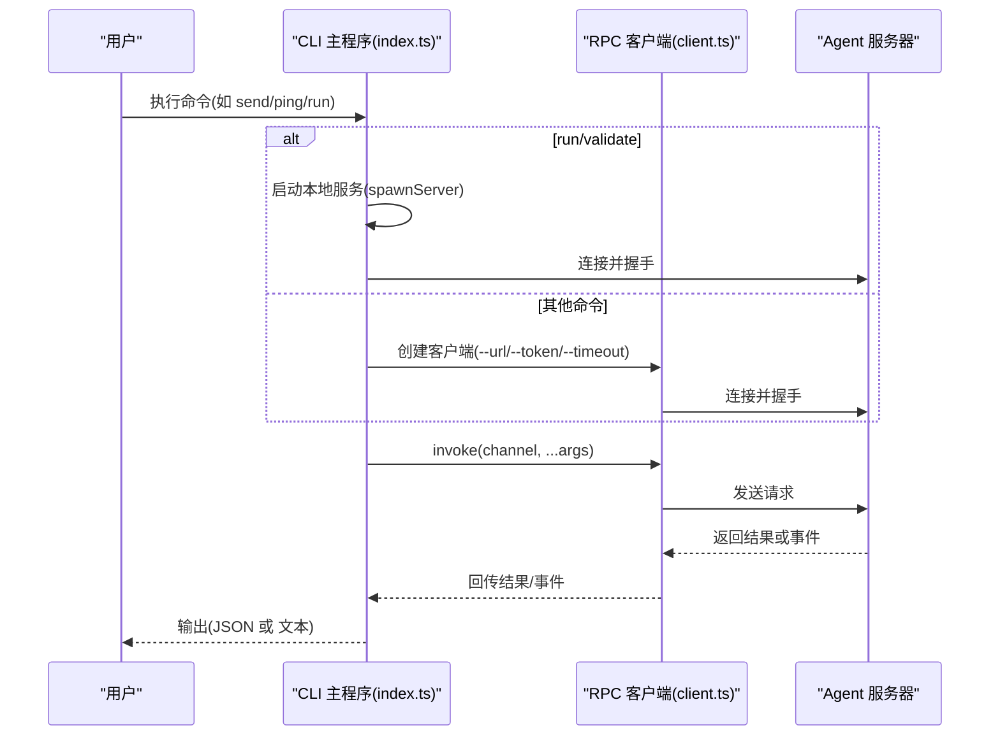
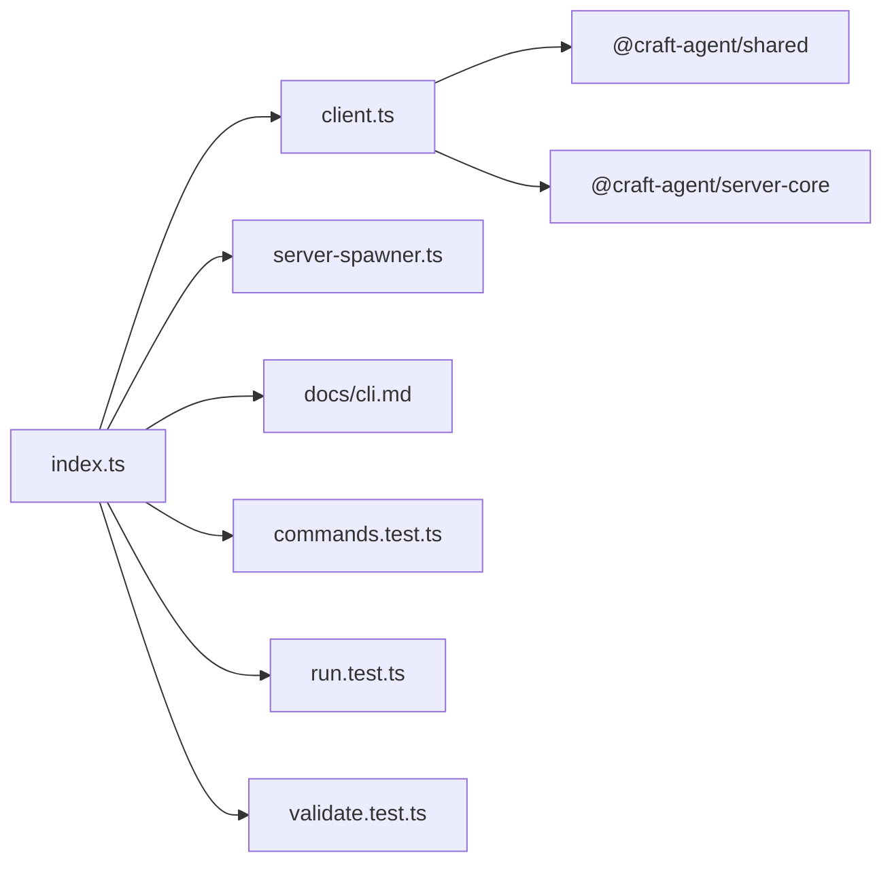

# 命令参考

<cite>
**本文引用的文件**
- [apps/cli/src/index.ts](file://apps/cli/src/index.ts)
- [apps/cli/src/client.ts](file://apps/cli/src/client.ts)
- [apps/cli/src/server-spawner.ts](file://apps/cli/src/server-spawner.ts)
- [apps/cli/src/commands.test.ts](file://apps/cli/src/commands.test.ts)
- [apps/cli/src/run.test.ts](file://apps/cli/src/run.test.ts)
- [apps/cli/src/validate.test.ts](file://apps/cli/src/validate.test.ts)
- [apps/cli/package.json](file://apps/cli/package.json)
- [docs/cli.md](file://docs/cli.md)
</cite>

## 目录

1. [简介](#简介)
2. [项目结构](#项目结构)
3. [核心组件](#核心组件)
4. [架构总览](#架构总览)
5. [详细组件分析](#详细组件分析)
6. [依赖关系分析](#依赖关系分析)
7. [性能与行为特性](#性能与行为特性)
8. [故障排除指南](#故障排除指南)
9. [结论](#结论)
10. [附录：命令与用法速查](#附录命令与用法速查)

## 简介

本文件为 Craft Agents CLI 的命令参考，覆盖连接配置、系统信息、资源查询、会话管理、消息发送、运行模式、验证测试以及脚本化用法。文档同时说明 JSON 输出与文本输出两种模式的区别，并提供常见问题排查建议与最佳实践。

## 项目结构

CLI 位于 apps/cli，核心入口为 src/index.ts，通过 WebSocket 连接 Craft Agent 服务器，执行各类 RPC 调用并支持本地自启动服务（run 模式）。客户端封装在 src/client.ts 中，服务启动器在 src/server-spawner.ts 中。

图表来源

- [apps/cli/src/index.ts](file://apps/cli/src/index.ts#L1291-L1400)
- [apps/cli/src/client.ts](file://apps/cli/src/client.ts#L38-L240)
- [apps/cli/src/server-spawner.ts](file://apps/cli/src/server-spawner.ts#L55-L145)
- [docs/cli.md](file://docs/cli.md#L1-L241)

章节来源

- [apps/cli/src/index.ts](file://apps/cli/src/index.ts#L1-L1406)
- [apps/cli/src/client.ts](file://apps/cli/src/client.ts#L1-L240)
- [apps/cli/src/server-spawner.ts](file://apps/cli/src/server-spawner.ts#L1-L145)
- [apps/cli/package.json](file://apps/cli/package.json#L1-L25)
- [docs/cli.md](file://docs/cli.md#L1-L241)

## 核心组件

- 参数解析与全局选项
  - 支持连接参数（URL、令牌、工作区、超时、TLS CA）、输出控制（--json）、发送超时（--send-timeout）、LLM 配置（--provider/--model/--api-key/--base-url）等。
  - 环境变量回退：CRAFT_SERVER_URL、CRAFT_SERVER_TOKEN、CRAFT_TLS_CA、LLM_PROVIDER、LLM_MODEL、LLM_API_KEY、LLM_BASE_URL。
- RPC 客户端
  - 封装握手、请求/响应、事件订阅、超时与断开处理。
- 本地服务启动器
  - 自动定位服务入口，启动子进程，解析标准输出中的服务地址与令牌，提供停止能力。
- 命令分发与执行
  - 统一入口根据命令调用相应处理器；run 与 validate 为自包含模式，其余需提供 --url。

章节来源

- [apps/cli/src/index.ts](file://apps/cli/src/index.ts#L42-L152)
- [apps/cli/src/client.ts](file://apps/cli/src/client.ts#L38-L240)
- [apps/cli/src/server-spawner.ts](file://apps/cli/src/server-spawner.ts#L55-L145)

## 架构总览

CLI 通过 WebSocket 与服务器通信，采用 RPC 协议进行请求/响应与事件推送。run 命令会自动启动本地服务，完成会话生命周期后退出；其他命令直接连接已有服务。

图表来源

- [apps/cli/src/index.ts](file://apps/cli/src/index.ts#L1291-L1400)
- [apps/cli/src/client.ts](file://apps/cli/src/client.ts#L61-L129)
- [apps/cli/src/server-spawner.ts](file://apps/cli/src/server-spawner.ts#L55-L145)

## 详细组件分析

### 通用参数与环境变量

- 连接参数
  - --url <ws[s]://...> | CRAFT_SERVER_URL
  - --token <secret> | CRAFT_SERVER_TOKEN
  - --workspace <id>
  - --timeout <ms> 默认 10000
  - --tls-ca <path> | CRAFT_TLS_CA
  - --json 开启 JSON 输出
  - --send-timeout <ms> 默认 300000（send 命令）
- LLM 配置（run 命令）
  - --provider <name> | LLM_PROVIDER 默认 anthropic
  - --model <id> | LLM_MODEL
  - --api-key <key> | LLM_API_KEY 或各提供商特定环境变量
  - --base-url <url> | LLM_BASE_URL
- run 特有
  - --workspace-dir <path>
  - --source <slug>（可重复）
  - --mode <mode> 默认 allow-all
  - --output-format <text|stream-json> 默认 text
  - --no-cleanup
  - --server-entry <path>

章节来源

- [apps/cli/src/index.ts](file://apps/cli/src/index.ts#L42-L152)
- [apps/cli/src/commands.test.ts](file://apps/cli/src/commands.test.ts#L55-L90)
- [apps/cli/src/commands.test.ts](file://apps/cli/src/commands.test.ts#L158-L228)
- [docs/cli.md](file://docs/cli.md#L38-L144)

### 系统信息与健康检查

- ping
  - 功能：建立连接并测量往返时间，返回 clientId 与延迟。
  - 输出：默认文本包含 clientId 与 latency；--json 输出对象。
- health
  - 功能：检查凭据存储健康状态。
  - 输出：JSON 对象。
- versions
  - 功能：返回服务器运行时版本信息。
  - 输出：JSON 对象。
- workspaces
  - 功能：列出工作区；若非 JSON 模式，每行显示 id、名称与路径。
  - 输出：数组或文本列表。

章节来源

- [apps/cli/src/index.ts](file://apps/cli/src/index.ts#L241-L279)
- [apps/cli/src/index.ts](file://apps/cli/src/index.ts#L1253-L1256)

### 资源查询命令

- sessions
  - 功能：列出指定工作区内的会话；若无会话则提示“未找到”。
  - 输出：默认文本逐行展示 id、名称、预览与处理状态；--json 输出数组。
- connections
  - 功能：列出 LLM 连接。
  - 输出：JSON 数组。
- sources
  - 功能：列出工作区已配置的数据源。
  - 输出：JSON 数组。

章节来源

- [apps/cli/src/index.ts](file://apps/cli/src/index.ts#L281-L320)
- [apps/cli/src/index.ts](file://apps/cli/src/index.ts#L1257-L1259)

### 会话管理命令

- session create
  - 语法：craft-cli session create [--name <n>] [--mode <m>]
  - 行为：在当前工作区创建会话，支持设置名称与权限模式。
  - 输出：默认文本或 JSON。
- session messages <id>
  - 语法：craft-cli session messages <id>
  - 行为：获取指定会话的消息历史。
  - 输出：JSON。
- session delete <id>
  - 语法：craft-cli session delete <id>
  - 行为：删除会话。
  - 输出：默认文本或 JSON。

章节来源

- [apps/cli/src/index.ts](file://apps/cli/src/index.ts#L322-L364)
- [apps/cli/src/index.ts](file://apps/cli/src/index.ts#L1260-L1262)

### 消息发送与取消

- send <session-id> <message>
  - 语法：craft-cli send <session-id> <message>
  - 行为：订阅 session:event，实时流式输出：
    - text_delta：文本增量
    - tool_start：工具开始（带工具名与意图）
    - tool_result：工具结果（截断至 200 字符）
    - error：错误，退出码 1
    - complete：完成，退出码 0
    - interrupted：中断，退出码 130
  - 输入：支持从位置参数与 stdin（--stdin 或无位置参数且 stdin 非 TTY）读取。
  - 超时：--send-timeout 控制等待完成事件的时间。
- cancel <id>
  - 语法：craft-cli cancel <id>
  - 行为：取消进行中的处理。
  - 输出：默认文本或 JSON。

章节来源

- [apps/cli/src/index.ts](file://apps/cli/src/index.ts#L396-L483)
- [apps/cli/src/index.ts](file://apps/cli/src/index.ts#L693-L702)
- [apps/cli/src/index.ts](file://apps/cli/src/index.ts#L1263-L1264)

### 运行模式（自包含）

- run <message>
  - 语法：craft-cli run <message>
  - 行为：自启动本地服务，自动创建会话，发送消息并流式输出，完成后清理（除非 --no-cleanup）。
  - LLM 自动配置：若 LLM 连接为空，将基于 --provider/--api-key/--base-url 或环境变量创建并设为默认。
  - 工作区：可使用 --workspace-dir 注册目录作为工作区。
  - 权限模式：--mode，默认 allow-all。
  - 输出格式：--output-format 支持 text 与 stream-json。
  - 信号处理：SIGINT/SIGTERM 会尝试取消并清理。
- 交互细节
  - 会话创建时可启用多个 source（--source 可重复）。
  - 若提供模型参数，将在会话上设置模型与连接（若未锁定）。

章节来源

- [apps/cli/src/index.ts](file://apps/cli/src/index.ts#L578-L662)
- [apps/cli/src/run.test.ts](file://apps/cli/src/run.test.ts#L176-L364)
- [apps/cli/src/server-spawner.ts](file://apps/cli/src/server-spawner.ts#L55-L145)

### 高级与调试命令

- invoke <channel> [json-args...]
  - 语法：craft-cli invoke <channel> [json-args...]
  - 行为：对任意通道发起 RPC 调用，参数可混合 JSON 与字符串。
  - 输出：JSON。
- listen <channel>
  - 语法：craft-cli listen <channel>
  - 行为：订阅指定通道的推送事件，持续输出事件对象，Ctrl+C 停止。
  - 输出：JSON。

章节来源

- [apps/cli/src/index.ts](file://apps/cli/src/index.ts#L704-L744)
- [apps/cli/src/index.ts](file://apps/cli/src/index.ts#L1265-L1266)

### 服务器验证（集成测试）

- --validate-server
  - 语法：craft-cli --validate-server 或 craft-cli --validate-server --url ... --token ...
  - 行为：运行 21 步集成测试，覆盖连接、健康、版本、工作区、会话、LLM 连接、数据源、技能、消息流、工具使用、清理等。
  - 输出：默认文本进度与摘要；--json 输出结构化结果（包含每步状态、耗时与详情）。
  - 清理：即使中间失败也会尽力清理临时资源。

章节来源

- [apps/cli/src/index.ts](file://apps/cli/src/index.ts#L664-L724)
- [apps/cli/src/index.ts](file://apps/cli/src/index.ts#L824-L1061)
- [apps/cli/src/validate.test.ts](file://apps/cli/src/validate.test.ts#L238-L412)

### JSON 输出与文本输出

- JSON 模式
  - 通过 --json 或在 --validate-server 使用 JSON 输出，便于脚本化处理。
  - 文本模式用于人类可读输出，包含简要状态与摘要。
- stream-json 模式
  - run 命令支持 --output-format stream-json，将事件逐条以 JSON 行输出，便于实时解析与日志聚合。

章节来源

- [apps/cli/src/index.ts](file://apps/cli/src/index.ts#L184-L192)
- [apps/cli/src/index.ts](file://apps/cli/src/index.ts#L404-L412)
- [apps/cli/src/commands.test.ts](file://apps/cli/src/commands.test.ts#L189-L198)

## 依赖关系分析

- CLI 依赖
  - @craft-agent/shared：协议常量
  - @craft-agent/server-core：传输编解码
- 内部模块
  - index.ts：命令分发、参数解析、帮助、主流程
  - client.ts：RPC 客户端（握手、请求、事件）
  - server-spawner.ts：本地服务启动与停止
- 测试与文档
  - commands.test.ts：参数解析与 run 选项验证
  - run.test.ts：run 生命周期与事件流验证
  - validate.test.ts：21 步验证测试
  - docs/cli.md：官方使用说明与示例

图表来源

- [apps/cli/src/index.ts](file://apps/cli/src/index.ts#L1-L1406)
- [apps/cli/src/client.ts](file://apps/cli/src/client.ts#L8-L16)
- [apps/cli/package.json](file://apps/cli/package.json#L15-L18)

章节来源

- [apps/cli/package.json](file://apps/cli/package.json#L1-L25)

## 性能与行为特性

- 连接与超时
  - 连接超时与请求超时均可配置；--send-timeout 控制 send 命令等待完成事件的时间。
- 事件流
  - send 与 run 在文本模式下实时打印增量文本与工具信息；stream-json 模式逐行输出事件 JSON。
- 本地服务启动
  - run/validate 通过 spawnServer 自动启动服务，解析标准输出中的 URL 与令牌，超时则终止并报错。
- 信号处理
  - run 捕获 SIGINT/SIGTERM，尝试取消并清理会话与临时工作区。

章节来源

- [apps/cli/src/client.ts](file://apps/cli/src/client.ts#L52-L58)
- [apps/cli/src/index.ts](file://apps/cli/src/index.ts#L451-L464)
- [apps/cli/src/server-spawner.ts](file://apps/cli/src/server-spawner.ts#L88-L143)
- [apps/cli/src/index.ts](file://apps/cli/src/index.ts#L599-L609)

## 故障排除指南

- 连接问题
  - 连接超时：检查服务器是否启动、网络连通性、URL 是否正确。
  - AUTH_FAILED：核对令牌与服务器一致。
  - PROTOCOL_VERSION_UNSUPPORTED：升级 CLI 与服务器到相同版本。
  - WebSocket 连接错误：对于自签名证书，使用 --tls-ca 或设置 CRAFT_TLS_CA。
- 工作区问题
  - No workspace available：先在桌面应用或 API 中创建工作区，再使用 --workspace 指定。
- send 命令问题
  - 无消息内容：确保提供了位置参数或通过 stdin 提供。
  - Send timeout：适当增大 --send-timeout，或检查服务器是否正常产生完成事件。
- run 命令问题
  - API 密钥缺失：提供 --api-key 或设置 LLM\_\* 环境变量。
  - 无法自动检测服务入口：使用 --server-entry 指定服务入口路径。
- 验证失败
  - 多数步骤失败：优先检查服务器健康与网络；部分步骤会自动创建临时资源，完成后清理。

章节来源

- [docs/cli.md](file://docs/cli.md#L232-L241)
- [apps/cli/src/index.ts](file://apps/cli/src/index.ts#L1294-L1326)
- [apps/cli/src/index.ts](file://apps/cli/src/index.ts#L664-L691)

## 结论

Craft Agents CLI 提供了从健康检查、资源查询、会话管理到消息流式发送与自包含运行的完整命令集。通过 JSON 输出与事件流，CLI 既适合人类使用也适合自动化脚本。配合 --validate-server 可快速验证端到端集成。

## 附录：命令与用法速查

- 连接与健康
  - craft-cli ping
  - craft-cli health
  - craft-cli versions
- 资源查询
  - craft-cli workspaces
  - craft-cli sessions
  - craft-cli connections
  - craft-cli sources
- 会话管理
  - craft-cli session create [--name <n>] [--mode <m>]
  - craft-cli session messages <id>
  - craft-cli session delete <id>
  - craft-cli cancel <id>
- 消息发送
  - craft-cli send <session-id> <message>
  - 支持从 stdin 读取：--stdin 或无位置参数且 stdin 非 TTY
- 自包含运行
  - craft-cli run <message>
  - 选项：--workspace-dir, --source, --mode, --output-format, --no-cleanup, --server-entry
- 高级与调试
  - craft-cli invoke <channel> [json-args...]
  - craft-cli listen <channel>
- 集成验证
  - craft-cli --validate-server [--url ... --token ...]

章节来源

- [apps/cli/src/index.ts](file://apps/cli/src/index.ts#L1225-L1285)
- [apps/cli/src/index.ts](file://apps/cli/src/index.ts#L1253-L1284)
- [docs/cli.md](file://docs/cli.md#L52-L195)
