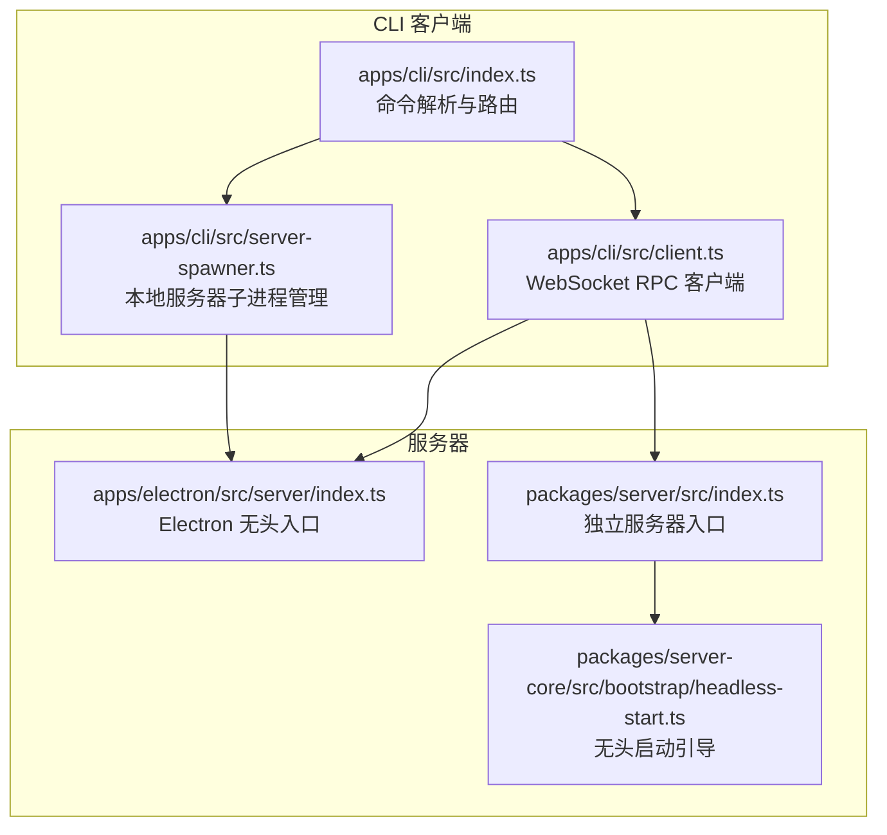
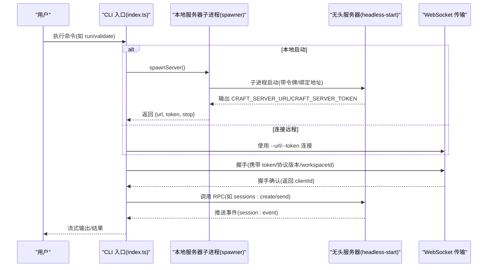
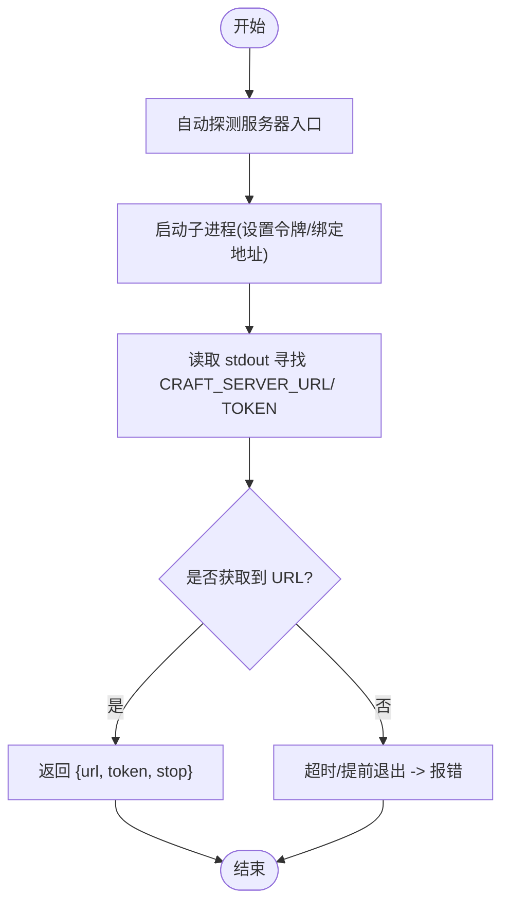
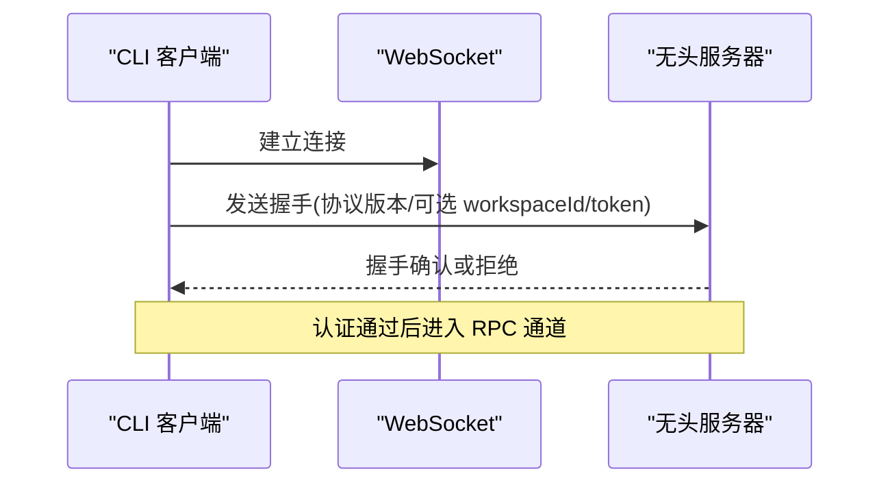
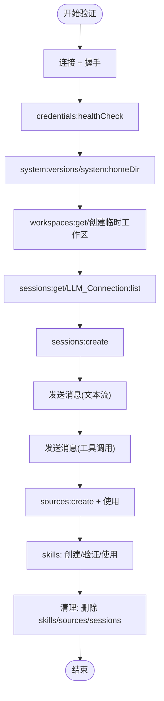
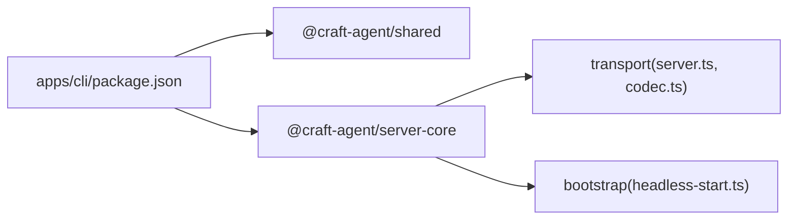

# 服务器模式

<cite>
**本文引用的文件**
- [apps/cli/src/index.ts](file://apps/cli/src/index.ts)
- [apps/cli/src/server-spawner.ts](file://apps/cli/src/server-spawner.ts)
- [apps/cli/src/client.ts](file://apps/cli/src/client.ts)
- [apps/cli/src/run.test.ts](file://apps/cli/src/run.test.ts)
- [apps/cli/src/validate.test.ts](file://apps/cli/src/validate.test.ts)
- [apps/electron/src/server/index.ts](file://apps/electron/src/server/index.ts)
- [packages/server/src/index.ts](file://packages/server/src/index.ts)
- [packages/server-core/src/bootstrap/headless-start.ts](file://packages/server-core/src/bootstrap/headless-start.ts)
- [packages/server-core/src/transport/index.ts](file://packages/server-core/src/transport/index.ts)
- [apps/cli/package.json](file://apps/cli/package.json)
</cite>

## 目录

1. [简介](#简介)
2. [项目结构](#项目结构)
3. [核心组件](#核心组件)
4. [架构总览](#架构总览)
5. [详细组件分析](#详细组件分析)
6. [依赖关系分析](#依赖关系分析)
7. [性能考量](#性能考量)
8. [故障排查指南](#故障排查指南)
9. [结论](#结论)
10. [附录：使用示例与最佳实践](#附录使用示例与最佳实践)

## 简介

本文件面向使用 Craft Agents CLI 的“服务器模式”，系统性说明以下主题：

- 本地服务器启动流程（含自动探测与子进程管理）
- 远程服务器连接机制（WebSocket 安全握手、令牌校验、TLS 支持）
- 服务器验证流程（多步骤集成测试与清理策略）
- 启动参数与环境变量配置
- 生命周期管理、资源清理与错误处理
- 与本地 MCP 服务器的集成方式
- 完整使用示例（含 CI/CD 场景）

目标是让初学者快速上手，同时为有经验的开发者提供足够的技术深度。

## 项目结构

本仓库采用多包结构，与 CLI 服务器模式直接相关的关键位置如下：

- apps/cli：CLI 客户端与命令入口，负责解析参数、连接服务器、执行命令、运行验证
- apps/electron/src/server：Electron 应用的服务器入口（headless 模式）
- packages/server：独立可运行的 headless 服务器入口（Bun）
- packages/server-core：无头服务器引导、传输层、会话管理等核心能力
- apps/cli/src/server-spawner.ts：在 CLI 中以子进程方式启动本地服务器并等待就绪

图表来源

- [apps/cli/src/index.ts](file://apps/cli/src/index.ts#L1290-L1400)
- [apps/cli/src/server-spawner.ts](file://apps/cli/src/server-spawner.ts#L55-L144)
- [apps/electron/src/server/index.ts](file://apps/electron/src/server/index.ts#L1-L21)
- [packages/server/src/index.ts](file://packages/server/src/index.ts#L1-L135)
- [packages/server-core/src/bootstrap/headless-start.ts](file://packages/server-core/src/bootstrap/headless-start.ts#L70-L176)

章节来源

- [apps/cli/src/index.ts](file://apps/cli/src/index.ts#L1225-L1285)
- [apps/cli/src/server-spawner.ts](file://apps/cli/src/server-spawner.ts#L36-L49)
- [apps/electron/src/server/index.ts](file://apps/electron/src/server/index.ts#L1-L21)
- [packages/server/src/index.ts](file://packages/server/src/index.ts#L1-L135)
- [packages/server-core/src/bootstrap/headless-start.ts](file://packages/server-core/src/bootstrap/headless-start.ts#L70-L176)

## 核心组件

- 命令行入口与路由
  - 负责解析参数、设置 TLS CA、分发到具体命令（run/ping/health/validate/invoke/listen 等）
  - 支持从环境变量回退参数值（如 CRAFT*SERVER_URL、CRAFT_SERVER_TOKEN、LLM*\*）
- WebSocket RPC 客户端
  - 实现握手、请求/响应、事件订阅、超时与断开处理
- 本地服务器子进程管理
  - 自动探测服务器入口、启动子进程、读取标准输出中的 URL/令牌、提供停止接口
- 无头服务器引导
  - 解析环境变量、初始化平台与会话、注册 RPC 处理器、支持 TLS/wss、优雅关闭
- 验证流程
  - 多步骤集成测试（连接、工作区、会话、消息流、工具调用、源与技能生命周期），失败也会清理资源

章节来源

- [apps/cli/src/index.ts](file://apps/cli/src/index.ts#L42-L152)
- [apps/cli/src/client.ts](file://apps/cli/src/client.ts#L38-L240)
- [apps/cli/src/server-spawner.ts](file://apps/cli/src/server-spawner.ts#L55-L144)
- [packages/server-core/src/bootstrap/headless-start.ts](file://packages/server-core/src/bootstrap/headless-start.ts#L70-L176)
- [apps/cli/src/index.ts](file://apps/cli/src/index.ts#L1063-L1219)

## 架构总览

下图展示 CLI 与服务器之间的交互路径，以及本地服务器启动与 TLS 支持：

图表来源

- [apps/cli/src/index.ts](file://apps/cli/src/index.ts#L586-L662)
- [apps/cli/src/server-spawner.ts](file://apps/cli/src/server-spawner.ts#L55-L144)
- [packages/server-core/src/bootstrap/headless-start.ts](file://packages/server-core/src/bootstrap/headless-start.ts#L100-L130)
- [apps/cli/src/client.ts](file://apps/cli/src/client.ts#L61-L129)

## 详细组件分析

### 本地服务器启动流程（子进程与自动探测）

- 自动探测服务器入口
  - 通过向上遍历目录寻找 apps/electron/src/server/index.ts，若未找到需显式传入 --server-entry
- 启动子进程
  - 设置 CRAFT_SERVER_TOKEN、CRAFT_RPC_HOST/CRAFT_RPC_PORT（置为 0 表示随机端口）、透传额外环境变量
  - 读取 stdout，解析 CRAFT_SERVER_URL 与 CRAFT_SERVER_TOKEN，确认服务器已就绪
  - 提供 stop() 终止子进程并等待退出
- 超时控制
  - 若在 startupTimeout 内未打印 URL，将终止子进程并报错

图表来源

- [apps/cli/src/server-spawner.ts](file://apps/cli/src/server-spawner.ts#L36-L49)
- [apps/cli/src/server-spawner.ts](file://apps/cli/src/server-spawner.ts#L55-L144)

章节来源

- [apps/cli/src/server-spawner.ts](file://apps/cli/src/server-spawner.ts#L55-L144)

### 远程服务器连接机制（握手、令牌校验、TLS）

- 连接与握手
  - 客户端发起 WebSocket 连接，发送握手包（包含协议版本、可选 workspaceId、token）
  - 服务器校验 token（requireAuth=true），通过后返回握手确认
- 令牌与安全
  - 服务器要求认证；CLI 可通过 --token 或 $CRAFT_SERVER_TOKEN 提供
  - 当绑定非本地地址且未启用 TLS 时，控制台会警告明文传输风险
- TLS 支持
  - 服务器可通过 CRAFT_RPC_TLS_CERT/CRAFT_RPC_TLS_KEY 启用 wss://
  - CLI 可通过 --tls-ca 或设置 NODE_EXTRA_CA_CERTS 加载自签 CA

图表来源

- [apps/cli/src/client.ts](file://apps/cli/src/client.ts#L61-L129)
- [packages/server-core/src/bootstrap/headless-start.ts](file://packages/server-core/src/bootstrap/headless-start.ts#L100-L110)
- [packages/server/src/index.ts](file://packages/server/src/index.ts#L39-L53)
- [apps/cli/src/index.ts](file://apps/cli/src/index.ts#L1294-L1297)

章节来源

- [apps/cli/src/client.ts](file://apps/cli/src/client.ts#L38-L240)
- [packages/server-core/src/bootstrap/headless-start.ts](file://packages/server-core/src/bootstrap/headless-start.ts#L100-L110)
- [packages/server/src/index.ts](file://packages/server/src/index.ts#L39-L53)
- [apps/cli/src/index.ts](file://apps/cli/src/index.ts#L1294-L1297)

### 服务器验证流程（多步骤集成测试）

- 步骤清单
  - 连接与握手、健康检查、版本信息、主目录、工作区列表/自动创建临时工作区、会话列表、LLM 连接列表/自动从环境变量创建、源与技能生命周期、删除资源、断开连接
- 事件流与期望
  - 发送消息后等待 text_delta、tool_start/tool_result 等事件，校验事件完整性
- 清理策略
  - 即使中间步骤失败，也会尽力删除会话、删除临时工作区并清理磁盘
- 输出格式
  - 文本模式显示进度、耗时与摘要；JSON 模式输出结构化结果便于脚本消费

图表来源

- [apps/cli/src/index.ts](file://apps/cli/src/index.ts#L824-L1061)
- [apps/cli/src/index.ts](file://apps/cli/src/index.ts#L1063-L1219)

章节来源

- [apps/cli/src/index.ts](file://apps/cli/src/index.ts#L824-L1061)
- [apps/cli/src/index.ts](file://apps/cli/src/index.ts#L1063-L1219)

### 生命周期管理、资源清理与错误处理

- 生命周期
  - CLI 在 run/validate 命令中负责创建/销毁会话、工作区与资源
  - 服务器在 SIGINT/SIGTERM 下优雅关闭，清理会话与资源
- 错误处理
  - 客户端连接/请求超时、握手被拒、断线重连策略（本客户端不自动重连）
  - 子进程启动超时、URL 未就绪、服务器异常退出
- 清理策略
  - 失败步骤后尽力删除会话、临时工作区与磁盘文件
  - 服务器关闭时刷新并清理会话、关闭 WebSocket、释放 OAuth 资源

章节来源

- [apps/cli/src/index.ts](file://apps/cli/src/index.ts#L591-L662)
- [apps/cli/src/index.ts](file://apps/cli/src/index.ts#L1180-L1204)
- [packages/server-core/src/bootstrap/headless-start.ts](file://packages/server-core/src/bootstrap/headless-start.ts#L132-L162)

### 与本地 MCP 服务器的集成方式

- 本仓库未提供 MCP 服务器的专用实现文件；但 CLI 与服务器通过统一的 RPC 通道通信
- 若需集成 MCP，可在服务器侧注册相应的 RPC 处理器，并通过 CLI 的 invoke/listen 通道进行交互
- 本节为概念性说明，不对应具体源码文件

## 依赖关系分析

- CLI 依赖
  - @craft-agent/shared、@craft-agent/server-core 提供协议编解码与传输层
  - 通过 server-spawner 启动本地服务器
- 服务器依赖
  - server-core 提供无头启动、传输层、会话管理、模型刷新服务等
  - 可通过环境变量配置 TLS、绑定地址与端口

图表来源

- [apps/cli/package.json](file://apps/cli/package.json#L15-L24)
- [packages/server-core/src/transport/index.ts](file://packages/server-core/src/transport/index.ts#L1-L6)
- [packages/server-core/src/bootstrap/headless-start.ts](file://packages/server-core/src/bootstrap/headless-start.ts#L1-L36)

章节来源

- [apps/cli/package.json](file://apps/cli/package.json#L15-L24)
- [packages/server-core/src/transport/index.ts](file://packages/server-core/src/transport/index.ts#L1-L6)
- [packages/server-core/src/bootstrap/headless-start.ts](file://packages/server-core/src/bootstrap/headless-start.ts#L1-L36)

## 性能考量

- 连接与请求超时
  - 客户端默认连接/请求超时可由 --timeout 控制
  - 发送超时（send）用于等待完成事件，避免长时间阻塞
- 事件流与渲染
  - 文本增量事件按到达实时输出；工具调用事件包含工具名与意图，便于可观测
- 服务器绑定与 TLS
  - 绑定到非本地地址且未启用 TLS 时存在明文风险，建议生产环境启用 wss://

章节来源

- [apps/cli/src/index.ts](file://apps/cli/src/index.ts#L47-L88)
- [apps/cli/src/index.ts](file://apps/cli/src/index.ts#L401-L464)
- [packages/server/src/index.ts](file://packages/server/src/index.ts#L118-L126)

## 故障排查指南

- 无法连接服务器
  - 检查 --url 与 --token 是否正确；必要时设置 $CRAFT_SERVER_URL/$CRAFT_SERVER_TOKEN
  - 若使用自签证书，设置 --tls-ca 或 NODE_EXTRA_CA_CERTS
- 本地服务器未就绪
  - 查看子进程 stderr 输出；确认 CRAFT_SERVER_URL/CRAFT_SERVER_TOKEN 是否出现在 stdout
  - 调整 startupTimeout 或检查服务器入口路径（--server-entry）
- 握手失败或认证错误
  - 确认服务器令牌一致；检查服务器日志中是否拒绝了 token
- 事件流异常
  - 确认会话已创建并处于活跃状态；检查是否收到 text_delta/complete 等事件
- 验证失败
  - 使用 --validate-server 并开启 JSON 模式，定位具体失败步骤
  - 关注清理逻辑：即使失败也会尝试删除会话与临时工作区

章节来源

- [apps/cli/src/index.ts](file://apps/cli/src/index.ts#L1294-L1297)
- [apps/cli/src/server-spawner.ts](file://apps/cli/src/server-spawner.ts#L88-L142)
- [apps/cli/src/index.ts](file://apps/cli/src/index.ts#L1063-L1219)

## 结论

Craft Agents CLI 的服务器模式通过“本地子进程启动 + WebSocket RPC + 多步骤验证”的组合，提供了稳定、可脚本化的服务器使用体验。其关键优势在于：

- 易于在 CI/CD 中一键启动与验证
- 强大的事件流与工具调用可观测性
- 完善的生命周期与清理策略
- TLS 支持与安全提示

建议在生产环境中始终启用 TLS，并将令牌与密钥通过环境变量安全注入。

## 附录：使用示例与最佳实践

### 常见命令与参数

- 运行任务（自动启动本地服务器）
  - craft-cli run "<你的提示>"
  - 可选：--workspace-dir、--source、--mode、--output-format、--no-cleanup、--server-entry
- 连接远程服务器
  - craft-cli --url ws://host:port --token <token> run "<提示>"
  - 可选：--tls-ca 加载自签 CA
- 健康检查与诊断
  - craft-cli --validate-server（多步骤验证）
  - craft-cli ping/health/versions/workspaces/sessions
- 直接 RPC 调用与事件监听
  - craft-cli invoke <channel> [json-args...]
  - craft-cli listen <channel>

章节来源

- [apps/cli/src/index.ts](file://apps/cli/src/index.ts#L1225-L1285)
- [apps/cli/src/index.ts](file://apps/cli/src/index.ts#L1291-L1400)

### CI/CD 集成建议

- 在流水线中使用 --validate-server 快速验证服务器可用性
- 将 LLM 凭据通过环境变量注入（如 LLM_API_KEY、LLM_PROVIDER 等）
- 使用 --workspace-dir 指向仓库目录，自动注册为工作区
- 对于自签证书的私有部署，提前准备 CA 并通过 --tls-ca 或 NODE_EXTRA_CA_CERTS 注入
- 将 JSON 模式输出用于后续解析与报告生成

章节来源

- [apps/cli/src/index.ts](file://apps/cli/src/index.ts#L1225-L1285)
- [apps/cli/src/index.ts](file://apps/cli/src/index.ts#L1294-L1297)
- [apps/cli/src/run.test.ts](file://apps/cli/src/run.test.ts#L318-L331)
