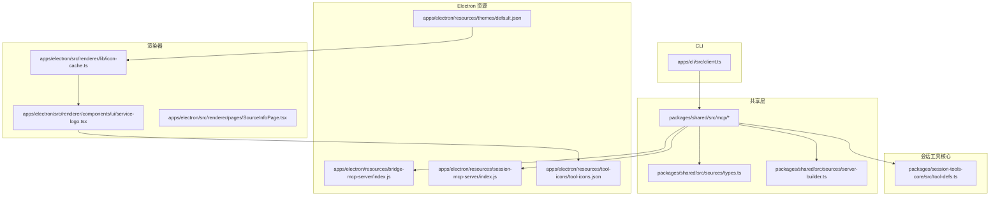
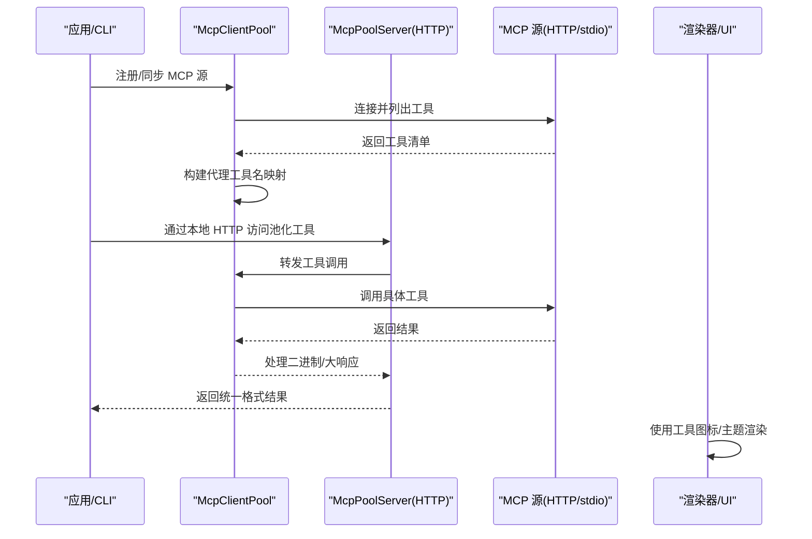
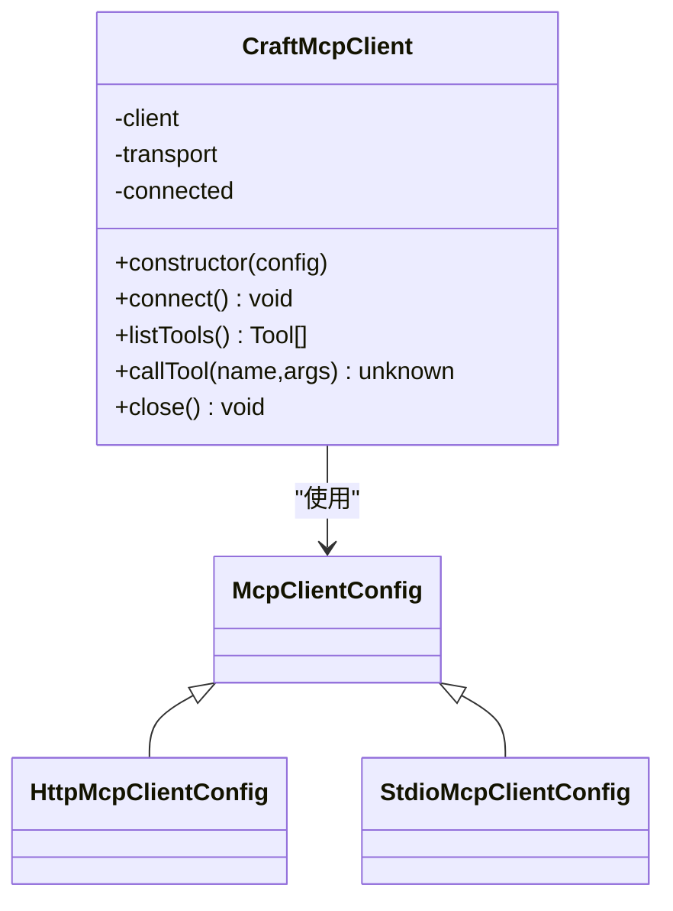
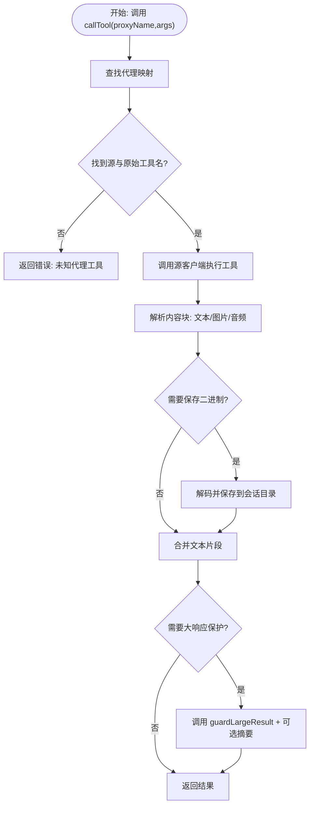
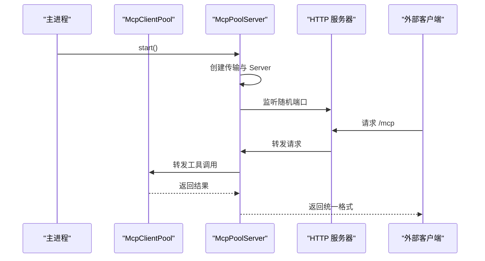
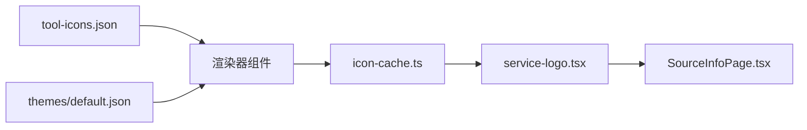
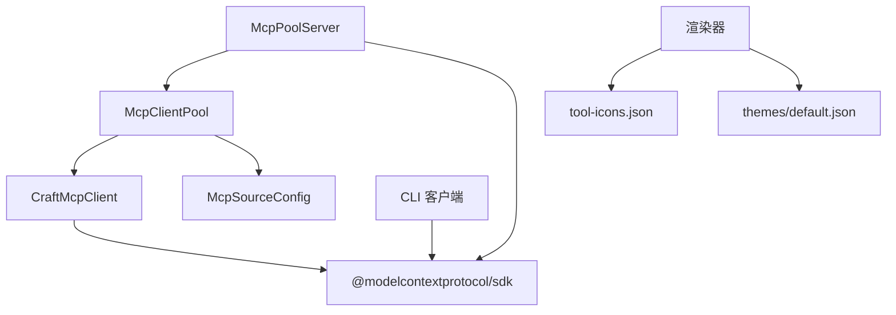

# MCP 服务器集成

<cite>
**本文档引用的文件**
- [packages/shared/src/mcp/client.ts](file://packages/shared/src/mcp/client.ts)
- [packages/shared/src/mcp/mcp-pool.ts](file://packages/shared/src/mcp/mcp-pool.ts)
- [packages/shared/src/mcp/pool-server.ts](file://packages/shared/src/mcp/pool-server.ts)
- [packages/shared/src/mcp/index.ts](file://packages/shared/src/mcp/index.ts)
- [packages/shared/src/sources/types.ts](file://packages/shared/src/sources/types.ts)
- [packages/shared/src/sources/server-builder.ts](file://packages/shared/src/sources/server-builder.ts)
- [packages/session-tools-core/src/tool-defs.ts](file://packages/session-tools-core/src/tool-defs.ts)
- [packages/session-tools-core/src/index.ts](file://packages/session-tools-core/src/index.ts)
- [apps/electron/resources/bridge-mcp-server/index.js](file://apps/electron/resources/bridge-mcp-server/index.js)
- [apps/electron/resources/session-mcp-server/index.js](file://apps/electron/resources/session-mcp-server/index.js)
- [apps/electron/resources/tool-icons/tool-icons.json](file://apps/electron/resources/tool-icons/tool-icons.json)
- [apps/electron/resources/themes/default.json](file://apps/electron/resources/themes/default.json)
- [apps/electron/src/renderer/lib/icon-cache.ts](file://apps/electron/src/renderer/lib/icon-cache.ts)
- [apps/electron/src/renderer/pages/SourceInfoPage.tsx](file://apps/electron/src/renderer/pages/SourceInfoPage.tsx)
- [apps/electron/src/renderer/components/ui/service-logo.tsx](file://apps/electron/src/renderer/components/ui/service-logo.tsx)
- [apps/cli/src/client.ts](file://apps/cli/src/client.ts)
</cite>

## 目录

1. [简介](#简介)
2. [项目结构](#项目结构)
3. [核心组件](#核心组件)
4. [架构总览](#架构总览)
5. [详细组件分析](#详细组件分析)
6. [依赖关系分析](#依赖关系分析)
7. [性能考虑](#性能考虑)
8. [故障排除指南](#故障排除指南)
9. [结论](#结论)
10. [附录](#附录)

## 简介

本文件面向 Craft Agents 的 MCP（Model Context Protocol）服务器集成，系统性阐述协议实现、调用关系、接口与使用模式。内容覆盖：

- MCP 客户端与连接池的实现与扩展点
- 本地工具执行与代理工具注册机制
- 与外部工具与服务的集成方式（HTTP/stdio/SSE）
- 工具图标与主题在 UI 中的应用
- 常见问题与排错建议

目标是让初学者快速上手，同时为有经验的开发者提供足够的技术深度。

## 项目结构

围绕 MCP 的核心代码主要分布在以下模块：

- 共享层（packages/shared）：MCP 客户端、客户端池、池化服务器导出入口
- 会话工具核心（packages/session-tools-core）：会话级工具定义与分发
- Electron 资源（apps/electron/resources）：桥接与会话 MCP 服务器、工具图标与主题
- Electron 渲染器（apps/electron/src/renderer）：图标缓存、服务 Logo 组件、源信息页面
- CLI（apps/cli）：最小化 RPC 客户端示例

图表来源

- [packages/shared/src/mcp/client.ts](file://packages/shared/src/mcp/client.ts#L1-L154)
- [packages/shared/src/mcp/mcp-pool.ts](file://packages/shared/src/mcp/mcp-pool.ts#L1-L414)
- [packages/shared/src/mcp/pool-server.ts](file://packages/shared/src/mcp/pool-server.ts#L40-L178)
- [packages/shared/src/sources/types.ts](file://packages/shared/src/sources/types.ts#L209-L262)
- [packages/shared/src/sources/server-builder.ts](file://packages/shared/src/sources/server-builder.ts#L288-L325)
- [packages/session-tools-core/src/tool-defs.ts](file://packages/session-tools-core/src/tool-defs.ts#L1-L200)
- [apps/electron/resources/bridge-mcp-server/index.js](file://apps/electron/resources/bridge-mcp-server/index.js#L17493-L17518)
- [apps/electron/resources/session-mcp-server/index.js](file://apps/electron/resources/session-mcp-server/index.js#L1-L800)
- [apps/electron/resources/tool-icons/tool-icons.json](file://apps/electron/resources/tool-icons/tool-icons.json#L1-L60)
- [apps/electron/resources/themes/default.json](file://apps/electron/resources/themes/default.json#L1-L26)
- [apps/electron/src/renderer/lib/icon-cache.ts](file://apps/electron/src/renderer/lib/icon-cache.ts#L410-L458)
- [apps/electron/src/renderer/components/ui/service-logo.tsx](file://apps/electron/src/renderer/components/ui/service-logo.tsx#L1-L33)
- [apps/electron/src/renderer/pages/SourceInfoPage.tsx](file://apps/electron/src/renderer/pages/SourceInfoPage.tsx#L120-L168)
- [apps/cli/src/client.ts](file://apps/cli/src/client.ts#L1-L200)

章节来源

- [packages/shared/src/mcp/index.ts](file://packages/shared/src/mcp/index.ts#L1-L4)

## 核心组件

- MCP 客户端（CraftMcpClient）：支持 HTTP/stdio 两种传输，自动健康检查，统一工具发现与调用接口
- MCP 客户端池（McpClientPool）：集中管理多个 MCP 源，缓存工具列表，构建代理工具名映射，统一大响应处理与权限控制
- 池化 MCP 服务器（McpPoolServer）：在本地以 HTTP 形式暴露池内工具，作为外部客户端的统一入口
- 会话工具定义（SESSION_TOOL_DEFS）：会话级工具的单源真相，供 MCP 与后端共享
- 源配置与标准化（McpSourceConfig、normalizeMcpUrl）：统一 MCP 配置字段与 URL 规范化
- 图标与主题：工具图标映射、主题颜色注入、服务 Logo 渲染

章节来源

- [packages/shared/src/mcp/client.ts](file://packages/shared/src/mcp/client.ts#L72-L154)
- [packages/shared/src/mcp/mcp-pool.ts](file://packages/shared/src/mcp/mcp-pool.ts#L78-L414)
- [packages/shared/src/mcp/pool-server.ts](file://packages/shared/src/mcp/pool-server.ts#L40-L178)
- [packages/session-tools-core/src/tool-defs.ts](file://packages/session-tools-core/src/tool-defs.ts#L1-L200)
- [packages/shared/src/sources/types.ts](file://packages/shared/src/sources/types.ts#L209-L262)
- [packages/shared/src/sources/server-builder.ts](file://packages/shared/src/sources/server-builder.ts#L298-L312)

## 架构总览

下图展示 MCP 服务器集成的整体交互：客户端通过 HTTP 或 stdio 连接 MCP 源；客户端池统一管理多个源；池化服务器对外暴露统一入口；渲染器负责图标与主题展示；CLI 提供最小化 RPC 客户端示例。

图表来源

- [packages/shared/src/mcp/mcp-pool.ts](file://packages/shared/src/mcp/mcp-pool.ts#L147-L267)
- [packages/shared/src/mcp/pool-server.ts](file://packages/shared/src/mcp/pool-server.ts#L61-L178)
- [apps/electron/src/renderer/lib/icon-cache.ts](file://apps/electron/src/renderer/lib/icon-cache.ts#L410-L458)
- [apps/electron/src/renderer/components/ui/service-logo.tsx](file://apps/electron/src/renderer/components/ui/service-logo.tsx#L1-L33)

## 详细组件分析

### MCP 客户端（CraftMcpClient）

- 支持传输类型
  - HTTP/Streamable HTTP：远程 MCP 服务器，可设置自定义请求头
  - stdio：本地 MCP 服务器，安全过滤敏感环境变量
- 连接与健康检查
  - 自动 connect 并调用 listTools 进行健康检查
  - 失败时关闭连接并抛出错误
- 工具调用
  - 统一 callTool 接口，返回标准化结果

图表来源

- [packages/shared/src/mcp/client.ts](file://packages/shared/src/mcp/client.ts#L72-L154)

章节来源

- [packages/shared/src/mcp/client.ts](file://packages/shared/src/mcp/client.ts#L72-L154)

### MCP 客户端池（McpClientPool）

- 连接生命周期
  - connect/connectInProcess：注册客户端并缓存工具列表
  - disconnect/disconnectAll：断开连接并清理缓存
- 同步策略（sync）
  - 过滤 stdio 源（按工作区开关）
  - 对比期望与当前源集合，增量连接/断开
  - 触发 onToolsChanged 回调
- 工具发现与代理
  - getTools/getConnectedSlugs/isConnected
  - getProxyToolDefs：生成 mcp**{slug}**{toolName} 的代理工具定义
- 工具执行（callTool）
  - 解析代理名到源与原始工具名
  - 执行并统一处理文本/图片/音频内容块
  - 大响应保护与摘要回调
  - 二进制内容落地到会话目录

图表来源

- [packages/shared/src/mcp/mcp-pool.ts](file://packages/shared/src/mcp/mcp-pool.ts#L324-L405)

章节来源

- [packages/shared/src/mcp/mcp-pool.ts](file://packages/shared/src/mcp/mcp-pool.ts#L78-L414)

### 池化 MCP 服务器（McpPoolServer）

- 本地 HTTP 服务器
  - 随机端口监听，路径 /mcp
  - 通过 Streamable HTTP 传输路由所有方法（POST/GET/DELETE）
- 服务器实例
  - 创建 Server 实例并连接传输
  - 停止时关闭传输、服务器与重置端口
- 名称规范化
  - 内部使用 mcp**{slug}**{toolName}，对外剥离 mcp\_\_ 前缀，便于上层工具注册

图表来源

- [packages/shared/src/mcp/pool-server.ts](file://packages/shared/src/mcp/pool-server.ts#L61-L178)

章节来源

- [packages/shared/src/mcp/pool-server.ts](file://packages/shared/src/mcp/pool-server.ts#L40-L178)

### 会话工具定义与分发

- 单源真相（SESSION_TOOL_DEFS）
  - 定义每个工具的 Zod 模式、描述与处理器
  - 导出工具名集合、注册表与 JSON Schema 转换
- 会话工具过滤
  - 支持按执行模式、安全模式筛选工具名集合
- 与 MCP 的结合
  - 通过 getProxyToolDefs 将工具注册为 mcp**{slug}**{toolName}
  - 在后端或池化服务器中以统一命名消费

章节来源

- [packages/session-tools-core/src/tool-defs.ts](file://packages/session-tools-core/src/tool-defs.ts#L1-L200)
- [packages/session-tools-core/src/index.ts](file://packages/session-tools-core/src/index.ts#L180-L233)

### 源配置与 URL 规范化

- MCP 源配置
  - 支持 http/sse 与 stdio 两种传输
  - HTTP 传输需提供 url、可选 authType、clientId 等
  - stdio 传输需提供 command、args、env
- URL 规范化
  - 移除尾随斜杠
  - 保留 /sse 结尾用于 SSE 类型识别
  - 确保 HTTP 类型带有 /mcp 后缀

章节来源

- [packages/shared/src/sources/types.ts](file://packages/shared/src/sources/types.ts#L209-L262)
- [packages/shared/src/sources/server-builder.ts](file://packages/shared/src/sources/server-builder.ts#L298-L312)

### 本地工具执行与桥接

- 本地 MCP 服务器
  - apps/electron/resources/bridge-mcp-server/index.js：桥接本地工具
  - apps/electron/resources/session-mcp-server/index.js：会话级 MCP 服务器
- 执行流程
  - 通过 stdio 传输启动本地命令
  - 安全过滤敏感环境变量，避免泄露
  - 与池化服务器配合，统一对外暴露

章节来源

- [apps/electron/resources/bridge-mcp-server/index.js](file://apps/electron/resources/bridge-mcp-server/index.js#L17493-L17518)
- [apps/electron/resources/session-mcp-server/index.js](file://apps/electron/resources/session-mcp-server/index.js#L1-L800)
- [packages/shared/src/mcp/client.ts](file://packages/shared/src/mcp/client.ts#L84-L97)

### 工具图标与主题

- 工具图标映射
  - tool-icons.json：工具 ID → 显示名称、图标文件、命令列表
- 主题系统
  - themes/default.json：默认主题色板与明暗模式支持
- 渲染器集成
  - icon-cache.ts：SVG 主题化与数据 URL 转换
  - service-logo.tsx：基于 Google Favicon 的服务 Logo 组件
  - SourceInfoPage.tsx：MCP 工具权限状态展示

图表来源

- [apps/electron/resources/tool-icons/tool-icons.json](file://apps/electron/resources/tool-icons/tool-icons.json#L1-L60)
- [apps/electron/resources/themes/default.json](file://apps/electron/resources/themes/default.json#L1-L26)
- [apps/electron/src/renderer/lib/icon-cache.ts](file://apps/electron/src/renderer/lib/icon-cache.ts#L410-L458)
- [apps/electron/src/renderer/components/ui/service-logo.tsx](file://apps/electron/src/renderer/components/ui/service-logo.tsx#L1-L33)
- [apps/electron/src/renderer/pages/SourceInfoPage.tsx](file://apps/electron/src/renderer/pages/SourceInfoPage.tsx#L120-L168)

章节来源

- [apps/electron/resources/tool-icons/tool-icons.json](file://apps/electron/resources/tool-icons/tool-icons.json#L1-L60)
- [apps/electron/resources/themes/default.json](file://apps/electron/resources/themes/default.json#L1-L26)
- [apps/electron/src/renderer/lib/icon-cache.ts](file://apps/electron/src/renderer/lib/icon-cache.ts#L410-L458)
- [apps/electron/src/renderer/pages/SourceInfoPage.tsx](file://apps/electron/src/renderer/pages/SourceInfoPage.tsx#L120-L168)

### CLI 客户端示例

- 最小化 WebSocket RPC 客户端
  - 握手、请求/响应、超时与销毁
  - 适用于 CLI 场景的轻量接入

章节来源

- [apps/cli/src/client.ts](file://apps/cli/src/client.ts#L1-L200)

## 依赖关系分析

- 组件耦合
  - McpClientPool 依赖 CraftMcpClient 与 ApiSourcePoolClient（通过 PoolClient 接口）
  - 池化服务器依赖 McpClientPool 与 Streamable HTTP 传输
  - 渲染器依赖图标缓存与主题配置
- 外部依赖
  - @modelcontextprotocol/sdk：官方 MCP SDK，提供 Client/Server 与传输实现
  - Electron 资源脚本：本地 MCP 服务器桥接与会话服务器
- 潜在循环依赖
  - 通过接口抽象（PoolClient）与模块导出避免直接循环

图表来源

- [packages/shared/src/mcp/client.ts](file://packages/shared/src/mcp/client.ts#L6-L10)
- [packages/shared/src/mcp/mcp-pool.ts](file://packages/shared/src/mcp/mcp-pool.ts#L16-L21)
- [packages/shared/src/mcp/pool-server.ts](file://packages/shared/src/mcp/pool-server.ts#L67-L71)
- [apps/electron/src/renderer/lib/icon-cache.ts](file://apps/electron/src/renderer/lib/icon-cache.ts#L434-L437)
- [apps/cli/src/client.ts](file://apps/cli/src/client.ts#L8-L16)

章节来源

- [packages/shared/src/mcp/index.ts](file://packages/shared/src/mcp/index.ts#L1-L4)

## 性能考虑

- 连接复用与缓存
  - 客户端池缓存工具列表，减少重复查询
  - 同一源的多个会话共享连接，降低握手成本
- 大响应与二进制处理
  - guardLargeResult 与摘要回调避免内存压力
  - 二进制内容落地到会话目录，避免内存膨胀
- 传输选择
  - 本地 stdio 传输延迟更低，适合高频调用
  - HTTP 传输具备跨进程/跨机器能力，适合分布式场景

## 故障排除指南

- 连接失败
  - 健康检查失败：确认 MCP 服务器可达、URL 正确、认证有效
  - stdio 启动失败：检查命令、参数与环境变量（已过滤敏感变量）
- 工具不可用
  - 代理工具名拼写错误：确保使用 mcp**{slug}**{toolName} 格式
  - 源未连接：调用 sync 后检查 onToolsChanged 回调
- 权限与安全
  - Explore 模式受限：检查安全模式工具集合与权限配置
  - 环境变量泄露风险：确认 BLOCKED_ENV_VARS 列表更新一致
- 图标与主题异常
  - SVG 未正确着色：检查主题色与 icon-cache 处理逻辑
  - 主题不生效：确认主题文件语法与加载路径

章节来源

- [packages/shared/src/mcp/client.ts](file://packages/shared/src/mcp/client.ts#L111-L127)
- [packages/shared/src/mcp/mcp-pool.ts](file://packages/shared/src/mcp/mcp-pool.ts#L207-L267)
- [apps/electron/src/renderer/lib/icon-cache.ts](file://apps/electron/src/renderer/lib/icon-cache.ts#L410-L458)

## 结论

Craft Agents 的 MCP 服务器集成为多源、多传输、强安全与高可用的统一平台。通过客户端池与池化服务器，实现了跨源工具的统一注册与调用；通过会话工具定义与安全模式，保障了工具使用的可控性；通过图标与主题系统，提升了用户体验的一致性。该架构既满足初学者的快速集成需求，也为复杂场景提供了扩展空间。

## 附录

- 关键配置项
  - MCP 源类型：http/sse/stdio
  - HTTP 源：url、authType、clientId、headers
  - stdio 源：command、args、env
- 命名约定
  - 代理工具：mcp**{slug}**{toolName}
  - 主题文件：~/.craft-agent/themes/{name}.json
  - 工具图标：~/.craft-agent/tool-icons.json
