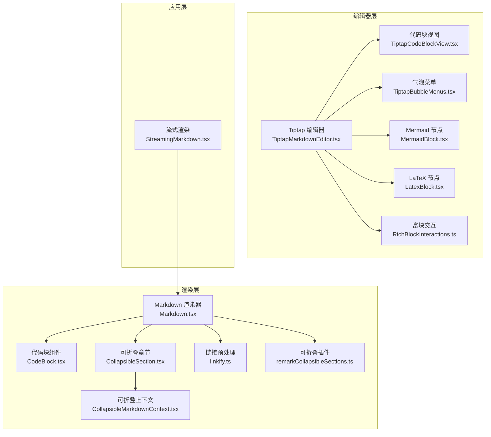
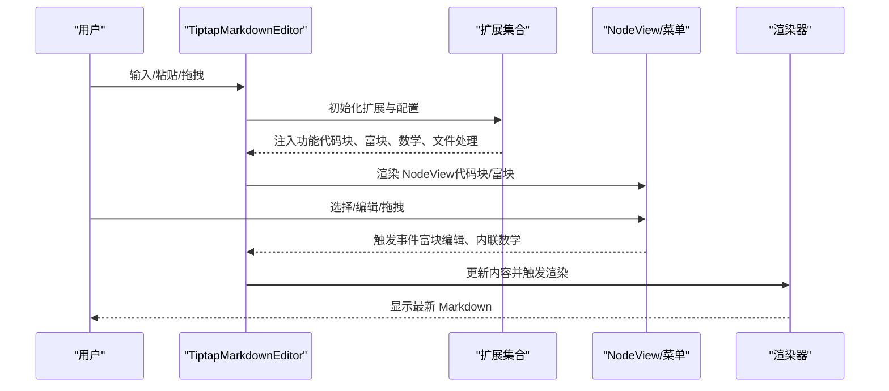
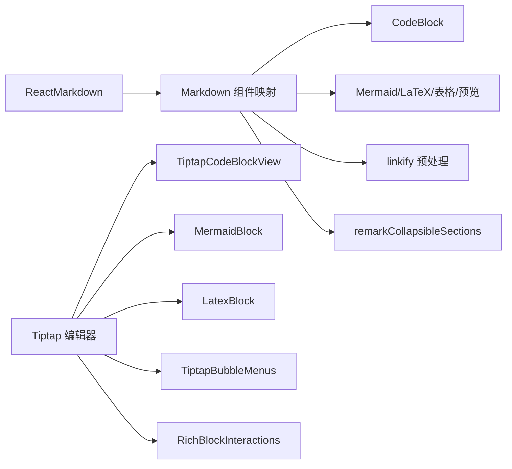

# Markdown 编辑器组件

<cite>
**本文档引用的文件**
- [packages/ui/src/components/markdown/Markdown.tsx](file://packages/ui/src/components/markdown/Markdown.tsx)
- [packages/ui/src/components/markdown/CodeBlock.tsx](file://packages/ui/src/components/markdown/CodeBlock.tsx)
- [packages/ui/src/components/markdown/CollapsibleSection.tsx](file://packages/ui/src/components/markdown/CollapsibleSection.tsx)
- [packages/ui/src/components/markdown/CollapsibleMarkdownContext.tsx](file://packages/ui/src/components/markdown/CollapsibleMarkdownContext.tsx)
- [packages/ui/src/components/markdown/linkify.ts](file://packages/ui/src/components/markdown/linkify.ts)
- [packages/ui/src/components/markdown/remarkCollapsibleSections.ts](file://packages/ui/src/components/markdown/remarkCollapsibleSections.ts)
- [packages/ui/src/components/markdown/TiptapMarkdownEditor.tsx](file://packages/ui/src/components/markdown/TiptapMarkdownEditor.tsx)
- [packages/ui/src/components/markdown/TiptapCodeBlockView.tsx](file://packages/ui/src/components/markdown/TiptapCodeBlockView.tsx)
- [packages/ui/src/components/markdown/TiptapBubbleMenus.tsx](file://packages/ui/src/components/markdown/TiptapBubbleMenus.tsx)
- [packages/ui/src/components/markdown/extensions/MermaidBlock.tsx](file://packages/ui/src/components/markdown/extensions/MermaidBlock.tsx)
- [packages/ui/src/components/markdown/extensions/LatexBlock.tsx](file://packages/ui/src/components/markdown/extensions/LatexBlock.tsx)
- [packages/ui/src/components/markdown/extensions/RichBlockInteractions.ts](file://packages/ui/src/components/markdown/extensions/RichBlockInteractions.ts)
- [apps/electron/src/renderer/components/markdown/StreamingMarkdown.tsx](file://apps/electron/src/renderer/components/markdown/StreamingMarkdown.tsx)
- [packages/ui/src/components/markdown/index.ts](file://packages/ui/src/components/markdown/index.ts)
</cite>

## 目录

1. [简介](#简介)
2. [项目结构](#项目结构)
3. [核心组件](#核心组件)
4. [架构总览](#架构总览)
5. [详细组件分析](#详细组件分析)
6. [依赖关系分析](#依赖关系分析)
7. [性能考虑](#性能考虑)
8. [故障排除指南](#故障排除指南)
9. [结论](#结论)
10. [附录](#附录)

## 简介

本文件面向 Craft Agents 的 Markdown 编辑器与渲染体系，系统化梳理以下能力：

- Markdown 渲染器：三种渲染模式（终端、最小化、完整），语法高亮、数学公式、表格、任务列表、可折叠标题等。
- Tiptap 编辑器：富文本编辑体验，支持代码块语言选择、Mermaid/LaTeX 块、内联数学、粘贴/拖拽图片与 Mermaid 文件、气泡菜单与快捷键。
- 折叠区块：基于 remark 插件的可折叠章节，配合动画与上下文状态管理。
- 流式渲染：针对长内容与流式输出的分块渲染与缓存策略。
- 样式与主题：Shiki 主题、KaTeX、Tailwind 类名与变量驱动的样式体系。
- 可访问性与响应式：键盘导航、焦点管理、悬停动作、动画时序与布局适配。

## 项目结构

Markdown 相关组件主要位于 packages/ui/src/components/markdown，编辑器入口在 TiptapMarkdownEditor.tsx；应用层还提供了流式渲染组件 StreamingMarkdown.tsx。

图表来源

- [packages/ui/src/components/markdown/Markdown.tsx](file://packages/ui/src/components/markdown/Markdown.tsx#L459-L523)
- [packages/ui/src/components/markdown/TiptapMarkdownEditor.tsx](file://packages/ui/src/components/markdown/TiptapMarkdownEditor.tsx#L234-L425)
- [apps/electron/src/renderer/components/markdown/StreamingMarkdown.tsx](file://apps/electron/src/renderer/components/markdown/StreamingMarkdown.tsx#L139-L185)

章节来源

- [packages/ui/src/components/markdown/index.ts](file://packages/ui/src/components/markdown/index.ts#L1-L15)

## 核心组件

- Markdown 渲染器：支持三种渲染模式，内置链接点击回调、可折叠标题、数学公式、表格、任务列表、GFM 支持等。
- CodeBlock：基于 Shiki 的语法高亮，带复制按钮与主题切换。
- CollapsibleSection + CollapsibleMarkdownContext：可折叠章节与全局状态管理。
- linkify：将裸 URL/文件路径转换为 Markdown 链接，避免误判代码块与已有链接。
- remarkCollapsibleSections：AST 层转换，将标题与其内容包裹为可折叠 section。
- TiptapMarkdownEditor：富文本编辑器，支持多种扩展、粘贴/拖拽、气泡菜单、富块交互。
- TiptapCodeBlockView：常规代码块的 NodeView，含语言选择、复制、悬停动作。
- TiptapBubbleMenus：文本格式、富块编辑、内联数学编辑的气泡菜单。
- MermaidBlock/LatexBlock：专用富块节点，支持编辑弹窗与拖拽选择。
- RichBlockInteractions：富块选中高亮、键盘导航、加载状态同步。
- StreamingMarkdown：流式内容分块渲染与缓存，提升长文本更新性能。

章节来源

- [packages/ui/src/components/markdown/Markdown.tsx](file://packages/ui/src/components/markdown/Markdown.tsx#L41-L74)
- [packages/ui/src/components/markdown/CodeBlock.tsx](file://packages/ui/src/components/markdown/CodeBlock.tsx#L6-L21)
- [packages/ui/src/components/markdown/CollapsibleSection.tsx](file://packages/ui/src/components/markdown/CollapsibleSection.tsx#L27-L33)
- [packages/ui/src/components/markdown/CollapsibleMarkdownContext.tsx](file://packages/ui/src/components/markdown/CollapsibleMarkdownContext.tsx#L22-L24)
- [packages/ui/src/components/markdown/linkify.ts](file://packages/ui/src/components/markdown/linkify.ts#L11-L26)
- [packages/ui/src/components/markdown/remarkCollapsibleSections.ts](file://packages/ui/src/components/markdown/remarkCollapsibleSections.ts#L16-L54)
- [packages/ui/src/components/markdown/TiptapMarkdownEditor.tsx](file://packages/ui/src/components/markdown/TiptapMarkdownEditor.tsx#L216-L232)
- [packages/ui/src/components/markdown/TiptapCodeBlockView.tsx](file://packages/ui/src/components/markdown/TiptapCodeBlockView.tsx#L11-L14)
- [packages/ui/src/components/markdown/TiptapBubbleMenus.tsx](file://packages/ui/src/components/markdown/TiptapBubbleMenus.tsx#L434-L531)
- [packages/ui/src/components/markdown/extensions/MermaidBlock.tsx](file://packages/ui/src/components/markdown/extensions/MermaidBlock.tsx#L8-L79)
- [packages/ui/src/components/markdown/extensions/LatexBlock.tsx](file://packages/ui/src/components/markdown/extensions/LatexBlock.tsx#L10-L81)
- [packages/ui/src/components/markdown/extensions/RichBlockInteractions.ts](file://packages/ui/src/components/markdown/extensions/RichBlockInteractions.ts#L55-L224)
- [apps/electron/src/renderer/components/markdown/StreamingMarkdown.tsx](file://apps/electron/src/renderer/components/markdown/StreamingMarkdown.tsx#L4-L10)

## 架构总览

渲染与编辑两条主线协同工作：

- 渲染链路：Markdown 预处理（linkify）→ remark 插件（GFM、数学、可折叠）→ ReactMarkdown 渲染 → 自定义组件（CodeBlock、Mermaid、LaTeX、表格等）。
- 编辑链路：Tiptap 编辑器初始化扩展（StarterKit、Placeholder、TaskList、Image、FileHandler、Mermaid/LaTeX、Mathematics、Markdown）、NodeView（代码块/富块）、气泡菜单与富块交互插件。

图表来源

- [packages/ui/src/components/markdown/TiptapMarkdownEditor.tsx](file://packages/ui/src/components/markdown/TiptapMarkdownEditor.tsx#L251-L319)
- [packages/ui/src/components/markdown/TiptapCodeBlockView.tsx](file://packages/ui/src/components/markdown/TiptapCodeBlockView.tsx#L283-L323)
- [packages/ui/src/components/markdown/TiptapBubbleMenus.tsx](file://packages/ui/src/components/markdown/TiptapBubbleMenus.tsx#L434-L531)

## 详细组件分析

### Markdown 渲染器（Markdown.tsx）

- 渲染模式
  - terminal：极简排版，保留控制字符，适合日志与原始输出。
  - minimal：语法高亮、简洁排版，适合聊天消息与内联内容。
  - full：丰富排版、表格、悬停动作、任务列表、块引用、水平线等。
- 自定义组件映射
  - 代码块：根据语言分流到 CodeBlock、Mermaid、LaTeX、JSON、数据表、电子表格、PDF/图片预览、Diff 等。
  - 链接：统一通过回调 onUrlClick/onFileClick 处理，自动识别文件路径与 URL。
  - 列表：任务列表复用 input checkbox，保持可读性。
  - 表格：最小化与完整模式分别采用滚动容器与带边框的表格。
- 性能优化
  - MemoizedMarkdown：基于 id 或内容+模式进行浅比较，避免重复解析。
  - 链接预处理：仅在存在潜在链接时执行，减少不必要的字符串扫描。
- 数学与可折叠
  - remarkMath 与 remarkCollapsibleSections 插件按需启用。
  - 可折叠标题通过 remark 插件转换为 section，并由 CollapsibleSection 渲染。
- 无障碍与交互
  - 链接为可点击元素，具备 hover/聚焦态与可访问标签。
  - 任务列表输入框为只读，避免误操作。

章节来源

- [packages/ui/src/components/markdown/Markdown.tsx](file://packages/ui/src/components/markdown/Markdown.tsx#L27-L39)
- [packages/ui/src/components/markdown/Markdown.tsx](file://packages/ui/src/components/markdown/Markdown.tsx#L94-L447)
- [packages/ui/src/components/markdown/Markdown.tsx](file://packages/ui/src/components/markdown/Markdown.tsx#L459-L523)
- [packages/ui/src/components/markdown/Markdown.tsx](file://packages/ui/src/components/markdown/Markdown.tsx#L531-L549)

### 代码块组件（CodeBlock.tsx）

- 功能特性
  - 基于 Shiki 的语法高亮，支持语言别名与缓存。
  - 三种模式：terminal/minimal/full，分别对应不同样式与交互。
  - 复制按钮：点击复制源码，短暂反馈。
  - 主题：优先从上下文获取，否则回退到系统/强制主题。
- 性能
  - LRU 缓存，限制最大容量，避免内存膨胀。
  - 异步高亮，失败回退到纯文本。

章节来源

- [packages/ui/src/components/markdown/CodeBlock.tsx](file://packages/ui/src/components/markdown/CodeBlock.tsx#L64-L219)

### 可折叠章节（CollapsibleSection.tsx）

- 行为
  - 仅 H1-H4 支持折叠；H5-H6 直接渲染。
  - 点击标题区域触发折叠/展开；展开时显示内容，折叠时隐藏。
- 动画
  - 使用 motion/react 实现高度与透明度的平滑过渡。
  - 折叠时旋转指示器图标，展开时在悬停时显示指示器。
- 无障碍
  - 通过 data-\* 属性传递 section-id 与 heading-level，供上层上下文使用。

章节来源

- [packages/ui/src/components/markdown/CollapsibleSection.tsx](file://packages/ui/src/components/markdown/CollapsibleSection.tsx#L27-L103)

### 可折叠上下文（CollapsibleMarkdownContext.tsx）

- 提供
  - collapsedSections：当前折叠的 section 集合。
  - toggleSection：切换指定 section 的折叠状态。
  - expandAll：一键展开所有 section。
- 使用方式
  - 在 Markdown 包裹 CollapsibleMarkdownProvider 后，内部的 CollapsibleSection 生效。

章节来源

- [packages/ui/src/components/markdown/CollapsibleMarkdownContext.tsx](file://packages/ui/src/components/markdown/CollapsibleMarkdownContext.tsx#L22-L61)

### 链接预处理（linkify.ts）

- 能力
  - 使用 linkify-it 检测 URL/邮箱；结合自定义正则检测本地文件路径。
  - 排除代码块与已存在的 Markdown 链接，避免重复或错误链接。
  - 提供 detectLinks、preprocessLinks、hasLinks、isFilePathTarget 等工具函数。
- 性能
  - 快速预检（pretest）与范围查找，减少无谓扫描。

章节来源

- [packages/ui/src/components/markdown/linkify.ts](file://packages/ui/src/components/markdown/linkify.ts#L123-L209)

### 可折叠插件（remarkCollapsibleSections.ts）

- 能力
  - 将同一层级的标题与其内容包裹为 section，支持嵌套。
  - 生成唯一 section-id 与 heading-level，便于渲染与交互。
- 注意
  - 深度优先处理（6→1），确保嵌套正确。

章节来源

- [packages/ui/src/components/markdown/remarkCollapsibleSections.ts](file://packages/ui/src/components/markdown/remarkCollapsibleSections.ts#L43-L127)

### Tiptap 富文本编辑器（TiptapMarkdownEditor.tsx）

- 扩展与功能
  - StarterKit（禁用默认 codeBlock，自定义 heading levels）。
  - Placeholder、TaskList/TaskItem、Image（允许 Base64）、FileHandler（粘贴/拖拽文件）。
  - Mathematics（内联数学，点击进入编辑）、@tiptap/markdown 或 tiptap-markdown。
  - MermaidBlock、LatexBlock、RichBlockInteractions。
  - 可选 TiptapSlashMenu（编辑时触发）。
- 内容同步
  - 官方引擎：preprocess/postprocess 处理货币符号与行间数学，避免误解析。
  - 内容变更时通过 onUpdate 回调返回 Markdown 字符串。
- 编辑态安全
  - 当编辑器聚焦时，外部内容变化不会重置编辑状态，避免丢失临时块状态。

章节来源

- [packages/ui/src/components/markdown/TiptapMarkdownEditor.tsx](file://packages/ui/src/components/markdown/TiptapMarkdownEditor.tsx#L251-L319)
- [packages/ui/src/components/markdown/TiptapMarkdownEditor.tsx](file://packages/ui/src/components/markdown/TiptapMarkdownEditor.tsx#L325-L377)
- [packages/ui/src/components/markdown/TiptapMarkdownEditor.tsx](file://packages/ui/src/components/markdown/TiptapMarkdownEditor.tsx#L380-L417)

### 代码块视图（TiptapCodeBlockView.tsx）

- 功能
  - NodeView 渲染常规代码块，提供语言选择下拉、复制按钮与悬停动作。
  - 支持语言搜索与键盘导航，高亮当前选中项。
  - 与 Shiki 集成，动态高亮与缓存。
- 交互
  - 语言过滤输入框，支持上下箭头与回车选择。
  - 复制成功短暂提示。

章节来源

- [packages/ui/src/components/markdown/TiptapCodeBlockView.tsx](file://packages/ui/src/components/markdown/TiptapCodeBlockView.tsx#L102-L278)
- [packages/ui/src/components/markdown/TiptapCodeBlockView.tsx](file://packages/ui/src/components/markdown/TiptapCodeBlockView.tsx#L283-L323)

### 气泡菜单（TiptapBubbleMenus.tsx）

- 文本格式菜单：粗体、斜体、删除线、代码、内联数学。
- 富块编辑菜单：Mermaid/LaTeX 富块的弹窗编辑，支持自动调整位置。
- 内联数学编辑菜单：输入框，支持 Enter/Escape/方向键移动光标。
- 定位策略：基于 NodeSelection 的虚拟锚点，保证在复杂布局中稳定定位。

章节来源

- [packages/ui/src/components/markdown/TiptapBubbleMenus.tsx](file://packages/ui/src/components/markdown/TiptapBubbleMenus.tsx#L434-L531)

### 富块节点（MermaidBlock/LatexBlock）

- MermaidBlock：渲染 Mermaid 图表，支持编辑弹窗与拖拽选择。
- LatexBlock：渲染 LaTeX 公式，支持编辑弹窗。
- 与 RichBlockShell 协作，提供统一的富块外壳与交互。

章节来源

- [packages/ui/src/components/markdown/extensions/MermaidBlock.tsx](file://packages/ui/src/components/markdown/extensions/MermaidBlock.tsx#L44-L77)
- [packages/ui/src/components/markdown/extensions/LatexBlock.tsx](file://packages/ui/src/components/markdown/extensions/LatexBlock.tsx#L46-L79)

### 富块交互（RichBlockInteractions.ts）

- 选中高亮：对富块与内联数学进行选中装饰，拖拽期间暂停高亮。
- 键盘导航：在富块之间使用上下箭头快速跳转。
- 文本输入：NodeSelection 下直接输入触发富块编辑。
- 图片加载状态：追踪图片加载完成/失败，设置 data-\* 属性。

章节来源

- [packages/ui/src/components/markdown/extensions/RichBlockInteractions.ts](file://packages/ui/src/components/markdown/extensions/RichBlockInteractions.ts#L55-L224)

### 流式渲染（StreamingMarkdown.tsx）

- 分块策略
  - 将内容按段落与代码块切分为 blocks，最后一块为“活动块”持续更新。
  - 已完成块使用内容哈希作为 key，避免重复渲染。
- 性能
  - React.memo 包装单个块组件，仅当内容或模式变化时重渲染。
  - 适用于长文本与实时流式输出场景。

章节来源

- [apps/electron/src/renderer/components/markdown/StreamingMarkdown.tsx](file://apps/electron/src/renderer/components/markdown/StreamingMarkdown.tsx#L38-L92)
- [apps/electron/src/renderer/components/markdown/StreamingMarkdown.tsx](file://apps/electron/src/renderer/components/markdown/StreamingMarkdown.tsx#L101-L121)
- [apps/electron/src/renderer/components/markdown/StreamingMarkdown.tsx](file://apps/electron/src/renderer/components/markdown/StreamingMarkdown.tsx#L139-L185)

## 依赖关系分析

- 渲染器依赖
  - react-markdown、remarkGfm、remarkMath、rehypeKatex、rehypeRaw。
  - linkify 工具用于预处理链接。
  - remarkCollapsibleSections 用于 AST 层转换。
- 编辑器依赖
  - @tiptap/react、@tiptap/starter-kit、@tiptap/extension-mathematics、@tiptap/extension-image、@tiptap/extension-file-handler。
  - 自定义扩展：MermaidBlock、LatexBlock、RichBlockInteractions。
  - NodeView：TiptapCodeBlockView。
- 动画与交互
  - motion/react 用于折叠动画与菜单定位。
  - Floating UI 用于气泡菜单定位（由 @tiptap/react/menus 集成）。

图表来源

- [packages/ui/src/components/markdown/Markdown.tsx](file://packages/ui/src/components/markdown/Markdown.tsx#L514-L521)
- [packages/ui/src/components/markdown/TiptapMarkdownEditor.tsx](file://packages/ui/src/components/markdown/TiptapMarkdownEditor.tsx#L251-L319)

章节来源

- [packages/ui/src/components/markdown/Markdown.tsx](file://packages/ui/src/components/markdown/Markdown.tsx#L1-L26)
- [packages/ui/src/components/markdown/TiptapMarkdownEditor.tsx](file://packages/ui/src/components/markdown/TiptapMarkdownEditor.tsx#L1-L21)

## 性能考虑

- 渲染性能
  - MemoizedMarkdown 与 MemoizedBlock：基于 id 或内容+模式浅比较，避免重复解析与高亮。
  - linkify 预处理：仅在存在潜在链接时执行，减少字符串扫描成本。
  - Shiki 缓存：LRU 缓存高亮结果，限制容量，命中率高。
- 编辑器性能
  - 官方引擎预处理：保护货币符号与行间数学，避免误解析导致的重算。
  - NodeView 与富块交互：通过插件状态与装饰减少不必要的 DOM 更新。
- 动画与布局
  - 折叠动画使用固定时长与缓动，避免布局抖动。
  - 气泡菜单定位使用 requestAnimationFrame 与事务元数据，确保稳定。

[本节为通用性能建议，不直接分析具体文件]

## 故障排除指南

- 链接未被识别
  - 检查是否处于代码块或已有 Markdown 链接范围内。
  - 确认 linkify 预处理逻辑是否被跳过（如 hasLinks 返回 false）。
- 数学公式未渲染
  - 确认 remarkMath 是否启用（collapsible 模式下仍启用）。
  - 内联数学需使用 $...$，行间数学使用 $$...$$。
- 代码块高亮异常
  - 检查语言名称是否在 Shiki 支持列表或别名映射中。
  - 查看缓存是否命中，必要时清理缓存后重试。
- 富块无法编辑
  - 确认富块类型是否为 mermaidBlock 或 latexBlock。
  - 检查富块交互插件是否启用，以及 NodeSelection 是否正确。
- 气泡菜单定位偏移
  - 确保编辑器内容变化后触发了位置更新（如编辑弹窗打开时的 RAF 序列）。
- 流式渲染闪烁
  - 确认已完成块使用稳定 key（内容哈希），仅活动块更新。

章节来源

- [packages/ui/src/components/markdown/linkify.ts](file://packages/ui/src/components/markdown/linkify.ts#L173-L209)
- [packages/ui/src/components/markdown/Markdown.tsx](file://packages/ui/src/components/markdown/Markdown.tsx#L499-L510)
- [packages/ui/src/components/markdown/TiptapBubbleMenus.tsx](file://packages/ui/src/components/markdown/TiptapBubbleMenus.tsx#L244-L268)
- [apps/electron/src/renderer/components/markdown/StreamingMarkdown.tsx](file://apps/electron/src/renderer/components/markdown/StreamingMarkdown.tsx#L164-L182)

## 结论

Craft Agents 的 Markdown 编辑与渲染体系以模块化与可扩展为核心：

- 渲染器提供多模式与丰富的块级组件，兼顾性能与可读性。
- 编辑器通过 Tiptap 与自定义扩展，实现富块、数学、代码块与交互的一体化体验。
- 折叠区块与流式渲染进一步提升长文档与实时场景的可用性。
- 通过主题、动画与无障碍设计，满足多样化的使用需求。

[本节为总结性内容，不直接分析具体文件]

## 附录

### 组件属性与事件清单

- Markdown 渲染器（MarkdownProps）
  - 属性：children、mode、className、id、onUrlClick、onFileClick、collapsible、hideFirstMermaidExpand
  - 事件：无（通过回调处理交互）
- CodeBlock（CodeBlockProps）
  - 属性：code、language、className、mode、forcedTheme
  - 事件：无
- CollapsibleSection（CollapsibleSectionProps）
  - 属性：sectionId、headingLevel、isCollapsed、onToggle、children
  - 事件：无
- CollapsibleMarkdownContext（Provider）
  - 属性：children
  - 方法：toggleSection、expandAll
- TiptapMarkdownEditor（TiptapMarkdownEditorProps）
  - 属性：content、onUpdate、placeholder、className、editable、markdownEngine
  - 事件：无（通过 onUpdate 回调）
- TiptapCodeBlockView（NodeView Props）
  - 属性：node、updateAttributes
  - 事件：无
- TiptapBubbleMenus
  - 属性：editor
  - 事件：富块编辑、内联数学编辑（自定义事件）

章节来源

- [packages/ui/src/components/markdown/Markdown.tsx](file://packages/ui/src/components/markdown/Markdown.tsx#L41-L74)
- [packages/ui/src/components/markdown/CodeBlock.tsx](file://packages/ui/src/components/markdown/CodeBlock.tsx#L6-L21)
- [packages/ui/src/components/markdown/CollapsibleSection.tsx](file://packages/ui/src/components/markdown/CollapsibleSection.tsx#L27-L33)
- [packages/ui/src/components/markdown/CollapsibleMarkdownContext.tsx](file://packages/ui/src/components/markdown/CollapsibleMarkdownContext.tsx#L22-L24)
- [packages/ui/src/components/markdown/TiptapMarkdownEditor.tsx](file://packages/ui/src/components/markdown/TiptapMarkdownEditor.tsx#L216-L232)
- [packages/ui/src/components/markdown/TiptapCodeBlockView.tsx](file://packages/ui/src/components/markdown/TiptapCodeBlockView.tsx#L11-L14)
- [packages/ui/src/components/markdown/TiptapBubbleMenus.tsx](file://packages/ui/src/components/markdown/TiptapBubbleMenus.tsx#L434-L435)

### 使用示例与最佳实践

- 渲染 Markdown
  - 选择模式：根据场景选择 terminal/minimal/full。
  - 处理链接：提供 onUrlClick/onFileClick 回调，区分文件路径与 URL。
  - 可折叠标题：在 Markdown 外层包裹 CollapsibleMarkdownProvider。
- 编辑 Markdown
  - 选择引擎：官方引擎更严格，legacy 更保守。
  - 富块编辑：选中富块后使用 Enter 或点击编辑按钮。
  - 代码块语言：通过 NodeView 下拉选择语言，支持搜索与键盘导航。
- 流式渲染
  - 对长文本或实时输出使用 StreamingMarkdown，确保已完成块稳定渲染。

[本节为使用建议，不直接分析具体文件]

### 响应式设计与无障碍访问

- 响应式
  - 表格在 minimal 模式下使用横向滚动容器，在 full 模式下使用带边框与悬停态。
  - 折叠动画时长与缓动固定，避免布局抖动。
- 无障碍
  - 链接具备可访问标签与 hover/聚焦态。
  - 任务列表输入框为只读，避免误操作。
  - 气泡菜单定位使用 DOMRect 与虚拟元素，确保键盘可达。

[本节为通用指导，不直接分析具体文件]

### 样式自定义与主题支持

- 主题
  - CodeBlock 优先从上下文获取 Shiki 主题，否则回退到系统/强制主题。
  - 编辑器使用 GitHub 风格的主题（github-light/dark）。
- 变量与类名
  - 使用 Tailwind 类名与 CSS 变量（如 --md-bullets、--z-floating-menu）控制样式细节。
- 自定义
  - 通过 className 与 mode 参数微调渲染样式。
  - 通过组件映射与插件扩展新增块类型。

章节来源

- [packages/ui/src/components/markdown/CodeBlock.tsx](file://packages/ui/src/components/markdown/CodeBlock.tsx#L86-L93)
- [packages/ui/src/components/markdown/TiptapMarkdownEditor.tsx](file://packages/ui/src/components/markdown/TiptapMarkdownEditor.tsx#L261-L263)
- [packages/ui/src/components/markdown/TiptapBubbleMenus.tsx](file://packages/ui/src/components/markdown/TiptapBubbleMenus.tsx#L427-L432)

### 跨浏览器兼容性与性能优化

- 兼容性
  - KaTeX 与 Shiki 在现代浏览器中表现稳定；低版本浏览器注意 polyfill。
  - 气泡菜单定位依赖 Floating UI，确保在嵌套布局中稳定。
- 性能
  - 链接预处理与 Memoization 双重保障。
  - Shiki 缓存与异步高亮，失败回退到纯文本。
  - 编辑器内容同步与富块交互插件减少不必要的重绘。

[本节为通用指导，不直接分析具体文件]

### 组件组合与集成模式

- 渲染器组合
  - Markdown 渲染器可与 CollapsibleMarkdownProvider、MemoizedMarkdown 组合使用。
  - 与 linkify 配合，自动将裸链接转换为可点击链接。
- 编辑器组合
  - TiptapMarkdownEditor 与 TiptapBubbleMenus、RichBlockInteractions、MermaidBlock/LatexBlock 协同。
  - NodeView 与代码块语言选择形成完整的编辑体验。
- 应用层集成
  - StreamingMarkdown 与 Markdown 渲染器组合，适用于长文本与流式输出场景。

章节来源

- [packages/ui/src/components/markdown/index.ts](file://packages/ui/src/components/markdown/index.ts#L5-L14)
- [apps/electron/src/renderer/components/markdown/StreamingMarkdown.tsx](file://apps/electron/src/renderer/components/markdown/StreamingMarkdown.tsx#L139-L185)
