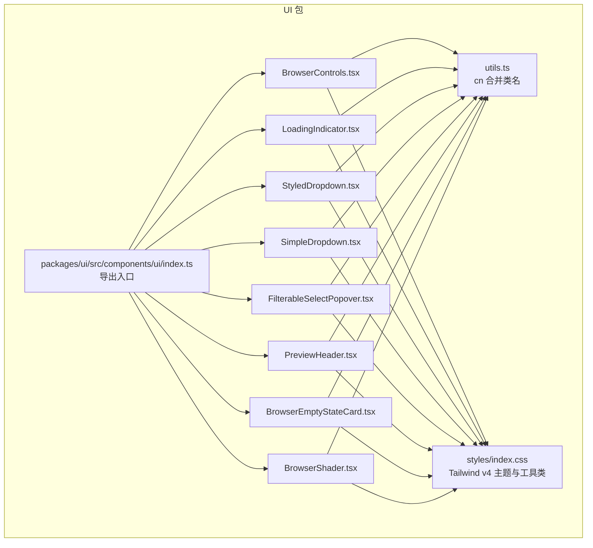
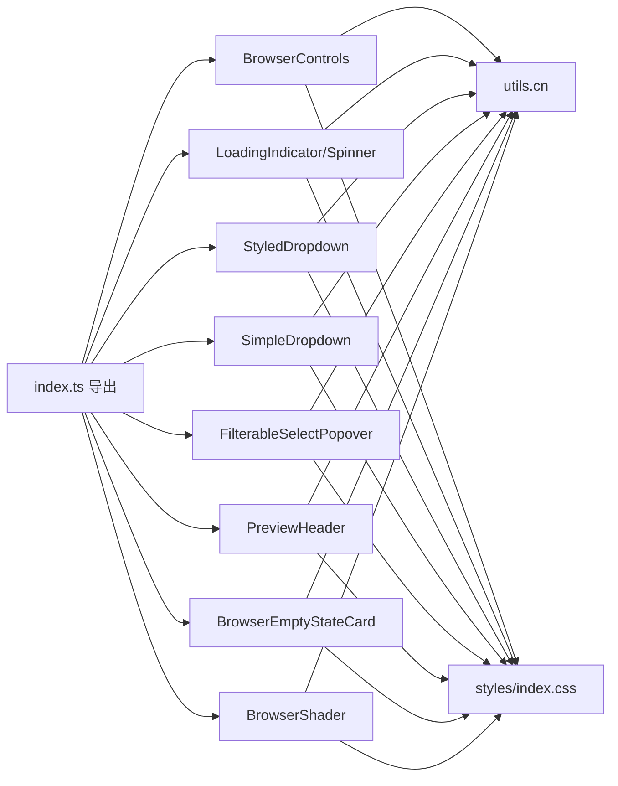
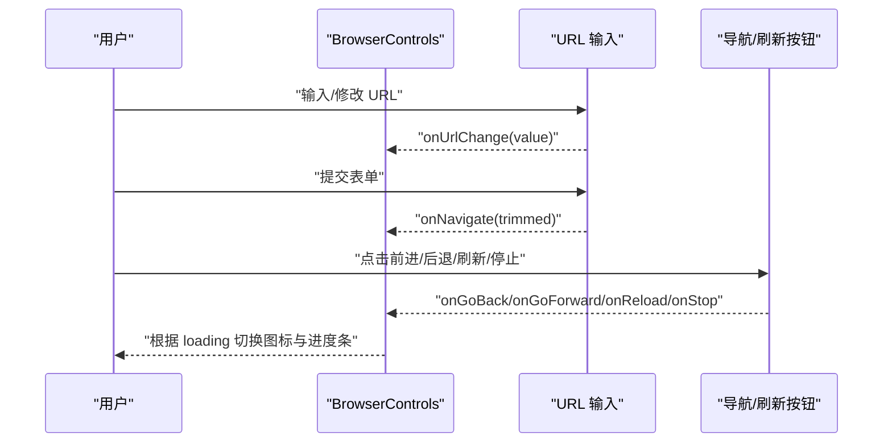
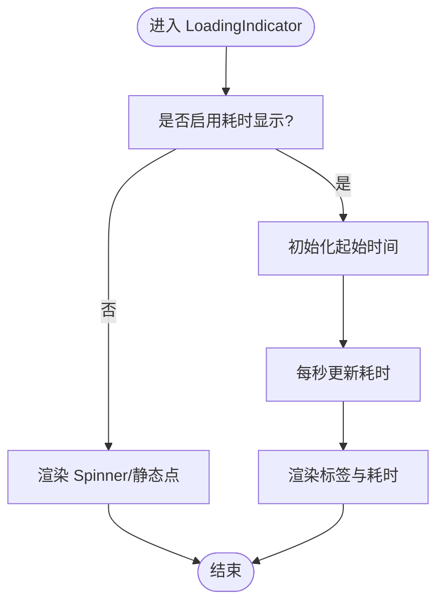
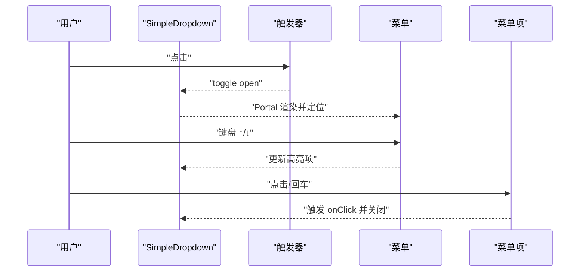
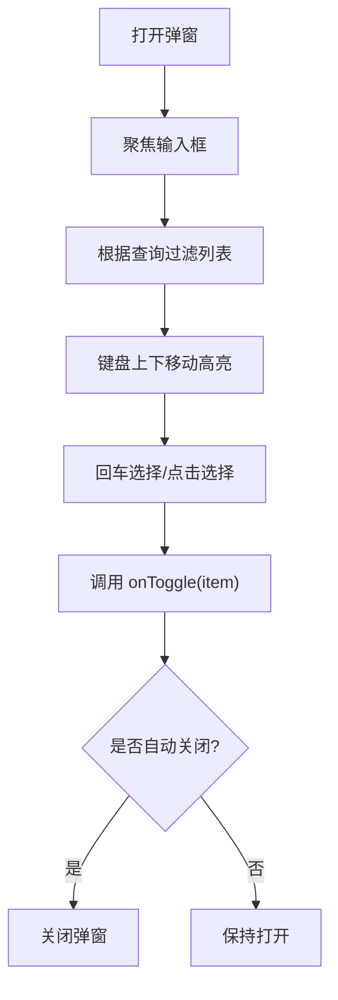
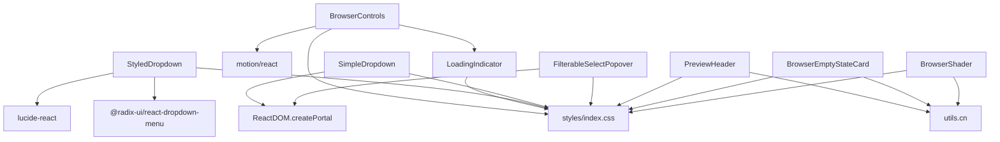

# UI 框架组件

<cite>
**本文引用的文件**
- [packages/ui/src/components/ui/BrowserControls.tsx](file://packages/ui/src/components/ui/BrowserControls.tsx)
- [packages/ui/src/components/ui/LoadingIndicator.tsx](file://packages/ui/src/components/ui/LoadingIndicator.tsx)
- [packages/ui/src/components/ui/StyledDropdown.tsx](file://packages/ui/src/components/ui/StyledDropdown.tsx)
- [packages/ui/src/components/ui/SimpleDropdown.tsx](file://packages/ui/src/components/ui/SimpleDropdown.tsx)
- [packages/ui/src/components/ui/FilterableSelectPopover.tsx](file://packages/ui/src/components/ui/FilterableSelectPopover.tsx)
- [packages/ui/src/components/ui/PreviewHeader.tsx](file://packages/ui/src/components/ui/PreviewHeader.tsx)
- [packages/ui/src/components/ui/BrowserEmptyStateCard.tsx](file://packages/ui/src/components/ui/BrowserEmptyStateCard.tsx)
- [packages/ui/src/components/ui/BrowserShader.tsx](file://packages/ui/src/components/ui/BrowserShader.tsx)
- [packages/ui/src/components/ui/index.ts](file://packages/ui/src/components/ui/index.ts)
- [packages/ui/src/lib/utils.ts](file://packages/ui/src/lib/utils.ts)
- [packages/ui/src/styles/index.css](file://packages/ui/src/styles/index.css)
- [packages/ui/package.json](file://packages/ui/package.json)
</cite>

## 目录

1. [简介](#简介)
2. [项目结构](#项目结构)
3. [核心组件](#核心组件)
4. [架构总览](#架构总览)
5. [组件详解](#组件详解)
6. [依赖关系分析](#依赖关系分析)
7. [性能与可访问性](#性能与可访问性)
8. [故障排查指南](#故障排查指南)
9. [结论](#结论)
10. [附录：使用示例与最佳实践](#附录使用示例与最佳实践)

## 简介

本文件系统化梳理 Craft Agents UI 框架中的基础 UI 组件，覆盖浏览器工具栏、加载指示器、下拉菜单、可筛选弹出选择器、预览头部、空状态卡片与着色器等。内容包括：

- 视觉外观与行为规范
- 属性/参数、事件、插槽与自定义选项
- 使用示例与代码片段路径
- 响应式设计与无障碍访问合规性
- 组件状态、动画与过渡效果
- 样式自定义与主题支持
- 跨浏览器兼容性与性能优化建议
- 组件组合模式与与其他 UI 元素的集成方式

## 项目结构

UI 包位于 packages/ui，核心组件集中在 packages/ui/src/components/ui 下，配套样式在 packages/ui/src/styles/index.css，通用工具函数在 packages/ui/src/lib/utils.ts。



**图表来源**

- [packages/ui/src/components/ui/index.ts](file://packages/ui/src/components/ui/index.ts#L1-L43)
- [packages/ui/src/lib/utils.ts](file://packages/ui/src/lib/utils.ts#L1-L14)
- [packages/ui/src/styles/index.css](file://packages/ui/src/styles/index.css#L1-L515)

**章节来源**

- [packages/ui/src/components/ui/index.ts](file://packages/ui/src/components/ui/index.ts#L1-L43)
- [packages/ui/src/lib/utils.ts](file://packages/ui/src/lib/utils.ts#L1-L14)
- [packages/ui/src/styles/index.css](file://packages/ui/src/styles/index.css#L1-L515)

## 核心组件

- 浏览器控件（BrowserControls）：提供前进/后退/刷新/停止、地址栏输入、进度条与主题色适配。
- 加载指示器（LoadingIndicator/Spinner）：纯 CSS 动画网格旋转器，可选标签与耗时显示。
- 下拉菜单（StyledDropdown/SimpleDropdown）：基于 Radix 的风格化下拉菜单；轻量无依赖的 SimpleDropdown。
- 可筛选弹出选择器（FilterableSelectPopover）：带过滤与键盘导航的弹出列表。
- 预览头部（PreviewHeader）：统一预览窗口与覆盖层的头部布局与徽章。
- 空状态卡片（BrowserEmptyStateCard）：浏览器空状态提示与示例提示按钮。
- 着色器（BrowserShader）：基于 Paper Design 的抖动着色器，用于浏览器窗口装饰。

**章节来源**

- [packages/ui/src/components/ui/BrowserControls.tsx](file://packages/ui/src/components/ui/BrowserControls.tsx#L1-L353)
- [packages/ui/src/components/ui/LoadingIndicator.tsx](file://packages/ui/src/components/ui/LoadingIndicator.tsx#L1-L140)
- [packages/ui/src/components/ui/StyledDropdown.tsx](file://packages/ui/src/components/ui/StyledDropdown.tsx#L1-L243)
- [packages/ui/src/components/ui/SimpleDropdown.tsx](file://packages/ui/src/components/ui/SimpleDropdown.tsx#L1-L335)
- [packages/ui/src/components/ui/FilterableSelectPopover.tsx](file://packages/ui/src/components/ui/FilterableSelectPopover.tsx#L1-L223)
- [packages/ui/src/components/ui/PreviewHeader.tsx](file://packages/ui/src/components/ui/PreviewHeader.tsx#L1-L168)
- [packages/ui/src/components/ui/BrowserEmptyStateCard.tsx](file://packages/ui/src/components/ui/BrowserEmptyStateCard.tsx#L1-L68)
- [packages/ui/src/components/ui/BrowserShader.tsx](file://packages/ui/src/components/ui/BrowserShader.tsx#L1-L97)

## 架构总览

UI 组件采用“导出入口 + 组件分发”的组织方式，通过 cn 工具函数合并类名，统一使用 Tailwind v4 主题变量与自定义阴影工具类，确保一致的视觉与交互体验。



**图表来源**

- [packages/ui/src/components/ui/index.ts](file://packages/ui/src/components/ui/index.ts#L1-L43)
- [packages/ui/src/lib/utils.ts](file://packages/ui/src/lib/utils.ts#L1-L14)
- [packages/ui/src/styles/index.css](file://packages/ui/src/styles/index.css#L1-L515)

## 组件详解

### 浏览器控件（BrowserControls）

- 视觉与行为
  - 提供前进/后退/刷新/停止按钮，地址栏输入支持聚焦全选、Esc 回退、表单提交。
  - 支持“紧凑”布局与“窗口居中”模式（通过 leftClearance），在窄屏时自动回退到最小留白。
  - 当设置 themeColor 时，工具栏背景与文本/图标自动适配对比度，并注入 CSS 变量以驱动悬停态与焦点环。
  - 加载时显示旋转/停止图标与渐变进度条，使用动画库实现平滑过渡。
- 关键属性
  - url、loading、canGoBack、canGoForward、compact、showProgressBar、leftClearance、themeColor、className、urlBarClassName
  - 事件回调：onNavigate、onGoBack、onGoForward、onReload、onStop、onUrlChange
  - 插槽：leadingContent、trailingContent
- 状态与动画
  - 内部维护本地 url 与聚焦状态；受控/非受控切换；加载时进度条渐入渐出。
- 可访问性
  - 所有按钮提供 aria-label；输入框禁用拼写检查与自动更正；Esc 键支持取消编辑。
- 样式与主题
  - 使用 CSS 变量 --tb-\* 控制主题色下的前景、悬停、边框与焦点环；支持安全颜色校验与亮度判断。
- 性能
  - 使用受控/非受控同步策略避免闪烁；仅在 loading 时渲染进度条；主题色变更时按需注入内联样式。



**图表来源**

- [packages/ui/src/components/ui/BrowserControls.tsx](file://packages/ui/src/components/ui/BrowserControls.tsx#L40-L86)
- [packages/ui/src/components/ui/BrowserControls.tsx](file://packages/ui/src/components/ui/BrowserControls.tsx#L146-L165)

**章节来源**

- [packages/ui/src/components/ui/BrowserControls.tsx](file://packages/ui/src/components/ui/BrowserControls.tsx#L1-L353)

### 加载指示器（LoadingIndicator/Spinner）

- 视觉与行为
  - Spinner 为 3×3 网格立方体，使用 currentColor 与 em 尺寸，纯 CSS 动画，无 JS 状态。
  - LoadingIndicator 可选标签与耗时显示，支持手动传入起始时间或自动计时。
- 关键属性
  - SpinnerProps: className
  - LoadingIndicatorProps: label、animated、showElapsed、className、spinnerClassName
- 状态与动画
  - LoadingIndicator 内部使用定时器每秒更新耗时；showElapsed 为 true 时自动开始计时。
- 可访问性
  - Spinner 设置 role="status" 与 aria-label="Loading"。
- 样式与主题
  - 继承父级文本颜色与字号；可通过 className 覆盖尺寸与颜色。



**图表来源**

- [packages/ui/src/components/ui/LoadingIndicator.tsx](file://packages/ui/src/components/ui/LoadingIndicator.tsx#L62-L73)
- [packages/ui/src/components/ui/LoadingIndicator.tsx](file://packages/ui/src/components/ui/LoadingIndicator.tsx#L85-L91)

**章节来源**

- [packages/ui/src/components/ui/LoadingIndicator.tsx](file://packages/ui/src/components/ui/LoadingIndicator.tsx#L1-L140)

### 下拉菜单（StyledDropdown）

- 视觉与行为
  - 基于 Radix 的风格化包装，提供触发器、内容、项、分隔符、子菜单触发与内容、快捷键等。
  - 支持将 hover: 前缀类镜像到 open 状态，简化样式一致性。
  - 内容与子内容均内置动画入场/出场与定位。
- 关键属性
  - 触发器：autoMirrorHoverToOpen、asChild、className
  - 内容：minWidth、light、sideOffset
  - 项：variant（default/destructive）
  - 子菜单：SubTrigger/SubContent
  - 快捷键：DropdownMenuShortcut
- 状态与动画
  - 使用数据属性控制开合动画；支持轻/暗模式切换。
- 可访问性
  - 严格遵循 Radix 的可访问性约定，支持键盘导航与焦点管理。
- 样式与主题
  - 统一字体、间距与图标尺寸；Popover 背景与模糊风格。

```mermaid
classDiagram
class StyledDropdown {
+DropdownMenu
+DropdownMenuTrigger
+DropdownMenuSub
+StyledDropdownMenuContent
+StyledDropdownMenuItem
+StyledDropdownMenuSeparator
+StyledDropdownMenuSubTrigger
+StyledDropdownMenuSubContent
+DropdownMenuShortcut
}
StyledDropdown --> "Radix primitives"
```

**图表来源**

- [packages/ui/src/components/ui/StyledDropdown.tsx](file://packages/ui/src/components/ui/StyledDropdown.tsx#L50-L95)
- [packages/ui/src/components/ui/StyledDropdown.tsx](file://packages/ui/src/components/ui/StyledDropdown.tsx#L99-L133)
- [packages/ui/src/components/ui/StyledDropdown.tsx](file://packages/ui/src/components/ui/StyledDropdown.tsx#L137-L162)
- [packages/ui/src/components/ui/StyledDropdown.tsx](file://packages/ui/src/components/ui/StyledDropdown.tsx#L166-L176)
- [packages/ui/src/components/ui/StyledDropdown.tsx](file://packages/ui/src/components/ui/StyledDropdown.tsx#L180-L199)
- [packages/ui/src/components/ui/StyledDropdown.tsx](file://packages/ui/src/components/ui/StyledDropdown.tsx#L203-L227)
- [packages/ui/src/components/ui/StyledDropdown.tsx](file://packages/ui/src/components/ui/StyledDropdown.tsx#L232-L242)

**章节来源**

- [packages/ui/src/components/ui/StyledDropdown.tsx](file://packages/ui/src/components/ui/StyledDropdown.tsx#L1-L243)

### 下拉菜单（SimpleDropdown）

- 视觉与行为
  - 轻量实现，无外部依赖；支持点击外部关闭、Portal 渲染、键盘导航（Esc/上下/回车）、位置翻转。
  - 内置高亮态与滚动可视保持。
- 关键属性
  - trigger、children、align、className、disabled、onOpenChange、keyboardNavigation
  - SimpleDropdownItem：onClick、children、icon、variant、className、buttonRef、onMouseEnter
- 状态与动画
  - 开启时计算并固定位置，防止错位；关闭时重置高亮与注册表。
- 可访问性
  - 键盘导航与焦点管理；点击外部关闭。
- 样式与主题
  - 固定背景与边框，使用动画入场。



**图表来源**

- [packages/ui/src/components/ui/SimpleDropdown.tsx](file://packages/ui/src/components/ui/SimpleDropdown.tsx#L99-L114)
- [packages/ui/src/components/ui/SimpleDropdown.tsx](file://packages/ui/src/components/ui/SimpleDropdown.tsx#L116-L124)
- [packages/ui/src/components/ui/SimpleDropdown.tsx](file://packages/ui/src/components/ui/SimpleDropdown.tsx#L42-L97)

**章节来源**

- [packages/ui/src/components/ui/SimpleDropdown.tsx](file://packages/ui/src/components/ui/SimpleDropdown.tsx#L1-L335)

### 可筛选弹出选择器（FilterableSelectPopover）

- 视觉与行为
  - 基于锚点的 Portal 定位，支持过滤、高亮、键盘导航（上下/回车/ESC）、点击外部关闭。
  - 支持空状态与无结果状态定制。
- 关键属性
  - open、onOpenChange、anchorRef、items、getKey、getLabel、isSelected、onToggle、renderItem、filterPlaceholder、emptyState、noResultsState、closeOnSelect、minWidth、maxWidth
- 状态与动画
  - 打开时聚焦输入框；滚动时保持高亮可见；窗口变化时重新定位。
- 可访问性
  - 输入框与列表项具备键盘可达性；ESC 关闭。
- 样式与主题
  - 固定背景与阴影，输入区与列表区清晰分隔。



**图表来源**

- [packages/ui/src/components/ui/FilterableSelectPopover.tsx](file://packages/ui/src/components/ui/FilterableSelectPopover.tsx#L35-L51)
- [packages/ui/src/components/ui/FilterableSelectPopover.tsx](file://packages/ui/src/components/ui/FilterableSelectPopover.tsx#L116-L119)
- [packages/ui/src/components/ui/FilterableSelectPopover.tsx](file://packages/ui/src/components/ui/FilterableSelectPopover.tsx#L121-L144)

**章节来源**

- [packages/ui/src/components/ui/FilterableSelectPopover.tsx](file://packages/ui/src/components/ui/FilterableSelectPopover.tsx#L1-L223)

### 预览头部（PreviewHeader）

- 视觉与行为
  - 统一预览窗口与覆盖层头部布局：左侧留白（macOS 交通灯）、中部徽章行、右侧操作与关闭按钮。
  - 支持可点击徽章（带悬停下划线）与收缩可选。
- 关键属性
  - children（徽章）、onClose、rightActions、height、className、style
  - PreviewHeaderBadge：icon、label、variant、onClick、title、className、shrinkable
- 状态与动画
  - 关闭按钮悬停透明度变化。
- 可访问性
  - 关闭按钮提供标题与键盘可达性。
- 样式与主题
  - 使用阴影工具类与字体变量，保证在不同上下文的一致性。

**章节来源**

- [packages/ui/src/components/ui/PreviewHeader.tsx](file://packages/ui/src/components/ui/PreviewHeader.tsx#L1-L168)

### 空状态卡片（BrowserEmptyStateCard）

- 视觉与行为
  - 展示标题、描述、示例提示按钮与安全提示区域；示例提示按钮可点击回调。
- 关键属性
  - title、description、prompts、showExamplePrompts、showSafetyHint、onPromptSelect
- 样式与主题
  - 使用背景、边框与阴影工具类，保持与整体主题一致。

**章节来源**

- [packages/ui/src/components/ui/BrowserEmptyStateCard.tsx](file://packages/ui/src/components/ui/BrowserEmptyStateCard.tsx#L1-L68)

### 着色器（BrowserShader）

- 视觉与行为
  - 基于 Paper Design 的抖动着色器，支持形状、类型、速度、缩放等参数；自动解析主题色作为前景色。
- 关键属性
  - className、rounded、borderRadius、maskImage、opacity、colorBack、colorFront、shape、type、size、speed、scale、maxPixelCount、minPixelRatio
- 样式与主题
  - 自动从 CSS 变量获取强调色；支持圆角裁剪与遮罩。

**章节来源**

- [packages/ui/src/components/ui/BrowserShader.tsx](file://packages/ui/src/components/ui/BrowserShader.tsx#L1-L97)

## 依赖关系分析

- 组件依赖
  - BrowserControls 依赖 LoadingIndicator 与 motion 动画库；使用 cn 合并类名。
  - StyledDropdown 依赖 Radix UI；使用 lucide-react 图标。
  - SimpleDropdown 无外部依赖，内部实现键盘与定位逻辑。
  - FilterableSelectPopover 无外部依赖，使用 Portal 渲染与键盘导航。
  - PreviewHeader、BrowserEmptyStateCard、BrowserShader 依赖 cn 与样式变量。
- 样式依赖
  - 所有组件共享 styles/index.css 中的主题变量与工具类，确保视觉一致性。



**图表来源**

- [packages/ui/src/components/ui/BrowserControls.tsx](file://packages/ui/src/components/ui/BrowserControls.tsx#L1-L6)
- [packages/ui/src/components/ui/StyledDropdown.tsx](file://packages/ui/src/components/ui/StyledDropdown.tsx#L14-L17)
- [packages/ui/src/components/ui/SimpleDropdown.tsx](file://packages/ui/src/components/ui/SimpleDropdown.tsx#L1-L5)
- [packages/ui/src/components/ui/FilterableSelectPopover.tsx](file://packages/ui/src/components/ui/FilterableSelectPopover.tsx#L1-L4)
- [packages/ui/src/lib/utils.ts](file://packages/ui/src/lib/utils.ts#L1-L14)
- [packages/ui/src/styles/index.css](file://packages/ui/src/styles/index.css#L1-L515)

**章节来源**

- [packages/ui/package.json](file://packages/ui/package.json#L19-L67)

## 性能与可访问性

- 性能
  - 使用受控/非受控同步策略减少不必要的重渲染（BrowserControls）。
  - 仅在必要时渲染复杂元素（如进度条、Portal 菜单）。
  - 纯 CSS 动画（Spinner、Shimmer）避免 JS 状态开销。
  - 使用 requestAnimationFrame/定时器进行精确的 UI 更新（FilterableSelectPopover）。
- 可访问性
  - 所有交互元素提供 aria-label 或标题；输入框禁用拼写检查与自动更正；键盘导航完整覆盖（SimpleDropdown、FilterableSelectPopover）。
  - Spinner 设置 role="status" 与 aria-label；按钮提供焦点环样式。

[本节为通用指导，无需特定文件来源]

## 故障排查指南

- 进度条不显示
  - 检查 loading 状态与 showProgressBar 参数；确认仅在 loading 时渲染进度条。
  - 参考路径：[packages/ui/src/components/ui/BrowserControls.tsx](file://packages/ui/src/components/ui/BrowserControls.tsx#L282-L302)
- 下拉菜单样式异常
  - 确认已引入 styles/index.css；检查 hover/open 类镜像是否生效。
  - 参考路径：[packages/ui/src/components/ui/StyledDropdown.tsx](file://packages/ui/src/components/ui/StyledDropdown.tsx#L29-L48)
- 点击外部未关闭菜单
  - 确保 SimpleDropdown/FilterableSelectPopover 在开启时监听全局 mousedown/keydown。
  - 参考路径：[packages/ui/src/components/ui/SimpleDropdown.tsx](file://packages/ui/src/components/ui/SimpleDropdown.tsx#L242-L296)、[packages/ui/src/components/ui/FilterableSelectPopover.tsx](file://packages/ui/src/components/ui/FilterableSelectPopover.tsx#L146-L156)
- 主题色无效
  - 确认 themeColor 符合安全正则；检查 CSS 变量注入与对比度计算。
  - 参考路径：[packages/ui/src/components/ui/BrowserControls.tsx](file://packages/ui/src/components/ui/BrowserControls.tsx#L93-L141)
- 加载耗时不更新
  - 确认 showElapsed 为 true 或传入起始时间；检查定时器清理。
  - 参考路径：[packages/ui/src/components/ui/LoadingIndicator.tsx](file://packages/ui/src/components/ui/LoadingIndicator.tsx#L96-L113)

**章节来源**

- [packages/ui/src/components/ui/BrowserControls.tsx](file://packages/ui/src/components/ui/BrowserControls.tsx#L93-L141)
- [packages/ui/src/components/ui/LoadingIndicator.tsx](file://packages/ui/src/components/ui/LoadingIndicator.tsx#L96-L113)
- [packages/ui/src/components/ui/SimpleDropdown.tsx](file://packages/ui/src/components/ui/SimpleDropdown.tsx#L242-L296)
- [packages/ui/src/components/ui/FilterableSelectPopover.tsx](file://packages/ui/src/components/ui/FilterableSelectPopover.tsx#L146-L156)
- [packages/ui/src/components/ui/StyledDropdown.tsx](file://packages/ui/src/components/ui/StyledDropdown.tsx#L29-L48)

## 结论

Craft Agents UI 框架通过统一的导出入口、样式变量与工具类，提供了高内聚、低耦合的基础 UI 组件集。组件在可访问性、动画与过渡、主题适配与性能方面均有明确约束与实现，适合在多端应用中复用与扩展。

[本节为总结，无需特定文件来源]

## 附录：使用示例与最佳实践

- 使用 BrowserControls
  - 示例路径：[packages/ui/src/components/ui/BrowserControls.tsx](file://packages/ui/src/components/ui/BrowserControls.tsx#L146-L165)
  - 最佳实践：合理设置 themeColor 与 leftClearance；在 loading 时正确切换图标与进度条。
- 使用 LoadingIndicator
  - 示例路径：[packages/ui/src/components/ui/LoadingIndicator.tsx](file://packages/ui/src/components/ui/LoadingIndicator.tsx#L85-L91)
  - 最佳实践：在长时间任务中显示耗时；避免在短任务中过度渲染。
- 使用 StyledDropdown
  - 示例路径：[packages/ui/src/components/ui/StyledDropdown.tsx](file://packages/ui/src/components/ui/StyledDropdown.tsx#L99-L133)
  - 最佳实践：利用 hover/open 类镜像简化样式；为危险操作使用 destructive 变体。
- 使用 SimpleDropdown
  - 示例路径：[packages/ui/src/components/ui/SimpleDropdown.tsx](file://packages/ui/src/components/ui/SimpleDropdown.tsx#L116-L124)
  - 最佳实践：为每个项提供唯一 key；在键盘导航时保持高亮可见。
- 使用 FilterableSelectPopover
  - 示例路径：[packages/ui/src/components/ui/FilterableSelectPopover.tsx](file://packages/ui/src/components/ui/FilterableSelectPopover.tsx#L35-L51)
  - 最佳实践：提供空状态与无结果状态文案；启用 closeOnSelect 以提升效率。
- 使用 PreviewHeader
  - 示例路径：[packages/ui/src/components/ui/PreviewHeader.tsx](file://packages/ui/src/components/ui/PreviewHeader.tsx#L124-L131)
  - 最佳实践：在 Electron 窗口与覆盖层中保持一致布局；为可点击徽章提供 onClick。
- 使用 BrowserEmptyStateCard
  - 示例路径：[packages/ui/src/components/ui/BrowserEmptyStateCard.tsx](file://packages/ui/src/components/ui/BrowserEmptyStateCard.tsx#L17-L24)
  - 最佳实践：提供多个示例提示；在 onPromptSelect 中处理用户选择。
- 使用 BrowserShader
  - 示例路径：[packages/ui/src/components/ui/BrowserShader.tsx](file://packages/ui/src/components/ui/BrowserShader.tsx#L52-L67)
  - 最佳实践：结合 maskImage 实现窗口装饰；注意 maxPixelCount 与 minPixelRatio 的性能权衡。

**章节来源**

- [packages/ui/src/components/ui/BrowserControls.tsx](file://packages/ui/src/components/ui/BrowserControls.tsx#L146-L165)
- [packages/ui/src/components/ui/LoadingIndicator.tsx](file://packages/ui/src/components/ui/LoadingIndicator.tsx#L85-L91)
- [packages/ui/src/components/ui/StyledDropdown.tsx](file://packages/ui/src/components/ui/StyledDropdown.tsx#L99-L133)
- [packages/ui/src/components/ui/SimpleDropdown.tsx](file://packages/ui/src/components/ui/SimpleDropdown.tsx#L116-L124)
- [packages/ui/src/components/ui/FilterableSelectPopover.tsx](file://packages/ui/src/components/ui/FilterableSelectPopover.tsx#L35-L51)
- [packages/ui/src/components/ui/PreviewHeader.tsx](file://packages/ui/src/components/ui/PreviewHeader.tsx#L124-L131)
- [packages/ui/src/components/ui/BrowserEmptyStateCard.tsx](file://packages/ui/src/components/ui/BrowserEmptyStateCard.tsx#L17-L24)
- [packages/ui/src/components/ui/BrowserShader.tsx](file://packages/ui/src/components/ui/BrowserShader.tsx#L52-L67)
