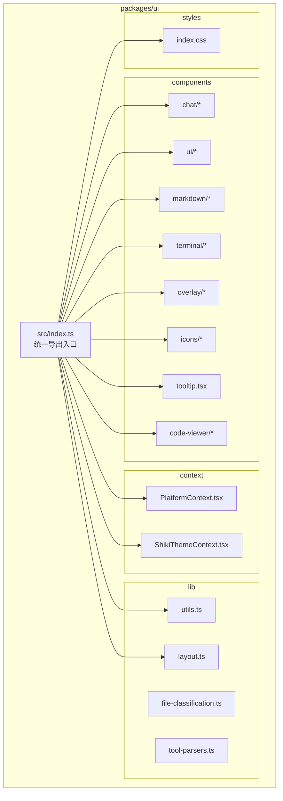
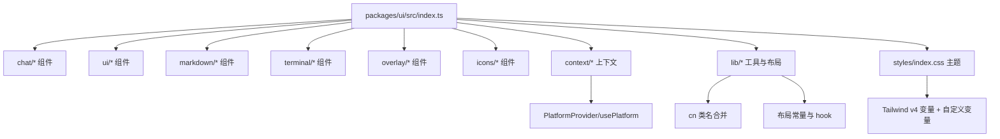
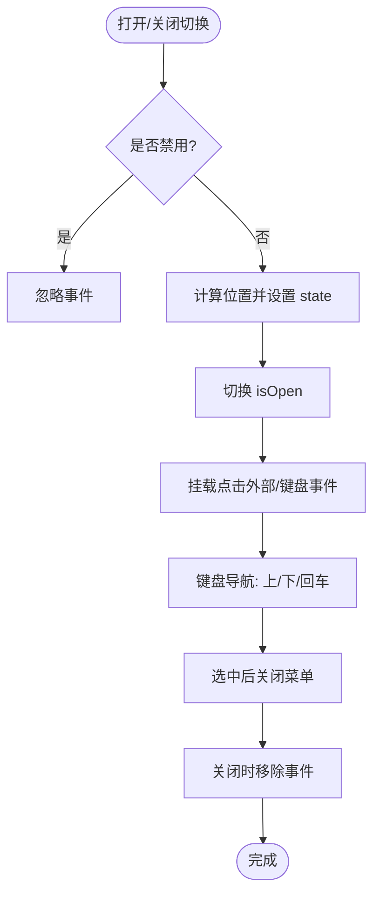
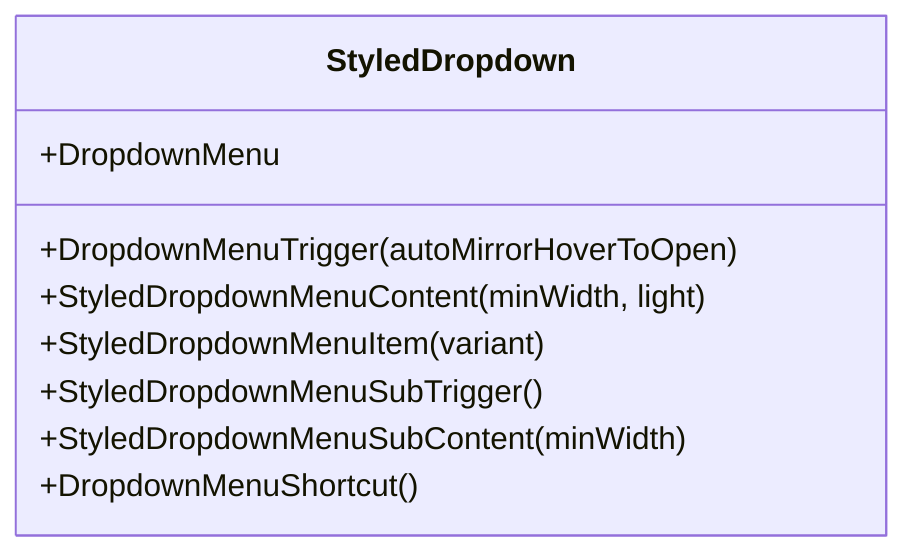
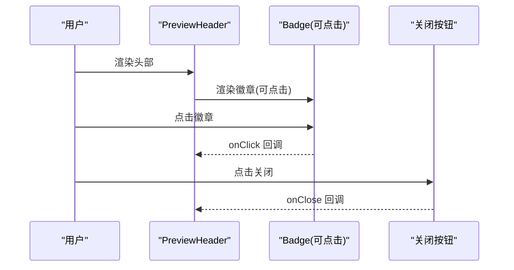
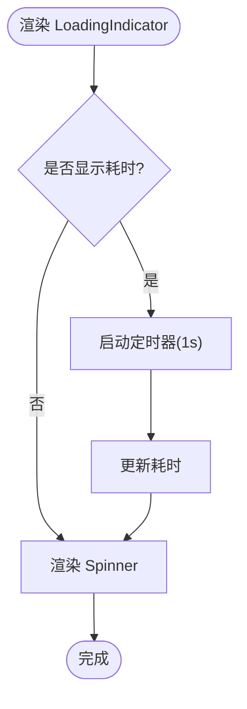
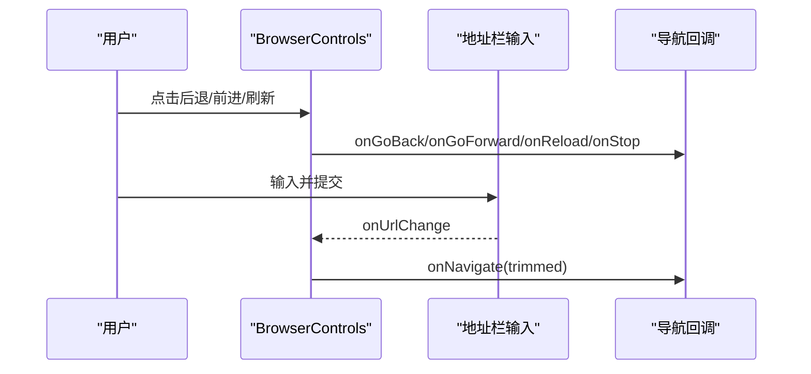
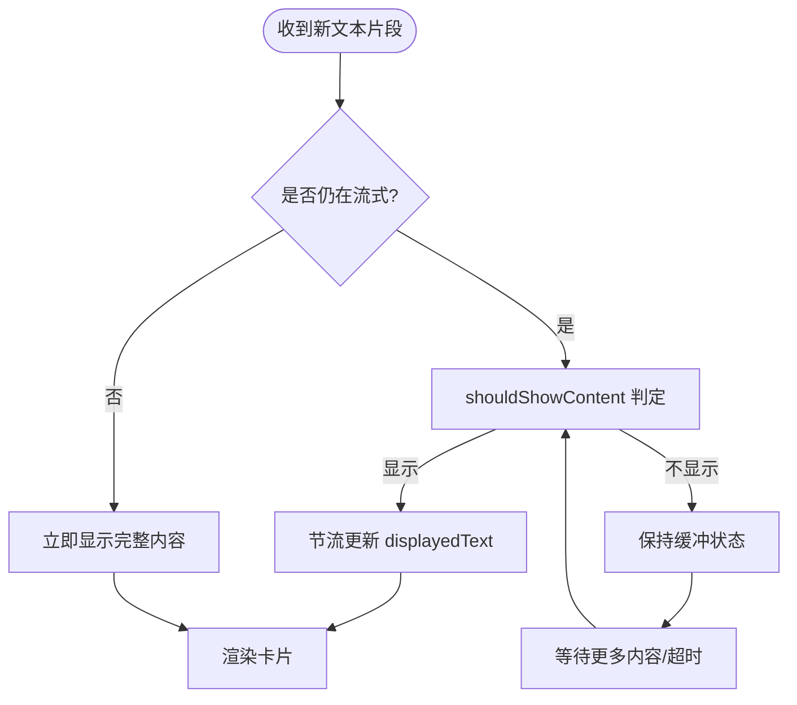
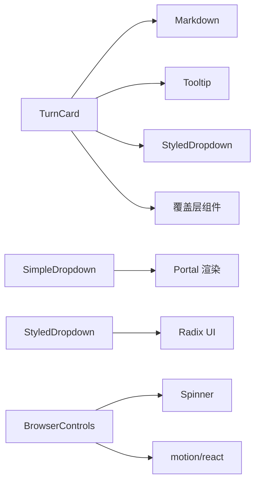

# UI 组件库

<cite>
**本文档引用的文件**
- [packages/ui/src/index.ts](file://packages/ui/src/index.ts)
- [packages/ui/src/components/ui/SimpleDropdown.tsx](file://packages/ui/src/components/ui/SimpleDropdown.tsx)
- [packages/ui/src/components/ui/StyledDropdown.tsx](file://packages/ui/src/components/ui/StyledDropdown.tsx)
- [packages/ui/src/components/ui/PreviewHeader.tsx](file://packages/ui/src/components/ui/PreviewHeader.tsx)
- [packages/ui/src/components/ui/LoadingIndicator.tsx](file://packages/ui/src/components/ui/LoadingIndicator.tsx)
- [packages/ui/src/components/ui/BrowserControls.tsx](file://packages/ui/src/components/ui/BrowserControls.tsx)
- [packages/ui/src/styles/index.css](file://packages/ui/src/styles/index.css)
- [packages/ui/src/context/PlatformContext.tsx](file://packages/ui/src/context/PlatformContext.tsx)
- [packages/ui/src/context/index.ts](file://packages/ui/src/context/index.ts)
- [packages/ui/src/components/chat/TurnCard.tsx](file://packages/ui/src/components/chat/TurnCard.tsx)
- [packages/ui/src/lib/utils.ts](file://packages/ui/src/lib/utils.ts)
- [packages/ui/src/lib/layout.ts](file://packages/ui/src/lib/layout.ts)
</cite>

## 目录

1. [简介](#简介)
2. [项目结构](#项目结构)
3. [核心组件](#核心组件)
4. [架构总览](#架构总览)
5. [组件详解](#组件详解)
6. [依赖关系分析](#依赖关系分析)
7. [性能与可访问性](#性能与可访问性)
8. [故障排查指南](#故障排查指南)
9. [结论](#结论)
10. [附录：使用示例与最佳实践](#附录使用示例与最佳实践)

## 简介

Craft Agents 的 UI 组件库是一套在 Electron 桌面应用与 Web 会话查看器中均可使用的共享 React 组件集合。其目标是：

- 提供一致的视觉语言与交互体验（Light/Dark 主题、阴影与边框系统、动效与转场）
- 抽象平台差异（通过 PlatformProvider 注入平台能力），使同一套组件在桌面与网页环境工作
- 支持响应式布局与无障碍访问（ARIA、键盘导航、焦点管理）
- 提供可定制的主题系统与样式工具类（Tailwind CSS v4 + 自定义变量）

本库覆盖聊天卡片、下拉菜单、预览头部、加载指示器、浏览器工具栏、Markdown 渲染、终端输出、覆盖层等模块，并提供布局常量与工具函数以保证跨端一致性。

## 项目结构

UI 组件库位于 packages/ui，采用按功能域分层的组织方式：

- components：按领域拆分（chat、ui、markdown、terminal、overlay、icons 等）
- context：平台抽象与主题上下文
- lib：通用工具与布局常量
- styles：全局样式与主题变量
- index.ts：统一导出入口

图表来源

- [packages/ui/src/index.ts](file://packages/ui/src/index.ts#L1-L255)

章节来源

- [packages/ui/src/index.ts](file://packages/ui/src/index.ts#L1-L255)

## 核心组件

本节概述 UI 库的关键组件及其职责与对外接口（类型与属性）。

- 平台抽象
  - PlatformProvider/usePlatform：注入平台特定动作（打开文件/URL、复制剪贴板、读取文件等），在 Electron 与 Web 查看器中提供不同实现。
- 聊天与会话
  - TurnCard：展示一次对话回合的所有活动（工具调用、思考、中间文本、状态），支持展开/折叠、缓冲显示、背景任务、计划接受等。
  - ResponseCard：AI 回复或计划卡片，内置智能缓冲与节流渲染。
  - TurnCardActionsMenu：回合级操作菜单。
  - UserMessageBubble、SystemMessage：消息气泡与系统提示。
- 基础 UI
  - SimpleDropdown：轻量无依赖下拉菜单，支持点击外部关闭、键盘导航、定位翻转、Portal 渲染。
  - StyledDropdown：基于 Radix 的统一样式下拉封装，提供触发器镜像 hover/open 状态、内容/子菜单/分割线/快捷键等。
  - PreviewHeader：预览窗口/覆盖层的统一头部，支持徽章行与关闭按钮。
  - LoadingIndicator/Spinner：纯 CSS 动画加载指示器，支持标签与耗时显示。
  - BrowserControls：浏览器风格的地址栏与导航控件，支持主题色、进度条、紧凑布局。
- Markdown
  - Markdown/MemoizedMarkdown：可配置渲染器；MarkdownDatatableBlock、MarkdownSpreadsheetBlock、MarkdownImageBlock 等块级组件。
- 终端
  - TerminalOutput：ANSI 解析与高亮输出。
- 覆盖层
  - 多种覆盖层类型（代码、多文件 diff、终端、JSON、数据表、PDF、图片、Markdown 文档等），统一的全屏/模态切换逻辑。
- 工具与布局
  - cn：类名合并工具
  - CHAT_LAYOUT/CHAT_CLASSES/OVERLAY_LAYOUT/useOverlayMode：布局常量与响应式覆盖层模式判断

章节来源

- [packages/ui/src/index.ts](file://packages/ui/src/index.ts#L17-L255)
- [packages/ui/src/context/PlatformContext.tsx](file://packages/ui/src/context/PlatformContext.tsx#L1-L184)
- [packages/ui/src/components/chat/TurnCard.tsx](file://packages/ui/src/components/chat/TurnCard.tsx#L1-L2196)
- [packages/ui/src/components/ui/SimpleDropdown.tsx](file://packages/ui/src/components/ui/SimpleDropdown.tsx#L1-L335)
- [packages/ui/src/components/ui/StyledDropdown.tsx](file://packages/ui/src/components/ui/StyledDropdown.tsx#L1-L243)
- [packages/ui/src/components/ui/PreviewHeader.tsx](file://packages/ui/src/components/ui/PreviewHeader.tsx#L1-L168)
- [packages/ui/src/components/ui/LoadingIndicator.tsx](file://packages/ui/src/components/ui/LoadingIndicator.tsx#L1-L140)
- [packages/ui/src/components/ui/BrowserControls.tsx](file://packages/ui/src/components/ui/BrowserControls.tsx#L1-L353)
- [packages/ui/src/lib/utils.ts](file://packages/ui/src/lib/utils.ts#L1-L14)
- [packages/ui/src/lib/layout.ts](file://packages/ui/src/lib/layout.ts#L1-L98)

## 架构总览

UI 组件库通过以下方式实现跨端一致性与可扩展性：

- 统一导出入口：集中暴露所有组件、类型与工具，便于消费方按需引入
- 平台抽象：PlatformProvider 将平台差异隐藏在上下文中，组件仅通过 usePlatform 获取能力
- 主题系统：Tailwind CSS v4 变量 + 自定义 CSS 变量，支持 Light/Dark 模式与字体、半径、间距等
- 响应式策略：覆盖层根据视口宽度自动选择模态或全屏模式
- 动画与转场：基于 motion/react 的 AnimatePresence/motion，统一动效节奏

图表来源

- [packages/ui/src/index.ts](file://packages/ui/src/index.ts#L1-L255)
- [packages/ui/src/styles/index.css](file://packages/ui/src/styles/index.css#L1-L515)
- [packages/ui/src/lib/layout.ts](file://packages/ui/src/lib/layout.ts#L1-L98)

## 组件详解

### SimpleDropdown：轻量下拉菜单

- 视觉与行为
  - 点击外部关闭、键盘 Esc/上下方向键导航、Enter 选中
  - 位置感知：靠近边缘时自动翻转，Portal 渲染避免层级问题
  - 高亮态与滚动可见性保持
- 关键属性
  - trigger：触发元素
  - children：菜单项（SimpleDropdownItem）
  - align：对齐（start/end）
  - disabled：禁用
  - onOpenChange：开合状态回调
  - keyboardNavigation：是否启用键盘导航（默认开启）
- 插槽与事件
  - SimpleDropdownItem 支持 icon、variant（default/destructive）、onMouseEnter、buttonRef
- 无障碍与键盘
  - 使用 button 元素、aria-\* 属性、键盘事件监听
- 性能与复杂度
  - 通过 Map/数组维护可导航项顺序，O(n) 查询与更新
  - 仅在打开时计算位置，减少重排

图表来源

- [packages/ui/src/components/ui/SimpleDropdown.tsx](file://packages/ui/src/components/ui/SimpleDropdown.tsx#L116-L335)

章节来源

- [packages/ui/src/components/ui/SimpleDropdown.tsx](file://packages/ui/src/components/ui/SimpleDropdown.tsx#L1-L335)

### StyledDropdown：Radix 下拉封装

- 视觉与行为
  - 统一的 popover 样式、hover/open 状态镜像、图标尺寸标准化
  - 子菜单触发器带右箭头、内容支持最小宽度与滚动
- 关键属性
  - DropdownMenuTrigger：autoMirrorHoverToOpen（默认开启）
  - StyledDropdownMenuContent：minWidth、light（强制浅色）
  - StyledDropdownMenuItem：variant（default/destructive）
  - StyledDropdownMenuSubTrigger/SubContent：嵌套子菜单
  - DropdownMenuShortcut：右侧快捷键文本
- 无障碍与键盘
  - 基于 @radix-ui/react-dropdown-menu，遵循原生语义与键盘约定

图表来源

- [packages/ui/src/components/ui/StyledDropdown.tsx](file://packages/ui/src/components/ui/StyledDropdown.tsx#L1-L243)

章节来源

- [packages/ui/src/components/ui/StyledDropdown.tsx](file://packages/ui/src/components/ui/StyledDropdown.tsx#L1-L243)

### PreviewHeader：预览头部

- 视觉与行为
  - 两种上下文：Electron 窗口（左上角系统控制按钮）与查看器覆盖层（居中徽章）
  - 支持右侧关闭按钮与右侧动作区
- 关键属性
  - children：徽章行（PreviewHeaderBadge）
  - onClose：提供时显示关闭按钮
  - rightActions：关闭按钮前的动作区域
  - height：头部高度
- 徽章 PreviewHeaderBadge
  - 支持图标、标签、变体、点击回调、可收缩文本
  - 语义化颜色与悬停下划线

图表来源

- [packages/ui/src/components/ui/PreviewHeader.tsx](file://packages/ui/src/components/ui/PreviewHeader.tsx#L101-L168)

章节来源

- [packages/ui/src/components/ui/PreviewHeader.tsx](file://packages/ui/src/components/ui/PreviewHeader.tsx#L1-L168)

### LoadingIndicator/Spinner：加载指示器

- 视觉与行为
  - 纯 CSS 3×3 网格旋转动画，继承父级颜色与字号
  - 支持标签文本、静止态、耗时显示（秒/分:秒格式）
- 关键属性
  - Spinner：className
  - LoadingIndicator：label、animated、showElapsed、spinnerClassName、className
- 无障碍
  - role="status"、aria-label="Loading"

图表来源

- [packages/ui/src/components/ui/LoadingIndicator.tsx](file://packages/ui/src/components/ui/LoadingIndicator.tsx#L85-L140)

章节来源

- [packages/ui/src/components/ui/LoadingIndicator.tsx](file://packages/ui/src/components/ui/LoadingIndicator.tsx#L1-L140)

### BrowserControls：浏览器工具栏

- 视觉与行为
  - 后退/前进/刷新/停止、地址栏输入、可选进度条
  - 支持主题色（自动对比度调整）、紧凑布局、左侧留白模式
- 关键属性
  - url/loading/canGoBack/canGoForward/onNavigate/onGoBack/onGoForward/onReload/onStop/onUrlChange
  - compact/leftClearance/themeColor/urlBarClassName/className
- 安全与可用性
  - 主题色安全校验与亮度计算，确保文字与图标对比度
  - 输入聚焦/失焦处理、Esc 取消编辑、表单提交

图表来源

- [packages/ui/src/components/ui/BrowserControls.tsx](file://packages/ui/src/components/ui/BrowserControls.tsx#L146-L353)

章节来源

- [packages/ui/src/components/ui/BrowserControls.tsx](file://packages/ui/src/components/ui/BrowserControls.tsx#L1-L353)

### TurnCard：对话回合卡片

- 视觉与行为
  - 展开/折叠、活动树形展示、状态图标（运行中使用 Spinner）、错误徽章、背景任务信息
  - 智能缓冲：在流式渲染中等待合适时机再显示内容，避免“空洞”体验
  - 计划卡片：支持接受计划与紧凑执行
- 关键属性
  - sessionId/turnId/activities/response/intent/isStreaming/isComplete/defaultExpanded/isExpanded/onExpandedChange
  - expandedActivityGroups/onExpandedActivityGroupsChange/onOpenFile/onOpenUrl/onPopOut/onOpenDetails/onOpenActivityDetails/onOpenMultiFileDiff
  - hasEditOrWriteActivities/todos/renderActionsMenu/onAcceptPlan/onAcceptPlanWithCompact/isLastResponse/sessionFolderPath/displayMode/animateResponse/compactMode/onBranch
- 内部机制
  - 缓冲决策 shouldShowContent：基于字数阈值、结构特征（标题/列表/代码块）、超时等
  - 节流渲染：CONTENT_THROTTLE_MS 控制更新频率，提升性能
  - 工具输入摘要 formatToolInput：针对 Edit/Write 等工具提取关键路径与参数
  - 背景任务：Task Shell ID 与耗时显示

图表来源

- [packages/ui/src/components/chat/TurnCard.tsx](file://packages/ui/src/components/chat/TurnCard.tsx#L367-L424)
- [packages/ui/src/components/chat/TurnCard.tsx](file://packages/ui/src/components/chat/TurnCard.tsx#L1397-L1455)

章节来源

- [packages/ui/src/components/chat/TurnCard.tsx](file://packages/ui/src/components/chat/TurnCard.tsx#L1-L2196)

## 依赖关系分析

- 组件间耦合
  - TurnCard 依赖 Markdown、Tooltip、StyledDropdown、Overlay 等组件
  - SimpleDropdown 与 StyledDropdown 提供基础交互能力，被多个上层组件复用
  - PreviewHeader 与 BrowserControls 在 Electron 与 Web 查看器中承担不同职责
- 外部依赖
  - motion/react：用于动画与转场
  - @radix-ui/react-dropdown-menu：下拉菜单原语
  - lucide-react：图标
  - tailwind-merge/clsx：类名合并与冲突解决
- 潜在循环依赖
  - 未发现直接循环导入；组件通过统一导出入口引用，避免相互引用

图表来源

- [packages/ui/src/components/chat/TurnCard.tsx](file://packages/ui/src/components/chat/TurnCard.tsx#L1-L2196)
- [packages/ui/src/components/ui/SimpleDropdown.tsx](file://packages/ui/src/components/ui/SimpleDropdown.tsx#L1-L335)
- [packages/ui/src/components/ui/StyledDropdown.tsx](file://packages/ui/src/components/ui/StyledDropdown.tsx#L1-L243)
- [packages/ui/src/components/ui/BrowserControls.tsx](file://packages/ui/src/components/ui/BrowserControls.tsx#L1-L353)

章节来源

- [packages/ui/src/components/chat/TurnCard.tsx](file://packages/ui/src/components/chat/TurnCard.tsx#L1-L2196)
- [packages/ui/src/components/ui/SimpleDropdown.tsx](file://packages/ui/src/components/ui/SimpleDropdown.tsx#L1-L335)
- [packages/ui/src/components/ui/StyledDropdown.tsx](file://packages/ui/src/components/ui/StyledDropdown.tsx#L1-L243)
- [packages/ui/src/components/ui/BrowserControls.tsx](file://packages/ui/src/components/ui/BrowserControls.tsx#L1-L353)

## 性能与可访问性

- 性能
  - 节流渲染：ResponseCard 对流式文本进行节流更新，降低重渲染成本
  - 缓冲显示：TurnCard 在流式阶段延迟显示，避免频繁闪烁
  - 动画：AnimatePresence/motion 控制入场/出场，避免不必要的 DOM 操作
  - 类名合并：cn 使用 tailwind-merge 减少冲突与冗余样式
- 可访问性
  - SimpleDropdown：按钮元素、键盘导航、焦点管理、Portal 中的可聚焦元素
  - BrowserControls：输入框可读写、Esc 取消、图标具备 aria-label 或 title
  - LoadingIndicator：role="status"、aria-label
  - PreviewHeader：关闭按钮具备 title 与可访问标签
- 响应式
  - useOverlayMode：根据视口宽度在模态与全屏之间切换
  - BrowserControls 支持 leftClearance 实现窗口居中布局

章节来源

- [packages/ui/src/components/chat/TurnCard.tsx](file://packages/ui/src/components/chat/TurnCard.tsx#L1397-L1455)
- [packages/ui/src/components/ui/LoadingIndicator.tsx](file://packages/ui/src/components/ui/LoadingIndicator.tsx#L42-L60)
- [packages/ui/src/components/ui/BrowserControls.tsx](file://packages/ui/src/components/ui/BrowserControls.tsx#L198-L217)
- [packages/ui/src/lib/layout.ts](file://packages/ui/src/lib/layout.ts#L80-L97)

## 故障排查指南

- 下拉菜单无法关闭或键盘无效
  - 检查 SimpleDropdown 是否处于 disabled 状态
  - 确认键盘导航开关 keyboardNavigation 是否开启
  - 确保未阻止事件冒泡（onClick 中 e.stopPropagation）
- 主题色导致对比度不足
  - 使用 safeCssColor 与 colorLuminance 校验与计算亮度
  - 在深色背景下自动调整文字/边框/焦点环颜色
- 加载指示器不显示耗时
  - 确认 showElapsed 传入 true 或起始时间戳
  - 检查定时器是否被清理
- 流式渲染闪烁或卡顿
  - 检查 CONTENT_THROTTLE_MS 设置是否合理
  - 确认 displayedText 与 text 的同步策略
- 覆盖层显示异常
  - 检查 useOverlayMode 返回的模式与视口宽度
  - 确认 OVERLAY_LAYOUT 配置是否符合预期

章节来源

- [packages/ui/src/components/ui/SimpleDropdown.tsx](file://packages/ui/src/components/ui/SimpleDropdown.tsx#L242-L296)
- [packages/ui/src/components/ui/BrowserControls.tsx](file://packages/ui/src/components/ui/BrowserControls.tsx#L93-L141)
- [packages/ui/src/components/ui/LoadingIndicator.tsx](file://packages/ui/src/components/ui/LoadingIndicator.tsx#L96-L113)
- [packages/ui/src/components/chat/TurnCard.tsx](file://packages/ui/src/components/chat/TurnCard.tsx#L1433-L1455)
- [packages/ui/src/lib/layout.ts](file://packages/ui/src/lib/layout.ts#L80-L97)

## 结论

Craft Agents UI 组件库通过清晰的领域划分、统一的导出入口与平台抽象，实现了在 Electron 与 Web 查看器中的跨端一致性。其主题系统、动效与响应式策略为复杂场景提供了稳定的基础。建议在实际项目中：

- 优先使用 StyledDropdown 与 PreviewHeader 等统一样式组件
- 在流式渲染场景中结合缓冲与节流策略
- 通过 PlatformProvider 注入平台能力，避免条件分支分散
- 借助 cn 与 Tailwind v4 变量体系进行样式扩展与主题定制

## 附录：使用示例与最佳实践

- 引入与导出
  - 通过统一入口按需引入组件与类型，避免直接引用内部路径
- 主题与样式
  - 在应用主 CSS 中引入 @craft-agent/ui/styles，使用 Tailwind v4 变量与自定义 CSS 变量
  - 使用 cn 合并类名，避免重复与冲突
- 响应式覆盖层
  - 使用 useOverlayMode 判断当前模式，动态渲染模态或全屏覆盖层
- 平台抽象
  - 在 Electron 中提供完整的 PlatformActions，在 Web 查看器中提供必要能力或降级方案
- 组合模式
  - 将 SimpleDropdown/StyledDropdown 作为菜单基元，配合 PreviewHeader/BrowserControls 构建复杂界面
- 无障碍与键盘
  - 为可交互元素提供 title/aria-label，确保键盘可达与焦点可见

章节来源

- [packages/ui/src/index.ts](file://packages/ui/src/index.ts#L1-L255)
- [packages/ui/src/styles/index.css](file://packages/ui/src/styles/index.css#L1-L515)
- [packages/ui/src/lib/utils.ts](file://packages/ui/src/lib/utils.ts#L1-L14)
- [packages/ui/src/lib/layout.ts](file://packages/ui/src/lib/layout.ts#L1-L98)
- [packages/ui/src/context/PlatformContext.tsx](file://packages/ui/src/context/PlatformContext.tsx#L1-L184)
