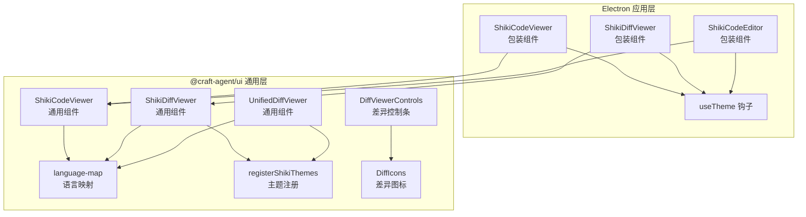
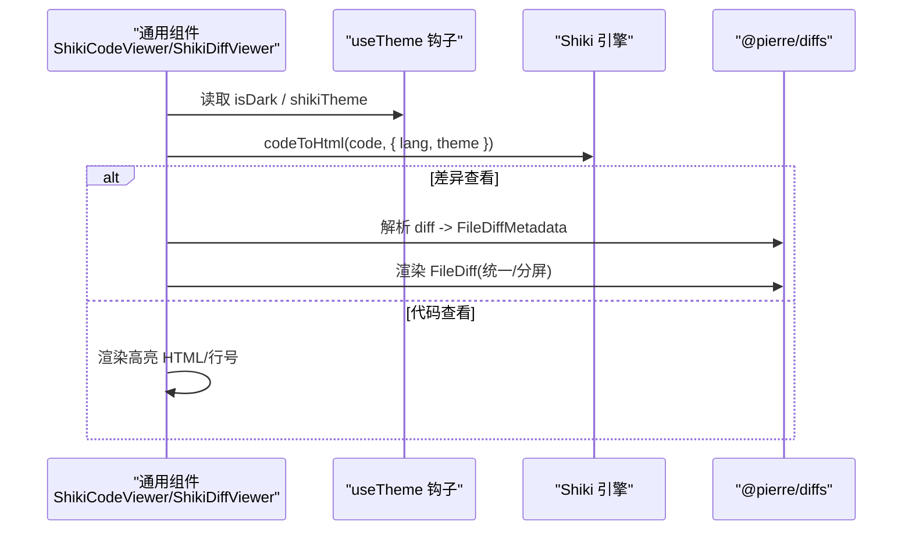
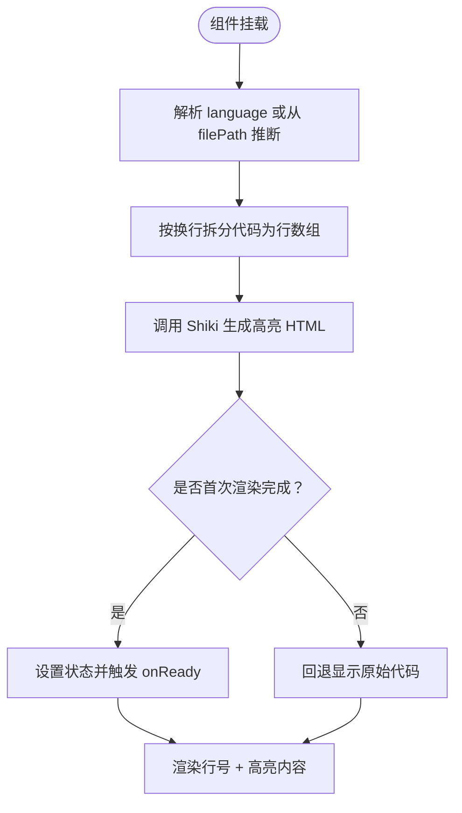
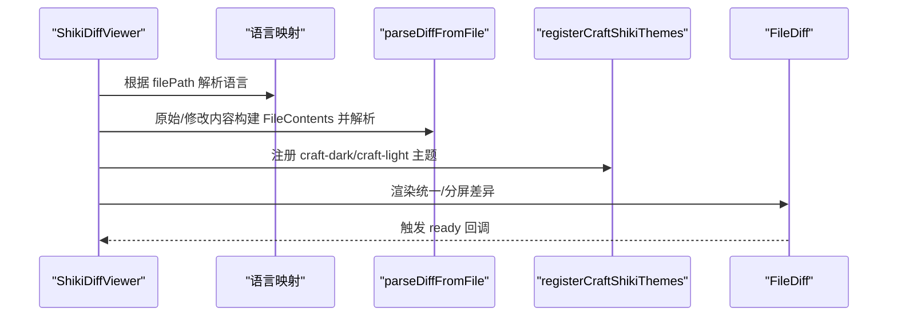
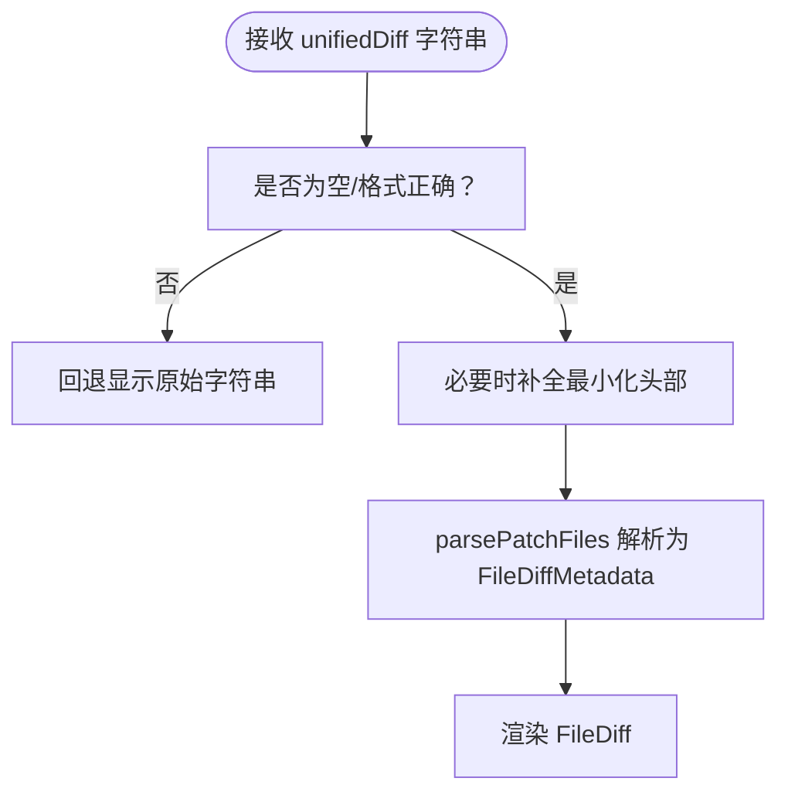
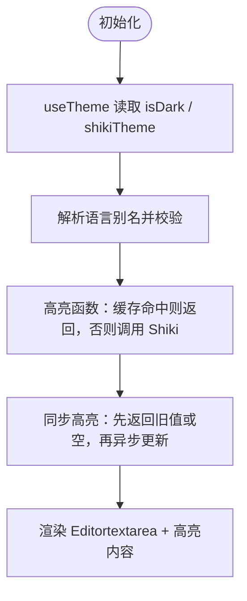
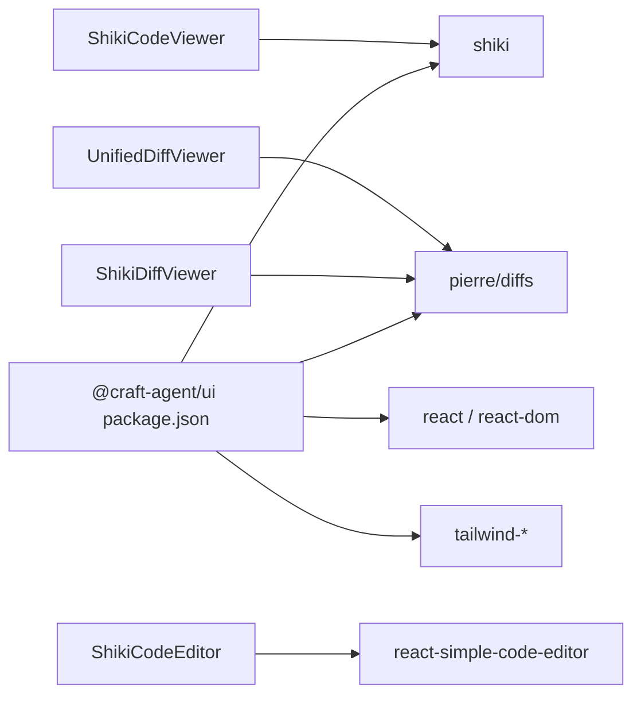

# 代码查看器组件

<cite>
**本文引用的文件**
- [apps/electron/src/renderer/components/shiki/ShikiCodeViewer.tsx](file://apps/electron/src/renderer/components/shiki/ShikiCodeViewer.tsx)
- [apps/electron/src/renderer/components/shiki/ShikiDiffViewer.tsx](file://apps/electron/src/renderer/components/shiki/ShikiDiffViewer.tsx)
- [apps/electron/src/renderer/components/shiki/ShikiCodeEditor.tsx](file://apps/electron/src/renderer/components/shiki/ShikiCodeEditor.tsx)
- [packages/ui/src/components/code-viewer/ShikiCodeViewer.tsx](file://packages/ui/src/components/code-viewer/ShikiCodeViewer.tsx)
- [packages/ui/src/components/code-viewer/ShikiDiffViewer.tsx](file://packages/ui/src/components/code-viewer/ShikiDiffViewer.tsx)
- [packages/ui/src/components/code-viewer/UnifiedDiffViewer.tsx](file://packages/ui/src/components/code-viewer/UnifiedDiffViewer.tsx)
- [packages/ui/src/components/code-viewer/language-map.ts](file://packages/ui/src/components/code-viewer/language-map.ts)
- [packages/ui/src/components/code-viewer/registerShikiThemes.ts](file://packages/ui/src/components/code-viewer/registerShikiThemes.ts)
- [packages/ui/src/components/code-viewer/DiffViewerControls.tsx](file://packages/ui/src/components/code-viewer/DiffViewerControls.tsx)
- [packages/ui/src/components/code-viewer/DiffIcons.tsx](file://packages/ui/src/components/code-viewer/DiffIcons.tsx)
- [apps/electron/src/renderer/hooks/useTheme.ts](file://apps/electron/src/renderer/hooks/useTheme.ts)
- [packages/ui/package.json](file://packages/ui/package.json)
</cite>

## 目录

1. [简介](#简介)
2. [项目结构](#项目结构)
3. [核心组件](#核心组件)
4. [架构总览](#架构总览)
5. [组件详解](#组件详解)
6. [依赖关系分析](#依赖关系分析)
7. [性能考量](#性能考量)
8. [故障排查指南](#故障排查指南)
9. [结论](#结论)
10. [附录](#附录)

## 简介

本文件面向 Craft Agents 的代码查看器组件，系统性梳理 Shiki 代码查看器、差异查看器（含统一式与分屏式）、以及轻量编辑器的实现细节、配置项、语言映射与主题注册机制，并给出性能优化与大文件处理建议、与其他组件的集成方式与最佳实践。

## 项目结构

代码查看器相关组件主要分布在两个层次：

- 平台适配层（Electron 包装）：在应用侧将通用组件与主题上下文对接，自动注入深浅主题与 Shiki 主题名。
- 通用 UI 层（@craft-agent/ui）：提供跨平台的代码高亮、差异渲染、语言映射与主题注册能力。

图表来源

- [apps/electron/src/renderer/components/shiki/ShikiCodeViewer.tsx](file://apps/electron/src/renderer/components/shiki/ShikiCodeViewer.tsx#L1-L23)
- [apps/electron/src/renderer/components/shiki/ShikiDiffViewer.tsx](file://apps/electron/src/renderer/components/shiki/ShikiDiffViewer.tsx#L1-L26)
- [apps/electron/src/renderer/components/shiki/ShikiCodeEditor.tsx](file://apps/electron/src/renderer/components/shiki/ShikiCodeEditor.tsx#L1-L203)
- [packages/ui/src/components/code-viewer/ShikiCodeViewer.tsx](file://packages/ui/src/components/code-viewer/ShikiCodeViewer.tsx#L1-L188)
- [packages/ui/src/components/code-viewer/ShikiDiffViewer.tsx](file://packages/ui/src/components/code-viewer/ShikiDiffViewer.tsx#L1-L222)
- [packages/ui/src/components/code-viewer/UnifiedDiffViewer.tsx](file://packages/ui/src/components/code-viewer/UnifiedDiffViewer.tsx#L1-L247)
- [packages/ui/src/components/code-viewer/language-map.ts](file://packages/ui/src/components/code-viewer/language-map.ts#L1-L120)
- [packages/ui/src/components/code-viewer/registerShikiThemes.ts](file://packages/ui/src/components/code-viewer/registerShikiThemes.ts#L1-L25)
- [packages/ui/src/components/code-viewer/DiffViewerControls.tsx](file://packages/ui/src/components/code-viewer/DiffViewerControls.tsx#L1-L56)
- [packages/ui/src/components/code-viewer/DiffIcons.tsx](file://packages/ui/src/components/code-viewer/DiffIcons.tsx#L1-L63)

章节来源

- [packages/ui/package.json](file://packages/ui/package.json#L1-L68)

## 核心组件

- ShikiCodeViewer：只读代码查看器，支持行号、语法高亮、深浅主题、可定制类名与就绪回调。
- ShikiDiffViewer：基于 @pierre/diffs 的差异查看器，支持统一式/分屏视图、语法高亮、点击文件头回调、背景高亮开关。
- UnifiedDiffViewer：接收预计算的统一式 diff 字符串，解析并渲染，适合 Codex 等场景。
- ShikiCodeEditor：轻量级编辑器，基于 react-simple-code-editor + Shiki，支持只读模式、占位符、主题同步。
- 工具与主题：language-map 提供扩展名到语言标识的映射；registerShikiThemes 注册透明背景的 craft-dark/craft-light 主题；DiffViewerControls/DiffIcons 提供差异视图控制与图标。

章节来源

- [packages/ui/src/components/code-viewer/ShikiCodeViewer.tsx](file://packages/ui/src/components/code-viewer/ShikiCodeViewer.tsx#L17-L34)
- [packages/ui/src/components/code-viewer/ShikiDiffViewer.tsx](file://packages/ui/src/components/code-viewer/ShikiDiffViewer.tsx#L35-L62)
- [packages/ui/src/components/code-viewer/UnifiedDiffViewer.tsx](file://packages/ui/src/components/code-viewer/UnifiedDiffViewer.tsx#L33-L56)
- [apps/electron/src/renderer/components/shiki/ShikiCodeEditor.tsx](file://apps/electron/src/renderer/components/shiki/ShikiCodeEditor.tsx#L21-L36)
- [packages/ui/src/components/code-viewer/language-map.ts](file://packages/ui/src/components/code-viewer/language-map.ts#L9-L52)
- [packages/ui/src/components/code-viewer/registerShikiThemes.ts](file://packages/ui/src/components/code-viewer/registerShikiThemes.ts#L9-L24)
- [packages/ui/src/components/code-viewer/DiffViewerControls.tsx](file://packages/ui/src/components/code-viewer/DiffViewerControls.tsx#L16-L34)
- [packages/ui/src/components/code-viewer/DiffIcons.tsx](file://packages/ui/src/components/code-viewer/DiffIcons.tsx#L17-L62)

## 架构总览

通用组件通过 Shiki 进行语法高亮，差异组件通过 @pierre/diffs 渲染差异。Electron 包装组件从 useTheme 获取当前主题状态与 Shiki 主题名，自动注入到通用组件中，确保 UI 与应用主题一致。

图表来源

- [apps/electron/src/renderer/hooks/useTheme.ts](file://apps/electron/src/renderer/hooks/useTheme.ts#L49-L76)
- [packages/ui/src/components/code-viewer/ShikiCodeViewer.tsx](file://packages/ui/src/components/code-viewer/ShikiCodeViewer.tsx#L93-L133)
- [packages/ui/src/components/code-viewer/ShikiDiffViewer.tsx](file://packages/ui/src/components/code-viewer/ShikiDiffViewer.tsx#L123-L145)
- [packages/ui/src/components/code-viewer/UnifiedDiffViewer.tsx](file://packages/ui/src/components/code-viewer/UnifiedDiffViewer.tsx#L111-L134)

## 组件详解

### ShikiCodeViewer（通用）

- 功能要点
  - 自动语言检测：优先使用显式 language，否则根据 filePath 扩展名映射。
  - 行号显示：基于代码行数生成连续行号列。
  - 语法高亮：调用 Shiki 将代码转为带样式的 HTML。
  - 主题适配：支持 light/dark 模式，或直接传入 shikiTheme 名称。
  - 回调与样式：支持 onReady 仅触发一次；支持 className 扩展样式。
- 关键流程

图表来源

- [packages/ui/src/components/code-viewer/ShikiCodeViewer.tsx](file://packages/ui/src/components/code-viewer/ShikiCodeViewer.tsx#L79-L133)

章节来源

- [packages/ui/src/components/code-viewer/ShikiCodeViewer.tsx](file://packages/ui/src/components/code-viewer/ShikiCodeViewer.tsx#L17-L34)
- [packages/ui/src/components/code-viewer/ShikiCodeViewer.tsx](file://packages/ui/src/components/code-viewer/ShikiCodeViewer.tsx#L65-L187)

### ShikiDiffViewer（通用）

- 功能要点
  - 支持统一式（堆叠）与分屏式（并排）两种视图。
  - 语法高亮：基于 Shiki 对比文件进行着色。
  - 文件头交互：可将文件名区域设为可点击，回调返回 filePath。
  - 背景高亮：可禁用变更行的背景高亮。
  - 主题：优先使用传入的 shikiTheme，否则使用 craft-dark/craft-light（透明背景）。
- 关键流程

图表来源

- [packages/ui/src/components/code-viewer/ShikiDiffViewer.tsx](file://packages/ui/src/components/code-viewer/ShikiDiffViewer.tsx#L78-L145)
- [packages/ui/src/components/code-viewer/registerShikiThemes.ts](file://packages/ui/src/components/code-viewer/registerShikiThemes.ts#L9-L24)

章节来源

- [packages/ui/src/components/code-viewer/ShikiDiffViewer.tsx](file://packages/ui/src/components/code-viewer/ShikiDiffViewer.tsx#L35-L62)
- [packages/ui/src/components/code-viewer/ShikiDiffViewer.tsx](file://packages/ui/src/components/code-viewer/ShikiDiffViewer.tsx#L87-L221)

### UnifiedDiffViewer（通用）

- 功能要点
  - 接收统一式 diff 字符串，内部解析为 FileDiffMetadata 后渲染。
  - 支持在缺少文件头时自动补全最小化头部，提升兼容性。
  - 与 ShikiDiffViewer 共享主题注册，保持视觉一致性。
- 关键流程

图表来源

- [packages/ui/src/components/code-viewer/UnifiedDiffViewer.tsx](file://packages/ui/src/components/code-viewer/UnifiedDiffViewer.tsx#L62-L90)
- [packages/ui/src/components/code-viewer/UnifiedDiffViewer.tsx](file://packages/ui/src/components/code-viewer/UnifiedDiffViewer.tsx#L95-L229)

章节来源

- [packages/ui/src/components/code-viewer/UnifiedDiffViewer.tsx](file://packages/ui/src/components/code-viewer/UnifiedDiffViewer.tsx#L33-L56)
- [packages/ui/src/components/code-viewer/UnifiedDiffViewer.tsx](file://packages/ui/src/components/code-viewer/UnifiedDiffViewer.tsx#L95-L229)

### ShikiCodeEditor（Electron 包装）

- 功能要点
  - 基于 react-simple-code-editor 的轻量编辑器，支持只读模式、占位符。
  - 使用 Shiki 实时高亮，内置简单缓存以优化性能。
  - 自动同步应用主题（深浅模式与 Shiki 主题名）。
- 关键流程

图表来源

- [apps/electron/src/renderer/components/shiki/ShikiCodeEditor.tsx](file://apps/electron/src/renderer/components/shiki/ShikiCodeEditor.tsx#L75-L162)

章节来源

- [apps/electron/src/renderer/components/shiki/ShikiCodeEditor.tsx](file://apps/electron/src/renderer/components/shiki/ShikiCodeEditor.tsx#L21-L36)
- [apps/electron/src/renderer/components/shiki/ShikiCodeEditor.tsx](file://apps/electron/src/renderer/components/shiki/ShikiCodeEditor.tsx#L66-L202)

### 语言映射与主题注册

- 语言映射（LANGUAGE_MAP）
  - 将常见扩展名映射到 Shiki 语言标识，如 ts/js/json/md/py 等。
  - 提供 getLanguageFromPath(filePath, explicit?) 便捷函数。
- 主题注册（registerCraftShikiThemes）
  - 注册 craft-dark/craft-light 两个透明背景主题，避免覆盖应用背景变量。
  - 通过全局标记防止重复注册，适配热重载与严格模式。

章节来源

- [packages/ui/src/components/code-viewer/language-map.ts](file://packages/ui/src/components/code-viewer/language-map.ts#L9-L52)
- [packages/ui/src/components/code-viewer/registerShikiThemes.ts](file://packages/ui/src/components/code-viewer/registerShikiThemes.ts#L9-L24)

### 与 Electron 的集成

- ShikiCodeViewer/ShikiDiffViewer 包装组件
  - 直接复用 @craft-agent/ui 的通用组件，仅注入 theme 与 shikiTheme。
  - 通过 useTheme 钩子读取 isDark 与 shikiTheme，保证与应用主题一致。
- ShikiCodeEditor 包装组件
  - 同步主题状态，使用缓存与异步高亮策略，兼顾性能与体验。

章节来源

- [apps/electron/src/renderer/components/shiki/ShikiCodeViewer.tsx](file://apps/electron/src/renderer/components/shiki/ShikiCodeViewer.tsx#L12-L22)
- [apps/electron/src/renderer/components/shiki/ShikiDiffViewer.tsx](file://apps/electron/src/renderer/components/shiki/ShikiDiffViewer.tsx#L14-L25)
- [apps/electron/src/renderer/hooks/useTheme.ts](file://apps/electron/src/renderer/hooks/useTheme.ts#L49-L76)

## 依赖关系分析

- Shiki 引擎：用于将代码转换为带样式的 HTML。
- @pierre/diffs：用于解析与渲染差异（统一/分屏），并与 Shiki 结合实现语法高亮。
- react-simple-code-editor：作为轻量编辑器的基础，配合 Shiki 实现高亮。
- Tailwind/样式工具：通过 CSS 变量与类名控制外观，保证与应用主题一致。

图表来源

- [packages/ui/package.json](file://packages/ui/package.json#L19-L51)
- [packages/ui/src/components/code-viewer/ShikiCodeViewer.tsx](file://packages/ui/src/components/code-viewer/ShikiCodeViewer.tsx#L13)
- [packages/ui/src/components/code-viewer/ShikiDiffViewer.tsx](file://packages/ui/src/components/code-viewer/ShikiDiffViewer.tsx#L13-L14)
- [packages/ui/src/components/code-viewer/UnifiedDiffViewer.tsx](file://packages/ui/src/components/code-viewer/UnifiedDiffViewer.tsx#L13-L14)
- [apps/electron/src/renderer/components/shiki/ShikiCodeEditor.tsx](file://apps/electron/src/renderer/components/shiki/ShikiCodeEditor.tsx#L16)

章节来源

- [packages/ui/package.json](file://packages/ui/package.json#L19-L51)

## 性能考量

- 编辑器缓存
  - ShikiCodeEditor 内置 Map 缓存，超过阈值时淘汰最旧条目，避免内存膨胀。
  - 大文本采用哈希键，降低缓存键长度与比较成本。
- 高亮异步化
  - ShikiCodeViewer 与 ShikiCodeEditor 在首次渲染后通过 requestAnimationFrame 触发 onReady，避免阻塞首屏。
- 渲染优化
  - 仅在高亮完成后替换内容，期间回退显示原始代码，减少闪烁。
  - 差异组件在首次渲染后延时触发 ready，给 Shiki 着色留出时间。
- 大文件处理建议
  - 限制单次高亮的代码大小，必要时分块加载或懒渲染。
  - 对超长文件优先使用行号列表而非一次性渲染所有行。
  - 编辑器侧对大文本使用哈希键缓存，避免重复高亮。

章节来源

- [apps/electron/src/renderer/components/shiki/ShikiCodeEditor.tsx](file://apps/electron/src/renderer/components/shiki/ShikiCodeEditor.tsx#L50-L61)
- [apps/electron/src/renderer/components/shiki/ShikiCodeEditor.tsx](file://apps/electron/src/renderer/components/shiki/ShikiCodeEditor.tsx#L84-L113)
- [packages/ui/src/components/code-viewer/ShikiCodeViewer.tsx](file://packages/ui/src/components/code-viewer/ShikiCodeViewer.tsx#L90-L133)
- [packages/ui/src/components/code-viewer/ShikiDiffViewer.tsx](file://packages/ui/src/components/code-viewer/ShikiDiffViewer.tsx#L148-L161)
- [packages/ui/src/components/code-viewer/UnifiedDiffViewer.tsx](file://packages/ui/src/components/code-viewer/UnifiedDiffViewer.tsx#L137-L150)

## 故障排查指南

- 语法高亮失败
  - 现象：控制台警告“Shiki highlighting failed”，或未显示高亮。
  - 排查：确认 language 是否为受支持的语言；检查 shikiTheme 是否存在；尝试回退到默认主题。
- 语言识别异常
  - 现象：未按预期高亮。
  - 排查：确认 filePath 扩展名；若使用显式 language，请确保其为 Shiki 内置语言。
- 差异渲染空白
  - 现象：显示原始 diff 字符串而非可视化差异。
  - 排查：确认 unifiedDiff 是否为空或格式不正确；必要时补全最小化头部。
- 文件头不可点击
  - 现象：提供 onFileHeaderClick 但无点击效果。
  - 排查：确认未启用 disableFileHeader；等待片刻让 Shadow DOM 渲染完成。
- 主题不匹配
  - 现象：编辑器背景与应用主题不一致。
  - 排查：确认 useTheme 返回的 shikiTheme 与应用主题一致；检查 registerCraftShikiThemes 是否已执行。

章节来源

- [packages/ui/src/components/code-viewer/ShikiCodeViewer.tsx](file://packages/ui/src/components/code-viewer/ShikiCodeViewer.tsx#L114-L125)
- [packages/ui/src/components/code-viewer/ShikiDiffViewer.tsx](file://packages/ui/src/components/code-viewer/ShikiDiffViewer.tsx#L170-L195)
- [packages/ui/src/components/code-viewer/UnifiedDiffViewer.tsx](file://packages/ui/src/components/code-viewer/UnifiedDiffViewer.tsx#L157-L182)
- [packages/ui/src/components/code-viewer/registerShikiThemes.ts](file://packages/ui/src/components/code-viewer/registerShikiThemes.ts#L9-L24)

## 结论

代码查看器组件通过 Shiki 与 @pierre/diffs 实现了高质量的语法高亮与差异渲染，结合 Electron 包装组件与主题钩子，实现了与应用主题的一致性。通用 UI 层提供了完善的语言映射、主题注册与差异控制能力，便于在多场景下快速集成与扩展。

## 附录

### 配置选项速查

- ShikiCodeViewer
  - code: 要显示的代码
  - language?: 显式语言标识
  - filePath?: 用于推断语言
  - startLine?: 起始行号
  - theme?: 'light' | 'dark'
  - shikiTheme?: Shiki 主题名称
  - onReady?: 渲染完成回调
  - className?: 自定义类名
- ShikiDiffViewer / UnifiedDiffViewer
  - original / modified 或 unifiedDiff: 对比数据
  - filePath?: 文件路径（显示用）
  - language?: 显式语言
  - diffStyle?: 'unified' | 'split'
  - theme?: 'light' | 'dark'
  - shikiTheme?: Shiki 主题名称
  - disableBackground?: 是否禁用变更行背景高亮
  - disableFileHeader?: 是否隐藏文件头
  - onFileHeaderClick?: 文件头点击回调
  - onReady?: 渲染完成回调
  - className?: 自定义类名
- ShikiCodeEditor
  - value: 初始内容
  - language?: 默认 'markdown'
  - onChange?: 内容变化回调（只读模式无效）
  - readOnly?: 是否只读
  - onReady?: 就绪回调
  - className?: 自定义类名
  - placeholder?: 占位符

章节来源

- [packages/ui/src/components/code-viewer/ShikiCodeViewer.tsx](file://packages/ui/src/components/code-viewer/ShikiCodeViewer.tsx#L17-L34)
- [packages/ui/src/components/code-viewer/ShikiDiffViewer.tsx](file://packages/ui/src/components/code-viewer/ShikiDiffViewer.tsx#L35-L62)
- [packages/ui/src/components/code-viewer/UnifiedDiffViewer.tsx](file://packages/ui/src/components/code-viewer/UnifiedDiffViewer.tsx#L33-L56)
- [apps/electron/src/renderer/components/shiki/ShikiCodeEditor.tsx](file://apps/electron/src/renderer/components/shiki/ShikiCodeEditor.tsx#L21-L36)
