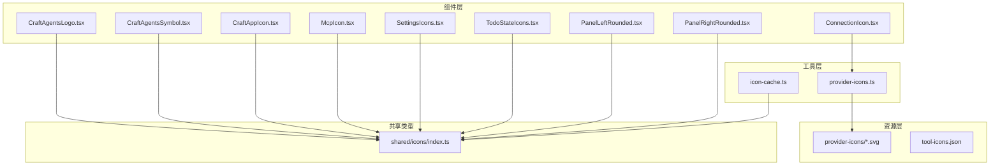
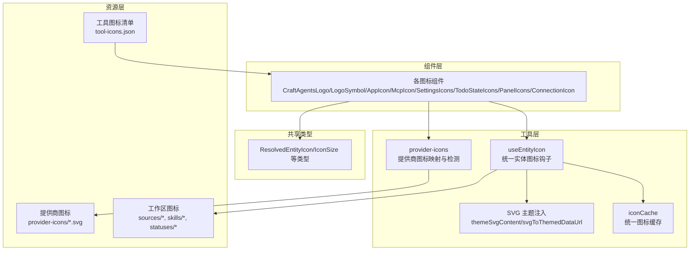
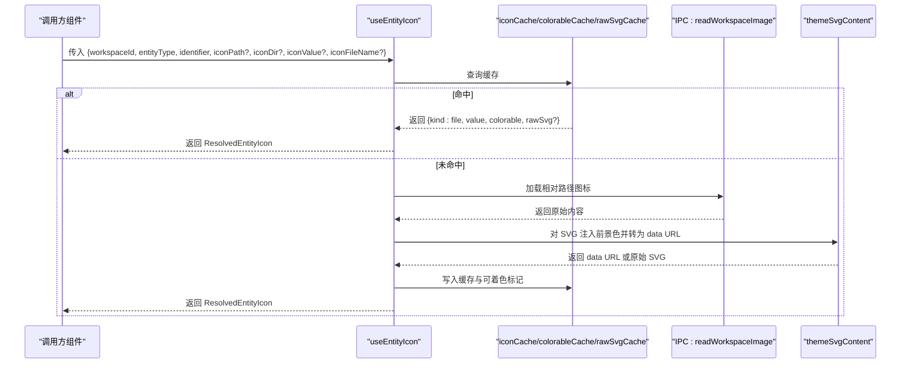
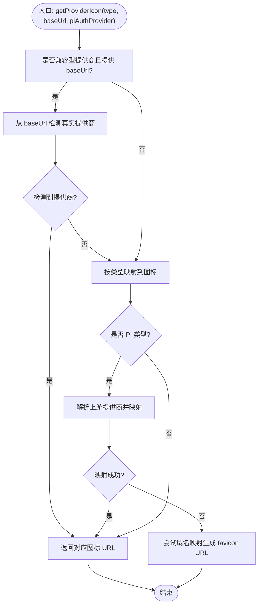
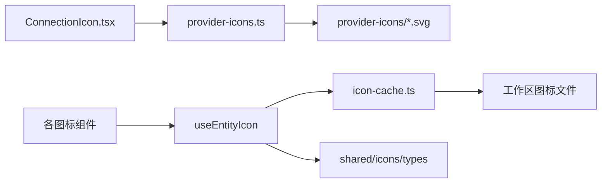

# 图标组件

<cite>
**本文档引用的文件**
- [apps/electron/src/renderer/components/icons/CraftAgentsLogo.tsx](file://apps/electron/src/renderer/components/icons/CraftAgentsLogo.tsx)
- [apps/electron/src/renderer/components/icons/CraftAgentsSymbol.tsx](file://apps/electron/src/renderer/components/icons/CraftAgentsSymbol.tsx)
- [apps/electron/src/renderer/components/icons/CraftAppIcon.tsx](file://apps/electron/src/renderer/components/icons/CraftAppIcon.tsx)
- [apps/electron/src/renderer/components/icons/McpIcon.tsx](file://apps/electron/src/renderer/components/icons/McpIcon.tsx)
- [apps/electron/src/renderer/components/icons/SettingsIcons.tsx](file://apps/electron/src/renderer/components/icons/SettingsIcons.tsx)
- [apps/electron/src/renderer/components/icons/TodoStateIcons.tsx](file://apps/electron/src/renderer/components/icons/TodoStateIcons.tsx)
- [apps/electron/src/renderer/components/icons/ConnectionIcon.tsx](file://apps/electron/src/renderer/components/icons/ConnectionIcon.tsx)
- [apps/electron/src/renderer/components/icons/PanelLeftRounded.tsx](file://apps/electron/src/renderer/components/icons/PanelLeftRounded.tsx)
- [apps/electron/src/renderer/components/icons/PanelRightRounded.tsx](file://apps/electron/src/renderer/components/icons/PanelRightRounded.tsx)
- [apps/electron/src/renderer/lib/icon-cache.ts](file://apps/electron/src/renderer/lib/icon-cache.ts)
- [apps/electron/src/renderer/lib/provider-icons.ts](file://apps/electron/src/renderer/lib/provider-icons.ts)
- [apps/electron/resources/tool-icons/tool-icons.json](file://apps/electron/resources/tool-icons/tool-icons.json)
- [packages/shared/src/icons/index.ts](file://packages/shared/src/icons/index.ts)
</cite>

## 目录

1. [简介](#简介)
2. [项目结构](#项目结构)
3. [核心组件](#核心组件)
4. [架构总览](#架构总览)
5. [详细组件分析](#详细组件分析)
6. [依赖关系分析](#依赖关系分析)
7. [性能考虑](#性能考虑)
8. [故障排查指南](#故障排查指南)
9. [结论](#结论)
10. [附录](#附录)

## 简介

本文件系统性梳理 Craft Agents 渲染端的图标体系，覆盖以下方面：

- 各类图标组件的实现细节与使用方法
- 图标库的组织结构与导入方式
- 图标尺寸、颜色、样式的配置选项
- 自定义与扩展方法（新增图标、主题适配）
- 性能优化与懒加载策略
- 在不同主题下的表现与适配方法

## 项目结构

渲染端图标主要位于以下位置：

- 组件层：apps/electron/src/renderer/components/icons/\*.tsx
- 工具层：apps/electron/src/renderer/lib/icon-cache.ts、apps/electron/src/renderer/lib/provider-icons.ts
- 资源层：apps/electron/src/renderer/assets/provider-icons/_.svg、apps/electron/resources/tool-icons/_.json
- 共享类型：packages/shared/src/icons/index.ts

**图表来源**

- [apps/electron/src/renderer/components/icons/CraftAgentsLogo.tsx](file://apps/electron/src/renderer/components/icons/CraftAgentsLogo.tsx#L1-L25)
- [apps/electron/src/renderer/components/icons/CraftAgentsSymbol.tsx](file://apps/electron/src/renderer/components/icons/CraftAgentsSymbol.tsx#L1-L25)
- [apps/electron/src/renderer/components/icons/CraftAppIcon.tsx](file://apps/electron/src/renderer/components/icons/CraftAppIcon.tsx#L1-L22)
- [apps/electron/src/renderer/components/icons/McpIcon.tsx](file://apps/electron/src/renderer/components/icons/McpIcon.tsx#L1-L26)
- [apps/electron/src/renderer/components/icons/SettingsIcons.tsx](file://apps/electron/src/renderer/components/icons/SettingsIcons.tsx#L1-L176)
- [apps/electron/src/renderer/components/icons/TodoStateIcons.tsx](file://apps/electron/src/renderer/components/icons/TodoStateIcons.tsx#L1-L195)
- [apps/electron/src/renderer/components/icons/ConnectionIcon.tsx](file://apps/electron/src/renderer/components/icons/ConnectionIcon.tsx#L1-L75)
- [apps/electron/src/renderer/components/icons/PanelLeftRounded.tsx](file://apps/electron/src/renderer/components/icons/PanelLeftRounded.tsx#L1-L25)
- [apps/electron/src/renderer/components/icons/PanelRightRounded.tsx](file://apps/electron/src/renderer/components/icons/PanelRightRounded.tsx#L1-L24)
- [apps/electron/src/renderer/lib/icon-cache.ts](file://apps/electron/src/renderer/lib/icon-cache.ts#L1-L746)
- [apps/electron/src/renderer/lib/provider-icons.ts](file://apps/electron/src/renderer/lib/provider-icons.ts#L1-L190)
- [apps/electron/resources/tool-icons/tool-icons.json](file://apps/electron/resources/tool-icons/tool-icons.json#L1-L60)
- [packages/shared/src/icons/index.ts](file://packages/shared/src/icons/index.ts#L1-L13)

**章节来源**

- [apps/electron/src/renderer/components/icons](file://apps/electron/src/renderer/components/icons)
- [apps/electron/src/renderer/lib/icon-cache.ts](file://apps/electron/src/renderer/lib/icon-cache.ts#L1-L746)
- [apps/electron/src/renderer/lib/provider-icons.ts](file://apps/electron/src/renderer/lib/provider-icons.ts#L1-L190)
- [apps/electron/resources/tool-icons/tool-icons.json](file://apps/electron/resources/tool-icons/tool-icons.json#L1-L60)
- [packages/shared/src/icons/index.ts](file://packages/shared/src/icons/index.ts#L1-L13)

## 核心组件

- 品牌与应用图标
  - CraftAgentsLogo：像素风格品牌标识，使用主题色（currentColor）渲染。
  - CraftAgentsSymbol：小号像素“E”符号，用于徽标或标题栏。
  - CraftAppIcon：彩色“C”型应用图标，支持 size 参数控制尺寸。
- 协议与设置图标
  - McpIcon：MCP 协议官方标志。
  - SettingsIcons：设置页面专用图标集合（AI、应用、外观、输入、工作区、权限、标签、快捷键、偏好）。
  - PanelLeftRounded / PanelRightRounded：侧边栏面板开关的圆角图标。
- 状态与任务图标
  - TodoStateIcons：待办状态图标集合（未开始、计划/已排期、待审阅、进行中、已完成、已取消、全部过滤）。
- 连接与提供商图标
  - ConnectionIcon：根据连接类型与 URL 显示提供商图标，无图标时回退到 Brain 图标。
  - provider-icons：LLM 提供商图标映射与检测逻辑。

**章节来源**

- [apps/electron/src/renderer/components/icons/CraftAgentsLogo.tsx](file://apps/electron/src/renderer/components/icons/CraftAgentsLogo.tsx#L1-L25)
- [apps/electron/src/renderer/components/icons/CraftAgentsSymbol.tsx](file://apps/electron/src/renderer/components/icons/CraftAgentsSymbol.tsx#L1-L25)
- [apps/electron/src/renderer/components/icons/CraftAppIcon.tsx](file://apps/electron/src/renderer/components/icons/CraftAppIcon.tsx#L1-L22)
- [apps/electron/src/renderer/components/icons/McpIcon.tsx](file://apps/electron/src/renderer/components/icons/McpIcon.tsx#L1-L26)
- [apps/electron/src/renderer/components/icons/SettingsIcons.tsx](file://apps/electron/src/renderer/components/icons/SettingsIcons.tsx#L1-L176)
- [apps/electron/src/renderer/components/icons/PanelLeftRounded.tsx](file://apps/electron/src/renderer/components/icons/PanelLeftRounded.tsx#L1-L25)
- [apps/electron/src/renderer/components/icons/PanelRightRounded.tsx](file://apps/electron/src/renderer/components/icons/PanelRightRounded.tsx#L1-L24)
- [apps/electron/src/renderer/components/icons/TodoStateIcons.tsx](file://apps/electron/src/renderer/components/icons/TodoStateIcons.tsx#L1-L195)
- [apps/electron/src/renderer/components/icons/ConnectionIcon.tsx](file://apps/electron/src/renderer/components/icons/ConnectionIcon.tsx#L1-L75)
- [apps/electron/src/renderer/lib/provider-icons.ts](file://apps/electron/src/renderer/lib/provider-icons.ts#L1-L190)

## 架构总览

图标系统由“组件层 + 工具层 + 资源层 + 共享类型”构成，形成统一的图标加载、缓存与主题适配能力。

**图表来源**

- [apps/electron/src/renderer/lib/icon-cache.ts](file://apps/electron/src/renderer/lib/icon-cache.ts#L460-L645)
- [apps/electron/src/renderer/lib/icon-cache.ts](file://apps/electron/src/renderer/lib/icon-cache.ts#L368-L437)
- [apps/electron/src/renderer/lib/provider-icons.ts](file://apps/electron/src/renderer/lib/provider-icons.ts#L1-L190)
- [apps/electron/resources/tool-icons/tool-icons.json](file://apps/electron/resources/tool-icons/tool-icons.json#L1-L60)
- [packages/shared/src/icons/index.ts](file://packages/shared/src/icons/index.ts#L1-L13)

## 详细组件分析

### 统一图标加载与缓存（useEntityIcon）

- 功能概述
  - 支持 emoji、URL、本地文件（含自动发现）、回退图标四种来源。
  - 内置缓存（iconCache）、可着色标记（colorableCache）、原始 SVG 缓存（rawSvgCache）。
  - 对 SVG 自动主题化（注入当前前景色），并安全地内联渲染可着色 SVG。
- 关键流程
  - 同步检查：优先处理 emoji 与 URL。
  - 缓存命中：直接返回缓存数据与可着色信息。
  - 文件加载：通过 IPC 读取工作区图标，按需主题化与清洗。
  - 自动发现：并行探测多种扩展名，按优先级返回首个成功结果。
- 性能特性
  - 并行探测减少往返次数。
  - 数据 URL 缓存避免重复 IPC 与主题化开销。
  - 可着色 SVG 仅在需要时保存原始内容，兼顾性能与灵活性。

**图表来源**

- [apps/electron/src/renderer/lib/icon-cache.ts](file://apps/electron/src/renderer/lib/icon-cache.ts#L510-L645)
- [apps/electron/src/renderer/lib/icon-cache.ts](file://apps/electron/src/renderer/lib/icon-cache.ts#L650-L745)
- [apps/electron/src/renderer/lib/icon-cache.ts](file://apps/electron/src/renderer/lib/icon-cache.ts#L368-L437)

**章节来源**

- [apps/electron/src/renderer/lib/icon-cache.ts](file://apps/electron/src/renderer/lib/icon-cache.ts#L460-L645)
- [apps/electron/src/renderer/lib/icon-cache.ts](file://apps/electron/src/renderer/lib/icon-cache.ts#L650-L745)
- [apps/electron/src/renderer/lib/icon-cache.ts](file://apps/electron/src/renderer/lib/icon-cache.ts#L368-L437)

### 提供商图标映射与检测（getProviderIcon）

- 功能概述
  - 将提供商类型与可选的 base URL 映射到对应的 SVG 图标 URL。
  - 兼容“兼容型”提供商（如 openai_compat），优先从 URL 推断真实提供商。
  - 对 Pi SDK 认证提供商，解析上游真实提供商并返回对应图标；否则回退到 Google Favicon V2。
- 使用场景
  - AI 设置页、连接列表、会话展示等。

**图表来源**

- [apps/electron/src/renderer/lib/provider-icons.ts](file://apps/electron/src/renderer/lib/provider-icons.ts#L142-L190)

**章节来源**

- [apps/electron/src/renderer/lib/provider-icons.ts](file://apps/electron/src/renderer/lib/provider-icons.ts#L1-L190)

### 品牌与应用图标

- CraftAgentsLogo
  - 用途：品牌标识，使用主题色（currentColor）渲染。
  - 配置：通过 className 应用文本色（如 text-accent）以获取品牌色。
- CraftAgentsSymbol
  - 用途：小号像素“E”，适合徽标或标题栏。
- CraftAppIcon
  - 用途：彩色“C”图标。
  - 配置：支持 size 参数（默认 64），通过 className 控制样式。

**章节来源**

- [apps/electron/src/renderer/components/icons/CraftAgentsLogo.tsx](file://apps/electron/src/renderer/components/icons/CraftAgentsLogo.tsx#L1-L25)
- [apps/electron/src/renderer/components/icons/CraftAgentsSymbol.tsx](file://apps/electron/src/renderer/components/icons/CraftAgentsSymbol.tsx#L1-L25)
- [apps/electron/src/renderer/components/icons/CraftAppIcon.tsx](file://apps/electron/src/renderer/components/icons/CraftAppIcon.tsx#L1-L22)

### 设置与状态图标

- SettingsIcons
  - 用途：设置页面专用图标集合，导出 SETTINGS_ICONS 映射。
  - 配置：通过 className 应用主题色（currentColor）。
- TodoStateIcons
  - 用途：待办状态筛选图标，灵感来自 SF Symbols/Linear。
  - 配置：通过 props 透传 SVG 属性（strokeWidth、strokeLinecap 等）。

**章节来源**

- [apps/electron/src/renderer/components/icons/SettingsIcons.tsx](file://apps/electron/src/renderer/components/icons/SettingsIcons.tsx#L1-L176)
- [apps/electron/src/renderer/components/icons/TodoStateIcons.tsx](file://apps/electron/src/renderer/components/icons/TodoStateIcons.tsx#L1-L195)

### 协议与界面图标

- McpIcon
  - 用途：MCP 协议官方标志。
  - 配置：通过 props 透传 SVG 属性，使用 stroke="currentColor" 适配主题。
- PanelLeftRounded / PanelRightRounded
  - 用途：侧边栏面板开关图标，圆角设计。
  - 配置：通过 props 透传 SVG 属性，使用 stroke="currentColor" 适配主题。

**章节来源**

- [apps/electron/src/renderer/components/icons/McpIcon.tsx](file://apps/electron/src/renderer/components/icons/McpIcon.tsx#L1-L26)
- [apps/electron/src/renderer/components/icons/PanelLeftRounded.tsx](file://apps/electron/src/renderer/components/icons/PanelLeftRounded.tsx#L1-L25)
- [apps/electron/src/renderer/components/icons/PanelRightRounded.tsx](file://apps/electron/src/renderer/components/icons/PanelRightRounded.tsx#L1-L24)

### 连接图标（ConnectionIcon）

- 功能概述
  - 根据连接提供商类型与 base URL 获取图标；若无图标则回退到 Brain 图标。
  - 可选显示 Tooltip，展示连接名称与默认模型。
- 集成点
  - AI 设置页、自由输入框、会话列表、新建会话模型选择组。

**章节来源**

- [apps/electron/src/renderer/components/icons/ConnectionIcon.tsx](file://apps/electron/src/renderer/components/icons/ConnectionIcon.tsx#L1-L75)
- [apps/electron/src/renderer/lib/provider-icons.ts](file://apps/electron/src/renderer/lib/provider-icons.ts#L1-L190)

## 依赖关系分析

- 组件对工具层的依赖
  - ConnectionIcon 依赖 provider-icons 获取提供商图标。
  - 所有图标组件通过 useEntityIcon 与 icon-cache 实现统一加载与缓存。
- 资源依赖
  - 提供商图标通过静态导入（Vite 资源）加载。
  - 工作区图标通过 IPC 读取，支持 SVG 主题化与缓存。
- 共享类型
  - ResolvedEntityIcon、IconSize 等类型在共享包中定义，确保跨包一致性。

**图表来源**

- [apps/electron/src/renderer/components/icons/ConnectionIcon.tsx](file://apps/electron/src/renderer/components/icons/ConnectionIcon.tsx#L1-L75)
- [apps/electron/src/renderer/lib/provider-icons.ts](file://apps/electron/src/renderer/lib/provider-icons.ts#L1-L190)
- [apps/electron/src/renderer/lib/icon-cache.ts](file://apps/electron/src/renderer/lib/icon-cache.ts#L460-L645)
- [packages/shared/src/icons/index.ts](file://packages/shared/src/icons/index.ts#L1-L13)

**章节来源**

- [apps/electron/src/renderer/components/icons/ConnectionIcon.tsx](file://apps/electron/src/renderer/components/icons/ConnectionIcon.tsx#L1-L75)
- [apps/electron/src/renderer/lib/provider-icons.ts](file://apps/electron/src/renderer/lib/provider-icons.ts#L1-L190)
- [apps/electron/src/renderer/lib/icon-cache.ts](file://apps/electron/src/renderer/lib/icon-cache.ts#L460-L645)
- [packages/shared/src/icons/index.ts](file://packages/shared/src/icons/index.ts#L1-L13)

## 性能考虑

- 缓存策略
  - 统一缓存（iconCache）与可着色标记（colorableCache）减少重复 IPC 与主题化开销。
  - 清理接口（clearIconCaches、clearSourceIconCaches、clearSkillIconCaches）便于在工作区切换时回收内存。
- 加载优化
  - 自动发现阶段并行探测多种扩展名，降低 I/O 往返。
  - SVG 主题化后以 data URL 形式缓存，避免背景图继承问题。
- 渲染优化
  - 可着色 SVG 仅在需要时保留原始内容，避免不必要的内联渲染风险。
  - 图标尺寸通过 props 或 CSS 控制，避免强制缩放导致的模糊。

**章节来源**

- [apps/electron/src/renderer/lib/icon-cache.ts](file://apps/electron/src/renderer/lib/icon-cache.ts#L107-L148)
- [apps/electron/src/renderer/lib/icon-cache.ts](file://apps/electron/src/renderer/lib/icon-cache.ts#L719-L745)
- [apps/electron/src/renderer/lib/icon-cache.ts](file://apps/electron/src/renderer/lib/icon-cache.ts#L368-L437)

## 故障排查指南

- 图标不显示或显示为占位
  - 检查 useEntityIcon 的缓存键是否正确（entityType:workspaceId:identifier）。
  - 确认 iconValue 是否为 emoji 或 URL；若是，将直接走快速路径。
  - 若为本地文件，确认 iconPath 或 iconDir 正确，且文件存在。
- SVG 颜色异常
  - 确保父容器提供有效的前景色变量（--foreground），或通过 className 传递主题色。
  - 检查 SVG 是否使用 currentColor，否则会被主题化为固定颜色。
- 提供商图标未匹配
  - 检查 providerType 与 baseUrl 是否符合预期；兼容型提供商优先从 URL 推断。
  - 对于 Pi 类型，确认 piAuthProvider 是否正确映射到上游提供商。
- 性能问题
  - 大量图标同时渲染时，优先使用缓存；必要时调用清理接口释放缓存。
  - 避免频繁切换 workspaceId 导致缓存碎片化。

**章节来源**

- [apps/electron/src/renderer/lib/icon-cache.ts](file://apps/electron/src/renderer/lib/icon-cache.ts#L510-L645)
- [apps/electron/src/renderer/lib/icon-cache.ts](file://apps/electron/src/renderer/lib/icon-cache.ts#L368-L437)
- [apps/electron/src/renderer/lib/provider-icons.ts](file://apps/electron/src/renderer/lib/provider-icons.ts#L142-L190)

## 结论

Craft Agents 的图标体系通过“统一加载钩子 + 多级缓存 + 主题化处理 + 资源映射”的组合，实现了高性能、可扩展、主题友好的图标渲染方案。开发者可通过 useEntityIcon 快速接入任意实体图标，通过 provider-icons 完成提供商图标映射，并基于现有组件进行扩展与自定义。

## 附录

### 图标尺寸、颜色与样式配置

- 尺寸控制
  - 通用：通过 props 或 CSS 控制 width/height。
  - 特定组件：CraftAppIcon 支持 size 参数；ConnectionIcon 支持 size 参数。
- 颜色控制
  - 统一使用 currentColor，由父容器或 className 提供主题色。
  - SVG 主题化：自动注入前景色，保证背景图场景下颜色正确。
- 样式控制
  - 通过 className 传递样式类（如圆角、边距、对齐等）。
  - 可着色 SVG 支持内联渲染，CSS 变量可影响填充与描边。

**章节来源**

- [apps/electron/src/renderer/components/icons/CraftAppIcon.tsx](file://apps/electron/src/renderer/components/icons/CraftAppIcon.tsx#L1-L22)
- [apps/electron/src/renderer/components/icons/ConnectionIcon.tsx](file://apps/electron/src/renderer/components/icons/ConnectionIcon.tsx#L1-L75)
- [apps/electron/src/renderer/lib/icon-cache.ts](file://apps/electron/src/renderer/lib/icon-cache.ts#L368-L437)

### 图标库组织与导入方式

- 组件导入
  - 直接从 components/icons 下导入所需图标组件。
- 提供商图标
  - 通过 provider-icons.ts 的 getProviderIcon 获取图标 URL；也可直接导入静态 SVG。
- 工具函数
  - 使用 useEntityIcon 统一加载实体图标；使用 icon-cache.ts 的缓存与清理接口。
- 共享类型
  - 从 @craft-agent/shared/icons 导入 ResolvedEntityIcon、IconSize 等类型。

**章节来源**

- [apps/electron/src/renderer/lib/provider-icons.ts](file://apps/electron/src/renderer/lib/provider-icons.ts#L1-L190)
- [apps/electron/src/renderer/lib/icon-cache.ts](file://apps/electron/src/renderer/lib/icon-cache.ts#L460-L645)
- [packages/shared/src/icons/index.ts](file://packages/shared/src/icons/index.ts#L1-L13)

### 自定义与扩展方法

- 新增实体图标
  - 使用 useEntityIcon，传入正确的 entityType、workspaceId、identifier 与 iconPath 或 iconDir。
  - 如需自动发现，确保目录结构遵循 sources/_、skills/_、statuses/\* 的约定。
- 新增提供商图标
  - 在 provider-icons.ts 中添加映射，并在 assets/provider-icons 下放置 SVG。
  - 如需 URL 回退，可在映射中加入域名映射逻辑。
- 新增设置/状态图标
  - 在 SettingsIcons 或 TodoStateIcons 中新增组件，并更新映射表。
- 主题适配
  - 确保图标使用 currentColor，并在父容器提供一致的主题色变量。
  - 对于 SVG，建议保留 currentColor 以便主题化。

**章节来源**

- [apps/electron/src/renderer/lib/icon-cache.ts](file://apps/electron/src/renderer/lib/icon-cache.ts#L460-L645)
- [apps/electron/src/renderer/lib/provider-icons.ts](file://apps/electron/src/renderer/lib/provider-icons.ts#L1-L190)
- [apps/electron/src/renderer/components/icons/SettingsIcons.tsx](file://apps/electron/src/renderer/components/icons/SettingsIcons.tsx#L1-L176)
- [apps/electron/src/renderer/components/icons/TodoStateIcons.tsx](file://apps/electron/src/renderer/components/icons/TodoStateIcons.tsx#L1-L195)

### 工具图标清单

- tool-icons.json 描述了工具 ID、显示名称、图标文件与命令映射，可用于工具选择器或提示。
- 使用建议：在需要展示工具图标时，先查询该清单，再结合工作区图标或静态资源进行渲染。

**章节来源**

- [apps/electron/resources/tool-icons/tool-icons.json](file://apps/electron/resources/tool-icons/tool-icons.json#L1-L60)
