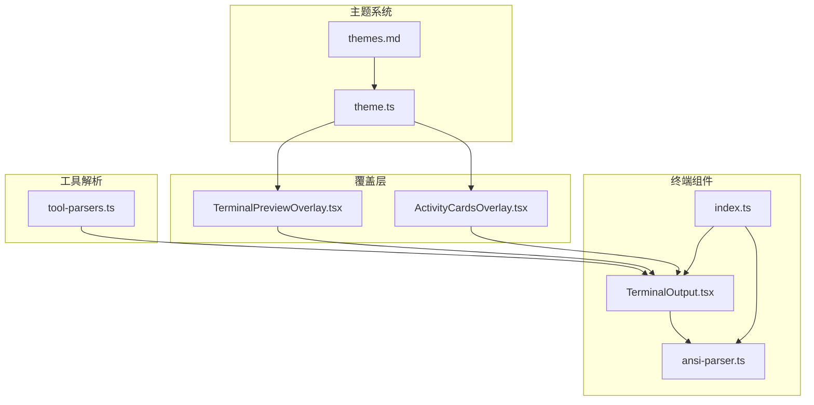
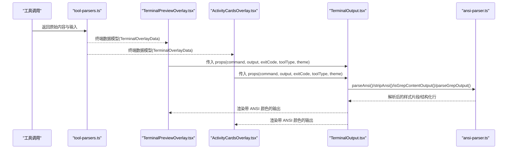
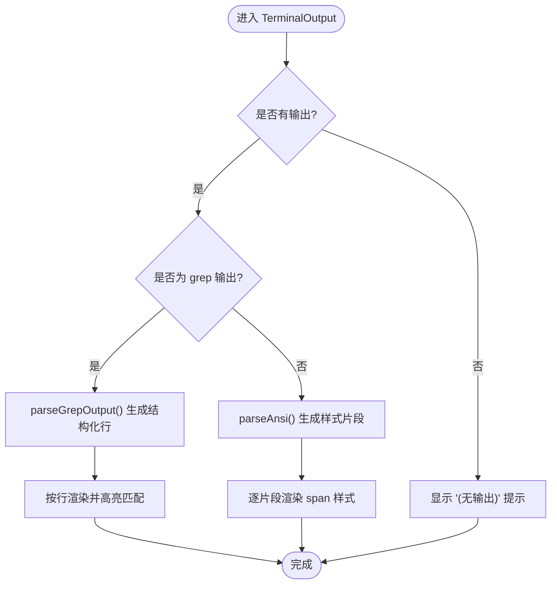
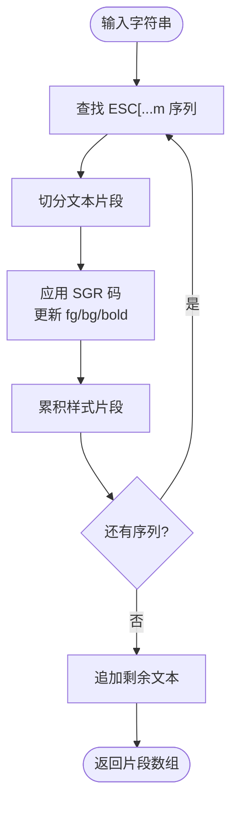
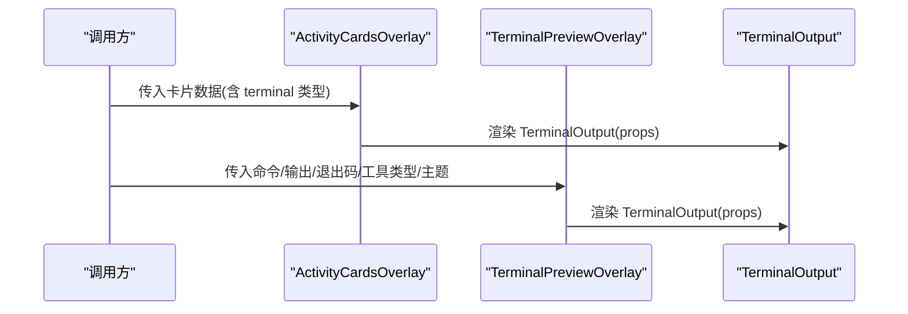
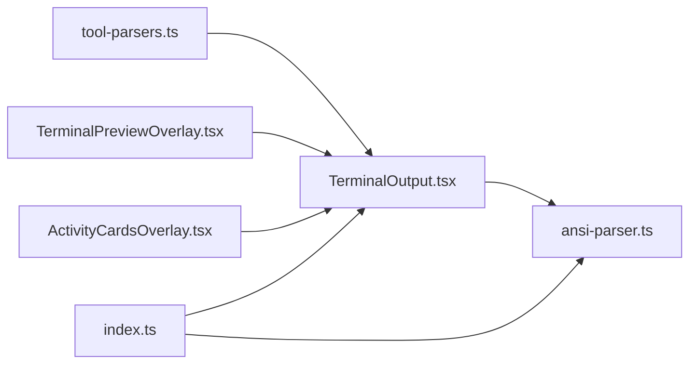

# 终端组件

<cite>
**本文引用的文件**
- [packages/ui/src/components/terminal/TerminalOutput.tsx](file://packages/ui/src/components/terminal/TerminalOutput.tsx)
- [packages/ui/src/components/terminal/ansi-parser.ts](file://packages/ui/src/components/terminal/ansi-parser.ts)
- [packages/ui/src/components/terminal/index.ts](file://packages/ui/src/components/terminal/index.ts)
- [packages/ui/src/components/overlay/ActivityCardsOverlay.tsx](file://packages/ui/src/components/overlay/ActivityCardsOverlay.tsx)
- [packages/ui/src/components/overlay/TerminalPreviewOverlay.tsx](file://packages/ui/src/components/overlay/TerminalPreviewOverlay.tsx)
- [packages/ui/src/lib/tool-parsers.ts](file://packages/ui/src/lib/tool-parsers.ts)
- [apps/electron/resources/docs/themes.md](file://apps/electron/resources/docs/themes.md)
- [packages/shared/src/config/theme.ts](file://packages/shared/src/config/theme.ts)
</cite>

## 目录

1. [简介](#简介)
2. [项目结构](#项目结构)
3. [核心组件](#核心组件)
4. [架构总览](#架构总览)
5. [详细组件分析](#详细组件分析)
6. [依赖关系分析](#依赖关系分析)
7. [性能考量](#性能考量)
8. [故障排查指南](#故障排查指南)
9. [结论](#结论)
10. [附录](#附录)

## 简介

本文件为 Craft Agents 的终端组件技术文档，聚焦于 TerminalOutput 组件的输出展示、ANSI 转义序列解析、样式与主题支持、与工具系统的集成方式以及性能优化策略。文档面向开发者与产品设计人员，既提供代码级细节，也给出可操作的最佳实践。

## 项目结构

终端相关能力主要位于 UI 包的 terminal 子模块，并通过覆盖层（Overlay）在应用中呈现。核心文件包括：

- TerminalOutput：终端输出展示组件
- ansi-parser：ANSI 解析与清理工具
- index：导出终端组件与工具函数
- TerminalPreviewOverlay/ActivityCardsOverlay：覆盖层容器，承载 TerminalOutput
- tool-parsers：将工具结果转换为终端数据模型
- 主题系统：主题配置与 CSS 变量注入

图表来源

- [packages/ui/src/components/terminal/TerminalOutput.tsx](file://packages/ui/src/components/terminal/TerminalOutput.tsx#L1-L221)
- [packages/ui/src/components/terminal/ansi-parser.ts](file://packages/ui/src/components/terminal/ansi-parser.ts#L1-L154)
- [packages/ui/src/components/terminal/index.ts](file://packages/ui/src/components/terminal/index.ts#L1-L15)
- [packages/ui/src/components/overlay/TerminalPreviewOverlay.tsx](file://packages/ui/src/components/overlay/TerminalPreviewOverlay.tsx#L1-L95)
- [packages/ui/src/components/overlay/ActivityCardsOverlay.tsx](file://packages/ui/src/components/overlay/ActivityCardsOverlay.tsx#L1-L200)
- [packages/ui/src/lib/tool-parsers.ts](file://packages/ui/src/lib/tool-parsers.ts#L1-L570)
- [apps/electron/resources/docs/themes.md](file://apps/electron/resources/docs/themes.md#L1-L275)
- [packages/shared/src/config/theme.ts](file://packages/shared/src/config/theme.ts#L1-L318)

章节来源

- [packages/ui/src/components/terminal/TerminalOutput.tsx](file://packages/ui/src/components/terminal/TerminalOutput.tsx#L1-L221)
- [packages/ui/src/components/terminal/ansi-parser.ts](file://packages/ui/src/components/terminal/ansi-parser.ts#L1-L154)
- [packages/ui/src/components/terminal/index.ts](file://packages/ui/src/components/terminal/index.ts#L1-L15)
- [packages/ui/src/components/overlay/TerminalPreviewOverlay.tsx](file://packages/ui/src/components/overlay/TerminalPreviewOverlay.tsx#L1-L95)
- [packages/ui/src/components/overlay/ActivityCardsOverlay.tsx](file://packages/ui/src/components/overlay/ActivityCardsOverlay.tsx#L1-L200)
- [packages/ui/src/lib/tool-parsers.ts](file://packages/ui/src/lib/tool-parsers.ts#L1-L570)
- [apps/electron/resources/docs/themes.md](file://apps/electron/resources/docs/themes.md#L1-L275)
- [packages/shared/src/config/theme.ts](file://packages/shared/src/config/theme.ts#L1-L318)

## 核心组件

- TerminalOutput：渲染命令与输出，支持 ANSI 颜色、复制、退出码状态、主题色、Grep 输出高亮。
- ansi-parser：ANSI 转义序列解析、颜色映射、文本清理、Grep 内容识别与结构化解析。
- TerminalPreviewOverlay/ActivityCardsOverlay：覆盖层容器，负责布局、类型徽标、错误提示与嵌入式展示。
- tool-parsers：将 Bash/Grep/Glob 等工具结果标准化为终端数据模型，供 TerminalOutput 渲染。

章节来源

- [packages/ui/src/components/terminal/TerminalOutput.tsx](file://packages/ui/src/components/terminal/TerminalOutput.tsx#L19-L34)
- [packages/ui/src/components/terminal/ansi-parser.ts](file://packages/ui/src/components/terminal/ansi-parser.ts#L48-L53)
- [packages/ui/src/components/overlay/TerminalPreviewOverlay.tsx](file://packages/ui/src/components/overlay/TerminalPreviewOverlay.tsx#L13-L34)
- [packages/ui/src/lib/tool-parsers.ts](file://packages/ui/src/lib/tool-parsers.ts#L189-L197)

## 架构总览

TerminalOutput 作为终端输出的核心展示组件，依赖 ansi-parser 进行 ANSI 解析与清理；通过覆盖层组件进行容器化展示；由工具解析器将不同工具的结果统一为终端数据模型。

图表来源

- [packages/ui/src/lib/tool-parsers.ts](file://packages/ui/src/lib/tool-parsers.ts#L298-L341)
- [packages/ui/src/components/overlay/TerminalPreviewOverlay.tsx](file://packages/ui/src/components/overlay/TerminalPreviewOverlay.tsx#L51-L94)
- [packages/ui/src/components/overlay/ActivityCardsOverlay.tsx](file://packages/ui/src/components/overlay/ActivityCardsOverlay.tsx#L148-L161)
- [packages/ui/src/components/terminal/TerminalOutput.tsx](file://packages/ui/src/components/terminal/TerminalOutput.tsx#L39-L221)
- [packages/ui/src/components/terminal/ansi-parser.ts](file://packages/ui/src/components/terminal/ansi-parser.ts#L58-L153)

## 详细组件分析

### TerminalOutput 组件

- 属性（TerminalOutputProps）
  - command：执行的命令
  - output：命令输出
  - exitCode：退出码（0 表示成功）
  - toolType：工具类型（bash/grep/glob），用于样式与徽标
  - description：命令描述
  - theme：主题模式（light/dark）
  - className：附加类名
- 事件与交互
  - 复制命令与输出：点击复制按钮，复制时会移除 ANSI 控制码
  - 退出码状态：在输出标签右侧显示彩色“exit X”徽章
  - 主题色：根据主题动态计算文本、背景与高亮色
- ANSI 解析与渲染
  - 使用 parseAnsi 将输出拆分为带样式的 span 片段
  - 支持前景/背景色、粗体、空白保留与换行
- Grep 输出高亮
  - 通过 isGrepContentOutput 判断是否为 grep 结果
  - parseGrepOutput 将行号与内容结构化，匹配行高亮显示

图表来源

- [packages/ui/src/components/terminal/TerminalOutput.tsx](file://packages/ui/src/components/terminal/TerminalOutput.tsx#L71-L87)
- [packages/ui/src/components/terminal/ansi-parser.ts](file://packages/ui/src/components/terminal/ansi-parser.ts#L142-L153)

章节来源

- [packages/ui/src/components/terminal/TerminalOutput.tsx](file://packages/ui/src/components/terminal/TerminalOutput.tsx#L19-L34)
- [packages/ui/src/components/terminal/TerminalOutput.tsx](file://packages/ui/src/components/terminal/TerminalOutput.tsx#L39-L221)

### ANSI 解析器（ansi-parser）

- ANSI_COLORS：标准与明亮色的前景/背景映射
- parseAnsi：解析 ESC[...m 序列，维护当前前景/背景与粗体状态，输出样式片段数组
- stripAnsi：移除 ANSI 控制码，用于复制纯文本
- isGrepContentOutput/parseGrepOutput：识别并结构化 grep 输出（含匹配与上下文行）

图表来源

- [packages/ui/src/components/terminal/ansi-parser.ts](file://packages/ui/src/components/terminal/ansi-parser.ts#L58-L115)

章节来源

- [packages/ui/src/components/terminal/ansi-parser.ts](file://packages/ui/src/components/terminal/ansi-parser.ts#L9-L46)
- [packages/ui/src/components/terminal/ansi-parser.ts](file://packages/ui/src/components/terminal/ansi-parser.ts#L58-L122)
- [packages/ui/src/components/terminal/ansi-parser.ts](file://packages/ui/src/components/terminal/ansi-parser.ts#L128-L153)

### 覆盖层与使用方式

- TerminalPreviewOverlay：通用终端预览覆盖层，支持工具类型徽标、错误提示与嵌入式展示
- ActivityCardsOverlay：活动卡片覆盖层，当数据类型为 terminal 时渲染 TerminalOutput

图表来源

- [packages/ui/src/components/overlay/ActivityCardsOverlay.tsx](file://packages/ui/src/components/overlay/ActivityCardsOverlay.tsx#L148-L161)
- [packages/ui/src/components/overlay/TerminalPreviewOverlay.tsx](file://packages/ui/src/components/overlay/TerminalPreviewOverlay.tsx#L82-L90)

章节来源

- [packages/ui/src/components/overlay/ActivityCardsOverlay.tsx](file://packages/ui/src/components/overlay/ActivityCardsOverlay.tsx#L148-L161)
- [packages/ui/src/components/overlay/TerminalPreviewOverlay.tsx](file://packages/ui/src/components/overlay/TerminalPreviewOverlay.tsx#L51-L94)

### 工具系统集成

- tool-parsers 将 Bash/Grep/Glob 等工具结果标准化为 TerminalOverlayData，包含：
  - type: 'terminal'
  - command：命令字符串
  - output：输出文本
  - exitCode：退出码（如适用）
  - toolType：bash/grep/glob
  - description：描述信息
  - error：错误信息（可选）

章节来源

- [packages/ui/src/lib/tool-parsers.ts](file://packages/ui/src/lib/tool-parsers.ts#L298-L341)
- [packages/ui/src/lib/tool-parsers.ts](file://packages/ui/src/lib/tool-parsers.ts#L189-L197)

### 主题与样式定制

- 终端组件主题色
  - 文本色、弱提示色、匹配高亮色、命令色、代码背景、输出背景均基于 theme 计算
  - 字体采用等宽字体，保证对齐与可读性
- 主题系统
  - 支持应用级默认主题、工作区覆盖、预设主题与局部覆盖
  - CSS 变量注入，支持浅色/深色模式切换
  - 支持场景模式（Scenic）与半透明表面色

章节来源

- [packages/ui/src/components/terminal/TerminalOutput.tsx](file://packages/ui/src/components/terminal/TerminalOutput.tsx#L50-L58)
- [apps/electron/resources/docs/themes.md](file://apps/electron/resources/docs/themes.md#L1-L275)
- [packages/shared/src/config/theme.ts](file://packages/shared/src/config/theme.ts#L178-L225)

## 依赖关系分析

- 组件内聚与耦合
  - TerminalOutput 与 ansi-parser 强耦合（解析与渲染），但通过接口清晰分离
  - 覆盖层仅负责布局与容器，不直接参与解析逻辑，内聚性良好
- 导出与复用
  - index 统一导出组件与工具函数，便于外部复用
- 外部依赖
  - 依赖工具解析器提供的标准化数据模型
  - 依赖主题系统提供的 CSS 变量

图表来源

- [packages/ui/src/lib/tool-parsers.ts](file://packages/ui/src/lib/tool-parsers.ts#L298-L341)
- [packages/ui/src/components/overlay/TerminalPreviewOverlay.tsx](file://packages/ui/src/components/overlay/TerminalPreviewOverlay.tsx#L82-L90)
- [packages/ui/src/components/overlay/ActivityCardsOverlay.tsx](file://packages/ui/src/components/overlay/ActivityCardsOverlay.tsx#L151-L158)
- [packages/ui/src/components/terminal/TerminalOutput.tsx](file://packages/ui/src/components/terminal/TerminalOutput.tsx#L15)
- [packages/ui/src/components/terminal/index.ts](file://packages/ui/src/components/terminal/index.ts#L5-L14)

章节来源

- [packages/ui/src/components/terminal/index.ts](file://packages/ui/src/components/terminal/index.ts#L1-L15)

## 性能考量

- 渲染优化
  - 使用 useMemo 缓存 ANSI 解析结果与 grep 结构化行，避免重复计算
  - 使用 useMemo 缓存 isGrepContentOutput 判定，减少正则匹配开销
- 复制性能
  - stripAnsi 在复制前移除 ANSI 控制码，确保剪贴板为纯文本，避免额外渲染成本
- 大输出处理
  - TerminalOutput 使用 pre 与等宽字体，配合滚动容器，适合长输出展示
  - 建议在上层组件对超长输出进行截断或分页，避免单次渲染压力过大
- 主题切换
  - 主题变量通过 CSS 注入，切换时无需重新挂载组件，响应迅速

章节来源

- [packages/ui/src/components/terminal/TerminalOutput.tsx](file://packages/ui/src/components/terminal/TerminalOutput.tsx#L71-L87)
- [packages/ui/src/components/terminal/ansi-parser.ts](file://packages/ui/src/components/terminal/ansi-parser.ts#L120-L122)

## 故障排查指南

- ANSI 颜色异常
  - 检查 ANSI_CODES 映射是否完整，确认输出中是否存在未覆盖的 SGR 码
  - 若出现颜色偏移，优先检查主题变量是否正确注入
- Grep 输出未高亮
  - 确认 isGrepContentOutput 能正确识别“行号:内容”或“行号-内容”格式
  - 检查 parseGrepOutput 是否正确提取行号与内容
- 复制粘贴含控制码
  - 确保使用 stripAnsi 进行复制前清理
- 覆盖层不显示
  - 检查覆盖层 props 是否正确传递至 TerminalOutput
  - 确认工具解析器已将数据归类为 terminal 类型

章节来源

- [packages/ui/src/components/terminal/ansi-parser.ts](file://packages/ui/src/components/terminal/ansi-parser.ts#L128-L153)
- [packages/ui/src/components/terminal/TerminalOutput.tsx](file://packages/ui/src/components/terminal/TerminalOutput.tsx#L61-L69)
- [packages/ui/src/lib/tool-parsers.ts](file://packages/ui/src/lib/tool-parsers.ts#L312-L326)

## 结论

TerminalOutput 组件通过清晰的职责划分与工具化的 ANSI 解析，实现了终端输出的高保真渲染与良好的可访问性。结合覆盖层与工具解析器，形成从数据到可视化的完整链路。主题系统与性能优化策略进一步提升了用户体验与扩展性。建议在实际使用中遵循本文最佳实践，确保大输出与多主题场景下的稳定表现。

## 附录

- 最佳实践
  - 使用 tool-parsers 规范化工具输出，避免自定义解析
  - 在覆盖层中统一传递 theme 与 toolType，保持视觉一致性
  - 对超长输出进行分页或截断，提升渲染性能
  - 使用 stripAnsi 进行复制，确保剪贴板纯净
- 扩展建议
  - 支持更多 SGR 码（下划线、闪烁等）
  - 增加滚动定位与行号跳转
  - 提供主题预设与自定义面板
