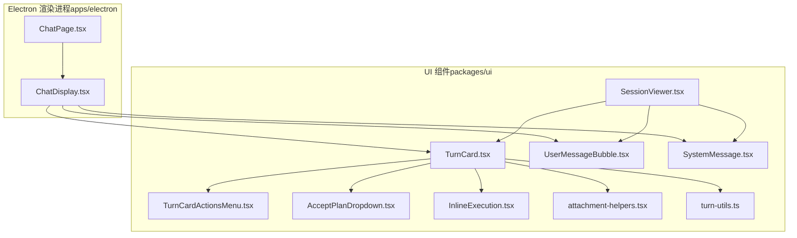
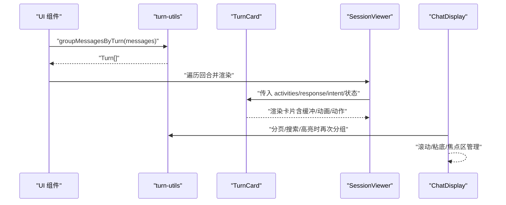
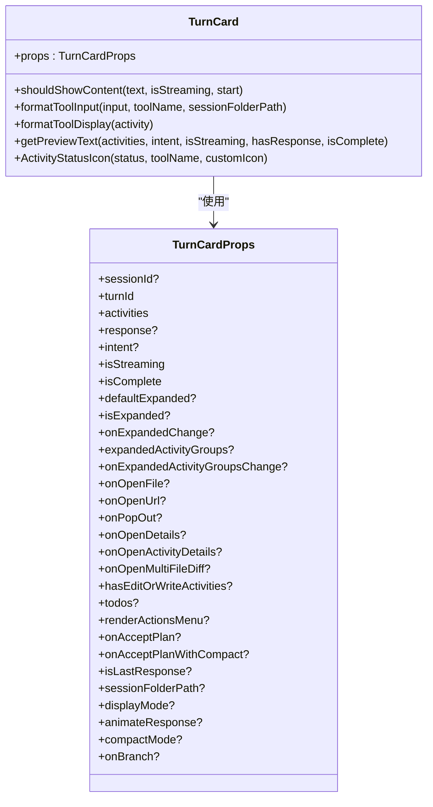
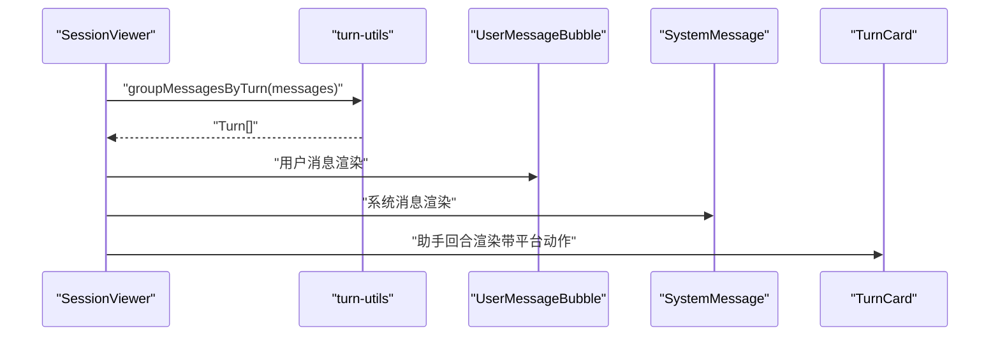
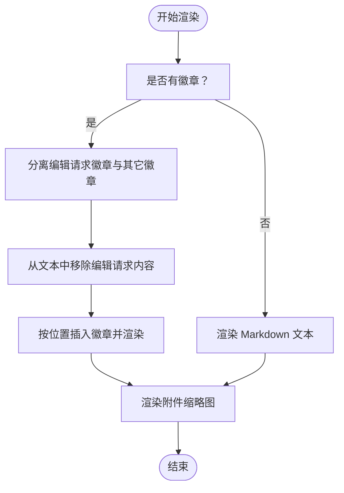
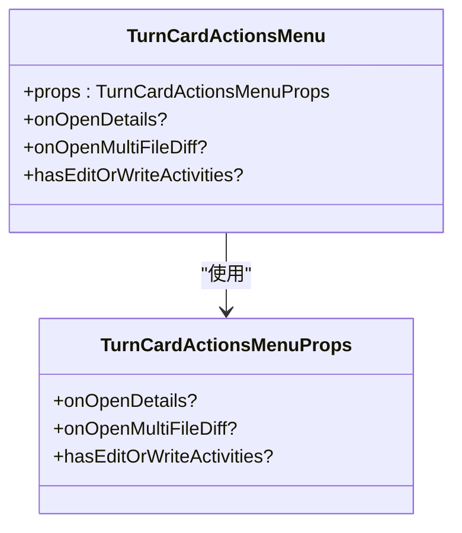
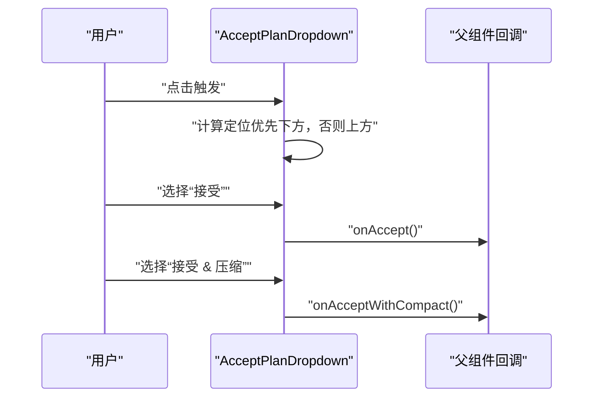
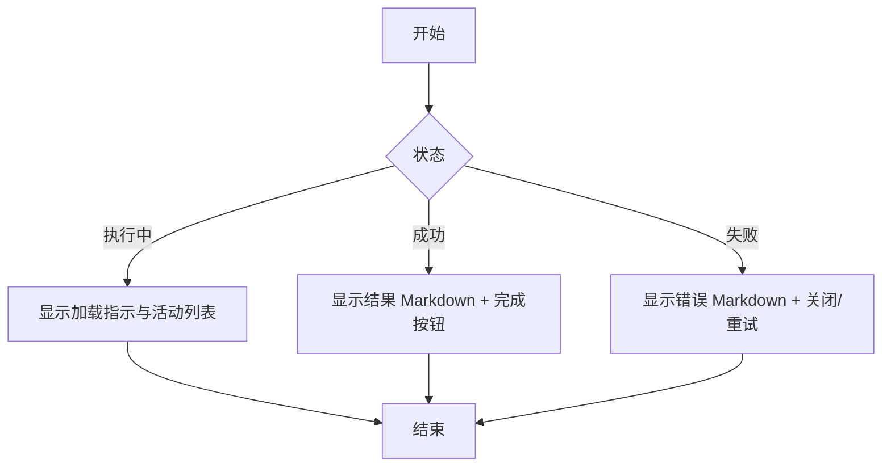
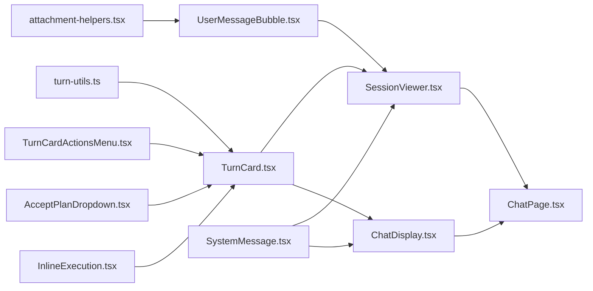

# 聊天界面组件

<cite>
**本文引用的文件**
- [TurnCard.tsx](file://packages/ui/src/components/chat/TurnCard.tsx)
- [SessionViewer.tsx](file://packages/ui/src/components/chat/SessionViewer.tsx)
- [UserMessageBubble.tsx](file://packages/ui/src/components/chat/UserMessageBubble.tsx)
- [turn-utils.ts](file://packages/ui/src/components/chat/turn-utils.ts)
- [TurnCardActionsMenu.tsx](file://packages/ui/src/components/chat/TurnCardActionsMenu.tsx)
- [AcceptPlanDropdown.tsx](file://packages/ui/src/components/chat/AcceptPlanDropdown.tsx)
- [InlineExecution.tsx](file://packages/ui/src/components/chat/InlineExecution.tsx)
- [attachment-helpers.tsx](file://packages/ui/src/components/chat/attachment-helpers.tsx)
- [ChatDisplay.tsx](file://apps/electron/src/renderer/components/app-shell/ChatDisplay.tsx)
- [ChatPage.tsx](file://apps/electron/src/renderer/pages/ChatPage.tsx)
- [SystemMessage.tsx](file://packages/ui/src/components/chat/SystemMessage.tsx)
</cite>

## 目录

1. [简介](#简介)
2. [项目结构](#项目结构)
3. [核心组件](#核心组件)
4. [架构总览](#架构总览)
5. [详细组件分析](#详细组件分析)
6. [依赖分析](#依赖分析)
7. [性能考虑](#性能考虑)
8. [故障排查指南](#故障排查指南)
9. [结论](#结论)

## 简介

本文件面向 Craft Agents 的聊天界面组件，系统性梳理并解释 TurnCard、SessionViewer、UserMessageBubble 等核心聊天组件的实现细节、调用关系、接口与使用模式，并结合实际代码库中的具体实现进行说明。文档既关注初学者可读性，也提供足够技术深度，帮助开发者快速理解并正确使用这些组件。

## 项目结构

聊天界面组件主要位于 packages/ui/src/components/chat 下，涵盖对话轮次卡片、用户消息气泡、系统消息、计划接受下拉菜单、内联执行视图以及工具函数等；在 Electron 渲染进程中，ChatDisplay 作为主聊天容器，负责消息分组、滚动、搜索高亮、权限/凭据请求处理等；ChatPage 则承载会话级上下文与输入交互。

图表来源

- [TurnCard.tsx](file://packages/ui/src/components/chat/TurnCard.tsx#L1-L2196)
- [SessionViewer.tsx](file://packages/ui/src/components/chat/SessionViewer.tsx#L1-L243)
- [UserMessageBubble.tsx](file://packages/ui/src/components/chat/UserMessageBubble.tsx#L1-L445)
- [turn-utils.ts](file://packages/ui/src/components/chat/turn-utils.ts#L1-L1214)
- [TurnCardActionsMenu.tsx](file://packages/ui/src/components/chat/TurnCardActionsMenu.tsx#L1-L83)
- [AcceptPlanDropdown.tsx](file://packages/ui/src/components/chat/AcceptPlanDropdown.tsx#L1-L218)
- [InlineExecution.tsx](file://packages/ui/src/components/chat/InlineExecution.tsx#L1-L235)
- [attachment-helpers.tsx](file://packages/ui/src/components/chat/attachment-helpers.tsx#L1-L210)
- [ChatDisplay.tsx](file://apps/electron/src/renderer/components/app-shell/ChatDisplay.tsx#L1-L2076)
- [ChatPage.tsx](file://apps/electron/src/renderer/pages/ChatPage.tsx#L1-L663)

章节来源

- [TurnCard.tsx](file://packages/ui/src/components/chat/TurnCard.tsx#L1-L2196)
- [SessionViewer.tsx](file://packages/ui/src/components/chat/SessionViewer.tsx#L1-L243)
- [UserMessageBubble.tsx](file://packages/ui/src/components/chat/UserMessageBubble.tsx#L1-L445)
- [turn-utils.ts](file://packages/ui/src/components/chat/turn-utils.ts#L1-L1214)
- [TurnCardActionsMenu.tsx](file://packages/ui/src/components/chat/TurnCardActionsMenu.tsx#L1-L83)
- [AcceptPlanDropdown.tsx](file://packages/ui/src/components/chat/AcceptPlanDropdown.tsx#L1-L218)
- [InlineExecution.tsx](file://packages/ui/src/components/chat/InlineExecution.tsx#L1-L235)
- [attachment-helpers.tsx](file://packages/ui/src/components/chat/attachment-helpers.tsx#L1-L210)
- [ChatDisplay.tsx](file://apps/electron/src/renderer/components/app-shell/ChatDisplay.tsx#L1-L2076)
- [ChatPage.tsx](file://apps/electron/src/renderer/pages/ChatPage.tsx#L1-L663)

## 核心组件

- TurnCard：用于展示单个助手回合（turn），包含工具活动、中间思考文本、最终响应、计划、待办事项、缓冲策略、展开/收起控制、动作菜单、多文件差异视图入口等。
- SessionViewer：只读会话查看器，适用于 Web 查看器，将 StoredSession 渲染为 TurnCard 列表，支持平台动作回调。
- UserMessageBubble：渲染用户消息，支持 Markdown、附件缩略图、内容徽章（技能/来源/上下文/命令/文件夹）、编辑请求徽章、悬停提示、点击打开文件等。
- turn-utils：消息分组为回合、计算回合阶段、提取待办事项、格式化为 Markdown、辅助 UI 键生成等。
- TurnCardActionsMenu：TurnCard 头部操作菜单，提供“查看文件变更”“查看回合详情”等。
- AcceptPlanDropdown：接受计划下拉菜单，支持立即执行或先压缩再执行两种模式。
- InlineExecution：内联执行视图，用于弹出面板中展示编辑/写入等任务的执行进度与结果。
- attachment-helpers：附件类型图标与标签映射，用于用户消息中的文件/图片预览。
- ChatDisplay：Electron 主聊天显示组件，负责消息分页、滚动、搜索高亮、权限/凭据请求、输入框、背景任务管理等。
- ChatPage：会话页面容器，整合上下文、菜单、分享、重命名等功能，并注入 ChatDisplay。

章节来源

- [TurnCard.tsx](file://packages/ui/src/components/chat/TurnCard.tsx#L226-L285)
- [SessionViewer.tsx](file://packages/ui/src/components/chat/SessionViewer.tsx#L28-L49)
- [UserMessageBubble.tsx](file://packages/ui/src/components/chat/UserMessageBubble.tsx#L290-L309)
- [turn-utils.ts](file://packages/ui/src/components/chat/turn-utils.ts#L87-L122)
- [TurnCardActionsMenu.tsx](file://packages/ui/src/components/chat/TurnCardActionsMenu.tsx#L6-L15)
- [AcceptPlanDropdown.tsx](file://packages/ui/src/components/chat/AcceptPlanDropdown.tsx#L17-L24)
- [InlineExecution.tsx](file://packages/ui/src/components/chat/InlineExecution.tsx#L28-L45)
- [attachment-helpers.tsx](file://packages/ui/src/components/chat/attachment-helpers.tsx#L12-L151)
- [ChatDisplay.tsx](file://apps/electron/src/renderer/components/app-shell/ChatDisplay.tsx#L93-L189)
- [ChatPage.tsx](file://apps/electron/src/renderer/pages/ChatPage.tsx#L27-L29)

## 架构总览

聊天界面采用“消息分组 + 回合卡片 + 用户消息气泡”的三层结构：

- 消息层：由 turn-utils 将原始消息按时间顺序与语义边界（用户消息、工具调用、中间文本、最终响应、系统消息、授权请求）分组成回合。
- 回合层：TurnCard 展示一个回合内的所有活动与最终响应，支持缓冲、动画、计划/待办、动作菜单、多文件差异视图等。
- 气泡层：UserMessageBubble/SystemMessage 分别渲染用户消息与系统通知，支持附件、徽章、链接、文件点击等。

图表来源

- [turn-utils.ts](file://packages/ui/src/components/chat/turn-utils.ts#L383-L674)
- [SessionViewer.tsx](file://packages/ui/src/components/chat/SessionViewer.tsx#L87-L91)
- [TurnCard.tsx](file://packages/ui/src/components/chat/TurnCard.tsx#L192-L218)
- [ChatDisplay.tsx](file://apps/electron/src/renderer/components/app-shell/ChatDisplay.tsx#L557-L601)

## 详细组件分析

### TurnCard 组件

TurnCard 是聊天界面的核心容器，负责：

- 接收回合数据：activities、response、intent、isStreaming、isComplete、默认展开/受控展开、会话文件夹路径等。
- 缓冲与显示策略：根据内容长度、结构、是否为代码/列表/标题/问题等特征决定何时显示，避免过早显示无意义的初始文本。
- 活动渲染：工具活动、中间思考文本、状态活动、计划活动、待办事项等。
- 行为控制：文件/URL 打开、弹出预览、打开详情、打开活动详情、多文件差异视图、分支会话、动作菜单、接受计划等。
- 视觉与交互：尺寸配置、动画、状态图标、树形层级、折叠/展开、紧凑模式等。

关键接口与参数

- 输入属性（部分）
  - sessionId、turnId、activities、response、intent、isStreaming、isComplete、defaultExpanded、isExpanded、expandedActivityGroups、onExpandedChange、onOpenFile、onOpenUrl、onPopOut、onOpenDetails、onOpenActivityDetails、onOpenMultiFileDiff、hasEditOrWriteActivities、todos、renderActionsMenu、onAcceptPlan、onAcceptPlanWithCompact、isLastResponse、sessionFolderPath、displayMode、animateResponse、compactMode、onBranch
- 内部机制
  - 缓冲决策 shouldShowContent：最小词数、结构检测、超时阈值、高字数阈值等。
  - 工具输入摘要 formatToolInput：过滤元字段、仅保留必要参数、路径清理。
  - 工具显示名 formatToolDisplay：优先使用嵌入式 toolDisplayMeta，兼容 MCP/本地工具/技能等场景。
  - 预览文本 getPreviewText：综合 intent/运行中工具/中间文本/完成状态等生成预览。
  - 状态图标 ActivityStatusIcon：自定义图标（emoji/base64）与默认检查/错误/运行等图标。
  - 行为菜单 TurnCardActionsMenu：文件变更/回合详情。
  - 计划接受 AcceptPlanDropdown：立即执行/先压缩再执行。

图表来源

- [TurnCard.tsx](file://packages/ui/src/components/chat/TurnCard.tsx#L226-L285)
- [TurnCard.tsx](file://packages/ui/src/components/chat/TurnCard.tsx#L367-L424)
- [TurnCard.tsx](file://packages/ui/src/components/chat/TurnCard.tsx#L479-L525)
- [TurnCard.tsx](file://packages/ui/src/components/chat/TurnCard.tsx#L555-L619)
- [TurnCard.tsx](file://packages/ui/src/components/chat/TurnCard.tsx#L621-L686)
- [TurnCard.tsx](file://packages/ui/src/components/chat/TurnCard.tsx#L698-L777)

章节来源

- [TurnCard.tsx](file://packages/ui/src/components/chat/TurnCard.tsx#L226-L285)
- [TurnCard.tsx](file://packages/ui/src/components/chat/TurnCard.tsx#L367-L424)
- [TurnCard.tsx](file://packages/ui/src/components/chat/TurnCard.tsx#L479-L525)
- [TurnCard.tsx](file://packages/ui/src/components/chat/TurnCard.tsx#L555-L619)
- [TurnCard.tsx](file://packages/ui/src/components/chat/TurnCard.tsx#L621-L686)
- [TurnCard.tsx](file://packages/ui/src/components/chat/TurnCard.tsx#L698-L777)

### SessionViewer 组件

SessionViewer 提供只读会话查看能力，适用于 Web 查看器：

- 输入：StoredSession、模式（readonly/interactive）、平台动作、默认展开、头部/底部自定义内容、会话文件夹路径。
- 行为：将消息转换为消息对象、按回合分组、维护展开状态、处理活动/回合点击、平台动作转发、渐变遮罩、品牌标识等。
- 渲染：用户消息（UserMessageBubble）、系统消息（SystemMessage）、助手回合（TurnCard）。

图表来源

- [SessionViewer.tsx](file://packages/ui/src/components/chat/SessionViewer.tsx#L87-L91)
- [SessionViewer.tsx](file://packages/ui/src/components/chat/SessionViewer.tsx#L161-L223)
- [turn-utils.ts](file://packages/ui/src/components/chat/turn-utils.ts#L383-L674)

章节来源

- [SessionViewer.tsx](file://packages/ui/src/components/chat/SessionViewer.tsx#L28-L49)
- [SessionViewer.tsx](file://packages/ui/src/components/chat/SessionViewer.tsx#L87-L91)
- [SessionViewer.tsx](file://packages/ui/src/components/chat/SessionViewer.tsx#L161-L223)

### UserMessageBubble 组件

UserMessageBubble 负责渲染用户消息：

- 支持 Markdown、附件缩略图（图片/文档）、内容徽章（技能/来源/上下文/命令/文件夹）、编辑请求徽章、文件点击、URL 点击、待办/排队状态、紧凑模式等。
- 徽章渲染策略：上下文徽章隐藏内容并显示折叠标签；文件徽章可点击；命令徽章特殊样式；技能/来源徽章文本图标回退。
- 文件类型识别与图标：基于 MIME 类型与扩展名映射，区分代码/文档/图片/归档/媒体等。

图表来源

- [UserMessageBubble.tsx](file://packages/ui/src/components/chat/UserMessageBubble.tsx#L218-L288)
- [UserMessageBubble.tsx](file://packages/ui/src/components/chat/UserMessageBubble.tsx#L324-L341)
- [UserMessageBubble.tsx](file://packages/ui/src/components/chat/UserMessageBubble.tsx#L344-L444)
- [attachment-helpers.tsx](file://packages/ui/src/components/chat/attachment-helpers.tsx#L129-L151)

章节来源

- [UserMessageBubble.tsx](file://packages/ui/src/components/chat/UserMessageBubble.tsx#L290-L309)
- [UserMessageBubble.tsx](file://packages/ui/src/components/chat/UserMessageBubble.tsx#L218-L288)
- [UserMessageBubble.tsx](file://packages/ui/src/components/chat/UserMessageBubble.tsx#L324-L341)
- [UserMessageBubble.tsx](file://packages/ui/src/components/chat/UserMessageBubble.tsx#L344-L444)
- [attachment-helpers.tsx](file://packages/ui/src/components/chat/attachment-helpers.tsx#L12-L151)

### TurnCardActionsMenu 组件

TurnCard 头部操作菜单，提供：

- “查看文件变更”（当回合包含 Edit/Write 活动且提供回调时）
- “查看回合详情”（当提供回调时）

图表来源

- [TurnCardActionsMenu.tsx](file://packages/ui/src/components/chat/TurnCardActionsMenu.tsx#L6-L15)

章节来源

- [TurnCardActionsMenu.tsx](file://packages/ui/src/components/chat/TurnCardActionsMenu.tsx#L6-L15)

### AcceptPlanDropdown 组件

接受计划下拉菜单，提供两种选择：

- 接受：立即执行计划
- 接受 & 压缩：先压缩对话，再执行

图表来源

- [AcceptPlanDropdown.tsx](file://packages/ui/src/components/chat/AcceptPlanDropdown.tsx#L38-L60)
- [AcceptPlanDropdown.tsx](file://packages/ui/src/components/chat/AcceptPlanDropdown.tsx#L93-L103)

章节来源

- [AcceptPlanDropdown.tsx](file://packages/ui/src/components/chat/AcceptPlanDropdown.tsx#L17-L24)
- [AcceptPlanDropdown.tsx](file://packages/ui/src/components/chat/AcceptPlanDropdown.tsx#L38-L60)
- [AcceptPlanDropdown.tsx](file://packages/ui/src/components/chat/AcceptPlanDropdown.tsx#L93-L103)

### InlineExecution 组件

内联执行视图，用于弹出面板中展示编辑/写入等任务的执行进度与结果：

- 状态：执行中、成功、失败
- 成功态：显示结果 Markdown
- 失败态：显示错误 Markdown，提供“取消/关闭/重试”按钮
- 活动列表：最近若干项，显示名称、状态、描述

图表来源

- [InlineExecution.tsx](file://packages/ui/src/components/chat/InlineExecution.tsx#L75-L84)
- [InlineExecution.tsx](file://packages/ui/src/components/chat/InlineExecution.tsx#L124-L157)
- [InlineExecution.tsx](file://packages/ui/src/components/chat/InlineExecution.tsx#L160-L205)

章节来源

- [InlineExecution.tsx](file://packages/ui/src/components/chat/InlineExecution.tsx#L28-L45)
- [InlineExecution.tsx](file://packages/ui/src/components/chat/InlineExecution.tsx#L75-L84)
- [InlineExecution.tsx](file://packages/ui/src/components/chat/InlineExecution.tsx#L124-L157)
- [InlineExecution.tsx](file://packages/ui/src/components/chat/InlineExecution.tsx#L160-L205)

### SystemMessage 组件

渲染系统/信息/警告/错误消息，支持不同视觉风格：

- 错误/警告：使用阴影色块样式
- 信息/系统：边框与浅色背景

章节来源

- [SystemMessage.tsx](file://packages/ui/src/components/chat/SystemMessage.tsx#L16-L25)
- [SystemMessage.tsx](file://packages/ui/src/components/chat/SystemMessage.tsx#L29-L57)
- [SystemMessage.tsx](file://packages/ui/src/components/chat/SystemMessage.tsx#L62-L83)

### ChatDisplay 与 ChatPage

- ChatDisplay：Electron 主聊天显示组件，负责消息分页、滚动、搜索高亮、权限/凭据请求、输入框、背景任务管理、焦点区、匹配导航等；内部通过 turn-utils 对消息进行分组与回合渲染。
- ChatPage：会话页面容器，整合上下文、菜单、分享、重命名、工作目录、模型/连接设置、输入草稿同步、权限/凭据响应等，并将平台动作传递给 ChatDisplay。

章节来源

- [ChatDisplay.tsx](file://apps/electron/src/renderer/components/app-shell/ChatDisplay.tsx#L93-L189)
- [ChatDisplay.tsx](file://apps/electron/src/renderer/components/app-shell/ChatDisplay.tsx#L557-L601)
- [ChatPage.tsx](file://apps/electron/src/renderer/pages/ChatPage.tsx#L27-L29)
- [ChatPage.tsx](file://apps/electron/src/renderer/pages/ChatPage.tsx#L606-L646)

## 依赖分析

- 组件耦合
  - TurnCard 依赖 turn-utils（消息分组、回合阶段、计划/待办提取、Markdown 格式化）、附件助手（文件图标/标签）、动作菜单、计划接受下拉菜单、内联执行视图等。
  - SessionViewer 依赖 TurnCard/UserMessageBubble/SystemMessage 与 turn-utils。
  - ChatDisplay 依赖 TurnCard/UserMessageBubble/SystemMessage 与 turn-utils，并承担搜索高亮、滚动、权限/凭据处理等职责。
- 数据流
  - 原始消息经 turn-utils 转换为回合结构，再由 SessionViewer/ChatDisplay 渲染为 UI。
  - 平台动作（打开文件/URL/多文件差异/回合详情）通过回调链路从 UI 传递到平台层。
- 可能的循环依赖
  - 组件间通过 props 传递回调，未见直接 import 循环；若在业务侧引入外部回调导致循环，请确保通过事件或状态管理解耦。

图表来源

- [turn-utils.ts](file://packages/ui/src/components/chat/turn-utils.ts#L1-L1214)
- [TurnCard.tsx](file://packages/ui/src/components/chat/TurnCard.tsx#L1-L2196)
- [UserMessageBubble.tsx](file://packages/ui/src/components/chat/UserMessageBubble.tsx#L1-L445)
- [attachment-helpers.tsx](file://packages/ui/src/components/chat/attachment-helpers.tsx#L1-L210)
- [TurnCardActionsMenu.tsx](file://packages/ui/src/components/chat/TurnCardActionsMenu.tsx#L1-L83)
- [AcceptPlanDropdown.tsx](file://packages/ui/src/components/chat/AcceptPlanDropdown.tsx#L1-L218)
- [InlineExecution.tsx](file://packages/ui/src/components/chat/InlineExecution.tsx#L1-L235)
- [SessionViewer.tsx](file://packages/ui/src/components/chat/SessionViewer.tsx#L1-L243)
- [ChatDisplay.tsx](file://apps/electron/src/renderer/components/app-shell/ChatDisplay.tsx#L1-L2076)
- [ChatPage.tsx](file://apps/electron/src/renderer/pages/ChatPage.tsx#L1-L663)

## 性能考虑

- 缓冲显示：TurnCard 的响应缓冲策略通过最小词数、结构检测、超时阈值等减少早期闪烁与不必要渲染，提升感知性能。
- 动画与过渡：使用轻量动画与交叉淡入淡出，避免大范围重排；紧凑模式下进一步减少非必要元素。
- 分页与懒加载：ChatDisplay 支持按回合分页加载，滚动至顶部时增量加载更多回合，降低首屏压力。
- 搜索高亮：DOM 操作仅作用于匹配回合，避免全量扫描；使用计数器与唯一 ID 管理匹配导航，减少重复计算。
- 附件渲染：图片缩略图与文档卡片按需渲染，避免大图直出；文件类型图标通过颜色类与 SVG 实现，减少资源体积。

## 故障排查指南

- 响应未显示或显示延迟
  - 检查 isStreaming 与 streamStartTime 是否正确传递；确认缓冲策略是否因内容不足而延迟显示。
  - 参考：[TurnCard.tsx](file://packages/ui/src/components/chat/TurnCard.tsx#L367-L424)
- 工具输入显示异常
  - 确认 formatToolInput 是否正确过滤元字段与路径清理逻辑；检查 sessionFolderPath 传入是否正确。
  - 参考：[TurnCard.tsx](file://packages/ui/src/components/chat/TurnCard.tsx#L479-L525)
- 文件/URL 点击无效
  - 确认 onOpenFile/onOpenUrl 回调是否正确传递至对应组件；在 Electron 中检查路径解析与工作目录设置。
  - 参考：[ChatDisplay.tsx](file://apps/electron/src/renderer/components/app-shell/ChatDisplay.tsx#L232-L278)
- 搜索高亮不生效
  - 检查 searchQuery 与 isSearchActive 状态；确认 matchingOccurrences 与 actualMatchIds 是否一致；验证 DOM 中是否存在匹配元素。
  - 参考：[ChatDisplay.tsx](file://apps/electron/src/renderer/components/app-shell/ChatDisplay.tsx#L557-L601)
- 权限/凭据请求未出现
  - 确认 pendingPermission/pendingCredential 是否存在；检查 onRespondToPermission/onRespondToCredential 回调是否正确绑定。
  - 参考：[ChatDisplay.tsx](file://apps/electron/src/renderer/components/app-shell/ChatDisplay.tsx#L386-L121)
- 计划接受按钮不可见
  - 确认 isLastResponse 与 onAcceptPlan/onAcceptPlanWithCompact 是否正确传入；检查 AcceptPlanDropdown 的定位逻辑。
  - 参考：[TurnCard.tsx](file://packages/ui/src/components/chat/TurnCard.tsx#L269-L274)
  - 参考：[AcceptPlanDropdown.tsx](file://packages/ui/src/components/chat/AcceptPlanDropdown.tsx#L38-L60)

章节来源

- [TurnCard.tsx](file://packages/ui/src/components/chat/TurnCard.tsx#L367-L424)
- [TurnCard.tsx](file://packages/ui/src/components/chat/TurnCard.tsx#L479-L525)
- [ChatDisplay.tsx](file://apps/electron/src/renderer/components/app-shell/ChatDisplay.tsx#L232-L278)
- [ChatDisplay.tsx](file://apps/electron/src/renderer/components/app-shell/ChatDisplay.tsx#L557-L601)
- [ChatDisplay.tsx](file://apps/electron/src/renderer/components/app-shell/ChatDisplay.tsx#L386-L121)
- [TurnCard.tsx](file://packages/ui/src/components/chat/TurnCard.tsx#L269-L274)
- [AcceptPlanDropdown.tsx](file://packages/ui/src/components/chat/AcceptPlanDropdown.tsx#L38-L60)

## 结论

Craft Agents 的聊天界面组件围绕“消息分组 + 回合卡片 + 用户消息气泡”构建，具备完善的缓冲策略、工具输入摘要、计划/待办可视化、动作菜单与多文件差异视图等能力。通过 Electron 的 ChatDisplay 与 ChatPage，系统实现了搜索高亮、权限/凭据处理、输入草稿同步、工作目录与模型/连接管理等高级功能。遵循本文档的接口与使用模式，可在保证用户体验的同时高效扩展与维护聊天界面。
