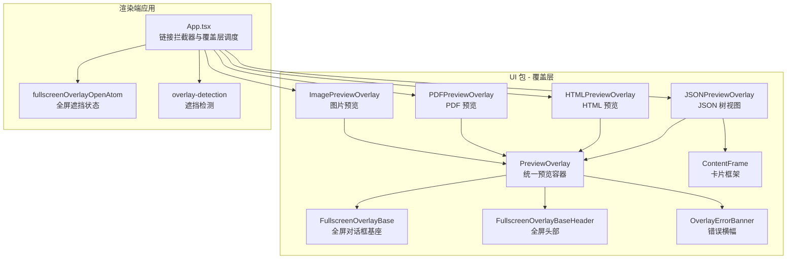
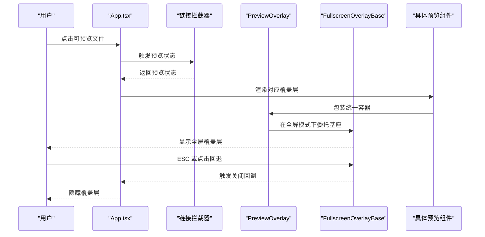
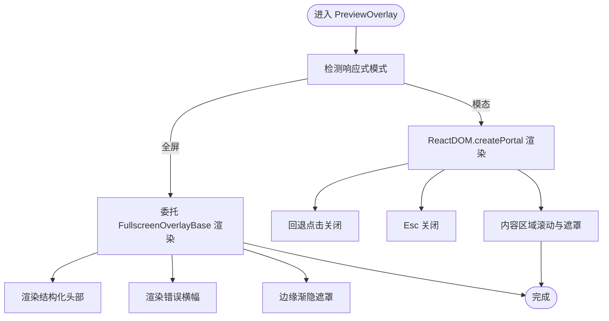
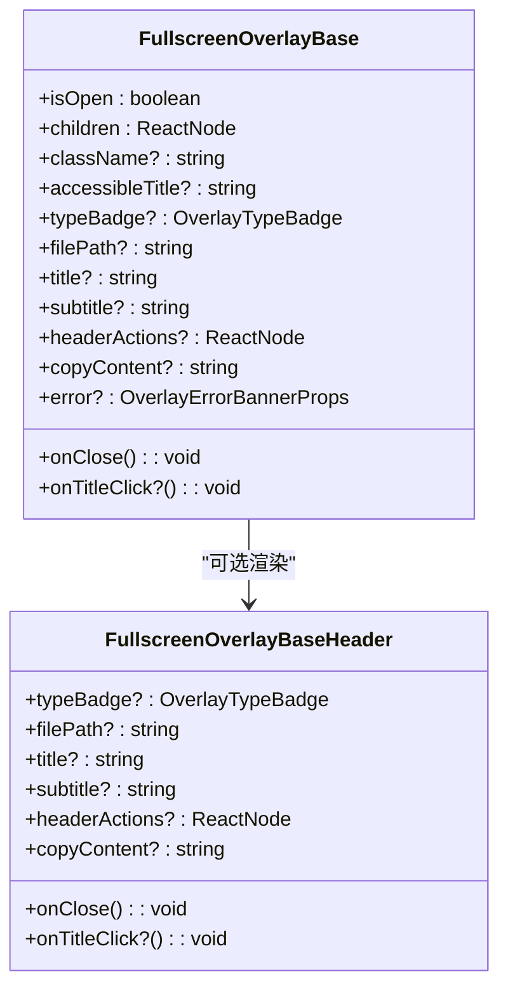
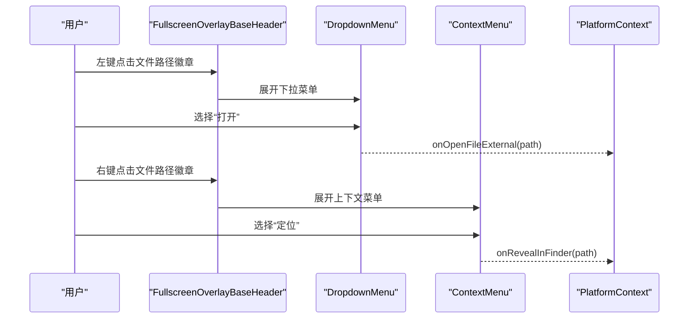
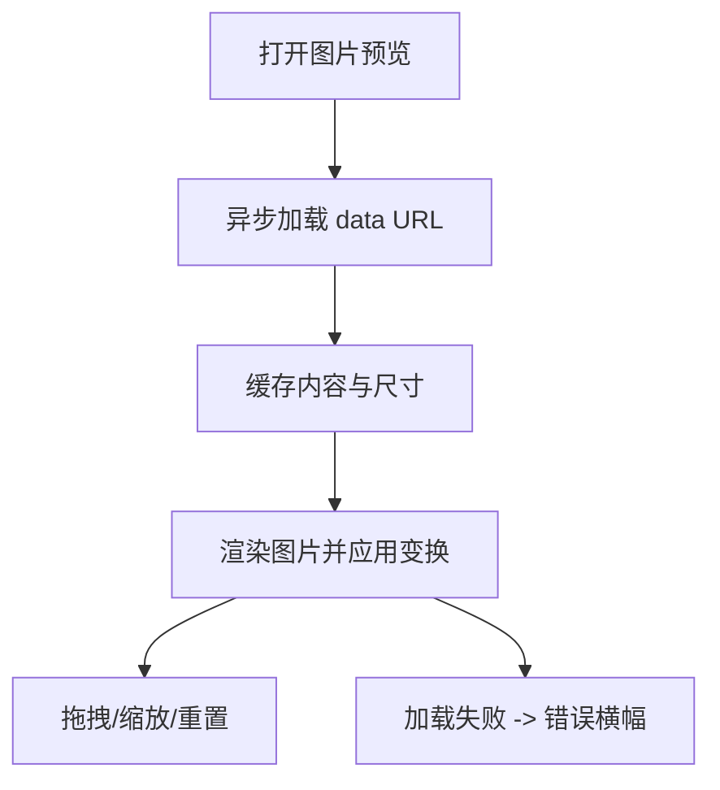
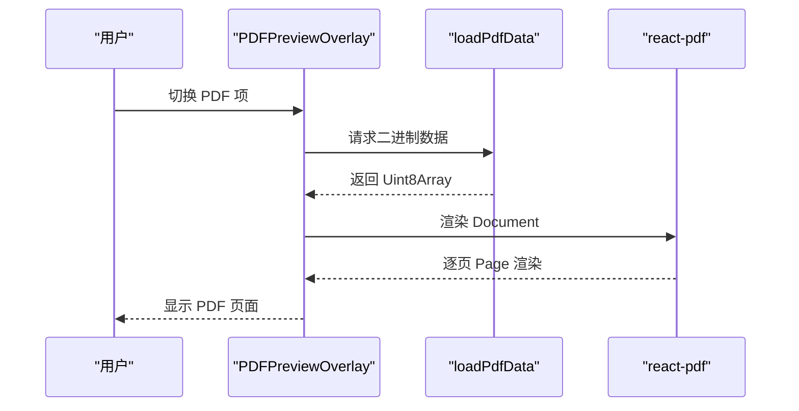
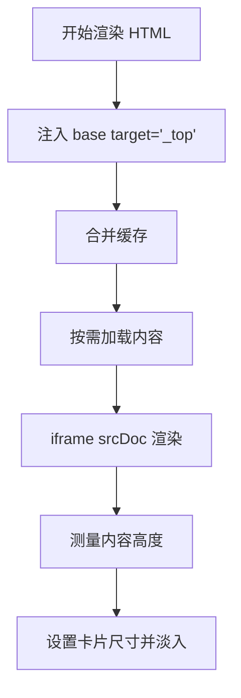
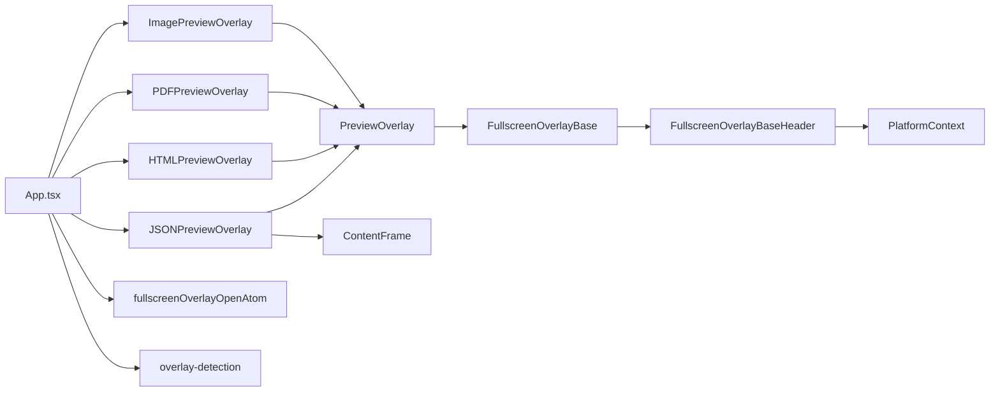

# 覆盖层组件

<cite>
**本文引用的文件**
- [packages/ui/src/components/overlay/PreviewOverlay.tsx](file://packages/ui/src/components/overlay/PreviewOverlay.tsx)
- [packages/ui/src/components/overlay/FullscreenOverlayBase.tsx](file://packages/ui/src/components/overlay/FullscreenOverlayBase.tsx)
- [packages/ui/src/components/overlay/FullscreenOverlayBaseHeader.tsx](file://packages/ui/src/components/overlay/FullscreenOverlayBaseHeader.tsx)
- [packages/ui/src/components/overlay/OverlayErrorBanner.tsx](file://packages/ui/src/components/overlay/OverlayErrorBanner.tsx)
- [packages/ui/src/components/overlay/ContentFrame.tsx](file://packages/ui/src/components/overlay/ContentFrame.tsx)
- [packages/ui/src/components/overlay/ImagePreviewOverlay.tsx](file://packages/ui/src/components/overlay/ImagePreviewOverlay.tsx)
- [packages/ui/src/components/overlay/PDFPreviewOverlay.tsx](file://packages/ui/src/components/overlay/PDFPreviewOverlay.tsx)
- [packages/ui/src/components/overlay/HTMLPreviewOverlay.tsx](file://packages/ui/src/components/overlay/HTMLPreviewOverlay.tsx)
- [packages/ui/src/components/overlay/JSONPreviewOverlay.tsx](file://packages/ui/src/components/overlay/JSONPreviewOverlay.tsx)
- [apps/electron/src/renderer/atoms/overlay.ts](file://apps/electron/src/renderer/atoms/overlay.ts)
- [apps/electron/src/renderer/lib/overlay-detection.ts](file://apps/electron/src/renderer/lib/overlay-detection.ts)
- [apps/electron/src/renderer/App.tsx](file://apps/electron/src/renderer/App.tsx)
</cite>

## 目录

1. [简介](#简介)
2. [项目结构](#项目结构)
3. [核心组件](#核心组件)
4. [架构总览](#架构总览)
5. [详细组件分析](#详细组件分析)
6. [依赖关系分析](#依赖关系分析)
7. [性能考量](#性能考量)
8. [故障排查指南](#故障排查指南)
9. [结论](#结论)
10. [附录](#附录)

## 简介

本文件系统化梳理 Craft Agents 的覆盖层组件体系，聚焦预览覆盖层、全屏覆盖层、HTML 预览、PDF 预览等组件的视觉外观、行为与交互模式；记录属性/参数、事件、插槽与自定义选项；提供使用示例与代码片段路径；并给出响应式设计、无障碍访问、样式自定义与主题支持、跨浏览器兼容性与性能优化建议，以及组件组合与与其他 UI 元素的集成方式。

## 项目结构

覆盖层组件主要位于 UI 包的 overlay 目录，并在渲染端应用中通过链接拦截器触发与管理。核心关系如下：

- 基础层：FullscreenOverlayBase（全屏对话框）、FullscreenOverlayBaseHeader（全屏头部）、OverlayErrorBanner（错误横幅）、ContentFrame（终端风格卡片框架）
- 预览层：PreviewOverlay（统一预览容器，负责模态/全屏切换、回退点击、Esc 关闭、错误横幅、渐隐遮罩等）
- 具体预览：ImagePreviewOverlay、PDFPreviewOverlay、HTMLPreviewOverlay、JSONPreviewOverlay
- 应用集成：App.tsx 中的链接拦截器将可预览文件路由到对应覆盖层；fullscreenOverlayOpenAtom 用于控制主内容缩放；overlay-detection 提供遮挡检测以避免 Esc 冲突

**图表来源**

- [packages/ui/src/components/overlay/PreviewOverlay.tsx](file://packages/ui/src/components/overlay/PreviewOverlay.tsx#L1-L211)
- [packages/ui/src/components/overlay/FullscreenOverlayBase.tsx](file://packages/ui/src/components/overlay/FullscreenOverlayBase.tsx#L1-L182)
- [packages/ui/src/components/overlay/FullscreenOverlayBaseHeader.tsx](file://packages/ui/src/components/overlay/FullscreenOverlayBaseHeader.tsx#L1-L255)
- [packages/ui/src/components/overlay/OverlayErrorBanner.tsx](file://packages/ui/src/components/overlay/OverlayErrorBanner.tsx#L1-L34)
- [packages/ui/src/components/overlay/ContentFrame.tsx](file://packages/ui/src/components/overlay/ContentFrame.tsx#L1-L116)
- [packages/ui/src/components/overlay/ImagePreviewOverlay.tsx](file://packages/ui/src/components/overlay/ImagePreviewOverlay.tsx#L1-L195)
- [packages/ui/src/components/overlay/PDFPreviewOverlay.tsx](file://packages/ui/src/components/overlay/PDFPreviewOverlay.tsx#L1-L162)
- [packages/ui/src/components/overlay/HTMLPreviewOverlay.tsx](file://packages/ui/src/components/overlay/HTMLPreviewOverlay.tsx#L1-L215)
- [packages/ui/src/components/overlay/JSONPreviewOverlay.tsx](file://packages/ui/src/components/overlay/JSONPreviewOverlay.tsx#L1-L171)
- [apps/electron/src/renderer/App.tsx](file://apps/electron/src/renderer/App.tsx#L1615-L1734)
- [apps/electron/src/renderer/atoms/overlay.ts](file://apps/electron/src/renderer/atoms/overlay.ts#L1-L8)
- [apps/electron/src/renderer/lib/overlay-detection.ts](file://apps/electron/src/renderer/lib/overlay-detection.ts#L1-L52)

**章节来源**

- [apps/electron/src/renderer/App.tsx](file://apps/electron/src/renderer/App.tsx#L1615-L1734)
- [apps/electron/src/renderer/atoms/overlay.ts](file://apps/electron/src/renderer/atoms/overlay.ts#L1-L8)
- [apps/electron/src/renderer/lib/overlay-detection.ts](file://apps/electron/src/renderer/lib/overlay-detection.ts#L1-L52)

## 核心组件

- PreviewOverlay：统一预览容器，负责模态/全屏响应式切换、Esc 关闭、回退点击关闭、错误横幅、渐隐遮罩、嵌入模式等。作为所有具体预览组件的外层包装。
- FullscreenOverlayBase：基于 Radix Dialog 的全屏覆盖层基座，提供焦点管理、ESC 处理、macOS 交通灯隐藏、全视口滚动区域与边缘渐隐遮罩、可选结构化头部等。
- FullscreenOverlayBaseHeader：全屏头部，构建类型徽章、文件路径徽章（双触发菜单：左键下拉+右键上下文）、标题徽章、副标题徽章与右侧操作区。
- OverlayErrorBanner：错误横幅，采用“背景色混合+阴影着色”的设计，与 TurnCard 风格一致。
- ContentFrame：终端风格卡片框架，提供标题栏、左右侧栏、自适应宽度（默认最大宽度或内容自适应）与纸张滚动布局。

**章节来源**

- [packages/ui/src/components/overlay/PreviewOverlay.tsx](file://packages/ui/src/components/overlay/PreviewOverlay.tsx#L1-L211)
- [packages/ui/src/components/overlay/FullscreenOverlayBase.tsx](file://packages/ui/src/components/overlay/FullscreenOverlayBase.tsx#L1-L182)
- [packages/ui/src/components/overlay/FullscreenOverlayBaseHeader.tsx](file://packages/ui/src/components/overlay/FullscreenOverlayBaseHeader.tsx#L1-L255)
- [packages/ui/src/components/overlay/OverlayErrorBanner.tsx](file://packages/ui/src/components/overlay/OverlayErrorBanner.tsx#L1-L34)
- [packages/ui/src/components/overlay/ContentFrame.tsx](file://packages/ui/src/components/overlay/ContentFrame.tsx#L1-L116)

## 架构总览

覆盖层体系采用“基础基座 + 统一容器 + 具体预览”的分层设计：

- 基础基座（FullscreenOverlayBase）负责全屏语义、焦点与键盘交互、平台特性（如 macOS 交通灯）。
- 统一容器（PreviewOverlay）负责响应式布局（≥1200px 模态，<1200px 全屏）、Esc 关闭、回退点击关闭、错误横幅、渐隐遮罩。
- 具体预览（Image/PDF/HTML/JSON）在统一容器内渲染各自内容，共享头部与错误处理能力。

**图表来源**

- [apps/electron/src/renderer/App.tsx](file://apps/electron/src/renderer/App.tsx#L1615-L1734)
- [packages/ui/src/components/overlay/PreviewOverlay.tsx](file://packages/ui/src/components/overlay/PreviewOverlay.tsx#L1-L211)
- [packages/ui/src/components/overlay/FullscreenOverlayBase.tsx](file://packages/ui/src/components/overlay/FullscreenOverlayBase.tsx#L1-L182)

## 详细组件分析

### 统一预览容器：PreviewOverlay

- 功能要点
  - 响应式模式：≥1200px 使用模态（ReactDOM.createPortal + 回退点击关闭），<1200px 使用 FullscreenOverlayBase（全屏对话框）。
  - Esc 关闭：仅在模态模式下监听键盘事件。
  - 错误横幅：统一的 OverlayErrorBanner，居中对齐，最大宽度与卡片一致。
  - 渐隐遮罩：顶部与底部的线性渐隐遮罩，提升滚动体验。
  - 嵌入模式：embedded=true 时直接内联渲染，不使用 Portal，便于设计系统演示。
  - 主题与背景：支持 theme='light'|'dark'，背景类名可自定义覆盖。
- 关键属性
  - isOpen: 是否显示
  - onClose: 关闭回调
  - theme: 主题模式
  - typeBadge: 类型徽章（icon, label, variant）
  - filePath/title/onTitleClick/subtitle: 文件路径/标题/副标题与点击回调
  - error: 错误对象（label, message）
  - headerActions: 右侧操作区
  - children: 内容
  - embedded: 嵌入模式
  - className: 容器自定义类名
- 交互与状态
  - Esc 关闭（模态）
  - 回退点击关闭（模态）
  - 全屏模式下由 FullscreenOverlayBase 处理 ESC
  - 内容区域支持滚动与渐隐遮罩
- 使用示例（路径）
  - [预览容器使用示例路径](file://packages/ui/src/components/overlay/ImagePreviewOverlay.tsx#L150-L193)
  - [预览容器使用示例路径](file://packages/ui/src/components/overlay/PDFPreviewOverlay.tsx#L123-L160)
  - [预览容器使用示例路径](file://packages/ui/src/components/overlay/HTMLPreviewOverlay.tsx#L171-L213)
  - [预览容器使用示例路径](file://packages/ui/src/components/overlay/JSONPreviewOverlay.tsx#L118-L170)

**图表来源**

- [packages/ui/src/components/overlay/PreviewOverlay.tsx](file://packages/ui/src/components/overlay/PreviewOverlay.tsx#L76-L210)

**章节来源**

- [packages/ui/src/components/overlay/PreviewOverlay.tsx](file://packages/ui/src/components/overlay/PreviewOverlay.tsx#L1-L211)

### 全屏覆盖层基座：FullscreenOverlayBase

- 功能要点
  - 基于 Radix Dialog，自动焦点管理、ESC 处理、无障碍属性（role="dialog", aria-modal）。
  - macOS 交通灯隐藏：打开时隐藏，关闭时恢复。
  - 全视口滚动区域：CSS 掩膜渐隐遮罩，浮动头部覆盖内容。
  - 结构化头部：当提供 typeBadge、filePath、title、subtitle、headerActions、copyContent 任一，即渲染头部。
  - 错误横幅：在头部与内容之间居中展示。
- 关键属性
  - isOpen/onClose/children/className/accessibleTitle
  - 结构化头部相关：typeBadge、filePath、title、onTitleClick、subtitle、headerActions、copyContent
  - error
- 交互与状态
  - ESC 关闭
  - 打开时隐藏交通灯，关闭时恢复
  - 内容滚动与边缘渐隐
- 使用示例（路径）
  - [全屏基座使用示例路径](file://packages/ui/src/components/overlay/PreviewOverlay.tsx#L169-L185)

**图表来源**

- [packages/ui/src/components/overlay/FullscreenOverlayBase.tsx](file://packages/ui/src/components/overlay/FullscreenOverlayBase.tsx#L53-L85)
- [packages/ui/src/components/overlay/FullscreenOverlayBaseHeader.tsx](file://packages/ui/src/components/overlay/FullscreenOverlayBaseHeader.tsx#L33-L50)

**章节来源**

- [packages/ui/src/components/overlay/FullscreenOverlayBase.tsx](file://packages/ui/src/components/overlay/FullscreenOverlayBase.tsx#L1-L182)

### 全屏头部：FullscreenOverlayBaseHeader

- 功能要点
  - 类型徽章、标题徽章、副标题徽章按顺序渲染。
  - 文件路径徽章支持双触发菜单：左键下拉菜单（打开/定位），右键上下文菜单（相同项）。
  - 右侧操作区支持内置复制按钮与自定义操作。
  - 复制逻辑：写入剪贴板，短暂提示“已复制”。
- 关键属性
  - onClose、typeBadge、filePath、title、onTitleClick、subtitle、headerActions、copyContent
- 使用示例（路径）
  - [全屏头部使用示例路径](file://packages/ui/src/components/overlay/FullscreenOverlayBaseHeader.tsx#L194-L254)

**图表来源**

- [packages/ui/src/components/overlay/FullscreenOverlayBaseHeader.tsx](file://packages/ui/src/components/overlay/FullscreenOverlayBaseHeader.tsx#L101-L187)

**章节来源**

- [packages/ui/src/components/overlay/FullscreenOverlayBaseHeader.tsx](file://packages/ui/src/components/overlay/FullscreenOverlayBaseHeader.tsx#L1-L255)

### 错误横幅：OverlayErrorBanner

- 设计与行为
  - 背景采用“破坏色混合背景”，阴影着色使用 --destructive-rgb，最大宽度与卡片一致。
  - 文本为等宽字体，适合显示错误信息。
- 关键属性
  - label: 错误类型标签
  - message: 错误消息
- 使用示例（路径）
  - [错误横幅使用示例路径](file://packages/ui/src/components/overlay/OverlayErrorBanner.tsx#L21-L33)

**章节来源**

- [packages/ui/src/components/overlay/OverlayErrorBanner.tsx](file://packages/ui/src/components/overlay/OverlayErrorBanner.tsx#L1-L34)

### 卡片框架：ContentFrame

- 功能要点
  - 提供“应用窗口”风格：圆角卡片、居中标题栏、背景模糊阴影。
  - 支持左右侧栏（绝对定位，不影响卡片中心）。
  - 宽度模式：默认最大宽度（数值），或 fitContent（max-content，适合可变宽度内容，如宽表格）。
  - 内容自然增长，父级滚动容器进行“纸张滚动”。
- 关键属性
  - title、maxWidth、minWidth、fitContent、leftSidebar、rightSidebar、children
- 使用示例（路径）
  - [卡片框架使用示例路径](file://packages/ui/src/components/overlay/JSONPreviewOverlay.tsx#L133-L167)

**章节来源**

- [packages/ui/src/components/overlay/ContentFrame.tsx](file://packages/ui/src/components/overlay/ContentFrame.tsx#L1-L116)

### 图片预览：ImagePreviewOverlay

- 功能要点
  - 支持多图项导航（ItemNavigator）与缩放/拖拽（ZoomControls + useRichBlockInteractions）。
  - 加载策略：通过 loadDataUrl 获取 data URL，缓存尺寸与内容。
  - 错误与加载状态：错误横幅、加载提示。
  - 头部动作：导航、缩放控件、复制路径。
- 关键属性
  - isOpen/onClose/theme、filePath/items/initialIndex、loadDataUrl、title
- 交互与状态
  - 鼠标拖拽移动、双击缩放、滚轮缩放步进、适配窗口大小、重置视图。
  - 缓存命中后直接渲染，未命中异步加载。
- 使用示例（路径）
  - [图片预览使用示例路径](file://packages/ui/src/components/overlay/ImagePreviewOverlay.tsx#L31-L194)

**图表来源**

- [packages/ui/src/components/overlay/ImagePreviewOverlay.tsx](file://packages/ui/src/components/overlay/ImagePreviewOverlay.tsx#L75-L124)

**章节来源**

- [packages/ui/src/components/overlay/ImagePreviewOverlay.tsx](file://packages/ui/src/components/overlay/ImagePreviewOverlay.tsx#L1-L195)

### PDF 预览：PDFPreviewOverlay

- 功能要点
  - 基于 react-pdf/pdf.js，支持多页渲染、文本层与注释层。
  - 加载策略：通过 loadPdfData 获取 Uint8Array，memo 化文件对象。
  - 错误与加载状态：错误横幅、加载提示。
  - 头部动作：导航、复制路径。
- 关键属性
  - isOpen/onClose/theme、filePath/items/initialIndex、loadPdfData
- 交互与状态
  - 切换项时重新加载数据，记录页数，逐页渲染。
- 使用示例（路径）
  - [PDF 预览使用示例路径](file://packages/ui/src/components/overlay/PDFPreviewOverlay.tsx#L43-L161)

**图表来源**

- [packages/ui/src/components/overlay/PDFPreviewOverlay.tsx](file://packages/ui/src/components/overlay/PDFPreviewOverlay.tsx#L74-L112)

**章节来源**

- [packages/ui/src/components/overlay/PDFPreviewOverlay.tsx](file://packages/ui/src/components/overlay/PDFPreviewOverlay.tsx#L1-L162)

### HTML 预览：HTMLPreviewOverlay

- 功能要点
  - 在沙箱 iframe 中渲染 HTML，注入 base target="\_top" 使链接在顶层导航，交由 Electron will-navigate 拦截。
  - 自动测量内容高度（允许同源 allow-same-origin）。
  - 支持外部/内部内容缓存合并，按需加载。
  - 头部动作：导航、复制 HTML。
- 关键属性
  - isOpen/onClose/theme、html/items/contentCache/onLoadContent/initialIndex/title
- 交互与状态
  - iframe onload 后读取 scrollHeight 并设置容器尺寸，首次测量后淡入。
- 使用示例（路径）
  - [HTML 预览使用示例路径](file://packages/ui/src/components/overlay/HTMLPreviewOverlay.tsx#L60-L214)

**图表来源**

- [packages/ui/src/components/overlay/HTMLPreviewOverlay.tsx](file://packages/ui/src/components/overlay/HTMLPreviewOverlay.tsx#L131-L154)

**章节来源**

- [packages/ui/src/components/overlay/HTMLPreviewOverlay.tsx](file://packages/ui/src/components/overlay/HTMLPreviewOverlay.tsx#L1-L215)

### JSON 预览：JSONPreviewOverlay

- 功能要点
  - 使用 @uiw/react-json-view 渲染树形视图，支持展开/折叠、复制。
  - 内置深解析：递归解析字符串中的 JSON，使其成为可展开节点。
  - 主题适配：VS Code 深色与 GitHub 浅色主题，适配应用 CSS 变量。
  - 错误横幅：解析错误提示。
- 关键属性
  - isOpen/onClose/theme/data/filePath/title/error/embedded
- 交互与状态
  - 复制图标：点击复制，短暂提示“已复制”。
- 使用示例（路径）
  - [JSON 预览使用示例路径](file://packages/ui/src/components/overlay/JSONPreviewOverlay.tsx#L97-L170)

**章节来源**

- [packages/ui/src/components/overlay/JSONPreviewOverlay.tsx](file://packages/ui/src/components/overlay/JSONPreviewOverlay.tsx#L1-L171)

## 依赖关系分析

- 组件耦合
  - 具体预览组件均依赖 PreviewOverlay，后者再委托 FullscreenOverlayBase（全屏模式）或自绘模态（小屏）。
  - FullscreenOverlayBaseHeader 依赖 PlatformContext 提供的文件系统操作（打开/定位）。
  - JSONPreviewOverlay 依赖 ContentFrame 以获得卡片框架与标题栏。
- 外部依赖
  - 图片：useRichBlockInteractions（拖拽/缩放）
  - PDF：react-pdf/pdfjs-dist
  - HTML：iframe sandbox + will-navigate
  - JSON：@uiw/react-json-view
- 平台集成
  - fullscreenOverlayOpenAtom 用于 AppShell 对主内容应用缩放效果。
  - overlay-detection 用于检测 DOM 中是否存在任何遮挡元素，避免 ESC 冲突。

**图表来源**

- [packages/ui/src/components/overlay/ImagePreviewOverlay.tsx](file://packages/ui/src/components/overlay/ImagePreviewOverlay.tsx#L1-L195)
- [packages/ui/src/components/overlay/PDFPreviewOverlay.tsx](file://packages/ui/src/components/overlay/PDFPreviewOverlay.tsx#L1-L162)
- [packages/ui/src/components/overlay/HTMLPreviewOverlay.tsx](file://packages/ui/src/components/overlay/HTMLPreviewOverlay.tsx#L1-L215)
- [packages/ui/src/components/overlay/JSONPreviewOverlay.tsx](file://packages/ui/src/components/overlay/JSONPreviewOverlay.tsx#L1-L171)
- [packages/ui/src/components/overlay/PreviewOverlay.tsx](file://packages/ui/src/components/overlay/PreviewOverlay.tsx#L1-L211)
- [packages/ui/src/components/overlay/FullscreenOverlayBase.tsx](file://packages/ui/src/components/overlay/FullscreenOverlayBase.tsx#L1-L182)
- [packages/ui/src/components/overlay/FullscreenOverlayBaseHeader.tsx](file://packages/ui/src/components/overlay/FullscreenOverlayBaseHeader.tsx#L1-L255)
- [apps/electron/src/renderer/App.tsx](file://apps/electron/src/renderer/App.tsx#L1615-L1734)
- [apps/electron/src/renderer/atoms/overlay.ts](file://apps/electron/src/renderer/atoms/overlay.ts#L1-L8)
- [apps/electron/src/renderer/lib/overlay-detection.ts](file://apps/electron/src/renderer/lib/overlay-detection.ts#L1-L52)

**章节来源**

- [apps/electron/src/renderer/App.tsx](file://apps/electron/src/renderer/App.tsx#L1615-L1734)
- [apps/electron/src/renderer/atoms/overlay.ts](file://apps/electron/src/renderer/atoms/overlay.ts#L1-L8)
- [apps/electron/src/renderer/lib/overlay-detection.ts](file://apps/electron/src/renderer/lib/overlay-detection.ts#L1-L52)

## 性能考量

- 模态与全屏的选择
  - ≥1200px 使用模态，减少全屏渲染成本；<1200px 使用 FullscreenOverlayBase，充分利用平台原生对话框。
- 缓存策略
  - 图片：内容 URL 与自然尺寸缓存，避免重复加载与测量。
  - PDF：文件对象 memo 化，react-pdf 使用严格相等判断，防止不必要的重渲染。
  - HTML：外部缓存优先，内部缓存补充，按需加载。
- 渲染优化
  - 渐隐遮罩与滚动容器分离，减少重排。
  - JSON：深解析仅在必要时进行，且结果 memo 化。
- 资源加载
  - PDF worker 使用 Vite ?url 导入，确保开发与生产环境一致性。
- 交互性能
  - 图片拖拽/缩放使用 transform 与过渡，避免频繁重排。
  - HTML iframe 首次测量后淡入，避免闪烁。

[本节为通用性能建议，无需特定文件引用]

## 故障排查指南

- ESC 冲突
  - 现象：按下 ESC 时同时触发聊天中断与覆盖层关闭。
  - 原因：存在遮挡元素（模态/抽屉/菜单/气泡/选择器/内联菜单）。
  - 解决：使用 overlay-detection 检测遮挡，若存在则交由遮挡元素处理 ESC。
  - 参考：[遮挡检测实现](file://apps/electron/src/renderer/lib/overlay-detection.ts#L48-L51)
- 图片加载失败
  - 现象：图片预览显示“加载失败”。
  - 排查：确认 loadDataUrl 返回有效 data URL；检查网络与权限；查看错误横幅。
  - 参考：[图片加载与错误处理](file://packages/ui/src/components/overlay/ImagePreviewOverlay.tsx#L88-L124)
- PDF 渲染异常
  - 现象：PDF 无法加载或渲染空白。
  - 排查：确认 loadPdfData 返回 Uint8Array；检查 pdf.js worker 配置；查看错误横幅。
  - 参考：[PDF 加载与错误处理](file://packages/ui/src/components/overlay/PDFPreviewOverlay.tsx#L74-L98)
- HTML 链接无法跳转
  - 现象：点击链接无反应。
  - 排查：确认已注入 base target="\_top"；检查 will-navigate 处理逻辑；确保 allow-same-origin。
  - 参考：[HTML 注入与 iframe](file://packages/ui/src/components/overlay/HTMLPreviewOverlay.tsx#L23-L32)
- JSON 解析错误
  - 现象：JSON 预览显示解析错误。
  - 排查：确认传入 data 为可序列化对象；查看错误横幅；检查深解析逻辑。
  - 参考：[JSON 深解析与错误处理](file://packages/ui/src/components/overlay/JSONPreviewOverlay.tsx#L18-L56)

**章节来源**

- [apps/electron/src/renderer/lib/overlay-detection.ts](file://apps/electron/src/renderer/lib/overlay-detection.ts#L41-L51)
- [packages/ui/src/components/overlay/ImagePreviewOverlay.tsx](file://packages/ui/src/components/overlay/ImagePreviewOverlay.tsx#L88-L124)
- [packages/ui/src/components/overlay/PDFPreviewOverlay.tsx](file://packages/ui/src/components/overlay/PDFPreviewOverlay.tsx#L74-L98)
- [packages/ui/src/components/overlay/HTMLPreviewOverlay.tsx](file://packages/ui/src/components/overlay/HTMLPreviewOverlay.tsx#L23-L32)
- [packages/ui/src/components/overlay/JSONPreviewOverlay.tsx](file://packages/ui/src/components/overlay/JSONPreviewOverlay.tsx#L18-L56)

## 结论

Craft Agents 的覆盖层组件体系以 FullscreenOverlayBase 为基础，通过 PreviewOverlay 实现统一的预览容器与响应式布局，结合 ContentFrame 提供一致的卡片框架，最终在具体预览组件中实现图片、PDF、HTML、JSON 的高质量预览体验。配合链接拦截器、遮挡检测与平台上下文，实现了跨平台、可扩展、可维护的预览解决方案。

[本节为总结性内容，无需特定文件引用]

## 附录

### 属性/参数速览（按组件）

- PreviewOverlay
  - isOpen, onClose, theme, typeBadge(icon,label,variant), filePath, title, onTitleClick, subtitle, error(label,message), headerActions, children, embedded, className
- FullscreenOverlayBase
  - isOpen, onClose, children, className, accessibleTitle, typeBadge, filePath, title, onTitleClick, subtitle, headerActions, copyContent, error
- FullscreenOverlayBaseHeader
  - onClose, typeBadge, filePath, title, onTitleClick, subtitle, headerActions, copyContent
- OverlayErrorBanner
  - label, message
- ContentFrame
  - title, maxWidth, minWidth, fitContent, leftSidebar, rightSidebar, children
- ImagePreviewOverlay
  - isOpen, onClose, theme, filePath, items, initialIndex, loadDataUrl, title
- PDFPreviewOverlay
  - isOpen, onClose, theme, filePath, items, initialIndex, loadPdfData
- HTMLPreviewOverlay
  - isOpen, onClose, theme, html, items, contentCache, onLoadContent, initialIndex, title
- JSONPreviewOverlay
  - isOpen, onClose, theme, data, filePath, title, error, embedded

**章节来源**

- [packages/ui/src/components/overlay/PreviewOverlay.tsx](file://packages/ui/src/components/overlay/PreviewOverlay.tsx#L33-L74)
- [packages/ui/src/components/overlay/FullscreenOverlayBase.tsx](file://packages/ui/src/components/overlay/FullscreenOverlayBase.tsx#L53-L85)
- [packages/ui/src/components/overlay/FullscreenOverlayBaseHeader.tsx](file://packages/ui/src/components/overlay/FullscreenOverlayBaseHeader.tsx#L33-L50)
- [packages/ui/src/components/overlay/OverlayErrorBanner.tsx](file://packages/ui/src/components/overlay/OverlayErrorBanner.tsx#L14-L19)
- [packages/ui/src/components/overlay/ContentFrame.tsx](file://packages/ui/src/components/overlay/ContentFrame.tsx#L39-L58)
- [packages/ui/src/components/overlay/ImagePreviewOverlay.tsx](file://packages/ui/src/components/overlay/ImagePreviewOverlay.tsx#L20-L29)
- [packages/ui/src/components/overlay/PDFPreviewOverlay.tsx](file://packages/ui/src/components/overlay/PDFPreviewOverlay.tsx#L29-L41)
- [packages/ui/src/components/overlay/HTMLPreviewOverlay.tsx](file://packages/ui/src/components/overlay/HTMLPreviewOverlay.tsx#L39-L58)
- [packages/ui/src/components/overlay/JSONPreviewOverlay.tsx](file://packages/ui/src/components/overlay/JSONPreviewOverlay.tsx#L62-L79)

### 事件与插槽

- 事件
  - onClose：关闭回调（所有组件）
  - onTitleClick：标题徽章点击（PreviewOverlay）
  - onOpenFileExternal/onRevealInFinder：文件操作（FullscreenOverlayBaseHeader 通过 PlatformContext）
- 插槽/区域
  - headerActions：右上角操作区（PreviewOverlay、FullscreenOverlayBaseHeader）
  - leftSidebar/rightSidebar：卡片左右侧栏（ContentFrame）

**章节来源**

- [packages/ui/src/components/overlay/PreviewOverlay.tsx](file://packages/ui/src/components/overlay/PreviewOverlay.tsx#L36-L64)
- [packages/ui/src/components/overlay/FullscreenOverlayBaseHeader.tsx](file://packages/ui/src/components/overlay/FullscreenOverlayBaseHeader.tsx#L206-L235)

### 使用示例（代码片段路径）

- 图片预览
  - [示例路径](file://packages/ui/src/components/overlay/ImagePreviewOverlay.tsx#L150-L193)
- PDF 预览
  - [示例路径](file://packages/ui/src/components/overlay/PDFPreviewOverlay.tsx#L123-L160)
- HTML 预览
  - [示例路径](file://packages/ui/src/components/overlay/HTMLPreviewOverlay.tsx#L171-L213)
- JSON 预览
  - [示例路径](file://packages/ui/src/components/overlay/JSONPreviewOverlay.tsx#L118-L170)
- 全屏基座
  - [示例路径](file://packages/ui/src/components/overlay/FullscreenOverlayBase.tsx#L122-L179)

**章节来源**

- [packages/ui/src/components/overlay/ImagePreviewOverlay.tsx](file://packages/ui/src/components/overlay/ImagePreviewOverlay.tsx#L150-L193)
- [packages/ui/src/components/overlay/PDFPreviewOverlay.tsx](file://packages/ui/src/components/overlay/PDFPreviewOverlay.tsx#L123-L160)
- [packages/ui/src/components/overlay/HTMLPreviewOverlay.tsx](file://packages/ui/src/components/overlay/HTMLPreviewOverlay.tsx#L171-L213)
- [packages/ui/src/components/overlay/JSONPreviewOverlay.tsx](file://packages/ui/src/components/overlay/JSONPreviewOverlay.tsx#L118-L170)
- [packages/ui/src/components/overlay/FullscreenOverlayBase.tsx](file://packages/ui/src/components/overlay/FullscreenOverlayBase.tsx#L122-L179)

### 响应式设计与无障碍访问

- 响应式
  - ≥1200px：模态（固定尺寸、回退点击关闭、Esc 关闭）
  - <1200px：全屏（Radix Dialog、边缘渐隐遮罩、浮动头部）
- 无障碍
  - 全屏模式：role="dialog"、aria-modal、可访问标题、ESC 关闭、焦点管理
  - 头部菜单：DropdownMenu/ContextMenu 组合，支持键盘导航
- 可访问性建议
  - 为 iframe 提供合适的 title
  - 错误横幅使用等宽字体便于复制
  - 复制按钮提供“已复制”反馈

**章节来源**

- [packages/ui/src/components/overlay/FullscreenOverlayBase.tsx](file://packages/ui/src/components/overlay/FullscreenOverlayBase.tsx#L122-L134)
- [packages/ui/src/components/overlay/FullscreenOverlayBaseHeader.tsx](file://packages/ui/src/components/overlay/FullscreenOverlayBaseHeader.tsx#L194-L254)
- [packages/ui/src/components/overlay/HTMLPreviewOverlay.tsx](file://packages/ui/src/components/overlay/HTMLPreviewOverlay.tsx#L200-L208)

### 样式自定义与主题支持

- 背景与容器
  - PreviewOverlay 支持自定义 className 覆盖默认背景类名
  - FullscreenOverlayBase 提供背景模糊与渐变遮罩
- JSON 主题
  - 深色：VS Code 主题变量适配
  - 浅色：GitHub Light 主题变量适配
- 卡片框架
  - ContentFrame 提供标题栏、左右侧栏与自适应宽度
- 头部徽章
  - PreviewHeaderBadge 支持 variant 与 shrinkable

**章节来源**

- [packages/ui/src/components/overlay/PreviewOverlay.tsx](file://packages/ui/src/components/overlay/PreviewOverlay.tsx#L30-L31)
- [packages/ui/src/components/overlay/FullscreenOverlayBase.tsx](file://packages/ui/src/components/overlay/FullscreenOverlayBase.tsx#L126-L129)
- [packages/ui/src/components/overlay/JSONPreviewOverlay.tsx](file://packages/ui/src/components/overlay/JSONPreviewOverlay.tsx#L85-L95)
- [packages/ui/src/components/overlay/ContentFrame.tsx](file://packages/ui/src/components/overlay/ContentFrame.tsx#L92-L98)

### 跨浏览器兼容性与性能优化

- 跨浏览器
  - PDF：pdf.js worker 使用 Vite ?url 导入，保证开发/生产一致性
  - HTML：iframe sandbox + allow-same-origin 以启用内容高度测量
- 性能
  - 缓存：图片/尺寸、PDF 文件对象、HTML 内容
  - 渲染：transform 与过渡、渐隐遮罩、memo 化
  - 交互：拖拽/缩放、滚动容器分离

**章节来源**

- [packages/ui/src/components/overlay/PDFPreviewOverlay.tsx](file://packages/ui/src/components/overlay/PDFPreviewOverlay.tsx#L20-L22)
- [packages/ui/src/components/overlay/HTMLPreviewOverlay.tsx](file://packages/ui/src/components/overlay/HTMLPreviewOverlay.tsx#L137-L154)
- [packages/ui/src/components/overlay/ImagePreviewOverlay.tsx](file://packages/ui/src/components/overlay/ImagePreviewOverlay.tsx#L184-L188)

### 组件组合与集成

- App.tsx 集成
  - 链接拦截器根据文件类型路由到对应覆盖层
  - fullscreenOverlayOpenAtom 控制主内容缩放
  - overlay-detection 避免 ESC 冲突
- 与其他 UI 元素
  - 头部菜单与平台操作解耦，通过 PlatformContext 注入
  - ContentFrame 与侧栏支持复杂布局（如 MultiDiffPreviewOverlay）

**章节来源**

- [apps/electron/src/renderer/App.tsx](file://apps/electron/src/renderer/App.tsx#L1615-L1734)
- [apps/electron/src/renderer/atoms/overlay.ts](file://apps/electron/src/renderer/atoms/overlay.ts#L1-L8)
- [apps/electron/src/renderer/lib/overlay-detection.ts](file://apps/electron/src/renderer/lib/overlay-detection.ts#L41-L51)
