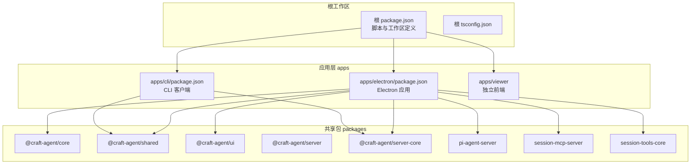
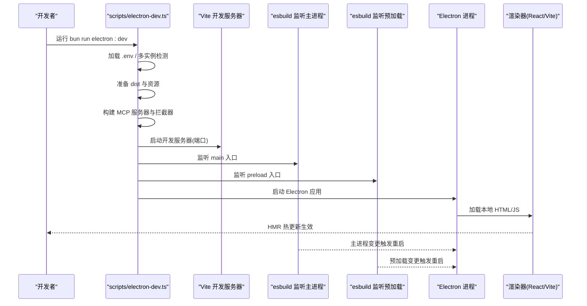
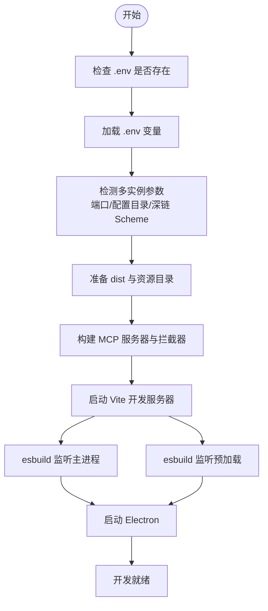
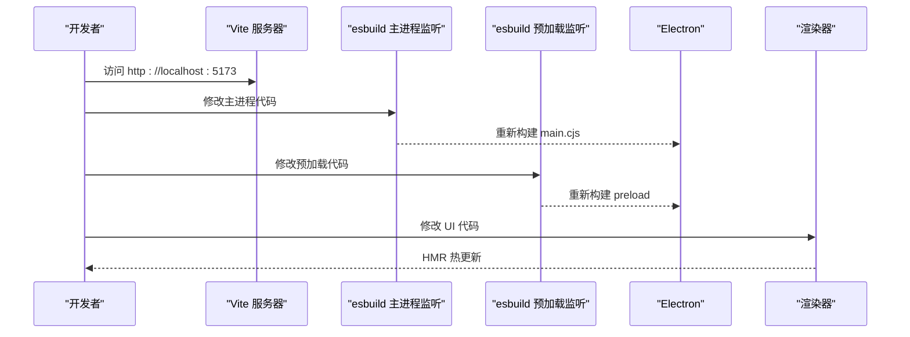
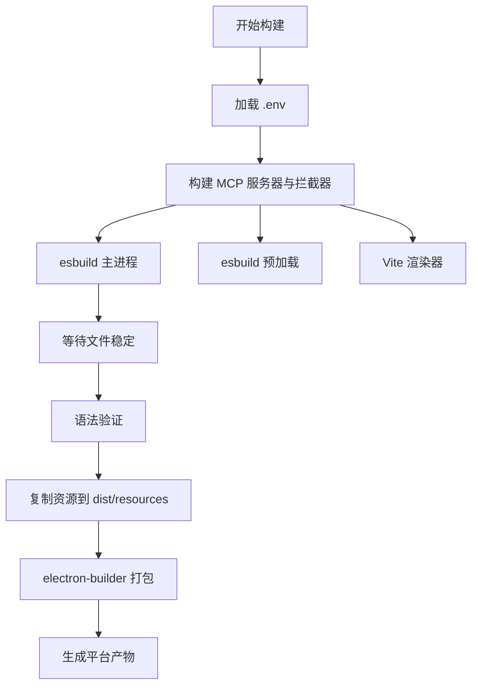
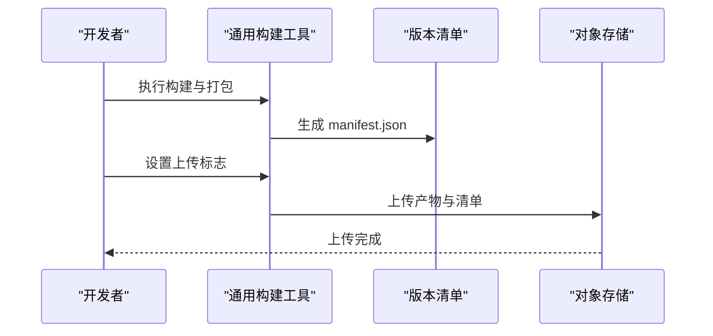
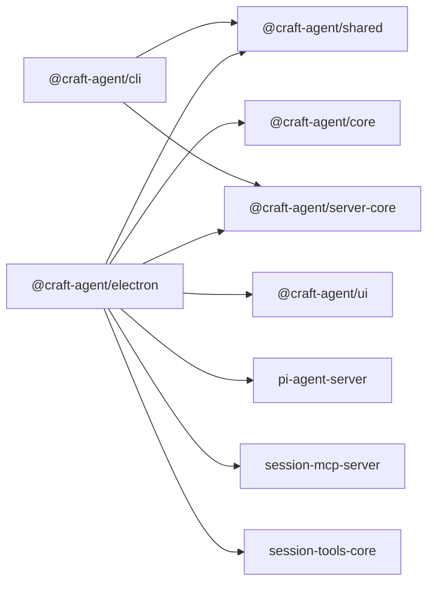

# 开发指南

<cite>
**本文档引用的文件**
- [README.md](file://README.md)
- [CONTRIBUTING.md](file://CONTRIBUTING.md)
- [package.json](file://package.json)
- [apps/electron/package.json](file://apps/electron/package.json)
- [apps/cli/package.json](file://apps/cli/package.json)
- [scripts/build/common.ts](file://scripts/build/common.ts)
- [scripts/electron-dev.ts](file://scripts/electron-dev.ts)
- [apps/electron/vite.config.ts](file://apps/electron/vite.config.ts)
- [apps/electron/electron-builder.yml](file://apps/electron/electron-builder.yml)
- [scripts/electron-build-main.ts](file://scripts/electron-build-main.ts)
- [scripts/electron-build-preload.ts](file://scripts/electron-build-preload.ts)
- [scripts/electron-build-renderer.ts](file://scripts/electron-build-renderer.ts)
- [scripts/electron-build-resources.ts](file://scripts/electron-build-resources.ts)
- [apps/electron/tsconfig.json](file://apps/electron/tsconfig.json)
- [apps/electron/eslint.config.mjs](file://apps/electron/eslint.config.mjs)
- [packages/ui/tsconfig.json](file://packages/ui/tsconfig.json)
</cite>

## 目录

1. [简介](#简介)
2. [项目结构](#项目结构)
3. [核心组件](#核心组件)
4. [架构总览](#架构总览)
5. [详细组件分析](#详细组件分析)
6. [依赖关系分析](#依赖关系分析)
7. [性能考虑](#性能考虑)
8. [故障排查指南](#故障排查指南)
9. [结论](#结论)
10. [附录](#附录)

## 简介

本开发指南面向希望参与 Craft Agents 开发与维护的工程师，覆盖从开发环境搭建、热重载开发与调试、构建打包到发布的完整流程。文档基于仓库中的实际脚本与配置，提供可操作的步骤、可视化图示与常见问题解答，帮助初学者快速上手，同时为有经验的开发者提供足够的技术深度。

## 项目结构

项目采用 Monorepo 结构，主要由以下部分组成：

- apps：应用层
  - electron：Electron 桌面端应用（主进程、预加载、渲染器）
  - cli：命令行客户端
  - viewer：会话查看器（独立前端）
- packages：共享包与 UI 组件
  - core、shared、ui、server、server-core、pi-agent-server、session-mcp-server、session-tools-core
- scripts：构建与发布脚本
- 根目录配置：根 package.json、tsconfig.json、.env 示例等

**图表来源**

- [package.json](file://package.json#L7-L11)
- [apps/electron/package.json](file://apps/electron/package.json#L39-L74)
- [apps/cli/package.json](file://apps/cli/package.json#L15-L18)

**章节来源**

- [README.md](file://README.md#L343-L366)
- [package.json](file://package.json#L7-L11)

## 核心组件

- 开发脚本与任务
  - 根脚本：类型检查、测试、lint、开发与打包等
  - Electron 构建脚本：主进程、预加载、渲染器、资源复制
  - 通用构建工具：平台检测、二进制下载与校验、资源复制与验证
- 开发服务器与热重载
  - Vite 渲染器开发服务器
  - esbuild 监听主进程与预加载
  - Electron 启动与进程管理
- 打包与分发
  - electron-builder 配置与多平台产物
  - 资源包含策略与签名/公证开关
- 规范与质量保障
  - ESLint 平台、路径、样式、导航等自定义规则
  - 类型检查与测试策略

**章节来源**

- [package.json](file://package.json#L12-L71)
- [scripts/build/common.ts](file://scripts/build/common.ts#L19-L30)
- [apps/electron/vite.config.ts](file://apps/electron/vite.config.ts#L11-L74)
- [apps/electron/electron-builder.yml](file://apps/electron/electron-builder.yml#L1-L220)
- [apps/electron/eslint.config.mjs](file://apps/electron/eslint.config.mjs#L21-L225)

## 架构总览

下图展示了开发时的“热重载开发”与“打包构建”的整体流程，以及 Electron 主进程、预加载与渲染器之间的交互关系。

**图表来源**

- [scripts/electron-dev.ts](file://scripts/electron-dev.ts#L362-L580)
- [apps/electron/vite.config.ts](file://apps/electron/vite.config.ts#L70-L74)
- [apps/electron/package.json](file://apps/electron/package.json#L17-L37)

**章节来源**

- [scripts/electron-dev.ts](file://scripts/electron-dev.ts#L362-L580)
- [apps/electron/vite.config.ts](file://apps/electron/vite.config.ts#L11-L74)

## 详细组件分析

### 开发环境设置与启动

- 基础要求
  - 运行时：Bun
  - 工具链：Node.js 18+（部分工具）、Vite、esbuild
- 快速开始
  - 克隆仓库后安装依赖，运行 Electron 开发脚本进入热重载模式
  - 可通过 .env 注入 OAuth 等构建期常量
- 多实例支持
  - 通过检测目录名后缀自动分配端口、配置目录与深链 Scheme，便于并行调试

**图表来源**

- [scripts/electron-dev.ts](file://scripts/electron-dev.ts#L86-L109)
- [scripts/electron-dev.ts](file://scripts/electron-dev.ts#L66-L84)
- [scripts/electron-dev.ts](file://scripts/electron-dev.ts#L179-L187)
- [scripts/electron-dev.ts](file://scripts/electron-dev.ts#L189-L226)
- [scripts/electron-dev.ts](file://scripts/electron-dev.ts#L480-L545)

**章节来源**

- [README.md](file://README.md#L367-L381)
- [CONTRIBUTING.md](file://CONTRIBUTING.md#L13-L36)
- [scripts/electron-dev.ts](file://scripts/electron-dev.ts#L86-L109)
- [scripts/electron-dev.ts](file://scripts/electron-dev.ts#L66-L84)

### 热重载开发与调试配置

- Vite 开发服务器
  - 根目录与输出目录、别名、React 插件与 Jotai HMR 支持
  - 严格端口与禁用 Source Map 上传（避免 CI 泄露）
- esbuild 监听
  - 主进程与预加载分别监听入口，支持构建后稳定性等待与语法验证
- Electron 启动
  - 通过环境变量传递 Vite 地址、配置目录、深链 Scheme 等
- 日志与调试
  - 开发模式自动启用日志；打包后可通过命令行参数开启调试模式

**图表来源**

- [apps/electron/vite.config.ts](file://apps/electron/vite.config.ts#L11-L74)
- [scripts/electron-dev.ts](file://scripts/electron-dev.ts#L491-L532)
- [scripts/electron-dev.ts](file://scripts/electron-dev.ts#L535-L545)

**章节来源**

- [apps/electron/vite.config.ts](file://apps/electron/vite.config.ts#L11-L74)
- [scripts/electron-dev.ts](file://scripts/electron-dev.ts#L491-L532)
- [README.md](file://README.md#L581-L606)

### 构建脚本与打包配置

- 主进程构建
  - 读取 .env，注入 OAuth 等构建常量，使用 esbuild 输出 main.cjs
  - 构建前等待文件稳定并进行语法验证
- 预加载构建
  - 同步构建两个入口，分别输出 bootstrap-preload.cjs 与 browser-toolbar-preload.cjs
- 渲染器构建
  - 使用 Vite 构建，设置内存上限以提升大工程稳定性
- 资源复制
  - 将 resources 目录复制到 dist/resources，确保打包包含网络拦截器与工具脚本
- 通用构建工具
  - 平台检测、uv/Bun 下载与校验、SDK 复制与验证、MCP/Pi 服务器构建与校验
- 打包与分发
  - electron-builder 配置多平台产物、签名/公证开关、资源包含策略与命名规则

**图表来源**

- [scripts/electron-build-main.ts](file://scripts/electron-build-main.ts#L21-L42)
- [scripts/electron-build-main.ts](file://scripts/electron-build-main.ts#L277-L324)
- [scripts/electron-build-preload.ts](file://scripts/electron-build-preload.ts#L85-L102)
- [scripts/electron-build-renderer.ts](file://scripts/electron-build-renderer.ts#L18-L27)
- [scripts/electron-build-resources.ts](file://scripts/electron-build-resources.ts#L11-L19)
- [scripts/build/common.ts](file://scripts/build/common.ts#L508-L546)
- [apps/electron/electron-builder.yml](file://apps/electron/electron-builder.yml#L14-L62)

**章节来源**

- [scripts/electron-build-main.ts](file://scripts/electron-build-main.ts#L21-L42)
- [scripts/electron-build-main.ts](file://scripts/electron-build-main.ts#L277-L324)
- [scripts/electron-build-preload.ts](file://scripts/electron-build-preload.ts#L85-L102)
- [scripts/electron-build-renderer.ts](file://scripts/electron-build-renderer.ts#L18-L27)
- [scripts/electron-build-resources.ts](file://scripts/electron-build-resources.ts#L11-L19)
- [scripts/build/common.ts](file://scripts/build/common.ts#L508-L546)
- [apps/electron/electron-builder.yml](file://apps/electron/electron-builder.yml#L14-L62)

### 发布流程与版本管理

- 版本号与工作区
  - 根 package.json 维护统一版本号，各子包通过 workspace:\* 引用
- 构建与上传
  - 通用构建工具支持生成版本清单与上传至 S3（需凭据）
- 打包产物
  - electron-builder 配置不同平台的产物命名与目标格式（DMG、NSIS、AppImage）

**图表来源**

- [scripts/build/common.ts](file://scripts/build/common.ts#L578-L592)
- [scripts/build/common.ts](file://scripts/build/common.ts#L597-L623)
- [apps/electron/electron-builder.yml](file://apps/electron/electron-builder.yml#L74-L76)

**章节来源**

- [package.json](file://package.json#L2-L4)
- [scripts/build/common.ts](file://scripts/build/common.ts#L578-L592)
- [apps/electron/electron-builder.yml](file://apps/electron/electron-builder.yml#L74-L76)

### 贡献流程、代码规范与提交规范

- 开发工作流
  - 分支命名：feature/、fix/、refactor/、docs/
  - 提交前执行类型检查与测试
- 代码风格
  - TypeScript 与 React，遵循 ESLint 规则
  - 自定义规则覆盖导航、平台检测、路径、链接拦截、样式等
- 提交流程
  - 清晰标题与描述，说明变更内容、测试方法与截图（如适用）

**章节来源**

- [CONTRIBUTING.md](file://CONTRIBUTING.md#L37-L54)
- [CONTRIBUTING.md](file://CONTRIBUTING.md#L55-L68)
- [apps/electron/eslint.config.mjs](file://apps/electron/eslint.config.mjs#L94-L145)
- [CONTRIBUTING.md](file://CONTRIBUTING.md#L70-L91)

## 依赖关系分析

- 语言与工具链
  - Bun 作为运行时与包管理器，Vite 与 esbuild 作为构建工具
  - TypeScript 编译配置在根与各子包中保持一致
- 应用与包的关系
  - Electron 应用依赖共享包与 UI 组件，并内嵌 MCP 与 Pi 服务器
  - CLI 客户端依赖共享逻辑与服务核心包

**图表来源**

- [apps/electron/package.json](file://apps/electron/package.json#L39-L74)
- [apps/cli/package.json](file://apps/cli/package.json#L15-L18)

**章节来源**

- [apps/electron/package.json](file://apps/electron/package.json#L39-L74)
- [apps/cli/package.json](file://apps/cli/package.json#L15-L18)

## 性能考虑

- 渲染器构建内存
  - 在渲染器构建脚本中设置 Node 内存上限，缓解大型工程编译内存压力
- ASAR 关闭
  - electron-builder 明确关闭 ASAR，减少解压开销与启动延迟
- 资源包含策略
  - 通过 extraResources 与 files 精准控制平台特定二进制与资源，避免不必要的拷贝

**章节来源**

- [scripts/electron-build-renderer.ts](file://scripts/electron-build-renderer.ts#L23-L24)
- [apps/electron/electron-builder.yml](file://apps/electron/electron-builder.yml#L78-L79)
- [apps/electron/electron-builder.yml](file://apps/electron/electron-builder.yml#L64-L68)

## 故障排查指南

- 端口占用
  - 开发脚本内置端口占用处理，跨平台尝试清理占用进程
- 多实例冲突
  - 通过目录名后缀自动分配端口与配置目录，避免冲突
- 构建失败
  - 主进程与预加载构建后会等待文件稳定并进行语法验证，失败时打印错误信息
- 打包缺失资源
  - electron-builder 的 files 与 extraResources 精细控制资源包含，若出现缺失请核对平台过滤规则
- 日志定位
  - 开发模式自动启用日志；打包后可通过命令行参数开启调试模式

**章节来源**

- [scripts/electron-dev.ts](file://scripts/electron-dev.ts#L111-L168)
- [scripts/electron-dev.ts](file://scripts/electron-dev.ts#L66-L84)
- [scripts/electron-build-main.ts](file://scripts/electron-build-main.ts#L64-L91)
- [scripts/electron-build-main.ts](file://scripts/electron-build-main.ts#L93-L118)
- [apps/electron/electron-builder.yml](file://apps/electron/electron-builder.yml#L14-L62)
- [README.md](file://README.md#L581-L606)

## 结论

本指南系统梳理了 Craft Agents 的开发环境、热重载开发与调试、构建与打包、发布流程及贡献规范。通过统一的脚本与配置，团队可以在多平台上高效协作，保证代码质量与交付稳定性。建议在本地开发时优先使用热重载脚本，在需要验证打包产物时再执行打包与上传流程。

## 附录

- 常用脚本
  - 开发：bun run electron:dev
  - 打包：bun run electron:dist 或指定平台变体
  - 类型检查：bun run typecheck:all
  - 测试：bun run test 或按模块运行测试脚本
- 环境变量
  - OAuth 客户端 ID/Secret 通过 .env 注入
  - 开发调试日志与打包后调试模式参见 README 与脚本注释

**章节来源**

- [package.json](file://package.json#L12-L71)
- [README.md](file://README.md#L367-L381)
- [README.md](file://README.md#L581-L606)
