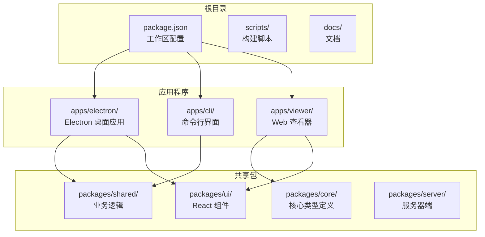
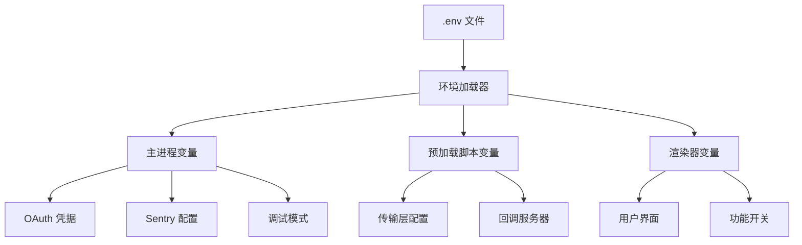
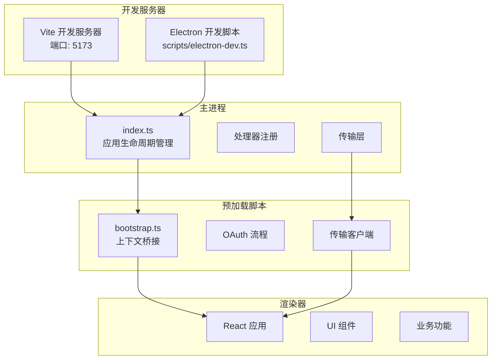
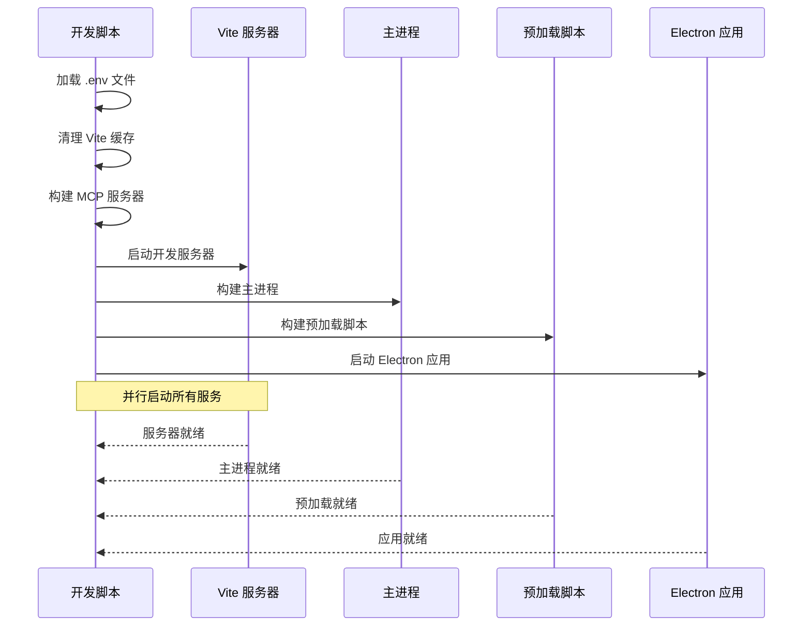
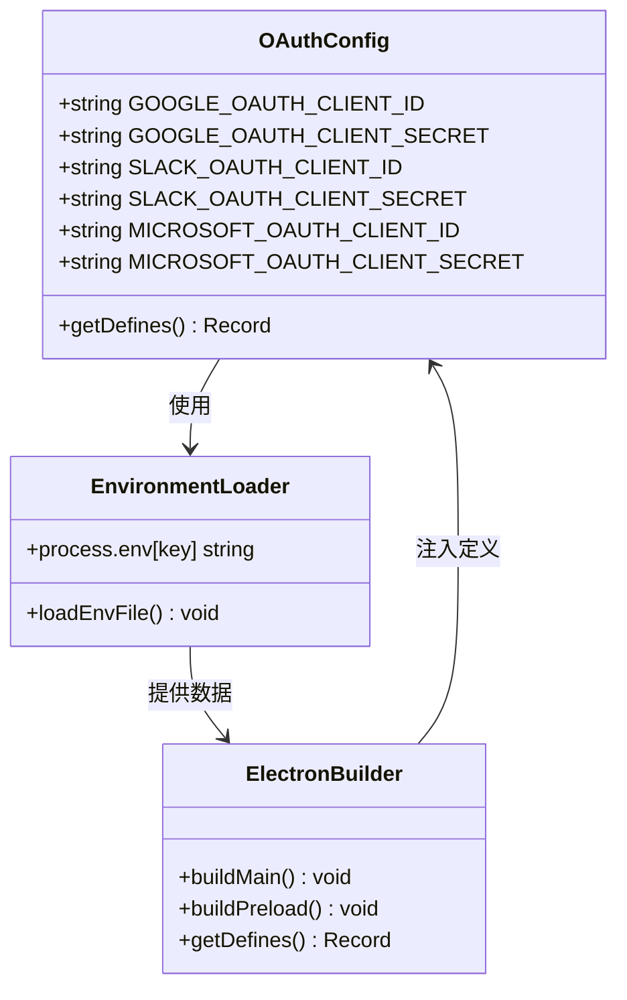
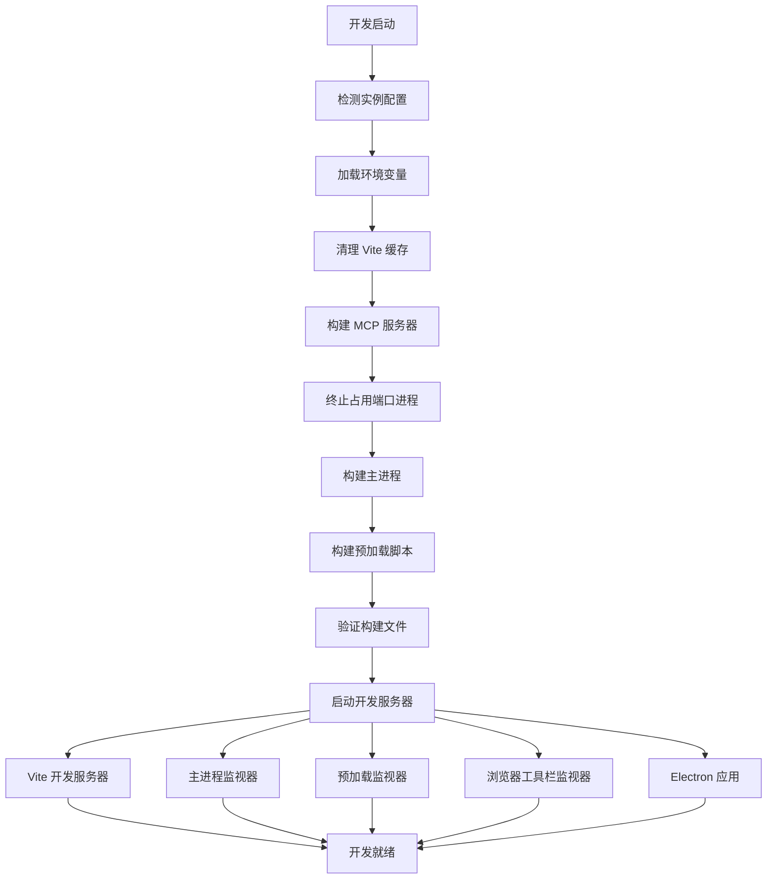
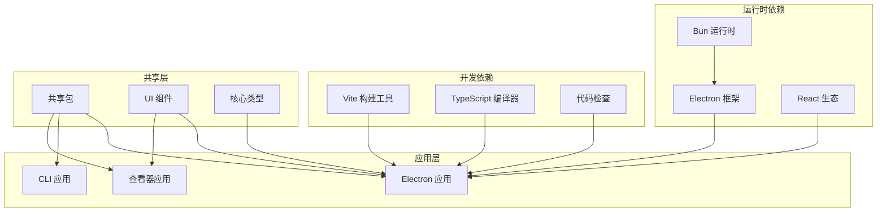
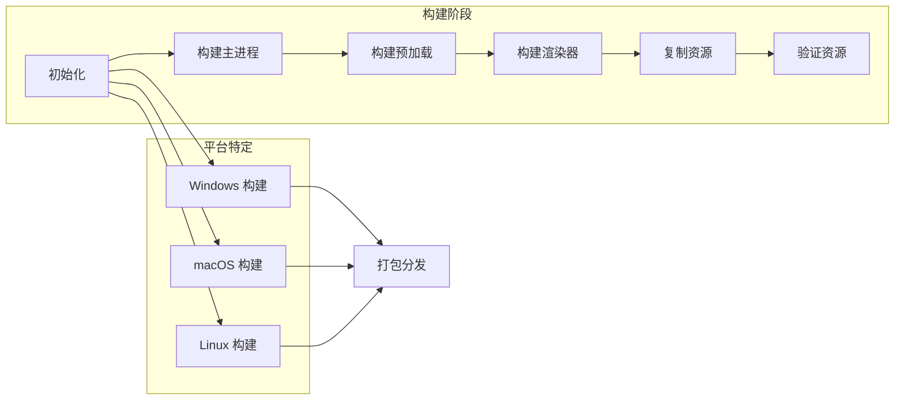
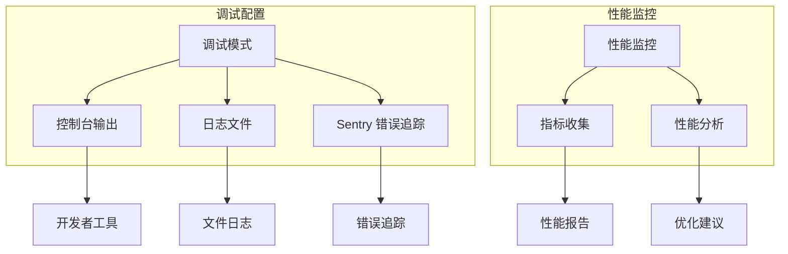
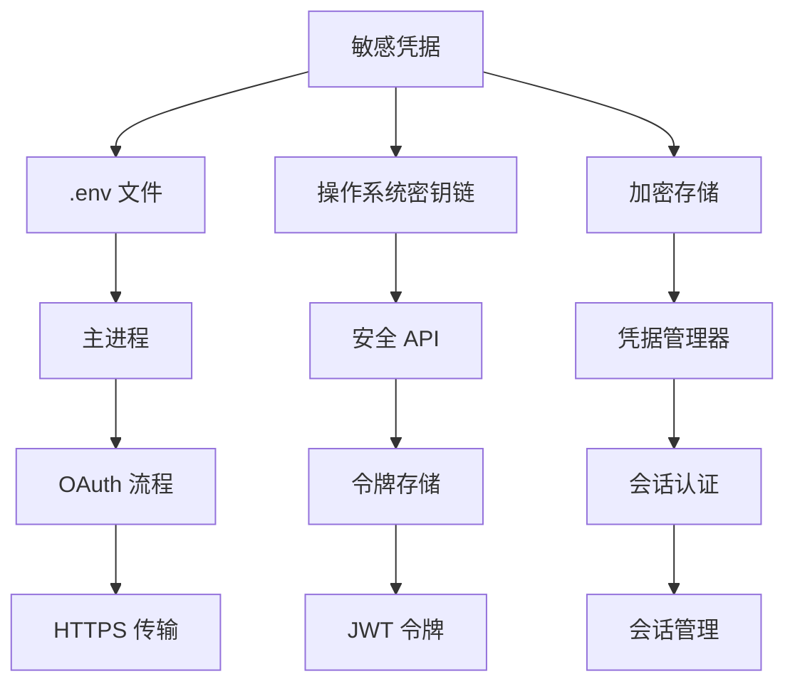

# 开发环境设置

<cite>
**本文档引用的文件**
- [package.json](file://package.json)
- [bunfig.toml](file://bunfig.toml)
- [apps/electron/package.json](file://apps/electron/package.json)
- [apps/cli/package.json](file://apps/cli/package.json)
- [apps/viewer/package.json](file://apps/viewer/package.json)
- [scripts/electron-dev.ts](file://scripts/electron-dev.ts)
- [apps/electron/src/main/index.ts](file://apps/electron/src/main/index.ts)
- [apps/electron/src/preload/bootstrap.ts](file://apps/electron/src/preload/bootstrap.ts)
- [apps/electron/vite.config.ts](file://apps/electron/vite.config.ts)
- [apps/electron/tsconfig.json](file://apps/electron/tsconfig.json)
- [CONTRIBUTING.md](file://CONTRIBUTING.md)
</cite>

## 目录

1. [简介](#简介)
2. [项目结构](#项目结构)
3. [核心组件](#核心组件)
4. [架构概览](#架构概览)
5. [详细组件分析](#详细组件分析)
6. [依赖关系分析](#依赖关系分析)
7. [性能考虑](#性能考虑)
8. [故障排除指南](#故障排除指南)
9. [结论](#结论)
10. [附录](#附录)

## 简介

Craft Agents 是一个基于 Electron 的桌面应用程序，提供了类似 Claude Code 的智能代理功能，专门用于 Craft 文档。该项目采用现代化的开发工具链，包括 Bun 运行时、Vite 构建工具和 TypeScript 类型系统。

本指南专注于为 Craft Agents 创建完整的开发环境设置文档，涵盖从工具安装到应用启动的全过程，特别关注 OAuth 凭据配置、热重载开发和调试配置等关键环节。

## 项目结构

Craft Agents 采用 Monorepo 结构，主要包含以下核心部分：



**图表来源**

- [package.json](file://package.json#L7-L11)
- [apps/electron/package.json](file://apps/electron/package.json#L1-L80)

**章节来源**

- [package.json](file://package.json#L1-L169)
- [apps/electron/package.json](file://apps/electron/package.json#L1-L80)

## 核心组件

### 开发工具链

项目使用以下核心开发工具：

| 工具       | 版本要求 | 用途                        |
| ---------- | -------- | --------------------------- |
| Bun        | 最新版本 | JavaScript 运行时和包管理器 |
| Node.js    | >=18.0.0 | 构建工具和 Electron 支持    |
| TypeScript | 5.x      | 类型安全和编译              |
| Vite       | 6.x      | 开发服务器和构建工具        |
| Electron   | 最新版本 | 桌面应用框架                |

### 环境变量系统

项目支持多种环境变量配置，主要用于 OAuth 凭据和应用行为控制：



**图表来源**

- [scripts/electron-dev.ts](file://scripts/electron-dev.ts#L86-L109)
- [apps/electron/src/main/index.ts](file://apps/electron/src/main/index.ts#L20-L59)

**章节来源**

- [scripts/electron-dev.ts](file://scripts/electron-dev.ts#L86-L109)
- [apps/electron/src/main/index.ts](file://apps/electron/src/main/index.ts#L20-L59)

## 架构概览

Craft Agents 的开发架构采用多进程模型，结合了现代前端开发的最佳实践：



**图表来源**

- [apps/electron/vite.config.ts](file://apps/electron/vite.config.ts#L70-L73)
- [scripts/electron-dev.ts](file://scripts/electron-dev.ts#L480-L580)
- [apps/electron/src/main/index.ts](file://apps/electron/src/main/index.ts#L295-L738)

## 详细组件分析

### 开发服务器启动流程

开发服务器启动采用并行处理策略，确保最佳的开发体验：



**图表来源**

- [scripts/electron-dev.ts](file://scripts/electron-dev.ts#L362-L580)

**章节来源**

- [scripts/electron-dev.ts](file://scripts/electron-dev.ts#L362-L580)

### OAuth 凭据配置

项目支持多种 OAuth 提供商的凭据配置，包括 Google、Slack 和 Microsoft：



**图表来源**

- [scripts/electron-dev.ts](file://scripts/electron-dev.ts#L228-L245)
- [apps/electron/package.json](file://apps/electron/package.json#L17-L37)

**章节来源**

- [scripts/electron-dev.ts](file://scripts/electron-dev.ts#L228-L245)
- [apps/electron/package.json](file://apps/electron/package.json#L17-L37)

### 热重载开发机制

项目实现了高效的热重载开发机制，支持多进程并行监听：



**图表来源**

- [scripts/electron-dev.ts](file://scripts/electron-dev.ts#L362-L580)

**章节来源**

- [scripts/electron-dev.ts](file://scripts/electron-dev.ts#L362-L580)

## 依赖关系分析

### 核心依赖层次



**图表来源**

- [package.json](file://package.json#L108-L167)
- [apps/electron/package.json](file://apps/electron/package.json#L39-L74)

**章节来源**

- [package.json](file://package.json#L108-L167)
- [apps/electron/package.json](file://apps/electron/package.json#L39-L74)

### 构建脚本依赖

项目使用复杂的构建脚本来管理多平台部署：



**图表来源**

- [apps/electron/package.json](file://apps/electron/package.json#L17-L37)

**章节来源**

- [apps/electron/package.json](file://apps/electron/package.json#L17-L37)

## 性能考虑

### 内存管理和进程优化

项目在开发环境中采用了多项性能优化策略：

1. **并行构建**: 使用 Promise.all() 并行构建多个组件
2. **增量编译**: esbuild 监视器提供快速的增量编译
3. **缓存清理**: 自动清理 Vite 缓存避免内存泄漏
4. **进程监控**: 智能端口检测和进程终止

### 调试和日志



**图表来源**

- [apps/electron/src/main/index.ts](file://apps/electron/src/main/index.ts#L105-L110)
- [apps/electron/vite.config.ts](file://apps/electron/vite.config.ts#L25-L34)

**章节来源**

- [apps/electron/src/main/index.ts](file://apps/electron/src/main/index.ts#L105-L110)
- [apps/electron/vite.config.ts](file://apps/electron/vite.config.ts#L25-L34)

## 故障排除指南

### 常见环境配置问题

#### 1. 端口冲突问题

**问题**: Vite 开发服务器无法启动，提示端口被占用

**解决方案**:

```bash
# 检查端口占用情况
lsof -ti:5173 | xargs kill -9 2>/dev/null

# 或者使用脚本提供的清理功能
bun run electron:dev
```

#### 2. OAuth 凭据配置错误

**问题**: OAuth 登录失败或凭据无效

**解决方案**:

1. 确保 .env 文件中包含正确的 OAuth 凭据
2. 重新启动开发服务器以加载新的环境变量
3. 检查 OAuth 回调 URL 配置

#### 3. Electron 应用启动失败

**问题**: Electron 应用无法正常启动

**解决方案**:

```bash
# 清理构建缓存
bun run electron:clean

# 重新构建所有组件
bun run electron:build

# 启动开发模式
bun run electron:dev
```

#### 4. 热重载不生效

**问题**: 修改代码后页面不自动刷新

**解决方案**:

1. 检查 Vite 服务器是否正常运行
2. 清理浏览器缓存
3. 重启开发服务器

**章节来源**

- [scripts/electron-dev.ts](file://scripts/electron-dev.ts#L111-L168)
- [scripts/electron-dev.ts](file://scripts/electron-dev.ts#L385-L387)

### 安全考虑

#### 凭据存储和管理

项目采用多层安全策略来保护敏感信息：



**图表来源**

- [apps/electron/src/main/index.ts](file://apps/electron/src/main/index.ts#L30-L58)
- [apps/electron/src/preload/bootstrap.ts](file://apps/electron/src/preload/bootstrap.ts#L167-L229)

#### 环境隔离

项目支持多实例开发环境，每个实例都有独立的配置：

| 环境变量              | 默认值         | 用途                |
| --------------------- | -------------- | ------------------- |
| CRAFT_VITE_PORT       | 5173           | Vite 开发服务器端口 |
| CRAFT_CONFIG_DIR      | ~/.craft-agent | 用户配置目录        |
| CRAFT_APP_NAME        | Craft Agents   | 应用程序名称        |
| CRAFT_DEEPLINK_SCHEME | craftagents    | 深链接协议          |

**章节来源**

- [scripts/electron-dev.ts](file://scripts/electron-dev.ts#L66-L84)
- [apps/electron/src/main/index.ts](file://apps/electron/src/main/index.ts#L167-L183)

## 结论

Craft Agents 的开发环境设置提供了完整的现代化开发体验，结合了以下关键特性：

1. **高效的开发工具链**: 基于 Bun 的快速运行时和 Vite 的热重载能力
2. **灵活的配置系统**: 支持多环境变量和 OAuth 凭据配置
3. **强大的调试功能**: 多进程架构和详细的日志记录
4. **安全的凭据管理**: 多层保护机制确保敏感信息的安全
5. **可扩展的架构**: 支持多实例开发和自定义配置

通过遵循本指南的设置步骤，开发者可以快速建立稳定可靠的开发环境，开始进行 Craft Agents 的开发工作。

## 附录

### 快速开始清单

- [ ] 安装 Bun 运行时
- [ ] 克隆仓库并安装依赖
- [ ] 配置 .env 文件
- [ ] 启动开发服务器
- [ ] 验证 OAuth 凭据
- [ ] 开始开发工作

### 相关资源

- **官方文档**: [CONTRIBUTING.md](file://CONTRIBUTING.md)
- **开发脚本**: [scripts/electron-dev.ts](file://scripts/electron-dev.ts)
- **配置文件**: [apps/electron/vite.config.ts](file://apps/electron/vite.config.ts)
- **类型定义**: [apps/electron/tsconfig.json](file://apps/electron/tsconfig.json)
