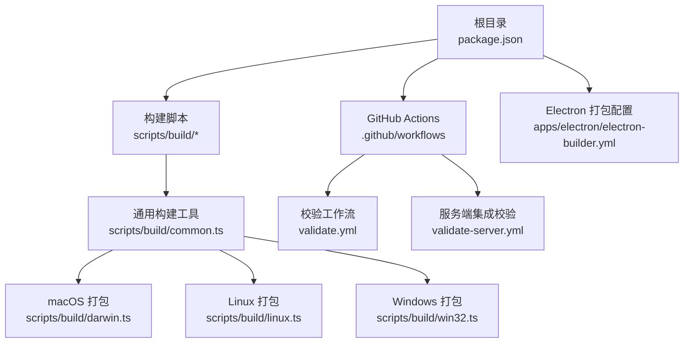
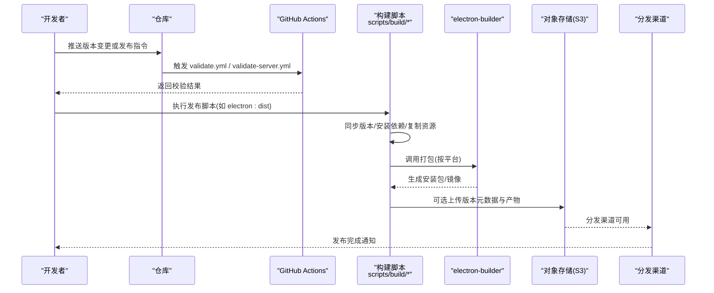
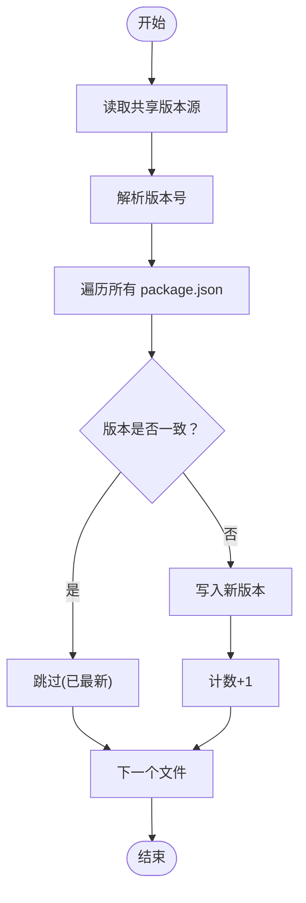
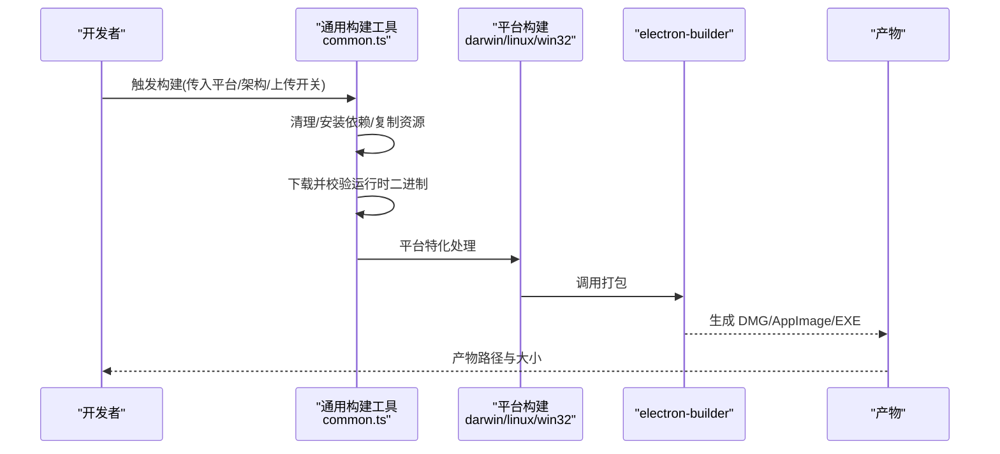
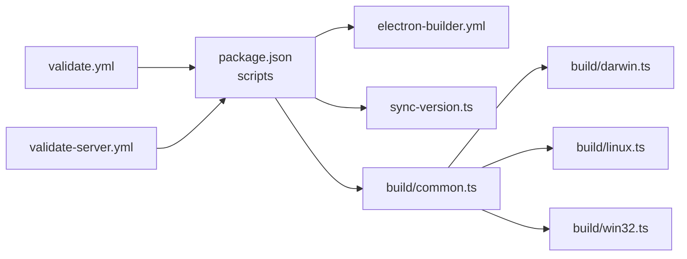

# 发布流程

<cite>
**本文引用的文件**
- [package.json](file://package.json)
- [.github/workflows/validate.yml](file://.github/workflows/validate.yml)
- [.github/workflows/validate-server.yml](file://.github/workflows/validate-server.yml)
- [scripts/sync-version.ts](file://scripts/sync-version.ts)
- [scripts/build/common.ts](file://scripts/build/common.ts)
- [scripts/build/darwin.ts](file://scripts/build/darwin.ts)
- [scripts/build/linux.ts](file://scripts/build/linux.ts)
- [scripts/build/win32.ts](file://scripts/build/win32.ts)
- [apps/electron/electron-builder.yml](file://apps/electron/electron-builder.yml)
</cite>

## 目录

1. [简介](#简介)
2. [项目结构](#项目结构)
3. [核心组件](#核心组件)
4. [架构总览](#架构总览)
5. [组件详解](#组件详解)
6. [依赖关系分析](#依赖关系分析)
7. [性能与可靠性考量](#性能与可靠性考量)
8. [故障排查指南](#故障排查指南)
9. [结论](#结论)
10. [附录](#附录)

## 简介

本文件面向 Craft Agents 的发布流程，系统化阐述版本管理策略、发布标签规范、版本同步机制、发布前检查清单、自动化构建与分发流程、发布渠道（正式/测试/预发布）处理方式、发布后监控与回滚策略，以及质量保证与风险控制措施。内容兼顾初学者可读性与资深开发者的深度细节，并结合仓库中实际脚本与工作流进行说明。

## 项目结构

仓库采用 Monorepo 结构，包含多应用与多包，统一通过根级包管理与脚本驱动发布。关键发布相关目录与文件如下：

- 根脚本与发布入口：根 package.json 中定义了发布与构建脚本，如 electron 打包、服务器构建等。
- GitHub Actions：在 .github/workflows 下定义了校验与集成测试工作流。
- 构建工具链：scripts/build 下提供跨平台构建与资源准备逻辑，包含通用工具与各平台特化逻辑。
- 平台打包配置：apps/electron/electron-builder.yml 提供 Electron 应用打包配置。
- 版本同步：scripts/sync-version.ts 负责从共享版本源同步到所有 package.json。

图表来源

- [package.json](file://package.json#L12-L71)
- [.github/workflows/validate.yml](file://.github/workflows/validate.yml#L1-L35)
- [.github/workflows/validate-server.yml](file://.github/workflows/validate-server.yml#L1-L27)
- [scripts/build/common.ts](file://scripts/build/common.ts#L1-L659)
- [scripts/build/darwin.ts](file://scripts/build/darwin.ts#L1-L98)
- [scripts/build/linux.ts](file://scripts/build/linux.ts#L1-L81)
- [scripts/build/win32.ts](file://scripts/build/win32.ts#L1-L288)
- [apps/electron/electron-builder.yml](file://apps/electron/electron-builder.yml)

章节来源

- [package.json](file://package.json#L1-L169)
- [.github/workflows/validate.yml](file://.github/workflows/validate.yml#L1-L35)
- [.github/workflows/validate-server.yml](file://.github/workflows/validate-server.yml#L1-L27)
- [scripts/build/common.ts](file://scripts/build/common.ts#L1-L659)
- [scripts/build/darwin.ts](file://scripts/build/darwin.ts#L1-L98)
- [scripts/build/linux.ts](file://scripts/build/linux.ts#L1-L81)
- [scripts/build/win32.ts](file://scripts/build/win32.ts#L1-L288)
- [apps/electron/electron-builder.yml](file://apps/electron/electron-builder.yml)

## 核心组件

- 版本同步器：从共享版本源读取版本并同步至所有 package.json，确保多包一致性。
- 构建管线：跨平台通用构建工具 + 平台特化逻辑，负责下载运行时二进制、复制资源、打包 Electron 应用。
- 打包配置：基于 electron-builder 的配置文件，控制签名、上架与产物命名。
- CI 校验：Pull Request 与分支推送触发的基础校验；另有助集成测试的工作流。
- 发布脚本：根 package.json 中的发布相关脚本，如 electron 打包、服务器构建等。

章节来源

- [scripts/sync-version.ts](file://scripts/sync-version.ts#L1-L89)
- [scripts/build/common.ts](file://scripts/build/common.ts#L1-L659)
- [apps/electron/electron-builder.yml](file://apps/electron/electron-builder.yml)
- [.github/workflows/validate.yml](file://.github/workflows/validate.yml#L1-L35)
- [.github/workflows/validate-server.yml](file://.github/workflows/validate-server.yml#L1-L27)
- [package.json](file://package.json#L12-L71)

## 架构总览

下图展示了从版本确定到产物发布的整体流程，涵盖版本同步、CI 校验、构建与打包、上传与分发等环节。

图表来源

- [.github/workflows/validate.yml](file://.github/workflows/validate.yml#L1-L35)
- [.github/workflows/validate-server.yml](file://.github/workflows/validate-server.yml#L1-L27)
- [scripts/build/common.ts](file://scripts/build/common.ts#L568-L623)
- [scripts/build/darwin.ts](file://scripts/build/darwin.ts#L34-L97)
- [scripts/build/linux.ts](file://scripts/build/linux.ts#L34-L80)
- [scripts/build/win32.ts](file://scripts/build/win32.ts#L213-L287)
- [apps/electron/electron-builder.yml](file://apps/electron/electron-builder.yml)

## 组件详解

### 版本管理与同步

- 版本源：共享版本源文件中导出版本常量，作为全仓库唯一真实来源。
- 同步策略：遍历根、apps、packages 下的 package.json，将版本更新为一致值；跳过已同步项以减少冗余。
- 运行方式：通过脚本入口执行，输出更新统计，便于审计。

图表来源

- [scripts/sync-version.ts](file://scripts/sync-version.ts#L17-L78)

章节来源

- [scripts/sync-version.ts](file://scripts/sync-version.ts#L1-L89)

### 发布前检查清单

- 代码质量：类型检查、Lint、单元测试与共享模块测试。
- 集成验证：服务端集成校验工作流，使用 API 密钥进行端到端验证。
- 平台兼容性：在本地或 CI 上分别验证 macOS、Windows、Linux 产物完整性。
- 安全扫描：建议在 CI 中增加依赖漏洞扫描与许可证合规检查（当前仓库未内置该步骤，可在 CI 中扩展）。

章节来源

- [package.json](file://package.json#L12-L35)
- [.github/workflows/validate.yml](file://.github/workflows/validate.yml#L1-L35)
- [.github/workflows/validate-server.yml](file://.github/workflows/validate-server.yml#L1-L27)

### 自动化构建与打包

- 通用构建流程
  - 清理旧产物、安装依赖（Windows 使用特定链接器模式避免符号链接问题）、复制 SDK 与拦截器、构建 MCP 服务器、构建 Electron 主/预加载/渲染进程、生成清单与可选上传。
  - 跨平台下载并校验运行时二进制（Bun、uv），确保产物可复现且安全。
- 平台特化
  - macOS：调用 electron-builder 打包 DMG/ZIP，自动识别签名与公证凭据，校验 SDK 是否被打包进 .app。
  - Linux：打包 AppImage，重命名为标准命名，校验 SDK。
  - Windows：针对文件锁定与杀进程问题设计重试与清理策略，构建主进程与拦截器，打包 EXE，校验 SDK。

图表来源

- [scripts/build/common.ts](file://scripts/build/common.ts#L274-L311)
- [scripts/build/common.ts](file://scripts/build/common.ts#L508-L546)
- [scripts/build/common.ts](file://scripts/build/common.ts#L578-L623)
- [scripts/build/darwin.ts](file://scripts/build/darwin.ts#L34-L97)
- [scripts/build/linux.ts](file://scripts/build/linux.ts#L34-L80)
- [scripts/build/win32.ts](file://scripts/build/win32.ts#L213-L287)

章节来源

- [scripts/build/common.ts](file://scripts/build/common.ts#L1-L659)
- [scripts/build/darwin.ts](file://scripts/build/darwin.ts#L1-L98)
- [scripts/build/linux.ts](file://scripts/build/linux.ts#L1-L81)
- [scripts/build/win32.ts](file://scripts/build/win32.ts#L1-L288)

### 发布渠道管理

- 正式版本：遵循语义化版本，使用稳定的标签与发布说明，产物上传至分发渠道。
- 测试版本：可通过 CI 参数或分支策略触发，产物命名区分测试通道。
- 预发布版本：在标签中加入预发布标识，仅用于内部验证，不对外公开分发。
- 上传与分发：通用构建工具支持上传到对象存储，配合分发策略实现灰度与回滚。

章节来源

- [scripts/build/common.ts](file://scripts/build/common.ts#L597-L623)

### 发布后监控与回滚

- 监控：建议在分发渠道与日志系统中建立指标（安装成功率、崩溃率、首次启动失败率）。
- 回滚：若发现重大问题，可回退至上一稳定版本；对象存储中保留历史版本以便快速回滚。
- 建议：在 CI 中增加健康检查与自动告警，结合发布说明与变更日志进行追踪。

（本节为通用实践建议，不直接分析具体文件）

### 质量保证与风险控制

- 依赖校验：下载运行时二进制时进行 SHA256 校验，防止供应链攻击。
- 平台适配：针对 Windows 文件锁定问题设计重试与清理策略，提升构建稳定性。
- 资源完整性：打包后严格校验关键资源（如 SDK）是否存在且大小合理。
- 凭证安全：签名与公证凭据通过环境变量注入，避免硬编码。

章节来源

- [scripts/build/common.ts](file://scripts/build/common.ts#L95-L100)
- [scripts/build/common.ts](file://scripts/build/common.ts#L106-L174)
- [scripts/build/common.ts](file://scripts/build/common.ts#L197-L269)
- [scripts/build/win32.ts](file://scripts/build/win32.ts#L86-L110)
- [scripts/build/darwin.ts](file://scripts/build/darwin.ts#L13-L29)
- [scripts/build/linux.ts](file://scripts/build/linux.ts#L13-L29)
- [scripts/build/win32.ts](file://scripts/build/win32.ts#L16-L32)

## 依赖关系分析

- 根脚本依赖：package.json 中的脚本命令驱动构建与打包，最终调用 electron-builder 与上传脚本。
- 构建工具依赖：common.ts 作为核心工具集，被各平台脚本复用；平台脚本进一步封装打包细节。
- CI 依赖：validate.yml 与 validate-server.yml 依赖根依赖安装与脚本命令。

图表来源

- [package.json](file://package.json#L12-L71)
- [scripts/sync-version.ts](file://scripts/sync-version.ts#L1-L89)
- [scripts/build/common.ts](file://scripts/build/common.ts#L1-L659)
- [scripts/build/darwin.ts](file://scripts/build/darwin.ts#L1-L98)
- [scripts/build/linux.ts](file://scripts/build/linux.ts#L1-L81)
- [scripts/build/win32.ts](file://scripts/build/win32.ts#L1-L288)
- [.github/workflows/validate.yml](file://.github/workflows/validate.yml#L1-L35)
- [.github/workflows/validate-server.yml](file://.github/workflows/validate-server.yml#L1-L27)

章节来源

- [package.json](file://package.json#L12-L71)
- [scripts/build/common.ts](file://scripts/build/common.ts#L1-L659)

## 性能与可靠性考量

- 依赖安装优化：Windows 使用“提升链接器”模式，避免符号链接导致的构建器无法遍历问题，提高稳定性。
- 二进制下载与校验：通过外部校验文件进行完整性校验，降低被篡改风险。
- 平台打包策略：macOS 与 Linux 产物命名标准化，Windows 打包增加重试与清理，减少偶发失败。
- 产物体积：通过仅复制目标平台的原生二进制（如 koffi）减小体积，避免不必要的打包。

章节来源

- [scripts/build/common.ts](file://scripts/build/common.ts#L297-L311)
- [scripts/build/common.ts](file://scripts/build/common.ts#L106-L174)
- [scripts/build/common.ts](file://scripts/build/common.ts#L197-L269)
- [scripts/build/win32.ts](file://scripts/build/win32.ts#L213-L287)

## 故障排查指南

- 产物缺失
  - macOS：确认 DMG/ZIP 是否生成，必要时检查签名与公证凭据。
  - Linux：确认 AppImage 是否按标准命名生成并重命名为统一格式。
  - Windows：确认 EXE 是否生成，必要时清理锁定进程后重试。
- SDK 未打包
  - 检查复制与校验步骤是否执行成功，确认 SDK 文件大小符合预期。
- 上传失败
  - 检查对象存储凭据是否完整，确认上传脚本参数正确。
- CI 失败
  - 查看校验工作流日志，优先修复类型检查、Lint 与测试失败项。

章节来源

- [scripts/build/darwin.ts](file://scripts/build/darwin.ts#L74-L97)
- [scripts/build/linux.ts](file://scripts/build/linux.ts#L56-L80)
- [scripts/build/win32.ts](file://scripts/build/win32.ts#L270-L287)
- [scripts/build/common.ts](file://scripts/build/common.ts#L339-L359)
- [.github/workflows/validate.yml](file://.github/workflows/validate.yml#L33-L34)

## 结论

本发布流程以版本同步为核心，结合 CI 校验、跨平台构建与打包、以及可选的上传与分发机制，形成闭环的质量保障体系。通过严格的资源完整性校验与平台特化处理，显著提升了发布稳定性与安全性。建议在现有基础上补充依赖漏洞扫描与健康监控，以进一步完善发布治理。

## 附录

- 发布脚本入口参考
  - Electron 打包：参见根脚本中的打包命令与 electron-builder 配置。
  - 服务器构建：参见根脚本中的服务器构建命令。
- 版本同步脚本：参见版本同步脚本入口与实现。
- 平台打包配置：参见 electron-builder 配置文件。

章节来源

- [package.json](file://package.json#L12-L71)
- [scripts/sync-version.ts](file://scripts/sync-version.ts#L1-L89)
- [apps/electron/electron-builder.yml](file://apps/electron/electron-builder.yml)
