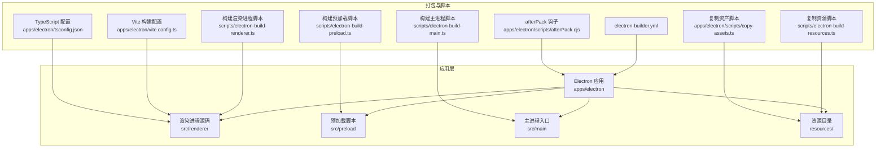
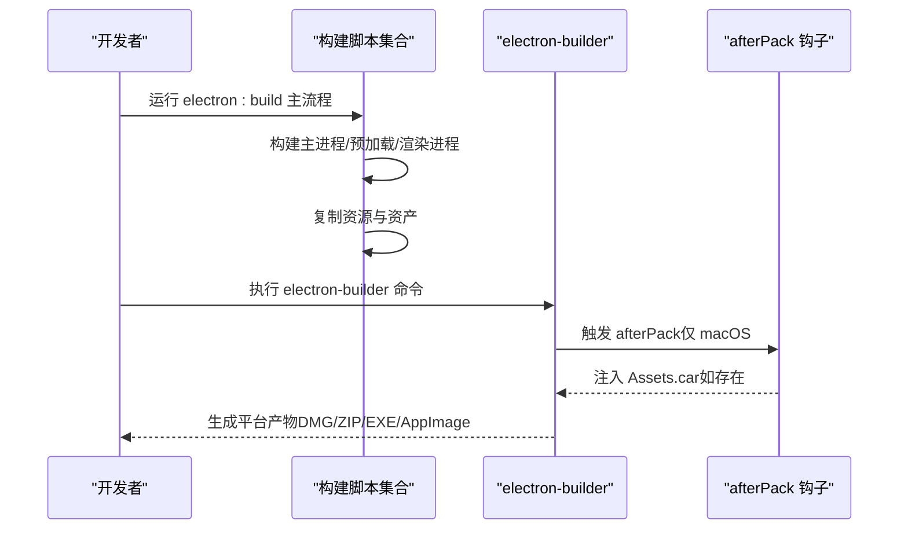
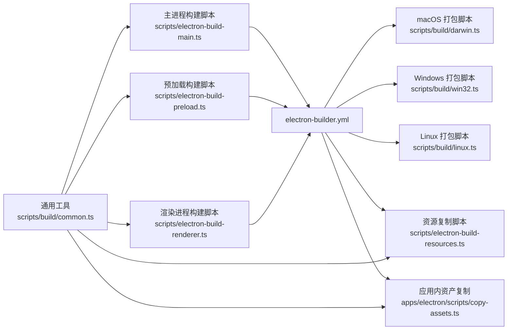

# 打包配置

<cite>
**本文引用的文件**
- [apps/electron/electron-builder.yml](file://apps/electron/electron-builder.yml)
- [package.json](file://package.json)
- [scripts/build/common.ts](file://scripts/build/common.ts)
- [scripts/build/darwin.ts](file://scripts/build/darwin.ts)
- [scripts/build/linux.ts](file://scripts/build/linux.ts)
- [scripts/build/win32.ts](file://scripts/build/win32.ts)
- [scripts/electron-build-main.ts](file://scripts/electron-build-main.ts)
- [scripts/electron-build-preload.ts](file://scripts/electron-build-preload.ts)
- [scripts/electron-build-renderer.ts](file://scripts/electron-build-renderer.ts)
- [scripts/electron-build-resources.ts](file://scripts/electron-build-resources.ts)
- [apps/electron/scripts/copy-assets.ts](file://apps/electron/scripts/copy-assets.ts)
- [apps/electron/scripts/afterPack.cjs](file://apps/electron/scripts/afterPack.cjs)
- [apps/electron/vite.config.ts](file://apps/electron/vite.config.ts)
- [apps/electron/tsconfig.json](file://apps/electron/tsconfig.json)
</cite>

## 目录

1. [简介](#简介)
2. [项目结构](#项目结构)
3. [核心组件](#核心组件)
4. [架构总览](#架构总览)
5. [详细组件分析](#详细组件分析)
6. [依赖关系分析](#依赖关系分析)
7. [性能考量](#性能考量)
8. [故障排查指南](#故障排查指南)
9. [结论](#结论)
10. [附录](#附录)

## 简介

本文件系统性梳理 Craft Agents 项目的 Electron 应用打包配置与流程，围绕 electron-builder.yml 的各项参数进行逐项解读，并结合配套的构建脚本，说明主进程、预加载脚本与渲染进程的构建顺序与产物组织方式；阐述资源处理（图标、许可证、额外文件）、签名与发布策略、以及跨平台差异与最佳实践。文档同时提供常见问题的诊断与解决建议，帮助初学者快速上手并为有经验的开发者提供深入的技术细节。

## 项目结构

该工程采用 Monorepo 结构，Electron 应用位于 apps/electron，打包配置集中在 apps/electron/electron-builder.yml，配套构建脚本位于根目录 scripts 下，分别负责主进程、预加载、渲染进程与资源复制，以及平台特定的打包逻辑。

图表来源

- [apps/electron/electron-builder.yml](file://apps/electron/electron-builder.yml#L1-L220)
- [scripts/electron-build-main.ts](file://scripts/electron-build-main.ts#L1-L327)
- [scripts/electron-build-preload.ts](file://scripts/electron-build-preload.ts#L1-L146)
- [scripts/electron-build-renderer.ts](file://scripts/electron-build-renderer.ts#L1-L28)
- [scripts/electron-build-resources.ts](file://scripts/electron-build-resources.ts#L1-L20)
- [apps/electron/scripts/copy-assets.ts](file://apps/electron/scripts/copy-assets.ts#L1-L34)
- [apps/electron/scripts/afterPack.cjs](file://apps/electron/scripts/afterPack.cjs#L1-L53)
- [apps/electron/vite.config.ts](file://apps/electron/vite.config.ts#L1-L75)
- [apps/electron/tsconfig.json](file://apps/electron/tsconfig.json#L1-L33)

章节来源

- [apps/electron/electron-builder.yml](file://apps/electron/electron-builder.yml#L1-L220)
- [package.json](file://package.json#L1-L169)

## 核心组件

- 应用元数据与版本：通过 appId、productName、electronVersion 等字段定义应用标识与运行时版本。
- 构建目录与资源：directories.output 指定产物目录，directories.buildResources 指定构建期资源根目录。
- 文件包含与排除：files 列表精确控制打包内容，使用通配符与取反规则实现精细过滤。
- 额外资源：extraResources 用于绕过 node_modules 自动排除限制，按平台注入 SDK 及二进制工具。
- 发布与更新：publish.provider 与 url 指定通用发布源，供 electron-updater 获取更新清单。
- 平台目标与命名：各平台 target.arch 与 artifactName 定义产物命名规范。
- 签名与加固：macOS 使用 hardenedRuntime、entitlements、entitlementsInherit，可选 notarize；Windows 使用 NSIS 与 per-machine/per-user 行为；Linux 使用 AppImage。
- 资源与图标：macOS 使用 icns 图标与 afterPack 钩子写入 Assets.car；Windows/Linux 分别使用 ico/png。
- 依赖与二进制：通过 scripts/build/\* 与 electron-builder.yml 协作，将 SDK、uv、bun、codex、copilot 等按平台分发。

章节来源

- [apps/electron/electron-builder.yml](file://apps/electron/electron-builder.yml#L1-L220)

## 架构总览

下图展示了从构建到打包的关键路径：先由独立脚本完成主进程、预加载、渲染进程与资源的构建与复制，再交由 electron-builder.yml 统一打包，最后在 macOS 上通过 afterPack 钩子注入 Liquid Glass 图标。

图表来源

- [package.json](file://package.json#L54-L57)
- [scripts/electron-build-main.ts](file://scripts/electron-build-main.ts#L256-L324)
- [scripts/electron-build-preload.ts](file://scripts/electron-build-preload.ts#L104-L143)
- [scripts/electron-build-renderer.ts](file://scripts/electron-build-renderer.ts#L12-L27)
- [scripts/electron-build-resources.ts](file://scripts/electron-build-resources.ts#L11-L19)
- [apps/electron/scripts/afterPack.cjs](file://apps/electron/scripts/afterPack.cjs#L21-L52)

## 详细组件分析

### electron-builder.yml 参数详解与最佳实践

- 应用元数据与版本
  - appId/productName/copyright：定义应用标识、显示名称与版权信息。
  - electronVersion：锁定 Electron 版本，确保一致性。
  - 参考路径：[apps/electron/electron-builder.yml](file://apps/electron/electron-builder.yml#L1-L6)

- 目录与文件策略
  - directories.output：产物输出目录。
  - directories.buildResources：构建期资源根目录，配合 files 中的 dist/\*_/_ 实现统一打包。
  - files：白名单式包含与黑名单式排除，避免打包 node_modules，同时显式包含 MCP 服务器、共享拦截器、Python 工具与平台二进制等。
  - extraMetadata.main：指定打包后运行时使用的主进程入口。
  - 参考路径：
    - [apps/electron/electron-builder.yml](file://apps/electron/electron-builder.yml#L10-L12)
    - [apps/electron/electron-builder.yml](file://apps/electron/electron-builder.yml#L14-L62)
    - [apps/electron/electron-builder.yml](file://apps/electron/electron-builder.yml#L70-L72)

- 发布与自动更新
  - publish.provider/generic/url：通用发布源，electron-updater 从该 URL 获取更新清单。
  - 参考路径：[apps/electron/electron-builder.yml](file://apps/electron/electron-builder.yml#L74-L76)

- 打包格式与禁用 ASAR
  - asar:false：禁用 ASAR 以减少解压开销与启动延迟。
  - 参考路径：[apps/electron/electron-builder.yml](file://apps/electron/electron-builder.yml#L78-L79)

- macOS 平台配置
  - category/icon/extendInfo：应用分类与图标配置，extendInfo 指定 CFBundleIconName 以支持 macOS 26+ Liquid Glass。
  - hardenedRuntime/entitlements/entitlementsInherit：启用安全加固与权限声明。
  - extraResources：将 SDK 按平台注入 app/node_modules 下，并通过 filter 排除非目标平台的 ripgrep 二进制。
  - files：排除其他平台的 vendor 与 resources/bin。
  - artifactName：统一产物命名（Craft-Agent-${arch}.${ext}）。
  - notarize：注释掉的可选步骤，需设置 APPLE\_\* 环境变量。
  - 参考路径：
    - [apps/electron/electron-builder.yml](file://apps/electron/electron-builder.yml#L81-L123)
    - [apps/electron/electron-builder.yml](file://apps/electron/electron-builder.yml#L101-L116)
    - [apps/electron/electron-builder.yml](file://apps/electron/electron-builder.yml#L117-L123)

- DMG 定制
  - artifactName/background/iconSize/title/contents/window：自定义安装镜像窗口尺寸、背景、图标大小与“打开 Applications”的快捷方式位置。
  - 参考路径：[apps/electron/electron-builder.yml](file://apps/electron/electron-builder.yml#L124-L143)

- Windows 平台配置
  - icon/target/nsis：使用 NSIS 安装器，perMachine=false 实现用户级安装，deleteAppDataOnUninstall 清理卸载残留。
  - files：排除其他平台的 vendor 与 resources/bin。
  - extraResources：将 SDK、bun、codex、copilot 与 win32-x64 的二进制作为额外资源复制，规避 Windows 文件锁定导致的 EBUSY 错误。
  - 参考路径：
    - [apps/electron/electron-builder.yml](file://apps/electron/electron-builder.yml#L144-L194)
    - [apps/electron/electron-builder.yml](file://apps/electron/electron-builder.yml#L170-L186)

- Linux 平台配置
  - icon/category/maintainer/target：AppImage 目标，maintainer 信息。
  - extraResources：注入 SDK 并过滤非目标平台的 ripgrep。
  - files：排除其他平台的 vendor 与 resources/bin。
  - 参考路径：
    - [apps/electron/electron-builder.yml](file://apps/electron/electron-builder.yml#L195-L220)

- afterPack 钩子（macOS）
  - 在打包完成后将预编译的 Assets.car 写入 .app/Contents/Resources，以启用 macOS 26+ Liquid Glass 图标；若不存在则回退到 icon.icns。
  - 参考路径：[apps/electron/scripts/afterPack.cjs](file://apps/electron/scripts/afterPack.cjs#L21-L52)

章节来源

- [apps/electron/electron-builder.yml](file://apps/electron/electron-builder.yml#L1-L220)
- [apps/electron/scripts/afterPack.cjs](file://apps/electron/scripts/afterPack.cjs#L1-L53)

### 打包脚本与构建流程

- 主进程构建
  - 脚本：scripts/electron-build-main.ts
  - 功能：加载 .env，注入 OAuth/Sentry 等构建期常量，构建主进程、会话 MCP 服务器、Pi 代理服务器与统一网络拦截器（CJS），并进行语法验证。
  - 关键点：主进程与拦截器均以 CJS 输出，便于 Electron/Node 环境直接执行。
  - 参考路径：
    - [scripts/electron-build-main.ts](file://scripts/electron-build-main.ts#L21-L62)
    - [scripts/electron-build-main.ts](file://scripts/electron-build-main.ts#L135-L166)
    - [scripts/electron-build-main.ts](file://scripts/electron-build-main.ts#L168-L205)
    - [scripts/electron-build-main.ts](file://scripts/electron-build-main.ts#L256-L324)

- 预加载脚本构建
  - 脚本：scripts/electron-build-preload.ts
  - 功能：并行构建 bootstrap 与浏览器工具栏两个预加载入口，输出 dist/bootstrap-preload.cjs 与 dist/browser-toolbar-preload.cjs，并进行稳定性与语法校验。
  - 参考路径：[scripts/electron-build-preload.ts](file://scripts/electron-build-preload.ts#L85-L102)

- 渲染进程构建
  - 脚本：scripts/electron-build-renderer.ts
  - 功能：调用 Vite 构建渲染进程，设置最大堆内存，清理旧 dist/renderer。
  - 参考路径：[scripts/electron-build-renderer.ts](file://scripts/electron-build-renderer.ts#L12-L27)

- 资源复制
  - 脚本：scripts/electron-build-resources.ts
  - 功能：将 resources/ 复制到 dist/resources/，配合 electron-builder.yml 的 directories.buildResources 与 files 策略统一打包。
  - 参考路径：[scripts/electron-build-resources.ts](file://scripts/electron-build-resources.ts#L11-L19)

- 资产复制（应用内）
  - 脚本：apps/electron/scripts/copy-assets.ts
  - 功能：在应用启动时设置捆绑资源根目录，将 resources/ 复制到 dist/resources/，并复制 PowerShell 解析脚本（Windows 可选）。
  - 参考路径：[apps/electron/scripts/copy-assets.ts](file://apps/electron/scripts/copy-assets.ts#L17-L33)

- Vite 构建配置
  - 配置：apps/electron/vite.config.ts
  - 功能：启用 React/Tailwind 插件，配置多页面输入（主界面、Playground、浏览器工具栏、空状态页），设置 base 与输出目录，开启 sourcemap。
  - 参考路径：[apps/electron/vite.config.ts](file://apps/electron/vite.config.ts#L11-L74)

- TypeScript 配置（渲染侧）
  - 配置：apps/electron/tsconfig.json
  - 功能：设置 JSX、模块解析、路径别名与严格模式，避免多份 React 引用导致的问题。
  - 参考路径：[apps/electron/tsconfig.json](file://apps/electron/tsconfig.json#L1-L33)

章节来源

- [scripts/electron-build-main.ts](file://scripts/electron-build-main.ts#L1-L327)
- [scripts/electron-build-preload.ts](file://scripts/electron-build-preload.ts#L1-L146)
- [scripts/electron-build-renderer.ts](file://scripts/electron-build-renderer.ts#L1-L28)
- [scripts/electron-build-resources.ts](file://scripts/electron-build-resources.ts#L1-L20)
- [apps/electron/scripts/copy-assets.ts](file://apps/electron/scripts/copy-assets.ts#L1-L34)
- [apps/electron/vite.config.ts](file://apps/electron/vite.config.ts#L1-L75)
- [apps/electron/tsconfig.json](file://apps/electron/tsconfig.json#L1-L33)

### 平台特定打包逻辑

- macOS
  - 脚本：scripts/build/darwin.ts
  - 功能：设置 CSC 自动发现、可选签名与公证；调用 electron-builder 打包；验证 .app 中 SDK 是否正确打包；输出 DMG/ZIP 并报告体积。
  - 参考路径：
    - [scripts/build/darwin.ts](file://scripts/build/darwin.ts#L34-L97)

- Windows
  - 脚本：scripts/build/win32.ts
  - 功能：针对 Windows Defender 与文件锁定问题，提供进程终止、目录删除重试、构建重试等健壮化措施；构建主进程（含 OAuth 注入）、拦截器、预加载与渲染进程；打包 EXE 并验证 SDK。
  - 参考路径：
    - [scripts/build/win32.ts](file://scripts/build/win32.ts#L71-L110)
    - [scripts/build/win32.ts](file://scripts/build/win32.ts#L115-L146)
    - [scripts/build/win32.ts](file://scripts/build/win32.ts#L151-L208)
    - [scripts/build/win32.ts](file://scripts/build/win32.ts#L213-L287)

- Linux
  - 脚本：scripts/build/linux.ts
  - 功能：调用 electron-builder 打包 AppImage；重命名产物为标准命名；验证 SDK。
  - 参考路径：
    - [scripts/build/linux.ts](file://scripts/build/linux.ts#L34-L80)

- 通用工具与二进制准备
  - 脚本：scripts/build/common.ts
  - 功能：下载并校验 Bun/uv 二进制，复制 SDK、拦截器、会话 MCP 服务器、Pi 代理服务器，构建 MCP 服务器，创建上传清单，上传到 S3，加载 .env 等。
  - 参考路径：
    - [scripts/build/common.ts](file://scripts/build/common.ts#L106-L174)
    - [scripts/build/common.ts](file://scripts/build/common.ts#L197-L269)
    - [scripts/build/common.ts](file://scripts/build/common.ts#L316-L334)
    - [scripts/build/common.ts](file://scripts/build/common.ts#L403-L414)
    - [scripts/build/common.ts](file://scripts/build/common.ts#L508-L546)
    - [scripts/build/common.ts](file://scripts/build/common.ts#L578-L592)
    - [scripts/build/common.ts](file://scripts/build/common.ts#L597-L623)

章节来源

- [scripts/build/darwin.ts](file://scripts/build/darwin.ts#L1-L98)
- [scripts/build/win32.ts](file://scripts/build/win32.ts#L1-L288)
- [scripts/build/linux.ts](file://scripts/build/linux.ts#L1-L81)
- [scripts/build/common.ts](file://scripts/build/common.ts#L1-L659)

### 资源处理、图标生成与许可证

- 资源目录与打包策略
  - resources/ 作为构建期资源根目录，通过 files 与 extraResources 精细控制包含与排除，确保 dist/\*_/_ 能覆盖已复制的资源。
  - 参考路径：[apps/electron/electron-builder.yml](file://apps/electron/electron-builder.yml#L10-L25)

- 图标与 Liquid Glass（macOS）
  - 使用 icns 作为默认图标；afterPack 钩子尝试将 Assets.car 写入 .app/Contents/Resources，以启用 macOS 26+ Liquid Glass；若失败则回退到 icon.icns。
  - 参考路径：
    - [apps/electron/electron-builder.yml](file://apps/electron/electron-builder.yml#L83-L87)
    - [apps/electron/scripts/afterPack.cjs](file://apps/electron/scripts/afterPack.cjs#L21-L52)

- 许可证与第三方文件
  - 仓库未在 electron-builder.yml 中显式声明许可证文件；通常通过 package.json 或资源目录中的 LICENSE 文件参与打包。建议在 resources/ 中放置许可证文本并在 files 中纳入。
  - 参考路径：[package.json](file://package.json#L108-L167)

- 额外文件管理
  - Python 工具与平台包装器：resources/scripts/\*_/_ 与 resources/bin/\*（Unix/Windows 双端）通过 files 显式包含。
  - 平台二进制：uv（按平台）、bun（按平台）、codex/copilot（按平台）通过 files 与 extraResources 混合策略处理。
  - 参考路径：
    - [apps/electron/electron-builder.yml](file://apps/electron/electron-builder.yml#L31-L60)

章节来源

- [apps/electron/electron-builder.yml](file://apps/electron/electron-builder.yml#L10-L60)
- [apps/electron/scripts/afterPack.cjs](file://apps/electron/scripts/afterPack.cjs#L1-L53)
- [package.json](file://package.json#L108-L167)

### 依赖处理、文件过滤与输出目录

- 依赖处理
  - electron-builder v20.15.2 起自动排除名为 node_modules 的目录，因此 SDK 通过 extraResources 显式注入，避免被自动排除并能应用平台过滤。
  - 参考路径：[apps/electron/electron-builder.yml](file://apps/electron/electron-builder.yml#L64-L68)

- 文件过滤
  - files 使用通配符与取反规则，确保仅打包必要文件，排除 sourcemap、node_modules 与非目标平台二进制。
  - 参考路径：[apps/electron/electron-builder.yml](file://apps/electron/electron-builder.yml#L14-L62)

- 输出目录结构
  - release/ 为最终产物目录；macOS 产出 DMG/ZIP；Windows 产出 EXE；Linux 产出 AppImage。
  - 参考路径：
    - [apps/electron/electron-builder.yml](file://apps/electron/electron-builder.yml#L11-L11)
    - [scripts/build/darwin.ts](file://scripts/build/darwin.ts#L69-L96)
    - [scripts/build/win32.ts](file://scripts/build/win32.ts#L265-L287)
    - [scripts/build/linux.ts](file://scripts/build/linux.ts#L53-L79)

章节来源

- [apps/electron/electron-builder.yml](file://apps/electron/electron-builder.yml#L64-L68)
- [apps/electron/electron-builder.yml](file://apps/electron/electron-builder.yml#L14-L62)
- [scripts/build/darwin.ts](file://scripts/build/darwin.ts#L69-L96)
- [scripts/build/win32.ts](file://scripts/build/win32.ts#L265-L287)
- [scripts/build/linux.ts](file://scripts/build/linux.ts#L53-L79)

## 依赖关系分析

下图展示打包配置与脚本之间的耦合关系与数据流。

图表来源

- [apps/electron/electron-builder.yml](file://apps/electron/electron-builder.yml#L1-L220)
- [scripts/build/darwin.ts](file://scripts/build/darwin.ts#L34-L97)
- [scripts/build/win32.ts](file://scripts/build/win32.ts#L213-L287)
- [scripts/build/linux.ts](file://scripts/build/linux.ts#L34-L80)
- [scripts/electron-build-main.ts](file://scripts/electron-build-main.ts#L256-L324)
- [scripts/electron-build-preload.ts](file://scripts/electron-build-preload.ts#L104-L143)
- [scripts/electron-build-renderer.ts](file://scripts/electron-build-renderer.ts#L12-L27)
- [scripts/electron-build-resources.ts](file://scripts/electron-build-resources.ts#L11-L19)
- [apps/electron/scripts/copy-assets.ts](file://apps/electron/scripts/copy-assets.ts#L17-L33)
- [scripts/build/common.ts](file://scripts/build/common.ts#L568-L573)

章节来源

- [apps/electron/electron-builder.yml](file://apps/electron/electron-builder.yml#L1-L220)
- [scripts/build/common.ts](file://scripts/build/common.ts#L568-L573)

## 性能考量

- 禁用 ASAR：减少解压与启动延迟，适合大型二进制与工具链场景。
- 平台二进制按需注入：通过 extraResources 与 files 排除非目标平台二进制，降低包体与打包时间。
- Windows 文件锁定规避：将可能被锁定的二进制（bun、codex、copilot、uv）移至 extraResources，避免 electron-builder 的 npm 收集器扫描锁定。
- 渲染进程内存上限：Vite 构建时设置 NODE_OPTIONS 提升最大堆内存，缓解大项目构建内存不足。
- 参考路径：
  - [apps/electron/electron-builder.yml](file://apps/electron/electron-builder.yml#L78-L79)
  - [apps/electron/electron-builder.yml](file://apps/electron/electron-builder.yml#L160-L168)
  - [apps/electron/vite.config.ts](file://apps/electron/vite.config.ts#L23-L24)

## 故障排查指南

- electron-builder 无法找到主进程入口
  - 确认 scripts/electron-build-main.ts 已成功生成 dist/main.cjs，并且 electron-builder.yml 的 extraMetadata.main 指向该文件。
  - 参考路径：
    - [scripts/electron-build-main.ts](file://scripts/electron-build-main.ts#L279-L302)
    - [apps/electron/electron-builder.yml](file://apps/electron/electron-builder.yml#L70-L72)

- macOS 26+ Liquid Glass 图标未生效
  - 确认 resources/Assets.car 存在；若缺失，afterPack 会回退到 icon.icns。
  - 参考路径：[apps/electron/scripts/afterPack.cjs](file://apps/electron/scripts/afterPack.cjs#L36-L51)

- Windows 安装器构建失败或文件锁定
  - 使用 scripts/build/win32.ts 的重试与清理逻辑；确认未有进程占用 .exe；必要时手动终止 node/npm/electron 相关进程。
  - 参考路径：[scripts/build/win32.ts](file://scripts/build/win32.ts#L71-L110)
  - 参考路径：[scripts/build/win32.ts](file://scripts/build/win32.ts#L224-L250)

- SDK 未被打包或体积异常
  - macOS/Windows/Linux 打包脚本会在产物中验证 SDK 体积；若缺失，检查 scripts/build/common.ts 的 copySDK 与 verifySDKCopy 步骤。
  - 参考路径：
    - [scripts/build/darwin.ts](file://scripts/build/darwin.ts#L13-L29)
    - [scripts/build/win32.ts](file://scripts/build/win32.ts#L16-L32)
    - [scripts/build/linux.ts](file://scripts/build/linux.ts#L13-L29)
    - [scripts/build/common.ts](file://scripts/build/common.ts#L316-L359)

- 渲染进程构建失败
  - 检查 scripts/electron-build-renderer.ts 的退出码与 dist/renderer 是否生成 index.html；适当提升 NODE_OPTIONS。
  - 参考路径：[scripts/electron-build-renderer.ts](file://scripts/electron-build-renderer.ts#L18-L27)

- 资源未包含或路径错误
  - 确认 scripts/electron-build-resources.ts 与 apps/electron/scripts/copy-assets.ts 已执行；检查 electron-builder.yml 的 files 与 directories.buildResources。
  - 参考路径：
    - [scripts/electron-build-resources.ts](file://scripts/electron-build-resources.ts#L14-L19)
    - [apps/electron/scripts/copy-assets.ts](file://apps/electron/scripts/copy-assets.ts#L17-L20)
    - [apps/electron/electron-builder.yml](file://apps/electron/electron-builder.yml#L10-L25)

章节来源

- [scripts/electron-build-main.ts](file://scripts/electron-build-main.ts#L279-L302)
- [apps/electron/scripts/afterPack.cjs](file://apps/electron/scripts/afterPack.cjs#L36-L51)
- [scripts/build/win32.ts](file://scripts/build/win32.ts#L71-L110)
- [scripts/build/win32.ts](file://scripts/build/win32.ts#L224-L250)
- [scripts/build/darwin.ts](file://scripts/build/darwin.ts#L13-L29)
- [scripts/build/win32.ts](file://scripts/build/win32.ts#L16-L32)
- [scripts/build/linux.ts](file://scripts/build/linux.ts#L13-L29)
- [scripts/build/common.ts](file://scripts/build/common.ts#L316-L359)
- [scripts/electron-build-renderer.ts](file://scripts/electron-build-renderer.ts#L18-L27)
- [scripts/electron-build-resources.ts](file://scripts/electron-build-resources.ts#L14-L19)
- [apps/electron/scripts/copy-assets.ts](file://apps/electron/scripts/copy-assets.ts#L17-L20)
- [apps/electron/electron-builder.yml](file://apps/electron/electron-builder.yml#L10-L25)

## 结论

本打包体系通过 electron-builder.yml 与多套构建脚本协同工作，实现了跨平台一致的产物质量与可维护性。其关键优势在于：

- 明确的文件包含/排除策略，避免冗余与遗漏；
- 平台特定的二进制注入与过滤，兼顾体积与兼容性；
- macOS Liquid Glass 图标的可选增强与回退机制；
- Windows 的健壮化打包流程，规避文件锁定问题；
- 渲染进程的多页面与内存优化配置。

建议在团队内统一遵循现有脚本与配置，新增平台或工具时优先复用 scripts/build/common.ts 的下载与校验能力，并在 electron-builder.yml 中明确声明新资源路径与过滤规则。

## 附录

- 常用命令
  - 开发调试：electron:dev、electron:dev:terminal、electron:dev:menu
  - 构建与打包：electron:build、electron:dist、electron:dist:mac、electron:dist:win、electron:dist:linux
  - 参考路径：[package.json](file://package.json#L44-L57)

- 产物命名约定
  - macOS：Craft-Agent-${arch}.${ext}（dmg/zip）
  - Windows：Craft-Agent-${arch}.${ext}（exe）
  - Linux：Craft-Agent-${arch}.${ext}（AppImage）
  - 参考路径：
    - [apps/electron/electron-builder.yml](file://apps/electron/electron-builder.yml#L117-L118)
    - [apps/electron/electron-builder.yml](file://apps/electron/electron-builder.yml#L150-L151)
    - [apps/electron/electron-builder.yml](file://apps/electron/electron-builder.yml#L203-L203)
