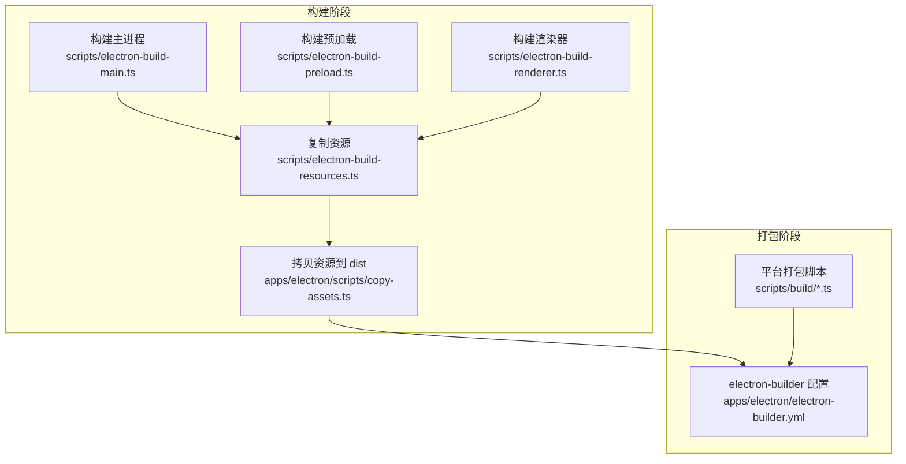
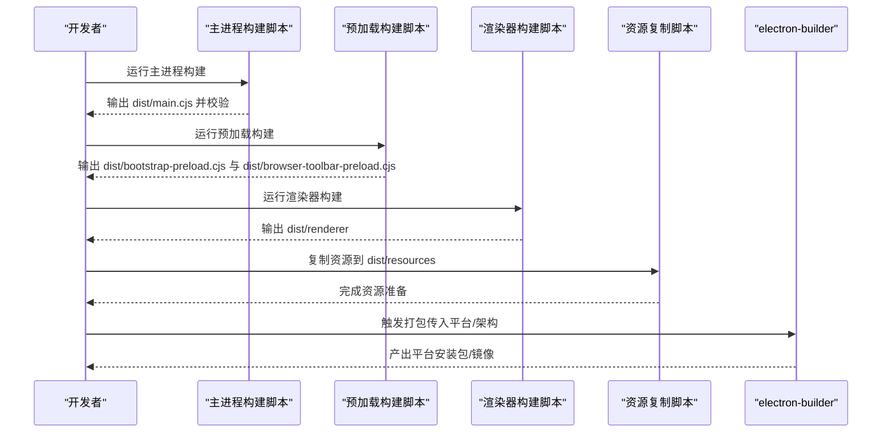
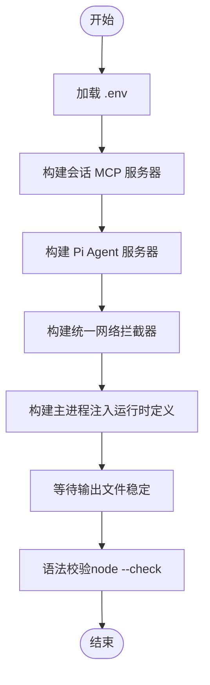
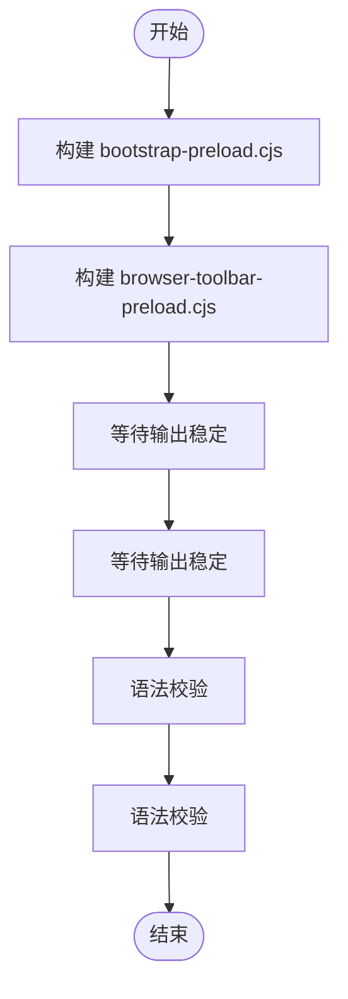
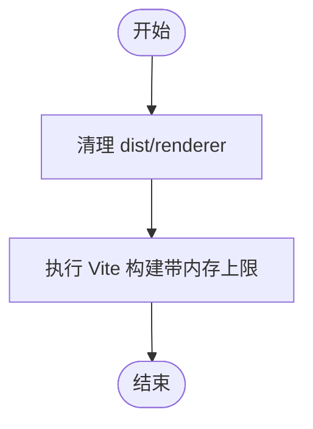
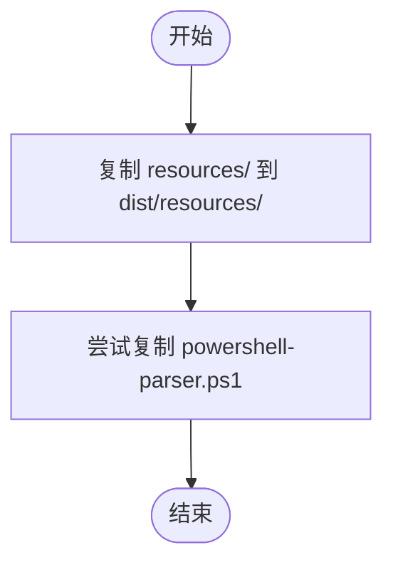
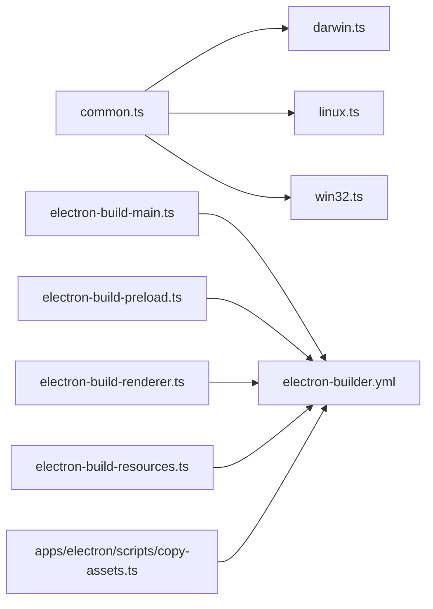

# 构建和部署

<cite>
**本文引用的文件**
- [apps/electron/package.json](file://apps/electron/package.json)
- [apps/electron/electron-builder.yml](file://apps/electron/electron-builder.yml)
- [apps/electron/vite.config.ts](file://apps/electron/vite.config.ts)
- [scripts/build/common.ts](file://scripts/build/common.ts)
- [scripts/build/darwin.ts](file://scripts/build/darwin.ts)
- [scripts/build/linux.ts](file://scripts/build/linux.ts)
- [scripts/build/win32.ts](file://scripts/build/win32.ts)
- [scripts/electron-build-main.ts](file://scripts/electron-build-main.ts)
- [scripts/electron-build-preload.ts](file://scripts/electron-build-preload.ts)
- [scripts/electron-build-renderer.ts](file://scripts/electron-build-renderer.ts)
- [scripts/electron-build-resources.ts](file://scripts/electron-build-resources.ts)
- [scripts/electron-clean.ts](file://scripts/electron-clean.ts)
- [apps/electron/scripts/copy-assets.ts](file://apps/electron/scripts/copy-assets.ts)
</cite>

## 目录

1. [简介](#简介)
2. [项目结构](#项目结构)
3. [核心组件](#核心组件)
4. [架构总览](#架构总览)
5. [详细组件分析](#详细组件分析)
6. [依赖关系分析](#依赖关系分析)
7. [性能考量](#性能考量)
8. [故障排查指南](#故障排查指南)
9. [结论](#结论)
10. [附录](#附录)

## 简介

本文件面向 Craft Agents 的构建与部署，系统性阐述主进程、预加载脚本、渲染进程与资源的构建流程；深入解析 electron-builder 配置项与自定义选项；给出跨平台（macOS、Windows、Linux）构建步骤与注意事项；覆盖打包期资源处理、图标生成与签名流程；总结发布最佳实践（版本管理、自动化部署与持续集成）；并提供常见问题与解决方案，兼顾初学者易懂与资深开发者所需的技术深度。

## 项目结构

本仓库采用 Monorepo 结构，桌面应用位于 apps/electron，构建脚本集中在根目录 scripts 与 apps/electron/scripts。核心构建链路由多段脚本协同完成：先通过 cross-platform 脚本分别构建主进程、预加载与渲染器，再统一复制资源，最后交由 electron-builder 打包分发。

图表来源

- [scripts/electron-build-main.ts](file://scripts/electron-build-main.ts#L256-L327)
- [scripts/electron-build-preload.ts](file://scripts/electron-build-preload.ts#L104-L146)
- [scripts/electron-build-renderer.ts](file://scripts/electron-build-renderer.ts#L1-L28)
- [scripts/electron-build-resources.ts](file://scripts/electron-build-resources.ts#L1-L20)
- [apps/electron/scripts/copy-assets.ts](file://apps/electron/scripts/copy-assets.ts#L1-L34)
- [apps/electron/electron-builder.yml](file://apps/electron/electron-builder.yml#L1-L220)
- [scripts/build/common.ts](file://scripts/build/common.ts#L568-L573)

章节来源

- [apps/electron/package.json](file://apps/electron/package.json#L17-L37)
- [apps/electron/vite.config.ts](file://apps/electron/vite.config.ts#L11-L75)

## 核心组件

- 主进程构建：负责注入运行时变量（如 OAuth 客户端凭据）、输出 dist/main.cjs，并验证语法正确性。
- 预加载构建：并行构建两套预加载入口，输出 dist/bootstrap-preload.cjs 与 dist/browser-toolbar-preload.cjs。
- 渲染器构建：基于 Vite 多页面输入，输出 dist/renderer，启用 Source Map 便于调试。
- 资源复制：将 resources/ 拷贝至 dist/resources/，并在启动时通过 setBundledAssetsRoot 解析内置资源路径。
- 打包与分发：electron-builder 统一配置各平台产物、签名、权限、目标格式与命名规则。

章节来源

- [scripts/electron-build-main.ts](file://scripts/electron-build-main.ts#L135-L166)
- [scripts/electron-build-preload.ts](file://scripts/electron-build-preload.ts#L85-L102)
- [scripts/electron-build-renderer.ts](file://scripts/electron-build-renderer.ts#L12-L27)
- [scripts/electron-build-resources.ts](file://scripts/electron-build-resources.ts#L11-L19)
- [apps/electron/scripts/copy-assets.ts](file://apps/electron/scripts/copy-assets.ts#L14-L20)

## 架构总览

下图展示了从构建到打包的关键调用序列，涵盖主进程、预加载、渲染器与资源复制，以及最终的 electron-builder 打包。

图表来源

- [scripts/electron-build-main.ts](file://scripts/electron-build-main.ts#L256-L327)
- [scripts/electron-build-preload.ts](file://scripts/electron-build-preload.ts#L104-L146)
- [scripts/electron-build-renderer.ts](file://scripts/electron-build-renderer.ts#L12-L27)
- [scripts/electron-build-resources.ts](file://scripts/electron-build-resources.ts#L11-L19)
- [apps/electron/scripts/copy-assets.ts](file://apps/electron/scripts/copy-assets.ts#L14-L20)
- [apps/electron/electron-builder.yml](file://apps/electron/electron-builder.yml#L1-L220)

## 详细组件分析

### 主进程构建流程

- 加载 .env 变量，拼装 esbuild 定义（如 OAuth 凭据、Sentry 地址等），避免硬编码进二进制。
- 先构建会话级 MCP 服务器与 Pi SDK 子进程，再构建拦截器（Node 子进程使用的统一网络拦截），最后构建主进程。
- 输出后等待文件稳定并使用 node --check 做语法校验，确保可运行。

图表来源

- [scripts/electron-build-main.ts](file://scripts/electron-build-main.ts#L21-L42)
- [scripts/electron-build-main.ts](file://scripts/electron-build-main.ts#L168-L205)
- [scripts/electron-build-main.ts](file://scripts/electron-build-main.ts#L207-L254)
- [scripts/electron-build-main.ts](file://scripts/electron-build-main.ts#L274-L323)

章节来源

- [scripts/electron-build-main.ts](file://scripts/electron-build-main.ts#L256-L327)

### 预加载构建流程

- 同步构建两套预加载入口，分别用于应用引导与浏览器工具栏。
- 对每个输出执行稳定等待与语法校验，保证产物可用。

图表来源

- [scripts/electron-build-preload.ts](file://scripts/electron-build-preload.ts#L85-L102)
- [scripts/electron-build-preload.ts](file://scripts/electron-build-preload.ts#L111-L142)

章节来源

- [scripts/electron-build-preload.ts](file://scripts/electron-build-preload.ts#L104-L146)

### 渲染器构建流程

- 使用 Vite 多页面配置，输出到 dist/renderer。
- 通过环境变量提升内存上限以避免大项目构建 OOM。
- 开发模式下提供本地服务端口与自动打开开关。

图表来源

- [scripts/electron-build-renderer.ts](file://scripts/electron-build-renderer.ts#L12-L27)
- [apps/electron/vite.config.ts](file://apps/electron/vite.config.ts#L36-L74)

章节来源

- [scripts/electron-build-renderer.ts](file://scripts/electron-build-renderer.ts#L1-L28)
- [apps/electron/vite.config.ts](file://apps/electron/vite.config.ts#L11-L75)

### 资源复制与内置资产

- 将 resources/ 整体复制到 dist/resources/，供应用启动时通过 setBundledAssetsRoot 解析。
- 特定平台脚本（如 PowerShell 解析器）按需复制到 dist/resources 下。

图表来源

- [scripts/electron-build-resources.ts](file://scripts/electron-build-resources.ts#L11-L19)
- [apps/electron/scripts/copy-assets.ts](file://apps/electron/scripts/copy-assets.ts#L22-L33)

章节来源

- [scripts/electron-build-resources.ts](file://scripts/electron-build-resources.ts#L1-L20)
- [apps/electron/scripts/copy-assets.ts](file://apps/electron/scripts/copy-assets.ts#L1-L34)

### electron-builder 配置详解

- 应用标识与产品名、版权信息、Electron 版本。
- afterPack 钩子用于 macOS 26+ 液态玻璃图标处理。
- 目录与文件策略：输出目录、构建资源目录、排除映射、包含 MCP 服务器、拦截器与 CLI 工具脚本。
- extraMetadata.main 指向 dist/main.cjs。
- 自动更新：generic 提供者，指向固定地址。
- 关闭 ASAR 以降低解压开销与点击延迟。
- 平台特定配置：
  - macOS：图标、Hardened Runtime、entitlements、目标 dmg/zip、架构、产物命名、可选签名与公证。
  - Windows：NSIS 安装器、Per-User 安装、排除其他平台二进制、将 Bun/Codex/Copilot/uv 放入 extraResources 避免文件锁定。
  - Linux：AppImage、架构、extraResources 与 files 排除策略。

章节来源

- [apps/electron/electron-builder.yml](file://apps/electron/electron-builder.yml#L1-L220)

### 跨平台构建步骤与注意事项

- 通用流程（Mac/Linux）：通过 scripts/build/common.ts 统一下载并放置 Bun/uv、复制 SDK、构建 MCP 服务器、复制拦截器与会话服务器、构建 Electron 应用，最后调用 electron-builder 打包。
- Windows 特殊处理：
  - 使用 Node.js 直接调用 esbuild/vite，绕过 Windows 上的符号链接与锁文件问题。
  - 在每次打包前清理 release 目录，必要时杀掉占用进程并指数退避重试删除。
  - 将 Bun/Codex/Copilot/uv 作为 extraResources 避免 npm 收集器扫描导致的 EBUSY 错误。
  - 产物命名与 NSIS 行为遵循配置。

章节来源

- [scripts/build/common.ts](file://scripts/build/common.ts#L106-L174)
- [scripts/build/common.ts](file://scripts/build/common.ts#L197-L269)
- [scripts/build/common.ts](file://scripts/build/common.ts#L316-L359)
- [scripts/build/common.ts](file://scripts/build/common.ts#L508-L546)
- [scripts/build/darwin.ts](file://scripts/build/darwin.ts#L34-L97)
- [scripts/build/linux.ts](file://scripts/build/linux.ts#L34-L80)
- [scripts/build/win32.ts](file://scripts/build/win32.ts#L114-L208)
- [scripts/build/win32.ts](file://scripts/build/win32.ts#L213-L287)

### 打包期资源处理、图标生成与签名

- 资源处理：resources/ 作为构建资源目录，electron-builder 会将其原样打包到应用中；应用启动时设置内置资源根目录，实现资源路径解析。
- 图标生成：macOS 使用 icns；Windows 使用 ico；Linux 使用 png。macOS 26+ 通过 afterPack 钩子生成 Liquid Glass 图标。
- 签名与公证（macOS）：可通过环境变量启用签名与公证；Windows 通过 extraResources 避免打包时文件锁定。

章节来源

- [apps/electron/electron-builder.yml](file://apps/electron/electron-builder.yml#L10-L25)
- [apps/electron/electron-builder.yml](file://apps/electron/electron-builder.yml#L81-L123)
- [apps/electron/electron-builder.yml](file://apps/electron/electron-builder.yml#L144-L187)
- [apps/electron/electron-builder.yml](file://apps/electron/electron-builder.yml#L195-L220)

### 发布流程最佳实践

- 版本管理：在 apps/electron/package.json 中维护版本号，构建完成后生成 manifest.json，上传到对象存储。
- 自动化部署：通过 S3 上传脚本（scripts/upload.ts）上传版本清单与产物，支持上传最新版本与脚本。
- 持续集成：在 CI 中设置必要的环境变量（如 Apple 签名与公证凭据、S3 凭证），并按平台调用对应打包脚本。

章节来源

- [scripts/build/common.ts](file://scripts/build/common.ts#L578-L592)
- [scripts/build/common.ts](file://scripts/build/common.ts#L597-L623)
- [apps/electron/package.json](file://apps/electron/package.json#L3-L4)

## 依赖关系分析

- 构建脚本间耦合度低，职责清晰：主进程、预加载、渲染器、资源复制各自独立，最后统一进入 electron-builder。
- electron-builder 通过 files/extraResources 精准控制打包内容，避免 node_modules 自动排除带来的问题。
- 平台差异通过 scripts/build/\*.ts 分离处理，公共逻辑集中在 common.ts。

图表来源

- [scripts/build/common.ts](file://scripts/build/common.ts#L568-L573)
- [scripts/build/darwin.ts](file://scripts/build/darwin.ts#L34-L97)
- [scripts/build/linux.ts](file://scripts/build/linux.ts#L34-L80)
- [scripts/build/win32.ts](file://scripts/build/win32.ts#L213-L287)
- [scripts/electron-build-main.ts](file://scripts/electron-build-main.ts#L256-L327)
- [scripts/electron-build-preload.ts](file://scripts/electron-build-preload.ts#L104-L146)
- [scripts/electron-build-renderer.ts](file://scripts/electron-build-renderer.ts#L12-L27)
- [scripts/electron-build-resources.ts](file://scripts/electron-build-resources.ts#L11-L19)
- [apps/electron/scripts/copy-assets.ts](file://apps/electron/scripts/copy-assets.ts#L14-L20)
- [apps/electron/electron-builder.yml](file://apps/electron/electron-builder.yml#L1-L220)

## 性能考量

- 关闭 ASAR：减少解压开销与首次启动延迟。
- Source Map：渲染器启用 Source Map 便于调试，但未上传 Sentry，避免额外网络开销。
- 内存优化：Vite 构建时设置 NODE_OPTIONS 提升内存上限，避免大项目构建失败。
- 平台特定二进制：仅打包当前平台所需的二进制（Bun/uv/Codex/Copilot），减小体积。

章节来源

- [apps/electron/electron-builder.yml](file://apps/electron/electron-builder.yml#L78-L79)
- [apps/electron/vite.config.ts](file://apps/electron/vite.config.ts#L40-L41)
- [scripts/electron-build-renderer.ts](file://scripts/electron-build-renderer.ts#L23-L24)
- [scripts/build/common.ts](file://scripts/build/common.ts#L106-L174)
- [scripts/build/common.ts](file://scripts/build/common.ts#L197-L269)

## 故障排查指南

- electron-builder 失败（Windows）：检查是否被进程占用，使用脚本提供的 killLockingProcesses 与安全删除函数；必要时指数退避重试。
- SDK 未打包：在打包后验证 app 内的 node_modules/@anthropic-ai/claude-agent-sdk/cli.js 是否存在且大小合理。
- 资源缺失：确认 dist/resources 是否包含 resources/ 的完整内容，特别是 docs、themes、permissions、tool-icons。
- 渲染器构建失败：检查内存限制，适当提高 NODE_OPTIONS；确认 Vite 配置与入口文件存在。
- macOS 签名/公证：确保 APPLE_ID、APPLE_TEAM_ID、APPLE_APP_SPECIFIC_PASSWORD、APPLE_SIGNING_IDENTITY 环境变量齐全。

章节来源

- [scripts/build/win32.ts](file://scripts/build/win32.ts#L71-L110)
- [scripts/build/win32.ts](file://scripts/build/win32.ts#L213-L287)
- [scripts/build/darwin.ts](file://scripts/build/darwin.ts#L13-L29)
- [scripts/build/linux.ts](file://scripts/build/linux.ts#L13-L29)
- [apps/electron/scripts/copy-assets.ts](file://apps/electron/scripts/copy-assets.ts#L14-L20)
- [apps/electron/vite.config.ts](file://apps/electron/vite.config.ts#L36-L74)

## 结论

本构建体系通过模块化的脚本与集中式 electron-builder 配置，实现了跨平台的一致体验与可控的产物体积。主进程、预加载、渲染器与资源复制各司其职，配合平台特定的加固与容错策略，能够在 CI 与本地开发环境中稳定产出安装包或分发镜像。建议在 CI 中严格管理环境变量与缓存，结合自动化上传与版本清单，形成可靠的发布流水线。

## 附录

- 常用命令参考
  - 构建主进程：bun run electron:build:main
  - 构建预加载：bun run electron:build:preload
  - 构建渲染器：bun run electron:build:renderer
  - 复制资源：bun run electron:build:copy
  - 清理：bun run electron:clean
  - 启动开发：bun run electron:start
  - 打包 macOS：bun run dist:mac 或 bun run dist:mac:x64
  - 打包 Windows：bun run dist:win
  - 打包 Linux：bun run electron:build

章节来源

- [apps/electron/package.json](file://apps/electron/package.json#L17-L37)
