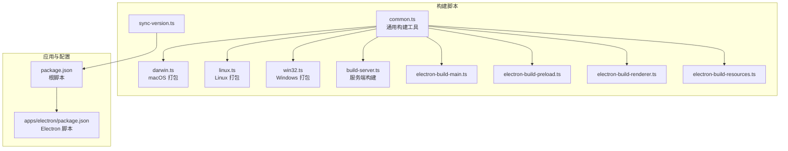
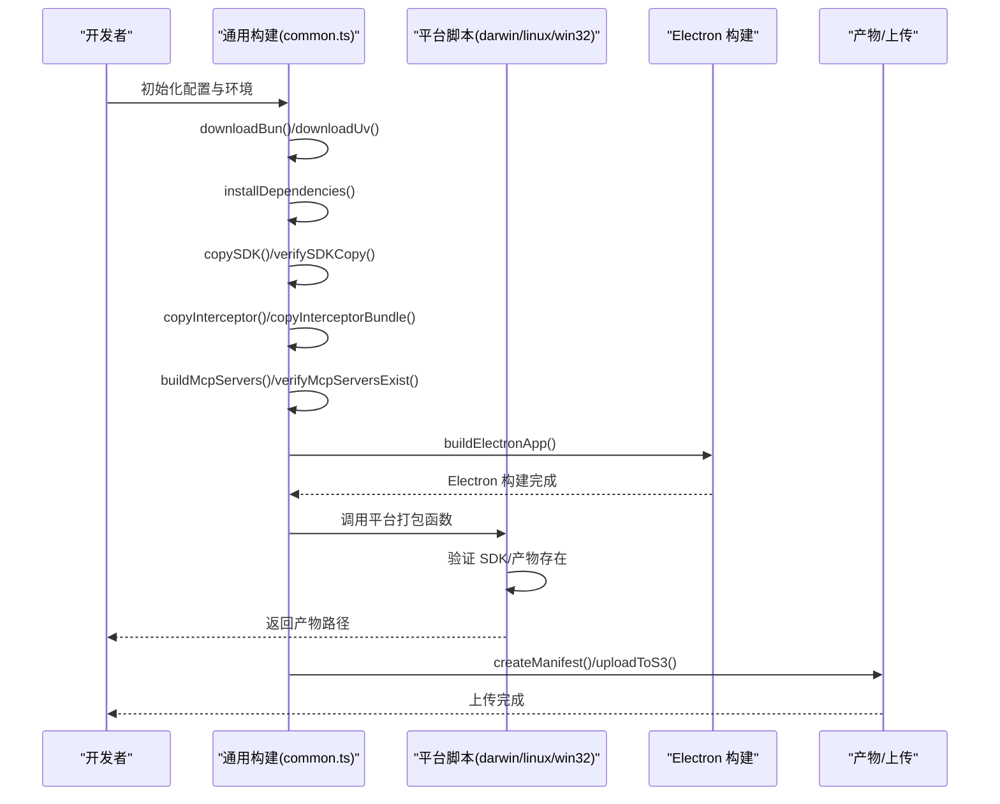
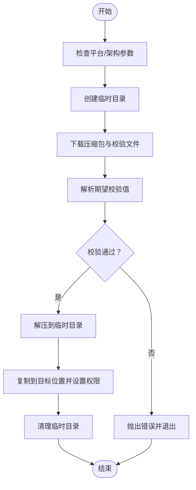
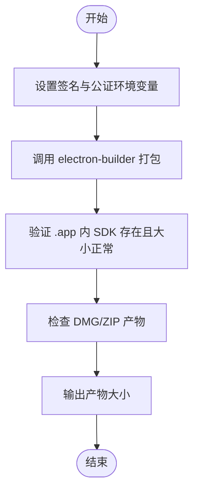
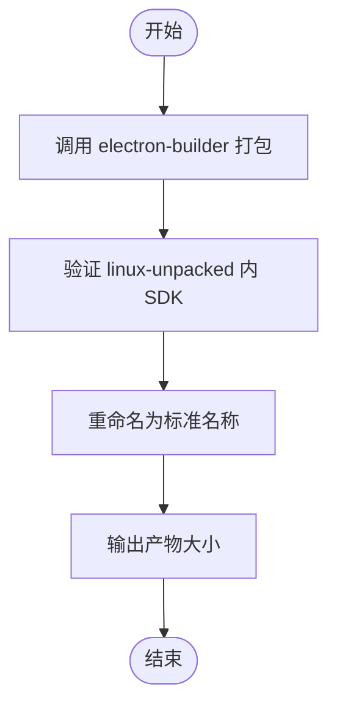
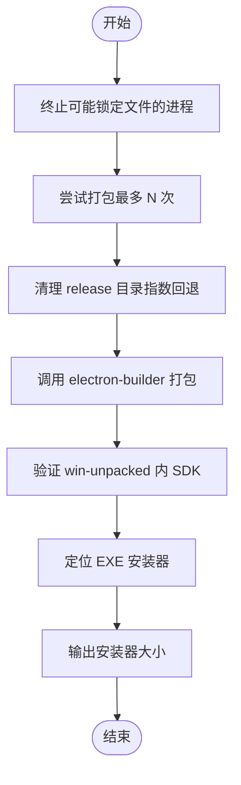
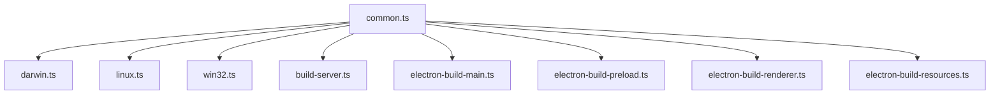

# 构建脚本系统

<cite>
**本文档引用的文件**
- [scripts/build/common.ts](file://scripts/build/common.ts)
- [scripts/build/darwin.ts](file://scripts/build/darwin.ts)
- [scripts/build/linux.ts](file://scripts/build/linux.ts)
- [scripts/build/win32.ts](file://scripts/build/win32.ts)
- [scripts/build-server.ts](file://scripts/build-server.ts)
- [scripts/electron-build-main.ts](file://scripts/electron-build-main.ts)
- [scripts/electron-build-preload.ts](file://scripts/electron-build-preload.ts)
- [scripts/electron-build-renderer.ts](file://scripts/electron-build-renderer.ts)
- [scripts/electron-build-resources.ts](file://scripts/electron-build-resources.ts)
- [scripts/sync-version.ts](file://scripts/sync-version.ts)
- [package.json](file://package.json)
- [apps/electron/package.json](file://apps/electron/package.json)
</cite>

## 目录

1. [简介](#简介)
2. [项目结构](#项目结构)
3. [核心组件](#核心组件)
4. [架构总览](#架构总览)
5. [详细组件分析](#详细组件分析)
6. [依赖关系分析](#依赖关系分析)
7. [性能考虑](#性能考虑)
8. [故障排除指南](#故障排除指南)
9. [结论](#结论)
10. [附录](#附录)

## 简介

本文件面向 Craft Agents 的构建脚本系统，提供从通用构建配置到各平台特定实现的完整技术文档。重点涵盖以下方面：

- 通用构建配置与工具函数：版本管理、下载与校验、SDK/资源复制、MCP 服务器构建与验证、Electron 应用构建、产物上传与清单生成等。
- 平台特定构建逻辑：macOS、Linux、Windows 的打包与签名、安装包验证、产物命名与大小统计。
- 跨平台兼容性：统一的下载器与校验流程、平台差异处理（如 Windows 文件锁定与重试策略）。
- 构建流程关键决策点：何时下载二进制、何时清理缓存、何时进行 SDK 校验、何时触发打包与签名。
- 错误处理与调试技巧：异常捕获、环境变量检查、日志输出、重试与回退策略。

## 项目结构

构建脚本位于 scripts/build 及相关独立脚本中，配合 apps/electron 的构建脚本与 package.json 的脚本命令协同工作。核心目录与文件如下：

- scripts/build/common.ts：通用构建配置与工具函数（下载/校验、SDK 复制、MCP 服务器构建、Electron 构建、上传等）
- scripts/build/darwin.ts：macOS 打包与签名、DMG/ZIP 产物验证
- scripts/build/linux.ts：Linux 打包与 AppImage 产物验证
- scripts/build/win32.ts：Windows 打包与安装器构建、文件锁定处理与重试
- scripts/build-server.ts：独立服务端构建（含资源装配、uv/Bun 下载、依赖裁剪、入口脚本与 Docker 文件生成）
- scripts/electron-build-\*.ts：Electron 主进程、预加载、渲染器、资源复制的独立构建脚本
- scripts/sync-version.ts：版本同步脚本，用于在 monorepo 中保持版本一致性
- package.json 与 apps/electron/package.json：定义构建脚本命令与依赖

**图表来源**

- [scripts/build/common.ts](file://scripts/build/common.ts#L1-L659)
- [scripts/build/darwin.ts](file://scripts/build/darwin.ts#L1-L98)
- [scripts/build/linux.ts](file://scripts/build/linux.ts#L1-L81)
- [scripts/build/win32.ts](file://scripts/build/win32.ts#L1-L288)
- [scripts/build-server.ts](file://scripts/build-server.ts#L1-L817)
- [scripts/electron-build-main.ts](file://scripts/electron-build-main.ts#L1-L327)
- [scripts/electron-build-preload.ts](file://scripts/electron-build-preload.ts#L1-L146)
- [scripts/electron-build-renderer.ts](file://scripts/electron-build-renderer.ts#L1-L28)
- [scripts/electron-build-resources.ts](file://scripts/electron-build-resources.ts#L1-L20)
- [scripts/sync-version.ts](file://scripts/sync-version.ts#L1-L89)
- [package.json](file://package.json#L1-L169)
- [apps/electron/package.json](file://apps/electron/package.json#L1-L80)

**章节来源**

- [package.json](file://package.json#L1-L169)
- [apps/electron/package.json](file://apps/electron/package.json#L1-L80)

## 核心组件

本节聚焦 common.ts 中的通用构建配置与工具函数，涵盖版本管理、下载与校验、SDK/拦截器/MCP 服务器复制与验证、Electron 应用构建、产物上传与清单生成等。

- 版本与平台常量
  - 定义 Bun 与 uv 的目标版本，确保与 CI 使用的版本一致。
  - 提供平台与架构映射函数，用于生成下载文件名与资源目录键。

- 下载与校验
  - downloadBun：下载指定平台的 Bun 二进制，使用 curl 获取压缩包与校验列表，解析并校验 SHA256，解压后复制到 vendor 目录，并在非 Windows 平台设置可执行权限。
  - downloadUv：下载指定平台的 uv 二进制，支持 .zip 与 .tar.gz，使用 .sha256 校验，解压后复制到 resources/bin/<platform-arch>/uv，并设置可执行权限。

- 清理与依赖安装
  - cleanBuildArtifacts：清理 vendor、特定 SDK 包、packages、release 等目录，避免残留影响后续构建。
  - installDependencies：Windows 使用 hoisted 链接器以规避符号链接导致的 esbuild 访问问题；其他平台使用默认安装。

- SDK 与拦截器复制
  - copySDK：从根 node_modules 复制 claude-agent-sdk 到 Electron 应用的 node_modules，使用 dereference 避免符号链接。
  - verifySDKCopy：校验 cli.js 是否存在、是否为真实文件而非符号链接、文件大小是否符合预期。
  - copyInterceptor：复制网络拦截器源文件与共享基础设施到 Electron 应用的共享路径。
  - copyInterceptorBundle：验证拦截器 CJS 打包产物是否存在（由独立构建脚本生成）。

- MCP 服务器与 Pi 代理服务器
  - buildMcpServers：构建会话级 MCP 服务器与 Pi 代理服务器，分别采用 Node/CJS 与 Bun/ESM 目标，Pi 服务器将 koffi 声明为外部模块。
  - verifyMcpServersExist：验证资源目录中是否存在会话 MCP 服务器与 Pi 代理服务器入口文件。
  - copySessionServer：复制会话 MCP 服务器到资源目录。
  - copyPiAgentServer：复制 Pi 代理服务器与 koffi 的目标平台原生二进制（仅拷贝当前平台，减少体积）。

- Electron 应用构建与产物管理
  - buildElectronApp：调用根脚本中的 electron:build，统一构建主进程、预加载、渲染器与资源。
  - createManifest：读取 Electron 应用的 package.json 版本，生成上传清单 manifest.json。
  - uploadToS3：根据配置与环境变量上传产物至 S3，支持上传最新版本标记与脚本标志。
  - loadEnvFile：从 .env 文件加载环境变量，覆盖 process.env。

- 输出与命名
  - getArtifactName：根据平台与架构返回标准产物名称（DMG、EXE、AppImage）。

**章节来源**

- [scripts/build/common.ts](file://scripts/build/common.ts#L1-L659)

## 架构总览

下图展示了跨平台构建的整体流程：通用工具负责下载、复制、构建与验证；平台特定脚本负责打包与签名；最终生成产物并可选上传。

**图表来源**

- [scripts/build/common.ts](file://scripts/build/common.ts#L106-L174)
- [scripts/build/common.ts](file://scripts/build/common.ts#L197-L269)
- [scripts/build/common.ts](file://scripts/build/common.ts#L297-L311)
- [scripts/build/common.ts](file://scripts/build/common.ts#L316-L359)
- [scripts/build/common.ts](file://scripts/build/common.ts#L364-L414)
- [scripts/build/common.ts](file://scripts/build/common.ts#L508-L546)
- [scripts/build/common.ts](file://scripts/build/common.ts#L568-L573)
- [scripts/build/darwin.ts](file://scripts/build/darwin.ts#L34-L97)
- [scripts/build/linux.ts](file://scripts/build/linux.ts#L34-L80)
- [scripts/build/win32.ts](file://scripts/build/win32.ts#L213-L287)
- [scripts/build/common.ts](file://scripts/build/common.ts#L578-L592)
- [scripts/build/common.ts](file://scripts/build/common.ts#L597-L623)

## 详细组件分析

### 通用构建工具（common.ts）

- 设计要点
  - 统一的下载与校验流程：通过 GitHub Release 的校验文件与本地哈希比对，确保二进制完整性。
  - 平台差异化处理：Bun 在 Windows/Linux x64 上使用 baseline 构建以提升 CPU 兼容性；uv 按平台/架构选择对应二进制。
  - 资源复制与验证：SDK、拦截器、MCP 服务器均提供复制与验证步骤，防止打包遗漏或符号链接导致运行时问题。
  - Electron 构建与产物管理：集中管理 Electron 应用构建、清单生成与上传，便于 CI 集成。

- 关键流程图（下载与校验）

**图表来源**

- [scripts/build/common.ts](file://scripts/build/common.ts#L106-L174)
- [scripts/build/common.ts](file://scripts/build/common.ts#L197-L269)

**章节来源**

- [scripts/build/common.ts](file://scripts/build/common.ts#L1-L659)

### macOS 打包（darwin.ts）

- 设计要点
  - 使用 electron-builder 进行打包，自动发现代码签名证书并启用公证（当凭据齐全时）。
  - 打包完成后验证 .app 内 SDK 是否正确打包，确保 DMG/ZIP 产物存在并输出大小信息。

- 关键流程图（macOS 打包）

**图表来源**

- [scripts/build/darwin.ts](file://scripts/build/darwin.ts#L34-L97)

**章节来源**

- [scripts/build/darwin.ts](file://scripts/build/darwin.ts#L1-L98)

### Linux 打包（linux.ts）

- 设计要点
  - 使用 electron-builder 打包为 AppImage，按平台规范重命名产物为标准名称。
  - 验证 linux-unpacked 中 SDK 是否存在，输出产物大小。

- 关键流程图（Linux 打包）

**图表来源**

- [scripts/build/linux.ts](file://scripts/build/linux.ts#L34-L80)

**章节来源**

- [scripts/build/linux.ts](file://scripts/build/linux.ts#L1-L81)

### Windows 打包（win32.ts）

- 设计要点
  - 针对 Windows Defender 与文件锁定问题，提供进程终止、指数回退删除目录与多次重试打包的策略。
  - 构建主进程、拦截器、预加载、渲染器与资源，确保渲染器产物存在。
  - 打包完成后验证 win-unpacked 中 SDK 是否存在，输出安装器大小。

- 关键流程图（Windows 打包）

**图表来源**

- [scripts/build/win32.ts](file://scripts/build/win32.ts#L71-L110)
- [scripts/build/win32.ts](file://scripts/build/win32.ts#L213-L287)

**章节来源**

- [scripts/build/win32.ts](file://scripts/build/win32.ts#L1-L288)

### Electron 独立构建脚本

- electron-build-main.ts：加载 .env、构建拦截器、会话 MCP 服务器、Pi 代理服务器与主进程，最后进行语法验证。
- electron-build-preload.ts：构建两个预加载入口，等待输出稳定并进行语法验证。
- electron-build-renderer.ts：清理并构建渲染器，设置内存限制。
- electron-build-resources.ts：复制资源目录到 dist。

**章节来源**

- [scripts/electron-build-main.ts](file://scripts/electron-build-main.ts#L1-L327)
- [scripts/electron-build-preload.ts](file://scripts/electron-build-preload.ts#L1-L146)
- [scripts/electron-build-renderer.ts](file://scripts/electron-build-renderer.ts#L1-L28)
- [scripts/electron-build-resources.ts](file://scripts/electron-build-resources.ts#L1-L20)

### 服务端构建（build-server.ts）

- 设计要点
  - 资源装配：复制 docs、themes、permissions、tool-icons、config-defaults、Python 脚本、平台无关的工具包装脚本、MCP 服务器等。
  - 二进制下载：将 Bun 与 uv 下载到输出目录的扁平布局，而非 Electron 资源目录。
  - 依赖裁剪：显式复制生产依赖，过滤 ripgrep 的非目标平台目录，显著减小体积。
  - 工作区包复制：复制 packages/\* 的源码与构建产物，生成根级 package.json 与 tsconfig.json 以支持路径解析。
  - 入口脚本与容器化：生成 craft-server、start.sh、install.sh，并提供 Dockerfile 与 docker-compose.yml。
  - 压缩归档：可选将输出目录打包为 tar.gz。

**章节来源**

- [scripts/build-server.ts](file://scripts/build-server.ts#L1-L817)

### 版本同步（sync-version.ts）

- 设计要点
  - 从共享包读取版本号，遍历 monorepo 中所有 package.json，更新版本字段并输出变更数量。

**章节来源**

- [scripts/sync-version.ts](file://scripts/sync-version.ts#L1-L89)

## 依赖关系分析

- 构建脚本之间的耦合
  - common.ts 被多处脚本复用，作为统一的工具层，降低重复逻辑。
  - 平台脚本依赖 common.ts 的下载与校验能力，以及 Electron 应用构建后的产物验证。
  - Electron 独立构建脚本与 common.ts 的 Electron 构建函数形成互补：前者更细粒度控制各模块，后者提供统一入口。
- 外部依赖与集成点
  - GitHub Releases 用于下载 Bun/uv 校验与二进制。
  - electron-builder 用于各平台打包与签名/公证。
  - S3 上传脚本用于发布产物。
- 潜在循环依赖
  - 当前脚本分层清晰，未见直接循环依赖；服务端构建脚本与 common.ts 的交互为单向使用。

**图表来源**

- [scripts/build/common.ts](file://scripts/build/common.ts#L1-L659)
- [scripts/build/darwin.ts](file://scripts/build/darwin.ts#L1-L98)
- [scripts/build/linux.ts](file://scripts/build/linux.ts#L1-L81)
- [scripts/build/win32.ts](file://scripts/build/win32.ts#L1-L288)
- [scripts/build-server.ts](file://scripts/build-server.ts#L1-L817)
- [scripts/electron-build-main.ts](file://scripts/electron-build-main.ts#L1-L327)
- [scripts/electron-build-preload.ts](file://scripts/electron-build-preload.ts#L1-L146)
- [scripts/electron-build-renderer.ts](file://scripts/electron-build-renderer.ts#L1-L28)
- [scripts/electron-build-resources.ts](file://scripts/electron-build-resources.ts#L1-L20)

**章节来源**

- [scripts/build/common.ts](file://scripts/build/common.ts#L1-L659)
- [scripts/build-server.ts](file://scripts/build-server.ts#L1-L817)

## 性能考虑

- 二进制下载与校验
  - 使用 curl 并行下载压缩包与校验文件，减少等待时间；校验失败立即中止，避免浪费带宽。
- 依赖裁剪
  - 服务端构建显式复制生产依赖并过滤 ripgrep 非目标平台目录，显著降低产物体积。
- 平台特定优化
  - Windows 使用 hoisted 链接器避免符号链接问题；macOS/Linux 使用 electron-builder 的原生打包流程。
- 构建稳定性
  - Windows 打包引入指数回退删除与多次重试，提高 CI 稳定性。

[本节为通用性能建议，不直接分析具体文件]

## 故障排除指南

- SDK 未找到或校验失败
  - 确认已先执行依赖安装；检查 SDK 复制与验证步骤是否报错；确认 cli.js 文件大小与类型符合预期。
  - 参考路径：[scripts/build/common.ts](file://scripts/build/common.ts#L316-L359)
- uv/Bun 下载校验失败
  - 检查网络连通性与 GitHub Releases 可达性；确认校验文件解析与哈希匹配；必要时清理临时目录后重试。
  - 参考路径：[scripts/build/common.ts](file://scripts/build/common.ts#L106-L174)、[scripts/build/common.ts](file://scripts/build/common.ts#L197-L269)
- Windows 打包失败或文件锁定
  - 使用内置的进程终止与指数回退删除策略；确保 CI 环境无长时间占用文件的进程；适当增加重试次数。
  - 参考路径：[scripts/build/win32.ts](file://scripts/build/win32.ts#L71-L110)、[scripts/build/win32.ts](file://scripts/build/win32.ts#L213-L287)
- 产物缺失或命名不规范
  - macOS：检查 DMG/ZIP 是否生成；Linux：确认 AppImage 名称规范化；Windows：确认 EXE 安装器存在。
  - 参考路径：[scripts/build/darwin.ts](file://scripts/build/darwin.ts#L62-L97)、[scripts/build/linux.ts](file://scripts/build/linux.ts#L51-L80)、[scripts/build/win32.ts](file://scripts/build/win32.ts#L265-L287)
- 环境变量缺失导致上传失败
  - 确保 S3 凭证环境变量齐全；检查上传标志位是否正确传递。
  - 参考路径：[scripts/build/common.ts](file://scripts/build/common.ts#L597-L623)

**章节来源**

- [scripts/build/common.ts](file://scripts/build/common.ts#L106-L174)
- [scripts/build/common.ts](file://scripts/build/common.ts#L197-L269)
- [scripts/build/common.ts](file://scripts/build/common.ts#L316-L359)
- [scripts/build/common.ts](file://scripts/build/common.ts#L597-L623)
- [scripts/build/win32.ts](file://scripts/build/win32.ts#L71-L110)
- [scripts/build/win32.ts](file://scripts/build/win32.ts#L213-L287)
- [scripts/build/darwin.ts](file://scripts/build/darwin.ts#L62-L97)
- [scripts/build/linux.ts](file://scripts/build/linux.ts#L51-L80)

## 结论

Craft Agents 的构建脚本系统通过“通用工具 + 平台特定实现”的分层设计，实现了跨平台的一致性与稳定性。common.ts 提供了可靠的下载、校验、复制与验证能力；平台脚本专注于打包与签名；服务端构建则强调产物体积与可维护性。结合完善的错误处理与调试手段，该系统能够满足开发与 CI 的多样化需求。

[本节为总结性内容，不直接分析具体文件]

## 附录

- 常用命令参考
  - Electron 构建：根脚本中的 electron:build、electron:dist:\* 等。
  - 服务端构建：server:build 与平台特定变体。
  - 版本同步：sync-version.ts。
- 脚本命令与入口
  - 根 package.json 与 apps/electron/package.json 中的脚本定义。

**章节来源**

- [package.json](file://package.json#L12-L71)
- [apps/electron/package.json](file://apps/electron/package.json#L17-L37)
- [scripts/sync-version.ts](file://scripts/sync-version.ts#L41-L78)
