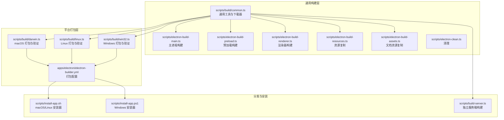
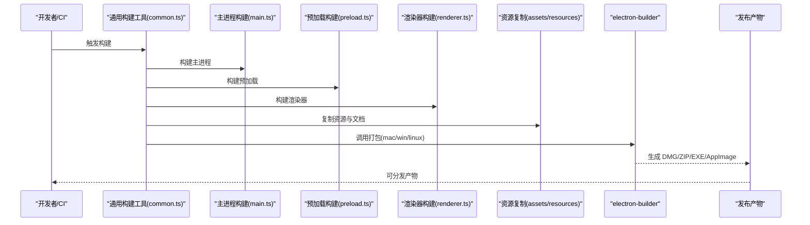
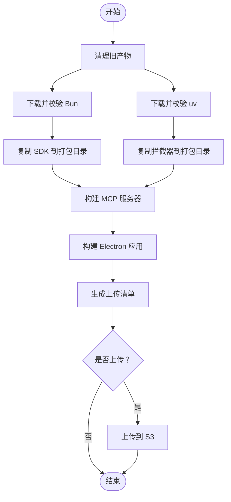
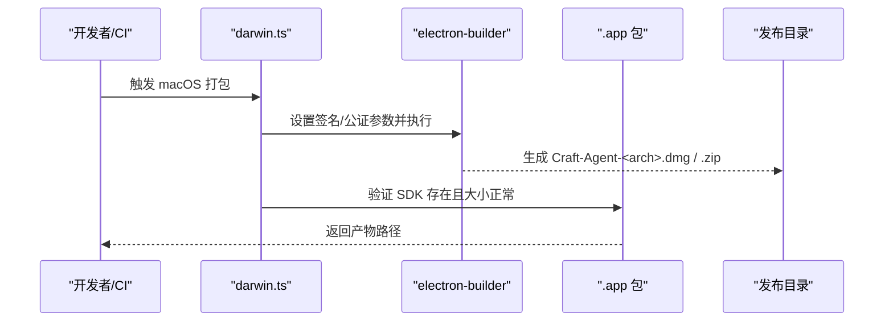
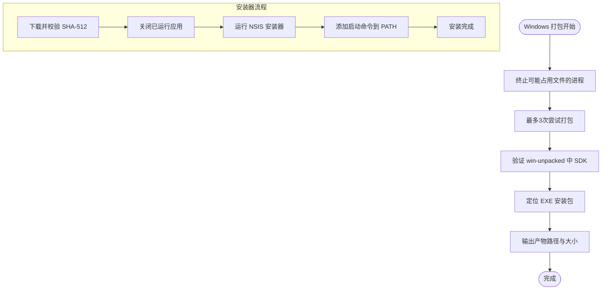
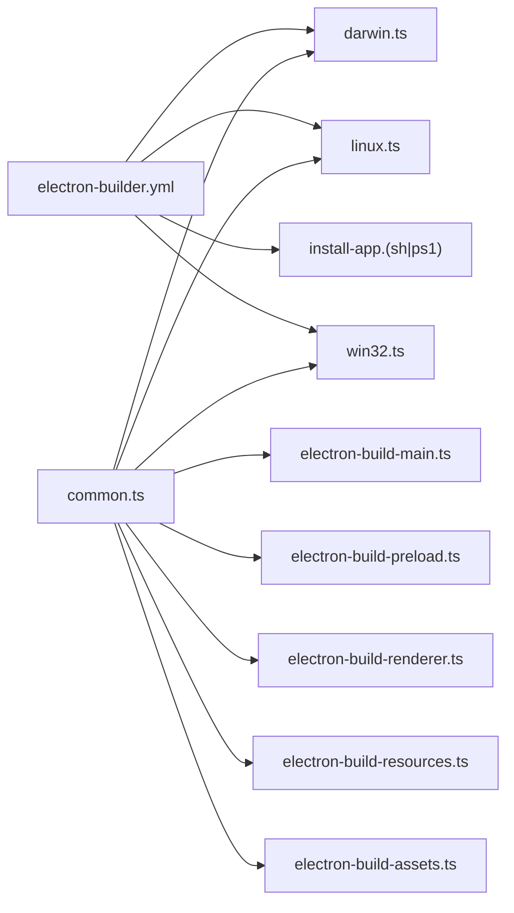

# 跨平台构建

<cite>
**本文引用的文件**
- [scripts/build/common.ts](file://scripts/build/common.ts)
- [scripts/build/darwin.ts](file://scripts/build/darwin.ts)
- [scripts/build/linux.ts](file://scripts/build/linux.ts)
- [scripts/build/win32.ts](file://scripts/build/win32.ts)
- [scripts/electron-build-main.ts](file://scripts/electron-build-main.ts)
- [scripts/electron-build-preload.ts](file://scripts/electron-build-preload.ts)
- [scripts/electron-build-renderer.ts](file://scripts/electron-build-renderer.ts)
- [scripts/electron-build-assets.ts](file://scripts/electron-build-assets.ts)
- [scripts/electron-build-resources.ts](file://scripts/electron-build-resources.ts)
- [scripts/electron-clean.ts](file://scripts/electron-clean.ts)
- [scripts/install-app.sh](file://scripts/install-app.sh)
- [scripts/install-app.ps1](file://scripts/install-app.ps1)
- [scripts/build-server.ts](file://scripts/build-server.ts)
- [scripts/sync-version.ts](file://scripts/sync-version.ts)
- [apps/electron/electron-builder.yml](file://apps/electron/electron-builder.yml)
- [package.json](file://package.json)
</cite>

## 目录

1. [简介](#简介)
2. [项目结构](#项目结构)
3. [核心组件](#核心组件)
4. [架构总览](#架构总览)
5. [详细组件分析](#详细组件分析)
6. [依赖关系分析](#依赖关系分析)
7. [性能考量](#性能考量)
8. [故障排查指南](#故障排查指南)
9. [结论](#结论)
10. [附录](#附录)

## 简介

本文件面向 Craft Agents 的跨平台构建系统，系统性阐述 macOS、Windows 与 Linux 三大平台在构建流程、签名与公证、安装包制作与自动更新机制上的差异与特殊要求；并结合仓库内实际脚本与配置，说明平台特定的依赖、工具链与产物格式。文档同时覆盖路径处理、权限设置、环境变量配置等常见问题，以及自动化构建与持续集成的最佳实践建议。

## 项目结构

构建体系由“通用构建工具 + 平台特定打包器 + 安装与更新脚本”三部分组成：

- 通用构建工具：统一下载与校验 Bun/uv、复制 MCP 服务器、拷贝拦截器、构建 Electron 主进程与预加载、渲染器等。
- 平台特定打包器：通过 electron-builder 针对各平台进行打包、签名、公证与产物命名。
- 安装与更新脚本：提供用户侧安装器与自动更新机制，支持 macOS ZIP、Windows NSIS 安装器与 Linux AppImage。

图表来源

- [scripts/build/common.ts](file://scripts/build/common.ts#L1-L659)
- [scripts/build/darwin.ts](file://scripts/build/darwin.ts#L1-L98)
- [scripts/build/linux.ts](file://scripts/build/linux.ts#L1-L81)
- [scripts/build/win32.ts](file://scripts/build/win32.ts#L1-L288)
- [apps/electron/electron-builder.yml](file://apps/electron/electron-builder.yml#L1-L220)
- [scripts/install-app.sh](file://scripts/install-app.sh#L1-L405)
- [scripts/install-app.ps1](file://scripts/install-app.ps1#L1-L265)
- [scripts/build-server.ts](file://scripts/build-server.ts#L1-L817)

章节来源

- [package.json](file://package.json#L12-L71)

## 核心组件

- 通用构建工具（common.ts）
  - 提供平台键名映射、Bun/uv 下载与校验、SDK 与拦截器复制、MCP 服务器构建与验证、Electron 应用构建、上传清单生成与 S3 上传、环境变量加载、产物命名等。
- 平台打包器（darwin.ts / linux.ts / win32.ts）
  - 在 electron-builder 基础上注入平台特定参数（如签名、公证、目标架构），并进行产物完整性验证（SDK 是否被打包）。
- Electron 构建管线（main/preload/renderer/assets/resources）
  - 分别负责主进程、预加载脚本、渲染器与静态资源的构建与复制。
- 安装与更新（install-app.sh / install-app.ps1）
  - 用户侧安装器，负责下载、校验、解包与安装；应用内自动更新基于 electron-updater 拉取远端 YAML 清单。
- 独立服务端构建（build-server.ts）
  - 产出可独立运行的服务端发行版，包含 Bun/uv 运行时、Python 工具与 MCP 服务器，支持 Docker 化部署。

章节来源

- [scripts/build/common.ts](file://scripts/build/common.ts#L1-L659)
- [scripts/build/darwin.ts](file://scripts/build/darwin.ts#L1-L98)
- [scripts/build/linux.ts](file://scripts/build/linux.ts#L1-L81)
- [scripts/build/win32.ts](file://scripts/build/win32.ts#L1-L288)
- [scripts/electron-build-main.ts](file://scripts/electron-build-main.ts#L1-L327)
- [scripts/electron-build-preload.ts](file://scripts/electron-build-preload.ts#L1-L146)
- [scripts/electron-build-renderer.ts](file://scripts/electron-build-renderer.ts#L1-L28)
- [scripts/electron-build-assets.ts](file://scripts/electron-build-assets.ts#L1-L29)
- [scripts/electron-build-resources.ts](file://scripts/electron-build-resources.ts#L1-L20)
- [scripts/electron-clean.ts](file://scripts/electron-clean.ts#L1-L24)
- [scripts/install-app.sh](file://scripts/install-app.sh#L1-L405)
- [scripts/install-app.ps1](file://scripts/install-app.ps1#L1-L265)
- [scripts/build-server.ts](file://scripts/build-server.ts#L1-L817)
- [apps/electron/electron-builder.yml](file://apps/electron/electron-builder.yml#L1-L220)

## 架构总览

下图展示了从源码到最终产物的关键流程：通用构建工具协调各子任务，平台打包器调用 electron-builder，安装器负责用户侧安装与更新。

图表来源

- [scripts/build/common.ts](file://scripts/build/common.ts#L568-L573)
- [scripts/electron-build-main.ts](file://scripts/electron-build-main.ts#L256-L327)
- [scripts/electron-build-preload.ts](file://scripts/electron-build-preload.ts#L104-L146)
- [scripts/electron-build-renderer.ts](file://scripts/electron-build-renderer.ts#L12-L28)
- [scripts/electron-build-assets.ts](file://scripts/electron-build-assets.ts#L12-L29)
- [scripts/electron-build-resources.ts](file://scripts/electron-build-resources.ts#L12-L20)
- [apps/electron/electron-builder.yml](file://apps/electron/electron-builder.yml#L1-L220)

## 详细组件分析

### 通用构建工具（common.ts）

- 平台与架构映射：提供平台键名与二进制命名规则，确保 Bun/uv 下载与放置路径一致。
- 依赖下载与校验：使用 GitHub Release 的 SHASUMS/SHA 文件进行校验，失败则中止，避免缓存污染。
- SDK 与拦截器复制：将 SDK、拦截器与 MCP 服务器复制到打包目录，保证运行时可用。
- Electron 应用构建：统一调用 Vite 与 esbuild，确保主进程、预加载与渲染器一致性。
- 上传与清单：生成 manifest.json，按需上传至 S3，并支持上传最新版本与脚本标记。

图表来源

- [scripts/build/common.ts](file://scripts/build/common.ts#L274-L291)
- [scripts/build/common.ts](file://scripts/build/common.ts#L106-L174)
- [scripts/build/common.ts](file://scripts/build/common.ts#L197-L269)
- [scripts/build/common.ts](file://scripts/build/common.ts#L316-L359)
- [scripts/build/common.ts](file://scripts/build/common.ts#L420-L434)
- [scripts/build/common.ts](file://scripts/build/common.ts#L508-L546)
- [scripts/build/common.ts](file://scripts/build/common.ts#L568-L573)
- [scripts/build/common.ts](file://scripts/build/common.ts#L578-L592)
- [scripts/build/common.ts](file://scripts/build/common.ts#L597-L623)

章节来源

- [scripts/build/common.ts](file://scripts/build/common.ts#L1-L659)

### macOS 打包与公证（darwin.ts）

- 环境变量：启用自动签名身份发现；若提供 Apple ID、团队 ID 与专用密码，则开启公证。
- 产物验证：打包后检查 .app 内 SDK 是否存在且大小合理，确保 DMG/ZIP 产物存在。
- 命名规范：使用可预测的文件名，便于自动更新与用户识别。

图表来源

- [scripts/build/darwin.ts](file://scripts/build/darwin.ts#L34-L97)
- [apps/electron/electron-builder.yml](file://apps/electron/electron-builder.yml#L81-L123)

章节来源

- [scripts/build/darwin.ts](file://scripts/build/darwin.ts#L1-L98)

### Windows 打包与安装（win32.ts 与 install-app.ps1）

- 打包策略：针对 Windows 的文件锁定与防病毒扫描问题，采用重试与进程终止策略，清理 release 目录后再打包。
- 产物验证：检查 win-unpacked 中 SDK 是否存在，定位 EXE 安装包并报告大小。
- 安装器：下载、校验 SHA-512，关闭正在运行的应用，运行 NSIS 安装器，并在 PATH 中添加启动命令。

图表来源

- [scripts/build/win32.ts](file://scripts/build/win32.ts#L213-L287)
- [scripts/install-app.ps1](file://scripts/install-app.ps1#L1-L265)

章节来源

- [scripts/build/win32.ts](file://scripts/build/win32.ts#L1-L288)
- [scripts/install-app.ps1](file://scripts/install-app.ps1#L1-L265)

### Linux 打包与安装（linux.ts 与 install-app.sh）

- 打包策略：electron-builder 使用 x86_64/aarch64 命名，随后重命名为标准 Craft-Agent-<arch>.AppImage。
- 产物验证：检查 linux-unpacked 中 SDK 是否存在。
- 安装器：下载 ZIP 或 AppImage，校验 SHA-512，Linux 使用包装脚本启动，处理 FUSE 依赖与缓存路径问题。

章节来源

- [scripts/build/linux.ts](file://scripts/build/linux.ts#L1-L81)
- [scripts/install-app.sh](file://scripts/install-app.sh#L1-L405)

### Electron 构建管线（main/preload/renderer/assets/resources）

- 主进程构建：支持 OAuth 客户端 ID/Secret 注入，构建后进行稳定性等待与语法校验。
- 预加载构建：分别构建 bootstrap 与浏览器工具栏两个入口，统一进行稳定性与语法校验。
- 渲染器构建：使用 Vite 构建，设置内存上限以避免大项目 OOM。
- 资源复制：复制 resources 与文档资源到 dist，确保运行时可访问。

章节来源

- [scripts/electron-build-main.ts](file://scripts/electron-build-main.ts#L1-L327)
- [scripts/electron-build-preload.ts](file://scripts/electron-build-preload.ts#L1-L146)
- [scripts/electron-build-renderer.ts](file://scripts/electron-build-renderer.ts#L1-L28)
- [scripts/electron-build-assets.ts](file://scripts/electron-build-assets.ts#L1-L29)
- [scripts/electron-build-resources.ts](file://scripts/electron-build-resources.ts#L1-L20)
- [scripts/electron-clean.ts](file://scripts/electron-clean.ts#L1-L24)

### 自动更新与分发（electron-builder.yml 与安装器）

- 自动更新：electron-updater 从 https://agents.craft.do/electron/latest 拉取 YAML 清单，解析版本与文件列表。
- 安装器：macOS/Linux 使用 ZIP 解压安装；Windows 使用 NSIS 安装器；安装器均进行 SHA-512 校验。
- 产物命名：macOS 使用 DMG/ZIP；Windows 使用 EXE；Linux 使用 AppImage。

章节来源

- [apps/electron/electron-builder.yml](file://apps/electron/electron-builder.yml#L74-L77)
- [scripts/install-app.sh](file://scripts/install-app.sh#L1-L405)
- [scripts/install-app.ps1](file://scripts/install-app.ps1#L1-L265)

### 独立服务端构建（build-server.ts）

- 组装资源：复制 docs、themes、permissions、tool-icons、Python 脚本与工具包装器。
- 下载运行时：将 Bun/uv 下载到输出目录，仅保留目标平台二进制。
- 依赖裁剪：显式复制生产依赖，过滤非目标平台的 ripgrep 二进制，显著减小体积。
- 入口脚本：生成 craft-server、start.sh 与 install.sh，支持 systemd 安装。
- Docker 支持：生成 Dockerfile 与 docker-compose.yml，便于容器化部署。

章节来源

- [scripts/build-server.ts](file://scripts/build-server.ts#L1-L817)

## 依赖关系分析

- 构建脚本依赖关系
  - common.ts 是所有平台构建的中枢，被 darwin.ts、linux.ts、win32.ts 与 Electron 构建脚本广泛调用。
  - electron-builder.yml 定义了打包规则、目标平台、产物命名与自动更新源。
  - 安装器与自动更新依赖远端 YAML 清单与 SHA-512 校验。
- 第三方依赖
  - electron-builder、esbuild、vite、sharp、@modelcontextprotocol/sdk、@anthropic-ai/claude-agent-sdk 等。

图表来源

- [scripts/build/common.ts](file://scripts/build/common.ts#L1-L659)
- [scripts/build/darwin.ts](file://scripts/build/darwin.ts#L1-L98)
- [scripts/build/linux.ts](file://scripts/build/linux.ts#L1-L81)
- [scripts/build/win32.ts](file://scripts/build/win32.ts#L1-L288)
- [scripts/electron-build-main.ts](file://scripts/electron-build-main.ts#L1-L327)
- [scripts/electron-build-preload.ts](file://scripts/electron-build-preload.ts#L1-L146)
- [scripts/electron-build-renderer.ts](file://scripts/electron-build-renderer.ts#L1-L28)
- [scripts/electron-build-resources.ts](file://scripts/electron-build-resources.ts#L1-L20)
- [scripts/electron-build-assets.ts](file://scripts/electron-build-assets.ts#L1-L29)
- [apps/electron/electron-builder.yml](file://apps/electron/electron-builder.yml#L1-L220)
- [scripts/install-app.sh](file://scripts/install-app.sh#L1-L405)
- [scripts/install-app.ps1](file://scripts/install-app.ps1#L1-L265)

## 性能考量

- 依赖裁剪：独立服务端构建显式复制生产依赖并过滤非目标平台二进制，显著降低体积与启动时间。
- 并行与稳定：Electron 构建阶段使用稳定性检测与语法校验，避免不完整产物进入打包流程。
- 缓存与增量：common.ts 提供下载校验与复用逻辑，减少重复下载与网络开销。
- 内存限制：渲染器构建设置最大堆内存，避免大项目在构建时 OOM。

章节来源

- [scripts/build-server.ts](file://scripts/build-server.ts#L268-L365)
- [scripts/electron-build-renderer.ts](file://scripts/electron-build-renderer.ts#L18-L24)

## 故障排查指南

- macOS 打包失败或缺少签名/公证
  - 确认已设置签名身份与公证凭据；检查 DMG/ZIP 是否生成并命名正确。
- Windows 打包失败（文件锁定/防病毒）
  - 使用内置重试与进程终止策略；确保 release 目录可删除；确认 EXE 安装包存在。
- Linux AppImage 启动异常
  - 检查 FUSE 依赖；使用包装脚本启动；清理过期缓存目录；确认可执行位。
- 安装器校验失败
  - 确认远端清单与 SHA-512；检查下载是否完整；核对架构匹配。
- Electron 构建产物不完整
  - 检查稳定性检测与语法校验是否通过；确认 dist 目录存在；清理旧产物后重试。

章节来源

- [scripts/build/darwin.ts](file://scripts/build/darwin.ts#L53-L83)
- [scripts/build/win32.ts](file://scripts/build/win32.ts#L213-L287)
- [scripts/install-app.sh](file://scripts/install-app.sh#L399-L404)
- [scripts/install-app.ps1](file://scripts/install-app.ps1#L178-L192)
- [scripts/electron-build-main.ts](file://scripts/electron-build-main.ts#L94-L118)

## 结论

该构建系统通过“通用工具 + 平台打包 + 用户安装器”的分层设计，在 macOS、Windows 与 Linux 上实现了统一的构建体验与可预测的产物交付。通过对签名、公证、安装与自动更新的严格配置，以及对平台特定问题（如 Windows 文件锁定、Linux AppImage 缓存）的针对性处理，系统在可靠性与可维护性方面具备良好表现。建议在 CI 中启用稳定性检测与校验步骤，并保持 Bun/uv 版本同步更新。

## 附录

- 版本同步：通过版本同步脚本读取共享版本并更新所有 package.json。
- 常用脚本：根目录 package.json 提供一键构建、开发与打包命令，便于本地与 CI 使用。

章节来源

- [scripts/sync-version.ts](file://scripts/sync-version.ts#L1-L89)
- [package.json](file://package.json#L12-L71)
